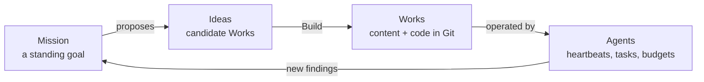

# Frequently Asked Questions

## Launch questions

The questions people ask first, answered against what the platform actually does today. Where something is only partly built, this page says so and links to the page that carries the detail.

Routes below are written without the locale prefix: the address bar shows `/en/works`, this page says `/works`.

### What are Missions, Ideas and Works?

Three levels of the same model. You can enter at any of them.

| Level       | What it is                                                                                                              | Where it lives                                              |
| ----------- | ----------------------------------------------------------------------------------------------------------------------- | ----------------------------------------------------------- |
| **Mission** | A long-running goal. It decides _which_ Works are worth building, spawns Ideas, and stays open until you complete it.   | `/missions` · [Missions](./features/missions.md)            |
| **Idea**    | A proposed Work — a title, a description and suggested categories, fields and plugins, waiting for you to build it.     | `/ideas` · [Ideas](./features/ideas.md)                     |
| **Work**    | The thing that gets built and then kept alive: a website, landing page, blog, directory or awesome repo, backed by Git. | `/works` · [Creating a Work](./features/creating-a-work.md) |



**Starting at the top:**

1. Sidebar → **+ New** (`/new`) and type the goal in the composer.
2. Pick the **Mission** chip and submit. A Mission is one-shot by default; on `/missions/:id` you can switch it to scheduled and enter a five-field cron expression.
3. Use **Run now** on the Mission, and its proposals arrive at `/ideas`.
4. On an Idea card click **Build**. It moves `QUEUED` → `BUILDING` → `ACCEPTED`, and the finished Work opens at `/works/:id`.

**Starting at the bottom:** pick a Work kind chip on `/new` instead — you land on `/works/new` and build one Work directly, no Mission required.

### What exactly is an Agent?

A named, persistent AI worker you create and keep — a "CEO", a "Researcher", a "PR Reviewer" — not a one-shot prompt. Every Agent carries an identity (`name`, `title`, `capabilities`), a **scope** (exactly one of Tenant, Mission, Idea or Work), a provider and model, an optional **heartbeat** cron cadence, a spend **budget**, and a permission set whose flags (`canAssignTasks`, `canCommitToRepo`, `canCallExternalTools`, …) all default to `false`.

Its brain is five files — `SOUL.md`, `AGENTS.md`, `HEARTBEAT.md`, `TOOLS.md` and `agent.yml` — stored in the scope's Git repository, so you own and version them.

You do not have to create one to get started: the built-in **Work Agent** turns a goal into Ideas and Ideas into Works with zero setup. Agents you define are the layer you reach for when you want a standing team.

**To create one:**

1. Sidebar → **Teams** → **Agents** tab → **+ New Agent**.
2. Give it a name, a title and a `capabilities` description.
3. Pick a provider and model, or keep your account default.
4. Choose the scope — Tenant for a company-wide role, or one Mission / Idea / Work.
5. Create it (it starts in `draft`), open the **Dashboard** tab and click **Start**, then set a heartbeat cadence and a budget.

See [Agents](./features/agents.md) and the ready-made [Agents Catalog](./features/agents-catalog.md).

### Who owns what Ever Works builds?

You do, in two concrete senses.

- **The platform is open source.** Ever Works is licensed **AGPL-3.0** (`LICENSE` at the repository root), so you can read it, fork it and run it yourself.
- **The output is plain Git.** Every Work is materialised as repositories — for a Work with slug `my-work`: `my-work-data` (YAML items, categories, configuration), `my-work` (the markdown / README repository) and `my-work-website` (the generated site code). They live on your Git provider (GitHub today, through the GitHub plugin or the GitHub App), or on managed Git storage if you chose the managed path.

Your Agents' definition files live in those same repositories, and **Settings → Data management** exports your data or deletes the account outright. See [Git Operations](./features/git-operations.md) and [Data Management](./features/data-management.md).

### Can I run Ever Works on my own infrastructure?

Yes. Two of the three paths below are shipped and run the same container images as the managed service; the third, the desktop app, is in early access — the code is in the monorepo, but there is no public installer yet.

| Path               | What you run                                                                                                                                                          | Status                                                                                                                                                                                                                                                                                       |
| ------------------ | --------------------------------------------------------------------------------------------------------------------------------------------------------------------- | -------------------------------------------------------------------------------------------------------------------------------------------------------------------------------------------------------------------------------------------------------------------------------------------- |
| **Docker Compose** | Five layered Compose files at the repository root — a SQLite demo up to the full stack: web (`:3000`), API (`:3100`), MCP (`:3200`), docs (`:3300`), Postgres, Redis. | Shipped — [Self-host with Docker & K8s](./guides/self-host-docker-kubernetes.md)                                                                                                                                                                                                             |
| **Kubernetes**     | Plain manifests under `.deploy/k8s`, applied with `envsubst` + `kubectl apply`.                                                                                       | Shipped. **There is no Helm chart** — copy the manifests.                                                                                                                                                                                                                                    |
| **Desktop app**    | The whole platform as one local application on your own machine, or a native client onto an instance you already run.                                                 | **Early access** — implemented in the repo (`apps/desktop`), in local-stack or remote-client mode; there is no public installer yet, so build from source or take a CI workflow artifact. See [Desktop App](./features/desktop-app.md) and the [Desktop App guide](./guides/desktop-app.md). |

Two values must be set before your first `docker compose up`, or the API exits during boot: `AUTH_SECRET` (at least 32 characters — `openssl rand -base64 48`) and `PLATFORM_ENCRYPTION_KEY` (`openssl rand -hex 32`). Nothing in the stack terminates TLS for you, so put your own proxy in front of ports 3000 and 3100 before exposing a host.

### Can I use Ever Works from my AI assistant, or from a terminal?

Both, and they talk to the same REST API.

**From an AI assistant (MCP).** The Ever Works MCP server (`apps/mcp`) turns the API into tools: **66 whitelisted operations** across Works, generation, items, deployment, plugins, scheduling, comparisons, Missions, Ideas and account usage, plus the `kb.*` Knowledge Base tools, `register_work` and `ping` (74 tools in all). It runs in `stdio` mode for desktop AI assistants and coding agents that speak MCP over stdio, or `streamable-http` for remote clients, and authenticates with an [API key](./features/api-keys.md) (`ew_live_…`).

```bash
EVER_WORKS_API_KEY=ew_live_... pnpm --filter=ever-works-mcp start:stdio
```

Agent endpoints are **not** on the MCP whitelist today — drive Agents from the dashboard, the in-app chat or the REST API. Setup: [MCP Server](./features/mcp-server.md) and [MCP Server Setup](./guides/mcp-server-setup.md).

**From a terminal (CLI).** `ever-works-cli` has four command groups — `auth`, `work`, `plugins` and `kb`:

```bash
npm install -g ever-works-cli
ever-works auth login --api-url https://api.ever.works
ever-works work create
ever-works work generate
ever-works work deploy
```

See the [CLI Quickstart](./guides/cli-quickstart.md) and the [command reference](./cli/commands.md).

### What does it cost, and can I bring my own API keys?

**Credits** are the unit of consumption — agent runs, pipelines and AI calls debit them. There is no separate balance column: your balance is the sum of your ledger movements, shown at **Settings → Billing** and explained at **Settings → Usage & Credits** (`/settings/usage`).

| Bucket                 | Amount                                                            |
| ---------------------- | ----------------------------------------------------------------- |
| Daily allowance        | 50 credits, every plan, topped up **to** 50 (never accumulating). |
| Monthly plan allowance | 3,000 (Pro) / 25,000 (Enterprise), expiring at the month end.     |
| Credit packs           | $10 / 1,000 · $50 / 5,500 · $200 / 25,000.                        |
| Pay-as-you-go          | Opt-in, needs a card, hard monthly cap (default 10,000 credits).  |

Purchase, payment-method and auto-recharge surfaces are gated behind `PAYMENTS_ENABLED` (default off) **and** a configured billing provider; with either missing, the Billing page shows a "coming soon" card in their place. Self-hosted plan codes carry no `credit-limited` entitlement and are never metered. Full behaviour: [Credits & Billing](./features/credits-and-billing.md).

**BYOK: yes.** No model is hard-wired. Every AI call resolves an AI provider plugin at the moment of the call, so you can paste your own key at `/settings/plugins/ai-provider`, override it per Work at `/works/:id/plugins`, or point the platform at a model running on your own hardware (Ollama, LM Studio, vLLM). See [Bring Your Own AI Provider](./guides/bring-your-own-ai-provider.md).

### Which kinds of Work can I build today, and which are coming?

| Kind           | How it is created                                              | Status                                                                             |
| -------------- | -------------------------------------------------------------- | ---------------------------------------------------------------------------------- |
| `website`      | **Website** chip on `/new` or `/works/new`                     | Shipped                                                                            |
| `landing-page` | **Landing Page** chip (`landing` is accepted as an alias)      | Shipped                                                                            |
| `blog`         | **Blog** chip                                                  | Shipped                                                                            |
| `directory`    | **Directory** chip                                             | Shipped                                                                            |
| `awesome-repo` | **Awesome Repo** chip                                          | Shipped                                                                            |
| `company`      | **Company** chip on `/new` → the Register-Company dialog       | Shipped as v1 (see below); never minted by the general create path                 |
| `campaign`     | **Start a campaign** on `/works/new` → campaign activation     | Minted only by campaign activation                                                 |
| `default`      | Any Work created without a kind (CLI, API with `kind` omitted) | Shipped — behaves exactly like `directory`                                         |
| Store          | The **Store** chip                                             | **Coming soon** — the chip is inert and there is no `store` kind in the vocabulary |

One honest caveat: `website`, `landing-page` and `blog` are fully wired at the platform level — chip, persisted kind, capability registry, `web` template default and per-kind `works.yml` — but the generation pipeline they run is the shared items pipeline. There is no dedicated blog-post or landing-copy generator yet, so those Works get the template plus items-pipeline content. [Work Kinds & Capabilities](./features/work-kinds.md) spells out what each kind has.

### What is the status of the Store and the Company?

- **Store — coming soon.** The Store chip renders as an inert **Soon** chip (its `works-store` flag resolves to `false`) and there is no `store` entry in the kind vocabulary. The storefront generator and the commerce integrations are on the roadmap: [Store Builder](./features/store-builder.md).
- **Company — partly here.** The Register-Company flow mints a Company Work plus an Organization today (v1 uses a manual registration provider), and prebuilt company templates can be imported from the catalog. The "company-as-a-business" surface and the formation-provider integrations are still coming: [Company Builder](./features/company-builder.md), [Teams](./features/teams.md).

### Which AI providers, search engines and deploy targets are supported?

The platform ships **102 plugins**, and capabilities are resolved at call time — so swapping a provider is a settings change, not a code change. The largest categories:

| Capability             | Count | Examples                                                                                                                   |
| ---------------------- | ----- | -------------------------------------------------------------------------------------------------------------------------- |
| AI providers           | 11    | OpenAI, Anthropic, Google, Groq, Mistral, xAI, Ollama, LM Studio, vLLM, plus the OpenRouter and Vercel AI Gateway gateways |
| Pipelines              | 14    | The 15-step standard pipeline, the agent pipeline, coding-agent and automation runners                                     |
| Search                 | 9     | Tavily (default), Brave, Exa, Perplexity, SerpAPI, Firecrawl, Linkup, Valyu, Bright Data                                   |
| Content extraction     | 6     | Local extractor (default), Jina, Notion, PDF, Office documents, Scrapfly                                                   |
| Screenshots            | 2     | ScreenshotOne, Urlbox                                                                                                      |
| Git provider           | 1     | GitHub (plugin, OAuth and GitHub App)                                                                                      |
| Deployment             | 2     | Vercel, Kubernetes — plus managed hosting on `*.ever.works`                                                                |
| Storage, vector stores | 4 + 2 | Local FS (default), S3, MinIO, GitHub storage; pgvector (default), Qdrant                                                  |
| Email, channels        | 5 + 5 | Resend, SendGrid, Postmark, Mailgun, Mailchimp; Slack, Discord, Telegram, WhatsApp, Novu                                   |

Enable and configure them per capability at `/settings/plugins/<capability>`. For deployment specifically: **Vercel**, **your own Kubernetes cluster** ([Kubernetes Deployment](./features/k8s-deployment.md)), or **managed hosting** — a `<slug>.ever.works` address with DNS, a Postgres database per Work and the cluster supplied for you ([Managed Hosting](./features/managed-hosting.md)). Custom domains run through the Cloudflare DNS plugin: [Custom Domains](./features/custom-domains.md).

### How do I stop an Agent doing something I did not want?

Autonomy is configured, never assumed. Eight independent controls, each set separately:

| Control                     | What it does                                                                                                                                                                                                   |
| --------------------------- | -------------------------------------------------------------------------------------------------------------------------------------------------------------------------------------------------------------- |
| **Permission flags**        | Eight per-Agent flags (`canCommitToRepo`, `canCallExternalTools`, …) gating which tools an Agent may call. All default to `false`.                                                                             |
| **Guardrail modes**         | `require_approval` or `autonomous`, with auto-approve rules and blocked action types.                                                                                                                          |
| **Approval queue**          | Side-effectful action proposals wait for you on the dashboard home and in the Inbox.                                                                                                                           |
| **Escalations & questions** | A run that gives up escalates (confidence-scored); a run that must ask parks until you answer. Both land in `/inbox`.                                                                                          |
| **Budgets**                 | A per-Agent cap (hourly through monthly, or unlimited) checked before every AI call; repeated failures auto-pause the Agent.                                                                                   |
| **Quality gates**           | Acceptance checks on a Task must go green; red sends the Agent back to iterate instead of shipping.                                                                                                            |
| **Merge policy**            | A four-scope matrix deciding whether an Agent's branch merges automatically or waits for a human.                                                                                                              |
| **Task isolation**          | Off by default. Set `taskIsolation` to `worktree` (Work → Settings → Tasks & Branches) and each agent-executed Task gets its own branch and checkout, and opens a pull request instead of committing directly. |

Task isolation is the one control that is off until you switch it on, so turn it on first if you want the branch guarantee: with `taskIsolation` left at its default `off`, an agent-executed Task writes straight to the Work's repositories. See [Approvals, Escalations & Guardrail Modes](./features/approvals-and-escalations.md), [Budgets & Usage](./features/budgets-and-usage.md), [Quality Gates](./features/quality-gates.md), [Merge Policy](./features/merge-policy.md) and [Task Isolation](./features/task-isolation.md).

<!--
  OPERATOR NOTE — do not delete the questions below; verify them before launch.
  The "Template" answers (Next.js 15 / HeroUI / Prisma / Supabase / NextAuth /
  Stripe + LemonSqueezy + Polar) and the "What is Pinler.com?" answer describe
  repositories and a deployment that are NOT part of this monorepo, so nothing
  in this checkout can confirm or refute them. Check them against
  ever-works/directory-web-template and ever-works/web-template (and with the
  site owner for Pinler), then correct or keep them as written. Everything
  under "Launch questions" above is backed by code in this repository.
-->

## General

### What is the difference between the Platform and the Template?

The **Template** is a standalone, production-ready Next.js website you can clone, customize, and deploy. The **Platform** is the backend infrastructure (APIs, AI agents, plugin system) that can power one or many work websites at scale.

### Can I use the Template without the Platform?

Yes. The Template works independently as a self-contained Next.js application with its own API routes, authentication, and database.

### What is Pinler.com?

[Pinler.com](https://pinler.com) is a SaaS work service built on top of the Ever Works Platform and Template. It demonstrates a production deployment of the full Ever Works stack.

## Template

### What technologies does the Template use?

Next.js 15, React 19, TypeScript, Tailwind CSS, HeroUI React, Prisma ORM, PostgreSQL, and Supabase.

### Which authentication providers are supported?

Google, GitHub, Facebook, Twitter, and Microsoft via NextAuth.js v5, plus Supabase Auth.

### Which payment providers are supported?

Stripe, LemonSqueezy, and Polar with subscription management support.

### How do I deploy the Template?

See the [Deployment Guide](/devops/docker) for instructions on deploying to Vercel, Docker, or cloud providers.

## Platform

### What language is the Platform API written in?

TypeScript, using the NestJS framework.

### Does the Platform support AI features?

Yes — AI is the platform, not an add-on to it. Model access is delivered by **11 `ai-provider` plugins** (OpenAI, Anthropic, Google, Groq, Mistral, xAI, Ollama, LM Studio, vLLM, plus the OpenRouter and Vercel AI Gateway gateways), resolved at call time by the AI facade, so no model is hard-wired.

There are two AI runtimes underneath: the agent pipeline and the research loop run on the **Vercel AI SDK** (`ai` v6 with `@ai-sdk/openai-compatible`), while the classic provider plugins reach their models through `AiOperations` in `@ever-works/plugin/ai`, which wraps a LangChain-compatible chat client. Either way you configure one thing — the provider plugin — and you can bring your own key. See [Bring Your Own AI Provider](./guides/bring-your-own-ai-provider.md) and the [Plugin System](./plugin-system/index.md).

## Support

### Where can I get help?

See the [Support page](/support) for community channels, professional support options, and troubleshooting guides.

## Related

- [Glossary](./glossary.md) — the vocabulary used across these answers
- [Platform Tour](./guides/platform-tour.md) · [Quickstart: Directory](./guides/quickstart-directory.md)
- [Missions](./features/missions.md) · [Ideas](./features/ideas.md) · [Creating a Work](./features/creating-a-work.md) · [Work Kinds](./features/work-kinds.md)
- [Agents](./features/agents.md) · [Teams](./features/teams.md) · [Autonomous Operation](./features/autonomous-operation.md)
- [Credits & Billing](./features/credits-and-billing.md) · [Plugins](./features/plugins.md) · [MCP Server](./features/mcp-server.md) · [CLI Overview](./cli/index.md)
- [Roadmap](./roadmap.md) · [Support](./support.md)
