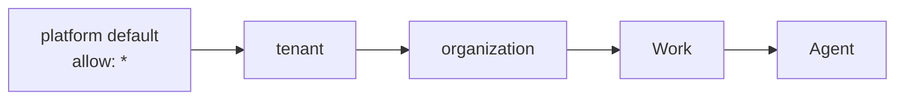

# Agent Capabilities

An [Agent](./agents.md)'s **permissions** say what _class_ of thing it may do — commit, open pull requests, call the outside world. Its **capabilities** say exactly which tools, MCP servers, repositories and runtime it will find in front of it on the next run.

The **Capabilities** tab is the one page that answers "what can this Agent actually do?", and — because tool access narrows downward through a four-scope matrix — also "and who decided that?".

:::note Where to find it
**Sidebar → Teams → Agents** tab → open any Agent → **Capabilities** (`/agents/:id/capabilities`).

An Agent detail page carries ten tabs: **Dashboard**, **Activity**, **Terminal**, **Instructions**, **Skills**, **Capabilities**, **MCP Servers**, **Collaborators**, **Budgets**, **Settings**.
:::

## The seven sections

| Section             | What it controls                                         | Written through                                            |
| ------------------- | -------------------------------------------------------- | ---------------------------------------------------------- |
| **Agent tools**     | Per-tool allow / deny for this Agent (narrowing only)    | `PUT /api/tool-grants` · `DELETE /api/tool-grants/:id`     |
| **Permissions**     | The eight capability flags — shown read-only here        | `PATCH /api/agents/:id` (edited on the **Settings** tab)   |
| **Skills**          | Skills bound directly to this Agent, plus inherited ones | The Agent's skill-binding endpoints                        |
| **MCP Connections** | Which registered MCP servers this Agent may use          | `PUT` / `DELETE /api/agents/:id/mcp-servers/:connectionId` |
| **Repositories**    | Which registry repositories this Agent may work in       | `PUT` / `DELETE /api/agents/:id/repos/:repoConnectionId`   |
| **Environment**     | The published Environment the Agent runs in              | `PATCH /api/agents/:id` (`environmentId`)                  |
| **Init Script**     | A bootstrap script for the Agent's session workspace     | `PATCH /api/agents/:id` (`initScript`)                     |

One composed read — `GET /api/agents/:id/capabilities` — answers the tools, permissions and init-script sections in a single request; skills, MCP servers, repositories and environments ride their own existing endpoints and are composed server-side.

:::info This tab consolidates, it does not move anything
The standalone **MCP Servers** tab, the **Repositories** card on **Settings**, and the Environment picker on **Settings** all keep working, over exactly the same endpoints. Capabilities is a second view over the same state, so every section here re-reads (MCP) or patches only the row it owns (repositories) rather than assuming it is the only writer.
:::

Each secondary read is defensive: a flaky Skills, MCP, registry or Environments API degrades _its own section_ (empty picker, empty list) instead of turning the page into an error.

## Agent tools — the tool-grant matrix

### Four scopes, one rule

Tool access resolves down the same four-scope lattice the [Merge Policy](./merge-policy.md) uses, layered over a platform default:



Every step may only ever **narrow** what the step before it granted. That single rule is what makes the matrix a security boundary rather than a preference:

- An `allow` list is **intersected** with what the ancestors already granted. A pattern the ancestors never granted is **rejected**, not applied — and the rejection is reported, so an operator can see the grant did nothing instead of wondering why it had no effect.
- A `deny` is **additive and permanent**. Once a scope denies a tool, nothing beneath it can re-enable it — not even an explicit `allow: ["*"]`.
- **Deny wins** whenever both an allow and a deny pattern match the same tool.
- Omitting a field means **inherit**. It never means "false".

The platform default is deliberately permissive — `allow: ["*"]`, `deny: []` — because the matrix landed after tools had already shipped. It subtracts nothing until you write your first row.

### The two policy matrices, side by side

|                            | Merge policy                                                        | Tool grants                                                                        |
| -------------------------- | ------------------------------------------------------------------- | ---------------------------------------------------------------------------------- |
| Platform default           | **Restrictive** — Agents may not merge                              | **Permissive** — `allow: ["*"]`                                                    |
| A more specific scope may… | set any field either way                                            | only **narrow**, never widen                                                       |
| Why                        | merging is destructive and irreversible, so opting in is deliberate | the matrix arrived after tools shipped, so it subtracts nothing until a row exists |
| Stored as                  | a `mergePolicy` field on an existing entity                         | its own row, one per scope                                                         |

Because a tool grant is its own row rather than a field on an entity, it has its own write path (`PUT /api/tool-grants`) instead of riding an entity `PATCH`.

### Reading the tools list

Tools are grouped by where they come from, and the grouping is computed from the real tool assembly rather than hand-maintained — a new domain tool appears in this list the day it ships:

| Group              | Source                                                                                                | Examples                                                    |
| ------------------ | ----------------------------------------------------------------------------------------------------- | ----------------------------------------------------------- |
| **Built-in tools** | Always assembled for every Agent                                                                      | `getActivity`, `getKbDocument`, `createSubAgent`            |
| **Platform tools** | Provided by a platform facade — Git, plugins, email, notification channels                            | `commitToRepo`, `openPullRequest`, `sendEmail`, `searchWeb` |
| **Domain tools**   | Provided by a domain surface — tasks, digests, meetings, fleet, PR review, browser, policy, workflows | `createTask`, `resolve_merge_policy`, `resolve_tool_grants` |

Each row carries the tool's name, its description, and a switch. When the switch is disabled, a badge says why:

| Badge                                 | Meaning                                                                                           | What to do                                                             |
| ------------------------------------- | ------------------------------------------------------------------------------------------------- | ---------------------------------------------------------------------- |
| **Denied by _scope_**                 | A tenant, organization or Work above this Agent denies the tool. The Agent scope may only narrow. | Change the grant at that scope.                                        |
| **Denied by a pattern on this agent** | This Agent's own row denies the tool through a wildcard (for example `git_*`).                    | Use **Reset to inherited**, then re-deny the exact names you want off. |
| **Permission off**                    | The tool's permission flag is off, so the tool is never assembled at all.                         | Turn the flag on under the Agent's **Settings** tab.                   |

A tool is only usable when **both** answers are yes: the permission flag is on **and** the resolved matrix allows it.

**Reset to inherited** appears only when this Agent has a grant row of its own; it deletes the row so the Agent inherits everything from its Work, organization and tenant again.

### Pattern syntax

Grant patterns are deliberately tiny — three forms and nothing else, matched case-insensitively, because a grant that silently misses on capitalisation is a security bug rather than a nicety:

| Pattern      | Matches                                    |
| ------------ | ------------------------------------------ |
| `*`          | every tool                                 |
| `prefix*`    | every tool whose name starts with `prefix` |
| `exact_name` | that one tool                              |

A tool name must match `^[A-Za-z0-9_.:-]{1,120}$`; an allow or deny pattern is the same, optionally with a single trailing `*`. Each of `allow` and `deny` accepts at most **200 patterns**, and the operator `note` at most **500 characters** — a grant list is a policy, not a database.

### The API

| Endpoint                                                        | Purpose                                                                                                               |
| --------------------------------------------------------------- | --------------------------------------------------------------------------------------------------------------------- |
| `GET /api/tool-grants/resolve?workId=&agentId=&organizationId=` | The effective matrix, the `source` scope, and the full `chain` (least → most specific, including rejected patterns).  |
| `GET /api/tool-grants/check?toolName=&workId=&agentId=`         | One tool, one answer: `allowed`, the deciding `source`, a stable `code` and a human-readable reason.                  |
| `GET /api/tool-grants`                                          | List your own stored grant rows, one per scope.                                                                       |
| `PUT /api/tool-grants`                                          | Create or update one scope's row. A second write for the same scope **updates** it — a scope never contributes twice. |
| `DELETE /api/tool-grants/:id`                                   | Delete a row; that scope goes back to inheriting.                                                                     |

`resolve` and `check` require at least one of `workId`, `agentId` or `organizationId` — a bare call would only echo the permissive default and tell you nothing about your own setup.

The chain is the point. _"That tool isn't available"_ is only actionable if the answer also says **where** the restriction came from, so every layer reports what it contributed **and** what it asked for and was refused.

`PUT` replaces the whole row, which is why the Capabilities switches always re-send the complete desired `allow` / `deny` pair (and carry your `note` along) instead of sending a delta.

### Refusal codes

| Code                | Meaning                                                                                  |
| ------------------- | ---------------------------------------------------------------------------------------- |
| `tool-denied`       | A `deny` pattern in the effective matrix matches the tool. The reason names the pattern. |
| `tool-not-granted`  | No `allow` pattern matches. The reason lists the effective allow set.                    |
| `tool-name-invalid` | The tool name was empty or not a string — refused before any pattern is tried.           |

### Ownership and failure posture

Every read and write is owner-checked against the same rules: a Work you cannot reach, an Agent you do not own, an Organization outside your Tenant, or any Tenant that is not your own all resolve to **404** — never 403, so the endpoint can never become a cross-tenant policy oracle.

Enforcement deliberately **fails open** in one narrow case: if the grant lookup itself throws (a transient database blip), the run falls back to the permission gates rather than stripping every Agent of every tool. An access matrix that failed closed on its own infrastructure hiccup would take the product down; the permission flags and the platform's other guardrails still apply.

## Permissions — the eight flags

The Capabilities tab shows all eight flags read-only, with an **Edit in Settings** link to `/agents/:id/settings`. Every flag defaults to `false`.

| Flag                   | Label in the UI     | What it unlocks                                                                                                                                                      |
| ---------------------- | ------------------- | -------------------------------------------------------------------------------------------------------------------------------------------------------------------- |
| `canCreateAgents`      | Create agents       | `createSubAgent` — new Agents are always created in `draft`.                                                                                                         |
| `canAssignTasks`       | Assign tasks        | The task tools, the workflow-graph runner, and `delegateToAgent`.                                                                                                    |
| `canEditSkills`        | Edit skills         | Skill editing. It gates no tool descriptor at assembly time today.                                                                                                   |
| `canEditAgentFiles`    | Edit instructions   | `editAgentFile` — capped at one edit per file per run.                                                                                                               |
| `canSpend`             | Spend budget        | Reserved. Spend is enforced by the Agent's [budget](./budgets-and-usage.md) row, not by this flag today.                                                             |
| `canCommitToRepo`      | Commit to repo      | `commitToRepo`. Mission-, Idea- and Tenant-scoped Agents still receive a clear "scope is not a Work" refusal at call time.                                           |
| `canOpenPullRequests`  | Open pull requests  | `openPullRequest`. Enabling it implies `canCommitToRepo` — the service turns commit rights on automatically, so a pull request can never appear without them.        |
| `canCallExternalTools` | Call external tools | The outbound-network risk class as one gate: `searchWeb`, `screenshot`, `extractContent`, `sendEmail`, `messageAgent`, `notifyChannel`, browser and PR-review tools. |

Turning a flag off removes the tool from the run entirely — it is never assembled, so the model does not see it. That is a stronger statement than a deny in the matrix, which withholds an assembled tool and reports the refusal.

## Skills

The **Skills** section binds [Skills](./skills-catalog.md) directly to this Agent. The **Attach a skill…** picker offers every Skill you already have installed; catalog entries you have not installed yet appear with an **install & attach** hint and are installed in one step when picked.

Bindings inherited from a parent scope are listed read-only with an **Inherited** badge naming the scope that owns them — manage those where they were created. Every row shows the Skill's slug, version and priority.

## MCP Connections

MCP servers are registered once under **Settings → Connections**, then bound per Agent.

- Tenant-wide connections are **inherited** by every Agent unless that Agent overrides them; the row is badged **Inherited from tenant**.
- Switching a row off for one Agent writes an Agent-level override (badged **Override**); **Reset to inherited** removes it.
- A connection disabled workspace-wide **cannot** be turned on for a single Agent — the switch is locked and the row is badged **Connection disabled**. This is the same rule the standalone **MCP Servers** tab enforces.
- Each row shows the connection's transport and URL, so two servers with similar names stay distinguishable.

| Endpoint                                                | Purpose                                                                |
| ------------------------------------------------------- | ---------------------------------------------------------------------- |
| `GET /api/agents/:agentId/mcp-servers`                  | Every connection with this Agent's effective state and inherited flag. |
| `PUT /api/agents/:agentId/mcp-servers/:connectionId`    | Set the Agent-level override (`enabled: false` narrows inheritance).   |
| `DELETE /api/agents/:agentId/mcp-servers/:connectionId` | Remove the override — revert to tenant inheritance.                    |

:::tip MCP tools obey the tool-grant matrix too
Tools exposed by a bound MCP server are named `mcp__<server>__<tool>` and are appended **before** the grant check, so they flow through the same allow / deny patterns as every built-in tool. A `deny` of `mcp__*` at the tenant scope switches off every MCP tool everywhere beneath it. A server-supplied name that collides with a built-in tool is dropped with a warning rather than shadowing it.
:::

Ever Works is also an MCP **server** — see [MCP Server](./mcp-server.md) for the other direction.

## Repositories

Repositories come from your registry under **Settings → Repositories**, which holds manually registered repositories, GitHub-App imports, and rows derived from a Work.

- Manually registered and GitHub-App imported rows are toggleable here — the switch attaches or detaches the repository for this Agent.
- Rows **derived from a Work** (and any row the registry marks read-only) show a **From _source_** badge and an **Attached** / **Not attached** state instead of a switch. Their attachment follows the Work assignment, so a toggle here would only fight the Work.

| Endpoint                                              | Purpose                                                   |
| ----------------------------------------------------- | --------------------------------------------------------- |
| `GET /api/agents/:agentId/repos`                      | Registry repositories with this Agent's attachment state. |
| `PUT /api/agents/:agentId/repos/:repoConnectionId`    | Attach the repository (or set its `enabled` flag).        |
| `DELETE /api/agents/:agentId/repos/:repoConnectionId` | Detach it.                                                |

Both the Agent and the repository must belong to you; anything else reads as 404. What the Agent may then _do_ inside a repository is still governed by `canCommitToRepo`, `canOpenPullRequests` and the [Merge Policy](./merge-policy.md) — see [Git Operations](./git-operations.md).

## Environment

An **Environment** is a named runtime recipe, created and published under **Settings → Environments**. The picker on this tab offers **published** Environments only, plus **None (default)** — the server refuses an attempt to assign a draft with a `422`, so the picker offers exactly what it will accept.

Environments are created as drafts (`POST /api/environments`) and published explicitly. Deleting an Environment that an Agent still references is refused with a `409`, so an assignment can never dangle.

Selecting **None (default)** clears the assignment and the Agent falls back to the platform default runtime.

## Init Script

A short shell script stored on the Agent and surfaced to the runtime at session / workspace bootstrap — the place to install a CLI the Agent leans on, or export a non-secret setting.

- **16 KB** maximum. The editor shows live byte usage and refuses to save past the cap.
- The body is **scanned for secrets** on save and rejected outright if any secret-like value is found — the same posture as the five canonical Agent definition files. Credentials belong in plugin settings or the credential resolver, never in a script body.
- Saving an empty editor clears the field rather than storing an empty string.

:::caution Advisory in v1
The init script is stored, validated and handed to the runtime **where the runtime supports it**. No platform-side executor consumes it today, so treat it as a declaration of intent for compatible runners rather than a guaranteed pre-run hook. Anything an Agent must reliably have should be baked into its [Environment](#environment) instead.
:::

## Collaborators — the sub-agent allow-list

The **Collaborators** tab (`/agents/:id/collaborators`) answers a different question from Capabilities: not "what may this Agent use?" but "**which other Agents may it put to work?**".

Every other Agent you own is listed as a candidate — new Agents appear automatically — each with a switch:

- **No rules configured at all** ⇒ the Agent may delegate only **to itself**. The tab says so explicitly, because an all-off list that means "off" and one that means "never configured" would otherwise look identical.
- **Switch on** ⇒ that Agent may be named as the child of a delegation.
- **Switch off** ⇒ the rule row is kept (with its history) but refuses delegation.
- **Clear rule** ⇒ the row is deleted and the pair returns to unconfigured.

| Endpoint                                                    | Purpose                                                                  |
| ----------------------------------------------------------- | ------------------------------------------------------------------------ |
| `GET /api/agents/:id/collaborators`                         | Every other Agent you own, each with its `configured` / `enabled` state. |
| `PUT /api/agents/:id/collaborators/:collaboratorAgentId`    | Enable or disable one collaborator (idempotent upsert).                  |
| `DELETE /api/agents/:id/collaborators/:collaboratorAgentId` | Remove the rule entirely.                                                |

An Agent cannot be its own collaborator (`400`), and a foreign Agent id on either end of the edge resolves to `404`. Every edit is written to the [activity log](./activity.md).

### How a run delegates

With `canAssignTasks` on, the Agent gains the `delegateToAgent` tool — the descriptor is assembled from that flag alone, provided the delegation and collaborator services are bound in the runtime (and if no execution runner is registered behind them, the call is refused with `no-runner` rather than silently dropped). The Collaborators list is enforced at call time, not at assembly time: until at least one collaborator is enabled, only the Agent **itself** resolves as a target, and every other name is refused with `collaborator-not-allowed` and the (empty) roster — _"No collaborators are enabled for this agent"_ — so the model is told what to do next rather than left guessing.

The tool targets a child by `targetAgentId` or `targetAgentSlug`, hands over an objective in prose (up to 2000 characters) plus optional structured context, and **waits** for the child's typed result.

What the platform does with that call:

1. **Narrow the scope.** The child's scope is the _intersection_ of what it asked for and what the parent already had. Privilege can only shrink going down the tree — a child can never turn network access on when the parent had it off, and its tool set is intersected with the parent's real resolved tool list.
2. **Check the bounds.** Delegation depth is capped (default **3**) and sibling fan-out per run is capped (default **5**). The declared depth is a floor only: the platform re-derives the true depth from the persisted Task chain and **raises** it, so a caller that declares depth 0 on every hop cannot recurse forever.
3. **Check the allow-list.** A named child must be an enabled collaborator of the parent, must belong to the same owner, and must not be archived.
4. **Run it as a real Task.** The delegation creates a **child Task** linked to the parent and dispatches it down the same path a human-assigned Task takes — so it is observable in the UI, cancellable, rate-limited, budgeted and attributable. It is not a side channel.
5. **Return a typed result.** Always one of `completed`, `failed`, `refused` or `escalated`, with a one-line summary a human can read without opening anything.

A refusal means the contract said no **before anything ran**, and nothing was spent:

| Refusal code               | Meaning                                                                |
| -------------------------- | ---------------------------------------------------------------------- |
| `collaborator-not-allowed` | The named child is not an enabled collaborator — or is archived.       |
| `depth-exceeded`           | The delegation chain is already at the depth cap.                      |
| `fanout-exceeded`          | This run has already issued the maximum number of sibling delegations. |
| `scope-not-subset`         | The requested scope reaches beyond the parent's.                       |
| `scope-empty`              | Intersecting the requested scope with the parent's left nothing.       |
| `budget-exceeded`          | The requested budget exceeds the ceiling the parent may pass down.     |
| `invalid-request`          | The request failed validation (missing objective, malformed fields).   |
| `no-runner`                | No delegation runner is bound in this process.                         |

Calling `delegateToAgent` with an unknown or not-enabled target returns the **current list of enabled collaborators** (name and slug) rather than a bare refusal, so the Agent can correct itself on the next call.

Delegation is distinct from `createSubAgent` (gated by `canCreateAgents`), which creates a brand-new Agent row in `draft` rather than putting an existing one to work.

## Credentials and tool grants

Tool grants decide **whether a tool runs at all**. Credentials decide **whether its outbound call can be made**. They are separate gates, and both refuse rather than degrade.

A tool argument may reference a secret with `{{cred.<key>}}` — the only credential syntax the platform understands. The model writes the _reference_; the server substitutes the _value_ immediately before the outbound call. Three invariants hold everywhere:

1. **Server-side only.** Resolution happens in the tool-invocation path, never during prompt assembly, so a secret is never a token in a system message.
2. **Never logged.** Every error names the missing **keys**, never the values. If the resolver itself throws, the call fails with a flat `Credential resolution failed.` — the underlying message (which might quote a value) is discarded.
3. **Never echoed back.** Any resolved value that turns up in a tool's _result_ is redacted before that result re-enters the conversation, so an API that reflects its own auth header cannot hand the secret to the model.

Other behaviour worth knowing:

- A call that references a credential the platform cannot resolve is **refused**, and the refusal names both the reference and the environment variable an operator should set — while explicitly telling the Agent **not** to ask a human to paste the secret into chat.
- Arguments with no credential reference take a fast path and never touch the resolver at all, and other mustache-style templates are not mistaken for credential references.
- Credentials always resolve for the **Agent's owner**, never for a model-supplied identity in the arguments.
- The default, self-hosting-friendly resolver reads the operator environment: `{{cred.stripe_key}}` reads `EVERWORKS_CRED_STRIPE_KEY`. The prefix is mandatory — without it a tool argument could name `DATABASE_URL` or a platform key. Multi-tenant deployments bind a store-backed resolver instead.

:::note The credential catalog is empty today
No built-in tool requires a credential, so the catalog of known keys ships empty on purpose. What ships is the **mechanism** plus a CI check: a tool that starts needing a secret declares its key, and the check fails the build if a requirement names a tool that does not exist, a key no catalog entry defines, or an environment variable that does not match what the resolver actually reads.
:::

## How to: lock a new Agent down to three tools and one repository

The goal: a Coder Agent that may read the Knowledge Base, commit, and open pull requests — and nothing else — in exactly one repository.

1. **Create the Agent.** Sidebar → **Teams** → **Agents** tab → **+ New Agent**. Give it a name and a Work scope; [Agents](./agents.md) has the full walkthrough.
2. **Turn on only the permissions it needs.** Open the Agent's **Settings** tab and enable `canCommitToRepo` and `canOpenPullRequests`. Leave `canCallExternalTools`, `canCreateAgents`, `canAssignTasks` and `canEditAgentFiles` off — those tools are then never assembled, which is stronger than denying them.
3. **Narrow the tool list.** Open **Capabilities** → **Agent tools** and switch off everything you do not want. Each toggle rewrites this Agent's grant row; parent-scope denials stay locked, as they should.
4. **Or write the allow list in one call** — clearer than a dozen toggles, and reviewable:

    ```bash
    curl -X PUT https://api.ever.works/api/tool-grants \
      -H "Authorization: Bearer $EVERWORKS_API_KEY" \
      -H "Content-Type: application/json" \
      -d '{
        "scopeType": "agent",
        "scopeId": "<agent-uuid>",
        "allow": ["getKbDocument", "commitToRepo", "openPullRequest"],
        "note": "Coder: KB read + commit + PR only"
      }'
    ```

    The `note` is what a future operator reads instead of guessing. Never put a secret in it.

5. **Confirm what actually resolved.**

    ```bash
    curl "https://api.ever.works/api/tool-grants/resolve?agentId=<agent-uuid>" \
      -H "Authorization: Bearer $EVERWORKS_API_KEY"
    ```

    Check the `matrix`, the `source`, and every layer's `rejected` array. A pattern in `rejected` means an ancestor never granted it — the Agent scope cannot widen, so fix it at the scope that owns it.

6. **Spot-check one tool you expect to be blocked.**

    ```bash
    curl "https://api.ever.works/api/tool-grants/check?agentId=<agent-uuid>&toolName=sendEmail" \
      -H "Authorization: Bearer $EVERWORKS_API_KEY"
    ```

    Expect `allowed: false` with `code: "tool-not-granted"` and a reason listing the effective allow set.

7. **Attach exactly one repository.** Still on **Capabilities**, scroll to **Repositories** and switch on the single repository this Agent may touch. If your registry is empty, follow **Manage repositories** to **Settings → Repositories** first.
8. **Pin the runtime (optional).** Under **Environment**, pick a published Environment so every run starts from the same toolchain. Publish it first — drafts are refused.
9. **Trigger a run.** Assign the Agent a small Task, wait for its next heartbeat, or call the run-now endpoint with your API key:

    ```bash
    curl -X POST https://api.ever.works/api/agents/<agent-uuid>/run-now \
      -H "Authorization: Bearer $EVERWORKS_API_KEY"
    ```

    It answers `202` with `{"outcome":"dispatched","runId":"…"}`. An Agent that is not **ACTIVE** is refused with a `409` — resume it first — and a run already claimed comes back as `{"outcome":"skipped"}` rather than starting a second one.

    Then read the [Activity](./activity.md) tab: a withheld tool is reported as a refusal carrying its scope, so you can watch the matrix do its job instead of inferring it from silence.

Creating an API key for these calls is covered in [API Keys](./api-keys.md).

## How to: let one Agent delegate to another

1. Make sure both Agents belong to you and neither is archived.
2. Open the **parent** Agent → **Settings** and enable `canAssignTasks`.
3. Open the parent Agent → **Collaborators** and switch on each Agent it may delegate to. The header shows the enabled count.
4. Assign the parent a Task (or let its heartbeat pick one up). When it calls `delegateToAgent`, a child Task appears linked to the parent, runs under a scope no wider than the parent's, and returns `completed`, `failed`, `refused` or `escalated`.
5. If a delegation comes back `refused` with `collaborator-not-allowed`, the target is either not switched on here or has been archived since the rule was written — the rule row outlives the archive, and archived Agents are refused on purpose.

## Troubleshooting: why can't my Agent call this tool?

| Symptom                                                                         | Cause                                                                                     | Fix                                                                               |
| ------------------------------------------------------------------------------- | ----------------------------------------------------------------------------------------- | --------------------------------------------------------------------------------- |
| The tool is missing from the run entirely, and the row shows **Permission off** | Its permission flag is off, so the descriptor is never assembled.                         | Enable the flag on the Agent's **Settings** tab.                                  |
| `tool-denied` naming a scope above the Agent                                    | A tenant, organization or Work denies it, and deny is permanent downward.                 | Change or delete the grant row at that scope.                                     |
| `tool-not-granted` while the Agent's own allow list looks right                 | An ancestor's allow list never covered the pattern, so it was rejected.                   | Check `rejected` in `GET /api/tool-grants/resolve` and widen at the owning scope. |
| A switch is disabled with **Denied by a pattern on this agent**                 | A wildcard deny on this Agent covers the tool; removing the exact name would not help.    | **Reset to inherited**, then re-deny the exact names.                             |
| An MCP tool never appears                                                       | The connection is disabled workspace-wide, or a grant pattern such as `mcp__*` denies it. | Re-enable it under **Settings → Connections**, or fix the grant.                  |
| The Environment picker is empty                                                 | You have Environments, but none are published.                                            | Publish one under **Settings → Environments**.                                    |
| A delegation comes back `refused`                                               | See the refusal-code table above — allow-list, depth, fan-out, scope or budget.           | Fix the named bound; nothing was spent.                                           |

## Related

- [Agents (Your AI Employees)](./agents.md) — the Agent concept, scopes, definition files and heartbeats.
- [Merge Policy](./merge-policy.md) — the sibling policy matrix: same lattice, different defaults.
- [Skills Catalog](./skills-catalog.md) — what a Skill is and how it attaches to an Agent.
- [Plugins](./plugins.md) · [Integrations](./integrations.md) — where external tools and their credentials are configured.
- [MCP Server](./mcp-server.md) — Ever Works as an MCP server for your own clients.
- [Git Operations](./git-operations.md) · [Quality Gates](./quality-gates.md) · [Task Isolation](./task-isolation.md)
- [Budgets & Usage](./budgets-and-usage.md) · [Activity](./activity.md) · [Settings Map](./settings-map.md)
