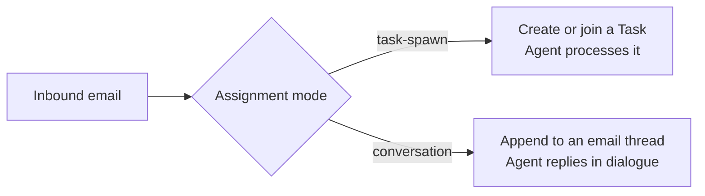

# Agent Email & Inboxes

Real employees have email addresses. So do Ever Works [Agents](./agents.md). Any Agent — and any [Mission](./missions.md), [Idea](./ideas.md), or [Work](./creating-a-work.md) — can be given one or more **inbound and outbound mailboxes**, so your AI workforce can send updates, receive replies, and turn incoming mail into work, without a human in the loop.

This turns email from a thing the platform occasionally *sends* (password resets, alerts) into a first-class, two-way channel your Agents live on.

## What you can do

- **Give an Agent a real "from" address** so its standups, summaries, and outreach land in inboxes looking like they came from a person, not a no-reply.
- **Receive email** on an address and route it straight into a Task (or an ongoing conversation) that the right Agent picks up.
- **Connect mailboxes to a Mission, Idea, or Work** — e.g. `support@` feeds a support-triage Agent on your store Work; `press@` feeds your company Mission.
- **Let Agents email each other** as a parallel channel to tasks — a clean "send a message to a peer Agent" verb.
- **Match commit identity** — when an Agent commits to a Work's repo, the commit author email matches its assigned address.

## Tenant email addresses

Register addresses once under **Settings → Integrations → Email Addresses**:

- **Outbound addresses** — each has an address, a provider, an optional from-name, a verified flag, and a per-address spend rollup.
- **Inbound addresses** — same, plus a routing rule (a pattern over subject/from that decides which Mission/Idea/Work/Task the mail lands in).
- **Add-address wizard** — pick direction (Outbound / Inbound / Both), pick a provider, enter the address and provider settings, then verify (a confirmation email outbound; a test email inbound).

Addresses are backed by **Email Provider plugins**, enabled and configured per tenant exactly like AI providers:

| Provider | Direction |
|---|---|
| Mailchimp Transactional (Mandrill) | Outbound + Inbound |
| Mailgun | Outbound + Inbound |
| Postmark | Outbound + Inbound |
| Sendgrid | Outbound + Inbound |
| Resend | Outbound |
| `local-smtp` (dev / self-host) | Outbound |

Because providers are pluggable, you get **failover**: drain traffic from one provider to another on the same address without touching any Agent's configuration.

## Assigning mailboxes to an Agent

On an Agent's detail page, the **Identity** section has an **Email addresses** panel:

- **Outbound** — one default (what `from:` resolves to) plus any number of additional addresses.
- **Inbound** — zero or more addresses whose incoming mail dispatches work to this Agent.

Both are searchable pickers over your registered tenant addresses.

## How inbound mail becomes work

When mail arrives on an Agent's inbound address, the platform verifies the provider's webhook signature, decodes it into a canonical message, stores it, and dispatches it. Each inbound assignment runs in one of two modes:

- **`task-spawn`** (default) — each message creates or joins a [Task](../api/tasks.md). The subject can carry a Task slug like `[ACME-123]` to thread into an existing one; otherwise a fresh Task is created with the email as its body. The assigned Agent then works the Task like any other.
- **`conversation`** — messages append to an ongoing thread and the Agent replies in dialogue, with no new Task created. Use this for back-and-forth that isn't a discrete unit of work ("FYI, the deploy finished").

## Agents sending email

An Agent gets a `sendEmail` tool when it has an outbound address assigned **and** `canCallExternalTools` is on. A higher-level `messageAgent` tool lets one Agent message another by name — the platform resolves the peer's inbound address and routes the message into conversation mode. Every send records usage against the Agent (and the Task, if any) so spend rollups work automatically, and writes an `EMAIL_SENT` entry to the activity log.

Outbound bodies can be authored as plain text/HTML or rendered from **React-Email templates** (server-side), and an in-app **composer** offers a rich editor with a live preview and a template picker.

## Why email, not just tasks?

Tasks are units of *work* with a lifecycle. Email is the universal addressing scheme: an Agent reachable by email is reachable by humans, by external systems, by webhooks, and by other AI agents — without bespoke integration. Both coexist; you pick the right one per interaction.

## See also

- [Agents (Your AI Employees)](./agents.md)
- [Missions](./missions.md) · [Creating a Work](./creating-a-work.md)
- [Autonomous Operation](./autonomous-operation.md)
- API reference: [Mail](../api/mail.md), [Email Templates](../api/email-templates.md), [Tasks](../api/tasks.md)
