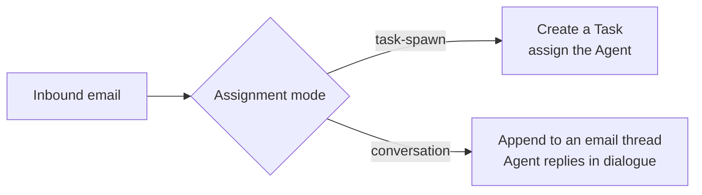

# Agent Email & Inboxes

Real employees have email addresses. So do Ever Works [Agents](./agents.md). An Agent can be given one or more **inbound and outbound mailboxes**, so your AI workforce can send updates, receive replies, and turn incoming mail into work, without a human in the loop.

This turns email from a thing the platform occasionally _sends_ (password resets, alerts) into a first-class, two-way channel your Agents live on.

:::info Status — what ships today

The REST API, the five provider plugins, the inbound dispatcher, the Agent tools and the per-Agent inbox UI all ship. Three links in the chain do **not**, and this page names them at each step rather than assuming them:

- **The Email Addresses settings page is a v0 shell.** `/settings/integrations/emails` renders the address table (Address · Direction · Provider · Verified · Edit), but **Add address** is stubbed: it pops an alert reading _"Add-address wizard: implementation in follow-up tick"_, and the per-row **Edit** button is inert. Register addresses over the API today — see [How to register an address](#how-to-register-an-address-today).
- **Nothing in the product assigns a mailbox to an Agent yet.** The `agent_email_assignments` table, its dispatch modes and its priority ordering are real, and they are read on every send and every inbound webhook — but no REST route, dashboard screen or chat verb writes a row (`AgentEmailAssignmentRepository.save` has no caller outside tests). Until the assignment surface ships, only a self-hosted operator with database access can bind an address to an Agent.
- **There is no "Identity → Email addresses" panel on the Agent detail page.** An earlier draft of this page described one; it does not exist. An Agent's ten tabs are listed in [Agents](./agents.md#the-ten-tabs), and its mail surface is the **Inbox** route documented below.

Everything else on this page is shipped and reachable.

:::

## What you can do

- **Give an Agent a real "from" address** so its standups, summaries, and outreach land in inboxes looking like they came from a person, not a no-reply.
- **Receive email** on an address and route it straight into a Task (or an ongoing conversation) that the assigned Agent picks up.
- **Let Agents email each other** as a parallel channel to tasks — the `messageAgent` tool is a clean "send a message to a peer Agent" verb. It sends an ordinary email from the calling Agent's outbound address to the target Agent's primary inbound address; what happens on arrival is decided by the target's own inbound assignment, not by the tool (see [Agents sending email](#agents-sending-email)).
- **Roll spend up per provider** — every agent-driven send emits a `PluginUsageEvent` with `capability='email'`, so email shows up in [Budgets & Usage](./budgets-and-usage.md) beside model spend.

Two capabilities described in earlier drafts are **planned, not shipped**, and nothing on this page depends on them:

- **Mailboxes attached to a Mission, Idea or Work.** A `tenant_email_addresses` row is scoped to the account (plus tenant/organization columns); the only binding that exists is address → **Agent**, through `agent_email_assignments`. There is no `support@` → Work or `press@` → Mission mapping today.
- **Commit identity matching the Agent's address.** Git commits written by the platform use the account owner's name and email (`user.email` in `github-sync.service.ts`), not the Agent's assigned mailbox.

## Tenant email addresses

Addresses are registered per account, and the settings page for them is **Settings → Integrations → Email Addresses** (`/settings/integrations/emails`).

Each address carries an address, a direction, a provider plugin id, a per-plugin `providerSettings` blob, a `verified` flag with a time-boxed verification token, a `defaultForReplies` flag, and a soft-disable marker (`disabledAt`).

| Field               | Values                          | Notes                                                                                 |
| ------------------- | ------------------------------- | ------------------------------------------------------------------------------------- |
| `direction`         | `outbound` / `inbound` / `both` | `both` = one physical address that sends _and_ receives.                              |
| `pluginId`          | e.g. `postmark`, `mailgun`      | Which email-provider plugin handles it.                                               |
| `providerSettings`  | JSON, per-plugin shape          | API key, sending domain, webhook secret — see the settings table below.               |
| `verified`          | boolean                         | Set when the confirmation link is clicked. Verification tokens expire after **24 h**. |
| `defaultForReplies` | boolean                         | Marks the address the platform prefers when replying.                                 |

:::caution The add-address wizard is not in the UI

The settings page lists addresses and nothing more: **Add address** raises a placeholder alert instead of opening a wizard, and the row-level **Edit** control does not open an editor. Direction pickers, provider pickers and the verify step described below are all real **API** operations — drive them with the REST calls in the next section, or with any HTTP client, until the wizard lands.

With no addresses registered, the page shows its empty state: _"No email addresses yet. Click **Add address** to register a Postmark / Resend / Mailgun / Sendgrid / Mailchimp inbox."_

:::

### Email provider plugins

Addresses are backed by **email-provider plugins**, enabled and configured per tenant exactly like AI providers. Direction support is the plugin's declared `capabilities`, not a setting you can widen:

| Provider                           | Plugin id                 | Direction              |
| ---------------------------------- | ------------------------- | ---------------------- |
| Postmark                           | `postmark`                | Outbound **+ inbound** |
| Mailgun                            | `mailgun`                 | Outbound **+ inbound** |
| Resend                             | `resend`                  | Outbound only          |
| SendGrid                           | `sendgrid`                | Outbound only          |
| Mailchimp Transactional (Mandrill) | `mailchimp-transactional` | Outbound only          |

Only **Postmark** and **Mailgun** can receive mail. Resend's plugin says why in its own manifest — inbound is deferred until Resend's inbound API is generally available. So an inbound address, and therefore anything on this page that begins with an arriving email, needs a Postmark or Mailgun address.

Each plugin's `providerSettings` schema is small and every secret is marked `x-secret` with an env-var fallback:

| Plugin                    | Settings                                                                                                                                               |
| ------------------------- | ------------------------------------------------------------------------------------------------------------------------------------------------------ |
| `postmark`                | `apiKey` (`POSTMARK_API_KEY`), `defaultSenderDomain`, `inboundWebhookSecret` (`POSTMARK_INBOUND_SECRET`), `inboundStreamId`                            |
| `mailgun`                 | `apiKey` (`MAILGUN_API_KEY`), `domain` (`MAILGUN_DOMAIN`), `region` `us`\|`eu` (`MAILGUN_REGION`), `webhookSigningKey` (`MAILGUN_WEBHOOK_SIGNING_KEY`) |
| `resend`                  | `apiKey` (`RESEND_API_KEY`), `defaultSenderDomain`                                                                                                     |
| `sendgrid`                | `apiKey` (`SENDGRID_API_KEY`), `defaultSenderDomain`                                                                                                   |
| `mailchimp-transactional` | `apiKey` (`MANDRILL_API_KEY`), `defaultSenderDomain`                                                                                                   |

Because providers are pluggable, you get **failover**: point an address at a different provider plugin without touching any Agent's configuration.

:::note Agent mail and platform mail are two different systems

The addresses on this page carry _Agent_ mail. The platform's own transactional mail — signup confirmation, password reset, invitations — is a separate service with its own providers (SMTP, Resend, and a development faker) and Handlebars templates. See [Mail System](../api/mail.md). Registering a Postmark address here does not change where your password-reset email comes from.

:::

## How to register an address today

The settings UI cannot do this yet; the API can. Every call below is authenticated as you.

1. **Enable the provider plugin** and give it credentials, under **Settings → Plugins** (`/settings/plugins/email-provider`) — or supply the env vars from the table above.
2. **Create the address.** Direction is fixed at creation:

    ```bash
    curl -X POST https://api.ever.works/api/email/addresses \
      -H "Authorization: Bearer $EVER_WORKS_TOKEN" \
      -H "Content-Type: application/json" \
      -d '{
        "address": "pm@acme.com",
        "direction": "both",
        "pluginId": "postmark",
        "providerSettings": { "defaultSenderDomain": "acme.com" },
        "defaultForReplies": true
      }'
    ```

3. **Trigger verification** — `POST /api/email/addresses/:id/verify` sends a confirmation mail carrying a one-time token.
4. **Click the link.** It hits the public `GET /api/email/verify/:token` route, which flips `verified` to true. The token expires **24 hours** after it was issued, and the endpoint is rate-limited to 10 requests/minute so tokens cannot be enumerated.
5. **Point the provider's webhooks at the platform** for an inbound or `both` address:
    - inbound mail → `POST /api/email/inbound/<pluginId>` (e.g. `/api/email/inbound/postmark`)
    - delivery events (bounces, opens, clicks) → `POST /api/email/events/<pluginId>`

    Both are public routes that **verify the provider's webhook signature** before doing anything, are throttled to 600 requests/minute per client (the standard per-user / per-IP limiter, not a per-plugin bucket), and always answer `202` so the provider stops retrying. The inbound ack is deliberately contentless (`{ "received": true }`) — it leaks no routing metadata to an unauthenticated caller.

6. **Confirm it landed** — `GET /api/email/addresses` (optionally `?direction=inbound`), or reload `/settings/integrations/emails`, where the new row appears with its provider and verified flag.

## Assigning mailboxes to an Agent

An address becomes an Agent's mailbox through a row in `agent_email_assignments`:

| Column           | Meaning                                                                                                         |
| ---------------- | --------------------------------------------------------------------------------------------------------------- |
| `agentId`        | The Agent this mailbox belongs to.                                                                              |
| `emailAddressId` | The registered tenant address.                                                                                  |
| `direction`      | `outbound` or `inbound`. To use a `both` address in both directions, bind it with two rows — one per direction. |
| `priority`       | Lower wins. Default `100`. Outbound resolution and inbound dispatch both pick the lowest-priority row.          |
| `dispatchMode`   | `task-spawn` (default) or `conversation`. Inbound only; ignored on outbound rows.                               |

The unique key is `(agentId, emailAddressId, direction)`, so one address can serve several Agents — and serve them differently, because `dispatchMode` lives on the assignment rather than on the address.

:::caution No product surface writes these rows yet

There is no Agent screen, no `POST /api/agents/:id/email-addresses` route, and no chat verb that creates an assignment. Every reader of the table is wired and tested; the writer is the missing piece.

The consequences are concrete and worth planning around:

- `sendEmail` and the composer both fail with **"Agent has no outbound email address assigned"** until an outbound row exists (unless the caller passes an explicit `fromAddressId` it owns).
- An inbound webhook for an address with no inbound row is accepted, then dropped with the reason _"address has no inbound agent assignment"_ — the message is not persisted.
- `messageAgent` errors when the **target** Agent has no inbound address — and, because it delivers by sending a real email, it also needs an outbound row on the **calling** Agent and a live inbound webhook on the target's address.

If you self-host, you can insert the row directly against your own database using the columns above. On managed hosting, treat Agent mailboxes as not yet available.

:::

## How inbound mail becomes work

When mail arrives on an Agent's inbound address, the platform verifies the provider's webhook signature, decodes it into a canonical message, resolves recipient → tenant address → inbound assignment, stores it, and dispatches it. Each inbound assignment runs in one of two modes:


```mermaid
flowchart LR
    Email[Inbound email] --> D{Assignment mode}
    D -->|task-spawn| T[Create a Task<br/>assign the Agent]
    D -->|conversation| C[Append to an email thread<br/>Agent replies in dialogue]
```

- **`task-spawn`** (default) — the message is persisted, then a [Task](./tasks.md) is created for it: the title is the subject trimmed to 200 characters (or `Inbound email from <sender>` when the subject is empty), the body becomes the description (capped at 8,000 characters), the task is labelled `inbound-email`, created-by the receiving Agent, and assigned to it so the task-tracking flow dispatches an agent run. The message's delivery status flips to `delivered` once the Task exists.
- **`conversation`** — no Task is created. The message is filed against a per-Agent thread keyed on the **normalized subject**: `Re:` / `Fwd:` / `Fw:` prefixes are stripped, whitespace is collapsed, the result is lowercased and capped at 200 characters (an empty subject becomes `(no subject)`). A matching thread is reused and its `lastMessageAt` bumped; otherwise a new one is created with the sender as a participant. The Agent's chat-reply path consumes the thread. Use this for back-and-forth that isn't a discrete unit of work ("FYI, the deploy finished").

Two failure modes are silent by design and useful to know when debugging: if no registered address matches any recipient, the webhook is acked and nothing is stored; and if the Task-spawner adapter is not bound in a given deployment, a `task-spawn` message is still persisted, just without a Task.

:::note Subject slugs do not thread a Task

Threading applies to `conversation` mode only, and it keys on the normalized subject — not on a Task slug like `[ACME-123]`. In `task-spawn` mode **every** inbound message creates a new Task; there is no join-the-existing-Task path.

:::

Delivery events arriving on `/api/email/events/:pluginId` — bounces, opens, clicks — are verified, decoded and folded onto the matching `email_messages` row, latest status wins. That status is what the inbox list and message detail render.

## The per-Agent Inbox

Every Agent has a mail surface at `/agents/:id/inbox`. It is deliberately **not** in the Agent tab strip — the ten tabs are listed in [Agents](./agents.md#the-ten-tabs).

| Route                          | What it is                                                                                                                |
| ------------------------------ | ------------------------------------------------------------------------------------------------------------------------- |
| `/agents/:id/inbox`            | The message list — **Direction** (↓ in / ↑ out), **From**, **Subject**, **When**, **Status** — plus a **Compose** button. |
| `/agents/:id/inbox/:messageId` | One message: subject, direction, timestamp, the plugin it came through, delivery status, From / To / Cc, and the body.    |
| `/agents/:id/inbox/compose`    | The composer.                                                                                                             |

The list loads the 50 most recent messages server-side. With none, it says: _"No messages yet. Assign an inbound email address to this agent under Settings → Integrations → Emails to start receiving mail."_ — which, per the callout above, is the step that is not yet possible from the product.

A message detail view renders an HTML body inside a **sandboxed iframe** and otherwise falls back to plain text. Inbound `from`, `subject` and body fields are attacker-controlled by definition, so they are only ever rendered as escaped text or inside that sandbox — never as raw markup.

### How to send mail from an Agent's inbox

1. Open **Sidebar → Teams → Agents**, pick an Agent, and go to `/agents/:id/inbox`.
2. Click **Compose** (`/agents/:id/inbox/compose`).
3. Fill **To** — one or more addresses separated by commas, semicolons or newlines. Each is format-checked, so bare hostnames like `user@localhost` are rejected before anything reaches the mail stack.
4. Optionally fill **Cc**, then **Subject** and **Message**. All three of recipient, subject and body are required.
5. Press **Send**. On success the form clears and shows _"Sent ✓ (provider id: …)"_; on failure it shows a short, non-leaking error.

The composer is plain text: **To / Cc / Subject / Message**. The rich editor, live preview and React-Email template picker are a follow-up — the templates themselves exist and are reachable from the API and the `sendEmail` tool, just not from this form.

:::note Live updates are not wired into the list yet

The server-sent-events endpoint is shipped: `GET /api/email/messages/stream?agentId=…` primes on the current backlog, polls every 5 s and emits each new message as a `message` event, with a 15 s heartbeat comment and a 10-minute lifetime cap so a dropped connection cannot keep its timers alive. The client hook (`useInboxStream`, which degrades to a 30 s poll without `EventSource`) is written and exported — but no inbox component subscribes to it today, so the list refreshes when you reload the page. The stream is usable directly from your own client.

:::

## Agents sending email

An Agent gets a `sendEmail` tool when `canCallExternalTools` is on and an email facade is bound. The "at least one outbound address" requirement is enforced at invoke time, not at tool-resolution time, so a mailbox-less Agent sees the tool and gets a clear error from it.

| Tool           | Arguments                                                                                                                                                      | Behaviour                                                                                                                                                                                                                                                          |
| -------------- | -------------------------------------------------------------------------------------------------------------------------------------------------------------- | ------------------------------------------------------------------------------------------------------------------------------------------------------------------------------------------------------------------------------------------------------------------ |
| `sendEmail`    | `to[]`, `subject`, `bodyText` / `bodyHtml` **or** `template`, optional `cc[]`, optional `fromAddressId`                                                        | Sends from the Agent's primary outbound assignment (or the pinned `fromAddressId`). Returns the provider message id plus accepted/rejected recipient lists.                                                                                                        |
| `messageAgent` | `targetAgentId`, `subject`, `body`, optional `attachReferences[]` (`workId` / `taskId` / `missionId`) — accepted by the schema, ignored by the shipped adapter | Resolves the target's primary inbound address and sends it an ordinary email from the calling Agent's outbound address. What the target does with it follows that inbound assignment's `dispatchMode`. Prefer it over `sendEmail` for Agent-to-Agent coordination. |

`messageAgent` is a convenience over `sendEmail`, not a private in-process channel. The adapter resolves the target's lowest-priority `inbound` assignment, reads that assignment's tenant address, and calls the same send path `sendEmail` uses with a plain `to` / `subject` / `bodyText` — so the message leaves through the calling Agent's outbound provider and comes back in through the **target address's inbound webhook**. From there it is dispatched by that assignment's `dispatchMode`: a new [Task](./tasks.md) under the default `task-spawn`, and a conversation thread only when the inbound row is explicitly set to `conversation`. Both ends have to be registered, verified and webhook-wired for anything to arrive.

Two guards run before the adapter is reached, because `targetAgentId` is supplied by the model: an Agent may not message **itself** (the tool returns _"An agent cannot message itself."_), and it may not message an Agent you do not own — ownership is checked with `findByIdAndUser` at the tool layer and re-checked in the adapter on the server. `attachReferences[]` is declared on the tool schema and forwarded to the facade, but the shipped adapter never reads it, so attached references are silently dropped today.

Outbound bodies can be plain text/HTML, or rendered server-side from a **React-Email template**. Two slugs ship: `agent-summary` and `agent-message`. Pass `template: { slug, props }` to `sendEmail` or to `POST /api/email/messages` and the rendered HTML plus a plain-text fallback are used in place of the raw bodies; an unknown slug is an error. See [Email Templates](../api/email-templates.md).

Every send persists an `email_messages` row and emits a `PluginUsageEvent` with `capability='email'`, so per-provider spend rollups work automatically.

:::caution Sends are not written to the activity log

Earlier drafts of this page promised an `EMAIL_SENT` activity-log entry. No such entry type exists. A send is recorded in two places — the `email_messages` row (visible in the Agent's inbox as an ↑ out row) and the usage event — and nowhere else. Do not build an audit trail on the [Activity](./activity.md) feed for email.

:::

## Email API reference

| Method   | Route                                         | Auth      | Purpose                                                          |
| -------- | --------------------------------------------- | --------- | ---------------------------------------------------------------- |
| `GET`    | `/api/email/addresses?direction=`             | Bearer    | List your registered addresses.                                  |
| `POST`   | `/api/email/addresses`                        | Bearer    | Register an address (`201`).                                     |
| `PATCH`  | `/api/email/addresses/:id`                    | Bearer    | Update provider settings / flags.                                |
| `DELETE` | `/api/email/addresses/:id`                    | Bearer    | Remove an address (`204`).                                       |
| `POST`   | `/api/email/addresses/:id/verify`             | Bearer    | Send the verification mail.                                      |
| `GET`    | `/api/email/verify/:token`                    | Public    | Confirm an address. 24 h token, 10 req/min.                      |
| `GET`    | `/api/email/messages?agentId=&limit=&offset=` | Bearer    | List an Agent's messages. Default 50, capped at 100.             |
| `GET`    | `/api/email/messages/stream?agentId=`         | Bearer    | SSE stream of new inbound messages.                              |
| `GET`    | `/api/email/messages/:id`                     | Bearer    | One message, scoped to you.                                      |
| `POST`   | `/api/email/messages`                         | Bearer    | Compose + send from an Agent's outbound address (`201`).         |
| `POST`   | `/api/email/inbound/:pluginId`                | Signature | Provider inbound webhook (`202`, 600 req/min per client).        |
| `POST`   | `/api/email/events/:pluginId`                 | Signature | Provider delivery-event webhook (`202`, 600 req/min per client). |

## Why email, not just tasks?

Tasks are units of _work_ with a lifecycle. Email is the universal addressing scheme: an Agent reachable by email is reachable by humans, by external systems, by webhooks, and by other AI agents — without bespoke integration. Both coexist; you pick the right one per interaction.

## See also

- [Agents (Your AI Employees)](./agents.md) · [Agent Capabilities](./agent-capabilities.md) — where `canCallExternalTools` is granted
- [Inbox (Questions, Approvals, Escalations & Notices)](./inbox.md) — the operator message center at `/inbox`, a different surface from an Agent's mailbox
- [Missions](./missions.md) · [Ideas](./ideas.md) · [Creating a Work](./creating-a-work.md)
- [Tasks](./tasks.md) — what a `task-spawn` inbound message turns into
- [Autonomous Operation](./autonomous-operation.md)
- [Notifications](./notifications.md) — channel fanout, the other outbound path for Agent messages
- [Budgets & Usage](./budgets-and-usage.md) — where `capability='email'` usage shows up
- [Plugins](./plugins.md) — enabling and configuring the email-provider plugins
- API reference: [Mail](../api/mail.md), [Email Templates](../api/email-templates.md), [Tasks](../api/tasks.md)
