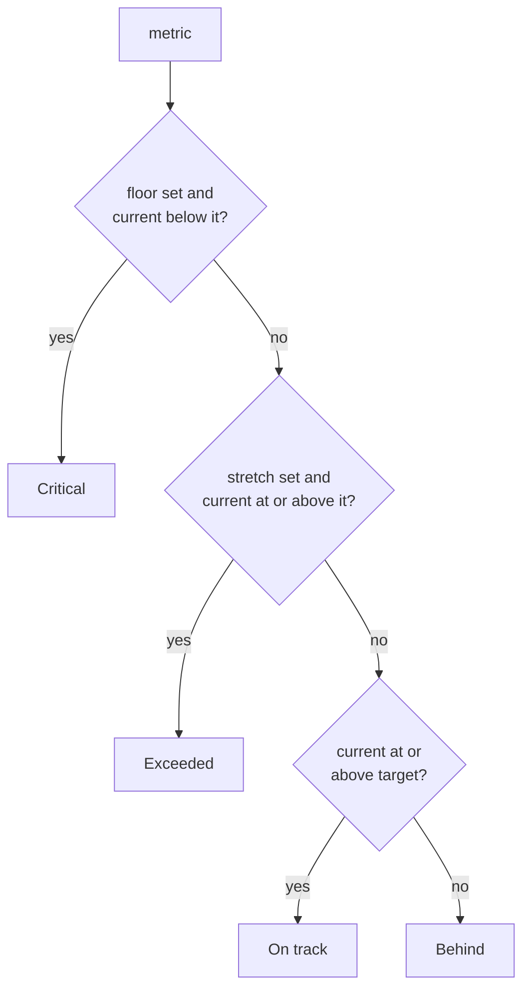

# Agent Scorecards

A **scorecard** is the set of numbers one [Agent](./agents.md) is judged on: "5 pull requests merged a week", "12 posts published a month", "keep the backlog under 20". Each metric carries a **target**, the **current** value, and optional **floor** and **stretch** bounds, and the platform colors it — _Exceeded_, _On track_, _Behind_, _Critical_ — from those numbers alone.

It is the answer to "is this AI employee actually delivering?" in a form you can read in two seconds, attached to the Agent itself rather than to a report you have to assemble.

:::info Status — increment 1: the numbers are yours to maintain
Everything on this page ships today: the data model, the editor, the status coloring, and the full REST contract. Two things deliberately do **not** exist yet:

- **`current` never updates itself.** No run, task, or commit rolls a number up into a scorecard — you (or a script calling the API) type it.
- **There is no org-wide roll-up.** No "agents at risk" tile aggregates scorecards across your workspace. The aggregation helper exists in the codebase (`summarizeScorecard()` in `packages/agent/src/agents/scorecard.ts`, which counts metrics per status), but nothing renders it.

Both are named follow-ups, not hidden features. Plan around a scorecard being a **shared, structured record of intent** — not a live telemetry feed.
:::

:::note Where to find it
**Sidebar → Teams → Agents** tab → open any Agent → **Settings** (`/agents/:id/settings`) → the **Scorecard** card, below **Merge policy**.

A brand-new Agent has no scorecard, and the card says so: _"No metrics yet. Add quantified goals so this Agent's output is measurable."_
:::

## Anatomy of a metric

A scorecard is an ordered array of up to **12** metrics stored on the Agent. Each one:

| Field       | Required | Rules                                                                                      |
| ----------- | -------- | ------------------------------------------------------------------------------------------ |
| **key**     | yes      | Kebab-case (`prs-merged`, `nps`, `weekly-revenue-usd`), ≤ 64 chars, unique in the array.   |
| **label**   | yes      | What a human reads — 1 to 80 characters. Shown on the card.                                |
| **target**  | yes      | The goal value for the period. Any finite number, including `0` and negatives.             |
| **current** | yes      | The latest measured value. Manually maintained in this increment.                          |
| **floor**   | no       | Minimum acceptable value. Below it, the metric reads **Critical**.                         |
| **stretch** | no       | Ambition line. At or above it, the metric reads **Exceeded**.                              |
| **unit**    | no       | Display-only suffix — `PRs`, `%`, `usd`. ≤ 20 characters. Set through the API (see below). |
| **period**  | yes      | `weekly`, `monthly`, or `quarterly` — how often you intend to meet or reset the target.    |

The `period` is documentation, not a scheduler: nothing resets `current` when a week rolls over. It tells whoever reads the card what "5" means.

`key` is the stable handle — it survives label edits, and it is what future automation will match on. When you add a row in the UI you never type it: the key is derived by kebab-casing your label (and de-duplicated with a numeric suffix if that collides). Rows that already exist keep the key they were stored with.

## How a metric is scored

Status is derived on every render from the four numbers — nothing is stored:



| Status       | Meaning                                             | On the card                |
| ------------ | --------------------------------------------------- | -------------------------- |
| **Critical** | A `floor` is set and `current` is below it.         | Red badge, red bar.        |
| **Exceeded** | A `stretch` is set and `current` is at or above it. | Green badge, green bar.    |
| **On track** | `current` is at or above `target`.                  | Neutral badge, accent bar. |
| **Behind**   | Below target, but not under the floor.              | Amber badge, amber bar.    |

The **floor check runs first**, so an under-floor metric reads _Critical_ regardless of the other bounds. Floor and stretch are both optional — a metric with neither only ever reads _On track_ or _Behind_.

The progress bar is `current / target`, clamped to 0–100%. For a target of `0` or less the ratio is meaningless, so the bar fills only once `current` is **strictly** above the target — a `target: 0, current: 0` metric reads as "not started" rather than "done".

Under each metric the card prints the raw numbers: `3 / 5 PRs · Weekly`.

## How to add metrics to an Agent

1. Open **Sidebar → Teams → Agents**, click the Agent, and go to its **Settings** tab (`/agents/:id/settings`).
2. Scroll to the **Scorecard** card and press **Edit**.
3. Press **Add metric**. A row appears with **Metric**, **Period**, **Target**, **Current**, **Floor** and **Stretch** fields. The button disables once the scorecard holds 12 rows.
4. Type the metric name into **Metric** (this also seeds the stored key) and pick the **Period**.
5. Fill **Target** and **Current**. Leave **Floor** and **Stretch** blank unless you want the red and green bands.
6. Repeat for each metric. Use the **✕** button on a row to drop it.
7. Press **Save scorecard**. A _Scorecard saved_ toast confirms the write, and the card re-renders with badges and bars.

**Cancel** discards the whole editing session — including rows you added and rows you removed — and restores what is stored.

Two client-side checks fire before the request leaves the browser:

| Toast                                | Cause                                                                                                           |
| ------------------------------------ | --------------------------------------------------------------------------------------------------------------- |
| _Every metric needs a label_         | A row's **Metric** field is empty or whitespace.                                                                |
| _Targets and values must be numbers_ | **Target** or **Current** is blank or not a finite number, or a filled **Floor** / **Stretch** is not a number. |

Deleting every row and saving clears the scorecard back to "none configured" — the card returns to its empty state.

:::tip Editing a metric is the whole scorecard
**Save scorecard** writes the entire array, not the row you touched. If two people edit the same Agent's scorecard at once, the last save wins outright. For anything you script, read the current array first, change what you need, and send the whole thing back.
:::

## Setting a scorecard over the API

Scorecards are written through the Agent's normal update endpoint.

| Method  | Endpoint          | Notes                                                          |
| ------- | ----------------- | -------------------------------------------------------------- |
| `PATCH` | `/api/agents/:id` | The only way to write a scorecard. Whole-array replace.        |
| `GET`   | `/api/agents/:id` | Returns `scorecard` verbatim — `null` when none is configured. |
| `GET`   | `/api/agents`     | The index list carries `scorecard` on every Agent it returns.  |

```bash
curl -X PATCH http://localhost:3100/api/agents/<agent-id> \
  -H "Authorization: Bearer <jwt-token>" \
  -H "Content-Type: application/json" \
  -d '{
    "scorecard": [
      {
        "key": "prs-merged",
        "label": "Pull requests merged",
        "target": 5,
        "current": 3,
        "floor": 2,
        "stretch": 10,
        "unit": "PRs",
        "period": "weekly"
      },
      {
        "key": "posts-published",
        "label": "Blog posts published",
        "target": 12,
        "current": 12,
        "period": "monthly"
      }
    ]
  }'
```

This is also how you set a **unit** — the card has no unit editor in this increment, but a unit written through the API is preserved by every subsequent UI save and shown next to the numbers.

:::warning You cannot create an Agent with a scorecard in one call
`POST /api/agents` **rejects** an inline `scorecard` with `400` — the create body has no such property, and the API refuses unknown properties rather than silently dropping them. Create the Agent first, then `PATCH` the scorecard onto it. A fresh Agent always starts at `scorecard: null`.
:::

### Replace and clear semantics

| You send                  | Result                                                                    |
| ------------------------- | ------------------------------------------------------------------------- |
| A new array               | Replaces the stored array outright — there is **no** per-key merge.       |
| `[]` (empty array)        | Clears the scorecard; the stored value normalizes to `null`.              |
| `null`                    | Clears the scorecard.                                                     |
| No `scorecard` key at all | Leaves an existing scorecard untouched (patch other Agent fields freely). |

Storage is faithful in both directions: unset optional fields stay **omitted** rather than being coerced to `null`, an explicit `null` for `floor` / `stretch` / `unit` round-trips as `null`, array order is preserved, and negative, zero and decimal values survive unchanged. A scorecard write bumps the Agent's `updatedAt`.

### Validation

Every write is checked twice — once by the HTTP layer (per-metric messages naming the offending index) and once inside the service, so non-HTTP callers such as tools and imports get the same rules. Both reject with `400`.

| Rule                                            | Violation returns                                       |
| ----------------------------------------------- | ------------------------------------------------------- |
| `key` matches `^[a-z0-9]+(?:-[a-z0-9]+)*$`      | `400` — the key must be kebab-case.                     |
| `key` ≤ 64 chars, unique within the array       | `400` — over-long, or duplicated keys.                  |
| `label` 1–80 chars                              | `400` — empty, missing, or over-long label.             |
| `target` / `current` finite numbers             | `400` — strings, `NaN` and `Infinity` are all rejected. |
| `floor` / `stretch` finite numbers when present | `400` — a non-number bound.                             |
| `unit` ≤ 20 chars                               | `400` — over-long unit.                                 |
| `period` in `weekly`/`monthly`/`quarterly`      | `400` — any other value.                                |
| At most 12 metrics                              | `400` — 12 is accepted, 13 is not.                      |
| No unknown properties on a metric               | `400` — a typo'd field is rejected, not ignored.        |
| `scorecard` is an array (or `null`)             | `400` — an object or string is rejected.                |

A rejected write changes nothing: the previously stored scorecard is left exactly as it was.

Access follows the same rules as the rest of the Agent API — an unauthenticated `PATCH` is `401`; another user's Agent is `404` on both read and write (never `403`, so nothing leaks about whether the id exists); an unknown-but-valid UUID is `404`; a malformed UUID is `400`.

## Scorecards, Goals, and budgets

Three different things measure an Ever Works workspace. They do not overlap:

| Surface                              | Where the number comes from                    | What it does about it                                                           |
| ------------------------------------ | ---------------------------------------------- | ------------------------------------------------------------------------------- |
| **Agent scorecard**                  | You type it (this increment).                  | Colors the metric. Records intent. Changes nothing else.                        |
| **[Goal](./goals.md)**               | A metrics provider plugin, read on a schedule. | Records a sample per evaluation, tracks progress and lifecycle toward a target. |
| **[Budget](./budgets-and-usage.md)** | Actual AI spend, computed per call.            | **Enforced** — blocks or alerts on the next call once the cap is hit.           |

Read it as: a **Goal** is a measured number with history and a scheduler; a **scorecard** is a stated number attached to a worker; a **budget** is a hard limit with teeth. If you want the number checked automatically, create a Goal. If you want an Agent stopped when it overspends, set a [budget](./budgets-and-usage.md) on the Agent's **Budgets** tab.

A scorecard is deliberately inert: no status — not even _Critical_ — pauses an Agent, blocks a run, skips a heartbeat, or raises a notification.

## What increment 1 does not do

| Not yet                                     | What that means for you                                                                                                           |
| ------------------------------------------- | --------------------------------------------------------------------------------------------------------------------------------- |
| Automatic `current` from run output         | Update the number yourself, from the UI or with a scripted `PATCH` (a nightly job against `/api/agents/:id` works well today).    |
| Org-level roll-up of scorecards             | Review scorecards Agent by Agent on each **Settings** tab; there is no cross-Agent summary screen.                                |
| History or samples                          | Saving a new `current` overwrites the old one. Nothing keeps the previous value — use a [Goal](./goals.md) when you need a trend. |
| A unit editor in the card                   | Set `unit` through the API; the UI preserves it.                                                                                  |
| Scorecards in the per-Agent export envelope | Exporting and re-importing an Agent does not carry its scorecard — re-apply it with a `PATCH` after the import.                   |

## Suggested starting scorecards

Concrete metrics beat abstract ones. A few that map cleanly onto what Agents actually produce in Ever Works:

| Agent                                                    | Metric                  | Target | Floor | Stretch | Period  |
| -------------------------------------------------------- | ----------------------- | ------ | ----- | ------- | ------- |
| Reviewer ([community PRs](./community-pr-processing.md)) | Pull requests reviewed  | 20     | 8     | 40      | weekly  |
| Editor ([blog Work](./creating-a-work.md))               | Posts published         | 12     | 6     | 20      | monthly |
| Researcher ([Mission](./missions.md))                    | Ideas accepted          | 4      | 1     | 8       | monthly |
| Maintainer ([quality gates](./quality-gates.md))         | Failing gates left open | 0      | —     | —       | weekly  |

For the last row, remember the zero-target rule: with `target: 0` the bar stays empty until `current` is strictly above `0`, so set a `floor` of `0` if you want "zero open failures" to read as _Critical_ the moment one appears.

## Related

- [Agents (Your AI Employees)](./agents.md) — the Agent concept, scopes, definition files and heartbeats.
- [Agent Capabilities](./agent-capabilities.md) — what the Agent being measured is actually allowed to do.
- [Goals](./goals.md) — measured metrics with a provider, a schedule, and history.
- [Budgets & Usage](./budgets-and-usage.md) — the enforced spend limits, including the Agent's **Budgets** tab.
- [Teams](./teams.md) — org chart, reporting lines, and the Agents tab the scorecard hangs off.
- [Activity](./activity.md) — what an Agent actually did, run by run.
- [Settings Map](./settings-map.md) — every settings surface in the dashboard, including the Agent tabs.
