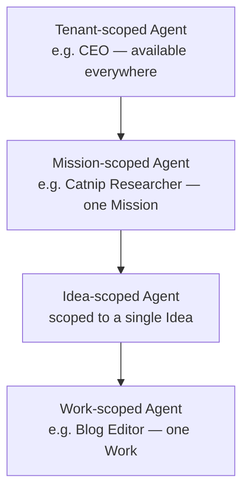

# Agents (Your AI Employees)

An **Agent** is a named, persistent AI worker you create inside Ever Works — a "CEO", a "VP of Engineering", a "Researcher", a "PR Reviewer". Agents are how Ever Works stops being a one-shot builder and starts behaving like a team that keeps working: they run on a schedule, react to tasks, write content, improve code, and hand work to each other — 24/7, on the Missions, Ideas, and Works you give them.

If a [Work](./creating-a-work.md) is the thing being built and a [Mission](./missions.md) is the goal, an **Agent is the worker** that pushes both forward when you're not watching.

## The Work Agent vs. your own Agents

Ever Works ships with two complementary layers:

| Layer                     | What it is                                                                                               | When it runs                                             |
| ------------------------- | -------------------------------------------------------------------------------------------------------- | -------------------------------------------------------- |
| **Work Agent** (built-in) | The platform-managed engine that turns a Goal into [Ideas](./ideas.md) and Ideas into Works. Zero setup. | Always available — the default zero-friction path.       |
| **Agents** (you define)   | Named specialists you create, scope, and give a personality, a budget, and a schedule.                   | Optional, advanced — for users who want a standing team. |

The Work Agent stays the easy on-ramp. User-defined Agents are the layer you reach for when you want a _standing organization_ — a CEO that keeps every Mission on-roadmap, a Researcher that files findings every morning, a Reviewer that triages incoming community PRs.

## What an Agent has

Every Agent carries:

- **An identity** — a `name`, an optional `title`, and a `capabilities` description that says what it's for.
- **A scope** — exactly one of **Tenant**, **Mission**, **Idea**, or **Work**. Scope decides where the Agent shows up and what it's allowed to act on.
- **A provider + model** — defaults to your account default; override per Agent.
- **A heartbeat** — an optional cron cadence so the Agent wakes up and decides what to do next, even with nothing assigned.
- **A budget** — a per-Agent spend cap (hourly / daily / weekly / monthly / unlimited) enforced before every AI call.
- **A permission set** — granular flags (`canAssignTasks`, `canEditAgentFiles`, `canCommitToRepo`, `canCreateAgents`, `canCallExternalTools`, …) that gate what tools the Agent may call. Every flag defaults to `false`.
- **An avatar** — initials, a curated icon, or an uploaded image.

### Agent scope

A **Tenant-scoped** Agent (like a CEO) is available across everything you own. A **Mission-scoped** Agent only appears inside that Mission. A **Work-scoped** Agent only acts on its one Work. An Agent can only create or assign work to scopes equal to or narrower than its own.

## Agents as an organization

Because Agents can create tasks for other Agents, you can model an actual company. A tenant-scoped **CEO** keeps the roadmap coherent; a **CTO** owns the technical Works; a **Lead Engineer** ships code; a **Researcher** feeds Ideas. They collaborate the way a real team does — through tasks and shared context, not magic.

Ready-made Agent definitions (CEO, CTO, and more) ship as templates from the [`ever-works/agents`](https://github.com/ever-works/agents) repository, and [Mission Templates](./mission-templates.md) can pre-declare the Agents a Mission needs so a brand-new Mission arrives already staffed.

## Agent definition files

An Agent's brain is five files, stored in the **scope's Git repo** (the Mission repo for Mission-scoped Agents, the Work's data repo for Work-scoped Agents) so you own and version everything:

| File           | Purpose                                            |
| -------------- | -------------------------------------------------- |
| `SOUL.md`      | Who the Agent is — personality, principles, voice. |
| `AGENTS.md`    | Operating instructions and house rules.            |
| `HEARTBEAT.md` | What to do on a scheduled tick.                    |
| `TOOLS.md`     | Which tools the Agent leans on.                    |
| `agent.yml`    | Metadata (provider, idle behavior, avatar, …).     |

Tenant-scoped Agents with no control repo keep these inline in the database and serve them through the same API. You edit them in the Agent's **Instructions** tab (a five-tab markdown editor with autosave). The platform never auto-rewrites them — an Agent can only edit its own files, and only when `canEditAgentFiles` is on.

## Heartbeats — what an Agent does on an idle tick

Set a `heartbeatCadence` (a cron expression, or `manual`) and the Agent wakes on schedule. Even with nothing assigned, a heartbeat is **not** a no-op — the Agent is asked _"What's the next action you should take? Choose ONE."_ and may:

- **Create a task** (self-assigned or assigned to another Agent in scope),
- **Comment on an open task** it's part of,
- **Edit one of its own definition files** to capture a learning, or
- **Observe** the current state and do nothing this tick.

This is the loop that makes Ever Works _keep going_. Tune it per Agent with `agent.yml`'s `idleBehavior: propose | observe | noop`.

## Memory

- **Short-term** — the messages within a single run; not persisted.
- **Long-term** — the five definition files, the durable, intentional store the Agent edits deliberately.
- **Passive history** — recent activity, read on demand (not injected every tick, to save cost).
- **Institutional context** — the per-Work [Knowledge Base](./knowledge-base.md): brand voice, legal copy, personas, research, glossary. Agents read from it on every run.

Agents cannot read each other's definition files. Shared knowledge flows through **tasks**, **KB documents**, and the **activity log**.

## Tasks, skills, and email

- **Tasks** — Agents create, transition, comment on, and get assigned tasks. Mention an Agent in a task chat (`@ceo can you review this?`) and it replies within seconds. Tasks are the only channel for Agent-to-Agent collaboration, which gives every interaction an audit trail and attributes cost to the Agent that did the work.
- **Skills** — reusable capabilities bound to an Agent or inherited from its scope, surfaced via the Skills tab.
- **Email** — Agents can have their own inbound and outbound mailboxes. See **[Agent Email & Inboxes](./agent-email.md)**.

## Budgets & guardrails

Every Agent can have one budget row. Before any AI call, the platform checks the Agent's remaining headroom for the current interval and short-circuits the run if the cap is hit (logging `AGENT_BUDGET_EXCEEDED`). Repeated failures auto-pause an Agent so a misbehaving worker can't run away with your spend. See [Budgets & Usage](./budgets-and-usage.md).

## The Agents workbench

- **Sidebar → Agents** lists every Agent you own, with Cards/Table views and filters for status (`All / Active / Paused / Error`) and scope (`Tenant / Mission / Idea / Work`).
- Each **Agent detail page** has six tabs: **Dashboard** (live status, run history, tasks, cost snapshot), **Activity**, **Instructions**, **Skills**, **Budgets**, and **Settings**.
- Header actions: **Run heartbeat now**, **Assign Task**, **Pause / Resume**, **Archive**, **Delete**.
- Work, Mission, and Idea detail pages each gain an **Agents** tab listing the Agents that can act on them.

A **dry-run** mode (`POST /agents/:id/dry-run`) builds the prompt and estimates cost without calling the provider — handy while iterating on an Agent's instructions. You can also **export and import** an Agent as a JSON envelope to back it up, share it, or move it between scopes.

## Creating an Agent

1. Sidebar → **Agents** → **+ New Agent**.
2. Give it a `name` and `title`, and describe its `capabilities`.
3. Pick a provider/model (or keep your account default).
4. Choose a scope — Tenant for a company-wide role, or a specific Mission/Idea/Work.
5. Create it (starts in `draft`), then open the **Dashboard** tab and click **Start**, optionally setting a heartbeat cadence and budget.

You can also drive everything from the in-app AI Chat or any MCP client — _"Create a CEO agent for my company mission and run it daily."_

## See also

- [Missions](./missions.md) · [Ideas](./ideas.md) · [Creating a Work](./creating-a-work.md)
- [Agent Email & Inboxes](./agent-email.md)
- [Knowledge Base](./knowledge-base.md)
- [Autonomous Operation](./autonomous-operation.md)
- [Budgets & Usage](./budgets-and-usage.md)
- API reference: [Agents](../api/agents.md), [Tasks](../api/tasks.md), [Skills](../api/skills.md)
