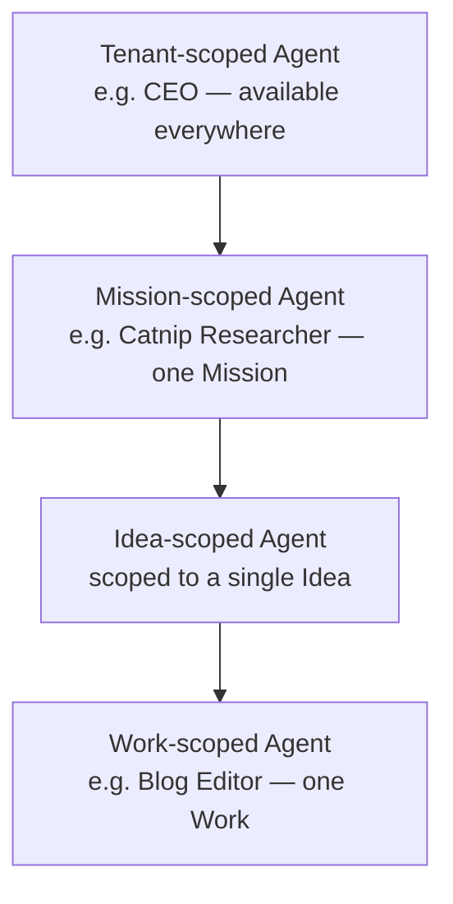

# Agents (Your AI Employees)

An **Agent** is a named, persistent AI worker you create inside Ever Works — a "CEO", a "VP of Engineering", a "Researcher", a "PR Reviewer". Agents are how Ever Works stops being a one-shot builder and starts behaving like a team that keeps working: they run on a schedule, react to tasks, write content, improve code, and hand work to each other — 24/7, on the Missions, Ideas, and Works you give them.

If a [Work](./creating-a-work.md) is the thing being built and a [Mission](./missions.md) is the goal, an **Agent is the worker** that pushes both forward when you're not watching.

## The Work Agent vs. your own Agents

Ever Works ships with two complementary layers:

| Layer                     | What it is                                                                                               | When it runs                                             |
| ------------------------- | -------------------------------------------------------------------------------------------------------- | -------------------------------------------------------- |
| **Work Agent** (built-in) | The platform-managed engine that turns a Goal into [Ideas](./ideas.md) and Ideas into Works. Zero setup. | Always available — the default zero-friction path.       |
| **Agents** (you define)   | Named specialists you create, scope, and give a personality, a budget, and a schedule.                   | Optional, advanced — for users who want a standing team. |

The Work Agent stays the easy on-ramp. User-defined Agents are the layer you reach for when you want a _standing organization_ — a CEO that keeps every Mission on-roadmap, a Researcher that files findings every morning, a Reviewer that triages incoming community PRs.

## What an Agent has

Every Agent carries:

- **An identity** — a `name`, an optional `title`, and a `capabilities` description that says what it's for.
- **A scope** — exactly one of **Tenant**, **Mission**, **Idea**, or **Work**. Scope decides where the Agent shows up and what it's allowed to act on.
- **A provider + model** — defaults to your account default; override per Agent.
- **A heartbeat** — an optional cron cadence so the Agent wakes up and decides what to do next, even with nothing assigned.
- **A budget** — a per-Agent spend cap (hourly / daily / weekly / monthly / unlimited) enforced before every AI call.
- **A permission set** — granular flags (`canAssignTasks`, `canEditAgentFiles`, `canCommitToRepo`, `canCreateAgents`, `canCallExternalTools`, …) that gate what tools the Agent may call. Every flag defaults to `false`.
- **An avatar** — initials, a curated icon, or an uploaded image.

### Agent scope

```mermaid
flowchart TD
    T[Tenant-scoped Agent<br/>e.g. CEO — available everywhere]
    M[Mission-scoped Agent<br/>e.g. Catnip Researcher — one Mission]
    I[Idea-scoped Agent<br/>scoped to a single Idea]
    W[Work-scoped Agent<br/>e.g. Blog Editor — one Work]
    T --> M --> I --> W
```

A **Tenant-scoped** Agent (like a CEO) is available across everything you own. A **Mission-scoped** Agent only appears inside that Mission. A **Work-scoped** Agent only acts on its one Work. An Agent can only create or assign work to scopes equal to or narrower than its own.

## Agents as an organization

Because Agents can create tasks for other Agents, you can model an actual company. A tenant-scoped **CEO** keeps the roadmap coherent; a **CTO** owns the technical Works; a **Lead Engineer** ships code; a **Researcher** feeds Ideas. They collaborate the way a real team does — through tasks and shared context, not magic.

Ready-made Agent definitions (CEO, CTO, and more) ship as templates from the [`ever-works/agents`](https://github.com/ever-works/agents) repository, and [Mission Templates](./mission-templates.md) can pre-declare the Agents a Mission needs so a brand-new Mission arrives already staffed.

## Agent definition files

An Agent's brain is five files, stored in the **scope's Git repo** (the Mission repo for Mission-scoped Agents, the Work's data repo for Work-scoped Agents) so you own and version everything:

| File           | Purpose                                            |
| -------------- | -------------------------------------------------- |
| `SOUL.md`      | Who the Agent is — personality, principles, voice. |
| `AGENTS.md`    | Operating instructions and house rules.            |
| `HEARTBEAT.md` | What to do on a scheduled tick.                    |
| `TOOLS.md`     | Which tools the Agent leans on.                    |
| `agent.yml`    | Metadata (provider, idle behavior, avatar, …).     |

Tenant-scoped Agents with no control repo keep these inline in the database and serve them through the same API. You edit them in the Agent's **Instructions** tab (a five-tab markdown editor with autosave). The platform never auto-rewrites them — an Agent can only edit its own files, and only when `canEditAgentFiles` is on.

## Heartbeats — what an Agent does on an idle tick

Set a `heartbeatCadence` (a cron expression, or `manual`) and the Agent wakes on schedule. Even with nothing assigned, a heartbeat is **not** a no-op — the Agent is asked _"What's the next action you should take? Choose ONE."_ and may:

- **Create a task** (self-assigned or assigned to another Agent in scope),
- **Comment on an open task** it's part of,
- **Edit one of its own definition files** to capture a learning, or
- **Observe** the current state and do nothing this tick.

This is the loop that makes Ever Works _keep going_. Tune it per Agent with `agent.yml`'s `idleBehavior: propose | observe | noop`.

## Memory

- **Short-term** — the messages within a single run; not persisted.
- **Long-term** — the five definition files, the durable, intentional store the Agent edits deliberately.
- **Passive history** — recent activity, read on demand (not injected every tick, to save cost).
- **Institutional context** — the per-Work [Knowledge Base](./knowledge-base.md): brand voice, legal copy, personas, research, glossary. Agents read from it on every run.

Agents cannot read each other's definition files. Shared knowledge flows through **tasks**, **KB documents**, and the **activity log**.

## Tasks, skills, and email

- **Tasks** — Agents create, transition, comment on, and get assigned tasks. Mention an Agent in a task chat (`@ceo can you review this?`) and it replies within seconds. Tasks are the only channel for Agent-to-Agent collaboration, which gives every interaction an audit trail and attributes cost to the Agent that did the work.
- **Skills** — reusable capabilities bound to an Agent or inherited from its scope, surfaced via the Skills tab.
- **Email** — Agents can have their own inbound and outbound mailboxes. See **[Agent Email & Inboxes](./agent-email.md)**.

## Budgets & guardrails

Every Agent can have one budget row. Before any AI call, the platform checks the Agent's remaining headroom for the current interval and short-circuits the run if the cap is hit (logging `AGENT_BUDGET_EXCEEDED`). Repeated failures auto-pause an Agent so a misbehaving worker can't run away with your spend. See [Budgets & Usage](./budgets-and-usage.md).

Two more fuses sit beside the budget:

- **Auto-pause on repeated failures.** The **Pause after failures** field on the Agent's **Settings** tab (default `3`, accepted range 1–20) is how many consecutive failed runs it takes before the Agent is paused rather than retried again.
- **The doom-loop detector.** Inside a task run's iterate loop, the platform reads the failure trail and stops early when the run is cycling _without progress_ — either the last three attempts produced one identical failure fingerprint, or the trail reached the retry cap with no progress and at least one repeated failure. It never fails a run on its own account: it ends the loop before another attempt is paid for, posts the reason in the task chat ("the run was cycling without progress"), and files an escalation with reason code `loop-detected` carrying the evidence. Defaults: enabled, repeat threshold `3` (`AGENT_RUN_LOOP_REPEAT_THRESHOLD`, clamped 2–10) and retry cap `4` (`AGENT_RUN_LOOP_MAX_RETRIES`, clamped 1–20); set `AGENT_RUN_LOOP_DETECTOR_ENABLED=false` to fall back to the attempt cap alone. Any attempt that reports measurable progress clears both signals.

Which side-effectful actions an Agent may take alone — and which queue for you first — is a separate per-Agent policy with its own `require_approval` / `autonomous` modes, auto-approve and blocked action-type lists. See **[Approvals, Escalations & Guardrail Modes](./approvals-and-escalations.md)**, which is also where `loop-detected` escalations land.

## The Agents workbench

:::note Where to find it
Agents live under **Sidebar → Teams**, which is the hub for your people _and_ your AI workforce: tabs **Teams | Agents | Sessions | Archived**. The **Agents** tab is the catalog below, and it also carries the **Agents Chart** button (your Agent hierarchy without human members) and the **Skills** block. `/agents` and `/skills` still work as links — `/skills` redirects to the Skills block on the Agents tab.
:::

- **Sidebar → Teams → Agents tab** lists every Agent you own, with Cards/Table views and filters for status (`All / Active / Paused / Error`) and scope (`Tenant / Mission / Idea / Work`).
- Each **Agent detail page** has **ten** tabs — **Dashboard**, **Activity**, **Terminal**, **Instructions**, **Skills**, **Capabilities**, **MCP Servers**, **Collaborators**, **Budgets**, **Settings** — listed in full below.
- Header actions: **Run heartbeat now**, **Assign Task**, **Pause / Resume**, **Archive**, **Delete**.
- Work, Mission, and Idea detail pages each gain an **Agents** tab listing the Agents that can act on them.

### The ten tabs

| Tab               | Route                       | What it holds                                                                                                                                                                                                                                 |
| ----------------- | --------------------------- | --------------------------------------------------------------------------------------------------------------------------------------------------------------------------------------------------------------------------------------------- |
| **Dashboard**     | `/agents/:id`               | Live status, run history, tasks, cost snapshot — and the **Guardrails** card.                                                                                                                                                                 |
| **Activity**      | `/agents/:id/activity`      | The lifecycle and run-event feed for this one Agent (created, paused, resumed, run triggered, cancelled, budget exceeded, …).                                                                                                                 |
| **Terminal**      | `/agents/:id/terminal`      | A real shell attached to a live run — watch it, or take the keyboard. See [Agent Terminals](./agent-terminals.md).                                                                                                                            |
| **Instructions**  | `/agents/:id/instructions`  | The five definition files, in a five-tab markdown editor with autosave.                                                                                                                                                                       |
| **Skills**        | `/agents/:id/skills`        | Skills bound directly to this Agent, plus the ones it inherits from its scope.                                                                                                                                                                |
| **Capabilities**  | `/agents/:id/capabilities`  | Tool grants, permissions, MCP connections, repositories, Environment and init script. See [Agent Capabilities](./agent-capabilities.md).                                                                                                      |
| **MCP Servers**   | `/agents/:id/mcp-servers`   | Which registered MCP servers this Agent may call — the standalone view of the same state.                                                                                                                                                     |
| **Collaborators** | `/agents/:id/collaborators` | The allow-list that bounds which other Agents this one may delegate to.                                                                                                                                                                       |
| **Budgets**       | `/agents/:id/budgets`       | The per-interval spend cap and what has been spent against it.                                                                                                                                                                                |
| **Settings**      | `/agents/:id/settings`      | Name, title, capabilities text, AI provider, Environment, heartbeat cadence, skill context tokens, **Pause after failures**, the permission switches, reports-to, repositories, **Merge policy**, and the [Scorecard](./agent-scorecards.md). |

One more Agent surface is deliberately **not** in the tab strip: the Agent's own **email Inbox** at `/agents/:id/inbox`, with `/agents/:id/inbox/compose` to write a message and `/agents/:id/inbox/:messageId` to read one. It is documented in [Agent Email & Inboxes](./agent-email.md).

A **dry-run** mode (`POST /agents/:id/dry-run`) builds the prompt and estimates cost without calling the provider — handy while iterating on an Agent's instructions.

:::caution Dry-run is not available in the current API
There is **no `dry-run` route** on the shipped API. `/api/agents` exposes CRUD, `templates` and `from-template/:slug`, `targets`, `guardrails`, `pause`, `resume`, `unarchive`, `files/:name`, `export` / `import`, `run-now`, `runs` (including `runs/:runId` and `runs/:runId/detail`, plus `cancel`, `steer`, `interrupt`, `resume` on a run), `events`, `skills`, `budget`, `assign-task` and `attachments` — dry-run is planned, not shipped.

To rehearse an Agent safely today: leave its [guardrails](./approvals-and-escalations.md) on `require_approval` so every side-effectful action queues for you, cap it with a small [budget](./budgets-and-usage.md), then hit **Run heartbeat now** and read what happened in the **Activity** tab.
:::

You can also **export and import** an Agent as a JSON envelope to back it up, share it, or move it between scopes.

## Creating an Agent

1. Sidebar → **Teams** → **Agents** tab → **+ New Agent**.
2. Give it a `name` and `title`, and describe its `capabilities`.
3. Pick a provider/model (or keep your account default).
4. Choose a scope — Tenant for a company-wide role, or a specific Mission/Idea/Work.
5. Create it (starts in `draft`), then open the **Dashboard** tab and click **Start**, optionally setting a heartbeat cadence and budget.

You can also drive everything from the **platform chat** — _"Create a CEO agent for my company mission and run it daily."_ The chat's generated tool registry covers the Agent surface directly, with these tools and no others:

- **Catalog and lifecycle** — `list_agents`, `get_agent`, `create_agent`, `update_agent`, `delete_agent`, `pause_agent`, `resume_agent`.
- **Templates** — `list_agent_templates`, `create_agent_from_template`.
- **Runs** — `run_agent_now`, `list_agent_runs`, `cancel_agent_run`.
- **Skills, budget and work** — `get_agent_skills`, `get_agent_budget`, `assign_task_to_agent`.
- **Definition files** — `get_agent_file` and `update_agent_file`, the chat-side pair for `GET` / `PUT /api/agents/:id/files/:name`. The same five files are edited by hand in the **Instructions** tab.
- **Portability** — `export_agent` and `import_agent`, for `GET /api/agents/:id/export` and `POST /api/agents/import`.
- **Attachments** — `list_agent_attachments`, `add_agent_attachment`, `remove_agent_attachment`.

:::info What the chat cannot do for an Agent
A few Agent routes have **no chat tool** and are reachable only from the dashboard tabs above or the REST API: `targets` (assign an Agent to a Mission/Idea/Work), `guardrails`, `unarchive`, `events`, the single-run detail reads, and the mid-run `steer` / `interrupt` / `resume` controls. Call [`/api/agents`](../api/agents.md) directly for those.
:::

:::note Agents are not exposed over the MCP server
The [Ever Works MCP server](./mcp-server.md) whitelists Works, generation, items, deploy, plugins, scheduling, comparisons, Missions, Ideas and account-wide usage — and **no Agent endpoints at all**. An external MCP client cannot create, run, or pause an Agent today. Use the [platform chat](./platform-chat.md), the dashboard, or the REST API for that.
:::

## See also

- [Missions](./missions.md) · [Ideas](./ideas.md) · [Creating a Work](./creating-a-work.md)
- [Approvals, Escalations & Guardrail Modes](./approvals-and-escalations.md) — the guardrail modes, the approval queue, and where `loop-detected` escalations arrive
- [Agent Capabilities](./agent-capabilities.md) — the Capabilities tab: tool grants, MCP connections, repositories, Environment, init script
- [Agent Terminals](./agent-terminals.md) — the Terminal tab: attach a live shell to a run
- [Agent Scorecards](./agent-scorecards.md) — quantified targets on the Settings tab, so an Agent's output is measurable
- [Agent Email & Inboxes](./agent-email.md)
- [Knowledge Base](./knowledge-base.md)
- [Autonomous Operation](./autonomous-operation.md)
- [Budgets & Usage](./budgets-and-usage.md)
- [Platform Chat](./platform-chat.md) · [MCP Server](./mcp-server.md)
- API reference: [Agents](../api/agents.md), [Tasks](../api/tasks.md), [Skills](../api/skills.md)
