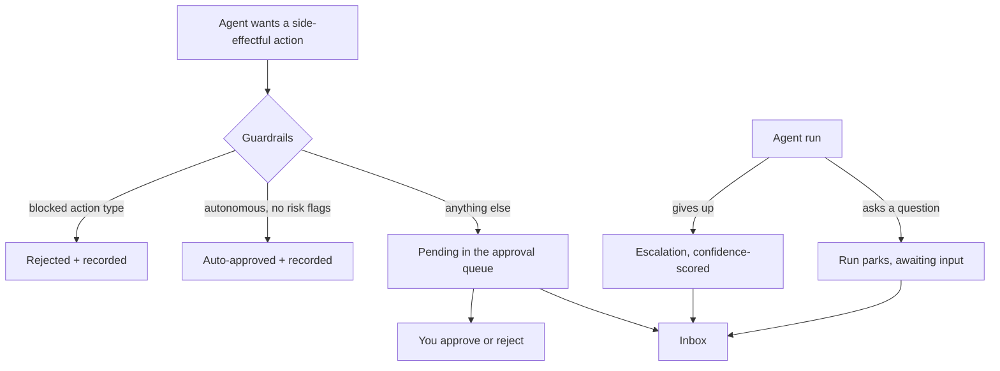

# Approvals, Escalations & Guardrail Modes

An autonomous workforce is only useful if you can say **how autonomous**. Ever Works gives you three distinct moments where a human stays in the loop, and each one is a separate mechanism you configure separately:

| Moment                 | What triggers it                                                          | Where you answer it                                    |
| ---------------------- | ------------------------------------------------------------------------- | ------------------------------------------------------ |
| **An action proposal** | An Agent wants to take a side-effectful action (spawn, schedule, send, …) | The approval queue on the dashboard home, or the Inbox |
| **An escalation**      | A run **gave up** — the gate stayed red, a policy refused, budget stopped | The Inbox, the Task detail, `GET /api/escalations`     |
| **A question (HITL)**  | The Agent explicitly asked you something and parked its run               | The Inbox — your reply un-parks the run                |

Guardrails decide which proposals ever reach you. Escalations and questions always do.



## Guardrails: what an Agent may do on its own

Guardrails are a **per-Agent policy** evaluated before a proposed action ever reaches the queue. An Agent with no guardrails configured (the default for every new Agent) queues **everything** for a human — that is the conservative posture, and nothing about adding guardrails is required.

| Field                    | Type                              | Meaning                                                                                      |
| ------------------------ | --------------------------------- | -------------------------------------------------------------------------------------------- |
| `mode`                   | `require_approval` · `autonomous` | `require_approval` queues every proposal. `autonomous` may auto-approve unflagged proposals. |
| `autoApproveActionTypes` | list of action types (optional)   | Narrows `autonomous`: only these types may auto-approve. Omitted = all types eligible.       |
| `blockedActionTypes`     | list of action types (optional)   | This Agent may never take these. Applies in **both** modes.                                  |

The action types are a fixed set:

| Action type       | What the Agent is proposing        |
| ----------------- | ---------------------------------- |
| `spawn_agent`     | Start a sub-agent                  |
| `schedule_task`   | Put a task on a schedule           |
| `send_message`    | Send a message through a connector |
| `budget_override` | Raise or bypass a spend ceiling    |
| `other`           | Anything not covered above         |

### The decision table

The policy evaluator (`evaluateGuardrails`) runs first-match-wins:

1. **No guardrails set** → queue (identical to the pre-guardrails behaviour).
2. **The type is in `blockedActionTypes`** → block.
3. **`mode: autonomous`, zero risk flags, and the type is auto-approvable** → auto-approve.
4. **Everything else** → queue.

Two consequences worth internalising:

- **Risk flags always win.** An `autonomous` Agent never self-approves an action the risk scorer flagged. Autonomy buys you speed on routine actions, not on destructive or cross-scope ones.
- **A blocked action is not silently dropped.** It is persisted as a `rejected` proposal with `decidedVia: 'guardrail'`, so the attempt is visible in the queue's history. An auto-approved action is likewise persisted as `approved` with `decidedVia: 'guardrail'` and no `decidedById` — no human made that call, and the record says so.

### Setting guardrails

In the dashboard: **Sidebar → Teams → Agents → your Agent** (`/agents/:id`) → the **Guardrails** card on the Dashboard tab. Pick a **Dispatch mode** (_Require approval_ / _Autonomous_), tick the **Auto-approve action types** (only shown in autonomous mode) and the **Blocked action types**, then **Save guardrails**. **Reset to default** clears the policy back to queue-everything.

The card enforces the same rule the server does: ticking a type on one list unticks it on the other, because a type can never be both auto-approved and blocked.

Over the API:

```
PUT /api/agents/:id/guardrails
{ "guardrails": { "mode": "autonomous", "autoApproveActionTypes": ["schedule_task"], "blockedActionTypes": ["budget_override"] } }
```

```
PUT /api/agents/:id/guardrails
{ "guardrails": null }        # back to the default queue-everything posture
```

Notes on the contract:

- It is a **PUT**: the whole object is replaced, so a follow-up call that omits a list drops it.
- Guardrails are **not** a create/update field. Passing `guardrails` to `POST /api/agents` or `PATCH /api/agents/:id` is rejected with `400`.
- Validation rejects an unknown mode, an unknown action type, a duplicate inside a list, and any overlap between the two lists.
- Cross-user ids return `404`, never `403` — existence is never leaked.

## Risk flags: why a proposal queues anyway

Every proposal is scored by a pure, deterministic risk scorer before the guardrails are consulted. Same input, same flags, every time — and the flags are emitted in a stable order so the badges never shuffle.

| Flag              | Raised when                                                                           | Shown as        |
| ----------------- | ------------------------------------------------------------------------------------- | --------------- |
| `budget_override` | The action type is `budget_override`.                                                 | Budget override |
| `destructive`     | The payload is marked `destructive` (delete / hard-reset / purge).                    | Destructive     |
| `cross_scope`     | The payload is marked `crossScope`, or its source and target scopes differ.           | Cross-scope     |
| `high_fanout`     | A `spawn_agent` payload has `spawnDepth` of **3 or more** — an agent spawning agents. | High fan-out    |

Any flag at all forces the human queue, whatever the guardrail mode says.

## The approval queue

When a proposal ends up pending, it appears in the **Action approvals** block on the dashboard home (`/`), above your Missions — _"Your agents proposed these side-effectful actions. Approve or reject each one."_ The block carries a count, self-hides the moment the last row is decided, and shows each row's action-type badge plus its risk badges.

Per row: **Approve** or **Reject**. In the header: **Approve all**, which decides the whole visible queue in one call.

### API

| Route                                   | Does                                                        |
| --------------------------------------- | ----------------------------------------------------------- |
| `GET /api/agent-approvals`              | Your proposals, newest first. Defaults to `status=pending`. |
| `GET /api/agent-approvals/:id`          | One proposal.                                               |
| `POST /api/agent-approvals/:id/approve` | Approve a pending proposal.                                 |
| `POST /api/agent-approvals/:id/reject`  | Reject a pending proposal.                                  |
| `POST /api/agent-approvals/approve-all` | Bulk-approve, optionally narrowed to an `ids` subset.       |

The list returns `{ data, meta: { total, limit, offset } }`. `status` is a strict enum (`pending` · `approved` · `rejected`), `organizationId` narrows to one Organization's queue, `limit` is 1–200 (default 50), `offset` is ≥ 0 — anything else is a `400`.

Decision semantics:

- A decision is **final**. Re-deciding an already-decided proposal returns `409` rather than silently flipping the record.
- `approve-all` is **best-effort**: rows somebody already decided are counted as `skipped`, not failed, and unknown ids are ignored. The response is `{ approved, skipped }`.
- Writes are rate-limited to 30 per minute per user.

:::note What approval records today
The proposal row is the durable **queue and decision record**. Approving marks the proposal `approved` and stamps who decided it and when; automatically resuming or executing the approved action is a follow-up increment. There is also no public endpoint that _creates_ a proposal — proposals are minted internally by the platform on an Agent's behalf, so a brand-new account's queue is legitimately empty.
:::

## Escalations: when a run gives up

An escalation is the record written whenever an Agent stops **without finishing** and a human has to decide. It carries a one-line `summary`, a `decisionNeeded` phrased as an instruction, and the `attempted` trail — what the Agent already tried before giving up.

| Reason code         | The run stopped because…                                                           |
| ------------------- | ---------------------------------------------------------------------------------- |
| `merge-refused`     | The resolved [merge policy](./merge-policy.md) refused the merge; the PR is open.  |
| `guardrail-refusal` | A permission, allowlist or policy refused an action the Agent needed.              |
| `judge-escalated`   | Every check passed, but the acceptance judge says the Task is not satisfied.       |
| `gate-exhausted`    | The bounded red→iterate loop used every attempt and required checks are still red. |
| `loop-detected`     | The doom-loop detector stopped a run cycling on the same failure.                  |
| `budget-stop`       | An Agent or Work budget / credit ceiling stopped the work.                         |
| `awaiting-input`    | The Agent parked on a question it cannot answer itself.                            |
| `gate-precheck-red` | The cheap pre-check failed and policy refuses to spend a model call on it.         |
| `queued-too-long`   | The run never got capacity inside the bound.                                       |
| `run-parked`        | The sweeper hibernated a stale run; it is resumable but nobody is driving it.      |

### Confidence — so the queue ranks instead of merely listing

Every escalation is scored `0..1` for **how sure the platform is that a person genuinely has to act**, and the queue is ordered by that score before recency. A merge refused by policy outranks a run parked because infrastructure hiccuped.

Two scorers produce it:

- **The deterministic table** (default, free, never fails): a per-reason prior — `merge-refused` 0.9, `guardrail-refusal` / `judge-escalated` 0.85, `gate-exhausted` / `loop-detected` 0.8, `budget-stop` 0.75, `awaiting-input` 0.7, `gate-precheck-red` 0.6, `queued-too-long` 0.45, `run-parked` 0.35 — nudged by ±0.1 depending on how much attempt evidence is attached.
- **The AI judge** (opt-in, `AGENT_ESCALATION_CONFIDENCE_JUDGE=on`): one small structured call through the AI facade that reads the summary, the decision needed and the attempt trail and returns a calibrated number. It is off by default because escalations are written exactly when a deployment is already unhealthy, and the deterministic table is the floor, not a degraded mode. Build output entering that prompt is sanitised and hard-capped first.

A **null** confidence means "never scored" (rows written before the column existed, or with scoring switched off) — it sorts last and must never be read as "low confidence".

### API

| Route                                          | Does                                                          |
| ---------------------------------------------- | ------------------------------------------------------------- |
| `GET /api/escalations`                         | Your queue, highest confidence first, then newest.            |
| `GET /api/escalations/:id`                     | One escalation.                                               |
| `POST /api/escalations/:id/resolve`            | Close it, with an optional `note` recording what you decided. |
| `GET /api/tasks/:id/escalations`               | The escalation feed for one Task.                             |
| `POST /api/tasks/:id/escalations/:eid/resolve` | Close one from the Task detail.                               |

`?status=open` or `?status=resolved` narrows the list; omit it and you get both, because "what did I already decide?" is half of what makes a queue trustworthy. `limit` is 1–100 (default 50). Resolve is an owner-scoped compare-and-set on `open`, so a double-click resolves exactly once and a foreign id is indistinguishable from a missing one (`404`).

Escalations are **idempotent per run**: every writer derives a stable dedup key (`reasonCode:runId`), so a retried background task or a redelivered webhook produces one card, not five. Recording is best-effort by contract — an escalation describes a failure and must never cause one — and can be switched off entirely with `AGENT_ESCALATION_LOGGING_ENABLED=false`.

### Delivery

A recorded escalation is mirrored into your **[Inbox](./inbox.md)** as an `escalation` item carrying the summary and the decision needed. The Inbox is the first item under the dashboard in the sidebar and the only nav entry with an unread badge (it polls every 30 seconds). Replying to an escalation item resolves the escalation with your reply as the resolution note — and if a parked run is linked to it, that run is resumed as well. The same open escalations feed the digest.

## HITL questions: a run that parks until you answer

Agents have an `ask_human` tool for the case they should never guess at: ambiguous requirements, a risky or irreversible step, missing credentials, a choice between materially different directions. Calling it:

1. Writes a `question` item into your Inbox — first line as the subject, optionally with structured **options** (`id` + `label`) so you can answer in one click.
2. Parks the run (`awaitingInput`). A parked run is **never reaped** by the idle sweeper — that exemption is enforced both in the sweeper and in SQL.
3. The Agent finishes its turn with a short status summary rather than spinning.

Your reply is routed for you: if the run is still live it is **steered** (injected between tool round-trips); if it already parked or ended it is **resumed** as a new run seeded with your answer, carrying the original's session so the Agent keeps its context. Either way `awaitingInput` clears. See [Sessions & Run Steering](./sessions-and-steering.md) for the run-side view.

Approval items in the Inbox work the same way: replying with the `approve` or `reject` option proxies straight to the approval queue's decision endpoint, so you can clear the queue without leaving the Inbox.

## The safety nets around it

Approvals and escalations are the human-facing layer. Underneath, several mechanisms stop an Agent from burning your budget while nobody is watching:

| Net                        | What it does                                                                                                                                                                                  |
| -------------------------- | --------------------------------------------------------------------------------------------------------------------------------------------------------------------------------------------- |
| **Auto-pause on failures** | Each failed run increments the Agent's `errorCount`; when it reaches `pauseAfterFailures` the Agent moves to `error` and its heartbeat is cleared. A successful run resets the count to zero. |
| **Doom-loop detector**     | Ends a run that is cycling without progress and files a `loop-detected` escalation with the evidence.                                                                                         |
| **Budgets**                | A per-Agent or per-Work ceiling short-circuits the next AI call and can raise a `budget-stop` escalation.                                                                                     |
| **Tool grants**            | An allow/deny matrix over the tools an Agent may call. `deny` is additive and permanent — no descendant scope can un-deny a tool.                                                             |
| **Merge policy**           | Decides whether an Agent may land its own pull request at all; a refusal becomes a `merge-refused` escalation.                                                                                |

### Auto-pause after N failures

`pauseAfterFailures` defaults to **3** and accepts 1–20. Set it on the Agent's **Settings** tab (`/agents/:id/settings`) in the **Pause after failures** field, alongside the permission switches that gate what the Agent may do at all.

### The doom-loop detector

A retry budget stops a run looping forever. It does not stop it looping **pointlessly** — an Agent failing the same check with the same error on attempts 1, 2 and 3 will happily spend 4 and 5 hitting the same wall. The detector recognises that from the failure trail itself, stops, and escalates with the evidence attached, so the remaining budget is spent on a human decision instead of a fifth identical failure.

It is a pure function over the attempt trail, with two deliberately conservative signals:

| Signal             | Fires when                                                                                                                     |
| ------------------ | ------------------------------------------------------------------------------------------------------------------------------ |
| `repeated-failure` | The last _N_ attempts produced **one identical, non-empty** failure fingerprint and none reported progress. `N` defaults to 3. |
| `retry-storm`      | The trail reached the retry ceiling (default 4), **no** attempt reported progress, and at least one failure repeated.          |

Details that matter in practice:

- **Progress clears the suspicion.** A single attempt that reports measurable forward progress — fewer failing checks, a check that went red to green — resets both signals for its window.
- **Fingerprints are normalised**, not compared raw: timestamps, durations, byte counts, hex ids, UUIDs, absolute paths, ports and line/column numbers are all masked, because two runs of the same broken command differ in all of them. Failures are also compared order-insensitively, so "lint, typecheck" and "typecheck, lint" are the same state.
- **A trail of genuinely different failures is not a storm.** The `distinctFailures < attempts` clause is what separates cycling from an Agent legitimately marching through a list of different problems.
- **The detector only escalates.** It never deletes work and never fails a run on its own account.

It is **on by default**. Operator knobs:

| Environment variable              | Default | Effect                                                                  |
| --------------------------------- | ------- | ----------------------------------------------------------------------- |
| `AGENT_RUN_LOOP_DETECTOR_ENABLED` | on      | Set to `false` to fall back to the attempt cap alone.                   |
| `AGENT_RUN_LOOP_REPEAT_THRESHOLD` | `3`     | Consecutive identical failures that count as a loop (clamped 2–10).     |
| `AGENT_RUN_LOOP_MAX_RETRIES`      | `4`     | Attempt count at which a progress-free trail is a storm (clamped 1–20). |

Three, not two, is the default on purpose: two identical failures is what a legitimate "fix it and re-run" looks like when the fix was wrong, and firing there would make the detector a nuisance rather than a saving.

## How to: start strict, then relax

The recommended path for a new Agent is to watch it decide a few times before letting it decide alone.

1. **Create the Agent.** Sidebar → **Teams** → **Agents** tab → **+ New Agent**. It starts with `guardrails: null`, which already means "queue everything".
2. **Confirm the strict posture.** Open `/agents/:id`, scroll to the **Guardrails** card, select **Require approval** as the dispatch mode, and tick any action types you want **blocked outright** — `budget_override` is the usual first choice. **Save guardrails**.
3. **Set the failure fuse.** On the **Settings** tab, set **Pause after failures** to a value you are comfortable with (3 is the default), and leave the permission switches off for anything the Agent does not need yet.
4. **Give it a budget.** On the **Budgets** tab, cap the Agent's spend per interval. See [Budgets & Usage](./budgets-and-usage.md).
5. **Run it.** Use **Run heartbeat now** on the Agent's Dashboard tab, or assign it a Task.
6. **Decide from the dashboard.** Proposals appear in the **Action approvals** block on the dashboard home (`/`). Read the action-type and risk badges, then **Approve** or **Reject** per row — or **Approve all** once you have read them. The same items are waiting in the **Inbox** if you prefer to work one queue.
7. **Review what it asked for.** After a few cycles, look at what the Agent actually proposed and at any escalations it raised (`GET /api/escalations`, or the Inbox). That trail is your evidence for the next step.
8. **Relax the mode.** Back in the **Guardrails** card, switch to **Autonomous**. Leave the auto-approve list at "all types" only if you are comfortable with every unflagged action; otherwise tick just the types you trust — `schedule_task` and `send_message` are typical — and keep `budget_override` on the blocked list. **Save guardrails**.
9. **Verify the narrowing held.** Risky actions still queue: anything the risk scorer flags as destructive, cross-scope, high fan-out or a budget override lands in the approval block regardless of the mode. If your queue goes quiet _and_ nothing risky is happening, the relaxation worked.

To go back at any point, hit **Reset to default** on the Guardrails card — or `PUT /api/agents/:id/guardrails` with `{"guardrails": null}` — and every proposal queues again.

## Related

- [Agent Capabilities](./agent-capabilities.md) — tool grants, MCP servers, repos and collaborators
- [Merge Policy](./merge-policy.md) — whether an Agent may land its own pull request
- [Budgets & Usage](./budgets-and-usage.md) — the spend ceilings behind `budget-stop`
- [Inbox](./inbox.md) — where questions, approvals, escalations and notices arrive
- [Agents](./agents.md) · [Sessions & Run Steering](./sessions-and-steering.md) · [Quality Gates](./quality-gates.md)
