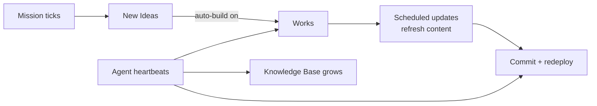

# Autonomous Operation (24/7)

Most AI builders generate a site once and stop. You get code, and then you're on your own — to write the content, keep it fresh, fix what breaks, market it, and grow it. **Ever Works keeps going.** Once you've pointed it at a [Mission](./missions.md) or shipped a [Work](./creating-a-work.md), the platform's [Agents](./agents.md) and background workers keep researching, writing, building, deploying, and improving — on a schedule, not just when you prompt.

This is the difference between *"here's your code, figure out the rest"* and *"here's your working business that keeps getting better."* It's also the half of the product that the one-shot builders don't have.

## What "keeps going" actually means

| It keeps… | …by |
|---|---|
| **Adding content** | Scheduled generation writes new blog posts, finds and adds new directory items, refreshes stale entries. |
| **Generating ideas** | A running Mission keeps proposing new [Ideas](./ideas.md) that ladder up to your goal. |
| **Improving the build** | Agents open work on the code and content of a Work — fixes, new pages, new sections. |
| **Researching** | Agents gather findings into the [Knowledge Base](./knowledge-base.md) so future runs are smarter. |
| **Maintaining quality** | Scheduled updates re-run the pipeline; community PRs and item-source validation keep data accurate. |
| **Deploying** | Every change is committed to Git and redeployed to your target automatically. |

## The mechanisms

Autonomy isn't one feature — it's several, working together:

- **[Scheduled Updates](./scheduled-updates.md)** — re-run a Work's generation pipeline on a cadence (daily, weekly, your choice) to keep content current.
- **Agent heartbeats** — each [Agent](./agents.md) wakes on its own cron, decides the single most useful next action, and takes it: create a task, advance one, write to the KB, or observe.
- **Scheduled Missions** — a [Mission](./missions.md) can tick on a cadence, generating fresh Ideas each time as the world changes.
- **Auto-build** — turn it on and accepted Ideas become Works without you clicking anything.
- **Background workers** — the [Workers](./workers.md) layer runs all of this reliably in the background, in parallel, with retries.
- **Community PR processing** — incoming contributions are triaged and merged into your data automatically.

## You stay in control

Autonomy is opt-in and bounded:

- **Budgets at every level** — per-Work, per-Idea, per-Mission, per-Agent, and account-wide caps, soft (alert) or hard (block). See [Budgets & Usage](./budgets-and-usage.md).
- **Guardrails** — max items per run, approval rules, outstanding-Ideas caps on Missions.
- **Pause / Resume** — stop any Agent, Mission, or schedule instantly.
- **Auto-pause on failure** — a worker that keeps erroring pauses itself rather than burning spend.
- **Full audit trail** — every autonomous action emits activity-log entries and Git commits you can review and revert.

## You own everything

Because code and content both live in **your Git repositories**, autonomous operation never locks you in. Every blog post written overnight, every product added to a directory, every code change an Agent ships is a commit in a repo you own. Turn the platform off and your working business is still yours.

## See also

- [Missions](./missions.md) · [Ideas](./ideas.md) · [Agents](./agents.md)
- [Scheduled Updates](./scheduled-updates.md) · [Workers](./workers.md)
- [Knowledge Base & Memory](./knowledge-base.md) · [Budgets & Usage](./budgets-and-usage.md)
