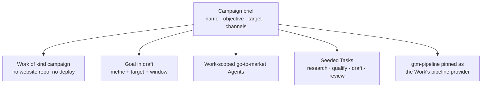
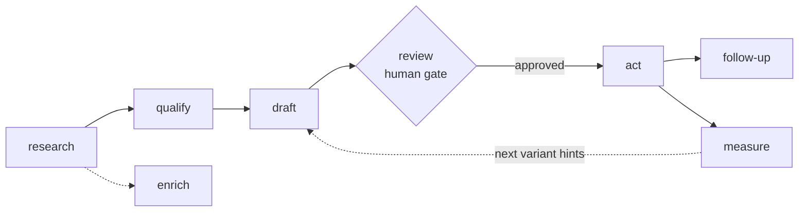

# Campaigns (Go-to-Market Work)

A **Campaign** is a [Work](./creating-a-work.md) of kind `campaign` — the artifact home for everything a go-to-market run produces: the lead list, the drafts waiting at the review gate, the prepared actions, and the period report. It is not a website. It has no website repository, no deploy provider and no Deploy tab; what it has is a [Goal](./goals.md), a board of pipeline [Tasks](./tasks.md), a set of Work-scoped [Agents](./agents.md), and a [Knowledge Base](./knowledge-base.md) holding the brief and the approved messaging.

One brief starts the whole thing. You fill in a name and an objective on `/works/new/campaign`, and a single API call provisions the Work, the Goal, the go-to-market Agents, the first pipeline Tasks and the pipeline preference — all of it, or none of it.

:::info Status — early access
The activation path is complete and tested at the unit level (`campaign-activation.service.spec.ts`, `campaign-form-client.unit.spec.tsx`, the `gtm-pipeline` suites), but **no end-to-end browser test covers this screen yet**, so treat anything odd as a bug worth filing rather than expected behaviour. Two more limits worth knowing up front: the go-to-market pipeline plugin does **not** auto-enable (`autoEnable: false`), so you enable it yourself before starting a campaign; and approvals at the review gate travel as run configuration (`approved_draft_refs`) — there is no dedicated draft-review screen in the dashboard today.
:::

**Key sources:**

- `apps/web/src/app/[locale]/(dashboard)/works/new/campaign/campaign-form-client.tsx` — the brief form
- `apps/web/src/app/actions/dashboard/works.ts` — `createCampaignWork()`, the server action behind it
- `apps/api/src/works/work-campaigns.controller.ts` — `GET /api/works/campaign-template`, `POST /api/works/from-campaign-template`
- `packages/agent/src/campaigns/campaign-activation.service.ts` — what one activation writes, and how it rolls back
- `packages/agent/src/campaigns/campaign-template.ts` — the seeded stages, Goal defaults and agent selection
- `packages/plugins/gtm-pipeline/src/gtm-pipeline.plugin.ts` — the eight-stage pipeline
- `packages/contracts/src/skills/gtm-skills.ts` — the sixteen first-party go-to-market Skills

## What a campaign Work has

The `campaign` kind is declared in the shared capability registry (`packages/contracts/src/domain/work-capabilities.ts`), so the API, the runtime and the dashboard all agree on its shape:

| Capability                     | Campaign                                        | Why                                                                                    |
| ------------------------------ | ----------------------------------------------- | -------------------------------------------------------------------------------------- |
| Items / Taxonomy / Comparisons | off                                             | A campaign produces contacts, drafts and reports — not catalogue items.                |
| Item import/export             | off                                             | Same reason.                                                                           |
| Community PRs                  | off                                             | No public content repository to receive them.                                          |
| Source validation              | off                                             | Same reason.                                                                           |
| **Deploy**                     | **off**                                         | Nothing to publish. The Work is created with `deployProvider: null` and no Deploy tab. |
| **Knowledge Base**             | **on**                                          | The campaign brief and the approved messaging belong here.                             |
| Repositories                   | data + work, no website                         | There is no site to build.                                                             |
| Metric tiles                   | Agents · Open Tasks · Conversions · Days Active | The kind's own metric vocabulary.                                                      |

`Conversions` is provider-backed: it reads `not_configured` until an analytics provider is connected to the Work. The other three tiles are computed by the platform and work immediately.

A campaign Work is also **never minted by the ordinary create path**. It is deliberately absent from `USER_SELECTABLE_WORK_KINDS`, so `POST /api/works` with `kind: "campaign"` is normalised to `default`. Campaign activation is the only door. See [Work Kinds & Capabilities](./work-kinds.md) for the full kind matrix.

## Before you start: enable the pipeline

The **Go-to-Market Pipeline** plugin (`gtm-pipeline`) ships built in but sets `autoEnable: false`, which means it is off until you switch it on.

1. Open **Plugins** in the dashboard sidebar (`/plugins`).
2. Find **Go-to-Market Pipeline** (category **Pipeline**) and **Enable** it.
3. Make sure you also have an **AI provider** and a **search** plugin enabled — the pipeline declares `selectableProviderCategories: ["ai-provider", "search"]`, and the research and drafting stages need both.

Activation pins the pipeline to the new Work for you, so you do not need to touch the Work's own **Plugins** tab afterwards.

:::caution What happens if you skip this
Activation still succeeds — you get the Work, the Goal, the Agents and the Tasks. Only the pipeline pin fails, because pinning a plugin to a Work requires it to be enabled at account level first (`Plugin "gtm-pipeline" must be enabled at user level first`). The form then shows the warning _"The go-to-market pipeline could not be pinned to this Work; runs will auto-detect a pipeline instead."_ Fix it by enabling the plugin on `/plugins`, then enabling it on the campaign Work's **Plugins** tab.
:::

## How to start a campaign

1. Go to **Works → New Work** (`/works/new`) and click **Start a campaign**. The button sits apart from the website chips on purpose: a campaign is not a website, so none of the git-provider, deploy-provider or template pickers on that page apply. It takes you to `/works/new/campaign`.
2. Fill in **Campaign name** — up to 100 characters (e.g. _Q3 developer launch_). It also seeds the Work slug.
3. Fill in **Objective** — up to 500 characters (e.g. _Book 25 qualified demos with platform engineering teams_). This becomes the Goal and is repeated into every seeded Task's description.
4. Optionally set a **Target**: a positive number plus a free-text unit (e.g. `25` and `demos`). Leave it blank and the Goal defaults to **10 conversions per month**.
5. Optionally list **Channels**, comma-separated (e.g. `email, linkedin, newsletter`). They are trimmed to 40 characters each, de-duplicated case-insensitively, and capped at 10. They are recorded as labels on the seeded Tasks.
6. Click **Start campaign**. The panel above the button (_"What this provisions"_) lists exactly what you are about to get.
7. You land on the new Work at `/works/:id`, with a success toast. If the pipeline could not be pinned, a second warning toast says so.

The same flow is available to any API client — see [Starting a campaign over the API](#starting-a-campaign-over-the-api) below.

## What one activation provisions



| Artifact     | What is written                                                                                                                                                                                                              |
| ------------ | ---------------------------------------------------------------------------------------------------------------------------------------------------------------------------------------------------------------------------- |
| **Work**     | Kind `campaign`, status `active`, description = your objective, `deployProvider: null`. The slug is derived from the name and de-duplicated (`<slug>`, then `<slug>-2`, …) against your existing Works.                      |
| **Goal**     | Title `"<name> — <objective>"` (truncated to 200 characters), description carrying the objective and the channel list. Metric source `work-metrics` / `conversions`, scoped with `params: { workId }`. Created in **draft**. |
| **Agents**   | One Agent per prebuilt go-to-market template, scoped to the new Work — so a second campaign can reuse the same template names without colliding.                                                                             |
| **Tasks**    | One Task per seeded pipeline stage (research → qualify → draft → review), each labelled `gtm-pipeline`, `stage:<id>` and every channel you listed, and linked to both the Work and the Goal.                                 |
| **Pipeline** | `gtm-pipeline` set as the Work's active `pipeline` capability provider — best-effort, and reported back honestly when it fails.                                                                                              |

**It is all-or-nothing.** The five artifacts belong to five different services with no shared database transaction, so activation runs as a compensating transaction: everything created is recorded, and on any failure it is removed in reverse order before the error is re-raised. You never end up with a half-provisioned campaign. Every call is made with your own user id and each service re-checks ownership, so activation can only write into your own account.

### The seeded Tasks

Activation stops seeding at the review gate — the human checkpoint before anything goes out. Later stages are queued by the pipeline once drafts are approved.

| Stage      | Task title                                            | Status  | Priority |
| ---------- | ----------------------------------------------------- | ------- | -------- |
| `research` | Research: collect seed contacts and market signals    | To do   | P1       |
| `qualify`  | Qualify: score and risk-filter the collected contacts | Backlog | P2       |
| `draft`    | Draft: write the campaign messaging                   | Backlog | P2       |
| `review`   | Review: approve drafts before anything goes out       | Backlog | P2       |

Open them at `/works/:id/tasks`, or filter the global board at `/tasks` by the `gtm-pipeline` label.

## The go-to-market Agents

The prebuilt Agent catalog (`packages/agent/src/agents/agent-templates.ts`) ships **six** go-to-market presets. Campaign activation creates the five that declare `suggestedPipeline: "gtm-pipeline"`; the sixth, **SEO Auditor**, is available from the Agent catalog but is not campaign-activated because it audits sites rather than driving a campaign.

| Template slug         | Agent               | What it does                                                                  | Suggested Skills                                                                          | Campaign-activated |
| --------------------- | ------------------- | ----------------------------------------------------------------------------- | ----------------------------------------------------------------------------------------- | ------------------ |
| `content-marketer`    | Content Marketer    | Newsletter issues and long-form drafts from briefs, notes and signals.        | `newsletter-drafting`, `digest-compilation`, `campaign-reporting`                         | yes                |
| `lead-researcher`     | Lead Researcher     | Builds, scores and enriches lead lists — never invents contact details.       | `lead-research`, `contact-enrichment`, `lead-scoring`, `risk-filter`                      | yes                |
| `outreach-drafter`    | Outreach Drafter    | Personalized 80–120 word outbound drafts per qualified lead and channel.      | `outreach-personalization`, `follow-up-cadence`, `reply-detection`                        | yes                |
| `social-scheduler`    | Social Scheduler    | Plans a social calendar and stages channel-fit posts for review.              | `social-scheduling`, `news-signal-detection`, `engagement-analysis`, `digest-compilation` | yes                |
| `competitive-analyst` | Competitive Analyst | Monitors chosen companies and compiles recurring, source-linked digests.      | `competitor-watch`, `news-signal-detection`, `digest-compilation`                         | yes                |
| `seo-auditor`         | SEO Auditor         | Reviews website and blog Works for search visibility, with prioritized fixes. | `seo-audit`, `campaign-reporting`, `engagement-analysis`                                  | no                 |

Every one of them is created with the **review-before-act** posture: guardrail mode `require_approval`, and no permission flags granted (`canCommitToRepo`, `canCallExternalTools` and the rest all start `false`). Widen them deliberately, one Agent at a time, on that Agent's **Settings** tab (`/agents/:id/settings`) — the **Capabilities** tab (`/agents/:id/capabilities`) shows the same flags read-only. See [Agents](./agents.md), [Agent Capabilities](./agent-capabilities.md) and the [Agents Catalog](./agents-catalog.md).

Because the campaign selects agents by the pipeline they declare, adding a new go-to-market template to the catalog automatically ships it with the next campaign — there is no second list to keep in sync.

## The go-to-market Skills

Sixteen first-party Skills back those templates. They are typed definitions in `@ever-works/contracts`, projected into ordinary catalog entries by the first-party skills provider — so they install, render and attach through exactly the same path as a `SKILL.md` from the public catalog repo, and a published Skill with the same slug wins over the built-in one. Browse them in the **Skills** block at the bottom of **Teams → Agents** (`/agents#skills`); see [Skills Catalog](./skills-catalog.md).

| Stage       | Skill                    | Slug                       | What it produces                                                                                 |
| ----------- | ------------------------ | -------------------------- | ------------------------------------------------------------------------------------------------ |
| `research`  | Lead research            | `lead-research`            | A candidate lead list with a supporting source recorded for every contact.                       |
| `research`  | Competitor watch         | `competitor-watch`         | Dated, source-linked change signals for a watchlist of companies.                                |
| `research`  | News signal detection    | `news-signal-detection`    | Newsworthy events ranked by relevance to the campaign, noise discarded.                          |
| `qualify`   | Lead scoring             | `lead-scoring`             | Contacts scored 0–100 against a declarative weight table, with a reason per point.               |
| `qualify`   | Risk filter              | `risk-filter`              | Low-quality or unsafe contacts flagged and excluded at or above the threshold.                   |
| `draft`     | Outreach personalization | `outreach-personalization` | One 80–120 word personalized draft per qualified contact, grounded only in known facts.          |
| `draft`     | Newsletter drafting      | `newsletter-drafting`      | A scannable newsletter issue with one clear call to action.                                      |
| `draft`     | Social scheduling        | `social-scheduling`        | A channel-fit social calendar with each post staged for review.                                  |
| `draft`     | Digest compilation       | `digest-compilation`       | A recurring digest that separates facts from analysis and highlights change.                     |
| `act`       | CRM sync hygiene         | `crm-sync-hygiene`         | Reviewed records prepared for a customer-record sync — no duplicates, no destructive overwrites. |
| `follow-up` | Follow-up cadence        | `follow-up-cadence`        | Timed re-engagement for quiet threads, with caps and an unconditional stop on any reply.         |
| `follow-up` | Reply detection          | `reply-detection`          | Inbound replies classified interested / not-now / decline / opt-out, and routed.                 |
| `enrich`    | Contact enrichment       | `contact-enrichment`       | Missing contact and account fields backfilled, with the evidence recorded per fill.              |
| `measure`   | Search-visibility audit  | `seo-audit`                | A prioritized, evidence-cited fix list for a site or content Work.                               |
| `measure`   | Campaign reporting       | `campaign-reporting`       | Counted totals, honest insights, and concrete hints for the next cycle.                          |
| `measure`   | Engagement analysis      | `engagement-analysis`      | Engagement compared across variants, channels and segments, with a confidence call.              |

Each Skill declares its own input and output keys (`contacts`, `signals`, `scored_contacts`, `drafts`, …) in the same vocabulary the pipeline stages use, so a Skill's contract can be read against the stage that invokes it without a translation table. There is deliberately no Skill for the `review` stage — that stage is a human gate, not a prompt.

## The `gtm-pipeline` plugin

The pipeline is engine-orchestrated: the engine calls each stage in turn (calling `execute()` on the plugin directly is refused), and every stage declares what it `requires` and `provides`, so hand-offs are explicit and auditable.



| Stage       | Requires          | Provides              | Optional | What it does                                                                                                                                            |
| ----------- | ----------------- | --------------------- | -------- | ------------------------------------------------------------------------------------------------------------------------------------------------------- |
| `research`  | —                 | `contacts`, `signals` | no       | Normalizes the seed contacts supplied in `config.contacts` and collects fresh public signals through the search facade. **It never fabricates people.** |
| `qualify`   | `contacts`        | `scored_contacts`     | no       | Deterministic-first scoring against a named weight table plus risk filtering, so every score carries the rules that fired.                              |
| `draft`     | `scored_contacts` | `drafts`              | no       | One personalized draft per contact per channel, 80–120 words, from known fields and signals only — no raw email addresses reach the model.              |
| `review`    | `drafts`          | `approved_drafts`     | no       | The human gate, before any outbound action. Pauses the run until approvals arrive.                                                                      |
| `act`       | `approved_drafts` | `action_log`          | no       | Records one `prepared` action per approved draft and one `skipped` entry per unapproved one. **It never sends.**                                        |
| `follow-up` | `action_log`      | `follow_up_queue`     | yes      | Queues re-engagement for prepared actions that go quiet for the configured window.                                                                      |
| `enrich`    | `contacts`        | `enriched_contacts`   | yes      | Evidence-bound backfill of company/title/notes from collected signals; degrades to a pass-through with no signals.                                      |
| `measure`   | `action_log`      | `campaign_report`     | no       | Compiles the period report and next-variant hints, grounded strictly in the run totals.                                                                 |

`enrich` is parallelizable (it depends on `research`, not on the chain before it). A stage whose outputs are already present can be skipped on a re-run.

### Pipeline settings

`gtm-pipeline` is a form-schema provider, so these fields render as the pipeline's own section of the run configuration, in three groups:

| Group             | Field                    | Default        | Range / values                                       |
| ----------------- | ------------------------ | -------------- | ---------------------------------------------------- |
| **Campaign**      | `target_channels`        | `["email"]`    | `email`, `blog`, `social`, `newsletter`, `community` |
| **Campaign**      | `tone`                   | `professional` | `professional`, `friendly`, `direct`, `enthusiastic` |
| **Campaign**      | `cadence`                | `weekly`       | `daily`, `weekly`, `biweekly`, `monthly`             |
| **Qualification** | `max_contacts_per_run`   | `20`           | 1–200                                                |
| **Qualification** | `qualify_min_score`      | `40`           | 0–100 — contacts below this are dropped              |
| **Qualification** | `risk_exclude_threshold` | `7`            | 0–10 — contacts at or above this are excluded        |
| **Review**        | `review_required`        | `true`         | boolean                                              |
| **Review**        | `follow_up_quiet_days`   | `4`            | 1–90                                                 |

Out-of-range numbers and unknown enum values are clamped or replaced with the default rather than failing the run, and the form validator rejects them before the run starts.

### The review gate

`review` is the whole safety posture of the pipeline, so it is worth stating precisely:

- With `review_required` on (the default) and no approvals supplied, the stage sets `pendingReview`, stops the engine, and leaves a **viable checkpoint** — the run is paused, not failed, and resumes once approvals arrive.
- Approvals are supplied as run configuration: `approved_draft_refs` is either `"all"` or an array of draft refs. Unknown refs are ignored with a warning; approvals that match nothing produce an explicit "none approved" warning.
- With `review_required` turned off, every draft is auto-approved **and the run records a warning saying so**, so the audit trail never hides an auto-approval.
- `act` stages approved drafts for delivery and logs the rest as `skipped` with a reason. Actual delivery is done by a human or by channel connectors that consume the action log — the pipeline itself is drafts-not-sends, end to end.

:::caution No draft-review screen yet
Nothing in the dashboard reads or writes `approved_draft_refs` today. Approvals reach the gate through the run configuration you pass when you start or resume the run. The Agents that produce those drafts have their own approval path — guardrail mode `require_approval` queues their proposals for you — see [Approvals & Escalations](./approvals-and-escalations.md).
:::

## Measuring the campaign

Activation creates one [Goal](./goals.md) from your objective, and it is an ordinary Goal in every respect — it appears at `/goals`, it can be edited, paused and deleted there, and it is created in **draft**.

| Goal field   | Value from a campaign brief                                                          |
| ------------ | ------------------------------------------------------------------------------------ |
| Title        | `"<campaign name> — <objective>"`, truncated to 200 characters                       |
| Description  | `Campaign objective: <objective>`, plus a `Channels:` line when you listed any       |
| Provider     | `work-metrics`, with `params: { workId }` so it reads this campaign's own numbers    |
| Metric       | `conversions` by default; the API also accepts `agents`, `open-tasks`, `days-active` |
| Direction    | _At least_ (`gte`)                                                                   |
| Target value | Your target, or `10`                                                                 |
| Unit         | Your unit, or `conversions`                                                          |
| Window       | Monthly, unless the API caller sends another window                                  |

**Nothing is evaluated until you activate it.** Open the Goal from `/goals` and press **Activate**; an active Goal then offers **Evaluate now** and **Pause**. Note that `conversions` is provider-backed — it reports `not_configured` until an analytics provider is connected to the Work — which is precisely why the Goal starts in draft rather than reporting a misleading zero.

An unsupported metric id is rejected at activation with a `400` naming the allowed set, and a target value that is not a positive number is rejected the same way.

## Starting a campaign over the API

Two endpoints, both under the standard bearer-token auth used everywhere else (see [API Keys](./api-keys.md)).

**Preview what activation will provision** — the agents, the seeded stages and the metric vocabulary, so a client can show it before committing:

```bash
curl -s https://api.ever.works/api/works/campaign-template \
  -H "Authorization: Bearer <token>"
```

**Activate a brief:**

```bash
curl -s -X POST https://api.ever.works/api/works/from-campaign-template \
  -H "Authorization: Bearer <token>" \
  -H "Content-Type: application/json" \
  -d '{
    "name": "Q3 developer launch",
    "objective": "Book 25 qualified demos with platform engineering teams",
    "target": { "metricId": "conversions", "value": 25, "unit": "demos", "window": "month" },
    "channels": ["email", "linkedin", "newsletter"]
  }'
```

| Field       | Required | Constraint                                                                                                                             |
| ----------- | -------- | -------------------------------------------------------------------------------------------------------------------------------------- |
| `name`      | yes      | 1–100 characters                                                                                                                       |
| `objective` | yes      | 1–500 characters                                                                                                                       |
| `slug`      | no       | Lowercase letters, digits and hyphens; derived from `name` and de-duplicated when omitted                                              |
| `target`    | no       | `metricId` from the campaign metric set, positive `value`, `unit` ≤ 32 chars, `window` one of `day`, `week`, `month`, `total`, `point` |
| `channels`  | no       | Up to 10 strings, each ≤ 40 characters                                                                                                 |

Responses: `201` with the activation summary (the Work, Goal, Agents, Tasks and pipeline result), `400` for an invalid brief, `409` when the slug is already taken. The endpoint is rate-limited to **10 activations per minute** per client, the same envelope as the other create paths.

The `pipeline` object in the `201` response is the one field worth checking in a client: `{ "id": "gtm-pipeline", "applied": false, "reason": "…" }` means everything else was created but the pipeline was not pinned.

## Related

- [Goals](./goals.md) — the metric the campaign is measured by, and how to activate it
- [Work Kinds & Capabilities](./work-kinds.md) — where `campaign` sits among the other kinds
- [Agents Catalog](./agents-catalog.md) · [Agents](./agents.md) — the presets activation clones, and the runtime behind them
- [Skills Catalog](./skills-catalog.md) — how the sixteen go-to-market Skills are served and attached
- [Plugins](./plugins.md) — enabling `gtm-pipeline` at account level and per Work
- [Tasks](./tasks.md) — the seeded stage board
- [Approvals & Escalations](./approvals-and-escalations.md) — the review-before-act posture the campaign Agents ship with
- [Knowledge Base](./knowledge-base.md) — where the brief and the approved messaging live
