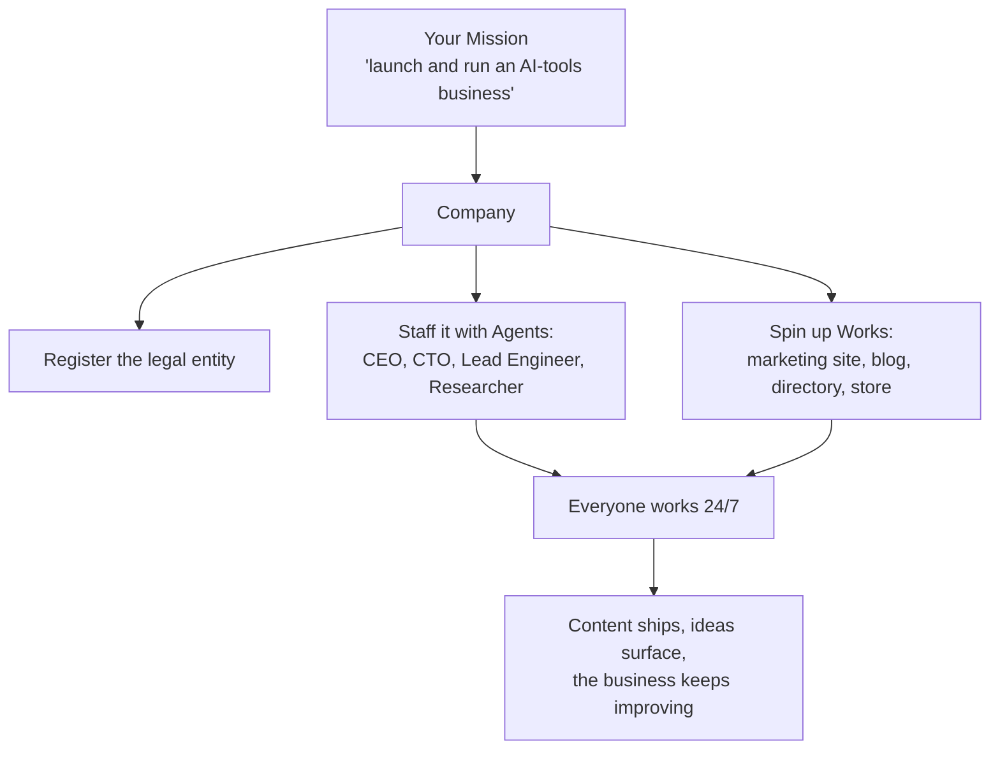

# Company Builder

> **Status: coming soon.** Company is a planned scope, telegraphed today by the **Company** chip on the create surface. Its foundations — [Missions](./missions.md), [Agents](./agents.md) with Tenant scope, [Tenants & Organizations](../advanced/multi-tenancy.md) — are live. The company-registration integrations and the "company-as-a-business" surface are on the roadmap. This page describes the destination.

The **Company Builder** is Ever Works' most ambitious shape: not a website, but the _organization that runs websites, stores, and everything else_ — staffed by AI [Agents](./agents.md) acting as real employees, working 24/7 toward your [Mission](./missions.md). If a Work is one site and a Mission is one goal, a **Company** is the whole operation: a CEO, a CTO, the Works they own, the budgets they spend against, and the schedule they run on.

## A Company is your workspace and org

In Ever Works, **Workspace = Company = Organization** — one top-level container for everything you build. The model:

- **Many companies per account.** Create several companies inside your tenant and **switch between them from the site header** (the logo + company selector). The selected company sets the context for everything you see.
- **Everything lives inside the selected company.** Your [Missions](./missions.md), [Ideas](./ideas.md), [Works](./creating-a-work.md), [Agents](./agents.md), and [Knowledge Base](./knowledge-base.md) are all scoped to the company you have picked. Switch companies and the whole workspace context switches with you.
- **Register it for real — as a Work.** When you're ready to incorporate, registering the legal entity (in many countries, including the US) runs through formation **provider plugins** and is itself a **kind of Work** the platform builds for you — so going from workspace to a real company is part of the same flow.

(See [How it relates to Tenants & Organizations](#how-it-relates-to-tenants--organizations) below for the underlying multi-tenancy foundation.)

## From idea to operating company

## What the Company Builder is planned to do

- **Help you register the company** — guided incorporation through provider integrations (planned: Stripe Atlas and other formation/banking providers), so going from idea to a real legal entity is part of the flow, not a separate scramble.
- **Staff it with an AI organization** — Tenant-scoped [Agents](./agents.md) for company-wide roles (CEO, CTO, Lead Engineer, Researcher, …), drawn from ready-made [templates](./mission-templates.md), each with its own mailbox, budget, and heartbeat.
- **Spin up the Works the company needs** — a marketing site, a blog, a directory, a landing page, a [store](./store-builder.md) — each its own self-maintaining Work.
- **Give the company a shared brain** — the [Knowledge Base](./knowledge-base.md) holds the company's brand, strategy, research, and decisions; org-level `legal`/`style`/`seo` policy is inherited by every Work.
- **Run continuously** — the whole organization operates [autonomously](./autonomous-operation.md), under budgets and guardrails you set, with a full audit trail.

## How it relates to Tenants & Organizations

The Company Builder is the product-facing expression of the platform's [multi-tenancy](../advanced/multi-tenancy.md) foundation. An Organization is the container; a Company is what you _do_ with it — register it, staff it with Agents, give it Works, and let it run.

## You own the company's output

Every site, every document, every line of code the company's Agents produce lives in **your Git repositories** and deploys to **your infrastructure**. The AI organization works for you; the assets are yours.

## See also

- [Missions](./missions.md) · [Agents](./agents.md) · [Mission Templates](./mission-templates.md)
- [Store Builder](./store-builder.md) · [Knowledge Base](./knowledge-base.md)
- [Tenants & Organizations](../advanced/multi-tenancy.md) · [Autonomous Operation](./autonomous-operation.md)
- Guide: [The Founder Journey](../guides/founder-journey.md)
