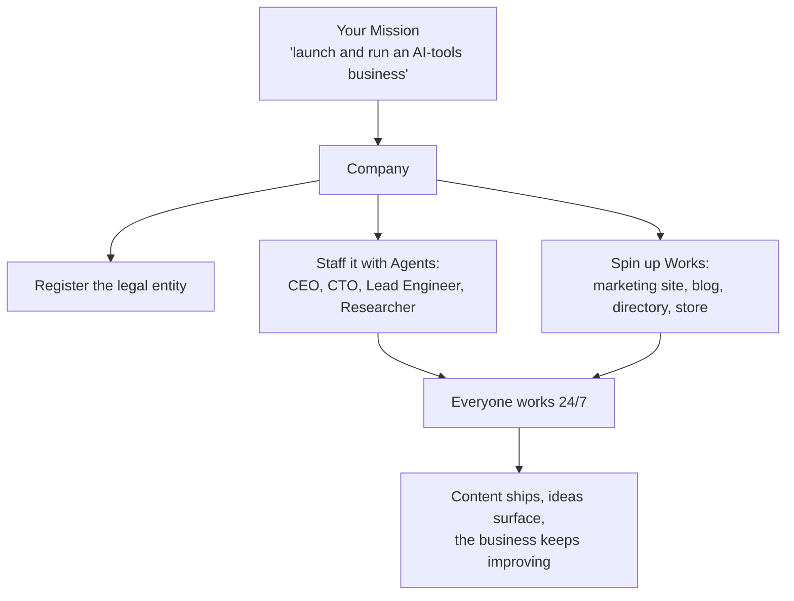

# Company Builder

> **Status: partly shipped.** The _workspace_ half of Company is live: you can **register a Company** from the create surface (v1, manual provider), **import a whole prebuilt company** from the catalog, and run several Companies side by side. Its foundations — [Missions](./missions.md), [Agents](./agents.md) with Tenant scope, [Organizations](./organizations.md), [Tenants & Organizations](../advanced/multi-tenancy.md) — are live too. What is **not** here yet: incorporation through formation providers (e.g. Stripe Atlas) and the wider "company-as-a-business" surface. [What works today](#what-works-today) draws the line exactly; the rest of this page describes the destination.

## What works today

| Capability                                                                                                                                                                                                   | Status       | Where to find it                                                |
| ------------------------------------------------------------------------------------------------------------------------------------------------------------------------------------------------------------ | ------------ | --------------------------------------------------------------- |
| **Register a Company** — the **Company** chip opens the **Register Company** dialog; submitting it lands a backing [Work](./creating-a-work.md) of kind `company` and creates the Organization linked to it. | Shipped (v1) | `/new` → **Company**                                            |
| **Manual registration** — the Organization is stored with `registrationProvider = "manual"` and `registrationStatus = "registered"`. The country code is recorded, not acted on.                             | Shipped (v1) | Register Company dialog                                         |
| **Import a prebuilt company** — materializes an Organization that already has its Teams, paused Agents, Skills, draft Works and Tasks.                                                                       | Shipped      | Workspace switcher → **+ Create Organization** → **Start from** |
| **Several Companies per account** — create as many as you want and switch between them; the active one scopes everything you see.                                                                            | Shipped      | Workspace switcher (sidebar top)                                |
| **Company-wide AI staff** — Tenant-scoped [Agents](./agents.md), [Teams](./teams.md) with rosters and nesting, and the Org Chart.                                                                            | Shipped      | Sidebar → **Teams**                                             |
| **Incorporation through a formation provider** — paperwork, jurisdiction picker, banking (e.g. Stripe Atlas).                                                                                                | Planned      | —                                                               |
| **The company-as-a-business surface** described in the rest of this page.                                                                                                                                    | Planned      | —                                                               |

### How to register a Company

1. Open **`/new`** — the **+ New** button sits under the workspace switcher in the dashboard sidebar.
2. Pick the **Company** chip and submit. The **Register Company** dialog opens instead of the usual chat hand-off, so the prompt box above it is ignored for this chip. (Landing on **`/new?type=company`** opens the dialog straight away.)
3. Fill in **Company name** (1–200 characters) and, optionally, **Country (ISO 3166-1)** — a two-letter code such as `US` or `DE`.
4. Click **Register**.
5. If this is your **first** Organization, the **"Move your existing items?"** dialog follows — choose **Move existing items** or **Start empty**. Otherwise you land directly on **`/org/<slug>/dashboard`**.

Over the API it is one call:

```bash
curl -X POST http://localhost:3100/api/organizations/register-company \
  -H "Authorization: Bearer <token>" \
  -H "Content-Type: application/json" \
  -d '{"name":"Acme Inc.","countryCode":"US"}'
```

The platform then creates the draft `company` Work, creates the Organization pointing at it (`linkedWorkId`), and transitions the Work to `registered` — the lifecycle hook a real formation provider will plug into later.

:::note What "v1, manual" means
Nothing is filed with a registrar. The dialog says so under the form — _"Manual registration for v1."_ No paperwork is submitted and no jurisdiction workflow runs; the Company Work is a lightweight registration record with no website or data repository of its own. What you get is a real, usable Organization with the registration metadata preserved, so an incorporation provider can be attached later without re-keying anything. The states `draft → pending → registered` already exist for that day; manual registrations land directly in `registered`.
:::

### How to start from a prebuilt company

1. Click the **workspace switcher** at the top of the dashboard sidebar, then **+ Create Organization**.
2. Under **Start from**, pick a company card — each shows its agent and team counts — or **Blank organization** for an empty one.
3. Adjust the **Name** if you want; it drives both the display name and the derived slug.
4. Click **Create from template**.

The packages come from the public [`ever-works/orgs`](https://github.com/ever-works/orgs) catalog (`GET /api/org-templates`, then `POST /api/organizations/import-company`, throttled to 5 requests per minute). Imported **Agents arrive paused with no heartbeat** and imported **Works arrive as drafts**, so you can read what a template staffed you with before any of it wakes up. An imported Organization is a _plain_ Organization — no registration provider, no linked Company Work: importing is not registering.

The full reference for both flows — fields, slug rules, invitations, the import report and its caps — lives in [Organizations, Invitations & Company Registration](./organizations.md); the end-to-end walkthrough is the [Teams and Organizations guide](../guides/teams-and-organizations.md).

## Where this is heading

The **Company Builder** is Ever Works' most ambitious shape: not a website, but the _organization that runs websites, stores, and everything else_ — staffed by AI [Agents](./agents.md) acting as real employees, working 24/7 toward your [Mission](./missions.md). If a Work is one site and a Mission is one goal, a **Company** is the whole operation: a CEO, a CTO, the Works they own, the budgets they spend against, and the schedule they run on.

## A Company is your workspace and org

In Ever Works, **Workspace = Company = Organization** — one top-level container for everything you build. The model:

- **Many companies per account.** Create several companies inside your tenant and **switch between them from the workspace switcher** — the top row of the dashboard sidebar, whose menu is labelled **Switch Organization**. Picking one persists it as the workspace you land in next time and crosses into `/org/<slug>/dashboard`. The selected company sets the context for everything you see.
- **Everything lives inside the selected company.** Your [Missions](./missions.md), [Ideas](./ideas.md), [Works](./creating-a-work.md), [Agents](./agents.md), and [Knowledge Base](./knowledge-base.md) are all scoped to the company you have picked. Switch companies and the whole workspace context switches with you.
- **Register it for real — as a Work.** Registration is itself a **kind of Work**: the Register Company flow lands a Work of kind `company` and links the Organization to it, so the registration record lives in the same model as everything else you build. Today that Work is completed **manually** (v1); routing it through formation **provider plugins**, so the legal entity is actually filed for you, is the planned next step.

(See [How it relates to Tenants & Organizations](#how-it-relates-to-tenants--organizations) below for the underlying multi-tenancy foundation.)

## From idea to operating company


```mermaid
flowchart TD
    Goal[Your Mission<br/>'launch and run an AI-tools business'] --> Co[Company]
    Co --> Reg[Register the legal entity]
    Co --> Org[Staff it with Agents:<br/>CEO, CTO, Lead Engineer, Researcher]
    Co --> Works[Spin up Works:<br/>marketing site, blog, directory, store]
    Org --> Run[Everyone works 24/7]
    Works --> Run
    Run --> Grow[Content ships, ideas surface,<br/>the business keeps improving]
```

## What the Company Builder is planned to do

- **Help you register the company** — guided incorporation through provider integrations (planned: Stripe Atlas and other formation/banking providers), so going from idea to a real legal entity is part of the flow, not a separate scramble.
- **Staff it with an AI organization** — Tenant-scoped [Agents](./agents.md) for company-wide roles (CEO, CTO, Lead Engineer, Researcher, …), drawn from ready-made [templates](./mission-templates.md), each with its own mailbox, budget, and heartbeat.
- **Spin up the Works the company needs** — a marketing site, a blog, a directory, a landing page, a [store](./store-builder.md) — each its own self-maintaining Work.
- **Give the company a shared brain** — the [Knowledge Base](./knowledge-base.md) holds the company's brand, strategy, research, and decisions; org-level `legal`/`style`/`seo` policy is inherited by every Work.
- **Run continuously** — the whole organization operates [autonomously](./autonomous-operation.md), under budgets and guardrails you set, with a full audit trail.

## How it relates to Tenants & Organizations

The Company Builder is the product-facing expression of the platform's [multi-tenancy](../advanced/multi-tenancy.md) foundation. An Organization is the container; a Company is what you _do_ with it — register it, staff it with Agents, give it Works, and let it run.

## You own the company's output

Every site, every document, every line of code the company's Agents produce lives in **your Git repositories** and deploys to **your infrastructure**. The AI organization works for you; the assets are yours.

## See also

- [Organizations, Invitations & Company Registration](./organizations.md) · [Teams](./teams.md)
- [Missions](./missions.md) · [Agents](./agents.md) · [Mission Templates](./mission-templates.md)
- [Store Builder](./store-builder.md) · [Knowledge Base](./knowledge-base.md)
- [Tenants & Organizations](../advanced/multi-tenancy.md) · [Autonomous Operation](./autonomous-operation.md)
- Guide: [Teams and Organizations](../guides/teams-and-organizations.md) · [The Founder Journey](../guides/founder-journey.md)
