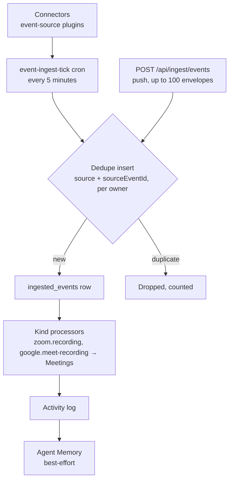

# Connectors (Chat, Trackers, Docs, CRM, Meetings & Social)

A **connector** is a plugin that plugs an outside system into Ever Works: it pulls that system's activity in as normalized events, and — for the ones that can write back — it lets an Agent post a message, a comment, a note or a record out.

Eleven connectors ship today, in the `connector` plugin category. This page is the catalog: what each one carries, what credentials it needs, and what it does **not** do. [Integrations](./integrations.md) covers the two receivers that are not connectors (the Slack app and GitHub pull-request review) and the shape of the event envelope itself.

:::info Two legs, two capabilities
A connector declares up to two independent things, and the difference matters when you read the tables below.

- The **`connector` capability** is the messaging leg — sending outbound, and (for Slack) accepting inbound control. Its `direction` is `outbound`, `inbound` or `bidirectional`.
- The **`event-source` capability** is the ingest leg — a `pullEvents` sweep that feeds the event spine on a cron.

Most connectors declare both. A connector can be `direction: 'outbound'` and still pull a rich event stream — Linear is exactly that.
:::

## The catalog

| Connector            | Plugin id                    | `connector` direction | `event-source` | `backfillDays` | Pulls in                                                                                                                                  | Pushes out                                                     |
| -------------------- | ---------------------------- | --------------------- | -------------- | -------------- | ----------------------------------------------------------------------------------------------------------------------------------------- | -------------------------------------------------------------- |
| **Slack**            | `slack-connector`            | bidirectional         | yes            | no             | Channel messages and bot mentions from the configured channels (`slack.message`, `slack.mention`)                                         | Channel messages and threaded replies, Block Kit supported     |
| **Discord**          | `discord-connector`          | outbound              | **no**         | **n/a**        | Nothing — this connector has no ingest leg                                                                                                | Channel messages with embeds, via the `discord.js` REST client |
| **Linear**           | `linear-connector`           | outbound              | yes            | yes            | Issues created/updated and comments (`linear.issue`, `linear.comment`)                                                                    | Comments on Linear issues                                      |
| **Notion**           | `notion-connector`           | outbound              | yes            | yes            | Pages created or edited, workspace-wide or per database (`notion.page`)                                                                   | Comments appended to Notion pages                              |
| **Jira**             | `jira-connector`             | outbound              | yes            | yes            | Issues created/updated and comments (`jira.issue`, `jira.comment`)                                                                        | Comments on Jira issues                                        |
| **HubSpot**          | `hubspot-connector`          | outbound              | yes            | yes            | Contacts, companies, deals and custom objects (`hubspot.contact`, `.company`, `.deal`, `.record`)                                         | Notes appended to CRM records, and new records                 |
| **Pipedrive**        | `pipedrive-connector`        | outbound              | yes            | yes            | Deals, persons and organizations (`pipedrive.deal`, `.person`, `.organization`)                                                           | Notes on deals/persons/organizations, and new records          |
| **Zoom**             | `zoom-connector`             | inbound               | yes            | yes            | Completed cloud recordings with transcripts when available (`zoom.recording`)                                                             | Nothing — ingest only                                          |
| **Google Workspace** | `google-workspace-connector` | inbound               | yes            | yes            | Drive file changes, Calendar events, Meet recording transcripts (`google.drive-change`, `google.calendar-event`, `google.meet-recording`) | Nothing — ingest only                                          |
| **Bluesky**          | `bluesky-connector`          | outbound              | yes            | yes            | Mentions and replies, plus the connected account's own posts (`bluesky.notification`, `bluesky.post`)                                     | Posts and threaded replies over AT Protocol                    |
| **Mastodon**         | `mastodon-connector`         | outbound              | yes            | yes            | Mention notifications and the account's own statuses (`mastodon.notification`, `mastodon.status`)                                         | Statuses and threaded replies on your own instance             |

:::caution Discord is outbound only
The Discord connector declares `direction: 'outbound'` with `inbound: false` and `reply: false`, and it does **not** declare the `event-source` capability. It posts into a channel; it does not read one, and nothing from Discord reaches your Activity feed. Inbound Interactions API routing is a documented follow-up — the `publicKey` setting is on the manifest for it, unused today.
:::

Every connector uses the provider's own official SDK: `@slack/web-api`, `discord.js`, `@linear/sdk`, `@notionhq/client`, `jira.js`, `@hubspot/api-client`, the `pipedrive` Node SDK, `@zoom/rivet`, the Google API Node.js clients, `@atproto/api` and `masto`.

:::caution What "pushes out" means today
The **Pushes out** column is the capability each plugin implements, and the ingest leg is what the platform drives on its own. The generic connector routing runtime — an inbound message routed to an Agent or Team, which then replies through the same connector — is wired for **Slack only** at present; the Slack app receiver below is that wiring. If what you want is routine outbound delivery (alerts, digests, run results into a channel), reach for a [notification channel](./notifications.md) instead: Slack, Discord, Telegram, WhatsApp and Novu ship as an outbound-only plugin family with their own Settings screen and a test-send button.
:::

## What each connector needs

Fill these in on the plugin's settings form. Bold fields are required by the plugin's manifest: without them the connector reports itself **not configured** and its sweep is skipped — quietly and deliberately, rather than erroring on every tick.

| Connector            | Required                                                                                                  | Optional / scoping                                                                                                                                                                     |
| -------------------- | --------------------------------------------------------------------------------------------------------- | -------------------------------------------------------------------------------------------------------------------------------------------------------------------------------------- |
| **Slack**            | **Bot User OAuth token** (`xoxb-…`)                                                                       | Signing secret (verifies inbound Events API deliveries), app id, default channel id, `eventChannelIds` — the channels to ingest from, comma-separated; defaults to the default channel |
| **Discord**          | **Bot token**                                                                                             | Application id, default guild id, default channel id, application public key (reserved for inbound)                                                                                    |
| **Linear**           | **API key** (`lin_api_…`)                                                                                 | `teamIds` to ingest from (all teams when empty), `backfillDays`, default issue id for outbound comments                                                                                |
| **Notion**           | **Integration token** (`ntn_…` / `secret_…`)                                                              | `databaseIds` (workspace-wide search when empty), `backfillDays`, default page id for outbound comments                                                                                |
| **Jira**             | **Site base URL**, **Atlassian account email**, **API token**                                             | `projectKeys` (all projects when empty), `backfillDays`, default issue key (e.g. `ENG-42`)                                                                                             |
| **HubSpot**          | **Private-app access token** (`pat-…`)                                                                    | `objectTypes` (defaults to `contacts,companies,deals`), portal id — enables deep links back to each record, `backfillDays`, default object type, default associated record id          |
| **Pipedrive**        | **API token**                                                                                             | `entityTypes` (defaults to `deals,persons,organizations`), company domain — enables deep links, `backfillDays`, default deal id                                                        |
| **Zoom**             | **Account id**, **client id**, **client secret** (Server-to-Server OAuth app)                             | `backfillDays`                                                                                                                                                                         |
| **Google Workspace** | **OAuth client id**, **client secret**, **refresh token** (scopes `drive.readonly` + `calendar.readonly`) | `surfaces` (`drive`, `calendar`, or both — the default), `driveFolderIds`, `calendarIds` (defaults to `primary`), `meetTranscripts` (on by default), `backfillDays`                    |
| **Bluesky**          | **Handle or DID**, **app password**                                                                       | PDS service URL (defaults to `https://bsky.social`), `backfillDays`                                                                                                                    |
| **Mastodon**         | **Instance URL**, **access token**                                                                        | Default visibility for outbound statuses (`public`), `backfillDays`                                                                                                                    |

:::caution Use an app password, not your account password
The Bluesky connector's `appPassword` field is for a Bluesky **app password**. The Mastodon connector talks only to the instance URL you configure, and that URL is SSRF-guarded — it will not follow a redirect to somewhere else on your network.
:::

## How to enable a connector

1. Open **Sidebar → Plugins** (`/plugins`), or go straight to **Settings → Plugins → Connectors** (`/settings/plugins/connector`). Filter with **Search plugins…** if the catalog is long.
2. Press **Enable** on the connector's card. A dialog opens carrying the **Also enable for all works** checkbox — leave it ticked so your Works actually run the plugin, then press **Enable** again to commit. See [Plugins](./plugins.md#account-level-vs-work-level) for why account-level _on_ does not cascade on its own.
3. Open the connector's settings form, paste the credentials from the table above, and press **Save Settings**.
4. Scope the sweep while you are there. `eventChannelIds`, `teamIds`, `databaseIds`, `projectKeys`, `objectTypes`, `entityTypes`, `driveFolderIds`, `calendarIds` and `surfaces` all narrow what gets pulled — an empty value usually means "everything", which is rarely what you want on a large workspace.
5. Wait for the next sweep. The `event-ingest-tick` cron runs **every 5 minutes**; there is no "sync now" button.
6. Check the results on a Work's **Activity** tab (`/works/:id/activity`) or on **Sidebar → Activity** (`/activity`).

:::note There is no Settings → Integrations page
`/settings/integrations` has **no index page** and soft-404s — the settings navigation deliberately omits a bare Integrations tab. Only its two children exist: **Channels** (`/settings/integrations/channels`) and **Emails** (`/settings/integrations/emails`), both for [Notifications](./notifications.md). Connectors live under **Plugins**. Note also that bare `/settings/plugins` redirects to `/settings/plugins/ai-provider`, so link to `/settings/plugins/connector` when you mean this catalog.
:::

## Routing events to a Work

A connector sees Slack channels and Jira projects; it has never heard of your Work ids. So it attaches a **work hint** — the container's id in the source system — and the platform resolves that hint against **your own Works only**.

| Hint kind      | What it carries                 | Connectors that emit it                                                                |
| -------------- | ------------------------------- | -------------------------------------------------------------------------------------- |
| `chat-channel` | Channel id (e.g. `C0123456789`) | Slack                                                                                  |
| `tracker-team` | Team key or project key         | Linear, Jira                                                                           |
| `doc-database` | Database or parent folder id    | Notion, Google Workspace (Drive)                                                       |
| `meeting`      | Meeting or conference id        | Zoom, Google Workspace (Calendar / Meet)                                               |
| `repo`         | `owner/repo`                    | Git receivers — resolved through the Work's declared repositories, not a hand-kept map |

To claim a container for a Work:

1. Open the Work and go to its **Settings** tab (`/works/:id/settings`).
2. Find the **Ingest routing claims** panel — _"Claim the external containers whose events belong to this Work."_
3. Type the source-system id into the matching group — **Chat channels**, **Tracker teams**, **Doc databases** or **Meetings** — and press **Add**. Repositories are deliberately absent: repository events already route through the repositories the Work declares.
4. Press **Save claims**. Ids are compared case-insensitively and trimmed; each is capped at 200 characters, with at most 50 ids per kind.

An unresolved hint is not an error. The event simply stays **user-scoped** — it still lands, it still reaches your Activity feed and Memory, it just is not filed under a Work. HubSpot, Pipedrive, Bluesky and Mastodon emit no hint at all today, so their events are always user-scoped.

## The event spine underneath

Every connector feeds one pipeline. Nothing about that pipeline is per-provider.

**Pull.** The cron resolves, for every loaded `event-source` plugin, the users who enabled it, resolves their settings, and calls `pullEvents` with a persisted per-(user, plugin) watermark and continuation cursor. A sweep that exhausts its page budget — **5 pages** per pair per tick — saves its cursor and resumes on the next tick with the same watermark. On completion the watermark advances to when the sweep _started_, never to "now", so events that landed mid-sweep are re-covered next time.

**Push.** `POST /api/ingest/events` takes a batch of envelopes for the authenticated caller. It is the same road: pushed and pulled events are indistinguishable downstream.

| Guarantee             | Detail                                                                                                                                                                      |
| --------------------- | --------------------------------------------------------------------------------------------------------------------------------------------------------------------------- |
| **Dedupe identity**   | `(source, sourceEventId)` per owner. Re-delivery is free — retries, overlapping windows and backfills all collapse.                                                         |
| **Batch cap**         | 100 envelopes per call.                                                                                                                                                     |
| **Payload cap**       | 32 KB serialized per envelope, enforced at the edge: an over-cap batch or an oversized payload fails the whole push call with `400`.                                        |
| **`rejected` count**  | Counts envelopes a connector's own **pull** sweep produced that the ingest floor turned away on shape or size — a bad envelope is counted, never allowed to fail the sweep. |
| **Response**          | `202` with `{ inserted, duplicates, rejected, filtered }`. `filtered` is always `0` unless an operator configured the salience filter.                                      |
| **Rate limit**        | 120 calls per minute on the push endpoint.                                                                                                                                  |
| **Ownership**         | Events land owner-scoped under the caller. Asking for a Work you do not own returns an empty page, never someone else's rows.                                               |
| **Failure isolation** | Each (plugin, user) pair pulls inside its own try/catch. One broken connector, or one user's revoked credentials, never stops the batch.                                    |

Reading events back is `GET /api/ingest/events`, filterable by `workId` and `source`, `limit` defaulting to 20 and capped at 100.

### Install bindings

Inbound receivers have to answer a question a pull never asks: _whose_ account does this delivery belong to? The `ingest_install_bindings` table is the answer — one row per external workspace or installation, naming the owning platform user and the plugin that serves it.

Resolution runs in a fixed order: an **exact binding** wins; otherwise a **single configured install** is used and the binding is recorded once the delivery passes signature verification, so the deployment self-migrates onto the first path; otherwise a **unique cryptographic signature match** counts as proof of ownership; otherwise the receiver **refuses**. A refusal is a clean no-op — a warning log, HTTP 200, nothing ingested and nothing dispatched. Never a guess, never a 500. GitHub adds one more path: a delivery verified against the platform GitHub App's webhook secret is attributed to whoever installed the App, so installing it needs no second setup step.

## Where the events show up

| Surface             | Route / call              | What you see                                                                                                                                                                                                                                                                                                                                                    |
| ------------------- | ------------------------- | --------------------------------------------------------------------------------------------------------------------------------------------------------------------------------------------------------------------------------------------------------------------------------------------------------------------------------------------------------------- |
| **Work → Activity** | `/works/:id/activity`     | The **External activity** panel below the platform feed — _"Events ingested from the connectors for this Work — repos, trackers, docs, chat and meetings."_ Source filter chips start at **All sources** and are derived from the events actually present, so a newly enabled connector appears without a code change; each row deep-links out via `sourceUrl`. |
| **Global Activity** | `/activity`               | Ingested events fan out to the Activity log. `github.push`, `github.commit` and `github.merge` get dedicated git action types; everything else lands as an external-event entry carrying its `sourceUrl`.                                                                                                                                                       |
| **Memory**          | `/memory`                 | A best-effort memory observation per event, tagged with its provenance. No memory provider enabled simply means no observation — it never fails the ingest.                                                                                                                                                                                                     |
| **Meetings**        | `/memory#meetings`        | `zoom.recording` and `google.meet-recording` envelopes are turned into [Meeting](./meetings.md) rows by a kind processor that runs _before_ the Activity write, so a failure retries instead of duplicating feed rows.                                                                                                                                          |
| **Agents and chat** | `list_recent_events` tool | Agents can list your recent ingested events, filtered by `source` or `workId` (default 20, capped at 50), and cite each one by its `sourceUrl`.                                                                                                                                                                                                                 |

## Historical backfill

By default a connector's first sweep starts from the epoch watermark and each connector interprets that as "start now" — you get new activity, not history. Nine of the eleven accept a **`backfillDays`** setting to widen that first pull instead.

| Setting       | Behaviour                                                                                                         |
| ------------- | ----------------------------------------------------------------------------------------------------------------- |
| `0` (default) | Backfill off.                                                                                                     |
| `1`–`90`      | The first pull reaches that many days back.                                                                       |
| Anything else | Clamped. Negatives, `NaN` and unparseable values all resolve to `0` — a garbage window can never widen the sweep. |

The ceiling is **90 days**, shared by every connector so the answer to "how far back can I go?" is the same everywhere. Slack has no `backfillDays` setting; Discord has no ingest leg at all.

:::note What is shipped, and what is not
Linear, Notion, Jira, Zoom and Google Workspace additionally implement the capability's optional `backfill()` method — a bounded, out-of-band historical sweep with no watermark side effects, budgeted at 20 pages per run and resumable by cursor. The service that drives it exists, but **no REST route or dashboard button calls it yet**: today the reachable lever is the `backfillDays` setting, applied on a connector's first pull. Set it before the first sweep, not after.
:::

## Slack and GitHub also have dedicated receivers

Two integrations do more than a connector can, and they are wired separately:

- **The Slack app** — `POST /api/ingest/slack/events` and `POST /api/ingest/slack/commands`. Mention `@works` in a channel or type `/works <question>` and the message is routed into the same platform chat the web app uses; the answer is posted back into the thread. This is the inbound leg of the Slack connector, and it is the only connector wired into that routing runtime today.
- **GitHub pull-request review** — `POST /api/ingest/github/events`, distinct from the platform GitHub App webhook at `/api/github-app/webhooks`.

Both verify every delivery by HMAC and **fail closed**: with no configured install, everything is rejected — including Slack's own `url_verification` handshake, which Slack signs like any other delivery. Full details in [Integrations](./integrations.md).

## Third-party trigger aggregators

Connectors are first-party and speak the event spine directly. When the system you need has no connector, two other routes exist — and they are genuinely different things, so pick deliberately.

### Composio triggers

The Composio integration is the one aggregator with its own trigger API. Subscriptions are created against Composio's own trigger catalog and stored keyed by the returned `tg_*` id.

| Endpoint                                    | Auth    | What it does                                                                                                                                                                                                                             |
| ------------------------------------------- | ------- | ---------------------------------------------------------------------------------------------------------------------------------------------------------------------------------------------------------------------------------------- |
| `GET /api/plugins/composio/triggers`        | Session | Your trigger subscriptions, with delivery counters and `lastFiredAt`.                                                                                                                                                                    |
| `POST /api/plugins/composio/triggers`       | Session | Enables the trigger upstream on Composio, then persists the subscription keyed by the real `tg_*` id.                                                                                                                                    |
| `DELETE /api/plugins/composio/triggers/:id` | Session | Removes the local row, then tears the trigger down upstream (best-effort).                                                                                                                                                               |
| `POST /api/plugins/composio/webhook`        | Public  | The receiver. Resolves the subscription by the `tg_*` id in the payload, then verifies the delivery through the Composio SDK using your project webhook secret and the `webhook-id` / `webhook-signature` / `webhook-timestamp` headers. |

The webhook secret is configured under **Settings → Plugins → Composio**. Verification **fails closed** when no secret is set: `401` for a bad signature, `404` for an unknown trigger id (returned without a body, so the endpoint does not disclose which triggers exist), `200` on accept so Composio does not retry.

:::caution Deliveries are recorded, not yet fanned out
An accepted delivery increments the subscription's `deliveriesReceived` and `lastFiredAt` counters — enough to show the trigger is alive. Handing the payload onward into the event spine is an explicit follow-up. Use a first-party connector when you need the event on your Activity feed today.
:::

### Pipeline plugins, not event sources

`make`, `zapier`, `activepieces` and `sim-ai` are **pipeline**-category plugins: they delegate steps of Work generation out to a Make scenario, a Zapier action, an Activepieces flow or a SIM AI workflow. They do not ingest events and they do not appear in the connector catalog. The `composio` plugin is a pipeline plugin too, separate from the trigger API above — it executes Composio tools across third-party apps during generation, brokering OAuth so each user connects their own accounts once.

See [Composio](../plugin-system/composio-plugin.md), [Make](../plugin-system/make-plugin.md), [Zapier](../plugin-system/zapier-plugin.md), [Activepieces](../plugin-system/activepieces-plugin.md) and [SIM AI](../plugin-system/sim-ai-plugin.md).

## Twenty CRM

Twenty CRM is wired differently from everything above: it is an **API-only, environment-configured integration**, not a plugin, and it has no dashboard screen.

| Aspect                     | Detail                                                                                                                                                                                                                                                |
| -------------------------- | ----------------------------------------------------------------------------------------------------------------------------------------------------------------------------------------------------------------------------------------------------- |
| **Configured by**          | Environment variables: `TWENTY_CRM_BASE_URL`, `TWENTY_CRM_API_KEY`, `TWENTY_CRM_WORKSPACE_ID`. Optional `TWENTY_CRM_TIMEOUT_MS`, `TWENTY_CRM_MAX_RETRIES`, `TWENTY_CRM_RETRY_DELAY_MS`, and `TWENTY_CRM_TENANTS` for per-tenant credential overrides. |
| **Enabled when**           | All three of base URL, API key and workspace id are set. Any missing one leaves the integration off.                                                                                                                                                  |
| **Routes**                 | `/api/twenty-crm/companies` — list, get, create, update, delete. Session-authenticated and behind a sync guard.                                                                                                                                       |
| **Not mounted**            | `/api/twenty-crm/people` exists in the source but is not registered; it returns `404`.                                                                                                                                                                |
| **No status route**        | There is no `config`, `status` or `health` endpoint — those paths `404`. The gate is the only signal.                                                                                                                                                 |
| **Unconfigured behaviour** | Fails **closed**: an authenticated request to the companies routes returns `403` rather than a partial result.                                                                                                                                        |
| **No UI**                  | Nothing in the dashboard references it. Drive it from the API.                                                                                                                                                                                        |

Reference details live in [Twenty CRM API](../api/twenty-crm.md) and [Integrations module](../api/integrations-module.md).

## Troubleshooting

| Symptom                                    | Where to look                                                                                                                                                                                        |
| ------------------------------------------ | ---------------------------------------------------------------------------------------------------------------------------------------------------------------------------------------------------- |
| Enabled the connector, nothing arrives     | The sweep runs every 5 minutes — give it one tick. Then confirm the plugin is enabled **and** its credentials saved; an enabled-but-unconfigured source is a deliberate quiet no-op, not an error.   |
| Events arrive but are not on the Work      | The work hint did not resolve. Claim the channel id / team key / database id / meeting id on the Work's **Settings** tab, and remember HubSpot, Pipedrive, Bluesky and Mastodon emit no hint at all. |
| Nothing from Discord ever appears          | Expected. Discord is outbound only.                                                                                                                                                                  |
| The same event appears twice               | It should not — dedupe is on `(source, sourceEventId)` per owner. Two _different accounts_ legitimately ingesting the same source event is a separate row for each, by design.                       |
| A Slack delivery is rejected with `401`    | The receiver fails closed. Either no install is configured, the signing secret does not match, or the delivery came from a workspace no account has connected.                                       |
| History is missing after enabling          | `backfillDays` only widens the **first** pull. Once the watermark has advanced, changing it does nothing.                                                                                            |
| Only some Drive files or calendars show up | Check `surfaces`, `driveFolderIds` and `calendarIds` — the connector ingests exactly what they scope it to.                                                                                          |

## Related

- [Integrations](./integrations.md) — the event envelope, the Slack app, GitHub pull-request review and Meetings sync
- [Notifications](./notifications.md) — outbound channels, which are a different, notification-only plugin family
- [Meetings](./meetings.md) — what Zoom and Google Meet recordings become
- [Activity](./activity.md) · [Memory](./memory.md) — where ingested events surface
- [Plugins](./plugins.md) — enabling, account vs. Work scope, settings and credentials
- [Built-in plugins](../plugin-system/built-in-plugins.md) · [Plugin categories](../plugin-system/plugin-categories.md)
- [Inbound triggers](./inbound-triggers.md) — the other way outside systems start work
