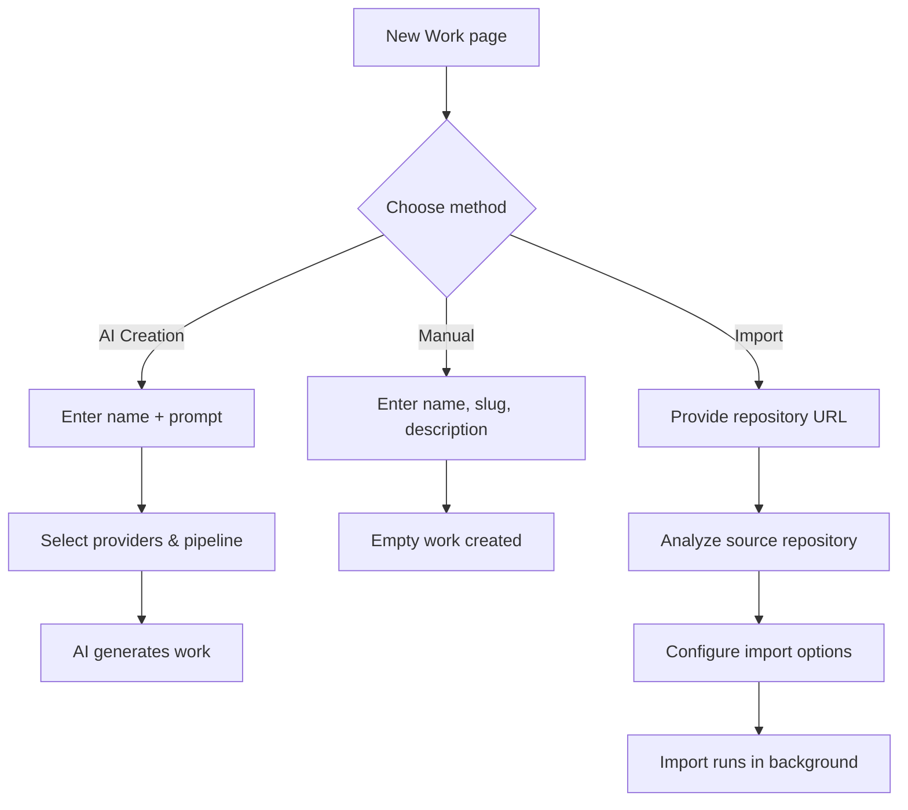

# Creating a Work

When you create a new work, the platform presents three creation methods. Each method leads to a fully functional work backed by git repositories, but they differ in how the initial content is produced and how much control you have over the process.

## Creation Methods

| Method          | Best For                                         | AI Required            | Produces Content                                 | Provider Selection                                         |
| --------------- | ------------------------------------------------ | ---------------------- | ------------------------------------------------ | ---------------------------------------------------------- |
| **AI Creation** | Starting from a topic or idea                    | Yes                    | Yes — AI researches, discovers, and writes items | Full (pipeline, AI, search, screenshot, content extractor) |
| **Manual**      | Setting up structure first, adding content later | No                     | No — creates an empty work scaffold              | None                                                       |
| **Import**      | Bootstrapping from an existing repository        | Depends on source type | Yes (for Awesome README) or copies existing data | Depends on source type                                     |

## AI Creation

AI creation is the most powerful method. You provide a topic and a prompt, and the platform's generation pipeline researches, discovers items, writes descriptions, assigns categories and tags, and optionally captures screenshots — all automatically.

### What You Provide

- **Work name** (required) — the title of your work (e.g., "Best React Component Libraries").
- **Prompt** (required) — instructions telling the AI what kind of work to build, what to include, and how to organize it. The prompt is the most important input — it guides the entire generation process.

The form offers example prompts to help you get started (e.g., "Create a comprehensive work of...").

### Provider Selection

Under **Advanced Settings**, you can control which plugins power the generation process. The platform uses five categories of providers, each handling a different part of the pipeline:

#### Pipeline Plugin

The pipeline plugin is the **orchestrator** — it decides how items are discovered, processed, and assembled. This is the most important provider choice because it determines the overall generation strategy.

| Pipeline              | Strategy                                                                                                                                                                                                                                                                  | Best For                                                                                                            |
| --------------------- | ------------------------------------------------------------------------------------------------------------------------------------------------------------------------------------------------------------------------------------------------------------------------- | ------------------------------------------------------------------------------------------------------------------- |
| **Standard Pipeline** | 15-step structured pipeline: analyzes the domain, generates initial items with AI, runs web searches, extracts content from discovered pages, deduplicates, assigns categories/tags, validates sources, and captures screenshots. The platform engine controls each step. | Comprehensive, high-quality works where you want broad coverage with verified sources.                              |
| **Agent Pipeline**    | Autonomous AI agent with tools (web search, content extraction, screenshot capture). The agent decides its own workflow: which URLs to visit, when to search for more, when to stop. Runs in a sandboxed workspace.                                                       | Exploratory topics where the AI benefits from autonomy — it can follow leads, pivot, and discover unexpected items. |
| **Claude Code**       | Delegates to Claude Code CLI running in an isolated workspace. Uses Claude's code-generation capabilities to research and build the work.                                                                                                                                 | Advanced use cases where you want Claude's full reasoning capabilities applied to work construction.                |
| **SIM AI**            | Delegates to an external SIM AI workflow. The platform sends a structured payload and receives items back.                                                                                                                                                                | Custom workflows where you've built a SIM AI pipeline tailored to your domain.                                      |

:::tip
If you don't select a pipeline, the platform uses the **default pipeline** configured by the admin. If no default is set, the system resolves one automatically. Admins can enforce a specific pipeline globally from **Settings**, which locks all users to that pipeline.
:::

#### AI Provider

The AI provider handles all text generation tasks: writing descriptions, extracting structured data, classifying items, and generating categories/tags. Available providers include OpenAI, Anthropic, Google Gemini, Groq, Mistral, Ollama, and aggregators like OpenRouter and Vercel AI Gateway.

Each provider uses a **three-tier model system** to optimize cost and quality:

- **Simple model** — for basic tasks like generating tags and short labels.
- **Medium model** — for standard tasks like writing item summaries.
- **Complex model** — for demanding tasks like full-page generation and multi-step analysis.

The model tiers are configured in the plugin settings. You don't need to select individual models — the pipeline automatically picks the right tier for each task.

#### Search Provider

The search provider powers the web discovery phase. When the pipeline needs to find items beyond what the AI can generate from its training data, it runs web searches through this provider. Options include Tavily (default), Brave, Exa, SerpAPI, and others.

Different search providers have different strengths — Exa excels at neural/semantic search, Brave offers a privacy-focused independent index, and SerpAPI supports multiple search engines (Google, Bing, Yahoo, DuckDuckGo).

#### Screenshot Provider

The screenshot provider captures website screenshots for items that have URLs. These screenshots appear as visual previews on item cards in the work. Options include ScreenshotOne and Urlbox.

#### Content Extractor

The content extractor fetches and parses the actual content from web pages discovered during search. It reads the page, strips navigation and ads, and returns clean text or markdown that the AI can analyze. The default is the built-in Local Content Extractor (no API key required). Specialized extractors exist for Notion pages, PDFs, and services like Jina and Firecrawl.

### Dynamic Plugin Fields

When you select a pipeline, the form may show additional configuration fields specific to that pipeline. These are defined by the pipeline plugin itself via the Form Schema Provider interface.

For example, the Agent Pipeline may show:

- **Target items** — how many items to aim for.
- **Max pages to process** — how many URLs the agent will visit.
- **Capture screenshots** — whether to take screenshots during generation.

These fields change dynamically when you switch pipelines.

### What Happens After Submission

1. The platform uses the selected AI provider to generate work details from your name and prompt: a URL-friendly slug, a description, and seed keywords.
2. A new work is created with the generated metadata.
3. Three git repositories are created: `{slug}-data` (structured item data), `{slug}` (rendered markdown), and `{slug}-website` (deployable static site).
4. The generation is dispatched as a background task. The selected pipeline plugin takes over and runs autonomously — discovering items, enriching content, and building the work.
5. You're redirected to the work detail page where you can watch progress in real time.

## Manual Creation

Manual creation is the simplest method. It creates an empty work scaffold — no AI, no generation, no items. You fill in the metadata yourself and add content later.

### What You Provide

- **Name** (required) — the work title.
- **Slug** (required) — the URL-friendly identifier, auto-generated from the name but editable. Must match the pattern `[a-z0-9]+(-[a-z0-9]+)*` (lowercase, hyphens only between words).
- **Description** (required) — a short description of the work (max 500 characters).
- **Repository owner** — your personal git account or an organization you belong to. Requires a connected git provider.

### What Happens After Submission

1. The work is created in the database with the provided metadata.
2. Git repositories are created under the selected owner.
3. You're redirected to the work detail page.
4. **No items are generated.** The work is empty — you can add items manually, trigger an AI generation from the detail page, or populate it via the API.

Manual creation is useful when you want full control over the work structure, when you plan to import items through the API, or when you're setting up a work that will be populated by community contributions.

## Import

Import bootstraps a work from an existing git repository. It supports three source types, each with a different workflow.

For a detailed explanation of the import system — including under-the-hood mechanics, the analysis phase, ecosystem detection, and background processing — see [Work Import](./work-import).

### Source Selection

The import form starts by asking for a repository URL (or letting you browse your repositories). The platform then **analyzes** the repository to detect what type of source it is:

- **Data Repository** — an existing Ever Works-format repo with `.works/works.yml` and `data/` work. Items, categories, and tags are copied directly.
- **Awesome README** — a curated list with categorized links (like GitHub Awesome Lists). The AI pipeline processes the source as research seeds and builds a much larger work.
- **Link Existing** — connects to an existing data repo without copying data, so the platform can manage it going forward.

### Provider Selection for Import

Provider selection during import depends on the source type:

- **Data Repository** — no providers needed. Data is copied verbatim.
- **Awesome README** — shows pipeline and provider selection, but **limited to pipelines that support import**: Agent Pipeline and Claude Code. The Standard Pipeline is not available for import because the import flow requires the pipeline to fetch and process the source URL autonomously.
- **Link Existing** — no providers needed. The operation is a metadata link, not a generation.

For Awesome README imports, you can also configure the **expansion factor** — how aggressively the AI should discover items beyond the source:

| Factor         | Source % of Final | Use Case                                                       |
| -------------- | ----------------- | -------------------------------------------------------------- |
| 1.5x           | ~67%              | Light enrichment — mostly the source items with some additions |
| 2x             | ~50%              | Balanced — equal parts source and discovered items             |
| 2.5x (default) | ~40%              | Recommended — significant discovery beyond the source          |
| 3x             | ~33%              | Aggressive — two-thirds of items are newly discovered          |
| 5x             | ~20%              | Maximum expansion — source is just the starting point          |

## Common Concepts

### Git Provider

All three creation methods require a **connected git provider** (GitHub, GitLab, or Bitbucket). The git provider stores the work's repositories. You select it in the sidebar before choosing a creation method, and can connect via OAuth if not already linked.

If no git provider is connected, the AI and Manual methods will show an error prompting you to connect one. The Import method requires it for accessing source repositories.

### Deploy Provider

Optionally, you can select a **deploy provider** (e.g., Vercel) in the sidebar. This determines where the work's website will be deployed after generation. If no deploy provider is selected, the website repository is still created but not deployed.

### Repository Owner

For AI and Manual creation, you choose where the git repositories are created:

- **Personal account** — repos are created under your git username.
- **Organization** — repos are created under a git organization you belong to.

For Import with Link Existing, the owner is automatically set to the source repository's owner.

### How Provider Defaults Work

The platform resolves providers through a cascade:

1. **Your selection** in the form (highest priority).
2. **Work-level defaults** — if you're regenerating an existing work, the providers from the last generation are pre-selected.
3. **Admin-enforced pipeline** — if the admin has enforced a specific pipeline in Settings, that pipeline is locked and you cannot change it.
4. **System defaults** — each provider category has a default plugin (e.g., Tavily is the default search provider, the Local Content Extractor is the default content extractor).

If you don't explicitly select providers, the platform uses the defaults. The form shows which providers are configured (green checkmark) and which are not (grayed out). You cannot select a provider that isn't configured — you need to set it up in the plugin settings first.

## Related

- [Work Import](./work-import) — Detailed import system documentation
- [Pipeline Plugins](/plugin-system/pipeline-plugins) — How pipeline plugins orchestrate generation
- [Scheduled Updates](./scheduled-updates) — Automatic periodic regeneration
- [Plugin System](/plugin-system/) — Overview of the plugin architecture
