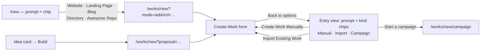
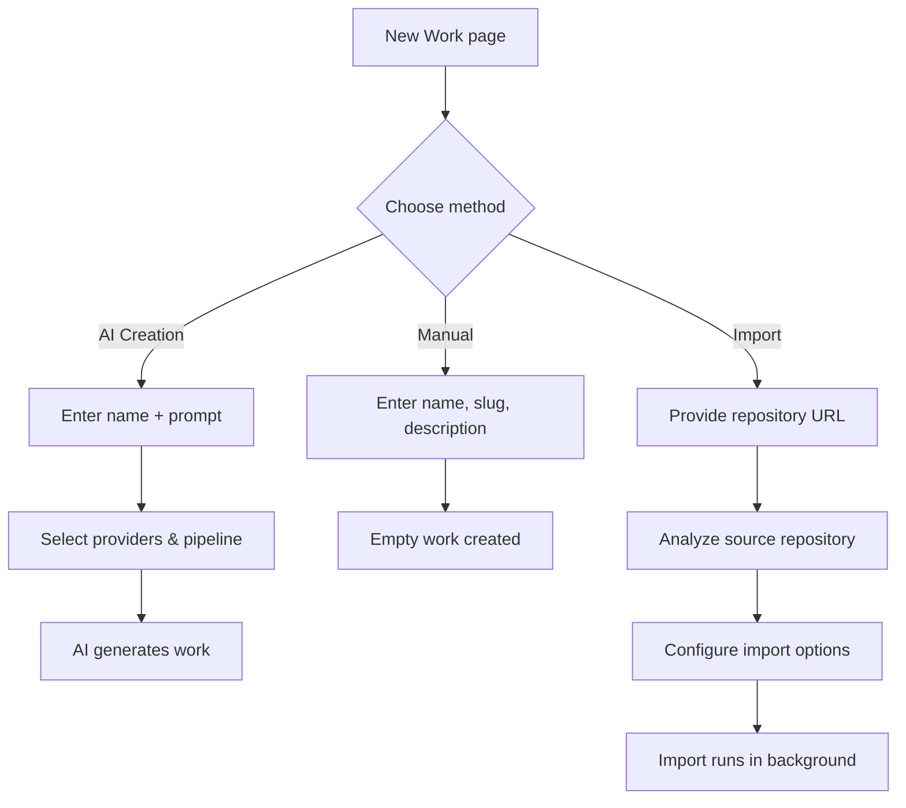

# Creating a Work

When you create a new work, the platform presents three creation methods. Each method leads to a fully functional work backed by git repositories, but they differ in how the initial content is produced and how much control you have over the process.

## Start from `/new`

`/works/new` is never a page you land on empty. Opening it with no query string redirects to [`/new`](./new-page.md) — the single prompt-and-chips creation surface behind the sidebar's **+ New** button. Picking a Work chip there brings you back here with the kind already chosen and your prompt already in the AI chat.

```mermaid
flowchart LR
    N["/new — prompt + chip"] -->|Website · Landing Page · Blog<br/>Directory · Awesome Repo| Q["/works/new?mode=ai&kind=…"]
    I["Idea card → Build"] --> P["/works/new?proposal=…"]
    Q --> F["Create-Work form"]
    P --> F
    F -->|Back to options| E["Entry view: prompt + kind chips<br/>Manual · Import · Campaign"]
    E -->|Create Work Manually| F
    E -->|Import Existing Work| F
    E -->|Start a campaign| C["/works/new/campaign"]
```

### How you get to the form

| URL                            | What opens                                                            |
| ------------------------------ | --------------------------------------------------------------------- |
| `/works/new`                   | Nothing — the route redirects to `/new`.                              |
| `/works/new?mode=ai`           | The unified create form (**New Work — with AI**).                     |
| `/works/new?mode=ai&kind=blog` | The same form with the **Blog** kind preselected.                     |
| `/works/new?mode=manual`       | The same form, reached through **Create Work Manually**.              |
| `/works/new?mode=import`       | The [import](#import) form.                                           |
| `/works/new?prompt=…`          | Implies `mode=ai`. The text is trimmed and capped at 4000 characters. |
| `/works/new?proposal=<id>`     | Builds from an [Idea](#from-an-idea).                                 |

An unrecognized `mode` is ignored — the page falls back to `ai` when a `prompt` is present, and otherwise redirects to `/new`. An unrecognized `kind` is dropped, and so is a kind that a feature flag has switched off for your environment.

### The entry view

Click **← Back to options** at the top of the form and the page swaps to its entry view — the same composer `/new` uses, but with Work-only chips so you stay focused on a Work:

- A **prompt box** whose placeholder cycles through example briefs for the selected kind. **Enter** submits, **Shift+Enter** inserts a newline, **Cmd/Ctrl+Enter** submits from anywhere in the text. A description shorter than 10 characters is rejected with _"Add a description (at least 10 characters) to start."_
- The **`+` attach menu** — upload files or a folder, or **Import GitHub repo** by public URL. You can also drag files onto the card or paste a screenshot. `/works/new` is the surface where pointing at an existing repository makes sense, so this menu is enabled here.
- The **work-kind chips**, and a one-line description of the selected kind underneath them.
- An **or** row with three buttons: **Create Work Manually**, **Import Existing Work**, and **Start a campaign**.

Submitting the prompt does not create anything on its own. The text is handed to the AI chat panel prefixed with the kind you picked ("website", "landing page", "blog", "directory", "awesome list repo") plus links to any attachments, the panel opens, and the canvas switches to the AI creation form. That form deliberately starts **empty**: the chat carries your brief, so you are never asked to confirm the same sentence twice.

### Pick a kind

The chip row offers the five user-selectable [work kinds](./work-kinds.md) — **Website**, **Landing Page**, **Blog**, **Directory**, **Awesome Repo** — followed by **Store** and **Company**, which render here as inert **Soon** chips (the live Company chip lives on `/new`, and `store` has no entry in the kind vocabulary yet).

- **Picking a chip writes that kind's first example prompt into the box**, so you start from real text you can edit rather than a placeholder hint. It only ever replaces its own seed: once you have edited the text — or arrived with a `?prompt=` handoff — switching chips never overwrites what is in the box.
- The line under the row explains the selected kind, for example _"A focused one-pager — waitlists, product launches, webinar signups, lead capture."_
- Every chip is gated by a `works-<kind>` PostHog flag evaluated server-side, and the gate **fails open** — no PostHog key, a missing flag, or an error all leave the chip enabled, so self-hosted installs get every kind. Only a flag that resolves strictly to `false` turns a chip into "Soon".
- A disabled kind can never be submitted: it is not selectable, it cannot be deep-linked through `?kind=`, and the form falls back to the first live kind.
- The chosen kind travels with the create call as the Work's `kind`, and kind is **create-only** — `PUT /api/works/:id` will not change it later.

See [Work Kinds & Capabilities](./work-kinds.md) for what each kind changes about the Work you get: which tabs appear, which metric tiles show, and which repositories are provisioned.

### Pick a blueprint

The create form carries a **Template** field — a searchable picker over every ready-made starting point that fits the kind you selected. Its helper text says it plainly: _"Choose the Work template that will be used when the Work repository is first created."_

| Control            | Behaviour                                                                                                                                                                                                                                                                          |
| ------------------ | ---------------------------------------------------------------------------------------------------------------------------------------------------------------------------------------------------------------------------------------------------------------------------------- |
| **Type chips**     | Website · Landing · Blog · Directory · Store · Company · Awesome. The chip matching your selected work kind comes first and is preselected; the others appear only when they have at least one pickable blueprint. Changing the work kind resets the chip.                         |
| **Search box**     | "Search templates…" filters the list by name, description, category and tags. A count under the list reports how many matched.                                                                                                                                                     |
| **Your templates** | Your own and built-in [website templates](./website-templates.md), always listed **first**.                                                                                                                                                                                        |
| **Blueprints**     | Manifest entries from the public [`ever-works/works`](./work-blueprints.md) catalog for the selected chip, with **Featured** ones pinned to the top. Placeholder entries (no repository yet) are excluded, and a template of yours wins over a blueprint with the same identifier. |
| **Badges**         | **Default** marks the entry that will be used if you pick nothing; **Featured** marks a curated blueprint.                                                                                                                                                                         |

Leaving the field alone keeps the "use my default template" behaviour: the highlighted default is the manifest's `default: true` blueprint, then your own default template, then the first option. The picker is hidden entirely when the selected chip resolves to no pickable template at all.

:::tip Three catalogs, one field
[Website Templates](./website-templates.md) are the site code cloned into the Work's website repository. [Work Blueprints](./work-blueprints.md) are ready-made Work definitions read from a public manifest. [Work Templates](./work-templates.md) are starter repositories you fork first from `/templates?kind=work` — a separate flow that does not appear in this picker.
:::

## Creation Methods

```mermaid
flowchart TD
    A[New Work page] --> B{Choose method}
    B -->|AI Creation| C[Enter name + prompt]
    B -->|Manual| D[Enter name, slug, description]
    B -->|Import| E[Provide repository URL]
    C --> F[Select providers & pipeline]
    F --> G[AI generates work]
    D --> H[Empty work created]
    E --> I[Analyze source repository]
    I --> J[Configure import options]
    J --> K[Import runs in background]
```

| Method          | Best For                                         | AI Required            | Produces Content                                 | Provider Selection                                         |
| --------------- | ------------------------------------------------ | ---------------------- | ------------------------------------------------ | ---------------------------------------------------------- |
| **AI Creation** | Starting from a topic or idea                    | Yes                    | Yes — AI researches, discovers, and writes items | Full (pipeline, AI, search, screenshot, content extractor) |
| **Manual**      | Setting up structure first, adding content later | No                     | No — creates an empty work scaffold              | None                                                       |
| **Import**      | Bootstrapping from an existing repository        | Depends on source type | Yes (for Awesome README) or copies existing data | Depends on source type                                     |

## AI Creation

AI creation is the most powerful method. You provide a topic and a prompt, and the platform's generation pipeline researches, discovers items, writes descriptions, assigns categories and tags, and optionally captures screenshots — all automatically.

### What You Provide

- **Work name** (required) — the title of your work (e.g., "Best React Component Libraries").
- **Prompt** (required) — instructions telling the AI what kind of work to build, what to include, and how to organize it. The prompt is the most important input — it guides the entire generation process.

The form offers example prompts to help you get started (e.g., "Create a comprehensive work of...").

### Provider Selection

Under **Advanced Settings**, you can control which plugins power the generation process. The platform uses five categories of providers, each handling a different part of the pipeline:

#### Pipeline Plugin

The pipeline plugin is the **orchestrator** — it decides how items are discovered, processed, and assembled. This is the most important provider choice because it determines the overall generation strategy.

| Pipeline              | Strategy                                                                                                                                                                                                                                                                  | Best For                                                                                                            |
| --------------------- | ------------------------------------------------------------------------------------------------------------------------------------------------------------------------------------------------------------------------------------------------------------------------- | ------------------------------------------------------------------------------------------------------------------- |
| **Standard Pipeline** | 15-step structured pipeline: analyzes the domain, generates initial items with AI, runs web searches, extracts content from discovered pages, deduplicates, assigns categories/tags, validates sources, and captures screenshots. The platform engine controls each step. | Comprehensive, high-quality works where you want broad coverage with verified sources.                              |
| **Agent Pipeline**    | Autonomous AI agent with tools (web search, content extraction, screenshot capture). The agent decides its own workflow: which URLs to visit, when to search for more, when to stop. Runs in a sandboxed workspace.                                                       | Exploratory topics where the AI benefits from autonomy — it can follow leads, pivot, and discover unexpected items. |
| **Claude Code**       | Delegates to Claude Code CLI running in an isolated workspace. Uses Claude's code-generation capabilities to research and build the work.                                                                                                                                 | Advanced use cases where you want Claude's full reasoning capabilities applied to work construction.                |
| **SIM AI**            | Delegates to an external SIM AI workflow. The platform sends a structured payload and receives items back.                                                                                                                                                                | Custom workflows where you've built a SIM AI pipeline tailored to your domain.                                      |

:::tip
If you don't select a pipeline, the platform uses the **default pipeline** configured by the admin. If no default is set, the system resolves one automatically. Admins can enforce a specific pipeline globally from **Settings**, which locks all users to that pipeline.
:::

#### AI Provider

The AI provider handles all text generation tasks: writing descriptions, extracting structured data, classifying items, and generating categories/tags. Available providers include OpenAI, Anthropic, Google Gemini, Groq, Mistral, Ollama, and aggregators like OpenRouter and Vercel AI Gateway.

Each provider uses a **three-tier model system** to optimize cost and quality:

- **Simple model** — for basic tasks like generating tags and short labels.
- **Medium model** — for standard tasks like writing item summaries.
- **Complex model** — for demanding tasks like full-page generation and multi-step analysis.

The model tiers are configured in the plugin settings. You don't need to select individual models — the pipeline automatically picks the right tier for each task.

#### Search Provider

The search provider powers the web discovery phase. When the pipeline needs to find items beyond what the AI can generate from its training data, it runs web searches through this provider. Options include Tavily (default), Brave, Exa, SerpAPI, and others.

Different search providers have different strengths — Exa excels at neural/semantic search, Brave offers a privacy-focused independent index, and SerpAPI supports multiple search engines (Google, Bing, Yahoo, DuckDuckGo).

#### Screenshot Provider

The screenshot provider captures website screenshots for items that have URLs. These screenshots appear as visual previews on item cards in the work. Options include ScreenshotOne and Urlbox.

#### Content Extractor

The content extractor fetches and parses the actual content from web pages discovered during search. It reads the page, strips navigation and ads, and returns clean text or markdown that the AI can analyze. The default is the built-in Local Content Extractor (no API key required). Specialized extractors exist for Notion pages, PDFs, and services like Jina and Firecrawl.

### Dynamic Plugin Fields

When you select a pipeline, the form may show additional configuration fields specific to that pipeline. These are defined by the pipeline plugin itself via the Form Schema Provider interface.

For example, the Agent Pipeline may show:

- **Target items** — how many items to aim for.
- **Max pages to process** — how many URLs the agent will visit.
- **Capture screenshots** — whether to take screenshots during generation.

These fields change dynamically when you switch pipelines.

### What Happens After Submission

1. The platform uses the selected AI provider to generate work details from your name and prompt: a URL-friendly slug, a description, and seed keywords.
2. A new work is created with the generated metadata.
3. Three git repositories are created: `{slug}-data` (structured item data), `{slug}` (rendered markdown), and `{slug}-website` (deployable static site).
4. The generation is dispatched as a background task. The selected pipeline plugin takes over and runs autonomously — discovering items, enriching content, and building the work.
5. You're redirected to the work detail page where you can watch progress in real time.

## Manual Creation

Manual creation is the simplest method. It creates an empty work scaffold — no AI, no generation, no items. You fill in the metadata yourself and add content later.

### What You Provide

- **Name** (required) — the work title.
- **Slug** (required) — the URL-friendly identifier, auto-generated from the name but editable. Must match the pattern `[a-z0-9]+(-[a-z0-9]+)*` (lowercase, hyphens only between words).
- **Description** (required) — a short description of the work (max 500 characters).
- **Repository owner** — your personal git account or an organization you belong to. Requires a connected git provider.

### What Happens After Submission

1. The work is created in the database with the provided metadata.
2. Git repositories are created under the selected owner.
3. You're redirected to the work detail page.
4. **No items are generated.** The work is empty — you can add items manually, trigger an AI generation from the detail page, or populate it via the API.

Manual creation is useful when you want full control over the work structure, when you plan to import items through the API, or when you're setting up a work that will be populated by community contributions.

## Import

Import bootstraps a work from an existing git repository. It supports three source types, each with a different workflow.

For a detailed explanation of the import system — including under-the-hood mechanics, the analysis phase, ecosystem detection, and background processing — see [Work Import](./work-import).

### Source Selection

The import form starts by asking for a repository URL (or letting you browse your repositories). The platform then **analyzes** the repository to detect what type of source it is:

- **Data Repository** — an existing Ever Works-format repo with `.works/works.yml` and `data/` work. Items, categories, and tags are copied directly.
- **Awesome README** — a curated list with categorized links (like GitHub Awesome Lists). The AI pipeline processes the source as research seeds and builds a much larger work.
- **Link Existing** — connects to an existing data repo without copying data, so the platform can manage it going forward.

### Provider Selection for Import

Provider selection during import depends on the source type:

- **Data Repository** — no providers needed. Data is copied verbatim.
- **Awesome README** — shows pipeline and provider selection, but **limited to pipelines that support import**: Agent Pipeline and Claude Code. The Standard Pipeline is not available for import because the import flow requires the pipeline to fetch and process the source URL autonomously.
- **Link Existing** — no providers needed. The operation is a metadata link, not a generation.

For Awesome README imports, you can also configure the **expansion factor** — how aggressively the AI should discover items beyond the source:

| Factor         | Source % of Final | Use Case                                                       |
| -------------- | ----------------- | -------------------------------------------------------------- |
| 1.5x           | ~67%              | Light enrichment — mostly the source items with some additions |
| 2x             | ~50%              | Balanced — equal parts source and discovered items             |
| 2.5x (default) | ~40%              | Recommended — significant discovery beyond the source          |
| 3x             | ~33%              | Aggressive — two-thirds of items are newly discovered          |
| 5x             | ~20%              | Maximum expansion — source is just the starting point          |

## From an Idea

Every [Idea](./ideas.md) card carries a **Build** button. It routes to `/works/new?proposal=<id>`, and the create form opens already filled in from the Idea:

| Form field             | Filled from                                                                                                                                        |
| ---------------------- | -------------------------------------------------------------------------------------------------------------------------------------------------- |
| **Work Name**          | The Idea's title.                                                                                                                                  |
| **Work Slug**          | The Idea's slug suggestion, falling back to the slugified title. Still editable, and still live-checked for availability as you type.              |
| **Describe Your Work** | The Idea's AI-refined generated prompt, falling back to its description — so an Idea you wrote by hand still lands your own words in the textarea. |

Four rules make the handoff safe:

1. A `?proposal=` always opens in **AI mode**, whatever `mode` says.
2. If the Idea was already accepted **and** its Work exists, you are redirected straight to that Work instead of starting a duplicate.
3. Any other status — pending, queued, building, failed, dismissed, or accepted without a Work — still prefills the form, because the dashboard surfaces Ideas of every status and **Build** routes here from all of them.
4. If the Idea cannot be fetched (deleted, not yours, or a transient blip), the form opens blank rather than erroring the whole route.

When you submit, the Idea's id travels with the create call, so the resulting Work is recorded as built from that Idea.

## Start a campaign

The third button on the entry row, **Start a campaign**, is not a work kind — campaigns are not websites, so they get their own activation surface at `/works/new/campaign`. It is a single brief:

| Field                     | Required | Example                                                                                          |
| ------------------------- | -------- | ------------------------------------------------------------------------------------------------ |
| **Campaign name**         | Yes      | `Q3 developer launch`                                                                            |
| **Objective**             | Yes      | `Book 25 qualified demos with platform engineering teams`                                        |
| **Target** (value + unit) | No       | `25` / `demos`                                                                                   |
| **Channels**              | No       | `email, linkedin, newsletter` — comma-separated, recorded as labels on the seeded pipeline tasks |

Pressing **Start campaign** provisions the whole go-to-market setup in one call — all of it, or none of it:

- a **Work of kind `campaign`**,
- a **Goal** capturing the objective,
- the prebuilt **go-to-market Agents**,
- **Tasks** for the first pipeline stages,
- the **go-to-market pipeline** pinned as that Work's pipeline preference.

:::info Early access
The go-to-market pipeline plugin does **not** auto-enable — turn it on before starting a campaign, or runs fall back to auto-detecting a pipeline. A campaign Work also has no website repository, no deploy provider and no Deploy tab. See [Campaigns](./campaigns.md) for the full stage list and the review gate.
:::

## Common Concepts

### Git Provider

All three creation methods require a **connected git provider** (GitHub, GitLab, or Bitbucket). The git provider stores the work's repositories. You select it in the sidebar before choosing a creation method, and can connect via OAuth if not already linked.

If no git provider is connected, the AI and Manual methods will show an error prompting you to connect one. The Import method requires it for accessing source repositories.

### Deploy Provider

Optionally, you can select a **deploy provider** (e.g., Vercel) in the sidebar. This determines where the work's website will be deployed after generation. If no deploy provider is selected, the website repository is still created but not deployed.

### Deploy Provider Selector — What Is in the List

The sidebar selector lists the **loaded deployment plugins**, not every deploy target the platform knows about. Today that means two rows:

| Row            | Provider id | You supply                                               | Notes                                                                                                           |
| -------------- | ----------- | -------------------------------------------------------- | --------------------------------------------------------------------------------------------------------------- |
| **Vercel**     | `vercel`    | A Vercel API token.                                      | Becomes the default as soon as its token is connected.                                                          |
| **Kubernetes** | `k8s`       | A kubeconfig, or the platform's shared customer cluster. | Needs no external account, so it is the zero-config fallback. See [Kubernetes Deployment](./k8s-deployment.md). |

Each row shows **Ready to deploy** or **Not configured**. Selecting a row that is enabled but not configured reveals a **Configure** link straight to that plugin's settings page at `/plugins/<id>`.

The preselected provider is resolved server-side in this order:

1. the first provider that is both **enabled and configured**;
2. otherwise **Kubernetes**, if it is enabled — it is deterministic and needs no account;
3. otherwise the first enabled provider;
4. otherwise none, and the whole block is hidden. The website repository is still created; nothing is deployed until you pick a target on the Work's Deploy tab.

:::note The managed "Ever Works" target is not in this list
`ever-works` — the fully managed `*.ever.works` hosting path — is a platform provider rather than a registered deploy plugin, so it never appears in this selector. You choose it once in the [onboarding wizard](./onboarding.md) at **Step 5 — Your deployment**, and it is applied when a Work is created. See [Managed Hosting](./managed-hosting.md).
:::

### Git Provider Picker — Connection States

The **Git Provider** block above the deploy selector lists each available provider with its live connection state, and offers **Connect** for any that is not linked. Connecting starts the OAuth flow and returns you to `/works/new` when it completes.

Two behaviours are worth knowing:

- **Managed Git storage replaces the picker.** If your account keeps Work repositories in the managed Ever Works GitHub organization, the block shows where repositories go instead of a provider list — the platform creates the repository in its own org, so there is nothing for you to connect.
- **A missing connection never costs you the form.** If the create call comes back needing a Git provider, the page stays exactly where it is with your name, slug, prompt, template and provider selections intact — the **Connect** control is right there in the sidebar.

### Repository Owner

For AI and Manual creation, you choose where the git repositories are created:

- **Personal account** — repos are created under your git username.
- **Organization** — repos are created under a git organization you belong to.

For Import with Link Existing, the owner is automatically set to the source repository's owner.

### How Provider Defaults Work

The platform resolves providers through a cascade:

1. **Your selection** in the form (highest priority).
2. **Work-level defaults** — if you're regenerating an existing work, the providers from the last generation are pre-selected.
3. **Admin-enforced pipeline** — if the admin has enforced a specific pipeline in Settings, that pipeline is locked and you cannot change it.
4. **System defaults** — each provider category has a default plugin (e.g., Tavily is the default search provider, the Local Content Extractor is the default content extractor).

If you don't explicitly select providers, the platform uses the defaults. The form shows which providers are configured (green checkmark) and which are not (grayed out). You cannot select a provider that isn't configured — you need to set it up in the plugin settings first.

## Related

- [Work Import](./work-import) — Detailed import system documentation
- [Pipeline Plugins](/plugin-system/pipeline-plugins) — How pipeline plugins orchestrate generation
- [Scheduled Updates](./scheduled-updates) — Automatic periodic regeneration
- [Plugin System](/plugin-system/) — Overview of the plugin architecture
- [The + New page](./new-page.md) — The prompt-and-chips surface every create button funnels into
- [Work Kinds & Capabilities](./work-kinds.md) — What each kind changes about the Work you get
- [Work Blueprints](./work-blueprints.md) — The `ever-works/works` catalog behind the Blueprints group
- [Website Templates](./website-templates.md) — The site code cloned into the website repository
- [Ideas](./ideas.md) — Where the `?proposal=` handoff comes from
- [Campaigns](./campaigns.md) — What "Start a campaign" provisions
- [Managed Hosting](./managed-hosting.md) — The managed `*.ever.works` deploy target
- [Kubernetes Deployment](./k8s-deployment.md) — Deploying a Work to a cluster
