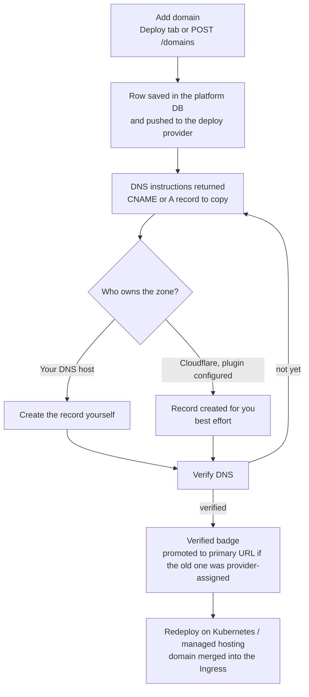

# Custom Domains

Custom Domains let you assign your own domain name to a work's deployed website. Instead of accessing your work at a provider-assigned URL (e.g., `my-work.vercel.app`), visitors can reach it at `work.yourdomain.com`.

:::tip When to use this
Use custom domains when you want a branded URL for your work — for example, `tools.mycompany.com` instead of a `.vercel.app` subdomain.
:::

## The addresses a Work can have

A deployed Work can answer on more than one hostname, and the addresses are **additive** — attaching your own domain never takes the previous one away.

| Address                                       | Where it comes from                                                                                                                                    | Managed from                                                            |
| --------------------------------------------- | ------------------------------------------------------------------------------------------------------------------------------------------------------ | ----------------------------------------------------------------------- |
| **Managed subdomain** `<label>.ever.works`    | Allocated by the platform for Works on the **Ever Works** provider, and for **Kubernetes** Works when the operator enabled the managed-subdomain mode. | The **Site URL / Subdomain** card on **Work → Deploy**.                 |
| **Provider-assigned host** e.g. `.vercel.app` | Created by the deploy provider itself on the first successful deploy.                                                                                  | The provider. Shown in the domain list with an **Auto-assigned** badge. |
| **Custom domain** `work.yourdomain.com`       | A domain you own and attach yourself.                                                                                                                  | The **Custom Domains** card on **Work → Deploy**, or the domains API.   |

On Kubernetes and on managed hosting the managed subdomain stays the Work's **primary** host and every attached custom domain is merged in as an **additional** ingress host on the next deploy.

What this does **not** do: Ever Works manages records in DNS zones that already exist — it does not register or transfer domains, it does not route several Works under paths of one hostname, it does not merge their sitemaps, and it does not create `www` redirects for you.

## Prerequisites

- Work must be deployed to a provider that supports custom domains (e.g., Vercel)
- You must own or control the domain's DNS settings
- A deployment provider plugin must be enabled and configured

All three deploy targets handle custom domains today: **Vercel** (`vercel`), **Kubernetes** (`k8s`), and **Ever Works** managed hosting (`ever-works` — its domain operations run through the Kubernetes plugin). The **Custom Domains** card only renders once the Work has a website URL, and the API refuses domain calls on a Work that has never deployed with _"No deployment exists for this work. Deploy first before managing domains."_ Deploy once, then attach the domain.

## How It Works

1. **Add domain** — register your domain via the API or dashboard. The domain is saved to the database.
2. **Sync to provider** — the platform pushes the domain to your deployment provider (e.g., Vercel).
3. **Configure DNS** — point your domain to the provider using the DNS records returned by the verification step.
4. **Verify** — trigger DNS verification to confirm your domain is correctly configured.
5. **Auto-promote** — once verified, if the work's current URL is a provider-assigned subdomain (e.g., `.vercel.app`), it is automatically updated to the custom domain.

The promotion in step 5 is deliberately conservative: a URL you set yourself is never overwritten. Only an unset URL or a provider-assigned one is replaced. `*.vercel.app` always counts as provider-assigned, and on the add-domain path so does the managed root domain (`ever.works`, or whatever `EVER_WORKS_DOMAIN` names on your installation).



### DNS Configuration

After adding a domain, configure your DNS based on the domain type:

| Domain Type                          | DNS Record                         | Example                           |
| ------------------------------------ | ---------------------------------- | --------------------------------- |
| Subdomain (e.g., `blog.example.com`) | `CNAME` pointing to provider       | `CNAME blog cname.vercel-dns.com` |
| Apex domain (e.g., `example.com`)    | `A` record pointing to provider IP | `A @ 76.76.21.21`                 |

The exact values depend on your deployment provider. Check the verification response for provider-specific DNS instructions.

Where that target value comes from, per provider:

| Provider                        | Subdomain target                                   | Apex target                            | Notes                                                                                                                           |
| ------------------------------- | -------------------------------------------------- | -------------------------------------- | ------------------------------------------------------------------------------------------------------------------------------- |
| **Vercel**                      | The `CNAME` value Vercel returns for the project.  | The `A` record Vercel returns.         | The values travel back in the domain's `verification` array — read them from the panel rather than typing them from memory.     |
| **Kubernetes** / **Ever Works** | `CNAME` to the cluster ingress load-balancer host. | `A` to the ingress load balancer's IP. | Before the load balancer has an address, the guidance shows the placeholder `cluster ingress load balancer` instead of a value. |

The apex heuristic is "exactly two labels", so `example.com` is offered an `A` record and `blog.example.com` a `CNAME`. Multi-level public suffixes such as `example.co.uk` are treated as subdomains — if the suggested record type is wrong for your zone, create the type your registrar requires instead.

### Provider Switching

Domain records are stored in the Ever Works database as the primary source of truth. If you switch deployment providers, your domain records persist and can be re-synced to the new provider.

On Kubernetes and managed hosting that re-sync happens on the next deploy: every stored domain row is handed to the deploy as an additional ingress host (lowercased and de-duplicated against the primary host), so the new Ingress serves the same set of names.

## Managed `*.ever.works` subdomains

Works on the **Ever Works** provider — and Kubernetes Works on installations where the operator turned the managed-subdomain mode on — get a platform address of their own before you attach anything. It is the Work's default, primary URL; custom domains sit on top of it.

### The Site URL / Subdomain card

On **Work → Deploy** (`/works/:id/deploy`) a card titled **Site URL / Subdomain** renders **directly above Custom Domains**, and only for Works whose deploy provider is `ever-works` or `k8s`.

| What you see                                                              | What it means                                                                                        |
| ------------------------------------------------------------------------- | ---------------------------------------------------------------------------------------------------- |
| The address with a green **Live** badge                                   | The label is claimed and a DNS record for it exists in the managed zone. The address is a live link. |
| The address with a **DNS propagating** badge                              | The claim is persisted but no record was found yet, so the name is plain text rather than a link.    |
| _No managed subdomain yet — it will be allocated on the next deploy._     | Nothing is claimed for this Work. Deploy to get one.                                                 |
| **Change subdomain** input with a fixed `.ever.works` suffix and **Save** | The claim is editable for this Work.                                                                 |
| _Managed subdomain is read-only for this Work._                           | The Work's provider (or this environment's flag) does not allow re-allocation.                       |

Editing is always allowed on the `ever-works` provider, and on `k8s` only when the operator has `K8S_MANAGED_SUBDOMAIN` on — the same gate the deploy path uses.

### Renaming rules

A rename removes the old DNS record, persists the new claim, then creates the new record; if that record cannot be created the claim is rolled back, so you are never left with a half-applied rename. The label must be 1–63 lowercase letters, digits and hyphens with no leading or trailing hyphen (the form's own hint asks for 3–63), reserved platform labels such as `www`, `api`, `app`, `admin` and `docs` are refused with `400`, and a label already held by another Work returns `409`.

The full managed-hosting story — allocation, HTTPS, the `GET` / `PUT /api/deploy/works/:id/subdomain` endpoints and the operator environment variables — is in [Managed Hosting](./managed-hosting.md).

## The Custom Domains card

The **Custom Domains** card on **Work → Deploy** (`/works/:id/deploy`) is where the whole lifecycle happens. It appears once the Work has a website URL.

### Add

Type the hostname into the field (placeholder `example.com`) and press **Add**, or just hit Enter. Two outcomes:

- **Added, not yet verified** — the toast reads _"Domain added. Configure DNS to verify it."_ and the new row expands automatically to show its DNS instructions.
- **Added and verified immediately** — _"Domain added and verified!"_. This happens when the domain was already attached and verified at the provider; the platform imports it instead of creating a duplicate.

Domains already attached at the provider are also imported into the list while the Work has no custom domain of its own, so a domain you wired up outside Ever Works shows up rather than silently disappearing.

### Read the DNS instructions

Every unverified row carries a chevron button, **Show DNS instructions**. Expanding it reveals **Configure these DNS records:** and, for each record the provider asked for, its type badge (`CNAME`, `A`, `TXT`), a human-readable reason, and two copyable fields:

| Field      | What to paste it into                        |
| ---------- | -------------------------------------------- |
| **Name:**  | The record's host/name at your DNS provider. |
| **Value:** | The record's target value.                   |

Each has a **Copy** button, and copying confirms with _"Copied to clipboard"_.

### Verify

The circular-arrow button, **Verify DNS**, re-checks the record.

- Verified → the row flips to a green **Verified** badge and the toast says _"Domain verified successfully!"_
- Not yet → _"DNS not verified yet. Please check your DNS settings and try again later."_ The row keeps its amber **Pending** badge and its instructions.

Verification is a live DNS check every time, so re-run it after each DNS change rather than waiting for the page to catch up on its own.

### Remove

The trash button, **Remove domain**, removes the domain from the deployment provider first and then from the platform database. If the provider call fails, the local row is still removed and the failure is logged — a provider outage cannot leave you with a row you are unable to delete. When the removed domain was the Work's primary URL, the platform re-reads the provider's own URL and restores that.

### The `.vercel.app` row

A `*.vercel.app` hostname is created and re-created by Vercel itself, so while the Work still deploys to Vercel that row is shown with an **Auto-assigned** badge and **no Verify or Remove buttons** — removing it would only make Vercel recreate it. Once the Work's provider has been switched away from Vercel, the row is just a stale record pointing at a project the new provider knows nothing about, and the **Remove domain** button comes back so you can clean it up.

Auto-assigned hosts — both `*.vercel.app` and the managed `*.ever.works` address — always sort to the bottom of the list, so your own domains stay at the top.

## Kubernetes ingress domains

On the `k8s` provider — and therefore on Ever Works managed hosting, which drives the same plugin — a custom domain is a rule on the Work's `Ingress`:

- **Adding** patches the Ingress in place: a `host:` rule for the domain routing `/` (prefix) to the Work's Service on port 80 is appended, and the TLS block is rebuilt for every host on the Ingress using the configured cert-manager issuer, so the new name gets a certificate.
- **The hostname is validated before it is written.** Only a strict RFC-1123 hostname is accepted; a wildcard `*` or an otherwise illegal host is rejected with _"Invalid domain: provide a valid hostname."_ so nothing can inject a catch-all rule into the Ingress.
- **Listing** reads the Ingress host rules back. Listing never performs live DNS, so hosts you have not verified yourself are reported as pending, with DNS guidance built from the Ingress load balancer's hostname or IP.
- **Verifying** resolves the cluster's ingress load-balancer address and requires the domain to point **there** — a `CNAME` whose target matches the load balancer, or `A` records that overlap the load balancer's IPs. A domain that merely resolves somewhere is not verified. If the load balancer has no address yet, verification returns "not verified" plus guidance instead of claiming success.
- **Removing** drops the host rule and re-applies the Ingress.
- **On the next deploy**, every stored domain travels to the deploy workflow as an extra ingress host alongside the primary one, so the live Ingress serves them all.

Cluster prerequisites — an ingress controller, and cert-manager with a `ClusterIssuer` if you want automatic TLS for custom domains — are covered in [Kubernetes Deployment](./k8s-deployment.md).

## The Cloudflare DNS plugin

DNS itself is a plugin: `cloudflare-dns` (category `dns`, built in, not auto-enabled). It exposes four capabilities the platform uses.

| Capability          | What it does                                                                             |
| ------------------- | ---------------------------------------------------------------------------------------- |
| `dns-ensure-record` | Idempotent create-or-update — an existing record pointing elsewhere is patched in place. |
| `dns-remove-record` | Idempotent delete; without a record type it probes both `CNAME` and `A`.                 |
| `dns-record-exists` | The uniqueness and health probe behind the **Live** badge on managed subdomains.         |
| `dns-root-domain`   | Reports the zone's root domain, e.g. `ever.works`.                                       |

It runs in two modes, side by side.

**Managed zone (`*.ever.works`).** Platform operators wire `CLOUDFLARE_API_TOKEN`, `CLOUDFLARE_ZONE_ID`, `EVER_WORKS_DOMAIN` and `EVER_WORKS_DEPLOY_LB_HOSTNAME` as environment variables. Nothing is configurable per user and tenants cannot repoint the platform zone. This is what creates and removes the CNAMEs behind managed subdomains.

**Bring your own zone.** You supply your own Cloudflare API token and zone id for a domain you own; they are stored as encrypted, user-scoped plugin settings.

| Setting                  | Purpose                                                        | Notes                                                                                                          |
| ------------------------ | -------------------------------------------------------------- | -------------------------------------------------------------------------------------------------------------- |
| **Cloudflare API token** | Scoped token with `DNS:Edit` on the target zone.               | Secret, stored encrypted. Create one in your Cloudflare profile's API tokens page.                             |
| **Cloudflare zone id**   | The zone that owns the root domain.                            | Required alongside the token.                                                                                  |
| **Root domain**          | The zone this provider manages.                                | Defaults to `ever.works` for the managed mode.                                                                 |
| **Ingress LB hostname**  | The CNAME target public Work hostnames resolve to.             | Admin-only in the managed mode.                                                                                |
| **Cloudflare proxy**     | Whether new records go behind Cloudflare's orange-cloud proxy. | Leave it off for a custom domain whose TLS the cluster serves — the custom-domain write defaults to unproxied. |

### What bring-your-own mode changes for a custom domain

Once your own token and zone are configured, **adding a custom domain also creates its `CNAME` in your zone**, pointing at the platform's ingress load-balancer hostname, so you do not have to create the record by hand. Three things to know:

- It is **best effort**. A failure is logged and never fails the add — the domain is still stored, and you can create the record yourself.
- Only **one zone** is used per domain: the first DNS plugin that has your settings wins, and the platform never fans a single domain out across several zones.
- Without user-scoped settings the plugin stays operator-managed only, and custom-domain DNS remains guidance-only — you create the records at your own DNS host.

## How to

### Attach a domain from the dashboard

1. Deploy the Work at least once from **Work → Deploy** (`/works/:id/deploy`) — the **Custom Domains** card only appears afterwards.
2. In **Custom Domains**, type the hostname (for example `tools.example.com`) and click **Add**.
3. The row expands to **Configure these DNS records:**. Use the **Copy** buttons next to **Name:** and **Value:** to grab the record.
4. Create that record at your DNS host. If the zone is on Cloudflare and you configured the Cloudflare DNS plugin with your own token and zone id, the record is created for you.
5. Back on the card, click **Verify DNS**. A green **Verified** badge means you are done; _"DNS not verified yet…"_ means the record has not propagated or points elsewhere — fix it and click again.
6. On Kubernetes or managed hosting, click **Deploy** once more so the domain is merged into the Work's Ingress and picks up its certificate.

### Remove a domain

1. On **Work → Deploy** → **Custom Domains**, click the trash button (**Remove domain**) on the row.
2. The domain is removed from the provider and from the platform, and the toast confirms _"Domain removed"_.
3. If that domain was the Work's primary URL, the Work falls back to the provider's own URL automatically.

### Change the managed subdomain instead

If what you want is a different `*.ever.works` label rather than your own domain, use the **Site URL / Subdomain** card above **Custom Domains** — the rules and the API for it are in [Managed Hosting](./managed-hosting.md).

## API

`GET` requires view permission on the work; add, remove and verify require edit permission. All endpoints accept JWT or API key authentication, and all of them refuse a work that has never been deployed.

### List Domains

| Method | Endpoint                        | Description                        |
| ------ | ------------------------------- | ---------------------------------- |
| `GET`  | `/api/deploy/works/:id/domains` | List all custom domains for a work |

```bash
curl http://localhost:3100/api/deploy/works/<work-id>/domains \
  -H "Authorization: Bearer <token>"
```

**Response:**

```json
{
	"status": "success",
	"domains": [
		{
			"name": "tools.example.com",
			"verified": true
		},
		{
			"name": "blog.example.com",
			"verified": false,
			"verification": [
				{
					"type": "CNAME",
					"domain": "blog.example.com",
					"value": "lb.example-cluster.example.net",
					"reason": "Point your subdomain to the cluster ingress load balancer."
				}
			]
		}
	]
}
```

Auto-assigned hosts are returned last, and `verification` is present only while a domain is unverified.

### Add Domain

| Method | Endpoint                        | Description         |
| ------ | ------------------------------- | ------------------- |
| `POST` | `/api/deploy/works/:id/domains` | Add a custom domain |

```bash
curl -X POST http://localhost:3100/api/deploy/works/<work-id>/domains \
  -H "Authorization: Bearer <token>" \
  -H "Content-Type: application/json" \
  -d '{"domain": "tools.example.com"}'
```

**Request body:**

| Field    | Type   | Required | Description                             |
| -------- | ------ | -------- | --------------------------------------- |
| `domain` | string | Yes      | Domain name (e.g., `tools.example.com`) |

**Response** includes provider verification details (DNS records to configure):

```json
{
	"status": "success",
	"domain": {
		"name": "tools.example.com",
		"verified": false,
		"verification": [
			{
				"type": "CNAME",
				"domain": "tools.example.com",
				"value": "lb.example-cluster.example.net",
				"reason": "Point your subdomain to the cluster ingress load balancer."
			}
		]
	},
	"verified": false
}
```

A malformed hostname is rejected by the request validator with _"Invalid domain format. Example: example.com"_.

### Remove Domain

| Method   | Endpoint                                | Description            |
| -------- | --------------------------------------- | ---------------------- |
| `DELETE` | `/api/deploy/works/:id/domains/:domain` | Remove a custom domain |

```bash
curl -X DELETE http://localhost:3100/api/deploy/works/<work-id>/domains/tools.example.com \
  -H "Authorization: Bearer <token>"
```

Removes the domain from both the database and the deployment provider. The `:domain` path parameter is format-checked the same way as the request body on add, so a malformed value is rejected before anything is touched. A successful call answers `{ "status": "success", "removed": true }`.

### Verify Domain

| Method | Endpoint                                       | Description              |
| ------ | ---------------------------------------------- | ------------------------ |
| `POST` | `/api/deploy/works/:id/domains/:domain/verify` | Trigger DNS verification |

```bash
curl -X POST http://localhost:3100/api/deploy/works/<work-id>/domains/tools.example.com/verify \
  -H "Authorization: Bearer <token>"
```

**Response:**

```json
{
	"status": "success",
	"domain": {
		"name": "tools.example.com",
		"verified": true
	}
}
```

If DNS is not yet configured, `verified` will be `false`. Re-run verification after updating your DNS records.

## Domain Record Fields

These are the fields stored on the platform's own domain row — the source of truth that survives a provider switch. The list and verify endpoints return the live provider view instead: `name`, `verified`, and `verification` while the domain is still pending.

| Field         | Type    | Description                                    |
| ------------- | ------- | ---------------------------------------------- |
| `domain`      | string  | The domain name                                |
| `verified`    | boolean | Whether DNS verification has passed            |
| `environment` | string  | Deployment environment (default: `production`) |
| `provider`    | string  | Which deployment provider manages this domain  |

A Work cannot hold the same domain twice — the row is unique per work and domain — and deleting a Work deletes its domain rows with it.

## Troubleshooting

| Symptom                                                                  | Cause and fix                                                                                                                                                                            |
| ------------------------------------------------------------------------ | ---------------------------------------------------------------------------------------------------------------------------------------------------------------------------------------- |
| _"No deployment exists for this work. Deploy first…"_                    | The Work has never deployed, so there is no project or Ingress to attach a domain to. Deploy from `/works/:id/deploy`, then add the domain.                                              |
| _"Domain management is not supported by this provider"_                  | The Work's deploy plugin does not implement domain operations. Vercel and Kubernetes — including managed hosting — do.                                                                   |
| Row stays on **Pending** after the record is created                     | Propagation, or the record points somewhere else. Kubernetes verification requires the domain to resolve to the cluster's ingress load balancer, not merely to resolve.                  |
| DNS instructions show `cluster ingress load balancer` instead of a value | The Ingress has no load-balancer address yet. Wait for the cluster to assign one, then reopen the instructions.                                                                          |
| The `.vercel.app` row has no **Remove** button                           | It is auto-assigned while the Work still deploys to Vercel. Switch the Work's deploy provider away from Vercel and the row becomes removable.                                            |
| Verified domain still not served on Kubernetes                           | Custom domains reach the live Ingress on the **next deploy**. Click **Deploy** again.                                                                                                    |
| Managed subdomain stuck on **DNS propagating**                           | The claim is persisted but no record was found in the zone. Redeploy to re-ensure it; if it persists, managed DNS credentials are missing — see [Managed Hosting](./managed-hosting.md). |

## Related

- [Deployment](/api/deployment) — Work deployment and provider configuration
- [API Keys](./api-keys) — Programmatic authentication for domain management
- [Plugin System](/plugin-system/) — Deploy provider plugins (Vercel, etc.)
- [Managed Hosting](./managed-hosting.md) — the managed `*.ever.works` subdomain, the Ever Works DB, and the Cloudflare DNS plugin in full
- [Kubernetes Deployment](./k8s-deployment.md) — clusters, ingress, registries and TLS for the `k8s` provider
- [Custom Domains and Deploy Targets](../guides/custom-domains-and-deploy-targets.md) — the end-to-end guide: pick a target, deploy, attach a domain, switch providers
- [Managed Deployment & Cluster Sources](../advanced/managed-deployment.md) — which cluster a managed deploy lands on
