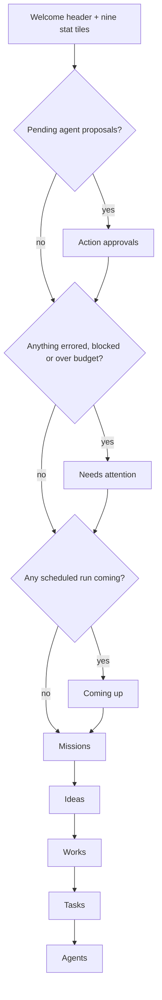

# The Dashboard

Sign in and you land on the **Dashboard** — the home page at `/`. It is a cockpit, not a launcher: one screen that tells you what needs a decision right now, what is about to run, and how the Missions, Ideas, Works, Tasks and Agents you own are doing. Around it sit the two pieces of chrome that stay with you on every page — the **sidebar** on the left and the **header** on top — plus the platform chat panel, which opens from the sidebar's right edge.

This page is a tour of all three: what each block shows, when it appears, and which route every button and tile leads to.

## The home page at `/`

The page opens with **"Welcome back, {username}!"** and a strip of stat tiles, then a stack of blocks. Three of the blocks are _signal_ blocks — they render only when they have something to say, so a healthy, quiet account sees a shorter page, not empty shells.



| Block                | Always shown?                   | What it is for                                                    |
| -------------------- | ------------------------------- | ----------------------------------------------------------------- |
| **Stat tiles**       | Yes (Teams tile is conditional) | Counts and month spend, each a shortcut to its catalog            |
| **Action approvals** | Only with pending proposals     | Approve or reject side-effectful actions your Agents want to take |
| **Needs attention**  | Only with problems              | Errored Agents, failed builds, blocked Tasks, an exhausted budget |
| **Coming up**        | Only with scheduled runs        | The next three scheduled Work or Mission runs                     |
| **Missions**         | Yes                             | Three most recent Missions with Ideas / Works / Sites counters    |
| **Ideas**            | Yes                             | Three Idea cards, quick-add, AI research ("Suggest more")         |
| **Works**            | Yes                             | Six most recent Works                                             |
| **Tasks**            | Yes                             | Five most recent in-flight Tasks, list or card view               |
| **Agents**           | Yes                             | Three most recent Agents with status, scope and heartbeat         |

Every number on the page is fetched in parallel when the page loads, and every fetch is caught individually: if one backend call fails you see a zero or a missing block, never a broken home page.

### The nine stat tiles

Each tile is two lines — the icon and count, then the label with an optional qualifier in parentheses. Tiles with a link open the matching catalog.

| Tile                | What it counts                                                                                        | Click goes to                                            |
| ------------------- | ----------------------------------------------------------------------------------------------------- | -------------------------------------------------------- |
| **Total Missions**  | Missions you own                                                                                      | `/missions`                                              |
| **Total Ideas**     | Ideas of every status                                                                                 | `/ideas`                                                 |
| **Total Works**     | Works you own or can access                                                                           | `/works`                                                 |
| **Total Items**     | Items across all your Works                                                                           | —                                                        |
| **Active Websites** | Works that are deployed and live                                                                      | —                                                        |
| **Month Spend**     | Account-wide spend for the current month, in your billing currency                                    | `/settings/work-agent#account-budgets` (the account cap) |
| **Agents**          | All Agents, with **(n active)** inline                                                                | `/agents`                                                |
| **Tasks in flight** | Tasks in `todo`, `in progress` or `in review`; **(n blocked)** appears only when something is blocked | `/tasks`                                                 |
| **Teams**           | Teams across your Organizations                                                                       | `/teams`                                                 |

The **Teams** tile only appears once you belong to at least one Organization; with none, the grid stays at eight tiles. The Works, Items and Active Websites numbers come from `GET /api/works/stats`, the same endpoint the `/works` page uses for its summary. Month Spend is the number [Budgets & Usage](./budgets-and-usage.md) caps; the tile is a shortcut to that cap.

### Needs attention

The red-and-amber **Needs attention** block collects the things that will not fix themselves. Each card is a link straight to the entity, ordered danger first, then most recent first, and capped at six on the home page — the rest stay discoverable on their own catalog pages.

| Card title                 | Fires when                                                                                             | Severity                                                                                  | Opens                                  |
| -------------------------- | ------------------------------------------------------------------------------------------------------ | ----------------------------------------------------------------------------------------- | -------------------------------------- |
| **Agent "{name}" errored** | An Agent's status is `error` — it auto-paused after repeated failures; the badge shows its error count | Danger                                                                                    | `/agents/:id`                          |
| **Generation failed**      | An Idea's build failed ("{name}" could not be built)                                                   | Warning                                                                                   | `/ideas/:id`                           |
| **Task blocked**           | A Task is in `blocked` and needs input to continue                                                     | Warning                                                                                   | `/tasks/:id`                           |
| **Budget exceeded**        | Account-wide spend has reached its cap                                                                 | Danger when the cap hard-stops runs, warning when spend is over the cap but still allowed | `/settings/work-agent#account-budgets` |

Two more card kinds — **Schedule run failed** and **Schedule paused** — are designed into the block, but the home page does not yet compose them; today a failed or paused schedule is visible in the **Schedules** view of [Activity](./activity.md) (`/activity?view=schedules`) and on the Work's own **Schedule** tab (see [Scheduled Updates](./scheduled-updates.md)).

### Coming up

**Coming up** lists the next three scheduled runs across your account — a **Work** schedule or a scheduled **Mission** tick — soonest first, each row showing the Work or Mission name, a `WORK` / `MISSION` chip, and the next run date and time. When more runs are queued, a **+N more** link opens the full Schedules view at `/activity?view=schedules`.

The rows come from `GET /api/schedules?enabledOnly=true`, the same aggregation the Schedules view reads, so the two never disagree. A schedule with no computable next run is not "coming up" and is left out; an account with nothing scheduled sees no block at all.

### Action approvals

When an Agent wants to do something side-effectful that its permissions do not let it do on its own, it files a **proposal** and waits. Those proposals surface at the top of the Dashboard as **Action approvals**, with a count badge and the note _"Your agents proposed these side-effectful actions. Approve or reject each one."_

Each row shows:

- the **action type** — `Spawn agent`, `Schedule task`, `Send message`, `Budget override`, or a generic `Action`;
- any **risk flags** — `Budget override`, `Destructive`, `Cross-scope`, `High fan-out`;
- the proposal's title;
- **Reject** and **Approve** buttons. **Approve all** in the block header approves every pending row in one call; rows decided elsewhere in the meantime are skipped and reported ("Approved 3 actions, 1 already decided").

The block disappears as soon as the last row is decided. The same queue is available over the API — `GET /api/agent-approvals` (defaults to the pending queue; filter with `?status=`), `POST /api/agent-approvals/:id/approve`, `POST /api/agent-approvals/:id/reject`, and `POST /api/agent-approvals/approve-all` with an optional `ids` list. Deciding an already-decided proposal returns `409`.

Approval requests also land in the operator **Inbox** at `/inbox` (the second sidebar entry), next to the blocking questions and escalations your Agents send you, so you can answer them from either place.

### Missions

The **Missions** block previews your three most recent Missions. Each card links to `/missions/:id` and shows the title, a status pill, a **Scheduled** badge for Missions that run on a cadence, and three counters: **Ideas** (every Idea attached to the Mission, any status), **Works** (Ideas that were accepted and became Works) and **Sites**. The Sites counter is reserved for the per-Mission deployment count and currently reads `0` for every card.

- **+ Add** opens the unified picker at `/new?type=mission`.
- **View all (N) →** opens the `/missions` catalog.
- With no Missions yet, the block shows _"No Missions yet. Start one to give the agent a persistent Goal that keeps generating Ideas for you."_

See [Missions](./missions.md).

### Ideas

The **Ideas** block is the home-page window onto the Idea queue described in [Ideas](./ideas.md). It shows up to three Idea cards — each with **Build**, **View Work** (once built) and **Dismiss** — and a header row of controls:

| Control                                | What it does                                                                                                                                                                                                                                           |
| -------------------------------------- | ------------------------------------------------------------------------------------------------------------------------------------------------------------------------------------------------------------------------------------------------------ |
| **Show accepted** / **Show dismissed** | Toggles that filter the preview exactly like the `/ideas` page. On the home page both start **on**, so an Idea you created by hand is visible whatever its status.                                                                                     |
| **+ Add**                              | Opens an inline text box. Describe the Idea (at least 10 characters) and press **Add** — the prompt is handed to the platform chat, which creates the Idea for you. **Create manually** beside it opens the deterministic form at `/ideas/new`.        |
| **Settings** (gear)                    | Shortcuts into Settings → Work Agent: **Auto-generate Ideas…**, **Auto-build Works…**, **Auto-retry policy…**, **Account-wide budgets…**.                                                                                                              |
| **Suggest more** (refresh icon)        | Asks the platform to research new Ideas for you. The block shows _"Generating ideas…"_ and polls every 2.5 seconds (for up to ten minutes) until the research run finishes. Hitting the daily limit shows _"Daily limit reached. Try again tomorrow."_ |
| **View all (N) →**                     | Opens `/ideas`; `N` is the real total across every status, the same number as the Total Ideas tile.                                                                                                                                                    |

Over the API, **Suggest more** is `POST /api/me/work-proposals/refresh`; `GET /api/me/work-proposals/status` reports whether research is running and whether another refresh is allowed, and `GET /api/me/work-proposals` lists the Ideas.

Arriving at the Dashboard with `?newUser=true` and an empty Idea queue **starts a research run automatically** — this is what a brand-new account sees after the onboarding wizard hands it over.

### Works

**Works** lists your six most recent Works as cards, with **+ Add** opening the picker at `/new?type=website`. Once you have more than five Works, **View all (N)** opens the `/works` catalog. An account with no Works sees _"No works yet"_ with a **Create Your First Work** button that opens the same picker. See [Creating a Work](./creating-a-work.md).

### Tasks

**Tasks** shows your five most recent in-flight Tasks — anything in `todo`, `in progress`, `in review` or `blocked`. Each row links to `/tasks/:id` and carries the Task slug, its title, a priority pill (`p0`–`p4`) and a status pill.

- The **list / cards** toggle switches between a compact list and a card grid; the choice is remembered in your browser.
- **+ Add** opens `/tasks/new`.
- **View all (N) →** opens `/tasks`; `N` is the Tasks-in-flight count from the tile.

See [Tasks](./tasks.md).

### Agents

**Agents** previews your three most recent Agents. Each card links to `/agents/:id` and shows the avatar or initials, name, title, a status chip (`draft`, `active`, `paused`, `running`, `error`, `archived`), the scope (**Workspace**, **Mission**, **Work** or **Idea**) and, for Agents with a heartbeat, `every {cadence}`.

- **+ Add** opens `/agents/new`.
- **View all (N) →** opens the Agents tab of the Teams hub at `/agents`.
- With no Agents yet: _"No Agents yet. Create your first Agent to delegate recurring work."_

See [Agents](./agents.md).

## The sidebar

The sidebar is the same on every dashboard page. Top to bottom:

### Organization switcher

The very first control is the **Organization switcher** — the active Organization's avatar and name (or the Ever Works wordmark when you have no Organization yet) with a chevron. Click it to open **Switch Organization**: every Organization you belong to, a check mark on the active one, and **Create Organization**, which opens the creation dialog. Picking another Organization persists the choice on your account and reloads the Dashboard scoped to it. Organizations, invitations and roles are covered in [Teams & Organizations](../advanced/teams-and-organizations.md).

### + New

The primary **+ New** button opens the unified picker at `/new`, where you choose what you are starting — a Mission, an Idea, an Agent, a Task, or a Work of a given kind (Website, Landing Page, Blog, Directory, Awesome Repo, Company) — and describe it in one prompt. Every chip, and where each one leads, is described on the [+ New page](./new-page.md).

### Navigation

| Entry         | Route        | Notes                                                                                                                                                               |
| ------------- | ------------ | ------------------------------------------------------------------------------------------------------------------------------------------------------------------- |
| **Dashboard** | `/`          | This page.                                                                                                                                                          |
| **Inbox**     | `/inbox`     | Messages addressed to you: blocking Agent questions, approval requests, escalations, notices. The only entry with an **unread badge** (refreshed every 30 seconds). |
| **Missions**  | `/missions`  | See [Missions](./missions.md).                                                                                                                                      |
| **Goals**     | `/goals`     | See [Goals](./goals.md).                                                                                                                                            |
| **Ideas**     | `/ideas`     | See [Ideas](./ideas.md).                                                                                                                                            |
| **Works**     | `/works`     | Shows a small amber **activity dot** while a Work is generating and you have not visited `/works` yet.                                                              |
| **Tasks**     | `/tasks`     | See [Tasks](./tasks.md).                                                                                                                                            |
| **Teams**     | `/teams`     | The hub for people _and_ Agents — tabs **Teams \| Agents \| Sessions \| Archived**. Stays highlighted on `/teams/*`, `/agents/*` and `/skills/*`.                   |
| **Memory**    | `/memory`    | Organization-wide memory; also hosts the Meetings block, so `/meetings/*` keeps it highlighted. See [Decisions & Review](./memory-decisions.md).                    |
| **Templates** | `/templates` | Website, Work and Mission template catalogs. See [Work Templates](./work-templates.md).                                                                             |
| **Plugins**   | `/plugins`   | See [Plugins](./plugins.md).                                                                                                                                        |
| **Activity**  | `/activity`  | The log and the Schedules view. See [Activity](./activity.md).                                                                                                      |
| **Settings**  | `/settings`  | See [The Settings Map](./settings-map.md).                                                                                                                          |

### Collapse toggle

The small panel icon beside the switcher collapses the sidebar to an icon-only rail (hover an icon for its name) and expands it again. The state is remembered in a cookie, so it survives reloads. On narrow screens the sidebar becomes an overlay: open it from the menu button at the left of the header, close it with the **X** or by tapping outside.

### Runner status

Above the profile menu sits the **Runner** pill — but only once your account has at least one enrolled [Fleet](./fleet.md) node. Until then the footer is exactly as it was, so an account that never runs work locally never sees it.

The pill reads **Runner · Running / Busy / Offline / None** with **N of M online** underneath. Click it for the **Local runners** popover: one row per machine (laptop icon for a desktop node, server icon for a fleet node) with its state — `Online`, `Busy`, `Offline`, `Paused`, `Disabled` or `Enrolling` — and four facts that explain a runner that looks healthy but is not: **Last heartbeat**, **Daemon** version, **Agent CLI** version (or _Not installed_) and **Disk free**. **Refresh now** re-polls; the caption tells you the automatic cadence (_Refreshes every Ns_); **Manage runners** opens `/settings/fleet`.

### Profile menu

Your avatar, username and email at the bottom open the profile menu:

| Item                   | Goes to                                                                      |
| ---------------------- | ---------------------------------------------------------------------------- |
| **Account Settings**   | `/settings`                                                                  |
| **Help & Docs**        | docs.ever.works (new tab)                                                    |
| **Support**            | The GitHub issue tracker (new tab)                                           |
| **Keyboard Shortcuts** | Opens the Help drawer                                                        |
| **Billing**            | `/settings/billing` — see [Credits & Billing](./credits-and-billing.md)      |
| **Usage & Credits**    | `/settings/usage` — see [The Settings Map](./settings-map.md#usage--credits) |
| **Sign Out**           | Ends the session                                                             |

### The chat panel

When the platform chat is collapsed, a small expand button sits on the sidebar's right edge. Open it and the chat becomes a resizable side panel (drag the grip to resize, use the arrows to collapse it again or expand it to fill the screen); on phones it opens full-screen. Its width and open state are remembered between visits. What you can ask it to do — which is nearly everything the dashboard does — is covered in [Platform Chat](./platform-chat.md).

## The header

Left to right, the header carries:

| Control           | What it does                                                                                                                                                                                                                                                                                                                                                                                                                       |
| ----------------- | ---------------------------------------------------------------------------------------------------------------------------------------------------------------------------------------------------------------------------------------------------------------------------------------------------------------------------------------------------------------------------------------------------------------------------------- |
| **Menu**          | On narrow screens only — opens the sidebar overlay.                                                                                                                                                                                                                                                                                                                                                                                |
| **Work switcher** | Appears only while you are inside a Work (`/works/:id/…`). A search box that filters your Works by name or slug; pick another one and you land on the **same tab** of that Work, query string included. The badge beside the name shows the Work's generation status — it shimmers while generating and refreshes every five seconds; a warning icon means the last run finished with warnings, and hovering it shows the message. |
| **Setup badge**   | **Onboarding n/N** — appears when you closed the [setup wizard](./onboarding.md) before finishing and have no Works yet. Click it to reopen the wizard where you left off; the **X** ("Hide onboarding shortcut") hides it in this browser without marking setup complete. `N` is 7 to 10 depending on which steps your choices require.                                                                                           |
| **Notifications** | The bell, with an unread count (99+ when it overflows), refreshed every 30 seconds. The dropdown lists each notification with its type icon, message, relative time and, when it has one, an action link; clicking a notification marks it read and follows the link. **X** dismisses a notification that is not persistent, and **mark all as read** clears the count. Empty state: _"No new notifications"_.                     |
| **Theme toggle**  | Switches between light and dark mode.                                                                                                                                                                                                                                                                                                                                                                                              |
| **Help (?)**      | Opens the Help drawer described below.                                                                                                                                                                                                                                                                                                                                                                                             |

Directly beneath the header, a self-hosted install without a background job runtime shows the banner _"Background job runtime is not configured. Agent runs cannot execute on this install until a job runtime (e.g. Trigger.dev credentials) is set up."_ with a **Setup guide** link and a **Dismiss** button. Configuring one is covered in [Workers](./workers.md).

## The Help drawer

**Help & Resources** slides in from the right — from the **?** button in the header, the **Keyboard Shortcuts** entry in the profile menu, or by pressing `?` anywhere outside a text field. It has four tabs:

| Tab           | Contents                                                                                                                                                                                                                                                                                                                   |
| ------------- | -------------------------------------------------------------------------------------------------------------------------------------------------------------------------------------------------------------------------------------------------------------------------------------------------------------------------- |
| **Tips**      | An **Onboarding** card — **Open onboarding (n/N)** reopens the guided setup and continues where you left off — followed by four **Quick Tips** (create your first Work, use the AI generator, connect GitHub, press `?` to reopen this panel).                                                                             |
| **Shortcuts** | The keyboard shortcut table below, with the hint _"Use Cmd on Mac or Ctrl on Windows/Linux"_.                                                                                                                                                                                                                              |
| **FAQ**       | Three expandable answers — _How does AI generation work?_, _How do I connect GitHub?_, _Can I edit items after generating?_ — each with numbered steps and a **Learn more** link into the documentation.                                                                                                                   |
| **Resources** | Links to **Documentation**, the **GitHub Repository**, **Report an Issue** and **Community Discussions**; a **Need more help?** card with **Join the discussion**; and a **System** card showing _All systems operational_ (with a status-page link when the operator has configured one) and the running **Environment**. |

The drawer's footer shows the running version (_Ever Works v…_).

## Keyboard shortcuts

Exactly three shortcuts are bound, and they work on every dashboard page:

| Keys                | Action                                                                                                                              | Works inside a text field? |
| ------------------- | ----------------------------------------------------------------------------------------------------------------------------------- | -------------------------- |
| `Ctrl` + `K` / `⌘K` | Go to `/works?focus=search` — the Works catalog with the search box focused                                                         | Yes                        |
| `C`                 | Start a new Work — opens `/works/new`, which forwards to the unified `/new` picker unless a mode or an Idea (`?proposal=`) is given | No                         |
| `?`                 | Open the Help drawer                                                                                                                | No                         |

`Ctrl`/`⌘` + `K` deliberately fires even while you are typing, so you can jump to search from anywhere; `C` and `?` are ignored inside inputs, text areas, selects and editable content so they never hijack what you are writing.

## How to

### Triage your account in two minutes

1. Open `/`. If **Action approvals** is showing, read each proposal's action type and risk flags, then click **Approve** or **Reject** — or **Approve all** when the whole queue is routine.
2. Work through **Needs attention** top to bottom; every card opens the Agent, Idea, Task or budget page where the fix happens. A danger card (an errored Agent, a hard-stopped budget) is worth opening first.
3. Check the **Inbox** badge in the sidebar; an unread count means an Agent is parked waiting for your answer. Open `/inbox`, pick the recommended option or write a reply, and **Send Reply**.
4. Glance at **Coming up** to see what will run next and when; **+N more** shows the whole schedule.
5. Read the **Month Spend** tile against your cap; click it to adjust the account-wide budget.

### Get a fresh batch of Ideas

1. In the **Ideas** block, click the refresh icon (**Suggest more**).
2. Wait for _"Generating ideas…"_ to finish — the block polls on its own and fills in as soon as the research run completes.
3. On each new card, click **Build** to turn it into a Work, or **Dismiss**. **Show dismissed** brings dismissed Ideas back if you change your mind.
4. To make this recurring, open the gear menu and choose **Auto-generate Ideas…**, which takes you to the setting in Settings → Work Agent.

From a terminal, the same run is one call with your [API key](./api-keys.md):

```bash
curl -X POST http://localhost:3100/api/me/work-proposals/refresh \
  -H "x-api-key: YOUR_API_KEY"

curl http://localhost:3100/api/me/work-proposals/status \
  -H "x-api-key: YOUR_API_KEY"
```

### Approve a proposal from the API

1. List the pending queue: `GET /api/agent-approvals` (add `?status=approved` or `?status=rejected` to review past decisions).
2. Decide one row with `POST /api/agent-approvals/:id/approve` or `POST /api/agent-approvals/:id/reject`. A `409` means someone already decided it.
3. Or clear the queue in one call: `POST /api/agent-approvals/approve-all`, optionally with `{ "ids": [...] }` to approve a subset.

```bash
curl http://localhost:3100/api/agent-approvals \
  -H "x-api-key: YOUR_API_KEY"

curl -X POST http://localhost:3100/api/agent-approvals/<proposal-id>/approve \
  -H "x-api-key: YOUR_API_KEY"
```

### Switch to another Organization

1. Click the Organization switcher at the top of the sidebar.
2. Pick an Organization from **Switch Organization** — the check mark shows which one is active now.
3. The Dashboard reloads scoped to that Organization; the **Teams** tile, the Missions and Works you see, and the Memory page all follow it.
4. Need a new one? Choose **Create Organization** from the same menu.

### Pick up onboarding where you left off

1. If the **Onboarding n/N** badge is in the header, click it.
2. Otherwise press `?` (or click the header's **?** button), stay on the **Tips** tab and click **Open onboarding (n/N)**.
3. The wizard reopens on the step you stopped at; finish it or close it again — closing never discards the choices you already saved.

## Related

- [The + New page](./new-page.md) — the unified picker behind the sidebar's **+ New** button and every **+ Add** shortcut on the home page.
- [Platform Chat](./platform-chat.md) — the chat panel that opens from the sidebar's edge and takes the Ideas block's quick-add prompts.
- [Onboarding & Setup Wizard](./onboarding.md) — the guided setup the header badge and the Help drawer reopen.
- [The Settings Map](./settings-map.md) — where each Settings entry the Dashboard links to lives.
- [Missions](./missions.md) · [Ideas](./ideas.md) · [Creating a Work](./creating-a-work.md) · [Tasks](./tasks.md) · [Agents](./agents.md) — the catalogs the home blocks preview.
- [Activity](./activity.md) — the log and the Schedules view behind **Coming up**.
- [Budgets & Usage](./budgets-and-usage.md) — the caps behind the Month Spend tile and the budget-exceeded card.
- [Fleet](./fleet.md) — the nodes the runner status pill reports on.
- [Teams & Organizations](../advanced/teams-and-organizations.md) — what the Organization switcher switches between.
- [Workers](./workers.md) — configuring the background job runtime the header banner asks for.
- API reference: [Notifications](../api/notifications.md), [Tasks](../api/tasks.md), [Agents](../api/agents.md).
