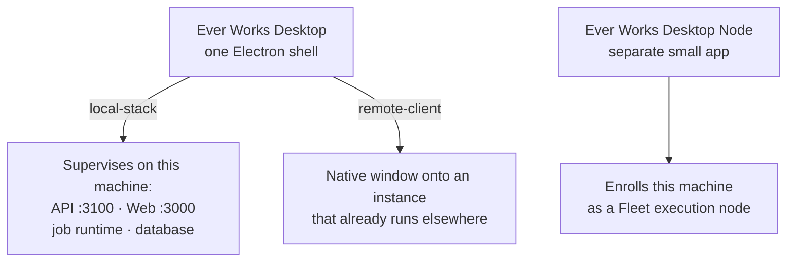

# Desktop App

:::caution Status: early access — build it, or take a CI installer

The Desktop App is **implemented and unit-tested in the monorepo**, not yet published as a public download.

- **Two apps ship in the repo.** `apps/desktop` (`ever-works-desktop`) is the Electron shell with the first-launch install wizard, the runtime picker and the local service supervisor. `apps/desktop-node` (`ever-works-desktop-node`) is a separate, deliberately small app that enrolls this machine as a [Fleet](./fleet.md) execution node.
- **Two modes, chosen in the wizard.** `local-stack` supervises its own API (`:3100`) and web UI (`:3000`) on your machine; `remote-client` runs nothing locally and becomes a native window onto an instance that already exists.
- **CI builds real installers.** `.github/workflows/desktop-build.yml` packages Windows, macOS and Linux installers on every push and pull request that touches `apps/desktop/**` and uploads them as **workflow artifacts** (`ever-works-desktop-windows` / `-macos` / `-linux`, retained 14 days).
- **There is no public installer release at the time of writing** — no download page, no auto-update channel. Today you either pull an artifact from a workflow run or [build it from source](#build-it-from-source).

Everything below marked "today" is in the repo now. The rest is where the local experience is headed. The step-by-step walkthrough lives in **[Desktop App: Local Stack or Client Mode](../guides/desktop-app.md)**.

:::

The **Desktop App** lets you run all of Ever Works **locally as a single application** — the API, the web dashboard, the [Workers](./workers.md), and the database, all bundled together. Install it, open it, and you have the entire platform on your own machine: build [Works](./creating-a-work.md), run [Agents](./agents.md), and operate [Missions](./missions.md) without depending on anyone else's servers.

## The two modes



| Mode                                                  | What runs on your machine                                                                              | What it needs                                                                       | Pick it when                                                                    |
| ----------------------------------------------------- | ------------------------------------------------------------------------------------------------------ | ----------------------------------------------------------------------------------- | ------------------------------------------------------------------------------- |
| **Run Ever Works on this machine** (`local-stack`)    | The API on `:3100`, the web UI on `:3000`, plus the job runtime and database you choose in the wizard. | A bundled runtime payload inside the installer, **or** an Ever Works repo checkout. | You want the whole platform local — your data, your repositories, your machine. |
| **Connect to an existing instance** (`remote-client`) | Nothing. The window is a native client onto an instance that already runs.                             | The instance URL, reachable from this machine.                                      | The platform already runs on your server, your team's box, or the cloud.        |

The mode is picked once, in the wizard's **mode** step, and stored in the app's config so it survives restarts. Local-stack mode is **disabled with the reason printed on the card** when the install has neither a bundled runtime nor a checkout — client mode still works, so the app never becomes useless.

## What ships today

| Capability                    | What it does                                                                                                                                                                                               |
| ----------------------------- | ---------------------------------------------------------------------------------------------------------------------------------------------------------------------------------------------------------- |
| **Install wizard**            | `welcome → mode → prereq → runtime → env → boot → open` for a local stack; `welcome → mode → remote → open` for a client. Each step gates **Continue** on its own condition.                               |
| **Runtime picker**            | Choose the job runtime the local stack boots on — BullMQ (recommended), pg-boss, Temporal, Trigger.dev, Inngest, or [Fleet nodes](./fleet.md). See [Job Runtimes](./job-runtimes.md).                      |
| **Database choice**           | Embedded SQLite (zero dependencies), local Postgres via `docker-compose.infra.yml`, or an external Postgres connection URL.                                                                                |
| **Self-contained runtime**    | Installers can ship a runtime payload at `resources/app-bundle` — the built API plus the Next.js standalone server. It runs on **Electron's own Node.js**, so a bundled install needs no Node.js, no pnpm. |
| **Service supervisor**        | The **Boot services** step starts API and web, polls their health, streams both processes' logs, and restarts a crashed service with exponential backoff.                                                  |
| **Status window and tray**    | After setup the app opens on a status screen (per-service state and pid, **Start all** / **Stop all** / **Open app**), and the tray keeps a running stack alive with the window closed.                    |
| **Remote connection guards**  | Client mode's `Test connection` probes `<apiUrl>/api/health` and gates the step on it. Plain HTTP is accepted but flagged; a URL carrying credentials is rejected outright.                                |
| **Hardened Electron shell**   | Single-instance lock, `contextIsolation` on, `nodeIntegration` off, a sandboxed preload exposing one typed IPC bridge, and outbound navigation pinned to the instance's own origins.                       |
| **Desktop Node**              | `apps/desktop-node` enrolls the machine with a single-use Fleet token, heartbeats, advertises capability tags and enforces its own concurrency and resource limits.                                        |
| **Cross-platform installers** | electron-builder targets: NSIS `.exe` on Windows, `.dmg` + `.zip` on macOS, `.AppImage` + `.deb` on Linux.                                                                                                 |

## How to get it today

There is no download page yet, so pick one of these two paths.

### Take an installer from CI

1. Open the **Desktop App Build** workflow in the [`ever-works/ever-works`](https://github.com/ever-works/ever-works) repository on GitHub.
2. Choose a run on `main`, `develop` or `stage` — pushes are the runs that matter, because pull-request cells build the shell alone to keep feedback fast.
3. Download the artifact for your OS: `ever-works-desktop-windows`, `ever-works-desktop-macos` or `ever-works-desktop-linux`. Artifacts are kept for **14 days**.
4. Check what you got. On a push, only the **Linux** cell stages the self-contained runtime payload; the Windows and macOS artifacts from that same run carry a `bundled: false` manifest and therefore offer **client mode only**. A `workflow_dispatch` run with `bundle_runtime: true` stages the payload on all three.
5. Expect an **unsigned** build unless the run had the signing secrets. Packaging degrades to unsigned and prints a `::warning` naming the missing secrets rather than failing — which is what keeps forks and pull requests building. Linux artifacts are unsigned by design.

### Build it from source

From a checkout of the monorepo, with Node.js 22+ and pnpm installed:

1. **Install dependencies and fetch the Electron binary.** This repo does not allow-list install scripts, so Electron's own postinstall never runs:

    ```bash
    pnpm install
    cd apps/desktop && node node_modules/electron/install.js
    ```

    Or run `pnpm approve-builds` once and allow `electron`.

2. **Build and test the shell:**

    ```bash
    pnpm build:desktop                          # tsc type-check + main process + renderer
    pnpm --filter ever-works-desktop test       # vitest unit tests
    pnpm --filter ever-works-desktop start      # electron . against the built output
    ```

3. **Produce a fully self-contained installer** — four steps, in order:

    ```bash
    pnpm --filter ever-works-desktop build
    NEXT_BUILD_OUTPUT=standalone pnpm build     # the platform: API + standalone Next.js server
    pnpm --filter ever-works-desktop bundle     # stage bundle/: manifest + api/ + web/
    pnpm --filter ever-works-desktop package    # electron-builder → apps/desktop/release/
    ```

    Skip the middle two and packaging still succeeds — the installer just carries no runtime payload, so the app it installs offers client mode only.

4. **Build the Desktop Node** separately if you want the execution-node app:

    ```bash
    pnpm build:desktop-node
    pnpm --filter ever-works-desktop-node dist
    ```

:::note Neither app is in the default root build

Like `apps/docs`, both `apps/desktop` and `apps/desktop-node` are filtered out of `pnpm build` and `pnpm build:apps` to keep the platform build lean. Use the filtered commands above, or `pnpm build:all`.

:::

## How to run the platform on your machine

Once you have an app with a runtime payload (or a checkout it can find):

1. **Launch the app** and press **Continue** past **Welcome**.
2. On **How do you want to run Ever Works?**, choose **Run Ever Works on this machine**. The badge on the card tells you what the shell resolved: **Bundled runtime**, **From source checkout**, or a red **Unavailable**.
3. Clear the **Prerequisite check**. Node.js 22+ and pnpm are blocking only on a source checkout; Docker is always optional and only gates the docker-compose database option.
4. On **Choose your job runtime**, pick a runtime and fill its fields. **BullMQ** is the recommended default for an all-in-one install.
5. Choose the database on the same step — **Embedded SQLite** for zero dependencies, local Postgres via docker-compose, or an external connection URL.
6. Press **Write configuration**, then **Start services**. Watch **API (:3100)** and **Web (:3000)** move from `starting` to `healthy`.
7. Press **Open Ever Works**. You are now in the normal product — finish [onboarding](./onboarding.md) and create your first Work.

To have an instance you already run execute jobs on machines enrolled with the Desktop Node, switch the job runtime to **Fleet nodes** on **Settings → Job Runtime** (`/settings/job-runtime`); mint node enrollment tokens on **Settings → Fleet** (`/settings/fleet`).

Every screen, field, environment key and failure message is documented step by step in the [Desktop App guide](../guides/desktop-app.md).

## What "all local" means

- **Full stack in one app** — the API, frontend dashboard, the background-jobs runtime (Trigger.dev-style, powering schedules and Agents), and the database ship together as a single installable application. No separate services to wire up.
- **Your data on your machine** — repositories, Knowledge Base, and configuration stay local by default.
- **Works offline-first** — the platform keeps working without a constant connection to a cloud backend.

## Local, but not isolated

The Desktop App is designed to **connect outward** when you want it to:

- Point it at an **external database** (managed Postgres, or your own server).
- Use an **external background-jobs backend** (a hosted or self-hosted jobs service) instead of the bundled one.
- Connect any **AI, search, deployment, storage, or email provider** through the same [plugin system](../plugin-system/index.md) the cloud uses.
- Push your Works' code and content to **your Git provider** and deploy to **your targets**, exactly as in the cloud.

So you can start fully local and selectively move pieces to the cloud as you grow — without changing how you work.

## Why it matters

The Desktop App is the strongest expression of the platform's ownership promise: **open source (AGPLv3), your machine, your data, your repositories.** It's Ever Works as a workshop that lives on your desk, not just in a browser tab.

## Still ahead

Named as follow-ups in `apps/desktop`, not shipped yet:

- **A public installer release** — a download page and released builds, rather than workflow artifacts you fetch by hand.
- **Auto-update channels** on top of the signed artifacts.
- **Electron end-to-end tests** that smoke-launch the shell and drive the wizard; unit tests cover the pure logic today.

## See also

- [Desktop App guide](../guides/desktop-app.md) — the full walkthrough: both wizards, every field, the troubleshooting table
- [Fleet (your own machines)](./fleet.md) — enrollment tokens and the `/settings/fleet` screen the Desktop Node reports into
- [Job Runtimes](./job-runtimes.md) · [Workers](./workers.md)
- [Onboarding](./onboarding.md) · [Creating a Work](./creating-a-work.md)
- [Installation](../installation.md) · [DevOps & Deployment](../devops/docker.md) · [Self-host with Docker or Kubernetes](../guides/self-host-docker-kubernetes.md)
- [Plugin System](../plugin-system/index.md)
- [Roadmap](../roadmap.md)
