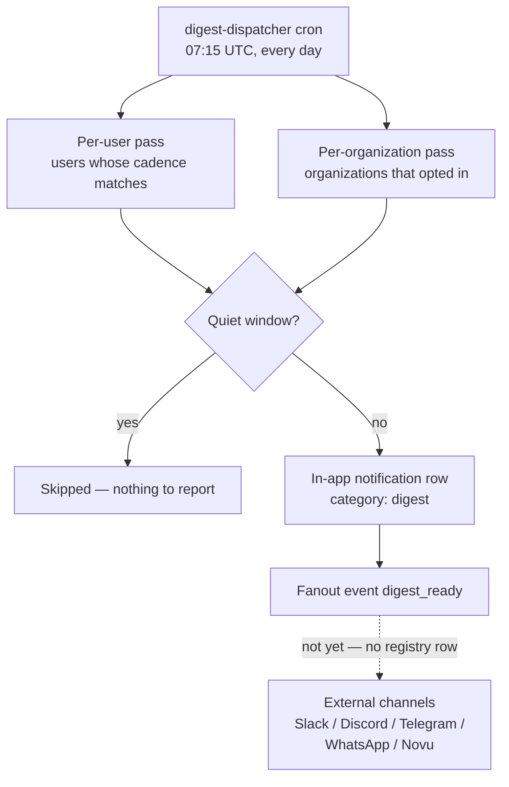

# Digests (Daily & Weekly Briefings)

Ever Works keeps working while you are not watching. A **digest** is the briefing that tells you what happened: one message covering the last 24 hours (daily) or the last 7 days (weekly), listing the [agent runs](./agents.md) that completed or failed, the [tasks](./tasks.md) that moved, the pull requests that were opened, the events that arrived from your connected sources, the escalations still waiting on you, and where your [goals](./goals.md) stand.

Every number in a digest is counted from real rows. Nothing is estimated and nothing is invented — if a section is missing, it is because there was nothing in it, and the digest says so in plain words.

Digests are **off by default**. You turn them on at **Settings → Digest** (`/settings/digest`).

## Two scopes, two independent settings

| Scope            | What it aggregates                                                                                      | Where the setting lives                        | Who receives it                                                  | Default        |
| ---------------- | ------------------------------------------------------------------------------------------------------- | ---------------------------------------------- | ---------------------------------------------------------------- | -------------- |
| **Personal**     | Your own runs, tasks, PRs, ingested events, open escalations and active goals.                          | Your user preference (`users.digestFrequency`) | You.                                                             | Off.           |
| **Organization** | The same window computed over every row stamped with your organization's id — one shared team briefing. | The organization's own digest settings         | The tenant owner (the account that owns the organization) today. | Off; `weekly`. |

The two are **additive and independent**. Turning the organization digest on does not silence, replace or alter any member's personal digest, and turning a personal digest off does not touch the organization's. An organization that never opted in is never even scanned.

## What is in a digest

A digest is markdown. It opens with a heading — `Your daily digest`, or `Acme — weekly digest` for an organization — and a coverage line (`_Covering 2026-08-25 → 2026-09-01._`), then renders only the sections that have content:

| Section                 | Rendered when                                                                         | What it contains                                                                                           |
| ----------------------- | ------------------------------------------------------------------------------------- | ---------------------------------------------------------------------------------------------------------- |
| **Agent runs**          | Any run finished in the window.                                                       | `N completed, M failed`, then one line per run using its summary (or its error message, for a failed run). |
| **Tasks**               | Any task moved to `done` or `in_review` in the window.                                | `N done, M moved to review`, then the task titles.                                                         |
| **Pull requests**       | A task in the window carries a PR URL.                                                | Linked PR titles, with `…and N more` once the list is capped.                                              |
| **Connected sources**   | Any [ingested event](./integrations.md) arrived in the window.                        | Event counts per source, busiest source first.                                                             |
| **Needs your decision** | An [escalation](./approvals-and-escalations.md) was raised in the window and is open. | The escalation's reason code, its summary, and the decision that is needed. Personal digests only.         |
| **Goal progress**       | You have active goals.                                                                | `current / target unit` per goal — a snapshot, not window activity. Personal digests only.                 |
| **Summary**             | An AI provider is configured and the narrative is enabled.                            | Two to four sentences of prose written from the counts above it.                                           |

Two sections are deliberately absent from **organization** digests: goals and escalations are per-user stores today, and printing one member's goals as "the organization's" would be exactly the kind of fabricated number this feature refuses to produce.

Each section lists at most **five** items, and each line is capped at 120 characters, so a busy week still arrives as a briefing rather than a database dump.

### The one-line version

Alongside the markdown, every digest carries a one-line text summary — the body of the notification, and the line the fanout event carries:

```text
Daily digest: 2 decisions needed · 7 agent runs completed (1 failed) · 4 tasks done · 2 PRs opened · 31 events from 3 sources · 5 active goals.
```

Escalations lead that line for the same reason they matter most: they are the only part of a digest that is blocking on a human.

### The AI summary

On top of — never instead of — the counts, a digest can carry a short written summary. It is generated through the platform's AI facade, so your configured provider, the settings hierarchy, your [budgets](./budgets-and-usage.md) and usage metering all apply. The prose is composed from the already-rendered report, so it can only restate numbers that are already printed above it.

| Status        | What you see in the digest                                                        | Why                                                                     |
| ------------- | --------------------------------------------------------------------------------- | ----------------------------------------------------------------------- |
| `generated`   | A `## Summary` section, footnoted _"AI-written summary of the counts above."_     | A provider answered.                                                    |
| `disabled`    | Nothing extra — no banner.                                                        | You turned the narrative off, or the window was quiet (nothing to say). |
| `unavailable` | A blockquote: **AI summary unavailable.** … _"Every number below is unaffected."_ | No AI provider is configured on this install.                           |
| `failed`      | The same blockquote, carrying the provider's error.                               | A provider is configured but the call errored or returned nothing.      |

The degradation is loud on purpose: a missing model can cost you the prose, never the counts, and an empty summary must never read as "nothing happened". The settings page tells you the same thing **before** the first digest arrives — with no provider configured it shows _"No AI provider is configured, so digests will arrive without the written summary. Every count is still computed and delivered."_

The narrative is capped at 400 tokens and 1200 characters per digest.

### Quiet windows

If nothing at all happened — no runs, no task movement, no PRs, no events, no open escalations — the window is **quiet** and no digest is sent. A daily "nothing happened" message is noise, not signal. Goal progress alone never un-quiets a digest (it is a snapshot, not activity); a single open escalation always does.

Composing a digest on demand still returns the quiet digest, so you can look at an empty window whenever you want to.

## When it arrives



| Cadence    | Dispatched                              | Window covered                     |
| ---------- | --------------------------------------- | ---------------------------------- |
| **Daily**  | Every day at **07:15 UTC**.             | The trailing 24 hours ending then. |
| **Weekly** | **Mondays**, on the same 07:15 UTC run. | The trailing 7 days ending then.   |

One schedule drives both cadences, with an in-task weekday check, so the two can never drift apart. Each run makes two independent passes — one over users, one over opted-in organizations — and a failure in the organization pass is logged without costing anyone their personal digest. Both passes are bounded at 200 subjects per run.

Delivery is deduplicated per subject, period and window day, so re-running the schedule cannot stack duplicate briefings, and an organization briefing can never collide with (or suppress) the recipient's own personal one for the same window.

## How a digest is delivered

Delivery reuses the [notifications](./notifications.md) stack rather than inventing a transport:

1. An **in-app notification** is always written — category `digest`, type `info`, with a **View activity** action pointing at `/activity`. The rendered markdown rides along in the notification metadata (capped at 8000 characters).
2. The platform then emits the same briefing on the shared fanout path under the event key **`digest_ready`** (non-urgent) — the ordinary route every notification producer takes to reach [channels](./notifications.md).

### Where a digest actually lands today

**A digest reaches the bell, and only the bell.** `digest_ready` has no row in the notification event-type registry yet, and the channel resolver answers an unregistered key with in-app _before_ it consults your per-channel subscriptions. So subscribing a Slack, Discord, Telegram, WhatsApp or Novu channel to `digest_ready` changes nothing while the key is unregistered — the fanout is wired, the registry row is what is missing. [Notifications](./notifications.md) states the same rule for every unregistered event key. External delivery follows once the key is registered; nothing about the composition or the in-app briefing changes when it is.

Because the resolver short-circuits there, quiet hours and category mutes have nothing to act on for digests today: muting the `digest` category cannot silence an external copy that is not being sent, and the bell keeps recording the briefing either way. When `digest_ready` is registered, digests will inherit those semantics exactly as every other event does.

## How to turn on your personal digest

1. Open **Settings → Digest** (`/settings/digest`).
2. Leave the scope switch on **Personal** (the default).
3. Turn on **Send me a personal digest**.
4. Pick a **Cadence** — _Daily_ (last 24 hours) or _Weekly_ (last 7 days).
5. Click **Save**. A toast confirms _"Digest settings saved"_, and the form re-renders from the server's persisted value rather than an optimistic guess.
6. Know where it will land: in the bell and on `/activity`. Adding a channel at **Settings → Channels** (`/settings/integrations/channels`) does **not** yet route digests to it, because `digest_ready` is not in the event-type registry — see [Notifications](./notifications.md).

Your cadence is a single tri-state preference (`off` / `daily` / `weekly`), so changing the cadence changes which pass picks you up, and turning the digest off keeps no hidden cadence behind it.

## How to turn on the organization digest

1. Make sure an organization is active for your session. Without one the page shows _"No active organization for this session, so there is no organization digest to configure. Create or switch to an organization first."_
2. Open **Settings → Digest** and click **Organization** on the scope switch. The form confirms which organization you are editing: _"Editing the digest for Acme."_
3. Turn on **Send an organization digest**.
4. Pick the **Cadence** (organizations default to _Weekly_).
5. Leave **Include an AI summary** on, or turn it off to receive counts only.
6. Click **Save**. Once the first briefing has gone out, the page shows **Last sent** with its timestamp next to the button.

Writes go through the organization-admin check (`ensureAdmin`) and reads through the membership check (`ensureMember`); today both resolve to plain membership, because there is no separate org-admin role in the schema yet. The distinction is reserved for that future role, so it lands in one place instead of being retrofitted across every write route. A foreign organization id is answered with a `404`, never a `403`, so an organization you are not a member of stays indistinguishable from one that does not exist.

## Preview a digest without waiting for the cron

`GET /api/digest` composes the briefing for the current window and returns it immediately. It is a pure read — composing never delivers, never consumes a scheduled digest and never changes delivery state — so you can call it as often as you like.

```bash
# Your own last 24 hours
curl "http://localhost:3100/api/digest?period=daily" \
  -H "x-api-key: ew_live_your_key_here"

# Your active organization's last 7 days
curl "http://localhost:3100/api/digest?period=weekly&scope=organization" \
  -H "x-api-key: ew_live_your_key_here"
```

There is deliberately **no `userId` and no `organizationId` parameter**. The personal digest is always composed for the calling session's own user, and the organization digest always for that session's active organization, re-checked against your tenant. Accepting either id from the client would turn this read into a cross-tenant activity oracle.

Agents can do the same from chat. When the `digest` tool domain is enabled for an [Agent](./agents.md), it gets a `get_digest` tool taking `period: "daily" | "weekly"` — so _"what happened this week?"_ or _"give me my daily recap"_ returns the deterministic counts, which the agent can quote verbatim.

## API reference

Every route authenticates with a session token or an [API key](./api-keys.md).

| Method | Route                        | What it does                                                                                                           |
| ------ | ---------------------------- | ---------------------------------------------------------------------------------------------------------------------- |
| `GET`  | `/api/digest?period=&scope=` | Compose and return a digest. `period`: `daily` (default) or `weekly`. `scope`: `personal` (default) or `organization`. |
| `GET`  | `/api/digest/settings`       | Read both settings records — personal, plus the active organization's when there is one.                               |
| `PUT`  | `/api/digest/settings`       | Write **one** of them, chosen by `scope`.                                                                              |

`GET /api/digest/settings` answers with both records plus one honest flag:

```json
{
	"personal": { "enabled": true, "cadence": "daily" },
	"organization": {
		"organizationId": "8f1c…",
		"displayName": "Acme",
		"enabled": true,
		"cadence": "weekly",
		"narrative": true,
		"lastRunAt": "2026-09-01T07:15:11.902Z"
	},
	"aiConfigured": true
}
```

`organization` is `null` when the session has no active organization — the API never fabricates one. `aiConfigured` is what drives the "the summary will be skipped" hint in the UI.

Writing is one call per scope:

```bash
# Personal: daily
curl -X PUT "http://localhost:3100/api/digest/settings" \
  -H "x-api-key: ew_live_your_key_here" \
  -H "Content-Type: application/json" \
  -d '{"scope":"personal","enabled":true,"cadence":"daily"}'

# Organization: weekly, counts only
curl -X PUT "http://localhost:3100/api/digest/settings" \
  -H "x-api-key: ew_live_your_key_here" \
  -H "Content-Type: application/json" \
  -d '{"scope":"organization","enabled":true,"cadence":"weekly","narrative":false}'
```

A write returns the same shape the `GET` does, read back from storage. `narrative` is an organization-scope field; it is ignored for `personal`, where the digest follows the install default (summary on whenever a provider is configured). The personal cadence is also writable through the profile endpoint (`PUT /api/auth/profile` with `digestFrequency`), which stays the single source of truth either way.

A composed digest (`GET /api/digest`) carries its counts as data, not only as prose:

| Field                          | Meaning                                                                                                                                       |
| ------------------------------ | --------------------------------------------------------------------------------------------------------------------------------------------- |
| `scope`, `subjectId`, `period` | What was composed, for whom, over which window.                                                                                               |
| `since`, `until`               | Window bounds, ISO-8601.                                                                                                                      |
| `quiet`                        | `true` when the window contained no activity at all.                                                                                          |
| `markdown`                     | The rendered briefing, including the summary or the note explaining its absence.                                                              |
| `text`                         | The one-line version.                                                                                                                         |
| `counts`                       | `runsCompleted`, `runsFailed`, `tasksDone`, `tasksInReview`, `prsOpened`, `eventsBySource`, `eventsTotal`, `goalsTracked`, `escalationsOpen`. |
| `narrative`                    | `{ status, text, reason }` — the AI summary outcome.                                                                                          |

## Limits

Every read is bounded, so an account of any size composes in predictable time.

| Bound                        | Personal digest | Organization digest |
| ---------------------------- | --------------- | ------------------- |
| Agent runs scanned           | 100             | 400                 |
| Tasks scanned                | 200             | 500                 |
| Ingested events scanned      | 200             | 500                 |
| Active goals in the snapshot | 25              | not included        |
| Items listed per section     | 5               | 5                   |
| Subjects per dispatch pass   | 200             | 200                 |

## Troubleshooting

| Symptom                                                         | Likely cause                                                                                                                                                       |
| --------------------------------------------------------------- | ------------------------------------------------------------------------------------------------------------------------------------------------------------------ |
| No digest arrived this morning                                  | The window was quiet — nothing happened, so nothing was sent. Confirm with `GET /api/digest?period=daily`.                                                         |
| The digest arrives in-app but never in Slack or Discord         | Expected today — `digest_ready` has no event-type registry row, so digests resolve to in-app only whatever you subscribe. See [Notifications](./notifications.md). |
| The digest has counts but no written summary                    | No AI provider is configured, the call failed, or the narrative is turned off. The digest itself states which.                                                     |
| The **Organization** scope shows "No active organization"       | The session has no active organization. Create or switch to one first — see [Teams](./teams.md).                                                                   |
| Saving the organization scope returns `404`                     | Either there is no active organization, or the one in scope is not yours. Both answer identically by design.                                                       |
| The organization digest went to one person, not the whole team  | Expected today: an organization briefing is delivered to the tenant owner. Members keep receiving their own personal digests.                                      |
| A weekly digest arrived on a day that is not Monday             | It was composed on demand — `GET /api/digest?period=weekly` or the `get_digest` chat tool. The scheduled weekly pass only runs on Mondays.                         |
| Goals show in a personal digest but not in the organization one | Goals and escalations are per-user stores, so they are omitted from organization digests rather than attributed to one member.                                     |

## Related

- [Notifications, Channels & Preferences](./notifications.md) · [Inbox](./inbox.md) · [Approvals & Escalations](./approvals-and-escalations.md)
- [Activity](./activity.md) · [Settings Map](./settings-map.md) · [Tasks](./tasks.md) · [Goals](./goals.md)
- [Agents (Your AI Employees)](./agents.md) · [Integrations](./integrations.md) · [Budgets & Usage](./budgets-and-usage.md)
- API reference: [Notifications](../api/notifications.md) · [Activity Log](../api/activity-log.md)
