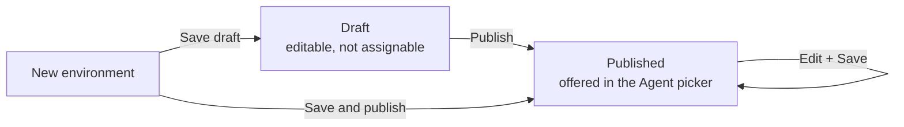
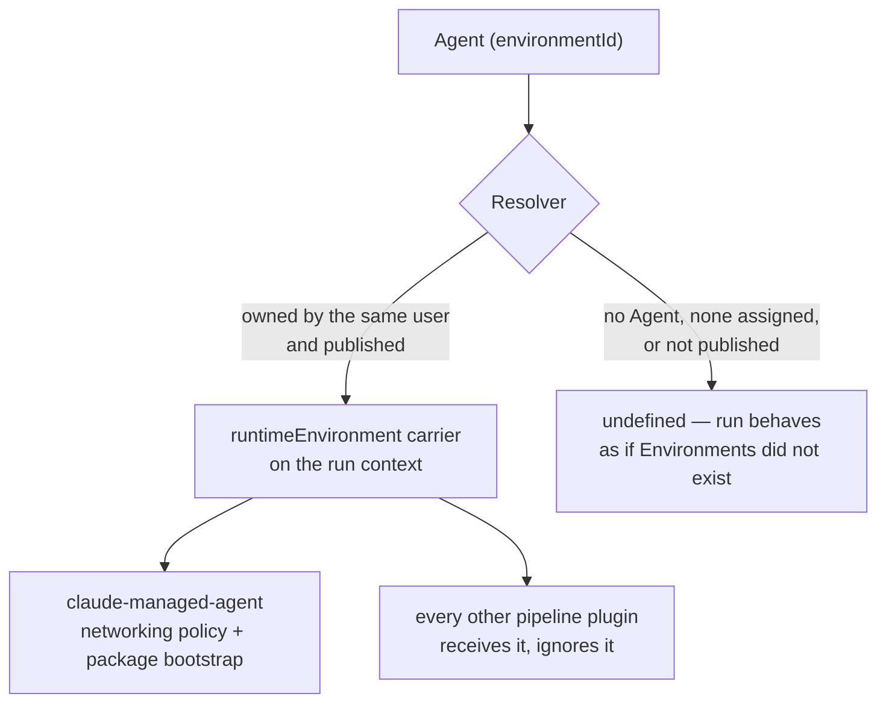

# Environments

An **Environment** is a named, reusable runtime recipe: the Python and Node packages a run should start with, and how much of the internet that run may reach. You write it once under **Settings**, publish it, and assign it to an [Agent](./agents.md). Every run of that Agent then starts from the same toolchain and the same egress rules, instead of whatever the runtime happened to have installed.

Think of it as the difference between "this Agent writes Python" and "this Agent runs with `pandas` and `httpx` already installed and may only talk to `api.github.com`".

:::info Status: shipped, with one consumer
The screen, the API and the per-Agent assignment are all shipped and enforced server-side. What an Environment **does** at run time is narrower: today it is honoured by managed-agent runs — the `claude-managed-agent` pipeline plugin, which turns it into the run's sandbox networking policy and a package-install bootstrap. Every other pipeline plugin receives the resolved Environment as advisory metadata and ignores it. Two further limits worth knowing up front: the **Available in all projects** switch stores your choice but the per-project narrowing surface it anticipates is not built yet, and no end-to-end browser test covers this screen — file anything odd rather than assuming it is expected.
:::

:::note Where to find it
**Sidebar → Settings → Environments** (`/settings/environments`).

Assignment happens per Agent, on **Capabilities** (`/agents/:id/capabilities`) or on the Agent's **Settings** tab (`/agents/:id/settings`).
:::

## What an Environment carries

| Field                         | What it does                                                                                        | Limits                                                             |
| ----------------------------- | --------------------------------------------------------------------------------------------------- | ------------------------------------------------------------------ |
| **Name**                      | The label you pick it by. A URL slug is derived from it and must be unique across your Environments | 1–120 characters, at least one alphanumeric                        |
| **Description**               | Free text for whoever reads the list next                                                           | Up to 2,000 characters; clearing the field clears the stored value |
| **Available in all projects** | Offer this Environment everywhere Agents are assigned Environments                                  | Defaults to on; the per-project narrowing surface is a follow-up   |
| **Python packages (pip)**     | pip requirement specifiers installed before any work starts                                         | Up to 100 entries, 128 characters each, one per line               |
| **Node packages (npm)**       | npm install targets installed before any work starts                                                | Up to 100 entries, 128 characters each, one per line               |
| **Networking**                | `Unrestricted` (any host) or `Limited` (only the hosts you list)                                    | Two modes only                                                     |
| **Allowed hosts**             | The egress allow-list, shown only when networking is `Limited`                                      | Up to 200 hostnames, 253 characters each                           |
| **Allow package managers**    | Keep package-manager registries reachable even under `Limited` networking                           | Defaults to on; shown only when networking is `Limited`            |
| **Status**                    | `Draft` or `Published` — only published Environments are assignable                                 | Set by **Save draft** / **Publish**, never typed                   |

The list on `/settings/environments` shows four columns — **Name**, **Networking**, **Status**, **Updated** — with **Publish**, **Edit** and **Delete** on each row and **New environment** in the header. Everything else lives in the editor dialog behind **New environment** or **Edit**.

## Draft versus published

Publishing is the explicit "this recipe is ready" gate. A draft is fully editable but cannot be attached to anything, so a half-written package list can never quietly become an Agent's runtime.



| Status        | Editable | Offered in the Agent picker | Assignable over the API                                   |
| ------------- | -------- | --------------------------- | --------------------------------------------------------- |
| **Draft**     | Yes      | No                          | No — `422`, "Only published Environments can be assigned" |
| **Published** | Yes      | Yes                         | Yes                                                       |

Three details that matter in practice:

- **Publish is idempotent.** Publishing an already-published Environment succeeds and changes nothing.
- **Editing a published Environment does not demote it.** The row stays published and the next run picks up the change. When the consuming plugin notices the configuration has drifted from what it last provisioned, it updates the managed sandbox rather than creating a second one.
- **Un-publishing is not a button.** There is no demote action; a row that somehow references a non-published Environment is simply ignored at run time (with a warning in the logs), and the run behaves as if no Environment were assigned.

Every create, update, publish and delete is written to your [Activity](./activity.md) feed as `environment_created`, `environment_updated`, `environment_published` or `environment_deleted`.

## Networking

| Mode             | What the runtime may reach                                                                         | Allowed hosts               |
| ---------------- | -------------------------------------------------------------------------------------------------- | --------------------------- |
| **Unrestricted** | Any host                                                                                           | Not used — cleared to empty |
| **Limited**      | Only the hostnames you list, plus package-manager registries when **Allow package managers** is on | Required, up to 200 entries |

Switching a row back to **Unrestricted** clears its stored hosts, so the two fields can never disagree about the effective posture.

### What counts as an allowed host

An entry is a bare hostname, optionally with a single leading `*.` wildcard label. No scheme, no port, no path:

```text
api.github.com
*.example.com
```

These are rejected outright, at every layer:

| Rejected                                                               | Why                                                                                                                              |
| ---------------------------------------------------------------------- | -------------------------------------------------------------------------------------------------------------------------------- |
| `https://api.github.com`, `api.github.com:443`, paths                  | The field is a hostname, not a URL                                                                                               |
| IPv4 literals such as `169.254.169.254`, IPv6 literals                 | Allow-listing an address would authorise reaching the runtime's own network — cloud instance-metadata endpoints first among them |
| `localhost`, and anything ending `.local`, `.internal`, `.localdomain` | Same reason: an allow-list entry names a **public** service, never an internal one                                               |

### Allow package managers

Under **Limited** networking this switch decides whether the registries behind pip and npm stay reachable. Turning it **off** with packages still listed is a contradiction the platform resolves in your favour: the install bootstrap is skipped entirely rather than burning a turn on commands the sandbox forbids.

MCP servers are never enabled inside a managed sandbox by an Environment — the run's MCP access is configured on the Agent ([Agent Capabilities](./agent-capabilities.md)), so an Environment claims only what it can honestly enforce.

## Package lists

One specifier per line. Newline is the **only** separator for packages, because a comma is legal inside a single pip specifier:

```text
pandas>=2.0,<3.0
requests
uvicorn[standard]>=0.29,<1
```

```text
typescript
@scope/pkg@^1.2.0
eslint@9.1.0
```

Entries are trimmed, de-duplicated and validated against a strict allow-list — the same validator on the way in, in the service, and again inside the consuming plugin. The grammar accepts a package name, optional extras, and optional version constraints, and nothing else: every shell metacharacter is outside the accepted alphabet, and a specifier can never begin with `-`, so it can never be read as a command-line flag. An entry that fails validation is refused with a `400` naming the exact specifier.

Allowed-hosts input is more forgiving about layout — commas or newlines both work, since a hostname never contains a comma.

## Who honours an Environment today

An Environment is resolved **once, at run dispatch**, from the run's Agent:



| Consumer                                       | What it does with the Environment                                                                                                                                                                                                                                   |
| ---------------------------------------------- | ------------------------------------------------------------------------------------------------------------------------------------------------------------------------------------------------------------------------------------------------------------------- |
| **`claude-managed-agent` pipeline plugin**     | Networking becomes the managed sandbox's policy (`unrestricted`, or `limited` with your hosts and the package-manager flag). Package lists become a bootstrap message that runs `pip install` / `npm install -g` **before** the workspace seed and the main prompts |
| **Other pipeline plugins**                     | Receive the resolved Environment on the run context and ignore it today — it is advisory metadata for them                                                                                                                                                          |
| **Runs with no Agent** (plain Work generation) | Nothing is resolved; there is no Environment in play at all                                                                                                                                                                                                         |

Two behaviours are deliberate and worth relying on:

- **A missing Environment is silent.** No Agent on the run, nothing assigned, or a row that is no longer published all resolve to "no Environment", and the run proceeds exactly as it did before Environments existed — for managed-agent runs, that means the deployment-level `CLAUDE_MANAGED_AGENT_EGRESS_HOSTS` fallback.
- **A failed lookup fails the run.** If the resolver errors, the run is failed rather than continued. A lookup that errored tells us nothing about what the Agent was assigned, and continuing would silently swap your restrictions for the fallback posture.

## How to: create and publish an Environment

1. Go to **Sidebar → Settings → Environments** (`/settings/environments`) and click **New environment**.
2. Give it a **Name** — for example `Data analysis` — and, optionally, a **Description** saying what it is for.
3. Add your **Python packages (pip)** and **Node packages (npm)**, one specifier per line.
4. Pick a **Networking** mode. Choose **Limited — only the allowed hosts below are reachable** if the runs should not be able to reach arbitrary hosts.
5. If you chose **Limited**, fill in **Allowed hosts** (one per line) and decide whether **Allow package managers** stays on. Leave it on if you listed any packages.
6. Click **Save draft** to keep working on it, or **Save & publish** to make it assignable immediately. A draft can be promoted later with **Publish** on its row.
7. Confirm the row shows **Published** in the **Status** column. Only then does it appear in the Agent picker.

## How to: assign an Environment to an Agent

1. Open **Sidebar → Teams → Agents**, pick the Agent, and open its **Capabilities** tab (`/agents/:id/capabilities`).
2. Scroll to the **Environment** section. The picker lists your **published** Environments only; **Manage environments** links straight back to `/settings/environments`.
3. Choose the Environment. The change saves immediately — a toast confirms "Environment updated". The same picker is also on the Agent's **Settings** tab (`/agents/:id/settings`) under **Environment**.
4. To detach it again, pick **None (default)**. The Agent falls back to the platform default runtime.
5. Trigger a run — run the heartbeat, or assign the Agent a [Task](./tasks.md) — and check the run for the install step: a managed-agent run installs the Environment's packages before doing anything else.

If the picker is empty but you know you have Environments, they are all still drafts. Publish one.

## How to: manage Environments over the API

| Operation          | Endpoint                             | Notes                                                                        |
| ------------------ | ------------------------------------ | ---------------------------------------------------------------------------- |
| List               | `GET /api/environments`              | Optional `?status=draft` or `?status=published`; returns `{ "data": [...] }` |
| Get one            | `GET /api/environments/:id`          | Another user's row answers `404`, never `403`                                |
| Create             | `POST /api/environments`             | `201`; always starts as a **draft**                                          |
| Update             | `PATCH /api/environments/:id`        | Partial; sending `"description": null` clears it                             |
| Publish            | `POST /api/environments/:id/publish` | `200`; idempotent                                                            |
| Delete             | `DELETE /api/environments/:id`       | `204`; `409` while any Agent still references it                             |
| Assign to an Agent | `PATCH /api/agents/:id`              | Body `{ "environmentId": "<uuid>" }`; `null` clears it                       |

All endpoints take a bearer token ([API Keys](./api-keys.md)) and are scoped to the caller. The write endpoints are rate-limited to 30 requests per minute.

Create a limited-networking Environment:

```bash
curl -X POST https://api.ever.works/api/environments \
  -H "Authorization: Bearer $EVERWORKS_API_KEY" \
  -H "Content-Type: application/json" \
  -d '{
    "name": "Data analysis",
    "description": "pandas + httpx, GitHub API only",
    "pipPackages": ["pandas==2.2.0", "httpx"],
    "networkingMode": "limited",
    "allowedHosts": ["api.github.com", "*.githubusercontent.com"],
    "allowPackageManagers": true
  }'
```

Publish it, then assign it:

```bash
curl -X POST https://api.ever.works/api/environments/<environment-uuid>/publish \
  -H "Authorization: Bearer $EVERWORKS_API_KEY"

curl -X PATCH https://api.ever.works/api/agents/<agent-uuid> \
  -H "Authorization: Bearer $EVERWORKS_API_KEY" \
  -H "Content-Type: application/json" \
  -d '{ "environmentId": "<environment-uuid>" }'
```

Assigning a draft answers `422` with "Only published Environments can be assigned to an Agent. Publish the Environment first." — the same rule the UI expresses by filtering its picker.

## Deleting an Environment

**Delete** on a row asks for confirmation, then removes it — unless an Agent still points at it, in which case the API refuses with `409` and tells you how many Agents are affected: _"Environment is assigned to 2 agent(s). Unassign it before deleting."_

That refusal is deliberate. Silently orphaning the assignment would flip those Agents' runtime behaviour back to the platform default without anyone choosing it. Unassign the Environment on each Agent (**Capabilities → Environment → None (default)**, or `PATCH /api/agents/:id` with `"environmentId": null`), then delete.

There is no "who uses this Environment?" list in the UI yet — the `409` message tells you the count, and the Agent list is where you find the rest.

## Limits and validation, at a glance

| Rule                        | Value                                                                     |
| --------------------------- | ------------------------------------------------------------------------- |
| Name                        | 1–120 characters; must contain at least one alphanumeric; unique per user |
| Description                 | Up to 2,000 characters                                                    |
| pip packages / npm packages | Up to 100 each; 128 characters per specifier                              |
| Allowed hosts               | Up to 200; 253 characters each; one optional leading `*.` label           |
| Networking mode             | `unrestricted` or `limited` — nothing else persists                       |
| Write endpoints             | 30 requests per minute                                                    |

## Troubleshooting

| Symptom                                                             | Cause                                                                                        | Fix                                                                                        |
| ------------------------------------------------------------------- | -------------------------------------------------------------------------------------------- | ------------------------------------------------------------------------------------------ |
| The Agent's Environment picker is empty                             | You have Environments, but none are published                                                | **Publish** the row on `/settings/environments`                                            |
| `422` "Only published Environments can be assigned"                 | You assigned a draft over the API                                                            | Publish it first, then re-assign                                                           |
| `409` "An Environment named … already exists"                       | Two Environments would derive the same slug from their names                                 | Rename one of them                                                                         |
| `409` "Environment is assigned to N agent(s)"                       | Deletion is refused while any Agent references the row                                       | Unassign it on those Agents, then delete                                                   |
| `400` "Invalid pip package spec(s)" / "Invalid npm package spec(s)" | A line is not a plain package specifier — a URL, a flag, or shell syntax                     | Use a bare name with optional extras and version constraints                               |
| `400` "Invalid allowed host"                                        | A scheme, port, path, IP literal, or a `localhost` / `.local` / `.internal` name             | Use a public hostname, optionally with one leading `*.`                                    |
| The packages were never installed                                   | Networking is **Limited** and **Allow package managers** is off, so the bootstrap is skipped | Turn **Allow package managers** back on, or drop the package lists                         |
| The Environment seems to have no effect at all                      | The run used a pipeline other than managed-agent, or had no Agent in play                    | Expected today — see [Who honours an Environment today](#who-honours-an-environment-today) |
| A run fails immediately at dispatch after an Environment change     | Environment resolution errored, and resolution fails closed on purpose                       | Re-check the assignment; the run is failed rather than silently downgraded                 |
| The page loads with a warning banner and an empty list              | The Environments API was unreachable on that request                                         | Reload; the create flow still surfaces the real error on submit                            |

## Related

- [Agent Capabilities](./agent-capabilities.md) — the tab where an Environment is assigned, alongside tools, skills, MCP connections and repositories.
- [Agents (Your AI Employees)](./agents.md) — what an Agent is, and the Settings tab that carries the second Environment picker.
- [Task Isolation](./task-isolation.md) — the branch and workspace an agent run works in.
- [Plugins](./plugins.md) — the pipeline plugins that a run can dispatch to.
- [Activity](./activity.md) — where Environment create, update, publish and delete events land.
- [API Keys](./api-keys.md) · [Settings Map](./settings-map.md) — the token for the calls above, and the rest of the Settings screens.
