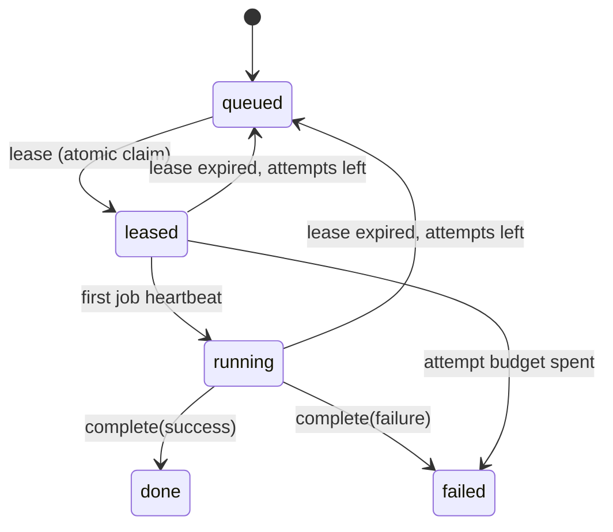

# Fleet

**Fleet** is the registry of machines that belong to you — the [Desktop App](./desktop-app.md) on your laptop, a headless node on a box you own, or the nodes of a Kubernetes cluster you configured. It is how the platform knows what compute you have, without you opening a port.

:::info Status: enrollment, the lease channel and the node worker are shipped

Shipped: enrollment, heartbeats, the registry and the **Settings → Fleet** page; the node worker host (`ever-works-node start --work`); the three job-lease endpoints under `/api/fleet/jobs/*`; the expired-lease reclaim (inline on every lease poll, plus a five-minute cron); the `job-runtime-node` provider that makes the fleet a selectable [job runtime](./job-runtimes.md); per-Agent node affinity; and the drain / rotate / revoke controls. Fleet is a scheduling target, not just an inventory.

Verify before you rely on it: **live scheduling behaviour on your own deployment.** Two things are worth checking on a real install before you route production work at your machines — that `EVER_WORKS_JOB_RUNTIME=node` (or an organization overlay) is actually in force, and that the node you enrolled advertises every capability tag the jobs you enqueue require. A node that advertises nothing is eligible only for work that names no requirements.

Not yet built: **a UI for node affinity.** Pinning an Agent to a specific machine is API-only today — there is no picker on the Agent page. Everything else on this page has a screen.

:::

## Two kinds of node

| Kind           | How it appears                                                           | `persisted` |
| -------------- | ------------------------------------------------------------------------ | ----------- |
| `desktop-node` | The Desktop App, enrolled with a one-time token.                         | `true`      |
| `node`         | A headless node app, enrolled the same way.                              | `true`      |
| Cluster nodes  | Nodes of _your own_ configured cluster, merged in live and never stored. | `false`     |

Cluster nodes are read live from the cluster you configured; the platform's own managed cluster is excluded by a sentinel so you never see infrastructure that is not yours.

Enrolled nodes go **offline** after five minutes without a heartbeat.

## Enrolling a node

Enrollment is outbound-only: the node calls the platform, never the other way round. Nothing needs to be reachable from the internet.

1. **Mint a token** — **Settings → Fleet → Add node**, or

    ```
    POST /api/fleet/nodes/enrollment-token   { "name": "Mac mini", "kind": "node" }
    → { node, token, expiresInSec }
    ```

    The token is shown **exactly once** and only its SHA-256 is stored. It is single-use and expires in 15 minutes.

2. **Hand it to the node** — the node app calls the public route with the token as its credential:

    ```
    POST /api/fleet/enroll   { "token": "…", "platform": "linux/x64",
                               "version": "1.0.0", "capabilities": ["terminal","workspace"] }
    → { nodeId, secret, node }
    ```

    The heartbeat `secret` is likewise returned exactly once and stored only as a hash.

3. **The node reports in** — periodically:

    ```
    POST /api/fleet/heartbeat   { "nodeId": "…", "secret": "…", "capabilities": [...] }
    → { ok: true, node }
    ```

    Last-seen is **server-stamped**; a node never supplies its own clock.

Every invalid credential path — unknown token, expired token, already-consumed token, unknown node, wrong secret — answers one undifferentiated `401`. The response never says which check failed.

## Managing nodes

```
GET    /api/fleet/nodes        list mine (enrolled + live own-cluster)
PATCH  /api/fleet/nodes/:id    { name?, disabled? }
DELETE /api/fleet/nodes/:id    remove the registration
```

**Disabling drains.** A disabled node's heartbeats stop being accepted, so it goes quiet immediately rather than at the next sweep. Re-enabling puts it back to `offline` until its next accepted heartbeat proves it alive. Disabling a node that is still `enrolling` revokes its unused token.

Everything here is owner-scoped: another account's node id is indistinguishable from one that does not exist.

### Drain, rotate, revoke

Four more owner-scoped controls sit on the same registry, all of them on **Settings → Fleet** as well as the API:

| Control               | Endpoint                                  | What it is for                                                                                                                                                                                              |
| --------------------- | ----------------------------------------- | ----------------------------------------------------------------------------------------------------------------------------------------------------------------------------------------------------------- |
| **Drain**             | `POST /api/fleet/nodes/:id/drain`         | Disables the node **and** returns its in-flight claims to the queue, so the work is picked up elsewhere immediately instead of waiting out each lease. `{ "drain": false }` returns the machine to service. |
| **Rotate credential** | `POST /api/fleet/nodes/:id/rotate`        | Mints a replacement one-time enrollment token (shown once) and invalidates the current node secret immediately. The machine must re-enroll.                                                                 |
| **List open tokens**  | `GET /api/fleet/enrollment-tokens`        | The tokens you have minted but nobody has used yet — metadata only; the plaintext is not recoverable.                                                                                                       |
| **Revoke a token**    | `DELETE /api/fleet/enrollment-tokens/:id` | Kills an unused token before anyone enrolls with it. For a machine that is already enrolled, rotate or delete instead.                                                                                      |

Drain disables **first** and requeues second. The order is deliberate: the node loses the ability to lease the instant its status flips, so a claim released a moment later cannot be re-claimed by the very machine you are draining.

`GET /api/fleet/nodes/:id` returns one node with its recent job history and the failed subset of it — which is what the node drawer shows. `GET /api/fleet/runner-status` is the compact "N of M online" feed behind the runner pill in the dashboard header; cluster-sourced nodes are excluded from it, because the platform never leases work onto them.

The whole surface is gated by `FLEET_ENABLED` on the API. When it is off, every `/api/fleet/**` route answers **404**, not 403 — a disabled deployment does not confirm the channel exists. The flag defaults to on.

## Capabilities

A node advertises capability tags (up to 16) such as `terminal`, `workspace` or `docker`. These describe what the node can host.

They are not decoration. Tags decide which work a node is even offered — see [Capability targeting](#capability-targeting) — and the full detected set, plus how to pin tags so heartbeats stop overwriting them, is in [The tags a node reports](#the-tags-a-node-reports).

## How work reaches a node

An enrolled node **pulls**. It polls the platform for work over the same outbound-only HTTP channel it already uses for heartbeats, executes what it claims, and posts the verdict back. Nothing ever connects _in_ to your machine, and no port is opened.

| Endpoint                             | What it does                                                                                                                 |
| ------------------------------------ | ---------------------------------------------------------------------------------------------------------------------------- |
| `POST /api/fleet/jobs/lease`         | Claim up to five queued jobs, filtered by capability tags. A node with nothing to do gets `{ "jobs": [] }` — never an error. |
| `POST /api/fleet/jobs/:id/heartbeat` | Extend the claim. The first beat also acknowledges it, moving the job from `leased` to `running`.                            |
| `POST /api/fleet/jobs/:id/complete`  | Report the terminal outcome — `{ success: true, result }` or `{ success: false, error }`.                                    |

All three are public routes authenticated by the `(nodeId, secret)` pair in the body — the same secret minted at enrollment, checked constant-time against its stored SHA-256. Every invalid path (unknown node, disabled node, wrong secret, someone else's job, an already-terminal job) collapses to one undifferentiated `401`, so a caller holding a random UUID cannot enumerate which nodes and jobs exist.



**A lease is a deadline, not a lock.** Claiming is a conditional update pinned to `status = 'queued'`, so two nodes racing the same row produce exactly one winner; heartbeat and complete pin both the node id and the active statuses, so a node can never extend or finish another node's job. If your laptop sleeps mid-job, nothing has to notice — `leaseExpiresAt` passes and the work returns to the pool.

Reclaim runs in two places, on purpose:

- **Inline, on every lease poll** — owner-scoped and bounded. A healthy node picks up its dead sibling's work on the very next poll.
- **On a cron every five minutes** (`fleet-job-lease-sweeper`) — for the case inline reclaim structurally cannot cover: a fleet where _every_ node went away. Against the default five-minute lease TTL, the worst-case detection lag is `leaseTtl + 5min`.

A **reported** failure is recorded as failed and is _not_ auto-retried. Only a lapsed lease — no verdict at all — goes back to the pool, and only while the attempt budget lasts.

### Capability targeting

Enqueued jobs may carry tags prefixed `cap:`, and those become **scheduling requirements**: a node may only lease a job whose every required tag is present in its own advertised set. Ordinary tags are labels and never narrow eligibility, so an observability tag cannot accidentally strand a job on zero nodes. A node advertising no tags at all is eligible only for work that names no requirements.

Lease TTL is requested by the node and clamped by the platform — **30 seconds minimum, 5 minutes default, 1 hour maximum** — with at most **five** jobs per lease call.

### What a node can actually run

The worker host resolves an executor by the job's `kind`. Three are registered today:

| Kind                | What it does                                                                                                                                                                                                                                      |
| ------------------- | ------------------------------------------------------------------------------------------------------------------------------------------------------------------------------------------------------------------------------------------------- |
| `acceptance-checks` | Runs a Task's dispatch-frozen [acceptance checks](./quality-gates.md) in a workspace on this machine and reports each exit code, with the platform's own verdict rules.                                                                           |
| `agent-task`        | Executes a Task's agent run on this machine — the command-shaped path behind the `node` [job runtime](./job-runtimes.md), with the workspace provisioned locally.                                                                                 |
| `browser-check`     | Drives the machine's real browser against a URL in a throwaway profile and reports what it rendered. Registered **only** on a node that actually resolved a browser executable, so the `browser` tag and the executor switch on by the same fact. |

A leased job of any other kind is completed as a failure that names the kind, rather than dropped to expire and retry forever on the same incapable machine.

Check subprocesses get an environment built **from scratch**, never the inherited one: a check command is user-authored input running on somebody's real machine, so the allow-list covers toolchain discovery and locale only, secret-shaped names are dropped, and the node's own `FLEET_*` credential namespace can never be granted even by an explicit passthrough.

## The node CLI

`ever-works-node` is the headless node: a CLI and a long-running service. It enrolls this machine, keeps it visible in Fleet with a heartbeat, and — only when you ask for it with `--work` — leases and executes platform work on it.

| Command                                                  | What it does                                                                                                                        |
| -------------------------------------------------------- | ----------------------------------------------------------------------------------------------------------------------------------- |
| `ever-works-node enroll --api-url <url> --token <token>` | Consumes the one-time token from **Settings → Fleet** and writes the local config; the credential goes to the OS keychain.          |
| `ever-works-node start [--work] [-c <count>]`            | Runs the heartbeat loop until `SIGINT`/`SIGTERM`. With `--work`, also runs the worker host: lease → execute → report.               |
| `ever-works-node pause` / `resume`                       | Drain and undrain this machine. Pausing stops leasing immediately and lets in-flight jobs finish and report — it is not a kill.     |
| `ever-works-node unenroll`                               | Retires the machine: deletes the platform registration, then erases the local credential.                                           |
| `ever-works-node status`                                 | Prints the local enrollment — where the credential is stored, and whether the node is paused. The credential itself is never shown. |
| `ever-works-node capabilities`                           | Prints the tags this machine would report, without enrolling.                                                                       |
| `ever-works-node clear-quarantine`                       | Clears a persisted unsafe-worker state, after you have verified every prior process tree is stopped.                                |

`--work` is opt-in on purpose: **enrolling a machine and letting it run the owner's commands are two different consents.** A paused node keeps heartbeating, too — a drained machine that vanished from Fleet would be indistinguishable from a dead one.

Useful flags: `-i, --heartbeat-interval <seconds>` (cadence, default 60s), `-c, --concurrency <count>` (jobs at once), `--max-cpu <percent>` and `--max-memory <mb>` (refuse new work while the host is above a ceiling), `--capabilities <tags>` (offer a narrower set than was detected), and `--local-only` on `pause` / `resume` / `unenroll` for a machine being drained or decommissioned offline. Exit codes are `0` ok, `1` failure, `3` not enrolled — so provisioning scripts can branch on them.

### Enroll a machine end to end

1. In the dashboard, open **Settings → Fleet** (`/settings/fleet`) and click **Add node**.
2. Name the machine, pick **Headless node** (or **Desktop node**), and click **Issue token**. The token is shown exactly once and expires in 15 minutes.
3. The handoff panel hands you the ready-made command under **Or run this on the machine** — plus a QR code and a downloadable config file. Run it on the target box:

    ```bash
    ever-works-node enroll --api-url https://api.ever.works --token <token>
    ```

4. Start the node. Heartbeat only, to see it appear in Fleet:

    ```bash
    ever-works-node start
    ```

    Or heartbeat **and** take work, two jobs at a time:

    ```bash
    ever-works-node start --work --concurrency 2
    ```

5. The row turns **Online** after the first heartbeat, showing the platform, capability tags, Agent CLI version, free disk and current load (**Idle** or _N_ running).
6. To take the machine out of rotation later, run `ever-works-node pause` on it or click **Drain** in its Fleet row. To retire it: `ever-works-node unenroll`.

### Where the credential lives

| Platform | Config file                                                          |
| -------- | -------------------------------------------------------------------- |
| Windows  | `%APPDATA%\ever-works-node\node-config.json`                         |
| macOS    | `~/Library/Application Support/ever-works-node/node-config.json`     |
| Linux    | `$XDG_CONFIG_HOME/ever-works-node/node-config.json` (or `~/.config`) |

`EVER_WORKS_NODE_CONFIG` overrides the path entirely. Where an OS keychain exists (macOS Keychain, Windows Credential Manager, Linux Secret Service) the heartbeat secret is stored **there**, and the file records only `"secretStorage": "keychain"`. On headless servers and in containers it falls back into the file and says so loudly, on every load and every save. Either way the file is locked to its owner: mode `0600` on POSIX, an inheritance-stripped owner-only ACL on Windows. `EVER_WORKS_NODE_DISABLE_KEYCHAIN=1` forces the file fallback — the container image sets it, because a container never has a keychain and a surprise warning is worse than a declared choice.

### The tags a node reports

Tags are detected at enroll and **re-detected on every heartbeat**, so installing Docker or Git on a running node shows up in Fleet without a restart: `os:<platform>`, `arch:<arch>`, `node:<major>`, `terminal`, `workspace`, plus `docker`, `git`, `display`, `browser`, `gpu` and `gpu:<vendor>` when present. They are normalized with the same rules the server applies, so what the node reports is exactly what Fleet stores.

Two rules govern what may appear. **A tag is a promise the node can keep** — `browser` is emitted only when a browser executable was actually resolved, the same path `browser-check` will spawn. And **detection never fails the beat** — a missing tool is a missing tag, not a missing heartbeat. `EVER_WORKS_NODE_BROWSER` pins the executable explicitly; a pinned path that does not exist disables the tag rather than falling through to some other browser.

You can also hand-edit a node's tags under **Settings → Fleet → Capability tags**. Editing them hands you ownership: the set is marked **Pinned** and the node's heartbeats stop overwriting it.

### Running it unattended

`ever-works-node start` is a foreground process. The repo ships three ways to keep it alive across reboots — a systemd template unit (`ever-works-node@<user>.service`, which runs as the user whose commands the node executes, not root), a Windows service or scheduled task, and a container image. Enrollment is never part of installation: it consumes a one-time token and stays an explicit, interactive act.

:::note Build it yourself for now
`ever-works-node` is not published to npm yet, and the Fleet handoff panel says as much: "Node app downloads ship in an upcoming release." Build it from a monorepo checkout with `pnpm build:node` — the app is deliberately excluded from the default root build — or build the desktop node shell with `pnpm build:desktop-node`, the Electron packaging of the same shared core, with a setup wizard, a status window, a tray and auto-start.
:::

## Pinning an Agent to a machine

By default an [Agent](./agents.md)'s work may go to **any** eligible node you own. **Node affinity** pins one Organization Agent to one specific machine — the workstation with the right toolchain, the box that already holds the checkout, the GPU node.

```
GET    /api/fleet/agents/:agentId/node-affinity   → the selected node, or null
PUT    /api/fleet/agents/:agentId/node-affinity   { "nodeId": "…" }
DELETE /api/fleet/agents/:agentId/node-affinity   back to "any of my nodes"
```

How it behaves:

- **Enqueue time is what counts.** The pin is resolved when an `agent-task` job is written and stamped onto the row as its target node. Only that node may claim it — a lease from any other machine skips the job.
- **Clearing is idempotent, and does not rewrite history.** Jobs already queued keep the node they were enqueued for; only future jobs become unbound.
- **Nodes stay user-owned; only the binding is Organization-scoped.** Setting an affinity requires an active [Organization](./organizations.md), and both the Agent and the node must be yours — a foreign or unknown id answers `404`, whether or not a binding exists.

:::caution API-only today
There is no node picker on the Agent page. Set, read and clear affinity through the endpoints above, the [REST API](../api/index.md) or an [MCP](./mcp-server.md) client until the UI lands.
:::

## Choosing where runs execute

Having machines is one decision; preferring them is another. **Settings → Fleet → Execution routing** decides where runs go once you have runners enrolled:

| Mode             | Label on the screen                   | Behaviour                                                                                                                  |
| ---------------- | ------------------------------------- | -------------------------------------------------------------------------------------------------------------------------- |
| `local-wait`     | Local runner (wait for a free slot)   | Always runs on your fleet. If every runner is busy or offline, the run waits in the queue instead of moving to the cloud.  |
| `local-fallback` | Local runner (cloud fallback allowed) | Prefers your fleet, but runs in the cloud when no runner can take the work — and you get a notification when that happens. |
| `cloud`          | Cloud                                 | Always uses the platform runtime, even when a local runner is free.                                                        |

Preferences are scoped, and **the narrowest wins**: an account-wide default, overridden per [Work](./creating-a-work.md) or per [Goal](./goals.md).

```
GET    /api/fleet/execution-preferences                        every preference you have set
PUT    /api/fleet/execution-preference   { scopeType, scopeId, mode }
DELETE /api/fleet/execution-preference?scopeType=…&scopeId=…   inherit from the next scope out
```

A routing decision that _throws_ falls back to the platform dispatcher rather than failing the dispatch: deciding where to run is infrastructure, and an infrastructure hiccup must not cost you a run. Only the fallback case notifies — a run that asked to be local and ended up in the cloud is a changed outcome its owner has to be able to see, whereas a tenant that never wanted the fleet has nothing to be told.

Which runtime the fleet _is_, and the operator kill switch `FLEET_NODE_RUNTIME_ENABLED`, are covered in [Job Runtimes](./job-runtimes.md).

## Related

- [Desktop App](./desktop-app.md) · [Workers](./workers.md) · [Kubernetes Deployment](./k8s-deployment.md)
- [Job Runtimes](./job-runtimes.md) · [Agents](./agents.md) · [Tasks](./tasks.md) · [Quality Gates](./quality-gates.md)
- [Task Isolation](./task-isolation.md) · [Agent Terminals](./agent-terminals.md) · [Sessions & Steering](./sessions-and-steering.md)
