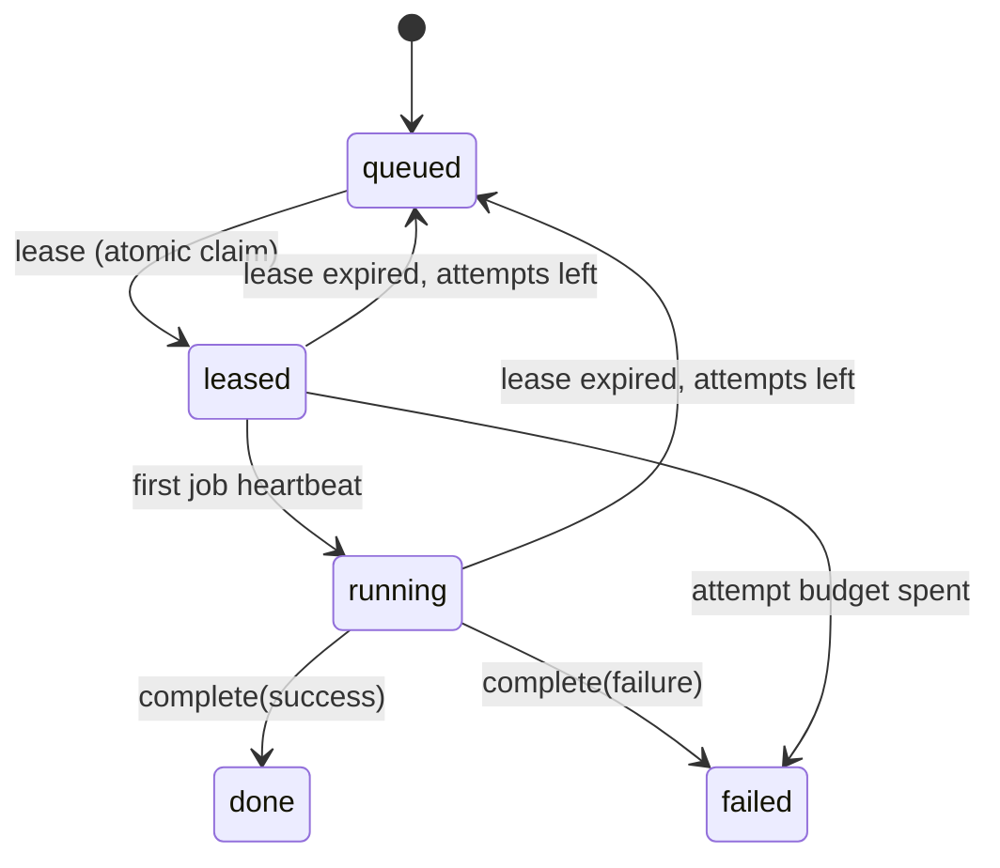

# Fleet

**Fleet** is the registry of machines that belong to you — the [Desktop App](./desktop-app.md) on your laptop, a headless node on a box you own, or the nodes of a Kubernetes cluster you configured. It is how the platform knows what compute you have, without you opening a port.

:::info Status: enrollment, the lease channel and the node worker are shipped

Shipped: enrollment, heartbeats, the registry and the **Settings → Fleet** page; the node worker host (`ever-works-node start --work`); the three job-lease endpoints under `/api/fleet/jobs/*`; the expired-lease reclaim (inline on every lease poll, plus a five-minute cron); the `job-runtime-node` provider that makes the fleet a selectable [job runtime](./job-runtimes.md); per-Agent node affinity; and the drain / rotate / revoke controls. Fleet is a scheduling target, not just an inventory.

Verify before you rely on it: **live scheduling behaviour on your own deployment.** Two things are worth checking on a real install before you route production work at your machines — that `EVER_WORKS_JOB_RUNTIME=node` (or an organization overlay) is actually in force, and that the node you enrolled advertises every capability tag the jobs you enqueue require. A node that advertises nothing is eligible only for work that names no requirements.

Not yet built: **a UI for node affinity.** Pinning an Agent to a specific machine is API-only today — there is no picker on the Agent page. Everything else on this page has a screen.

:::

## Two kinds of node

| Kind           | How it appears                                                           | `persisted` |
| -------------- | ------------------------------------------------------------------------ | ----------- |
| `desktop-node` | The Desktop App, enrolled with a one-time token.                         | `true`      |
| `node`         | A headless node app, enrolled the same way.                              | `true`      |
| Cluster nodes  | Nodes of _your own_ configured cluster, merged in live and never stored. | `false`     |

Cluster nodes are read live from the cluster you configured; the platform's own managed cluster is excluded by a sentinel so you never see infrastructure that is not yours.

Enrolled nodes go **offline** after five minutes without a heartbeat.

## Enrolling a node

Enrollment is outbound-only: the node calls the platform, never the other way round. Nothing needs to be reachable from the internet.

0. **Install the node app** — `npm install -g ever-works-node` (Node.js ≥ 22). It is a single-file bundle published from `apps/node`; the unattended-run scripts (systemd unit, Windows service/scheduled-task installer) ship inside the package under `packaging/`.

1. **Mint a token** — **Settings → Fleet → Add node**, or

    ```
    POST /api/fleet/nodes/enrollment-token   { "name": "Mac mini", "kind": "node" }
    → { node, token, expiresInSec }
    ```

    The token is shown **exactly once** and only its SHA-256 is stored. It is single-use and expires after `FLEET_ENROLLMENT_TOKEN_TTL_MS` (default 15 minutes, floor 30s). That one setting is the _only_ source of the expiry: the number the mint route reports, the number the outstanding-token list shows and the number `enroll` validates against are all read from it, so an operator can never be shown an expiry the validator does not use.

2. **Hand it to the node** — the node app calls the public route with the token as its credential:

    ```
    POST /api/fleet/enroll   { "token": "…", "platform": "linux/x64",
                               "version": "1.0.0", "capabilities": ["terminal","workspace"] }
    → { nodeId, secret, node }
    ```

    The heartbeat `secret` is likewise returned exactly once and stored only as a hash.

3. **The node reports in** — periodically:

    ```
    POST /api/fleet/heartbeat   { "nodeId": "…", "secret": "…", "capabilities": [...] }
    → { ok: true, node }
    ```

    Last-seen is **server-stamped**; a node never supplies its own clock.

Every invalid credential path — unknown token, expired token, already-consumed token, unknown node, wrong secret — answers one undifferentiated `401`. The response never says which check failed.

## Managing nodes

```
GET    /api/fleet/nodes              list mine (enrolled + live own-cluster), each with its current load
GET    /api/fleet/nodes/:id          one node + its recent job history (and the failed subset)
PATCH  /api/fleet/nodes/:id          { name?, disabled?, paused?, capabilities?, capabilitiesPinned? }
POST   /api/fleet/nodes/:id/drain    { drain } — drain / return to service, requeuing in-flight claims
POST   /api/fleet/nodes/:id/rotate   re-key the node; the replacement token is returned exactly once
GET    /api/fleet/nodes/:id/audit    ?limit — this node's lifecycle trail (actor, time, before/after)
DELETE /api/fleet/nodes/:id          remove the registration
```

The **node drawer** on the Fleet page (the details action on a row) renders the same job history: each job's kind, status, **reconciled outcome and its reason**, attempt count, queued reason, queued / started / completed times and duration, filterable by **All / Failed / Running**. It also shows the node's **worker state** (see [Health signals](#health-signals)). It never renders a job's `payload` — the endpoint sends it as `null` and hands the drawer the task / run / agent ids instead.
**Every lifecycle write is audited.** Enroll, rotate, revoke, rename, capability edits, cost ceilings, pause, disable, drain, delete, unenroll, execution-preference writes and agent-node affinity writes each record one `fleet_audit` row carrying the actor, the time, the node and a before/after of what changed. The actor is the OWNER for an operator action, `null` for a system one (a cost-ceiling drain is the system's decision, not the sleeping owner's) and `null` for anything the machine did to itself (enroll, self-pause, self-unenroll, self-rotate). Heartbeats are deliberately not audited — one row per node per 30s buries the rows an operator came to read.

**No audit row ever contains a credential.** The scrub lives in the single writer, not at the call sites: any key naming a secret, token, credential or hash loses its value, and every surviving string goes through the same secret scanner node-reported text does. Act first, then audit — a failed audit row is logged and reported, never a reason to undo the action it was recording.

The **node drawer** on the Fleet page (the details action on a row) renders the same job history: each job's kind, status, attempt count, queued reason, queued / started / completed times and duration, filterable by **All / Failed / Running**.

**Disabling drains.** A disabled node's heartbeats stop being accepted, so it goes quiet immediately rather than at the next sweep. Re-enabling puts it back to `offline` until its next accepted heartbeat proves it alive. Disabling a node that is still `enrolling` revokes its unused token.

Everything here is owner-scoped: another account's node id is indistinguishable from one that does not exist.

### Drain, rotate, revoke

Four more owner-scoped controls sit on the same registry, all of them on **Settings → Fleet** as well as the API:

| Control               | Endpoint                                  | What it is for                                                                                                                                                                                              |
| --------------------- | ----------------------------------------- | ----------------------------------------------------------------------------------------------------------------------------------------------------------------------------------------------------------- |
| **Drain**             | `POST /api/fleet/nodes/:id/drain`         | Disables the node **and** returns its in-flight claims to the queue, so the work is picked up elsewhere immediately instead of waiting out each lease. `{ "drain": false }` returns the machine to service. |
| **Rotate credential** | `POST /api/fleet/nodes/:id/rotate`        | Mints a replacement one-time enrollment token (shown once) and invalidates the current node secret immediately. The machine must re-enroll.                                                                 |
| **List open tokens**  | `GET /api/fleet/enrollment-tokens`        | The tokens you have minted but nobody has used yet — metadata only; the plaintext is not recoverable.                                                                                                       |
| **Revoke a token**    | `DELETE /api/fleet/enrollment-tokens/:id` | Kills an unused token before anyone enrolls with it. For a machine that is already enrolled, rotate or delete instead.                                                                                      |

Drain disables **first** and requeues second. The order is deliberate: the node loses the ability to lease the instant its status flips, so a claim released a moment later cannot be re-claimed by the very machine you are draining.

`GET /api/fleet/nodes/:id` returns one node with its recent job history and the failed subset of it — which is what the node drawer shows. `GET /api/fleet/runner-status` is the compact "N of M online" feed behind the runner pill in the dashboard header; cluster-sourced nodes are excluded from it, because the platform never leases work onto them.

The whole surface is gated by `FLEET_ENABLED` on the API. When it is off, every `/api/fleet/**` route answers **404**, not 403 — a disabled deployment does not confirm the channel exists. The flag defaults to on.

## Health signals

`status` is what the platform can INFER from heartbeats. It cannot answer "will this machine actually take my job" — a node that has self-quarantined keeps heartbeating (that is what makes a quarantine observable instead of a blackout), so it reads `online` while refusing every lease. Before these signals, that machine looked healthy and idle, its owner was told nothing, and under the recommended `local-wait` routing there was no cloud fallback to quietly cover for it.

### Worker state

Every heartbeat now carries what the node's **worker** is doing, alongside the registry status:

| Worker state  | The node reports it when                                                                  |
| ------------- | ----------------------------------------------------------------------------------------- |
| `idle`        | polling, ready to take work                                                               |
| `working`     | at least one job in flight                                                                |
| `paused`      | drained on purpose — an operator pause, or draining the last in-flight jobs before a stop |
| `quarantined` | the fail-closed stop the node imposed on ITSELF; only clearable at that machine           |
| `throttled`   | over a resource ceiling (CPU / memory, disk floor): keeps its jobs, leases no more        |

`workerStateReason` carries the sentence that explains it — the quarantine's own message, the ceiling that was crossed — and `workerStateChangedAt` moves only on a TRANSITION, so "quarantined since 03:14" survives the hundreds of beats that follow. A node that has never reported one shows **unknown**, never `idle`: a fabricated readiness for a machine nobody has heard from is the thing these signals exist to end.

Two properties are load-bearing and deliberately awkward:

- **The field is a string on the wire, not an enum.** The heartbeat DTO runs under `whitelist + forbidNonWhitelisted`, so a value an older API rejects fails the whole request — and a failed heartbeat is a node that sweeps to `offline`. A node newer than the platform must be able to report a state this build has never heard of and stay alive; the server normalizes anything unrecognised to "unknown" rather than trusting it.
- **The node tolerates an older platform.** If a heartbeat carrying the worker state comes back `400`, the daemon retries once immediately without those two fields; if that succeeds it logs once, keeps reporting liveness, and stops sending them until it restarts.

The drawer judges a job FAILED on the reconciled run outcome — the badge, the **Failed** filter chip and the endpoint’s `failures` subset all use the same rule, so a job the node called `done` whose run failed appears in all three.

Availability counts a node as **free** only when its worker state is not `quarantined`, `throttled` or `paused`. It stays counted as ONLINE — the operator must keep seeing it — but the run router no longer places work on a machine that will refuse it.

### Inbox notices

Three notices, each filed **exactly once per event** and re-armed when the node recovers:

| Notice                     | Fired by                                                             | Re-armed by                            |
| -------------------------- | -------------------------------------------------------------------- | -------------------------------------- |
| `Fleet node offline`       | the heartbeat-expiry sweep, on the flip to offline                   | the next accepted heartbeat            |
| `Fleet node still offline` | the sweep, once the node has been gone longer than the notice window | the next accepted heartbeat            |
| `Fleet node quarantined`   | the first heartbeat reporting `quarantined`                          | the first beat reporting anything else |

Each names the node, its kind, the reason where there is one, and when it was last seen. The dedup markers live on the `fleet_nodes` row (`offlineNoticedAt`, `offlineLongNoticedAt`, `quarantineNoticedAt`) and are claimed by a conditional UPDATE, so two API replicas sweeping the same owner produce one notice rather than two.

The sweep is piggybacked on owner-scoped list reads (there is no cron): the runner pill polls it every 30 seconds while a dashboard is open, and a dispatch triggers it too. An owner with no open page and no dispatch gets the notice on their next visit rather than at the moment of the outage.

### Knobs

| Env                                  | Default | Meaning                                                        |
| ------------------------------------ | ------- | -------------------------------------------------------------- |
| `FLEET_NODE_OFFLINE_AFTER_MS`        | 5 min   | silence after which an `online` node sweeps to `offline`       |
| `FLEET_NODE_OFFLINE_NOTICE_AFTER_MS` | 30 min  | how long a node stays offline before the second, louder notice |

The notice window is floored at the sweep window: an escalation that could fire before the node is even considered offline would be two notices for one event.

### Removing a node takes its pins with it

Deleting a node deletes its `fleet_agent_node_affinities` rows — the durable "run this Agent on THAT machine" pins — in the same transaction. Left behind, they kept resolving: `FleetJobService.enqueue` stamped `targetNodeId` with a machine that no longer existed and the job sat queued forever, pinned to a ghost. Historical `fleet_jobs` rows are untouched; deleting a machine must not delete the record of what it did.

## Panic controls

Every control above is per node. Stopping six autonomous machines at 2am must not mean six drain calls or an ArgoCD sync, so three controls exist that act on the whole fleet — and they are three **different decisions**, kept on three different routes on purpose.

```
POST   /api/fleet/drain-all           owner: disable EVERY node I own, requeue their in-flight claims
POST   /api/fleet/cancel-in-flight    owner: { includeQueued? } cancel my running fleet jobs + their agent runs
POST   /api/fleet/rotate-all          owner: QUEUE a credential rotation on every node I own
GET    /api/fleet/kill-switch         any session: is the platform-wide stop flag set?
POST   /api/fleet/kill-switch/stop    platform admin: { reason? } set the stop flag
POST   /api/fleet/kill-switch/clear   platform admin: clear it and resume the runs it parked
GET    /api/fleet/kill-switch/audit   platform admin: ?limit — recent audit rows (actor + time)
```

**Drain all** is the per-node drain applied to every enrolled node you own (nodes still enrolling or already disabled are skipped). Nothing is cancelled: the work goes back to the queue and waits for a node that may take it. The Fleet page carries it under **Panic controls**.

**Cancel in-flight** is the explicit second step. It cancels every leased / running fleet job you own and the agent run behind each (run row first, then the job, the same order the per-run cancel uses). A node learns of it through its next refused heartbeat, so this is "cancel requested", not an instant kill — a job that is about to finish may still report. `includeQueued: true` extends it to queued jobs nothing has started. It is never implied by draining, and never by the stop flag.

**The global stop flag** is a DB-backed switch (`fleet_kill_switch`, one row) checked at three points before any new unit of work can start: the run dispatch gate (every new agent run is parked with `queuedReason: kill-switch`), the fleet run router (a run that reaches routing is refused, never sent to the cloud instead) and every lease request (a node polling for work gets an empty batch). Running work keeps running and keeps reporting; heartbeats and completions are not gated, so a stopped fleet can still settle. **Reads fail closed**: a flag that cannot be read — missing row, unreachable database — counts as set, and the Fleet page banner says so distinctly (`unverified`) so nobody goes looking for who threw the switch. Clearing the flag resumes the parked runs (bounded, best effort; runs without a Work wait for their schedule's next tick), and runs parked by the flag are exempt from the stuck-run sweeper for as long as it is set. Every set and clear, every drain-all and every cancel-in-flight writes one `fleet_audit` row with the actor and the time.

Setting and clearing the flag is a platform-admin operation (`User.isPlatformAdmin`); there is no button for it on the owner's Fleet page, only the banner. `FLEET_NODE_RUNTIME_ENABLED` is **not** a panic control: it is a routing selector, and work it turns away from the fleet runs in the cloud instead.

## Rotating credentials without visiting the machine

The operator re-key (`POST /api/fleet/nodes/:id/rotate`) kills the old secret the instant it replaces the hash. That is the right behaviour when a credential is believed **compromised** — but it also puts the node back to `enrolling` and requires a human at that keyboard to type a token that expires in 15 minutes. Across six machines on six desks, that is a ceremony nobody performs, which is why credentials never rotated.

The routine path is the node rotating **itself**:

```
POST /api/fleet/rotate-credential   { "nodeId": "…", "secret": "<the current secret>" }
→ { ok: true, nodeId, secret, previousCredentialExpiresAt, overlapSec, node }
```

- The node presents the credential it is **already using** and gets a new one back, exactly once.
- Its status is untouched — it stays `online` (or `paused`/`disabled`) straight through the rotation, so nothing goes dark.
- For `FLEET_CREDENTIAL_ROTATION_OVERLAP_MS` (default 15 minutes, floor 30s, ceiling 24h) **both** credentials authenticate, everywhere: heartbeat, self-pause/unenroll, the job lease/report channel and the `/api/fleet/jobs/*` edge guard all consult one shared matcher. That window is what lets a daemon finish the job it is holding, write the new secret to disk and restart before the old one dies.
- The window closes on a **clock**, not a callback. A node that never comes back still loses its old credential on time; there is no confirmation step and no sweeper to fail.

Rotation fails closed. The request must present the **current** credential — a rotate offered the previous-window one is a replay and is refused, or a captured old secret could renew itself forever. A node still `enrolling` is refused (its hash column holds a token, not a secret), a second rotation while a window is open is refused, and the write is a compare-and-set on the presented hash so the loser of two simultaneous rotations is refused rather than left holding a secret the row no longer knows. Every refusal is the same undifferentiated `401`.

**Fleet-wide, without six keyboards:**

```
POST /api/fleet/rotate-all   → { queuedNodes, skippedNodes, nodes, auditFailed }
```

This **queues**: it marks every enrolled node of the account (those still `enrolling` are skipped — revoke their unused token instead) and mints nothing. Each machine learns of it from `rotationRequested: true` on its next heartbeat response and calls `/api/fleet/rotate-credential` itself. The field is additive, so a daemon built before it existed simply ignores it and keeps working; its owner can still re-key it the old way. One `fleet_audit` row records the decision — `rotate-all`, with the actor, the count and the node ids — and each machine's own rotation records a `node.rotate-self` row when it happens.

The plaintext secret exists in exactly three places and never a fourth: in the response body (once), in the node's own storage, and as a SHA-256 in `fleet_nodes`. It is not logged, and the audit row carries only timestamps, ids and the overlap duration — the writer additionally drops the value of any field whose name mentions a secret, token, credential or hash, so a call site that passed one by accident still could not store it.
None of these help when the break is in the protocol itself — when the platform the nodes talk to is the thing that stopped working. That case has its own runbook, written to be followed with no working fleet at all: [Fleet break-glass](../runbooks/FLEET_BREAK_GLASS.md).

## Capabilities

A node advertises capability tags (up to 16) such as `terminal`, `workspace` or `docker`. These describe what the node can host.

They are not decoration. Tags decide which work a node is even offered — see [Capability targeting](#capability-targeting) — and the full detected set, plus how to pin tags so heartbeats stop overwriting them, is in [The tags a node reports](#the-tags-a-node-reports).

## How work reaches a node

An enrolled node **pulls**. It polls the platform for work over the same outbound-only HTTP channel it already uses for heartbeats, executes what it claims, and posts the verdict back. Nothing ever connects _in_ to your machine, and no port is opened.

| Endpoint                             | What it does                                                                                                                 |
| ------------------------------------ | ---------------------------------------------------------------------------------------------------------------------------- |
| `POST /api/fleet/jobs/lease`         | Claim up to five queued jobs, filtered by capability tags. A node with nothing to do gets `{ "jobs": [] }` — never an error. |
| `POST /api/fleet/jobs/:id/heartbeat` | Extend the claim. The first beat also acknowledges it, moving the job from `leased` to `running`.                            |
| `POST /api/fleet/jobs/:id/complete`  | Report the terminal outcome — `{ success: true, result }` or `{ success: false, error }`.                                    |

All three are public routes authenticated by the `(nodeId, secret)` pair in the body — the same secret minted at enrollment, checked constant-time against its stored SHA-256. Every invalid path (unknown node, disabled node, wrong secret, someone else's job, an already-terminal job) collapses to one undifferentiated `401`, so a caller holding a random UUID cannot enumerate which nodes and jobs exist.



**A lease is a deadline, not a lock.** Claiming is a conditional update pinned to `status = 'queued'`, so two nodes racing the same row produce exactly one winner; heartbeat and complete pin both the node id and the active statuses, so a node can never extend or finish another node's job. If your laptop sleeps mid-job, nothing has to notice — `leaseExpiresAt` passes and the work returns to the pool.

Reclaim runs in two places, on purpose:

- **Inline, on every lease poll** — owner-scoped and bounded. A healthy node picks up its dead sibling's work on the very next poll.
- **On a cron every five minutes** (`fleet-job-lease-sweeper`) — for the case inline reclaim structurally cannot cover: a fleet where _every_ node went away. Against the default five-minute lease TTL, the worst-case detection lag is `leaseTtl + 5min`.

A **reported** failure is recorded as failed and is _not_ auto-retried. Only a lapsed lease — no verdict at all — goes back to the pool, and only while the attempt budget lasts.

### Capability targeting

Enqueued jobs may carry tags prefixed `cap:`, and those become **scheduling requirements**: a node may only lease a job whose every required tag is present in its own advertised set. Ordinary tags are labels and never narrow eligibility, so an observability tag cannot accidentally strand a job on zero nodes. A node advertising no tags at all is eligible only for work that names no requirements.

Lease TTL is requested by the node and clamped by the platform — **30 seconds minimum, 5 minutes default, 1 hour maximum** — with at most **five** jobs per lease call.

### What a node can actually run

The worker host resolves an executor by the job's `kind`. Three are registered today:

| Kind                | What it does                                                                                                                                                                                                                                      |
| ------------------- | ------------------------------------------------------------------------------------------------------------------------------------------------------------------------------------------------------------------------------------------------- |
| `acceptance-checks` | Runs a Task's dispatch-frozen [acceptance checks](./quality-gates.md) in a workspace on this machine and reports each exit code, with the platform's own verdict rules.                                                                           |
| `agent-task`        | Executes a Task's agent run on this machine — the command-shaped path behind the `node` [job runtime](./job-runtimes.md), with the workspace provisioned locally.                                                                                 |
| `browser-check`     | Drives the machine's real browser against a URL in a throwaway profile and reports what it rendered. Registered **only** on a node that actually resolved a browser executable, so the `browser` tag and the executor switch on by the same fact. |

A leased job of any other kind is completed as a failure that names the kind, rather than dropped to expire and retry forever on the same incapable machine.

Check subprocesses get an environment built **from scratch**, never the inherited one: a check command is user-authored input running on somebody's real machine, so the allow-list covers toolchain discovery and locale only, secret-shaped names are dropped, and the node's own `FLEET_*` credential namespace can never be granted even by an explicit passthrough.

## The node CLI

`ever-works-node` is the headless node: a CLI and a long-running service. It enrolls this machine, keeps it visible in Fleet with a heartbeat, and — only when you ask for it with `--work` — leases and executes platform work on it.

| Command                                                  | What it does                                                                                                                        |
| -------------------------------------------------------- | ----------------------------------------------------------------------------------------------------------------------------------- |
| `ever-works-node enroll --api-url <url> --token <token>` | Consumes the one-time token from **Settings → Fleet** and writes the local config; the credential goes to the OS keychain.          |
| `ever-works-node start [--work] [-c <count>]`            | Runs the heartbeat loop until `SIGINT`/`SIGTERM`. With `--work`, also runs the worker host: lease → execute → report.               |
| `ever-works-node pause` / `resume`                       | Drain and undrain this machine. Pausing stops leasing immediately and lets in-flight jobs finish and report — it is not a kill.     |
| `ever-works-node unenroll`                               | Retires the machine: deletes the platform registration, then erases the local credential.                                           |
| `ever-works-node status`                                 | Prints the local enrollment — where the credential is stored, and whether the node is paused. The credential itself is never shown. |
| `ever-works-node capabilities`                           | Prints the tags this machine would report, without enrolling.                                                                       |
| `ever-works-node clear-quarantine`                       | Clears a persisted unsafe-worker state, after you have verified every prior process tree is stopped.                                |

`--work` is opt-in on purpose: **enrolling a machine and letting it run the owner's commands are two different consents.** A paused node keeps heartbeating, too — a drained machine that vanished from Fleet would be indistinguishable from a dead one.

Useful flags: `-i, --heartbeat-interval <seconds>` (cadence, default 60s), `-c, --concurrency <count>` (jobs at once), `--max-cpu <percent>` and `--max-memory <mb>` (refuse new work while the host is above a ceiling), `--capabilities <tags>` (offer a narrower set than was detected), and `--local-only` on `pause` / `resume` / `unenroll` for a machine being drained or decommissioned offline. Exit codes are `0` ok, `1` failure, `3` not enrolled — so provisioning scripts can branch on them.

### Enroll a machine end to end

1. In the dashboard, open **Settings → Fleet** (`/settings/fleet`) and click **Add node**.
2. Name the machine, pick **Headless node** (or **Desktop node**), and click **Issue token**. The token is shown exactly once and expires in 15 minutes.
3. The handoff panel hands you the ready-made command under **Or run this on the machine** — plus a QR code and a downloadable config file. Run it on the target box:

    ```bash
    ever-works-node enroll --api-url https://api.ever.works --token <token>
    ```

4. Start the node. Heartbeat only, to see it appear in Fleet:

    ```bash
    ever-works-node start
    ```

    Or heartbeat **and** take work, two jobs at a time:

    ```bash
    ever-works-node start --work --concurrency 2
    ```

5. The row turns **Online** after the first heartbeat, showing the platform, capability tags, Agent CLI version, free disk and current load (**Idle** or _N_ running).
6. To take the machine out of rotation later, run `ever-works-node pause` on it or click **Drain** in its Fleet row. To retire it: `ever-works-node unenroll`.

### Where the credential lives

| Platform | Config file                                                          |
| -------- | -------------------------------------------------------------------- |
| Windows  | `%APPDATA%\ever-works-node\node-config.json`                         |
| macOS    | `~/Library/Application Support/ever-works-node/node-config.json`     |
| Linux    | `$XDG_CONFIG_HOME/ever-works-node/node-config.json` (or `~/.config`) |

`EVER_WORKS_NODE_CONFIG` overrides the path entirely. Where an OS keychain exists (macOS Keychain, Windows Credential Manager, Linux Secret Service) the heartbeat secret is stored **there**, and the file records only `"secretStorage": "keychain"`. On headless servers and in containers it falls back into the file and says so loudly, on every load and every save. Either way the file is locked to its owner: mode `0600` on POSIX, an inheritance-stripped owner-only ACL on Windows. `EVER_WORKS_NODE_DISABLE_KEYCHAIN=1` forces the file fallback — the container image sets it, because a container never has a keychain and a surprise warning is worse than a declared choice.

### The tags a node reports

Tags are detected at enroll and **re-detected on every heartbeat**, so installing Docker or Git on a running node shows up in Fleet without a restart: `os:<platform>`, `arch:<arch>`, `node:<major>`, `terminal`, `workspace`, plus `docker`, `git`, `git-push`, `display`, `browser`, `gpu` and `gpu:<vendor>` when present. They are normalized with the same rules the server applies, so what the node reports is exactly what Fleet stores.

Two rules govern what may appear. **A tag is a promise the node can keep** — `browser` is emitted only when a browser executable was actually resolved, the same path `browser-check` will spawn. And **detection never fails the beat** — a missing tool is a missing tag, not a missing heartbeat. `EVER_WORKS_NODE_BROWSER` pins the executable explicitly; a pinned path that does not exist disables the tag rather than falling through to some other browser.

`git-push` is the one tag you cannot turn off. It means "this machine's Git can install the platform's per-run push credential" (Git 2.31 or newer), and **every** agent run requires it — a node without it would have to push with the machine's own credential helper, which is exactly the work it must not be handed. It is detected like any other tag, so a machine with no Git, or with a Git too old, simply does not offer it; it is only the operator opt-in that cannot remove it.

You can also hand-edit a node's tags under **Settings → Fleet → Capability tags**. Editing them hands you ownership: the set is marked **Pinned** and the node's heartbeats stop overwriting it.

### Running it unattended

`ever-works-node start` is a foreground process. The repo ships three ways to keep it alive across reboots — a systemd template unit (`ever-works-node@<user>.service`, which runs as the user whose commands the node executes, not root), a Windows service or scheduled task, and a container image. Enrollment is never part of installation: it consumes a one-time token and stays an explicit, interactive act.

:::note Build it yourself for now
`ever-works-node` is not published to npm yet, and the Fleet handoff panel says as much: "Node app downloads ship in an upcoming release." Build it from a monorepo checkout with `pnpm build:node` — the app is deliberately excluded from the default root build — or build the desktop node shell with `pnpm build:desktop-node`, the Electron packaging of the same shared core, with a setup wizard, a status window, a tray and auto-start.
:::

## Pinning an Agent to a machine

By default an [Agent](./agents.md)'s work may go to **any** eligible node you own. **Node affinity** pins one Organization Agent to one specific machine — the workstation with the right toolchain, the box that already holds the checkout, the GPU node.

```
GET    /api/fleet/agents/:agentId/node-affinity   → the selected node, or null
PUT    /api/fleet/agents/:agentId/node-affinity   { "nodeId": "…" }
DELETE /api/fleet/agents/:agentId/node-affinity   back to "any of my nodes"
```

How it behaves:

- **Enqueue time is what counts.** The pin is resolved when an `agent-task` job is written and stamped onto the row as its target node. Only that node may claim it — a lease from any other machine skips the job.
- **Clearing is idempotent, and does not rewrite history.** Jobs already queued keep the node they were enqueued for; only future jobs become unbound.
- **Nodes stay user-owned; only the binding is Organization-scoped.** Setting an affinity requires an active [Organization](./organizations.md), and both the Agent and the node must be yours — a foreign or unknown id answers `404`, whether or not a binding exists.

:::caution API-only today
There is no node picker on the Agent page. Set, read and clear affinity through the endpoints above, the [REST API](../api/index.md) or an [MCP](./mcp-server.md) client until the UI lands.
:::

## Choosing where runs execute

Having machines is one decision; preferring them is another. **Settings → Fleet → Execution routing** decides where runs go once you have runners enrolled:

| Mode             | Label on the screen                   | Behaviour                                                                                                                  |
| ---------------- | ------------------------------------- | -------------------------------------------------------------------------------------------------------------------------- |
| `local-wait`     | Local runner (wait for a free slot)   | Always runs on your fleet. If every runner is busy or offline, the run waits in the queue instead of moving to the cloud.  |
| `local-fallback` | Local runner (cloud fallback allowed) | Prefers your fleet, but runs in the cloud when no runner can take the work — and you get a notification when that happens. |
| `cloud`          | Cloud                                 | Always uses the platform runtime, even when a local runner is free.                                                        |

Preferences are scoped, and **the narrowest wins**: an account-wide default, overridden per [Work](./creating-a-work.md) or per [Goal](./goals.md).

```
GET    /api/fleet/execution-preferences                        every preference you have set
PUT    /api/fleet/execution-preference   { scopeType, scopeId, mode }
DELETE /api/fleet/execution-preference?scopeType=…&scopeId=…   inherit from the next scope out
```

A routing decision that _throws_ falls back to the platform dispatcher rather than failing the dispatch: deciding where to run is infrastructure, and an infrastructure hiccup must not cost you a run. Only the fallback case notifies — a run that asked to be local and ended up in the cloud is a changed outcome its owner has to be able to see, whereas a tenant that never wanted the fleet has nothing to be told.

Which runtime the fleet _is_, and the operator kill switch `FLEET_NODE_RUNTIME_ENABLED`, are covered in [Job Runtimes](./job-runtimes.md).

> **Status.** Enrollment, heartbeats, the registry, the Fleet settings page **and scheduling Tasks onto your nodes** are shipped. Select the `node` job runtime (Settings → Job Runtime) and a node started with `ever-works-node start --work` leases and executes your Tasks' agent runs; a node advertising `claude-code` / `codex` can run the agent itself (see below).

## Connect a machine

Connecting a machine is the same three steps whichever node app you run: mint a one-time token on **Settings → Fleet → Add node**, hand it to the node app on the machine, and watch the row turn **Online** after its first heartbeat. The Add-node dialog shows the token once, together with a ready-to-run `ever-works-node enroll …` command, a QR code of that command and a downloadable handoff file, so nothing has to be retyped on the target machine.

Both node apps live in this repository and are **built from source** today. There is no published npm package and no signed installer yet: `ever-works-node` is still marked `private`, and the desktop packaging is unsigned by design.

### Desktop node (`apps/desktop-node`)

A thin Electron shell that registers _this_ machine as a node and keeps it heartbeating from a small status window and a tray icon. First launch runs a setup wizard: choose the API host (a local all-in-one desktop install, a self-hosted URL, or the cloud), paste the enrollment token, enroll. Closing the window minimises to the tray, and an already-enrolled machine starts heartbeating on launch without the window ever being opened. The heartbeat secret never leaves the Electron main process — the renderer only learns that a credential exists.

Build and run it from a checkout:

```bash
pnpm build:node                                # the shared node core it depends on
pnpm build:desktop-node                        # type-check + main-process build + renderer build
pnpm approve-builds                            # one-time: allow the `electron` install script (pnpm skips it by default)
pnpm --filter ever-works-desktop-node start    # electron .
```

`pnpm --filter ever-works-desktop-node dist` produces unsigned electron-builder packages for Windows, macOS and Linux. Details, layout and security posture: `apps/desktop-node/README.md`.

### Headless node (`apps/node`)

A CLI and long-running service for servers, CI boxes and scripted fleets — no UI. It also owns the shared node core the desktop app reuses, so the two shells cannot drift apart.

```bash
pnpm build:node
node apps/node/dist/cli.js enroll --api-url https://api.example.com --token <one-time-token>
node apps/node/dist/cli.js start --work
```

`start` alone only heartbeats; **`--work`** is the separate consent that lets the machine lease and execute platform jobs. `pause` / `resume` drain and undrain it, `unenroll` retires it, `status` and `capabilities` inspect it. Until the package is published, the binary is `apps/node/dist/cli.js` — the unattended-install scripts (systemd unit, Windows service, container image, in `apps/node/packaging/README.md`) expect a command named `ever-works-node` on `PATH`. The full command reference, the config-file and keychain layout, and the capability tags a node reports are in `apps/node/README.md`.

A node also looks after its own disk. It refuses to lease (and to provision) while the volume holding its workspace root has less than a **disk floor** free — 2 GiB by default, `--min-free-disk <mib>` (mebibytes) to change it — and shows up as `throttled` with the reason, so a full machine stops taking work before a job fails halfway through a fetch. With `--work` it also runs a **workspace reaper** that removes Task worktrees it can prove are safe to remove (owned, not in use, clean, fully pushed, and with a branch that is gone from the remote or merged) once they are older than `--workspace-max-age` (14 days by default); anything it cannot prove stays. `ever-works-node doctor` prints the free space against the floor and what the reaper would do, `ever-works-node gc [--dry-run]` runs it by hand. Details and the exact rules: `apps/node/README.md`, "Disk floor and workspace GC".

The two gates around the floor are deliberately **asymmetric**, and an operator will notice the difference:

- At the **lease**, a free-space reading the node cannot take never blocks. Refusing there would idle a whole machine indefinitely because of a broken `statfs`, and nothing has been spent yet.
- Before **provisioning** — re-checked there because minutes can pass since the lease and that is where the space is actually consumed — the floor **fails closed**: if free space cannot be measured, the node refuses. That is the last check before a clone, a fetch and a model's whole budget land on a volume nobody can size, and there is no gate after it. The refusal is a _deferral_, not a failure: the job goes back unsettled and the platform re-offers it to a machine that can answer. `ever-works-node doctor` says so explicitly when the reading is unavailable.

### What the platform can see about a node's disk

The heartbeat carries the node's **housekeeping** alongside its free-space reading, so the Fleet node drawer can answer questions the free-space figure alone cannot:

| Field                   | What it says                                                                     |
| ----------------------- | -------------------------------------------------------------------------------- |
| `minFreeDiskBytes`      | the floor this machine enforces on itself; `null` = the operator switched it off |
| `workspaceCount`        | Task worktrees it was holding when its last sweep finished                       |
| `workspaceBytes`        | what those worktrees occupy                                                      |
| `lastReclaimAt`         | when its last sweep completed — **the node's own clock**                         |
| `lastReclaimFreedBytes` | what that sweep freed (`0` is a real answer: it ran and found nothing)           |

The drawer shows **Above floor** / **Below floor** / **Unknown** with both figures, the workspaces retained, and the last reclaim. Two readings worth knowing how to interpret:

- **Below floor** on a node that reads `online` and holds no jobs is the explanation for a machine that has gone quiet. It is derived from the two reported numbers, so it can be visible before the node's `throttled` worker state catches up.
- **"No reclaim reported yet"** on a node that _is_ reporting workspaces means its reaper has never completed a sweep on that machine — the state that ends with a full disk. A node running without `--work` has no reaper at all and reports no housekeeping; the drawer says "not reported" once rather than showing four blanks.

**Unknown is never a verdict.** A node with plenty of space but no floor reported reads _Unknown_, not _Above floor_: with the floor off, or on a daemon older than these fields, there is no line to be above, and saying otherwise would be a reassurance nobody earned. Likewise `null` and "never reported" are indistinguishable for the floor by design — both mean there is nothing to compare the free-space figure against.

These figures travel **upward only**. The limit is still evaluated entirely on the machine; the platform neither sets it, routes on it, nor assumes a node respects it. There is no path for pushing a floor, a workspace budget or a reclaim policy down to a node — those are set at that keyboard, with `--min-free-disk`, `--workspace-max-age` and `--workspace-max-count`. The CPU and memory ceilings are **not** reported at all: they have no companion reading on the wire, so a ceiling on its own would be a number with nothing to compare it against.

`lastReclaimAt` is the one instant on a node row the platform does not stamp itself, so it is treated as untrusted: an unparseable value, or one implausibly far in the future, is recorded as unknown rather than rejected — rejecting it would fail the heartbeat, and a failed heartbeat is a live node swept `offline`. A node that has never reported a figure shows **unknown**, never `0`: "no workspaces" and "we have never been told" are different facts, and only the first is reassuring.

#### Pinning the control plane

A node's API origin is fixed at `enroll` and stored in its config file, which means a bad build on
the origin every machine points at can take the whole fleet out at once — and the fix then has to
travel develop → stage → main before the machines can come back. `EVER_WORKS_NODE_API_URL` is the
way out: set it, restart the node, and **every** later call (heartbeat, lease, job heartbeat,
complete, pause, unenroll) goes to that origin instead.

```bash
EVER_WORKS_NODE_API_URL=https://apistage.ever.works   # stage
EVER_WORKS_NODE_API_URL=https://api.ever.works        # prod
```

It is an operator override, in the same family as `EVER_WORKS_NODE_CONFIG`, and it is deliberately
narrow:

- it does **not** apply to `enroll` — that mints a credential against the origin you name with
  `--api-url`, and silently redirecting it would store a secret as belonging to a platform that
  never issued it;
- it is **never written back** to the config file, so unsetting the variable is a complete undo;
- an empty or whitespace value counts as unset, so `EVER_WORKS_NODE_API_URL=` in a unit file turns
  the override off rather than bricking the node;
- a malformed value stops the node at startup with a URL error instead of becoming a mystifying
  403/404 at the first request.

`ever-works-node status` and `ever-works-node doctor` both print the effective origin and where it
came from, and say so explicitly when a pin points somewhere the node is **not** enrolled — that
combination authenticates against a platform that has never seen this machine, so every call is
refused with 401. Full procedure: [Fleet break-glass](../runbooks/FLEET_BREAK_GLASS.md).

### Pin an agent to a node

Open the agent → **Capabilities** → **Execution** and pick a **Preferred node**. The binding (`PUT` / `DELETE /api/fleet/agents/:agentId/node-affinity`) is scoped to the active Organization on top of your account, so it is available for Organization agents; a personal workspace cannot pin an agent, and the section says so.

With a node chosen, every `agent-task` job dispatched for that agent is stamped with that node when it is enqueued and is leased **only** by that machine — choose the node that holds the checkout, the credentials or the hardware the work needs. A pinned job does not fail when its machine is offline or drained: it **waits**, and the picker shows a hint whenever the chosen node is in either state. **Any node** (the default) lets whichever of your machines is free take the work. Jobs already queued keep the node they were enqueued for; changing or clearing the binding affects future jobs only. Removing a node from the Fleet does **not** clear the bindings that point at it: an agent pinned to a removed machine keeps waiting, so the picker keeps naming that binding — and lets you clear it or pick another node — even when it was your last enrolled machine.

### What the execution preferences mean

**Settings → Fleet → Execution routing** decides where a run goes when you have runners enrolled. It is set per account, and a Work or a Goal can override it — the narrowest setting wins.

| Mode                         | A runner is free   | No runner can take the work                                                      |
| ---------------------------- | ------------------ | -------------------------------------------------------------------------------- |
| `local-wait`                 | Runs on your fleet | Waits in the fleet queue (`waiting-for-runner`); never moves to the cloud        |
| `local-fallback` _(default)_ | Runs on your fleet | Runs on the platform runtime instead, and you get a fallback notification        |
| `cloud`                      | Platform runtime   | Platform runtime — an explicit opt-out for work you do not want on your machines |

`local-wait` is for work that is only correct on that machine; `local-fallback` is the default because its failure mode is "slower, elsewhere" rather than "nothing ran". The preference chooses fleet-vs-cloud only for an account whose resolved job runtime is the fleet, and it never overrides the `FLEET_NODE_RUNTIME_ENABLED` routing selector (which sends work to the cloud, not nowhere — the control that stops work is the global stop flag under **Panic controls** above). The agent's **Capabilities → Execution** section shows the account-wide rule in force, read-only, with a link back to Settings → Fleet to change it.

## Running agents on your machines

With the `node` runtime selected, every Task run dispatched to an Agent becomes a fleet job. Two execution modes exist, chosen per tenant under **Settings → Job Runtime → Fleet Node Job Runtime**:

| Mode                | What the node does                                                                                                                                                                                                                                                                                                                                                       |
| ------------------- | ------------------------------------------------------------------------------------------------------------------------------------------------------------------------------------------------------------------------------------------------------------------------------------------------------------------------------------------------------------------------ |
| `command` (default) | Runs the operator's _Agent task command_ template (`{taskId}`, `{runId}`, `{agentId}` placeholders) and reports the exit code. Unchanged from the first Fleet release.                                                                                                                                                                                                   |
| `model-cli`         | The platform assembles the Agent's instructions (identity, role, skills, the Task brief, the acceptance checks) and the node runs a **local Claude Code or Codex** on them inside an isolated Git worktree of the Task's Work repository, grades the acceptance checks, then commits and pushes the task branch. The model runs on your machine with your own CLI login. |

`model-cli` settings: the CLI (`claude-code` / `codex`), model, effort, permission mode, per-run timeout and dollar cap, and whether unattended runs may skip the CLI's permission prompts. A model-cli job is only offered to nodes that advertise the matching `claude-code` / `codex` capability tag — the tag is backed by an executable the node resolved at startup (`EVER_WORKS_NODE_CLAUDE_PATH` / `EVER_WORKS_NODE_CODEX_PATH`, or PATH), so a job never lands on a machine that cannot run it.

When the node reports, the platform reconciles the result the same way a cloud run is reconciled: the run is marked started when the node leases the job and completed or failed when it reports (with the CLI's final message as the run summary and the acceptance-check verdicts on the run), the pushed task branch becomes a pull request (or is handed to a human when the Agent may not open one) and the Task moves to _In review_, the Agent posts the fleet report to the Task chat, a failure files an Inbox notice, and parked runs on the Work are drained. **Cancelling a run** cancels the fleet job too: a job no node has claimed is dropped; a job a node is executing is flagged, the node's next job heartbeat is refused, and the node aborts the CLI and reports.

Routing preferences (**Settings → Fleet → Execution routing**) decide what happens when no runner is free: wait for one (`local-wait`), fall back to the cloud with a notice (`local-fallback`), or always use the cloud. An Agent can be pinned to one specific node (`PUT /api/fleet/agents/:agentId/node-affinity`); a pinned Agent never runs elsewhere.

### Suspend safety (lease generations)

Desk PCs sleep. A node that is suspended mid-run stops heart-beating, its lease (300 s by default) lapses, and the platform re-offers the job — possibly to the same machine once it wakes and polls again — while the first model run (up to 1200 s by default) is still going and, on its own, would only learn it lost the claim on its next heartbeat. Left alone that produces two runs against the same Task branch, and either the loser's push is rejected after full model spend or it lands first and the winner's is.

What the platform does:

- Every successful lease, including a re-lease after a lapse, increments the job's `leaseGeneration` and returns it with the lease.
- Every heartbeat and every completion report must carry that generation. A call whose generation is not the job's current one is refused with `409 { "reason": "stale-lease" }`, before anything is written and before any lifecycle event fires — a stale holder can never flip the status, land a result, or cause a pull request to be opened for its branch. The repository guards pin the generation next to the node id in the same conditional `UPDATE`, so the guarantee holds against the same node re-leasing its own lapsed job, which a node-id check alone cannot see.
- The `409` is the one differentiated answer in the node work channel, and it is reachable only by the node that is the recorded holder of an active job; every other refusal stays the undifferentiated `401`.

What the node does:

- It watches for a resume. The worker's own timers record when they were armed on both the wall clock and a monotonic clock, and each lease poll records when it began; a timer that fires far later than it was armed for (30 s beyond schedule, or the wall clock advancing 30 s more than the monotonic one), or a poll whose span is that long, is a suspend/resume. On resume every in-flight job is re-checked at once: if its lease deadline passed while the machine slept, the job is aborted — the model process is killed, nothing is committed or pushed, the in-memory workspace serialisation releases as the abort propagates — and the failure is reported with the reason `lease-lapsed-while-suspended`; if the lease is still valid, one immediate heartbeat re-confirms it with the platform instead of trusting a local deadline that saw nothing.
- It aborts immediately on `stale-lease`, whether the answer comes from a heartbeat, from the publish-time confirmation that precedes every push, or from the final report. No follow-up failure report is sent for that job: the platform has already moved on to the claim that superseded it.
- It keeps the two claims apart when it is handed its own job back. Reclaim runs inline on the node's own lease poll, so the first poll after a resume can re-lease the very job the node slept through while the lapsed run is still killing its model process. The old run is treated as void (nothing is reported for it), the fresh claim starts only once it has stopped — never beside it in the same workspace — and nothing the old run does on its way out can abort or silence the new one.

Compatibility: a node built before this release sends no generation and is refused on heartbeat and complete (`400` at the edge); rows that were leased when the platform was upgraded carry generation 0, which is never accepted, so their in-flight runs abort at the node's next lapse and the jobs are re-offered under generation 1. Upgrade the node apps together with the platform.

### Tasks that span several repositories

A Task keeps one primary Work and branch. When the run agent has **repository attachments** (Agent →
Capabilities → Repositories, backed by the repository registry), or the Task itself lists extra
repositories (**Also work in** on the new-task form and the task page — registry connections, a Task
entry wins over an agent attachment for the same repository or directory), a fleet run checks those
repositories out next to the primary worktree, at `.mounts/<name>` inside it, each on the same Task branch name. The
model is told exactly where each repository is; it edits them in place. When the run finishes the node
commits and pushes every repository that changed, the platform opens **one pull request per
repository** (each one linked to the primary's), records the extra ones on the Task ("Also in" on the
branch panel), and sends one Inbox notice listing every pull request to review.

Limits: at most 8 mounted repositories per Task; a mount is never the primary repository; the mounts
directory is excluded from the primary repository's Git, so nothing about the layout is ever committed.
A repository the platform cannot describe (a URL that is not `owner/repository`, a default branch it
cannot read) fails the plan naming the attachment rather than silently running without it.

### Giving a repository its environment

Most real work needs configuration the repository does not carry: a database URL for the API suite, a
`GH_TOKEN` for `gh`, an S3 bucket for an upload test. A fleet node deliberately runs every command in
a **built-from-scratch environment** — an allowlist of toolchain and locale names, nothing inherited —
so by default none of that is there. Two knobs fill the gap, and they are different in kind.

**Seed `.env` files.** Settings → Repositories → _(a repository)_ → Env files stores files by
repository-relative path (`.env`, `apps/api/.env`, at most 8, 32 KB each). They are
envelope-encrypted at rest and only ever decrypted for you. When a run is planned, the fleet job
records **which repository's files are needed and at which paths** — never their contents. The node
then fetches the decrypted content over the same credential-verified channel it uses to lease,
heartbeat and complete, and only while it still holds the lease on that job. On disk the files are:

- written **owner-only** (`0600` on macOS/Linux; an explicit ACL on Windows, where mode bits are not
  a real permission) inside the checkout, at the path the repository declared;
- **excluded from Git**, the same way `.mounts/` and `.ever-works/` are, before any content is
  written — so a concurrent `git add -A` in another Task cannot stage one;
- **deleted before the run's first Git command**, and again when the run ends, however it ends:
  success, failure, a crash in the model step, an operator cancel, a lease that lapsed while the
  machine slept. The early deletion matters because the Git exclusion above is written to
  `info/exclude`, which is the lowest-precedence ignore source Git has — a `.gitignore` the model
  wrote would override it — so the files are simply gone by the time anything is committed or
  pushed. The one case cleanup cannot cover is the machine being killed outright (power loss,
  `SIGKILL`); those files stay Git-excluded and are swept before the next run reuses that checkout.

A reference the platform cannot resolve — the repository was deleted or disabled, the path is no
longer stored, the value cannot be decrypted — **fails the run** with a stable reason instead of
starting it with half an environment. That is deliberate: a suite that runs without its database
config goes red in a way that looks like a code problem.

Production note: env files are encrypted with `PLUGIN_SECRET_ENCRYPTION_KEY`. **Set it.** Without it
the platform stores them in plain text (a development convenience), and this feature now carries them
to every machine in your fleet.

**Env grants.** Some variables are not files — they are already set on the machine, and the node's
scrub refuses whole families of names outright (`DATABASE_`, `AWS_`, `S3_`, `REDIS_`, `STRIPE_`,
`GH_`, `SENTRY_`, `POSTHOG_` …) because they usually belong to the platform, not to the run. A
repository's **env grants** list opens that refusal for names you bind explicitly.

Read this before you add one:

> Naming a variable in a repository's env grants lets **agent-driven code running on your machines
> read that variable's value from the node's own environment**. The agent is model-driven and runs
> with edits accepted; a prompt injection in a Task description, an issue body or a dependency's
> README reaches whatever you grant. Grant the narrowest name that makes the work possible.

The rules that make that trade survivable:

- A grant is **one exact name**. `DATABASE_URL` admits `DATABASE_URL` and not `DATABASE_URL_REPLICA`,
  not `DATABASE_HOST`, not `DATABASE_PASSWORD`. There is **no wildcard and no prefix form**, and
  attempts to save one are refused.
- Some names can **never** be granted, however explicitly you ask: `FLEET_`, `EVER_WORKS_`,
  `PLUGIN_`, `AUTH_`, `BETTER_AUTH_` and `PLATFORM_`. Those are the node's own credential, the key
  that decrypts every tenant's env files, and the platform's session signing — granting them would
  turn "read one secret" into "become the platform".
- Grants carry **names only**. The value is read from the machine's own environment and scrubbed out
  of everything the node reports back, exactly as CLI credentials already are.
- A run is **one process tree over one workspace**, so grants from every repository of that run are
  unioned for its duration. Bind a grant to the repository that justifies it and expect the run to
  see it everywhere.
- Grants are read when a run is **planned**, so revoking one takes effect on the next run. A run
  already in flight keeps what it was planned with.
- Grants are stored in plain text and returned unmasked by the API. That is on purpose: a permission
  you cannot read, grep or diff is a permission nobody reviews.
- The instance-wide `FLEET_NODE_AGENT_TASK_ENV_PASSTHROUGH` keeps working exactly as before for
  everything already relying on it, and still cannot open the platform-owned families. Grants apply
  to model-CLI runs; the legacy `FLEET_NODE_AGENT_TASK_COMMAND` step lane has no repository context
  and is unchanged.
- `FLEET_NODE_RUN_ENV_FILES=false` switches env-file delivery off for the whole instance. A run that
  needs files then fails closed rather than starting without them.

### When the agent needs you

Unless the MCP bridge below is switched on, the agent on your machine has no platform tools — it
cannot message you mid-run. What it can do is **pause the run with a question**: when it hits a decision only you can make (an ambiguous
requirement, a risky or irreversible step, a choice between materially different directions) it
writes `.ever-works/QUESTION.md` in the repository root — the first line (or a `# ` heading) is the
question, the rest is optional context and options — and stops. The node reports the question and
removes the file. It is never committed: the `.ever-works/` directory is excluded from Git — at the
repository root and in any subdirectory — the same way `.mounts/` and any delivered `.env` file are,
in every repository of the workspace, and a stale file from an earlier attempt is discarded before
the model starts. Only a plain file is read: a link, a directory or a pipe at that path is removed
without being opened.

What happens next:

- The run shows as **awaiting input** on the Task page and in the Runs history (its summary reads
  "Paused with a question for the owner: …"). It is not a failure, whatever the acceptance checks
  said — the platform records the check and model verdicts on the run and waits for you.
- Whatever the agent did so far is **committed and pushed on the Task branch** (when the Agent's git
  policy allows pushing), but **no pull request is opened and the Task does not move to _In
  review_**: the work is partial by definition. Pushed mounted repositories are recorded on the Task
  as pushed, without a pull request either.
- The question lands in your **Inbox** tagged **From your fleet**, with the node it ran on, the
  Task, the branch (and the mounted repository, if the agent asked from one), and a link to an
  existing pull request. The Inbox body also says what the run managed before asking (pushed,
  committed but not pushed, no changes, a failed push) and which required checks did not pass.
- **Replying starts a new run for the same Task** — same Agent, same pinned node when the Agent is
  pinned, same branch. The new run's instructions carry your question and answer under
  **`# OWNER ANSWER`**, tell the model its earlier commits are on the branch (and whether they were
  pushed), and ask it to continue from the answer rather than redo committed work or ask again. The
  reply toast says "a new run is answering it".
- The **Task page** shows the open question with an _Answer it in the Inbox_ link and hides the
  free-text _Resume_ while a question is open: a resume from there would start a run that never sees
  your answer.
- **Archiving** (or deleting) the open question drops the parked run — it stops waiting and the Task
  page returns to normal. Moving the question back to Active parks it again.

Limits: one question per run (the answer run can ask a new one, which files a new Inbox message);
answers are free text — a fleet question offers no option buttons; earlier questions and answers are
not replayed into later runs, only the reply that resumed the run travels with it; asking needs an
edit-capable permission mode — under `plan` the model cannot write the file and is not offered the
protocol; a Task that is _Done_ or _Cancelled_ cannot be resumed — the reply is refused with the
reason, the question stays open until you archive it; an Agent whose git policy forbids pushing may
lose uncommitted work when the answer run lands on a different node, because that node starts from
the base ref — the `# OWNER ANSWER` section tells the model when that is the case; a question file
written somewhere other than the repository root (or a mounted repository's root) is kept out of Git
but is not reported as a question.

### Platform tools from a fleet run (MCP bridge)

By default a fleet run is sealed: the model gets a Task brief, a worktree and nothing else. The
**MCP bridge** opens a narrow, temporary channel to the platform's own tools — Tasks, Inbox, Goals,
Missions, Works, Agents, Plugins and read-only Fleet status — so an agent can read the context it
needs and record progress instead of guessing and reporting at the end.

It is **off by default** and needs three separate yeses:

1. the operator turns it on for the whole install (`FLEET_NODE_MCP_BRIDGE_ENABLED=true` plus
   `FLEET_NODE_MCP_URL` pointing at your MCP server's `/mcp` endpoint);
2. the Agent has **Call external tools** (Agent → Capabilities) — the same permission that gates MCP
   tools for a cloud run, so an Agent you have not trusted with tools does not gain them by landing
   on a fleet node;
3. the run is not in `plan` permission mode (a read-only session must not be able to write through
   tools).

**How the credential works.** When the model step starts, the node asks the platform for a token
scoped to that one run. The platform mints it only for the node **currently holding the lease** on
that job, binds it to the job, the run, you, and the run's Organization, and expires it with the
lease. The node keeps it in memory and starts a listener on `127.0.0.1` at a random port and a
random path; the model is handed only that local URL. Every call the model makes is forwarded to the
platform with the token attached on the way out. The token is never written to disk, never put in
the model's environment, never logged, and never appears in the run's result. It is revoked when the
model step ends and again when the job settles — including when the machine dies mid-run, because
the platform revokes on the job's own completion.

**What the tools can and cannot do.** They act as **you**, in the run's Organization scope, and only
for the life of the run. They are limited to the tool surface above: a run token cannot mint another
credential, cannot touch your API keys, cannot report a verdict on its own job, and cannot drain the
machine it is running on or repoint another Agent's node pinning (Fleet is read-only for a run). A
handful of routes that merely share a URL prefix with the tool surface are carved back out for the
same reason — an Agent run's **terminal** (which mints a WebSocket credential and opens your worker
shell), its MCP-server and repository **connection bindings**, its **collaborator** roster, and the
Composio **OAuth** endpoints. None of them is a tool, and a run token is refused on all of them. The
instructions also tell the model never to use the tools to approve, review or transition its own work
past a human gate.

**Operator prerequisites.** The MCP server the nodes reach must accept per-user credentials
(`EVER_WORKS_MCP_AUTH_MODE=per-user-jwt`, or `hybrid` in development) — a node holds no shared key —
and its `EVER_WORKS_SCOPE_SLUG` must be unset or equal to the Organization the runs belong to, since
the token's own scope wins and a mismatch is refused.

The run's result records whether the bridge was up and how many tool calls went through it. If the
bridge cannot start for any reason, the run proceeds exactly as a run without it and says so — a
tool channel that fails never fails a Task.

### How a fleet node pushes (scoped push credentials)

A fleet node used to push **token-free**: `git push` ran against the plain remote and the machine's
own Git credential helper answered. In practice that is a long-lived personal access token in the OS
credential store with write access to **every repository that OS user can reach**. The platform
could not scope it to one run, rotate it, revoke it when a laptop went missing, or even see that it
had been used — and every unattended machine in the fleet held one.

Now the node asks the platform for a credential, right before it commits, and pushes with that.

**What the credential is.** A GitHub App **installation access token**, minted for that one job,
narrowed to exactly the repositories the job writes (the Task's repository plus its writable mounts)
and to the `contents: write` permission alone. GitHub expires installation tokens within the hour,
and the node revokes it at GitHub the moment the run ends.

**What it can and cannot do.** It can push branches to the repositories this run was planned for.
It cannot touch any other repository the App is installed on, cannot open a pull request, cannot
read a secret or an Action, cannot be used after the run, and cannot be used by a node that is not
the recorded holder of the job's lease. It is never on the job payload, never on the job row, never
in the run's result, never in a log line, never in a config file, never in a `git` command line and
never in the model's environment: it exists in the node's memory for the length of one
commit-and-push, reaches `git` through the environment of that single child process, and dies with
it.

**It only ever goes to `github.com`.** An installation token is a GitHub credential and means
nothing anywhere else, and Git puts an `Authorization` header on its **first** request to a host —
unprompted, before any challenge — so a remote merely _pointing_ somewhere else would be enough to
hand that host a live write credential. Both ends therefore check the host, not just the
`owner/repo` path: the platform refuses to scope a credential to a workspace whose clone URL is not
an `https://github.com/owner/repo`, and the node re-derives the repository from the checkout's own
`origin` and refuses to offer the credential if the host, the port or the scheme is anything else.
A Task on a repository connection pointing at another forge is refused rather than pushed to with a
GitHub token.

**Nothing else on the machine can answer for the push, and nothing else can watch it.** The
credentialed `git push` resets the credential-helper list _and_ the askpass hooks (`core.askpass`,
`GIT_ASKPASS`, `SSH_ASKPASS`) and drops `GIT_CONFIG_PARAMETERS`, so a rejected credential **fails**
instead of silently falling through to the machine's own long-lived one. It also runs **no Git
hooks**: a `pre-push` hook is a child of the push and would inherit the credential, and hooks live
in the shared pool directory rather than in the checkout, so one planted there would survive the run
and harvest every later Task's token on that repository. The publish is refused outright if the
repository's own config has grown a credential setting or a `url.*.insteadOf` / `pushInsteadOf`
rewrite while the run was underway.

**There is no fallback.** If the platform cannot mint — no GitHub App configured, no installation
covering every repository the run writes to, GitHub refusing — the run **fails, and says why**. It
does not quietly fall back to the machine's own credential helper; that fallback is the gap this
replaces. The refusal is caught as early as it can be: when a run is planned, the platform checks
whether it could mint at all, so a Task whose repository no installation covers is refused before it
costs a machine twenty minutes of model time.

**What an operator must configure.**

1. `GITHUB_APP_ID` and `GITHUB_APP_PRIVATE_KEY` on the platform — the same GitHub App the rest of
   the product uses. Without them, fleet runs that push are refused.
2. The App installed on every repository your fleet Tasks write to, with **Contents: read & write**,
   and installed by the same account that owns the Tasks — the platform will not mint against
   somebody else's installation.
3. All repositories of one run under a **single** installation. A run spanning two installations is
   refused rather than half-served.
4. Nodes upgraded to a build that advertises `git-push`. An older node stops attracting agent work
   (see [The tags a node reports](#the-tags-a-node-reports)); depending on the tenant's execution
   mode the work then falls back to the cloud rather than queueing.

If the App's installation changes — you add a repository, or GitHub suspends the installation — the
platform re-reads its own installation snapshot on the next run, so re-syncing the installation in
**Settings → Integrations → GitHub** is what makes a newly added repository pushable.

**The one thing this does not cover.** The _fetch_ still uses the machine's own credential helper.
A fetch needs read access only and happens before the run's first model byte; scoping it is a
separate change. And if a node is hard-killed mid-push (power cut, SIGKILL) it cannot run its own
revoke — the token still expires on GitHub's clock, within the hour, scoped to that job's
repositories.

### Who a fleet commit is by

Every fleet commit used to be authored `Ever Works Agent <agent@ever.works>`, on every machine, so
Git history could not answer which machine or which agent produced a change. Now:

- the **author** is the Agent (its committer name and email, or `<slug>@agents.ever.works`);
- the **committer** is the node (`Ever Works node <node name>`, `node-<id>@nodes.ever.works`);
- and the commit message carries a trailer block:

```
Ever-Works-Node: studio-win (0f2c…)
Ever-Works-Agent: Refactor Bot (7a91…)
Ever-Works-Job: 3b04…
Ever-Works-Run: 91cd…
```

All of it comes from platform rows over the node-authenticated channel, and the node refuses an
answer that names a machine other than itself. The `Ever-Works-` trailer namespace is **reserved**:
a commit message that already contains one — a Task title can reach the message — fails the run
rather than being appended to, because a trailer a reader cannot distinguish from the platform's own
is worse than no trailer at all. If you see that failure, rename the Task.

## Related

- [Desktop App](./desktop-app.md) · [Workers](./workers.md) · [Kubernetes Deployment](./k8s-deployment.md)
- [Job Runtimes](./job-runtimes.md) · [Agents](./agents.md) · [Tasks](./tasks.md) · [Quality Gates](./quality-gates.md)
- [Task Isolation](./task-isolation.md) · [Agent Terminals](./agent-terminals.md) · [Sessions & Steering](./sessions-and-steering.md)
- [Fleet break-glass runbook](../runbooks/FLEET_BREAK_GLASS.md) — shipping a fix when the fleet itself is down
