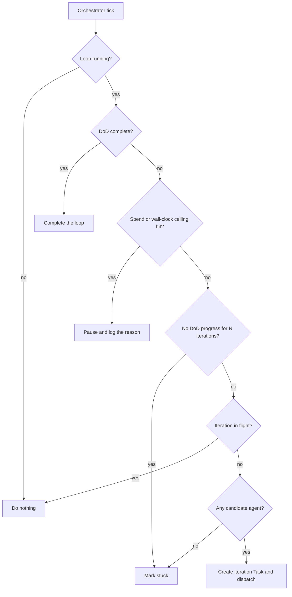

# Goals

A **Goal** is a number you want to move, checked on a schedule. Where a [Mission](./missions.md) keeps
producing work on a topic, a Goal watches a single metric and tells you whether it is heading the right
way.

Measuring is the base layer: a Goal reads a metric from a provider plugin, records what it saw, and
reports progress toward a target. On top of that, a Goal can opt into an **execution loop** — a
Definition of Done, spend and time ceilings, and iterations dispatched to an [Agent](./agents.md) —
described in [The Goal execution loop](#the-goal-execution-loop-early) below. A Goal that never starts
a loop only ever measures.

## When to use a Goal

| You want to…                                                    | Use a…      |
| --------------------------------------------------------------- | ----------- |
| Keep producing new Works and Ideas on a theme                   | **Mission** |
| Track "monthly revenue reaches $1,000" and know when it happens | **Goal**    |
| Track "support tickets stay below 20 a week"                    | **Goal**    |
| Build one site from one prompt                                  | **Work**    |

Goals and Missions are independent — you can run either without the other.

## Creating a Goal

From `/goals`, choose **New Goal**. The form at `/goals/new` collects:

| Field                  | Required | Notes                                                                            |
| ---------------------- | -------- | -------------------------------------------------------------------------------- |
| **Title**              | yes      | Up to 200 characters. Shown on the catalog and the detail page.                  |
| **Description**        | no       | Free context for whoever reads the Goal later.                                   |
| **Provider plugin ID** | yes      | The metrics plugin that supplies the number — see below.                         |
| **Metric ID**          | yes      | Which metric to read from that plugin.                                           |
| **Parameters (JSON)**  | no       | Passed to the provider, e.g. `{ "currency": "usd" }`. Must be a JSON **object**. |
| **Direction**          | yes      | _At least_ (grow to target) or _At most_ (stay under it).                        |
| **Target value**       | yes      | The number you are aiming at. See the note below.                                |
| **Unit**               | yes      | Free text — `usd`, `tickets`, `signups`.                                         |
| **Window**             | yes      | Daily, Weekly, Monthly, Total, or Point-in-time.                                 |
| **Deadline**           | no       | Optional date the Goal should be met by.                                         |
| **Check frequency**    | yes      | Minutes between evaluations. **Clamped server-side to a 15-minute minimum.**     |

:::caution Target value is required, including zero
Leave **Target value** blank and the form rejects it. This matters more than it looks: a blank field
used to be stored as a target of `0`, and combined with _At least_, that produced a Goal meaning
"reach at least 0" — satisfied by every possible value, so it reported success immediately and silently.

An **explicit** `0` is still perfectly valid. "Keep failures at most 0" is a real Goal.
:::

New Goals are created in **draft**. Nothing is evaluated until you activate them.

## The metric source

A Goal reads its number from a **metrics provider plugin**, identified by the pair
(_Provider plugin ID_, _Metric ID_). The provider must be installed and enabled for your account
before the Goal can read anything.

:::warning The form's placeholder text is not a working example
The Provider plugin ID field shows `stripe` as its placeholder and Metric ID shows `income`. These are
illustrative, **not** real plugin identifiers. A Goal created by copying them will save and activate
without complaint, then fail on every evaluation.

Use an id from [the table below](#metrics-providers-that-ship-today) instead, and check under
**Plugins** which metrics providers are actually enabled for your account before creating the Goal.
:::

Activation deliberately does **not** verify that the named provider exists. That keeps you from being
blocked while a plugin is being set up — but it also means a typo surfaces only at the first
evaluation, not at creation.

### Metrics providers that ship today

Four first-party `metrics-provider` plugins live in the repository. These are the real ids the two
fields expect:

| Provider plugin ID         | Metric ID           | Unit            | Windows                  | What it reads                                                                              |
| -------------------------- | ------------------- | --------------- | ------------------------ | ------------------------------------------------------------------------------------------ |
| `stripe-metrics`           | `balance_available` | your currency   | Point-in-time            | Available Stripe balance.                                                                  |
| `stripe-metrics`           | `gross_volume`      | your currency   | Daily / Weekly / Monthly | Sum of successful charges **in the configured currency only**.                             |
| `posthog-metrics`          | `event_count`       | `count`         | Daily / Weekly / Monthly | Occurrences of one event. Requires a parameter naming the event — see below.               |
| `posthog-metrics`          | `active_users`      | `count`         | Daily / Weekly / Monthly | Unique persons in the window.                                                              |
| `google-analytics-metrics` | `active_users`      | `count`         | Daily / Weekly / Monthly | GA4 `activeUsers`.                                                                         |
| `google-analytics-metrics` | `sessions`          | `count`         | Daily / Weekly / Monthly | GA4 `sessions`.                                                                            |
| `google-analytics-metrics` | `conversions`       | `count`         | Daily / Weekly / Monthly | GA4 **key events** — the 2024 rename of "conversions", which is what is queried upstream.  |
| `custom-http-metrics`      | _you choose the id_ | _you choose it_ | Point-in-time            | One JSON endpoint of yours per metric: every endpoint you configure becomes one metric id. |

A few specifics worth knowing before you wire one up:

- **`stripe-metrics`** needs `STRIPE_SECRET_KEY` — a restricted read-only `rk_…` key is strongly
  recommended — and is read-only by contract. There is no net-income metric: `gross_volume` is the
  well-defined approximation, and the id `net_income` is reserved so nothing else squats on it with a
  different meaning.
- **`posthog-metrics`** needs `POSTHOG_PERSONAL_API_KEY` (scope it to _Query: Read_) and
  `POSTHOG_PROJECT_ID`. Its `event_count` metric requires the event name, so the
  **Parameters (JSON)** field must carry something like `{ "event": "$pageview" }`.
- **`google-analytics-metrics`** needs `GOOGLE_ANALYTICS_PROPERTY_ID` and
  `GOOGLE_ANALYTICS_SERVICE_ACCOUNT_JSON` for a service account with **Viewer** on the GA4 property.
  The GA4 Data API is reporting-only, so it cannot mutate anything.
- **`custom-http-metrics`** points the platform at your own endpoints. Each configured endpoint is a
  GET-only, JSON-returning URL plus a dot/bracket path to the numeric value inside the response
  (`data.metrics[0].value`), and it surfaces as one metric with a Point-in-time window. Requests run
  through the SSRF guard, refuse redirects, and are capped at 1 MB and 15 seconds.

Credentials for all four can also be set through admin or user plugin settings rather than environment
variables — see [Plugins](./plugins.md).

## Lifecycle

A Goal moves through four states:

| Status        | Meaning                                           |
| ------------- | ------------------------------------------------- |
| **draft**     | created, never evaluated. No schedule is running. |
| **active**    | evaluated on the check frequency.                 |
| **paused**    | schedule stopped; history kept.                   |
| **completed** | finished, with an optional outcome recorded.      |

The action bar shows only the transitions that make sense for the current state — a draft Goal offers
**Activate** and **Delete**; an active one offers **Evaluate now** and **Pause**.

### Evaluate now

Runs a check immediately rather than waiting for the next scheduled one. Each evaluation records a
sample, so the progress sparkline fills in over time. If no metrics provider is enabled, this is where
you will see the failure.

## Editing a Goal

A Goal **is** editable after creation: `PATCH /api/me/goals/:id` takes a partial body and writes any
subset of the fields below. Only `status` is off-limits there — activate and pause have their own
endpoints, so a lifecycle change is never a side effect of a field edit.

| Field                                             | Editable via PATCH | Notes                                                                                                                                                       |
| ------------------------------------------------- | ------------------ | ----------------------------------------------------------------------------------------------------------------------------------------------------------- |
| `title`, `description`                            | yes                | Title is trimmed to 200 characters; `description` accepts `null`.                                                                                           |
| `metricSource` (`pluginId`, `metricId`, `params`) | yes                | On an **active** Goal the new source must still name a provider _and_ a metric — a half-filled source is rejected rather than silently breaking evaluation. |
| `comparator`, `targetValue`, `unit`, `window`     | yes                | Same validation as creation: the comparator is `gte` or `lte`, and the target must be a finite number.                                                      |
| `baselineValue`                                   | yes                | `null` clears it.                                                                                                                                           |
| `deadline`                                        | yes                | ISO-8601, or `null` for open-ended.                                                                                                                         |
| `checkFrequencyMinutes`                           | yes                | Re-clamped to the 15-minute minimum on every write.                                                                                                         |
| `outcome`                                         | yes                | A non-null outcome **completes** the Goal and clears its next check; `null` re-opens it.                                                                    |
| `criteria`, `constraints`                         | yes                | The weighted-judgment layer. Sending `null` or `[]` for `criteria` clears the weighted path _and_ the stale resolved score with it.                         |
| `status`                                          | no                 | Use `POST /api/me/goals/:id/activate` and `POST /api/me/goals/:id/pause`.                                                                                   |

What the dashboard exposes today is narrower than the API. On `/goals/:id` you can change the
**Override outcome** select (Progress log tab → **Outcome**), everything in **Adjust limits**, the
**Definition of Done** checklist, and **Archive** / **Unarchive** / **Delete**. There is no edit form
for the title, metric source, target, unit, window or cadence — change those over the API:

```bash
curl -X PATCH http://localhost:3100/api/me/goals/<goal-id> \
  -H "Authorization: Bearer <jwt-token>" \
  -H "Content-Type: application/json" \
  -d '{
    "targetValue": 2500,
    "unit": "usd",
    "checkFrequencyMinutes": 120
  }'
```

Goal writes are throttled at 30 requests per minute. `evaluate-now`, `advance` and `loop/restart` share
a tighter 10-per-minute bucket, because each one either reaches an upstream provider or starts a paid
agent run.

## The Goal execution loop (early)

:::info Status — early: the loop ships, but no end-to-end test covers it
Every endpoint, decision branch and tab described in this section exists in the shipped code
(`apps/api/src/goals/goals.controller.ts`, `packages/agent/src/goals/goal-orchestrator.service.ts`,
`apps/web/src/components/goals/*`), and the decision table is a pure function with its own unit specs.
What is missing is browser coverage: no end-to-end spec drives the Definition-of-Done tab or the loop
controls yet, so treat anything odd as a bug worth filing rather than expected behaviour.

One limit to know before you start: a Goal created in the dashboard has an **empty routing pool**, and
every advance answers _"no agent is available"_ until you pin one under **Adjust limits**. See
[The agent pool starts empty](#the-agent-pool-starts-empty).
:::

Evaluation answers _"is the number there yet?"_. The execution loop answers _"should we keep **working**
on this?"_ — and writes down why, every time. It is entirely opt-in: a Goal that never starts a loop
carries no loop status at all, and the orchestrator's scan never matches it.

### An iteration is a Task

Nothing in the loop re-implements dispatch. One iteration is one auto-created [Task](./tasks.md) titled
`[Goal] <your goal title> — iteration N`, labelled `goal-iteration`, filed against the Goal and assigned
to the routed Agent, then handed to the same dispatch path a person clicking **Run** on a kanban card
takes. That is what buys iterations the concurrency valve, the credits precheck, workspace isolation,
the quality gates and the run cockpit for free — and it is why the **Sessions** tab is simply "the runs
of this Goal's Tasks".

The brief the Agent receives is built from persisted state only — the open Definition-of-Done criteria,
the session budget, the worker-model and execution-target hints — so what the Agent is told and what you
see on the DoD tab cannot drift apart. Dispatch is keyed on the iteration number, so a double tick of
the scheduler cannot fire the same iteration twice.

### Definition of Done

The Definition of Done is the checklist that decides when the loop stops. Each criterion carries an id,
the completion statement, a status, optional evidence and an optional note.

| Criterion status | Meaning                                                                           |
| ---------------- | --------------------------------------------------------------------------------- |
| **open**         | Still to do. The loop keeps iterating while any approved criterion is open.       |
| **done**         | Satisfied — record the evidence alongside it.                                     |
| **waived**       | No longer applies. A first-class action, not a hidden one, with a note for _why_. |

The rollup reads `N done · N waived · N open`, and the loop is complete when there is at least one
approved criterion and none of them is open.

Criteria have two sources. **Operator** criteria are the ones you type. **Planner** criteria arrive from
a planning run through `POST /api/me/goals/:id/dod/propose`, land marked as proposed, render greyed
behind an **Approve** control, and are excluded from _every_ count until you approve them — a planning
run must not be able to move the completion bar in either direction on its own. A proposal also raises a
persistent "Definition of Done needs your approval" [notification](./notifications.md).

Bounds: at most 50 criteria per Goal, 500 characters of criterion text, 1,000 of evidence, 500 of note,
64 for an id, and 64,000 characters for the serialized checklist as a whole.

**How to work the checklist**

1. Open `/goals/:id` and select the **Definition of Done** tab.
2. Type the statement into **New criterion** and press **Add**.
3. On any criterion use **Mark done**, **Waive** (which asks for a note), **Reopen**, or **Remove**.
4. When the banner says a planning run proposed criteria, review them and press **Approve all** — or
   approve a subset over the API with `POST /api/me/goals/:id/dod/approve`.

Stuck detection reads a fingerprint of how much of the checklist is closed, and that fingerprint
deliberately ignores evidence and note edits and ignores ordering: rewording why something was waived,
or re-sorting the list, is not progress.

### Limits and routing

**Adjust limits** on `/goals/:id` is one dialog covering every ceiling and every routing hint. Leaving a
field empty **clears** that ceiling — it does not set it to zero.

| Field                           | What it does                                                                                                                                            |
| ------------------------------- | ------------------------------------------------------------------------------------------------------------------------------------------------------- |
| **Pinned agent**                | Routing always picks this Agent. Empty restores round-robin over the Agents that have already worked this Goal.                                         |
| **Spend cap (USD)**             | Total spend across every iteration. Entered in dollars, stored and enforced in cents, so the ceiling cannot drift by rounding.                          |
| **Wall-clock limit (hours)**    | Measured from when the loop **first** started and preserved across pause/resume — a limit you could reset by pausing for a second would not be a limit. |
| **Stuck after (iterations)**    | Iterations with no Definition-of-Done progress before the loop is marked stuck.                                                                         |
| **Session budget (minutes)**    | Advisory runtime budget written into the iteration brief.                                                                                               |
| **Grace period (minutes)**      | Extra time an in-flight iteration gets after the wall-clock limit so a session mid-write can land. Applies to the clock only, never to the spend cap.   |
| **Execution target**            | `Cloud` or `Local runner` — an advisory hint recorded on every dispatch event.                                                                          |
| **Planner / worker model hint** | Free text passed through to planning and iteration runs.                                                                                                |

Spend to date is a **derived** number, not a running counter: `POST /api/me/goals/:id/spend-rollup`
recomputes it from the linked runs and persists it, and the orchestrator refreshes it before every
decision — a counter that missed one terminal run would under-report forever, and a budget that
under-reports is not a budget.

### What the orchestrator decides, in order

Every branch lives in one pure function, and the order is the contract:

| #   | Condition                                                                     | Action       | Reason code                                    |
| --- | ----------------------------------------------------------------------------- | ------------ | ---------------------------------------------- |
| 1   | The loop is not running                                                       | nothing      | `loop-not-running`                             |
| 2   | Every approved criterion is done or waived                                    | **complete** | `dod-complete`                                 |
| 3   | Spend to date has reached the spend cap                                       | **pause**    | `spend-cap-exceeded`                           |
| 4   | The wall-clock limit is reached, an iteration is in flight, and grace remains | wait         | `grace-period`                                 |
| 5   | The wall-clock limit is reached                                               | **pause**    | `wall-clock-exceeded`                          |
| 6   | No Definition-of-Done progress for N iterations                               | **stuck**    | `no-progress`                                  |
| 7   | An iteration is still running                                                 | wait         | `run-in-flight`                                |
| 8   | No Agent is available to route to                                             | **stuck**    | `no-candidate-agent`                           |
| 9   | Otherwise — the pinned Agent, else round-robin                                | **dispatch** | `routed-assigned-agent` / `routed-round-robin` |



Two ordering decisions are deliberate. The Definition of Done is checked **before** the ceilings, so a
Goal that closes its last criterion inside its final budgeted iteration is recorded as achieved rather
than as "paused: out of budget" — finishing beats running out. And the ceilings are checked **before**
stuck detection, because a loop that is both over budget and stuck should report the ceiling: raising a
cap and changing a plan are different actions.

Waiting and the not-running case are not written to the log at all. A scheduler that recorded "still
running" on every tick would bury the decisions that matter under thousands of non-events.

### Running a loop

1. Open `/goals/:id`.
2. Press **Adjust limits**, choose a **Pinned agent**, set a **Spend cap (USD)** and a
   **Wall-clock limit (hours)** you are comfortable with, then **Save limits**.
3. Go to the **Definition of Done** tab and add the criteria that describe "finished".
4. Press **Start loop** in the header. The wall-clock anchor is set on this first start.
5. Press **Advance now** to run the orchestrator immediately instead of waiting for the scheduler; a
   background dispatcher scans running loops every five minutes on its own.
6. Watch the **Sessions** tab for iteration rows and the **Orchestrator** tab for the reasoning behind
   each one.
7. Tick criteria off as evidence lands. When the last approved criterion closes, the loop records
   **complete** and notifies you.

Header controls while a loop is running: **Advance now**, **Nudge**, **Pause loop**, **Restart
session**, **Cancel loop**. Pausing leaves the in-flight iteration to land; cancelling also cancels it,
because cancelling means the work is not wanted and letting it finish would spend budget on an outcome
nobody asked for. **Restart session** cancels whatever is running and immediately routes a fresh
iteration — and the iteration counter still advances, because a restart is a new attempt.

### Steering a running session

**Nudge** injects a steering message of up to 2,000 characters into the live iteration run, through the
same path a chat mention of a busy Agent takes. It refuses rather than improvising in two cases: when no
session is in flight ("Advance the loop to start one") and when the run went terminal before the message
could be delivered. A nudge means _"say this to the thing that is running"_ — if nothing is running, the
honest answer is to advance the loop.

### Sessions, Results and the orchestrator log

| Tab                    | What it holds                                                                                                                                                                                                               |
| ---------------------- | --------------------------------------------------------------------------------------------------------------------------------------------------------------------------------------------------------------------------- |
| **Definition of Done** | The checklist, its rollup bar, and the approval banner for planner proposals.                                                                                                                                               |
| **Progress log**       | Current value against target, the sample sparkline, the metric details, the budget-and-limits summary, and the outcome override.                                                                                            |
| **Sessions**           | One row per iteration Task with its latest run — task slug, iteration, Agent, run status, start and finish, duration, cost. Tasks with **no** run are listed too, so a loop that failed to dispatch looks broken, not idle. |
| **Orchestrator**       | Every decision, newest first, with the verbatim reasoning. Entries are typed `route`, `dispatch`, `complete`, `limit`, `nudge`, `control` or `dod`.                                                                         |
| **Results**            | The newest session summary that actually produced one, rendered as plain pre-wrapped text — agent-authored prose is never handed to an HTML renderer on a page that also carries operator controls.                         |

The reasoning strings name the inputs that produced a decision rather than summarizing them, so a line
like _"Routed iteration 4 → Researcher: the Goal pins no agent, so the router round-robins over 2
agent(s) that have worked this Goal"_ can be checked rather than merely believed.

When a loop stops on its own you also get a [notification](./notifications.md) — informational for
"done", a persistent warning for a ceiling or a stuck loop — deduplicated per goal, reason and iteration
so a loop that keeps re-tripping the same cap cannot spam you.

### The agent pool starts empty

The router only ever considers two sets: the Agent pinned on the Goal, and the Agents that have already
worked one of its iterations. A Goal created in the dashboard has neither, so its first advance returns
`no-candidate-agent` and the loop is marked **stuck** — honest degradation, because a loop with nothing
to route to is not running, it is waiting on a human.

The fix is one field: **Adjust limits → Pinned agent**, then **Start loop** (or **Advance now**) again.
Clearing the pin later restores round-robin over the Goal's own history. If you have no Agents yet,
create one first — see [Agents](./agents.md).

### Archiving a Goal

**Archive** hides a Goal from the default catalog without deleting anything; `/goals` carries a Live /
Archived view toggle. Archiving a Goal whose loop is running also pauses that loop, and an archived Goal
refuses both **Start loop** and **Restart session** — otherwise a retired Goal could still be made to
spend money.

### Loop API reference

| Method  | Endpoint                                   | Purpose                                                                           |
| ------- | ------------------------------------------ | --------------------------------------------------------------------------------- |
| `PATCH` | `/api/me/goals/:id/limits`                 | Budgets and routing hints. Omitted fields are untouched; `null` clears a ceiling. |
| `PUT`   | `/api/me/goals/:id/dod`                    | Replace the whole checklist. `criteria: null` clears it.                          |
| `POST`  | `/api/me/goals/:id/dod/propose`            | Append planner-authored criteria for approval.                                    |
| `POST`  | `/api/me/goals/:id/dod/approve`            | Approve every proposed criterion, or the named subset.                            |
| `PATCH` | `/api/me/goals/:id/dod/:criterionId`       | Tick, untick or waive one criterion (waivers carry a note).                       |
| `POST`  | `/api/me/goals/:id/loop/start` \| `resume` | Start or resume the loop.                                                         |
| `POST`  | `/api/me/goals/:id/loop/pause`             | Pause; the in-flight session is left to land.                                     |
| `POST`  | `/api/me/goals/:id/loop/cancel`            | Cancel the loop and its in-flight session.                                        |
| `POST`  | `/api/me/goals/:id/loop/restart`           | Cancel the in-flight session and route a fresh iteration.                         |
| `POST`  | `/api/me/goals/:id/advance`                | Run the orchestrator now.                                                         |
| `POST`  | `/api/me/goals/:id/nudge`                  | Inject a steering message into the live run.                                      |
| `POST`  | `/api/me/goals/:id/spend-rollup`           | Recompute spend-to-date from the linked runs.                                     |
| `GET`   | `/api/me/goals/:id/events`                 | The orchestrator log, newest first.                                               |
| `GET`   | `/api/me/goals/:id/sessions`               | Iteration Tasks, each with its latest run.                                        |
| `POST`  | `/api/me/goals/:id/archive` \| `unarchive` | Hide from the catalog, or restore.                                                |

## What a Goal does not do

- It does **not** create Works or Ideas. That is a [Mission](./missions.md). The execution loop creates
  iteration **Tasks** — never Works, never Ideas.
- It does **not** change anything in your account when a target is hit — it records the outcome.
- Metric evaluation does **not** perform work on its own. Reaching a target is an observation; making
  progress toward one is what [the execution loop](#the-goal-execution-loop-early) is for, and that only
  runs once you start it.

:::note Correction — Goals are editable
An earlier version of this page said a Goal could not be edited after creation. That is not true:
`PATCH /api/me/goals/:id` writes the title, metric source, target, unit, window, deadline, cadence,
outcome and judgment layer. See [Editing a Goal](#editing-a-goal) for the field-by-field table and for
what the dashboard exposes today.
:::

## Related

- [Missions](./missions.md) — long-running goals that produce Ideas and Works
- [Ideas](./ideas.md) — proposals a Mission generates
- [Budgets and usage](./budgets-and-usage.md) — spend limits, which are enforced rather than observed
- [Agents](./agents.md) — the workers a Goal loop routes iterations to
- [Tasks](./tasks.md) — what one iteration actually is
- [Sessions & steering](./sessions-and-steering.md) — the run cockpit behind every iteration
- [Plugins](./plugins.md) — installing and configuring the metrics providers
- [Notifications](./notifications.md) — where "loop stopped" and "DoD needs approval" arrive
- [Autonomous operation](./autonomous-operation.md) — the wider always-on picture
