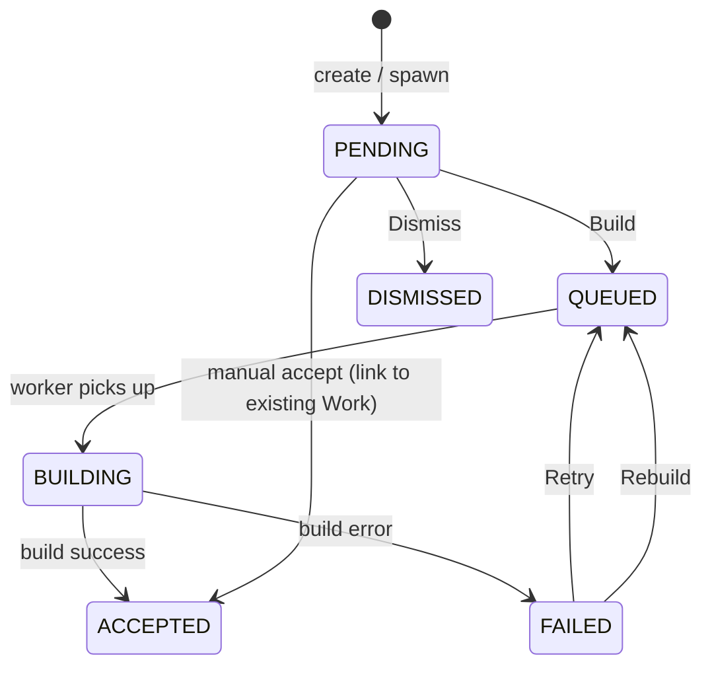

# Ideas

An **Idea** is a proposed Work — a title + description + suggested categories / fields / plugins that the platform is offering for you to build into a finished website. Ideas are the queue between "I have a topic" and "I have a Work".

You'll see Ideas at `/ideas`. They show up from three sources:

| Source           | Where it comes from                                                               |
| ---------------- | --------------------------------------------------------------------------------- |
| **auto-signup**  | Generated automatically when you sign up, based on your onboarding answers.       |
| **user-refresh** | You hit **Suggest more** on `/ideas`.                                             |
| **discover**     | Surfaced from the platform's discovery feeds (curated catalogs, trending topics). |
| **scheduled**    | A scheduled refresh job (account-level cadence).                                  |
| **user-manual**  | You typed one directly via the `+ Add` button or `/new` → Idea chip.              |
| **mission**      | Spawned by a [Mission](./missions) tick — carries a `missionId` back-reference.   |

All sources produce the same Idea shape; only the `source` field on the Idea distinguishes them.

## Idea lifecycle

| Status        | What it means                                                                                       |
| ------------- | --------------------------------------------------------------------------------------------------- |
| **PENDING**   | New, waiting for you to act on it.                                                                  |
| **QUEUED**    | You hit **Build**. Sits in the WorkAgent queue waiting for a free slot.                             |
| **BUILDING**  | A WorkAgent worker is actively generating the Work.                                                 |
| **ACCEPTED**  | A Work was successfully built (or manually linked). The `acceptedWorkId` points at the Work.        |
| **FAILED**    | Build hit an error. The Idea row carries `failureKind` (transient vs permanent) + `failureMessage`. |
| **DISMISSED** | You said "not interested". Won't resurface on refreshes. Not reversible from the UI.                |

## Build vs Accept

Two ways an Idea turns into a Work:

- **Build** — the common path. Hands the Idea to the WorkAgent, which spawns a fresh Work and runs the generation pipeline with the Idea's prompt + suggested categories pre-filled. Use when you want the platform to do the work.
- **Accept** — manual link to a pre-existing Work you already built. Use when you've already built the thing and just want the Idea row to point at it so the catalog reflects that the proposal is done.

The `Build` button on an IdeaCard is the primary CTA. `Accept` lives on the Mission detail page for Ideas spawned by a Mission, when you want to link to a Work you built outside the queue.

## Refreshing Ideas

The **Suggest more** button on `/ideas` triggers the AI research job to generate fresh proposals based on your account context (existing Works, accepted Ideas, dismissed Ideas — the model uses all three to lean adjacent to wins, away from rejections).

The refresh is **rate-limited per account** (currently one refresh per N minutes, surfaced as `rate-limited` on the button when blocked). When the cap is hit the page swaps in a friendly "try again soon" subtitle rather than erroring.

Refreshes pull from your account's research context, **not** from any individual Mission. To generate Mission-specific Ideas, run a Mission tick (auto on the Mission's cron, or via **Run now**).

## Failed Ideas

When a build fails, the Idea moves to `FAILED` and carries diagnostic info:

| Failure kind              | What to do                                                              |
| ------------------------- | ----------------------------------------------------------------------- |
| `transient-network`       | Hit **Retry** — usually self-heals on the next try.                     |
| `transient-rate-limit`    | Wait, then **Retry**. The upstream provider is throttling.              |
| `transient-upstream-5xx`  | Hit **Retry**. External AI/search provider returned a 5xx.              |
| `transient-plugin`        | Plugin glitched. **Retry**; if it persists, check the plugin's health.  |
| `permanent-invalid-input` | The prompt or suggestion can't be built. Edit the Idea or **Dismiss**.  |
| `permanent-unknown`       | Edge case the classifier didn't recognize. **Rebuild** (fresh attempt). |

**Retry** transitions the same Goal back to QUEUED with the previous attempt's context intact. **Rebuild** spawns a fresh Goal with no carry-over — use it when you suspect the previous attempt's context is the problem.

## Mission-spawned Ideas

Ideas spawned by a [Mission](./missions) carry a `missionId` back-reference and show up both:

- On the global `/ideas` page (alongside non-Mission Ideas).
- On the Mission's detail page, filtered to just that Mission's Ideas.

Use the Mission detail page when you want context — you can see the Mission's description and the Ideas it produced side-by-side. Use `/ideas` when you want to triage everything at once.

## Cost & budget

Every build costs AI credits. Per-Idea spend rolls up against the Mission (if Mission-spawned) and your account-wide cap. See [Budgets & Usage](./budgets-and-usage) for how to set caps and what happens when one is hit.

## API

The same verbs are reachable via the API + MCP server:

| Verb               | Endpoint                                          |
| ------------------ | ------------------------------------------------- |
| List Ideas         | `GET  /api/me/work-proposals?statuses=…`          |
| Get one            | `GET  /api/me/work-proposals/:id`                 |
| Create user-manual | `POST /api/me/work-proposals`                     |
| Refresh            | `POST /api/me/work-proposals/refresh`             |
| Build              | `POST /api/me/work-proposals/:id/build`           |
| Retry / Rebuild    | `POST /api/me/work-proposals/:id/{retry,rebuild}` |
| Dismiss            | `PATCH /api/me/work-proposals/:id/dismiss`        |
| Accept             | `POST /api/me/work-proposals/:id/accept`          |
| Per-Idea budget    | `GET  /api/me/work-proposals/:id/budget`          |

Same routes are exposed as MCP tools (`list_ideas`, `build_idea`, etc.) for external MCP clients — see the [MCP Server](./mcp-server) docs.
