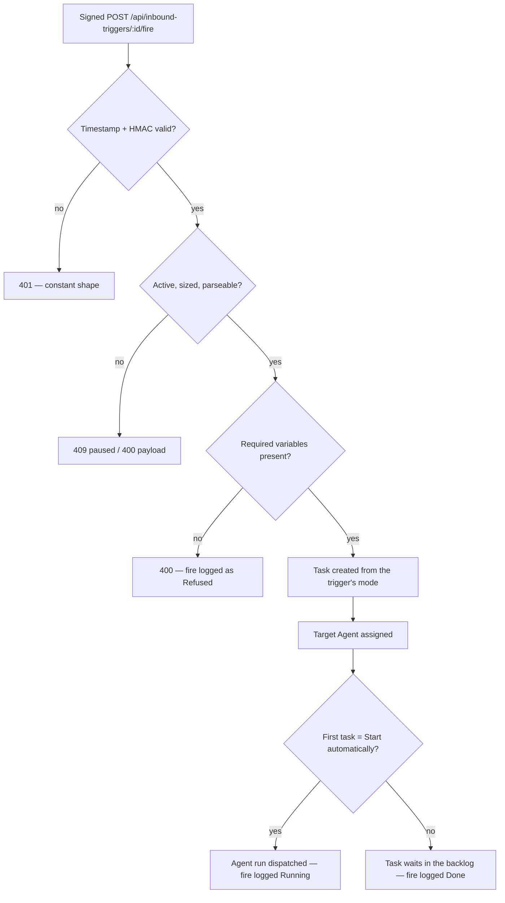

# Inbound Triggers (Webhook → Task)

An **Inbound Trigger** is a standing rule that turns something happening outside the platform into work inside it. Every trigger owns an HTTPS endpoint and a signing secret. Each verified call to that endpoint creates a [Task](./tasks.md) from the trigger's own template, assigns it to the [Agent](./agents.md) you nominated, and — unless you asked it to wait — starts the agent run immediately.

That is the whole feature. A deploy finishes → a Task. A form is submitted → a Task. A monitor trips at 3 a.m. → a Task, already assigned, already running.

Triggers live under **Tasks → Triggers** at `/tasks/triggers`, with a detail page per trigger at `/tasks/triggers/:id`.

## Where to find them

The Tasks surface carries a tab strip — **Tasks | Triggers**. The Triggers tab lists every trigger you own in the current Organization scope:

| Column         | What it shows                                                                                            |
| -------------- | -------------------------------------------------------------------------------------------------------- |
| **Name**       | Links to the trigger detail page; a webhook icon or a lightning icon marks the source, description below |
| **Mode**       | `Task` or `Template` — what a fire produces, locked when the trigger was created                         |
| **Target**     | The task-template slug, the title template, or _Default task title_                                      |
| **Enabled**    | A switch that pauses or resumes the trigger in place                                                     |
| **Last Fired** | Relative timestamp, or _Never_                                                                           |
| **Fires**      | Lifetime count of real fires (test fires are not counted)                                                |

The row menu (**⋯**) holds **Fire now**, **Test fire**, **Edit**, **Rotate secret** (webhook triggers only) and **Delete**.

A second, smaller surface exists: the **Inbound triggers** panel under **Activity → Schedules**, which can create, pause, rotate and delete triggers but has no detail page or fire log. See [Activity](./activity.md).

## Two sources: a signed URL, or a platform event

The **Source** is chosen at create time and cannot be changed afterwards.

| Source                   | Fired by                                                                      | Endpoint + secret | Best for                                                                         |
| ------------------------ | ----------------------------------------------------------------------------- | ----------------- | -------------------------------------------------------------------------------- |
| **Webhook (signed URL)** | Anyone who can sign a request with the trigger's secret                       | Yes               | CI, monitoring, form back ends, your own scripts, any third-party webhook sender |
| **Platform event**       | An ingested platform event whose `source` / `kind` / `workId` match your rule | No                | Reacting to events that already flow through the platform's ingest spine         |

An event-sourced trigger needs an **Event matcher** with at least one field: a producing plugin id (`slack-connector`), a source-namespaced kind (`github.push`), or an exact Work id. `source` and `kind` accept a trailing `*` wildcard (`github.*`), and every field you fill must match. Each event fires a given trigger at most once: the claim on `(trigger, event)` turns permanent as soon as a fire produces a Task, so a retried ingest drain never double-fires. An attempt that ended `Refused` or `Failed` created no Task at all, so it stays re-claimable and a later drain is free to try it again.

Both sources funnel into exactly the same Task-spawning path, so everything below about modes, templates, variables and the fire log applies to either one. Only the delivery half differs.

## How to create a trigger

1. Go to **Tasks → Triggers** (`/tasks/triggers`) and click **New Trigger**.
2. Give it a **Name** (up to 120 characters) and, optionally, a **Description** of what fires it.
3. Pick the **Source** — _Webhook (signed URL)_ or _Platform event_. For an event trigger, fill at least one field of the **Event matcher**.
4. Pick the **Mode**:
    - **Task** (`single-task`) — you write **Agent instructions**, and each delivery's payload is appended to them for the agent to work from.
    - **Template** — the Task is built from a **Task template slug** you supply. The slug is required up front; the **Create** button stays disabled without it.
5. Optionally set a **Task title template** and a **Task description template** (see [Titles and descriptions](#titles-and-descriptions)).
6. Choose an agent under **Assign agent**. Without one, fires still create Tasks — they just sit unassigned.
7. Declare a payload contract under **Expected variables** if you want deliveries validated (see [Declaring a payload contract](#declaring-a-payload-contract)).
8. Set the operational switches: **First task** (_Start automatically_ or _Leave in backlog_), **Replay window (seconds)** (default `300`, range `10`–`86400`), **Show on task board**, and **Enabled**.
9. Click **Create**. For a webhook trigger the **Trigger secret** dialog opens with the **Webhook URL** and the **Signing secret**, each with a copy button.

:::warning The signing secret is shown exactly once
Copy it before you close the dialog. Neither the list, the detail page, nor the API ever returns secret material again — the only way to get a working secret back is **Rotate secret**, which mints a new one.
:::

**Mode and Source are locked after creation.** Editing a trigger shows both as read-only text; the API rejects a `mode` field on an update outright. Everything else — name, description, agent, templates, variables, auto-start, replay window, board visibility — stays editable.

## Signing a delivery

The fire endpoint is deliberately public: external systems authenticate with the trigger's HMAC secret, never with a session. Send the JSON payload to the webhook URL with these headers:

| Header                  | Required    | Value                                                                                                                               |
| ----------------------- | ----------- | ----------------------------------------------------------------------------------------------------------------------------------- |
| `x-everworks-timestamp` | Yes         | Unix epoch **seconds** (millisecond stamps are also accepted). This exact string is part of what you sign.                          |
| `x-everworks-signature` | Yes         | Hex HMAC-SHA256 over `` `${timestamp}.${rawBody}` ``, keyed with the secret. A `sha256=` prefix is allowed; hex case is normalized. |
| `content-type`          | In practice | `application/json` (with or without a charset) or `application/x-www-form-urlencoded` — see the caution below.                      |
| `x-everworks-delivery`  | No          | Your own id for this delivery. When present it is the deduplication identity; without one the signature stands in.                  |

The signed string is `timestamp`, a literal dot, then the **raw request bytes** — not a re-serialized body. This is the sample the trigger detail page generates for you under **Signed curl example**, with your trigger's URL already filled in:

```bash
TS=$(date +%s)
BODY='{"example":"payload"}'
SIG=$(printf "%s.%s" "$TS" "$BODY" | openssl dgst -sha256 -hmac "$TRIGGER_SECRET" -r | cut -d" " -f1)
curl -X POST "$TRIGGER_URL" \
  -H 'content-type: application/json' \
  -H "x-everworks-timestamp: $TS" \
  -H "x-everworks-signature: $SIG" \
  -d "$BODY"
```

:::caution Only JSON and form-urlencoded bodies can be verified
The raw bytes are captured by the JSON and urlencoded body parsers. A body sent as `text/plain` or `application/…+json` arrives with nothing captured to compare against, so the signature never matches and the call is rejected with `401` — even when your signature is perfectly computed. Send `application/json`.
:::

### The replay window

**Replay window (seconds)** — 300 by default, adjustable between 10 seconds and 24 hours — does two jobs at once:

- **Freshness.** A signed timestamp more than that far from now, in either direction, is rejected.
- **Duplicate suppression.** A repeat of the same delivery inside the window answers `200` with `duplicate: true` and the **original** Task's id, instead of creating a second Task. Retrying with the same `x-everworks-delivery` id is the reliable way to get this; a byte-identical retry with the same timestamp signs identically and is also caught, but a retry with a fresh timestamp is a new delivery by definition.

### What the endpoint answers

| Status | Meaning                                                                                                        |
| ------ | -------------------------------------------------------------------------------------------------------------- |
| `200`  | Verified. Body is `{ ok, taskId, taskSlug }`, or `{ ok, taskId, taskSlug: null, duplicate: true }` on a repeat |
| `400`  | Payload over 64 KB, malformed JSON under a JSON content type, or a payload missing a **required** variable     |
| `401`  | Bad or missing signature, or a timestamp outside the replay window — one constant shape for every failure      |
| `404`  | No such trigger id                                                                                             |
| `409`  | The trigger is paused                                                                                          |

The order is deliberate: `404` is decided before the signature check, and `409` and `400` are only ever shown to correctly-signed callers. A prober holding no secret learns nothing but `401`. The fire endpoint is rate-limited to 120 requests per minute; the management endpoints to 30.

## What happens on a fire



Every delivery path — signed webhook, matched platform event, **Fire now**, **Test fire** — runs this same sequence, so the four cannot drift apart. The full chain, from a signed call through the spawned Task into a real agent run linked back to that Task, is pinned end-to-end by `apps/web/e2e/flow-inbound-trigger-task-agent-chain.spec.ts`.

Two behaviours worth knowing:

- **Dispatch is best-effort.** If a credits gate or an in-flight limit refuses the agent run, the Task that was legitimately created is _not_ undone; the fire is recorded as `Done` rather than `Running`, and you can start the Task by hand.
- **A stale agent does not break a fire.** If the target agent was archived or deleted, the Task is still created and the call still answers `200`.

### Where the spawned Task shows up

Trigger-spawned Tasks are **hidden from the task board and the default task list** unless the trigger has **Show on task board** switched on. That is deliberate: a webhook firing a hundred times a day should not bury your human backlog.

To reach a hidden Task, use **View task** on the matching row of the trigger's recent-fires log, or ask the API for it explicitly with `GET /api/tasks?includeHidden=true`. Once open it is an ordinary Task in every respect — transition it, chat on it, re-run it with an agent.

## Declaring a payload contract

**Expected variables** is the contract a delivery must satisfy. Write one entry per line in the trigger form:

```text
repo*
branch | Branch name
run_id
```

- A bare `key` is informational.
- A trailing `*` marks the key **required**.
- Anything after `|` is a display label.

Keys are top-level payload keys matching `[A-Za-z0-9_-]` (1–64 characters); labels are capped at 80 characters and a trigger may declare at most 20 entries.

A delivery whose payload omits a required key — or carries it as `null`, `undefined` or blank — is **refused before any Task exists**: the caller gets `400`, and the fire log records the row as `Refused` with the missing key named. The agent is never handed half a payload to improvise around.

## Titles and descriptions

The default Task title is `Trigger: {name}`, where `{name}` expands to the trigger's name. Your own **Task title template** and **Task description template** support the same placeholders:

| Placeholder               | Resolves to                                                                                                   |
| ------------------------- | ------------------------------------------------------------------------------------------------------------- |
| `{name}`                  | The trigger name (the original webhook-era shorthand, still supported)                                        |
| `{{trigger.name}}`        | The trigger name                                                                                              |
| `{{event.kind}}`          | For webhook fires, `webhook.fire`; for event fires, the ingested event kind                                   |
| `{{event.payload.<key>}}` | One top-level payload key                                                                                     |
| `{{event.<field>}}`       | `id`, `source`, `title`, `actorName`, `sourceUrl`, `subjectType`, `subjectExternalId`, `occurredAt`, `workId` |

Substitution is a single pass of plain string work — no evaluation, and a substituted value that happens to look like a placeholder is inserted verbatim rather than expanded again. An unknown-but-well-formed path renders as empty; a malformed one is rejected when you save the template. Individual values are capped at 500 characters and titles at 200.

The Task **body** is chosen in this order:

1. **Task mode with instructions** — your instructions, then the delivery payload as JSON inside a `<webhook_body>` block, introduced by an explicit line telling the agent to treat that block as data and not as instructions. Every `<` inside the payload is emitted as its unicode escape, so a payload containing a literal `</webhook_body>` cannot close the block early and get itself read as an instruction. The embedded payload is capped at 16,000 characters.
2. **A description template** — yours, or the one a resolved task template supplies, rendered with the placeholders above.
3. **Otherwise** a provenance dump: which trigger fired, its id, the UTC timestamp, and the payload in a fenced JSON block.

:::note Template mode runs ahead of the task-template catalog
`Template` mode stores a task-template **slug** and resolves it at fire time through an optional lookup. While no task-template catalog is bound, a template-mode trigger degrades gracefully — it renders its own title and description templates instead of failing every fire. Slug-linked templates light up with no change to your trigger once the catalog is connected.
:::

## Operating a trigger

The detail page (`/tasks/triggers/:id`) is where day-to-day operation happens: **Fire now** and **Pause**/**Resume** at the top, then the **Webhook** panel (URL, copy button, the collapsible signed curl example, **Rotate secret**), then **Recent fires**.

| Action                 | Creates a Task               | Counts as a fire | Dispatches the agent | Needs a signature      | Logged as        |
| ---------------------- | ---------------------------- | ---------------- | -------------------- | ---------------------- | ---------------- |
| Signed webhook call    | Yes                          | Yes              | Per **First task**   | Yes                    | `Webhook`        |
| Matched platform event | Yes                          | Yes              | Per **First task**   | No                     | `Platform event` |
| **Fire now**           | Yes                          | Yes              | Per **First task**   | No — you are signed in | `Manual`         |
| **Test fire**          | Yes, labelled `trigger-test` | No               | Never                | No — you are signed in | `Test`           |

**Test fire** is the rehearsal: it renders your templates against a sample payload built from the trigger's own declared variables (so a contract-carrying trigger cannot trip its own gate), creates a real, clearly labelled Task, and stops there — no agent run, no counter movement. **Fire now** is the real thing: same sample payload, but the full production path, counters and all.

### How to rotate a signing secret

1. Open the trigger at `/tasks/triggers/:id`.
2. Click **Rotate secret** in the Webhook panel and confirm the prompt.
3. Copy the new secret from the reveal panel — it is shown once.
4. Roll your callers over to it within 24 hours.

Rotation is not a hard cutover: the previous secret keeps verifying for a **24-hour grace window**, so senders can migrate on their own schedule. After that only the new secret is accepted. Rotating twice inside the same window does **not** leave two old secrets alive — each rotation overwrites the stored previous one, and the older secret stops working immediately.

### Pause, resume, delete

**Pause** — the **Enabled** switch on the Triggers tab, or the button on the detail page — leaves everything intact but makes fires answer `409` and matched events do nothing. **Resume** puts it back. **Delete**, in the row menu on the Triggers tab, asks for confirmation and is irreversible: the webhook URL stops working the moment it completes, and later fires on that id answer `404`. Tasks already spawned are untouched.

## The recent-fires log

The detail page lists the 50 most recent fires, newest first, each with a status chip, the origin, the timestamp, a **View task** link when a Task exists, and the reason when one does not.

| Status      | Meaning                                                                            |
| ----------- | ---------------------------------------------------------------------------------- |
| **Running** | Task created and the target agent was dispatched                                   |
| **Done**    | Task created; no dispatch (no agent, `Leave in backlog`, or a refused agent run)   |
| **Failed**  | Task creation itself failed; the reason is recorded                                |
| **Refused** | The delivery did not satisfy the trigger's required variables; nothing was created |

| Origin             | Where the fire came from                      |
| ------------------ | --------------------------------------------- |
| **Webhook**        | A signed call to the public fire endpoint     |
| **Platform event** | An ingested event that matched the event rule |
| **Manual**         | **Fire now**                                  |
| **Test**           | **Test fire**                                 |

A **Refused** reason names only the missing keys, never their values; a **Failed** reason carries the underlying Task-creation error message. The log has no pagination beyond the 50-row cap and no status filter yet.

## Triggers in Activity → Schedules

Every trigger also appears in the unified **Schedules** view (**Activity → Schedules**, filter chip **Inbound trigger**). Because triggers are event-driven rather than clock-driven, the row shows the fixed cadence **On event** and an empty next run; **Last run** is the trigger's last fire, and the **Owner** link points at the target agent when it has one. See [Activity](./activity.md) for the rest of that view.

## Not to be confused with

| This page                                                  | Something else                                                                                                                                                                        |
| ---------------------------------------------------------- | ------------------------------------------------------------------------------------------------------------------------------------------------------------------------------------- |
| **Inbound triggers** — traffic coming _in_, spawning Tasks | **[Outbound webhooks](../advanced/webhook-system.md)** — the platform's own events being pushed _out_ to systems you subscribe on your side                                           |
| The public fire endpoint you own and sign                  | The **Trigger.dev receiver** at `/api/webhooks/trigger/:tenantId`, an internal receive-only endpoint for a tenant's background-job project — never a place to point your own webhooks |

## Scope and ownership

Triggers belong to the user who created them, inside the Organization scope that was active at the time (personal scope lists the triggers with no organization). Every management route on someone else's trigger answers `404` rather than `403`, so a stranger cannot even confirm that an id exists. A Task spawned by an anonymous, correctly signed call belongs to the **trigger's owner**, not to the caller — and so do the agent runs that follow from it.

## API reference

| Method + path                                  | What it does                                                                     |
| ---------------------------------------------- | -------------------------------------------------------------------------------- |
| `GET /api/inbound-triggers`                    | List your triggers (never any secret material)                                   |
| `POST /api/inbound-triggers`                   | Create one; the response carries the raw secret **once**                         |
| `GET /api/inbound-triggers/:id`                | Read one                                                                         |
| `PATCH /api/inbound-triggers/:id`              | Update name, description, agent, templates, variables, auto-start, replay window |
| `POST /api/inbound-triggers/:id/rotate-secret` | Mint a new secret (returned once); the old one verifies for 24 hours             |
| `POST /api/inbound-triggers/:id/pause`         | Pause — fires then answer `409`                                                  |
| `POST /api/inbound-triggers/:id/resume`        | Resume                                                                           |
| `POST /api/inbound-triggers/:id/test-fire`     | Rehearsal Task labelled `trigger-test`; no dispatch, no counters                 |
| `POST /api/inbound-triggers/:id/fire-now`      | Owner-initiated real fire                                                        |
| `GET /api/inbound-triggers/:id/fires`          | The 50 most recent fires                                                         |
| `DELETE /api/inbound-triggers/:id`             | Delete, irreversibly                                                             |
| `POST /api/inbound-triggers/:id/fire`          | **Public**, HMAC-signed delivery endpoint                                        |

Everything except the last row is session-authenticated and scoped to you.

## Related

- [Tasks](./tasks.md) — what every fire produces, and everything you can do with it afterwards.
- [Agents](./agents.md) — the worker a trigger hands its Tasks to.
- [Activity](./activity.md) — the Schedules view, and the smaller Inbound triggers panel that lives there.
- [Outbound Webhooks](../advanced/webhook-system.md) — the opposite direction: platform events pushed out to you.
- [Notifications](./notifications.md) — for when you want to be told something rather than have work created.
- API reference: [Tasks](../api/tasks.md), [Agents](../api/agents.md).
