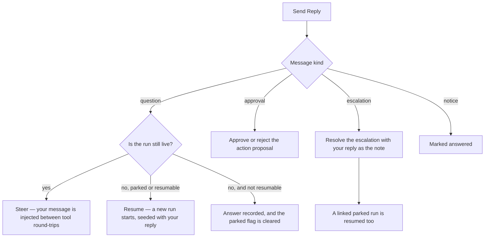

# Inbox (Questions, Approvals, Escalations & Notices)

Autonomous agents get stuck. A requirement is ambiguous, a step is irreversible, a credential is missing, or two directions are equally defensible — and the honest move is to ask the human instead of guessing. The **Inbox** at `/inbox` is where those messages land.

It is the operator message center: one list of everything addressed **to you** by your [Agents](./agents.md), your [Works](./creating-a-work.md) and the platform itself — blocking questions, approval requests, escalations and notices — with an unread count, an archive, and a reply box that routes your answer straight back to the run that is waiting for it.

## What the Inbox is not

Three surfaces in Ever Works look like an inbox. They are different things, and the fastest way to use any of them is to know which one you are looking at.

| Surface                                    | Route               | What it holds                                                                                                            |
| ------------------------------------------ | ------------------- | ------------------------------------------------------------------------------------------------------------------------ |
| **Inbox** (this page)                      | `/inbox`            | Messages **for you** that usually need an answer — a parked run's question, a pending approval, an escalation, a notice. |
| **Notification bell**                      | header dropdown     | The alert that a thing happened, across every category. It links _into_ the Inbox; it is not where you answer.           |
| **Agent email** ([docs](./agent-email.md)) | `/agents/:id/inbox` | Real inbound and outbound **email** for one Agent's mailbox — correspondence with the outside world.                     |

A message arriving in the Inbox also rings the bell and fans out to your enabled notification channels, so you do not have to sit on the page. See [Notifications](./notifications.md).

## The four kinds of message

| Kind           | Written when                                                                                                | What your reply does                                                                                                        |
| -------------- | ----------------------------------------------------------------------------------------------------------- | --------------------------------------------------------------------------------------------------------------------------- |
| **Question**   | An agent calls the `ask_human` tool mid-run because it cannot proceed without a decision only you can make. | Steers the live run, or resumes the parked one seeded with your answer. This is the only kind that leaves a run **parked**. |
| **Approval**   | An agent proposes an action that its guardrails send to a human — the proposal is created `pending`.        | Approves or rejects the underlying action proposal.                                                                         |
| **Escalation** | An agent raises an escalation: it gave up, or hit a decision above its pay grade.                           | Resolves the escalation with your reply as the resolution note, and resumes the linked run when it is parked.               |
| **Notice**     | The platform files an FYI — for example a [budget](./budgets-and-usage.md) threshold crossing on a Work.    | Nothing is routed; the message is simply marked answered. Notices are read-and-move-on.                                     |

Approvals and escalations are **mirrors**: the proposal row and the escalation row remain the system of record for their own lifecycle, and the Inbox item is the message about them. Deciding the same proposal from the approvals queue on the dashboard and from the Inbox therefore cannot double-apply — see [Approvals & Escalations](./approvals-and-escalations.md).

## Finding it

**Sidebar → Inbox** — the first item after Dashboard, and the only navigation entry that carries an unread badge. That placement is deliberate: a message here can be blocking work right now, so it stays one click away.

- The badge shows your unread count, refreshed every 30 seconds (the notification bell's cadence), and renders `99+` above ninety-nine. No badge at all means nothing is unread — never a grey `0`.
- Two views: **Active** (`/inbox`, everything not archived) and **Archived** (`/inbox?view=archived`).
- The bell's **Open inbox** action carries a deep link, `/inbox?id=<itemId>`, so you land on the exact message the notification was about rather than on whatever is newest.

## Reading a message

The page is two panes. On the left, the message list; on the right, the detail and the reply box.

Each row shows an unread dot, an icon and a coloured badge for the kind, the title, the first ~140 characters of the body, and the time it arrived. Selecting a row opens it in the detail pane and marks it read.

The detail pane shows the full body as plain text — inbox titles and bodies are **never rendered as markup**, because a question is authored by a model and a notice by the platform. An open question also carries a banner:

> The agent is waiting for your reply. Its run is paused until you answer.

Once a message has been answered, the composer is replaced by a **Your reply** block showing the option you picked, your free text and the time you sent it.

## Answering a question

An `ask_human` question can arrive with structured options — the agent's own suggested answers, one of which may be flagged **Recommended**. You have three ways to answer:

1. **Pick an option.** Radio cards under _Choose an answer_; a recommended option is labelled as such.
2. **Pick "Other (write your own)"** and type the answer yourself.
3. **Just write.** When there are no options, the reply box is the whole composer.

Then press **Send Reply**. Replies are capped at 8,000 characters. Picking an option _and_ writing text is allowed: the agent receives them composed as `<option label> — <your text>`.

### What happens when you press Send



The toast after sending tells you which of those actually happened, because they are materially different outcomes:

| Outcome                 | What you see                                        | Meaning                                                                            |
| ----------------------- | --------------------------------------------------- | ---------------------------------------------------------------------------------- |
| `steered`               | "Reply delivered — the running agent picked it up." | The run was still live; your message joins its pending-input queue.                |
| `resumed`               | "Reply delivered — a new run is answering it."      | The parked run was resumed as a fresh run carrying the original's session context. |
| `approved` / `rejected` | "Approved." / "Rejected."                           | The action proposal was decided.                                                   |
| `escalation-resolved`   | "Escalation resolved."                              | The escalation is closed with your note.                                           |
| `already-decided`       | "This was already decided elsewhere."               | Someone (or another tab) got there first; your reply changed nothing.              |
| `none`                  | "Reply recorded."                                   | Nothing downstream to route to — the answer is still stored on the message.        |

A message can only be answered **once**. The row is claimed before anything is routed, so a double submit or two open tabs cannot resume the same question twice and pay for both runs; the loser gets `already-decided`. Answering an already-answered message through the API is a `409`.

### Approvals are option-only

An approval message offers exactly **Approve** and **Reject**, with no free-text alternative and no recommended branch — the guardrail layer already auto-decided everything it had an opinion about, so a proposal that reaches you is one the platform will not nudge either way. A reply that names neither option is rejected before anything is claimed.

## Housekeeping

Every row has a **⋮ Message actions** menu:

| Action                            | Effect                                                                                                               |
| --------------------------------- | -------------------------------------------------------------------------------------------------------------------- |
| **Mark as read / Mark as unread** | Read state is independent of whether the message was answered — an answered message can stay unread, and vice versa. |
| **Archive** / **Move to Active**  | Moves the message between the Active and Archived views. Archiving does not answer it.                               |
| **Delete**                        | Removes the message. The records it mirrors — the escalation, the proposal, the run — are untouched.                 |

The list also polls every 30 seconds so messages that arrive while the tab sits open show up on their own. The poll pauses while a reply is in flight, so a refresh can never yank the text out from under you.

## How to answer a blocking question

1. The badge appears on **Sidebar → Inbox** (or the bell rings, or your Slack/Discord/Telegram channel does — see [Notifications](./notifications.md)).
2. Open **Sidebar → Inbox**. The **Active** view is selected by default, newest first.
3. Select the message. The amber banner tells you the agent's run is paused waiting on this answer.
4. Read the body — the agent's `context` (what it tried, what is at stake, what each option implies) is appended under the question.
5. Choose the recommended option, choose another option, pick **Other (write your own)**, or type your answer in the reply box.
6. Press **Send Reply** and read the toast: _picked it up_ means the live run took your message; _a new run is answering it_ means the parked run was resumed.
7. Follow the run in **Sidebar → Teams → Sessions** if you want to watch it land — see [Sessions & Steering](./sessions-and-steering.md).
8. **Archive** the message when you are done with it.

## How an agent asks you

Agents reach the Inbox through the `ask_human` tool. It is available to **every** Agent with no permission gate on purpose: asking its owner a question grants nothing and touches nothing, and a gated question tool just pushes agents back to guessing.

| Argument   | Required | Purpose                                                                                             |
| ---------- | -------- | --------------------------------------------------------------------------------------------------- |
| `question` | yes      | The question. Its first line becomes the message title.                                             |
| `options`  | no       | Structured answers, `[{ id, label, description? }]` — up to 12, so you can answer with one click.   |
| `context`  | no       | Background: what the agent tried, what is at stake, what each option implies. Appended to the body. |

Calling it **parks the run**: the run's `awaitingInput` flag is set, the tool tells the model in words to end its turn with a status summary, and the idle sweeper is forbidden from reaping a run while it waits. Your reply is what un-parks it.

The recipient, the Agent and the run are bound from the run context at tool-build time and are **never model-supplied**, so a prompt-injected agent cannot point your answer at somebody else's run. A run that is not yours is treated as absent: the message is still filed, just without run links.

## Producers

| Producer           | Source                                                                      | Kind         | Idempotency                                       |
| ------------------ | --------------------------------------------------------------------------- | ------------ | ------------------------------------------------- |
| `askHuman`         | The `ask_human` agent tool, called inside a run.                            | `question`   | One call, one message.                            |
| `proposalPending`  | An action proposal created in the `pending` state by the approvals service. | `approval`   | One message per proposal id.                      |
| `escalationRaised` | An escalation recorded by the escalation service.                           | `escalation` | One message per escalation id.                    |
| `notice`           | Platform listeners — e.g. a Work budget threshold crossing.                 | `notice`     | Deduplicated upstream by the producing subsystem. |

Every producer writes **additively**. The escalation, the proposal and the run keep their own lifecycles; the Inbox row is the message about them, and it deliberately survives their deletion — _"what did the agent ask me last week?"_ is still a valid question after the run is gone.

Each write also files an activity row (`INBOX_ITEM_CREATED`, and `INBOX_ITEM_ANSWERED` when you reply), so the Inbox is fully auditable from [Activity](./activity.md).

## API

Everything the page does is available over the REST API. All routes are owner-scoped: a message belonging to someone else and a message that does not exist return the same `404`.

| Method   | Route                      | Purpose                                                                                                                                                     |
| -------- | -------------------------- | ----------------------------------------------------------------------------------------------------------------------------------------------------------- |
| `GET`    | `/api/inbox`               | List your messages, newest first. `?status=open\|answered\|archived`, `?limit=` (1–100, default 50), `?offset=`. Omitting `status` returns the Active view. |
| `GET`    | `/api/inbox/unread-count`  | `{ count }` — what the sidebar badge polls.                                                                                                                 |
| `GET`    | `/api/inbox/:id`           | One message.                                                                                                                                                |
| `POST`   | `/api/inbox/:id/reply`     | `{ text?, optionId? }` — answer it. Throttled to 30 replies per minute.                                                                                     |
| `PATCH`  | `/api/inbox/:id/read`      | Mark read. `{ "unread": true }` flips it back.                                                                                                              |
| `POST`   | `/api/inbox/:id/archive`   | Archive.                                                                                                                                                    |
| `POST`   | `/api/inbox/:id/unarchive` | Restore to Active.                                                                                                                                          |
| `DELETE` | `/api/inbox/:id`           | Delete the message. The mirrored records survive.                                                                                                           |

The list response is `{ data, meta: { total, limit, offset, unreadCount } }`. A reply responds `{ item, routed, runId? }`, where `routed` is one of the outcomes in the table above and `runId` names the run that was steered or newly dispatched.

```bash
# What is waiting on me right now?
curl "http://localhost:3100/api/inbox?status=open&limit=20" \
  -H "Authorization: Bearer <token>"

# Answer one question: pick an option, add a sentence of your own
curl -X POST http://localhost:3100/api/inbox/<item-id>/reply \
  -H "Authorization: Bearer <token>" \
  -H "Content-Type: application/json" \
  -d '{
    "optionId": "ship-it",
    "text": "Go ahead, but keep the old route as a redirect."
  }'
```

## Delivery

When a message is filed, the platform creates the in-app bell row (deduplicated per message, with an **Open inbox** action pointing at `/inbox?id=<itemId>`) and dispatches to your enabled notification channels under one of four event keys:

| Kind         | Event key                  | Urgency |
| ------------ | -------------------------- | ------- |
| `question`   | `inbox_question`           | Warning |
| `approval`   | `inbox_approval_requested` | Info    |
| `escalation` | `inbox_escalation`         | Info    |
| `notice`     | `inbox_notice`             | Info    |

Quiet hours and category mutes apply downstream exactly as they do for every other producer. Notices filed by a subsystem that already notified you — the budget alert is the current example — skip the second ring but still count toward the unread badge.

## Related

- [Approvals & Escalations](./approvals-and-escalations.md) · [Sessions & Run Steering](./sessions-and-steering.md)
- [Notifications](./notifications.md) · [Agent Email & Inboxes](./agent-email.md)
- [Agents](./agents.md) · [Autonomous Operation](./autonomous-operation.md) · [Budgets & Usage](./budgets-and-usage.md) · [Activity](./activity.md)
- API reference: [Notifications](../api/notifications.md) · [Agents](../api/agents.md)
