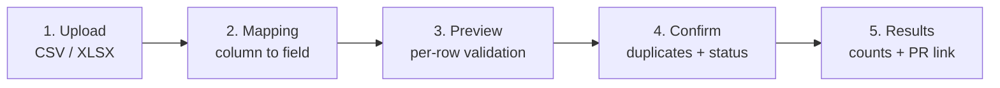

# CSV & Excel Item Import / Export

A directory-shaped [Work](./creating-a-work.md) can hand its whole item list to a spreadsheet and take it back again: **export** every item as CSV or Excel, edit it wherever you like — Excel, Numbers, Google Sheets, a script — and **import** it back through a five-step wizard that maps your columns, validates every row, shows you exactly what will happen, and then writes the rows to the Work's data repository as a single commit or a single pull request.

Both halves are **off by default, per Work**. Nothing appears in the UI and the endpoints answer `404` until an owner opts in, so a public directory cannot have its item list downloaded by anyone who happens to know the route.

## Which Works support it

Bulk item import/export is a **directory-shaped** capability. The per-kind capability registry (`work-capabilities.ts` in `@ever-works/contracts`) records it as:

| Work kind      | Bulk item import / export | Notes                                                                                           |
| -------------- | ------------------------- | ----------------------------------------------------------------------------------------------- |
| `directory`    | Yes                       | The feature was designed for this kind.                                                         |
| `awesome-repo` | Yes                       | Same items model, same column contract.                                                         |
| `default`      | Yes                       | Every Work created before kinds existed. `default` shares the directory capability set exactly. |
| `blog`         | No                        | Its items are **posts**; the fixed column contract below does not describe them.                |
| `website`      | No                        | Its items are **pages**.                                                                        |
| `landing-page` | No                        | No Items tab at all, so there is nowhere for the Export and Import buttons to live.             |
| `company`      | No                        | An organizational shell — no items.                                                             |
| `campaign`     | No                        | Campaign artifacts are not directory items.                                                     |

The runtime gate today is the pair of per-Work settings below plus the presence of the Items tab; the registry above is the statement of intent. Leave the toggles off on Blog and Website Works — the columns are `name` / `description` / `source_url` / `category`, which describes a directory row, not a post or a page.

See [Work Kinds & Capabilities](./work-kinds.md) for the full capability matrix.

## Turning it on

Owners and editors enable the feature per Work:

1. Open the Work → **Settings** tab (`/works/:id/settings`, the **General** sub-tab).
2. Scroll to the **Item Import & Export** section — "Bulk CSV / Excel import and export for directory items" — and expand it.
3. Flip **Enable item export**, **Enable item import**, or both.
4. Optionally change **Max rows per import upload**.
5. Click **Save Settings**.

The three keys are written into `settings:` in the Work's [`.works/works.yml`](./works-config.md), so they travel with the data repository and can equally be hand-authored in a PR:

```yaml
settings:
    # Show the Export dropdown on the Items tab and serve GET /export-items
    export_enabled: true
    # Show the Import button and open the wizard
    import_enabled: true
    # Rows accepted in one upload (1-2000). Default 500.
    import_max_rows: 500
```

| Key               | Type                   | Default | Effect                                                                                                                          |
| ----------------- | ---------------------- | ------- | ------------------------------------------------------------------------------------------------------------------------------- |
| `export_enabled`  | boolean                | `false` | When `false`, the Export dropdown is not rendered and `GET /api/works/:id/export-items` answers `404`.                          |
| `import_enabled`  | boolean                | `false` | When `false`, the Import button is not rendered and every import route answers `404`.                                           |
| `import_max_rows` | integer (1&ndash;2000) | `500`   | Ceiling on rows accepted by one upload. A larger file is rejected with `code: RowCountExceeded` **before** anything is written. |

:::note These keys are not in the works.yml field reference yet

[`.works/works.yml` Configuration](./works-config.md) documents the root keys (`name`, `initial_prompt`, `model`, `website_repo`, `providers`, `agents`, `schedule`). The three `settings.*` keys above are read by the platform's data-repository config layer, and the versioned `works.yml` schema preserves keys it does not itself model, so hand-edits round-trip intact. This page is their reference until the works.yml page catches up.

:::

Saving from the Settings section sends only these three keys and the server deep-merges them, so every other `settings.*` value in your `works.yml` (`categories_enabled`, `header`, `homepage`, `footer`, …) is preserved.

## Exporting items

With `export_enabled` on, the Work's **Items** tab (`/works/:id/items`, Browse sub-tab) grows an **Export** dropdown next to **Add Item**:

- **CSV** — `text/csv; charset=utf-8`, every field quoted, CRLF line endings.
- **Excel (.xlsx)** — a single worksheet named `Items`, header row frozen, 24-character-wide columns.

The download is named `items-export-<YYYY-MM-DD>.csv` (or `.xlsx`). It contains **every** item in the Work's data repository, in the canonical column order below, and it is exactly the shape the importer expects — so an export is also the safest starting point for an import.

Export is available to anyone who can view the Work's items; **Import** additionally requires edit permission on the Work (see [Work Members](./work-members.md)). Every export is written to the [Activity log](./activity.md) as an `EXPORT` / `items.exported` entry carrying the row count and format.

### The column contract

One list of columns drives export, the import template, and the import validator.

| Column           | Required | Type          | Format                                                                        |
| ---------------- | -------- | ------------- | ----------------------------------------------------------------------------- |
| `name`           | Yes      | string        | The item title.                                                               |
| `description`    | Yes      | string        | Short summary.                                                                |
| `source_url`     | Yes      | URL           | Must be `http://` or `https://`. Also used for duplicate detection.           |
| `category`       | Yes\*    | string        | A single category name. \*Supply either `category` or `categories`.           |
| `categories`     | No       | array         | Several categories: `Productivity;Analytics`.                                 |
| `tags`           | No       | array         | `time-tracking;productivity`.                                                 |
| `slug`           | No       | string        | Must match `^[a-z0-9]+(?:-[a-z0-9]+)*$`. Derived from `name` when left empty. |
| `featured`       | No       | boolean       | `true`/`false`/`1`/`0`/`yes`/`no`/`on`/`off`, case-insensitive.               |
| `order`          | No       | integer       | Non-negative sort order.                                                      |
| `brand`          | No       | string        | Brand or vendor name.                                                         |
| `brand_logo_url` | No       | URL           | `http(s)` only.                                                               |
| `images`         | No       | array of URLs | `https://one.example.com/a.png;https://two.example.com/b.png`.                |

Two conventions are worth committing to memory:

- **Arrays use semicolons, not commas** — commas appear inside descriptive cells far more often than semicolons do.
- **Only `http(s)` URLs pass.** `javascript:`, `data:` and `file:` values are rejected at import time rather than being written into your repository. Each element of `images` is validated on its own.

Unparseable booleans degrade to warnings rather than errors; a negative or non-integer `order` is an error.

On export, an item with exactly one category fills `category` and leaves `categories` empty; an item with several fills `categories` and leaves `category` empty. Both round-trip.

### Header aliases

You do not have to rename your spreadsheet's headers before uploading. The auto-mapper matches these (case-insensitive, whitespace-trimmed), and you can override anything it gets wrong in the wizard's Mapping step:

| Your header                                          | Mapped to        |
| ---------------------------------------------------- | ---------------- |
| `name`, `title`, `item name`                         | `name`           |
| `description`, `summary`                             | `description`    |
| `source_url`, `source url`, `url`, `website`, `link` | `source_url`     |
| `category`                                           | `category`       |
| `categories`                                         | `categories`     |
| `tag`, `tags`                                        | `tags`           |
| `sort order`                                         | `order`          |
| `brand_logo_url`, `brand logo url`, `brand logo`     | `brand_logo_url` |
| `image`, `images`, `image_url`, `image_urls`         | `images`         |
| `slug`, `featured`, `order`, `brand`                 | the same field   |

Headers with no match are left unmapped — map them by hand in the wizard, or leave them on `(skip)` and they are ignored.

## Importing items

With `import_enabled` on and edit permission, the Items tab shows an **Import** button that opens the wizard.



| Step           | What happens                                                                                                                                                                                                                                                                            |
| -------------- | --------------------------------------------------------------------------------------------------------------------------------------------------------------------------------------------------------------------------------------------------------------------------------------- |
| **1. Upload**  | Drag a file onto the drop zone or click **Browse file**. `.csv`, `.xlsx` and `.xls` names are accepted. Two links offer **Download sample CSV** / **Download sample Excel** — a template with the canonical headers and two filled example rows. The panel states the row cap in force. |
| **2. Mapping** | A `File column → Item field` table, one dropdown per header, pre-filled by the auto-mapper. Choose `(skip)` to ignore a column; mapping two columns onto the same field is flagged **Already mapped**. **Continue** re-validates with your mapping.                                     |
| **3. Preview** | Four tiles — Total rows / Valid / Invalid / Duplicates — over a per-row table marking each row **Valid**, **Invalid** or **Duplicate**, with its errors (red) and warnings (amber). The first 200 rows are listed. **Continue** stays disabled while zero rows are valid.               |
| **4. Confirm** | Pick **Duplicate handling** (`Skip duplicates` — recommended — or `Update existing items`) and **Default status for new items** (`pending` or `published`), then read the live summary of how many rows will be created, updated or skipped.                                            |
| **5. Results** | Created / Updated / Skipped / Errors counts, the pull-request link when one was opened, a direct-commit note when it was not, and a per-row error list when the executor hit problems.                                                                                                  |

Steps 1&ndash;3 are a **dry run**: the file is parsed and validated server-side, existing items are re-read for duplicate detection, and nothing at all is written. The first write happens when you press **Confirm Import**.

:::caution Stale wording in the Preview step

The Preview panel still carries a line from the feature's staged rollout — "Phase 2 (dry-run) … the Confirm Import step lands in Phase 3". **Confirm Import is live.** Nothing is written until you press it, and pressing it does write.

:::

### What Confirm Import actually does

The executor clones the Work's **data repository** with the Work owner's credentials and you as the commit author, then:

1. Reads `.works/works.yml` to find out whether `autoapproval` is on.
2. Re-reads the repository's existing items, so a change made between Preview and Confirm cannot slip past duplicate detection.
3. Creates a branch `items-import-<timestamp>` when a PR will be needed; otherwise checks out the default branch.
4. Re-validates every row server-side, classifies it as create / update / skip / error, and claims its slug and `source_url` — so two rows in the same file whose names slugify identically cannot silently overwrite each other.
5. Writes each item as `data/<slug>/<slug>.yml`, five rows at a time.
6. Commits once — `Bulk import: N items added`, or `N created, M updated` — and pushes.

Then one of three things happens:

| Situation                                               | Outcome                                                                                                                            |
| ------------------------------------------------------- | ---------------------------------------------------------------------------------------------------------------------------------- |
| `autoapproval: true` in `.works/works.yml`              | The commit lands directly on the default branch, and the Results step says so.                                                     |
| `autoapproval` off (the default)                        | One pull request per import batch, titled after the commit and bodied with the created / updated / skipped / error counts.         |
| Off, and a [quality gate](./quality-gates.md) blocks it | The rows stay committed on the import branch and the result carries a withheld-PR reason naming the gate status — no PR is opened. |

If zero rows would be created or updated, the executor stops before committing: no empty commit, no empty PR.

Nothing is written outside the item YAML. **Markdown bodies are not imported** — add or edit an item's markdown afterwards in the per-item editor on the Items tab. Every import is logged to the [Activity log](./activity.md) as an `IMPORT` / `items.imported` entry.

### Limits and guardrails

| Limit                  | Value                                                         |
| ---------------------- | ------------------------------------------------------------- |
| Upload size            | 10 MB per file                                                |
| Rows per upload        | `import_max_rows` — 500 by default, configurable 1&ndash;2000 |
| Absolute row ceiling   | 2000, clamped server-side however high the setting is set     |
| Parser cap             | 10,000 rows read from a file before anything else runs        |
| Validate requests      | 10 per minute                                                 |
| Execute requests       | 3 per minute                                                  |
| Concurrent item writes | 5                                                             |
| Preview rows rendered  | First 200                                                     |

## How to: export, edit, re-import

A full round trip on a directory Work:

1. **Enable both halves.** `/works/:id/settings` → **Item Import & Export** → turn on export and import → **Save Settings**.
2. **Export what you have.** `/works/:id/items` → **Export** → **CSV** (or **Excel (.xlsx)**). You get `items-export-<date>.csv`.
3. **Edit in your spreadsheet.** Keep the header row exactly as exported. Add rows for new items; edit cells on existing ones. Remember: semicolons inside `categories`, `tags` and `images`; `http(s)` URLs only; leave `slug` blank on new rows and it is derived from `name`.
4. **Save as CSV or `.xlsx`.** Legacy binary `.xls` and password-protected workbooks cannot be parsed — re-save as `.xlsx`.
5. **Import.** `/works/:id/items` → **Import** → drop the file in. Fix the column mapping if anything auto-mapped wrongly, then **Continue**.
6. **Read the Preview.** Invalid rows are skipped by the writer, so fix the file and re-upload rather than importing something half broken.
7. **Confirm.** Choose `Update existing items` if your edits are meant to change items you already have, or `Skip duplicates` if you are only adding new ones. Pick `pending` or `published` for new rows, then **Confirm Import**.
8. **Land it.** Follow the PR link on the Results step and merge it — or, with `autoapproval` on, the commit is already on the default branch. Items appear on the generated site after the next build.

Starting from scratch instead of from an export? Use **Download sample CSV** in step 1 of the wizard: same columns, two worked example rows.

## API

Every route sits on the Works API, requires a session or API key, and is gated by the settings above. See [Works API](../api/works.md) and [API Keys](./api-keys.md).

| Method | Endpoint                                              | Purpose                                                                                                                                                |
| ------ | ----------------------------------------------------- | ------------------------------------------------------------------------------------------------------------------------------------------------------ |
| `GET`  | `/api/works/:id/export-items/settings`                | `{ export_enabled }` — what the UI reads to decide whether to render the Export dropdown.                                                              |
| `GET`  | `/api/works/:id/export-items?format=csv\|xlsx`        | Downloads all items. `404` when export is disabled, `400` on any other `format`.                                                                       |
| `GET`  | `/api/works/:id/import-items/settings`                | `{ import_enabled, import_max_rows }`, with the cap already clamped to the ceiling.                                                                    |
| `GET`  | `/api/works/:id/import-items/sample?format=csv\|xlsx` | The import template (`items-import-template.csv` / `.xlsx`).                                                                                           |
| `POST` | `/api/works/:id/import-items/validate`                | `multipart/form-data`: `file` plus an optional JSON `mapping`. Returns headers, a suggested mapping, per-row validation and a summary. Writes nothing. |
| `POST` | `/api/works/:id/import-items`                         | Executes an import from `{ rows, duplicate_strategy?, default_status? }`. Returns the counts plus `pr_url` / `pr_number`, or `direct_commit`.          |

Export a directory to CSV:

```bash
curl -L -X GET "http://localhost:3100/api/works/<work-id>/export-items?format=csv" \
  -H "Authorization: Bearer <token>" \
  -o items-export.csv
```

Dry-run a file without writing anything:

```bash
curl -X POST "http://localhost:3100/api/works/<work-id>/import-items/validate" \
  -H "Authorization: Bearer <token>" \
  -F "file=@items.csv" \
  -F "mapping={\"URL\":\"source_url\",\"Item Name\":\"name\"}"
```

The `rows` array you post to `/import-items` is the `validationResults` array returned by `/import-items/validate` — validate first, then execute with what it handed back.

## This is not the same as Work Import

Two different features share the word "import":

| Feature                             | What it imports                       | Where it lives                                               |
| ----------------------------------- | ------------------------------------- | ------------------------------------------------------------ |
| **Item import/export** (this page)  | Rows of items inside an existing Work | The Work's **Items** tab                                     |
| **[Work Import](./work-import.md)** | A whole Git repository as a new Work  | `/works/new` → the Import path, and `POST /api/works/import` |

Use Work Import to bring an existing directory or awesome-list repository onto the platform once. Use item import to keep its item list up to date afterwards.

## Troubleshooting

| What you see                                               | Why, and what to do                                                                                                                       |
| ---------------------------------------------------------- | ----------------------------------------------------------------------------------------------------------------------------------------- |
| No **Export** or **Import** button on the Items tab        | The matching toggle is off, or you lack edit permission (Import only). Re-check Settings → Item Import & Export.                          |
| `404 Item export/import is not enabled for this directory` | The same cause, seen from the API side.                                                                                                   |
| `400 code: RowCountExceeded`                               | The file has more rows than `import_max_rows`. Raise the cap (up to 2000) or split the file.                                              |
| `400 code: ParseError` on an Excel file                    | Legacy `.xls` binary or a password-protected workbook. Re-save as `.xlsx`.                                                                |
| `400 code: ParseError` on a CSV                            | Not well-formed UTF-8. Re-export from your spreadsheet as UTF-8 CSV.                                                                      |
| Rows flagged **Duplicate**                                 | An existing item already has that `slug` or `source_url`. Choose `Update existing items` in Confirm to overwrite them.                    |
| Import succeeded but the site is unchanged                 | With `autoapproval` off, the rows are in a pull request. Merge it, then wait for the next build.                                          |
| Counts came back, but no PR link and no direct-commit note | A quality gate withheld the PR. The rows are committed on the `items-import-<timestamp>` branch; see [Quality Gates](./quality-gates.md). |
| Everything validated, but nothing was created              | All rows were duplicates under `Skip duplicates`. The executor skips the commit entirely when nothing would change.                       |

## Known limits

- **Markdown bodies are not part of the contract.** Import creates and updates item YAML only; long-form content is added per item afterwards.
- **The column set is fixed.** Per-directory custom fields are not wired into the mapper yet.
- **Large files are synchronous.** An import runs inside the HTTP request, which is why the ceiling is 2000 rows; there is no background pathway for bigger files yet.
- **The wizard's strings are English-only.** Unlike the rest of the dashboard, this UI is not translated yet.
- **No CLI or MCP surface.** Import and export are dashboard plus REST only today — see [MCP Server](./mcp-server.md) for what is exposed to machines.

## Related

- [Items](./items.md) — the Items tab this feature lives on, and everything else you can do with items
- [Work Import](./work-import.md) — importing a whole repository as a new Work
- [`.works/works.yml` Configuration](./works-config.md) — where `export_enabled`, `import_enabled` and `import_max_rows` are stored
- [Data Management](./data-management.md) — account-level export / import and GitHub sync, which is a different feature
- [Work Kinds & Capabilities](./work-kinds.md) — which kinds have items at all
- [Taxonomy System](./taxonomy-system.md) · [Collections](./collections.md) — where the categories and tags in your columns come from
- [Item Source Validation](./item-source-validation.md) — checking the `source_url` values you just imported
- [Quality Gates](./quality-gates.md) · [Git Operations](./git-operations.md) — what happens to the import branch and its pull request
- [Activity](./activity.md) — the `EXPORT` and `IMPORT` entries every run writes
- [Works API](../api/works.md) — the full REST surface
