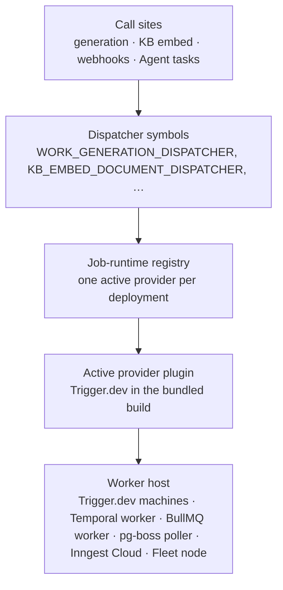

# Job Runtimes

[Workers](./workers.md) answer **what runs in the background** — Agent heartbeats, generation pipelines, scheduled updates, Knowledge Base embedding, webhook delivery. A **job runtime** answers **where that work actually executes**: which queue holds the job, which process picks it up, and whose infrastructure it runs on.

Ever Works ships the runtime as a plugin capability rather than a hard-coded dependency. Six runtimes are bundled, every dispatcher in the platform resolves through one registry instead of importing a vendor SDK, and an `EVER_WORKS_JOB_RUNTIME` selector records which runtime the operator wants. The bundled build registers the Trigger.dev provider in that registry, so for the eleven queue dispatchers the selector is informational today — what has shipped is the seam that makes swapping the engine a registry change rather than a call-site change.

:::info Status: the seam and the surfaces shipped, two bindings deferred
Shipped: the six runtime plugins, the `EVER_WORKS_JOB_RUNTIME` selector with boot-time validation and a boot log line, the dispatcher binding seam over all eleven dispatcher symbols, the **Settings → Job Runtime** screen and its six API endpoints, the audit trail, the operator allow-lists, and the Fleet-node runtime on the Agent-task dispatch path.

Not yet wired: **the selector swapping the registry's active provider**. `packages/tasks/src/trigger/trigger.module.ts` builds the registry by registering the Trigger.dev provider, and nothing else registers a provider anywhere in the API, the tasks package or the agent package. The eleven queue dispatchers therefore route to Trigger.dev whatever the variable says. The value is still validated, logged at boot, honoured on the Agent-run dispatch path (`node`) and read by the Desktop seeding path — making it pick the queue provider is the remaining half.

Not yet wired: **per-tenant credential injection**. When you pick `byo` or `override`, the platform records the choice, the secret pointer, the credential version and an audit row — but runs still execute against the instance-default credentials until the credential-binding work lands. The settings screen does not currently warn about this: its only banners are the per-provider mode blurbs and the allow-list warning. Trigger.dev's bring-your-own blurb — "Bring your own Trigger.dev account + project. Paste the PAT, project secret key, and project ref from your Trigger.dev dashboard." — reads as though the credentials were already in use, which is exactly why this page spells the deferral out. The only other place it is stated is the credentials helper text on that screen: "Per-provider schema-driven forms land in a follow-up sub-story."
:::

:::note Where to find it
**Sidebar → Settings → Job Runtime** (`/settings/job-runtime`) for the per-tenant overlay.

**`/admin/tenants/:tenantId/runtime-allowlist`** for the operator's per-tenant allow-list (platform admins only; every other visitor gets a `404`).

The instance-wide choice is an environment variable on the API — `EVER_WORKS_JOB_RUNTIME` — not a screen.
:::

## Workers versus job runtimes



Three properties of that seam are worth knowing:

- **Call sites never import a vendor SDK.** Every background job goes through a dispatcher symbol; the registry hands the symbol the active provider's dispatch map. All eleven symbols are bound the same way, with no per-job special-casing left — so changing the engine is a change to what the registry registers, not to any call site.
- **One provider is registered today.** `packages/tasks/src/trigger/trigger.module.ts` constructs the registry and registers the Trigger.dev provider; there is no second registration anywhere in the API, the tasks package or the agent package. The eleven dispatchers resolve to Trigger.dev regardless of `EVER_WORKS_JOB_RUNTIME`, and pointing them at another bundled provider means editing that module — there is no operator-facing switch for it yet.
- **A missing runtime degrades instead of exploding.** When no provider is registered, or Trigger.dev is not configured, a dispatch returns `null` rather than throwing. In development the work then runs in-process; an Agent goal that cannot dispatch records the reasoning `Tasks runtime unavailable` instead of a stack trace, and the dashboard raises its own banner — **Background job runtime is not configured.**

## The six bundled runtimes

| Runtime         | Provider id | Plugin package         | Infrastructure it needs                            | Self-hostable                            |
| --------------- | ----------- | ---------------------- | -------------------------------------------------- | ---------------------------------------- |
| **Trigger.dev** | `trigger`   | `job-runtime-trigger`  | Trigger.dev Cloud, or a self-hosted Trigger.dev v4 | Yes — point `apiUrl` at your instance    |
| **Temporal**    | `temporal`  | `job-runtime-temporal` | A Temporal Service (self-hosted) or Temporal Cloud | Yes — the server is MIT-licensed         |
| **BullMQ**      | `bullmq`    | `job-runtime-bullmq`   | Redis (local, self-managed or hosted)              | Yes — you run Redis                      |
| **pg-boss**     | `pgboss`    | `job-runtime-pgboss`   | PostgreSQL only — can reuse the platform's own DB  | Yes — no Redis, no external service      |
| **Inngest**     | `inngest`   | `job-runtime-inngest`  | Inngest Cloud                                      | No — SaaS only, deliberately (see below) |
| **Fleet nodes** | `node`      | `job-runtime-node`     | The machines you enrolled in [Fleet](./fleet.md)   | Yes — the machines are yours             |

`trigger` is the default and the zero-config path: a deployment that never sets the selector behaves exactly as it did before runtimes became pluggable.

**pg-boss is the "just Postgres" answer.** BullMQ is Redis-only by construction — it is built on Redis data structures and has no Postgres backend — so the Postgres-native option is a separate provider. With pg-boss selected, a complete self-hosted Ever Works runs on a single Postgres instance with no Redis and no external service.

**Inngest is SaaS-only on purpose.** Inngest's server is released under the SSPL, whose "offering the software as a service" clause makes embedding a self-hosted Inngest inside a commercial multi-tenant platform legally fraught. The plugin therefore supports Inngest Cloud and ships no self-host path. If you want a runtime you own end to end, choose Temporal, BullMQ or pg-boss.

### How the runtimes differ in practice

| Behaviour               | Trigger.dev             | Temporal            | BullMQ                           | pg-boss                   | Inngest                  |
| ----------------------- | ----------------------- | ------------------- | -------------------------------- | ------------------------- | ------------------------ |
| Push or pull            | Push (platform invokes) | Pull (worker polls) | Pull (worker polls)              | Pull (poller on Postgres) | Push (cloud calls HTTP)  |
| Native cron             | `schedules.task`        | Schedules API       | Repeatable jobs / `JobScheduler` | `schedule()`              | Cron functions           |
| Cancel an in-flight run | Native signal           | Native cancellation | Cooperative flag                 | Cooperative flag          | `cancelOn` / cancel API  |
| Idempotency primitive   | `idempotencyKey`        | Workflow id         | Job id                           | Job id / singleton key    | Event idempotency id     |
| Multi-hour runs         | Yes (`maxDuration`)     | Best in class       | Tune lock renewal                | Tune visibility / expiry  | Express the run as steps |
| Official SDK used       | `@trigger.dev/sdk`      | `@temporalio/*`     | `bullmq`                         | `pg-boss`                 | `inngest`                |

Every provider uses the vendor's official SDK — no hand-rolled REST clients — and each plugin declares the `job-runtime` capability set (`job-runtime-enqueue`, `-cancel`, `-status`, `-schedule`, `-bind-tenant`) so the registry can resolve it like any other [plugin](./plugins.md).

Whatever you pick, the user-visible surface is identical: generation history, run status, cancellation and schedules behave the same way, because they are recorded by the platform rather than by the runtime.

## Choosing the runtime for a self-hosted instance

The instance's runtime preference is a single environment variable on the API:

```env
EVER_WORKS_JOB_RUNTIME=pgboss   # trigger (default) | temporal | bullmq | pgboss | inngest | node
```

The API validates the value at boot and tells you what it resolved:

- Unset, or `trigger`, logs `Active job-runtime provider: 'trigger' (default).`
- Any other recognised id logs the same line marked **experimental** — a deliberate warning that stays until the provider is green on the shared conformance suite.
- A typo logs a warning and falls back to `trigger` rather than refusing to boot, so a bad deploy manifest degrades to the default instead of taking the API down. That warning names the five queue-backed ids — `trigger | temporal | bullmq | pgboss | inngest` — because the log line predates the `node` runtime and does not list it.

Each provider reads its own credentials from the standard plugin settings schema, which means environment variables work as the operator-facing form of every field:

| Runtime     | Environment variables                                                                                                                                                                                 | Notes                                                                                                   |
| ----------- | ----------------------------------------------------------------------------------------------------------------------------------------------------------------------------------------------------- | ------------------------------------------------------------------------------------------------------- |
| Trigger.dev | `TRIGGER_SECRET_KEY`, `TRIGGER_PROJECT_REF`, `TRIGGER_API_URL`                                                                                                                                        | `TRIGGER_API_URL` only for a self-hosted instance                                                       |
| Temporal    | `TEMPORAL_ADDRESS`, `TEMPORAL_NAMESPACE`, `TEMPORAL_TLS_CERT`, `TEMPORAL_TLS_KEY`                                                                                                                     | The PEM pair is for mTLS clusters such as Temporal Cloud                                                |
| BullMQ      | `BULLMQ_REDIS_URL`, `BULLMQ_QUEUE_PREFIX`                                                                                                                                                             | Prefix defaults to the platform namespace when blank                                                    |
| pg-boss     | `PGBOSS_CONNECTION_STRING`, `PGBOSS_SCHEMA`                                                                                                                                                           | Can point at the platform's own database; schema defaults `pgboss`                                      |
| Inngest     | `INNGEST_EVENT_KEY`, `INNGEST_SIGNING_KEY`                                                                                                                                                            | Inngest Cloud only                                                                                      |
| Fleet nodes | `FLEET_NODE_API_URL`, `FLEET_NODE_LEASE_TTL_SECONDS`, `FLEET_NODE_REQUIRED_CAPABILITIES`, `FLEET_NODE_AGENT_TASK_COMMAND`, `FLEET_NODE_AGENT_TASK_WORKSPACE`, `FLEET_NODE_AGENT_TASK_ENV_PASSTHROUGH` | All six `x-envVar` names the plugin declares; see [Fleet nodes as a runtime](#fleet-nodes-as-a-runtime) |

Secret-marked fields (`x-secret`) are never returned by any API response, and nothing about the choice is visible to the people using your instance.

:::caution The variable does not yet move the queue dispatchers
The selector, the registry and the dispatcher bindings are shipped, and the bundled deployment registers the Trigger.dev provider as the active one — the only provider registration in the codebase. Flipping `EVER_WORKS_JOB_RUNTIME` to another id today changes the boot log, the Agent-run routing decision and the Desktop seeding marker, but **not** which provider the eleven queue dispatchers resolve: they keep dispatching to Trigger.dev, and return `null` only when Trigger.dev itself is unconfigured. Moving them is two more pieces of operator work — run that runtime's worker host, and register its plugin in `packages/tasks/src/trigger/trigger.module.ts` so the registry hands out its dispatch map, which is a code change rather than a setting today. Each provider package says the same thing in its own description: per-task dispatching is operator-provisioned.
:::

### How to: run a self-hosted Trigger.dev webapp with Docker Compose

The repository ships an optional Compose layer for a local Trigger.dev v4 **webapp**, gated behind the `trigger` profile:

1. Set `TRIGGER_SECRET_KEY` and the other Trigger.dev values in `.env.compose`.
2. Bring the profile up alongside the main stack:

    ```bash
    docker compose \
      -f docker-compose.yml -f docker-compose.trigger.yml \
      --profile trigger up -d
    ```

3. Open the Trigger.dev management UI it serves at `http://localhost:3040` (`TRIGGER_WEBAPP_PUBLISH_PORT`). Its Postgres and Redis are offset from the platform's own (5432 → 5433, 6379 → 6389) so both stacks coexist on one Docker network.
4. Point the API at it by setting the Trigger.dev API URL to that webapp instead of `https://api.trigger.dev`.

:::warning This layer queues jobs but does not execute them
`docker-compose.trigger.yml` ships the **webapp only**. A full Trigger.dev self-host also needs the supervisor, runner containers, a Docker socket proxy and object storage. Without those, submitted jobs sit in the queue forever. Use it to browse the UI and to exercise the connection and auth path locally — and for jobs that actually run, use Trigger.dev Cloud, follow the upstream production self-host template, or pick a runtime whose worker you run yourself (Temporal, BullMQ, pg-boss).
:::

## Settings → Job Runtime

`/settings/job-runtime` is where an organization decides how it relates to the platform's runtime choice. The page opens with six read-only badges describing the current state:

| Badge                  | What it shows                                                                                      |
| ---------------------- | -------------------------------------------------------------------------------------------------- |
| **Active mode**        | `Inherit (platform default)`, `Bring your own credentials`, or `Override provider and credentials` |
| **Active provider**    | The saved provider, or **Platform default** while inheriting                                       |
| **Credential version** | A monotonic counter that bumps on every credential change, rotation or force-invalidate            |
| **Credential pointer** | The redacted secret-store reference, or **None**                                                   |
| **Last updated**       | When the overlay row last changed                                                                  |
| **Enabled**            | Whether the overlay is active at all                                                               |

Below them sits the editable form: a **Provider** picker, a **Mode** picker, an **Enabled** switch, and — for any mode other than inherit — the credentials block.

### The three modes

| Mode                                  | What it means                                                                                                                                 | Credentials             |
| ------------------------------------- | --------------------------------------------------------------------------------------------------------------------------------------------- | ----------------------- |
| **Inherit (platform default)**        | Use the instance's runtime and the platform's credentials. The default for every organization, and identical to having no overlay row at all. | None stored             |
| **Bring your own credentials**        | Same provider as the platform default, your own account behind it.                                                                            | Secret pointer required |
| **Override provider and credentials** | A different provider from the operator's allow-list, with your own credentials.                                                               | Secret pointer required |

`byo` and `override` resolve identically today; the distinction is kept so operator policy can later gate an override differently from a bring-your-own (for example, "override needs operator approval").

**Enabled** is a soft kill-switch: turning it off leaves the row and its pointer in place but makes the resolver treat the organization as inheriting. It is the fastest way back to a known-good state without losing what you configured.

### Credentials: a pointer, not a paste-box

The platform never stores plaintext runtime credentials. The **Secret pointer** field takes an opaque reference (up to 128 characters) into your secret store, resolved by whichever [secret-store plugin](./plugins.md) the operator wired — the default build resolves `inline:` references only:

```text
vault:secret/tenants/acme/temporal
k8s:tenant-acme-temporal-credentials
infisical:<workspaceId>/prod/tenants/acme
doppler:ever-works/prod/TENANT_ACME_TEMPORAL
```

Under the pointer, the form renders the field set for the provider you selected, so you know exactly what to provision on the other side:

| Provider    | Fields the form asks for                                                                                                              |
| ----------- | ------------------------------------------------------------------------------------------------------------------------------------- |
| Trigger.dev | Personal Access Token (`tr_pat_…`), Project Secret Key (`tr_prod_…` / `tr_dev_…`), Project Ref (`proj_…`), API URL (self-hosted only) |
| Temporal    | Namespace (required), address, TLS client certificate and key (PEM, for mTLS)                                                         |
| BullMQ      | Redis URL (required), queue prefix                                                                                                    |
| pg-boss     | Postgres connection string (required), schema                                                                                         |
| Inngest     | Event key and signing key (both required)                                                                                             |
| Fleet nodes | Platform API URL, lease TTL, required capability tags — none of them secret                                                           |

Secret fields render masked with a reveal toggle, and each field names the environment variable an operator would use for the same value.

:::caution What the save actually persists
**Save** posts the provider, the mode, the enabled flag and the secret pointer. The per-provider values you type are validated in the browser and shown as the shape to provision — they are not sent to the server, and no reachability probe runs against them on save. Until per-tenant credential injection lands, a saved `byo` or `override` row records intent, bumps the credential version and writes an audit row, while dispatch continues to use the instance-default credentials.
:::

### The four actions

| Button                | What it does                                                                                                                          |
| --------------------- | ------------------------------------------------------------------------------------------------------------------------------------- |
| **Save**              | Upserts the overlay row, bumps the credential version when the pointer changed, writes an audit row                                   |
| **Rotate credential** | Bumps the version only. In-flight runs keep the version they captured and drain gracefully; new work resolves against the new one     |
| **Force invalidate**  | Break-glass. Bumps the version and writes a `force_invalidate` audit row. Confirmation dialog; rate-limited to one call per minute    |
| **Revert to inherit** | Clears the pointer, bumps the version and routes future jobs through the platform default. Keeps the audit trail. Confirmation dialog |

Use **Rotate** for routine rotation after you have changed the secret in your store. Reach for **Force invalidate** only when credentials are believed compromised — a leaked secret, an offboarded contractor — or when you are deliberately testing the drop path. Its in-flight kill is the piece still landing with the worker-host work; today it bumps and audits.

### How to: point your organization at your own Trigger.dev project

1. In the Trigger.dev dashboard, create an organization if you do not have one, then **Create new project**. The dashboard generates the `proj_…` reference.
2. Open the project's **API Keys** page and copy the server-side secret key — `tr_prod_…` for production, `tr_dev_…` for development.
3. In your Trigger.dev user settings, create or reuse a personal access token (`tr_pat_…`).
4. Store all three in your secret store and note the reference you will use as the pointer.
5. In Ever Works, go to **Sidebar → Settings → Job Runtime**, set **Provider** to `trigger` and **Mode** to **Bring your own credentials**.
6. Paste the secret pointer, fill in the PAT, project secret key and project ref, and add the API URL only if your Trigger.dev is self-hosted.
7. Click **Save** and confirm the badges update — **Active mode** reads `Bring your own credentials` and **Credential version** has advanced.

While the credential-injection work is outstanding, step 7 is where the honesty note bites: the row is saved and audited, and dispatch keeps using the instance default until that lands. Nothing you configure now needs redoing later.

### How to: manage the overlay over the API

| Operation              | Endpoint                                           | Notes                                                                    |
| ---------------------- | -------------------------------------------------- | ------------------------------------------------------------------------ |
| Read the overlay       | `GET /api/account/job-runtime/config`              | Credentials redacted; returns a synthetic `inherit` when no row exists   |
| List allowed providers | `GET /api/account/job-runtime/available-providers` | The operator's allow-list — what the picker renders                      |
| Upsert                 | `PUT /api/account/job-runtime/config`              | `400` when the pointer is missing outside inherit, or present in inherit |
| Rotate                 | `POST /api/account/job-runtime/rotate`             | `404` when the organization has no overlay row                           |
| Force-invalidate       | `POST /api/account/job-runtime/force-invalidate`   | `404` when there is no overlay row; `429` beyond one call per minute     |
| Revert to inherit      | `DELETE /api/account/job-runtime/config`           | Idempotent; keeps the row for the audit trail                            |

There is no tenant id in any path — the organization comes from your session, so a compromised client cannot aim a write at somebody else's row. Callers with no organization yet get a `403` telling them to create one first.

```bash
curl -X PUT https://api.ever.works/api/account/job-runtime/config \
  -H "Authorization: Bearer $EVERWORKS_API_KEY" \
  -H "Content-Type: application/json" \
  -d '{
    "providerId": "temporal",
    "mode": "override",
    "credentialsSecretRef": "vault:secret/tenants/acme/temporal",
    "enabled": true
  }'
```

Every mutation writes a row to the job-runtime audit table with the actor, the action, redacted before/after snapshots, the credential version, and the operator allow-list that was in force at that moment — which is what answers "why is this organization still on a provider we disabled last month?".

## Operator controls

### The instance-wide allow-list

Operators decide which of the bundled providers organizations may pick at all:

```env
EVER_WORKS_TENANT_RUNTIME_ALLOWED_PROVIDERS=trigger,temporal
```

| Value                      | Result                                                                          |
| -------------------------- | ------------------------------------------------------------------------------- |
| Unset                      | Every bundled provider is offered (fail-open)                                   |
| Empty or whitespace        | Treated as unset                                                                |
| `trigger,temporal`         | Only those two appear in the picker, in that order                              |
| `Trigger, TEMPORAL`        | Trimmed and lower-cased; declared order preserved                               |
| `trigger,trigger,temporal` | De-duplicated, order preserved                                                  |
| `trigger,unknownid`        | Unknown ids dropped silently; `trigger` remains                                 |
| All ids unknown            | Falls back to the full bundled list — a typo must not strand every organization |

The declared order is the order the picker renders, so put your preferred provider first.

Removing a provider from the list is a **soft disable**: existing rows stay, runs continue, and the organization's settings page shows a banner telling them to revert or re-pick. New writes against the disabled provider are refused with a `400` naming what is allowed. Rows are never silently migrated or auto-reverted.

### The per-tenant allow-list screen

`/admin/tenants/:tenantId/runtime-allowlist` narrows a single organization to a subset of the instance-wide list. The screen shows the tenant id, a checkbox per provider, **Save allow-list** and **Clear (inherit global)**, plus a banner describing the current state — inheriting the global list, restricted to a named set, or gated off.

| Endpoint                                                               | What it does                                                   |
| ---------------------------------------------------------------------- | -------------------------------------------------------------- |
| `GET /api/operator/tenants/:tenantId/runtime-allowlist`                | Lists the rows and echoes whether per-tenant gating is enabled |
| `PUT /api/operator/tenants/:tenantId/runtime-allowlist`                | Replaces the whole set atomically; an empty array clears it    |
| `DELETE /api/operator/tenants/:tenantId/runtime-allowlist/:providerId` | Removes one provider; `404` when it was not in the set         |

All three require a platform admin, and every change writes an `operator_allowlist_change` audit row. The instance's allow-list and gating flag are themselves audited once per boot as an `operator_allowlist_boot` row, so you can correlate a policy change with the deploy that introduced it.

:::caution Per-tenant narrowing is recorded, not yet enforced
The table, the API, the screen and the audit rows are shipped, and the intersection resolver (`global ∩ per-tenant`, with an empty set meaning "inherit the global list") ships behind `EVER_WORKS_TENANT_RUNTIME_PER_TENANT_GATING`. What the picker and the save-time validation read today is still the instance-wide list, so treat per-tenant rows as policy you are recording ahead of enforcement. The screen says the same thing in its banner when the flag is off.
:::

## Fleet nodes as a runtime

The `node` runtime has no broker at all: **the queue is the machines you enrolled in [Fleet](./fleet.md)**. Enqueueing writes a leasable job row; your nodes poll for work over the outbound-only channel they already use for heartbeats, and results come back the same way. No inbound port is ever opened on your machine.

| Setting                         | What it controls                                                                                                                                                                                                                                 |
| ------------------------------- | ------------------------------------------------------------------------------------------------------------------------------------------------------------------------------------------------------------------------------------------------ |
| Platform API URL                | The origin nodes poll, for example `https://api.ever.works`                                                                                                                                                                                      |
| Lease TTL (seconds)             | How long a node holds a claim before it must renew; a node that dies has its work re-offered                                                                                                                                                     |
| Required capability tags        | Tags a node must advertise to be eligible, for example `workspace,git`. Blank means any node                                                                                                                                                     |
| Agent task command              | The command a node runs for one `agent-task` job, with `{taskId}`, `{runId}` and `{agentId}` substituted in. Blank makes a dispatched run fail on the node naming this setting rather than succeed at nothing                                    |
| Agent task workspace            | The absolute directory **on the node** those steps run in. Blank lets the node use its own working directory                                                                                                                                     |
| Agent task credential env names | The environment variable **names** a step may read from the node's own environment. Only the name travels — the value is read on the node and never leaves it. Blank inherits the four well-known Claude/Codex names; a single space grants none |

Two boundaries are deliberate:

- **A node runs command-shaped work.** It has no model access and no platform credentials, so what it executes is a command and an exit code — the agent-task command template, with the platform ids substituted in.
- **The fleet serves the Agent-run dispatch path, not the whole platform.** Selecting `node` routes Agent-task execution to your machines; it does not replace the dispatchers that need model access and platform credentials (generation, Knowledge Base embedding, webhook delivery), which stay on the instance runtime. Routing honours the same precedence as everything else: the instance selector, overlaid by an enabled, non-inherit organization row, with any lookup failure falling back to the instance default rather than blocking the dispatch.

`FLEET_NODE_RUNTIME_ENABLED=false` is the operator kill switch: it wins over both `EVER_WORKS_JOB_RUNTIME=node` and any organization overlay pointing at the fleet, so you can stop routing work to enrolled machines without editing either.

## The Desktop app's runtime picker

The [Desktop App](./desktop-app.md) makes the same choice at install time. Its local-stack wizard walks **welcome → mode → prereq → runtime → env → boot → open**, and the **runtime** step offers BullMQ (the recommended default for all-in-one installs, paired with the bundled Compose Redis), pg-boss (the zero-Redis option over the same Postgres the platform uses), Temporal, Trigger.dev, Inngest and Fleet nodes — one entry per bundled plugin, with each runtime's own fields pre-filled with sensible local defaults.

The wizard writes the selection into the environment file it generates for the API and web processes it supervises: `EVER_WORKS_JOB_RUNTIME` so the supervised API boots on the runtime you chose, and `EVER_WORKS_DESKTOP_JOB_RUNTIME` as the wizard's marker. Because the wizard runs before anyone has signed in, the API reads that marker later and seeds the overlay row for the organization the first time one exists — which is why a fresh desktop install already shows its runtime on `/settings/job-runtime` without you configuring anything twice.

## What is wired, and what is not

| Capability                                                                           | Status                                                                                                      |
| ------------------------------------------------------------------------------------ | ----------------------------------------------------------------------------------------------------------- |
| Six runtime plugins implementing the `job-runtime` capability                        | Shipped                                                                                                     |
| `EVER_WORKS_JOB_RUNTIME` selector, boot validation and log line                      | Shipped — validated at boot, logged, and read by the Agent-run router and Desktop seeding                   |
| `EVER_WORKS_JOB_RUNTIME` switching the dispatcher registry to a non-Trigger provider | Not yet wired — the registry is bound to Trigger.dev in `packages/tasks/src/trigger/trigger.module.ts`      |
| Dispatcher seam binding every dispatcher symbol through the registry                 | Shipped                                                                                                     |
| Non-default providers                                                                | Ship as experimental — a boot warning, and not yet selectable for the queue dispatchers (see the row above) |
| **Settings → Job Runtime** screen, six endpoints, audit trail                        | Shipped                                                                                                     |
| Instance-wide operator allow-list                                                    | Shipped, enforced on the picker and on save                                                                 |
| Per-tenant allow-list table, API and admin screen                                    | Shipped; the intersection sits behind a flag and is not yet read by the picker                              |
| Per-tenant BYO / override credential injection at dispatch                           | Deferred — the choice, version and audit row are recorded; runs use the instance default                    |
| Per-tenant worker-host routing (webhooks, namespace pollers, queue prefixes)         | Deferred, after credential injection                                                                        |
| Reachability probe on save                                                           | Deferred — nothing is dialled when you click **Save**                                                       |
| Force-invalidate dropping in-flight runs                                             | Deferred — today it bumps the version and audits                                                            |
| Fleet `node` runtime on the Agent-task dispatch path                                 | Shipped                                                                                                     |

## Related

- [Workers](./workers.md) · [Fleet](./fleet.md) · [Desktop App](./desktop-app.md)
- [Plugins](./plugins.md) · [Settings Map](./settings-map.md) · [Scheduled Updates](./scheduled-updates.md)
- [Trigger.dev Integration](../devops/trigger-dev.md) · [Docker Compose](../devops/docker-compose.md) · [Kubernetes Deployment](./k8s-deployment.md)
