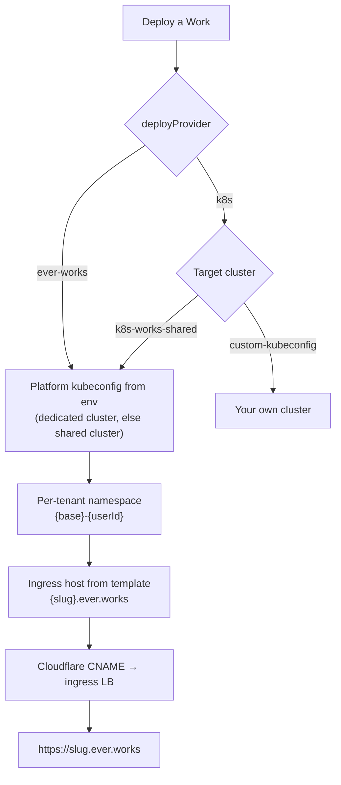

# Managed Hosting: Subdomains, Database & DNS

**Managed hosting** is the zero-infrastructure path for a [Work](./creating-a-work.md): you pick **Ever Works** as the deploy target and the platform supplies everything a deployed site needs — a public `<slug>.ever.works` address with its DNS record, a PostgreSQL database provisioned for that Work, optionally the Git repository the Work lives in, and the cluster it runs on. There is no kubeconfig to paste, no registry to wire, no DNS zone to own.

It is the same deploy pipeline as [Kubernetes Deployment](./k8s-deployment.md) — the difference is **who holds the credentials**. On the managed path the kubeconfig, the DNS token and the database admin connection all belong to the platform and never reach your account; on the bring-your-own path they are yours.

:::tip When to use this
Choose **Ever Works** when you want a Work live at a real URL in one deploy and have no infrastructure preference. Choose **Vercel** when you already run a Vercel team. Choose **Kubernetes** when you need the site on a cluster you control — see [Kubernetes Deployment](./k8s-deployment.md).
:::

## The three deploy options

The choice is made in the [onboarding wizard](./onboarding.md) at **Step 5 — Your deployment**, and it is applied when a Work is created:

| Option         | Provider id  | What you supply                        | What the platform supplies                                                                         |
| -------------- | ------------ | -------------------------------------- | -------------------------------------------------------------------------------------------------- |
| **Ever Works** | `ever-works` | Nothing.                               | Cluster, namespace, ingress host, `*.ever.works` DNS record, and (when enabled) the database.      |
| **Vercel**     | `vercel`     | Your Vercel API token.                 | The deploy workflow and domain sync.                                                               |
| **Kubernetes** | `k8s`        | A kubeconfig, or a platform cluster.\* | Manifests, registry auth, ingress; DNS only when the managed-subdomain mode is on for this deploy. |

\* The Kubernetes provider can also target a **platform-managed** cluster instead of your own: its **Target cluster** setting offers `k8s-works-shared` (the Ever Works shared customer cluster, the default) alongside `custom-kubeconfig`. That is the second shape of managed hosting — the same platform cluster, reached through the `k8s` provider. The full decision matrix lives in [Managed Deployment & Cluster Sources](../advanced/managed-deployment.md).

Two things are worth knowing before you count on the `ever-works` provider:

- **It is env-gated.** The option is only persisted on a new Work when the platform has `DEPLOY_EVER_WORKS_ENABLED` turned on. If it is off, Work creation logs the fallback and stores `vercel` instead — so a Work is never left pointing at a provider that cannot resolve.
- **It is capped per account.** Creating a Work on `ever-works` checks a per-user cap on active managed Works (default **3**, `EVER_WORKS_DEPLOY_MAX_WORKS_PER_USER`) and fails before any repository is created if you are over it. The onboarding card states the cap.

Because `ever-works` is a platform provider rather than a registered deploy plugin, the **provider selector on the Deploy tab lists the installed deploy plugins** (Vercel, Kubernetes). Switching an existing Work to the managed provider from that dropdown is not supported — `PATCH /api/works/:id { deployProvider }` rejects any id that is not a registered plugin with `Unsupported deploy provider: …`.

## What a managed Work gets

| Piece               | What it is                                                                               | Backed by                                                         |
| ------------------- | ---------------------------------------------------------------------------------------- | ----------------------------------------------------------------- |
| **Public address**  | `<subdomain>.ever.works`, allocated once and persisted on the Work.                      | A Cloudflare CNAME pointing at the cluster ingress load balancer. |
| **Database**        | One PostgreSQL database per Work, created on first use.                                  | The `postgres-db` plugin plus the platform's shared DB cluster.   |
| **Git storage**     | A repository in the Ever Works customers GitHub org (optional — you can bring your own). | The **Ever Works Git** storage option.                            |
| **Cluster**         | A per-tenant namespace on the shared works cluster.                                      | The managed deploy provider's platform-held kubeconfig.           |
| **Runtime secrets** | `AUTH_SECRET`, `COOKIE_SECRET`, `COOKIE_SECURE` and `DATABASE_URL`, minted per Work.     | The deploy pipeline; not editable by hand.                        |

## Managed subdomains

### How a subdomain is allocated

For a Work on the `ever-works` provider, every deploy derives the ingress host `<work-slug>.ever.works` (the root domain comes from `EVER_WORKS_DOMAIN`, defaulting to `ever.works`) and ensures the Cloudflare CNAME for it. The record write is idempotent and drift-correcting: an existing record with the right target is left alone, one pointing somewhere else is patched in place, and a missing one is created. DNS work runs alongside the deploy — a DNS failure is logged, never aborts the deploy, and the site stays reachable at the cluster load-balancer host in the meantime.

For Works on the `k8s` provider the platform can allocate the same kind of address, gated behind the operator flag `K8S_MANAGED_SUBDOMAIN` so each environment opts in. When it is on and no ingress host was already derived from the Work's website URL, the **subdomain allocator** runs:

1. If the Work already has a persisted `managedSubdomain`, **reuse it** — later deploys never re-allocate, so renaming the Work's slug cannot orphan a live record.
2. Otherwise slugify the Work slug into a DNS label and probe it twice: is another Work holding that label in the database, and does a record already exist in the zone?
3. On a collision, try `<base>-<4 hex chars of the Work id>` — deterministic, so retries converge — then `<base>-<shortId>-<n>` for further attempts, up to 5 candidates.
4. Persist the winner on the Work. A partial unique index (`UQ_works_managedSubdomain_notnull`, added by the `AddWorkManagedSubdomain` migration) is the database-level backstop: two first-deploys racing to the same label collide there, and the loser retries with the next candidate.

The allocator persists the claim only; the deploy path creates the DNS record — and it refuses to allocate at all when the DNS provider or the load-balancer target is missing, so you never end up with a claimed name that resolves to nothing.

Deleting a Work on the `ever-works` provider tears its CNAME down, which frees the name for reuse.

### The Site URL / Subdomain card

On **Work → Deploy** (`/works/:id/deploy`) a card titled **Site URL / Subdomain** sits directly above **Custom Domains** — the managed subdomain is the primary address, and custom domains are additive on top of it. The card is rendered for Works on the `ever-works` and `k8s` providers.

| What you see                                                          | What it means                                                                                     |
| --------------------------------------------------------------------- | ------------------------------------------------------------------------------------------------- |
| **Current address** with a **Live** badge                             | The label is allocated and a DNS record for it exists in the zone. The address links out.         |
| **Current address** with a **DNS propagating** badge                  | The claim is persisted but no record was found yet — the name is shown as plain text, not a link. |
| _No managed subdomain yet — it will be allocated on the next deploy._ | Nothing is claimed for this Work yet.                                                             |
| **Change subdomain** input, `.ever.works` suffix and **Save**         | The claim is editable for this Work.                                                              |
| _Managed subdomain is read-only for this Work._                       | The Work's provider (or this environment's flag) does not allow re-allocation.                    |

Editing is allowed for the `ever-works` provider always, and for `k8s` only when `K8S_MANAGED_SUBDOMAIN` is on — the same gate the deploy path uses.

### Renaming a subdomain

A rename is not a deploy: it validates the new label, removes the old DNS record (best effort — a failure is logged and the rename continues), persists the new claim, then creates the new record. If the record cannot be created, the claim is rolled back so you are never left with a half-applied rename.

Rules enforced on the way in:

- Lowercase letters, digits and hyphens, no leading or trailing hyphen, 1–63 characters. Anything else returns `400` with _"Invalid subdomain format…"_. The form's own hint asks for 3–63 characters.
- **Reserved platform labels are refused** with `400`. The blocklist is `www`, `api`, `app`, `admin`, `mail`, `auth`, `docs`, `status`, `platform`, `dashboard`, `cdn`, `static`, `root`, `mx`, `ns`, `ns1`, `ns2`.
- A label already claimed by another Work returns `409`, including when two renames race for the same label.
- Re-saving the label you already have is a no-op — DNS is not touched.
- A Work whose provider (or environment flag) doesn't allow re-allocation is refused with `400` and the reason spelled out: _"Managed subdomain is not editable for this work (requires ever-works or k8s provider with managed mode active)."_
- If managed DNS isn't wired on this installation at all, the rename fails with a `500` that names the missing piece — _"Managed DNS is not configured on this environment (CLOUDFLARE_API_TOKEN / CLOUDFLARE_ZONE_ID / EVER_WORKS_DEPLOY_LB_HOSTNAME missing)."_ or the same for `EVER_WORKS_DEPLOY_LB_HOSTNAME` alone — and nothing is persisted.

Every successful rename is written to the [activity log](./activity.md) as `work.managed-subdomain.updated`, with the new label and FQDN in its details.

### HTTPS on a managed address

You never handle a certificate for a `*.ever.works` address, and the URL the card and the API hand back is always `https://`. TLS is terminated at the ingress the CNAME points at, with a certificate cert-manager obtains from the issuer named by `EVER_WORKS_DEPLOY_TLS_ISSUER` (`letsencrypt-prod` by default); the platform zone is served by an operator-managed `*.ever.works` wildcard, so a newly allocated subdomain is reachable over HTTPS as soon as the record resolves rather than waiting on a per-host issuance. Records are written with Cloudflare's automatic TTL, and until the new record is visible the site stays reachable at the cluster load-balancer host.

### Subdomain API

| Method | Endpoint                          | Description                                                   |
| ------ | --------------------------------- | ------------------------------------------------------------- |
| `GET`  | `/api/deploy/works/:id/subdomain` | Current claim, its FQDN and URL, whether a DNS record exists. |
| `PUT`  | `/api/deploy/works/:id/subdomain` | Re-allocate to a chosen label; frees the old record.          |

```bash
curl http://localhost:3100/api/deploy/works/<work-id>/subdomain \
  -H "Authorization: Bearer <token>"
```

```json
{
	"status": "success",
	"subdomain": "my-directory",
	"fqdn": "my-directory.ever.works",
	"url": "https://my-directory.ever.works",
	"recordOk": true,
	"editable": true
}
```

`GET` requires view rights on the Work; `PUT` requires edit rights. On a Work that has never been allocated a label the `GET` still answers `200`, with nulls rather than a `404`, so the card can render before the first deploy:

```json
{
	"status": "success",
	"subdomain": null,
	"fqdn": null,
	"url": null,
	"recordOk": false,
	"editable": false
}
```

## The Ever Works DB

### One database per Work

A deployed site needs somewhere to keep its own data — logins, submissions, favorites. The **PostgreSQL DB** plugin (`postgres-db`, category `database`) owns that choice, and the model is deliberately simple: **you pick a backend once for your account, and every Work gets its own database on it.**

| Backend                      | What happens                                                                                                                                                                                                              |
| ---------------------------- | ------------------------------------------------------------------------------------------------------------------------------------------------------------------------------------------------------------------------- |
| **Ever Works DB** (default)  | The platform's managed Postgres. A dedicated database `ew_<work-id>` owned by a dedicated role `ewr_<work-id>` is created for the Work with a freshly generated password. Nothing to configure.                           |
| **Custom** (your own server) | You supply a connection string. It is used as the _server_ for all your Works, and a per-Work database `ew_<work-id>` is created on it when your role may `CREATE DATABASE`; if it may not, the connection is used as-is. |
| **Per-Work override**        | Any single Work can override the account choice with a full connection string on its Deploy page — its own server and database, for that Work only.                                                                       |

Provisioning is idempotent: the database and role are keyed on the Work's id, so re-running reuses them (re-keying the role password) instead of piling up duplicates. The database arrives **empty and owned by its role**, which is what lets the site's own migrate-on-boot create its schema.

### Choosing a backend

The account-level choice is made at **Step 4 — Your DB Storage** in the [onboarding wizard](./onboarding.md), and afterwards at **Settings → Database** (`/settings/plugins/database`). Saving there runs a **Save & verify** check: a custom connection string is validated with a real short-timeout connect, and the managed option confirms whether the Ever Works DB is available on this installation at all.

The managed option is only offered when the operator has wired it (`DB_EVER_WORKS_SHARED_ENABLED` plus the provisioner connection and host). Where it is not wired, the plugin says so plainly — _"Ever Works DB is not configured on this instance. Ask an operator to enable it, or use a custom database."_ — and the custom option always remains.

### The Database & environment panel

Once a Work has a deployed website, **Work → Deploy** shows a **Database & environment** panel:

1. Two cards — **Ever Works DB** ("Managed for you") and **Custom DB** ("Bring your own"). The managed card appears only when the feature is available on this installation.
2. On **Ever Works DB** no connection string is ever shown; a **Use Ever Works DB** button provisions and points the Work at its managed database immediately.
3. On **Custom DB** the current `DATABASE_URL` is displayed **masked** (username and password stripped), with an input, a **Test** button that runs a real connect plus `SELECT 1` before you commit, and **Save**.
4. Below it, the **Environment variables** section lists the allow-listed per-Work keys (the Stripe payment settings) with masked values. See the [per-Work runtime env runbook](../runbooks/WORK_RUNTIME_ENV.md) for the full allow-list and storage details.

Everything on this panel is **applied on the next deploy** — the panel says so and the API responses repeat it. Values are stored encrypted and are never returned in plaintext.

### Database API

| Method | Endpoint                            | Description                                                                              |
| ------ | ----------------------------------- | ---------------------------------------------------------------------------------------- |
| `GET`  | `/api/deploy/works/:id/runtime-env` | Current mode, whether the managed DB is available, the masked `DATABASE_URL`, env state. |
| `PUT`  | `/api/deploy/works/:id/runtime-env` | Set `mode` (`shared` or `custom`) and/or `databaseUrl`, and/or merge-patch env vars.     |
| `POST` | `/api/deploy/works/:id/db/test`     | Validate a custom Postgres connection string without saving it.                          |

```bash
curl -X PUT http://localhost:3100/api/deploy/works/<work-id>/runtime-env \
  -H "Authorization: Bearer <token>" \
  -H "Content-Type: application/json" \
  -d '{"mode": "shared"}'
```

`mode: "shared"` provisions the managed database immediately so it is visible right away, and re-runs idempotently on the next deploy. If provisioning fails, the endpoint answers `503` with `code: "SHARED_DB_PROVISION_FAILED"` and a **sanitized** `reason` — an errno or SQLSTATE class such as `connection refused [ECONNREFUSED]` or `insufficient privilege … [42501]` — never the platform's admin connection string.

## Ever Works Git — the storage counterpart

Managed hosting has a storage twin. At **Step 3 — Your Git Storage** the default is **Ever Works Git**: instead of connecting your own GitHub account, the platform creates the Work's repository in an Ever Works customers GitHub organization (`ever-works-cloud` by default) using a server-held token, so you can ship before you own any Git infrastructure.

- Repository names follow `{your-slug}-{work-slug}`; if that name is taken, a deterministic 7-character suffix derived from the Work id is appended and creation is retried once.
- Repositories are **private** unless the operator configured public visibility.
- Like the deploy option, it is env-gated — offered only when the flag, the org and the token are all present.

One rule connects the two halves: a Work whose website repository lives in an Ever Works-shared GitHub org **cannot** use `custom-kubeconfig`. Handing your own cluster an image-pull credential scoped to a shared org would expose every image in it, so to bring your own cluster you must also bring your own Git org. The [cluster-source matrix](../advanced/managed-deployment.md) spells out the rule and its failure code.

## DNS: the Cloudflare DNS plugin

DNS for managed hosting is a first-class plugin (`cloudflare-dns`, category `dns`) with two modes side by side.

**Managed zone — `*.ever.works`.** Platform operators wire the credentials as environment variables; there is nothing per-user to configure and tenants cannot override the zone. This is what creates and removes the CNAMEs behind managed subdomains.

**Bring your own zone.** You supply your own Cloudflare API token and zone id for a domain you own; they are stored as encrypted user-scoped plugin settings, so the platform can manage records for your apex or subdomains the same way.

| Setting                  | Purpose                                                  | Notes                                                                                                                                                                                                             |
| ------------------------ | -------------------------------------------------------- | ----------------------------------------------------------------------------------------------------------------------------------------------------------------------------------------------------------------- |
| **Cloudflare API token** | Scoped token with `DNS:Edit` on the target zone.         | Secret, stored encrypted. Create one in your Cloudflare profile API tokens.                                                                                                                                       |
| **Cloudflare zone id**   | The zone that owns the root domain.                      | Required alongside the token.                                                                                                                                                                                     |
| **Root domain**          | The zone this provider manages.                          | Defaults to `ever.works` for the managed mode.                                                                                                                                                                    |
| **Ingress LB hostname**  | The CNAME target that public Work subdomains resolve to. | Admin-only in managed mode.                                                                                                                                                                                       |
| **Cloudflare proxy**     | Whether new records go behind Cloudflare's proxy.        | Schema default is on (Universal SSL out of the box); turn it off for a custom-domain record whose TLS you serve yourself. The platform's own `*.ever.works` writes derive it from the target instead — see below. |

The plugin exposes four capabilities the platform uses: `ensureRecord` (idempotent create-or-update, patching drifted records in place), `removeRecord` (idempotent delete; without a type it probes both `CNAME` and `A`), `recordExists` (the uniqueness probe the allocator uses) and `rootDomain`.

One behaviour is derived rather than configured: a record whose target is a Cloudflare Tunnel hostname (`*.cfargotunnel.com`) is **always** created proxied, because an unproxied CNAME at a tunnel resolves to an unroutable placeholder and is dead on the public internet. Every other target keeps the unproxied default.

### Custom domains on top

A managed subdomain and a [custom domain](./custom-domains.md) are not alternatives. The managed subdomain stays the Work's primary host, and every active custom domain is merged in as an **additional** ingress host on the next deploy. Add domains, verify their DNS, and the `*.ever.works` address keeps working alongside them.

What managed hosting does **not** do: it does not register or transfer domains (it manages records in zones that already exist), it does not route several Works under paths of one hostname, it does not merge their sitemaps, and it does not add `www` redirects for you.

## Under the hood



- **Credentials never leave the platform.** The managed provider reads its kubeconfig from platform environment variables and hands the Kubernetes plugin a config object — not the raw credential, and never the client.
- **Namespaces are assigned, not requested.** On a shared or managed cluster the namespace you send is ignored and replaced with a deterministic per-tenant namespace derived from the Work owner (`{base}-{userId}`, DNS-sanitised and capped at the 63-character limit), so one tenant's deploys can never land in another's space. On a cluster you own your namespace is honoured — except platform-reserved names (`ever-works`, `default`, `argocd`, `cert-manager`, `ingress-nginx`, `monitoring`, and any `kube-*`), which are rejected with a `400`.
- **The host comes from a template.** The managed ingress host template defaults to `{slug}.ever.works` and also understands `{user}` and `{workId}`; every substitution is DNS-label-sanitised before it reaches the Ingress.
- **Defaults you inherit.** Namespace base `ever-works-tenants`, ingress class `nginx`, cert-manager issuer `letsencrypt-prod`, and the per-user cap of 3 active managed Works — all overridable by the operator.

The full model, including the admin-only internal cluster and the fail-closed rules that guard it, is documented in [Managed Deployment & Cluster Sources](../advanced/managed-deployment.md).

## Status and limits

- **The shared customer cluster may still be getting provisioned.** `k8s-works-shared` is a separate cluster from the Ever Works internal one. If it isn't available yet, a deploy to it fails with a clear "not yet available" message rather than silently going elsewhere. If your website repo is in your own GitHub org you can switch to `custom-kubeconfig` in the meantime; if it's in an Ever Works-shared org (where `custom-kubeconfig` isn't allowed), wait until the shared cluster is provisioned. The managed `ever-works` provider behaves the same way: when neither managed backend is configured, credential resolution returns nothing and the caller gets the "not available yet" error instead of a crash.
- **Every managed piece is independently gated.** Managed deploy, managed Git, the Ever Works DB, managed DNS and the k8s managed-subdomain mode each have their own flag and credentials. An installation can have some and not others — the UI hides what is unavailable (the managed DB card, the "Ever Works" onboarding option) rather than failing at deploy time.
- **Without DNS credentials the deploy still works.** Subdomain automation is skipped, the Work stays reachable at the cluster load-balancer host, and you can point DNS by hand.
- **Changes are applied on redeploy.** Database mode, connection strings and per-Work environment variables are stored immediately but reach the running site on the next deploy.
- **The Ever Works provider is chosen at Work creation.** The Deploy tab's provider selector lists installed deploy plugins only.

## How to

### Launch a Work on managed hosting

1. In the [onboarding wizard](./onboarding.md), pick **Ever Works Git** at **Step 3 — Your Git Storage**, **Ever Works DB** at **Step 4 — Your DB Storage**, and **Ever Works** at **Step 5 — Your deployment**. Already onboarded? Change them at **Settings → Git Providers**, **Settings → Database** and **Settings → Deployment**.
2. Create the Work as usual — see [Creating a Work](./creating-a-work.md). The deploy target is stored on the Work at creation time, and the per-account cap on managed Works is checked before anything is provisioned.
3. Open **Work → Deploy** (`/works/:id/deploy`) and click **Deploy**.
4. Watch the deploy progress panel. On the first successful deploy the ingress host is set, the CNAME is ensured, and the **Site URL / Subdomain** card shows your address with a **Live** badge (**DNS propagating** until the record is visible).
5. Open the address from the card to see the site.

### Change a Work's subdomain

1. Go to **Work → Deploy** → **Site URL / Subdomain**.
2. Type the new label in **Change subdomain** — the `.ever.works` suffix is fixed and shown next to the field.
3. Click **Save**. The old DNS record is removed and the new one created; the card re-reads its state and the toast confirms _"Subdomain updated."_
4. If you get _"already claimed by another work"_ (`409`) or the reserved-label error (`400`), pick a different label.

Or from the API:

```bash
curl -X PUT http://localhost:3100/api/deploy/works/<work-id>/subdomain \
  -H "Authorization: Bearer <token>" \
  -H "Content-Type: application/json" \
  -d '{"subdomain": "cat-toys"}'
```

### Move a Work onto the Ever Works DB

1. Deploy the Work at least once, so **Work → Deploy** shows the **Database & environment** panel.
2. Click the **Ever Works DB** card, then **Use Ever Works DB**.
3. The platform provisions the Work's own database and role and points the Work at it; the panel stops showing any connection string.
4. Click **Deploy** again to apply it to the live site.

To go the other way, click **Custom DB**, paste your `postgresql://…` string, press **Test** to validate it, then **Save** and redeploy.

### Point your own domain at a managed Work

1. Add the domain under **Work → Deploy** → **Custom Domains**, or with `POST /api/deploy/works/:id/domains`.
2. Create the DNS records the verification response returns at your own DNS host — or let the Cloudflare DNS plugin manage them if the zone is yours and you configured the plugin with your token and zone id.
3. Trigger verification (**Verify DNS**), then redeploy so the domain is merged into the Work's ingress alongside the managed subdomain.

Full walkthrough: [Custom Domains](./custom-domains.md).

## Operator configuration

Self-hosting Ever Works and want to offer the managed path to your own users? These are the environment variables the platform reads. None of them is ever exposed to a tenant.

| Variable                                           | Enables                                                                                                                                        | Default              |
| -------------------------------------------------- | ---------------------------------------------------------------------------------------------------------------------------------------------- | -------------------- |
| `DEPLOY_EVER_WORKS_ENABLED`                        | The **Ever Works** deploy option.                                                                                                              | off                  |
| `EVER_WORKS_DEPLOY_KUBECONFIG` / `…_PATH`          | The dedicated tenant cluster credential (inline, or read from disk).                                                                           | —                    |
| `EVER_WORKS_K8S_WORKS_SHARED_KUBECONFIG`           | The shared customer cluster credential (used when the above is unset).                                                                         | —                    |
| `EVER_WORKS_DEPLOY_NAMESPACE`                      | Base for the per-tenant namespace.                                                                                                             | `ever-works-tenants` |
| `EVER_WORKS_DEPLOY_INGRESS_HOST_TEMPLATE`          | Host template (`{slug}`, `{user}`, `{workId}`).                                                                                                | `{slug}.ever.works`  |
| `EVER_WORKS_DEPLOY_INGRESS_CLASS`                  | Ingress class for managed Works.                                                                                                               | `nginx`              |
| `EVER_WORKS_DEPLOY_TLS_ISSUER`                     | cert-manager issuer.                                                                                                                           | `letsencrypt-prod`   |
| `EVER_WORKS_DEPLOY_MAX_WORKS_PER_USER`             | Per-user cap on active managed Works.                                                                                                          | `3`                  |
| `K8S_MANAGED_SUBDOMAIN`                            | Managed-subdomain allocation for `k8s` Works.                                                                                                  | off                  |
| `CLOUDFLARE_API_TOKEN` / `CLOUDFLARE_ZONE_ID`      | Managed DNS in the platform zone.                                                                                                              | —                    |
| `EVER_WORKS_DOMAIN`                                | The managed root domain.                                                                                                                       | `ever.works`         |
| `EVER_WORKS_DEPLOY_LB_HOSTNAME`                    | CNAME target for managed subdomains.                                                                                                           | —                    |
| `DB_EVER_WORKS_SHARED_ENABLED`                     | The **Ever Works DB** option.                                                                                                                  | off                  |
| `DB_EVER_WORKS_SHARED_ADMIN_URL`                   | Least-privilege provisioner (`CREATEDB` + `CREATEROLE`) over a **direct** connection — a transaction-pooled endpoint cannot `CREATE DATABASE`. | —                    |
| `DB_EVER_WORKS_SHARED_HOST` / `_PORT` / `_SSLMODE` | Endpoint composed into each Work's `DATABASE_URL`.                                                                                             | —, `5432`, `require` |
| `STORAGE_EVER_WORKS_GIT_ENABLED`                   | The **Ever Works Git** storage option.                                                                                                         | off                  |
| `EVER_WORKS_CUSTOMERS_GITHUB_ORG` / `_PAT`         | The customers GitHub org and its token.                                                                                                        | `ever-works-cloud`   |

## Troubleshooting

| Symptom                                                    | Cause and fix                                                                                                                                                                |
| ---------------------------------------------------------- | ---------------------------------------------------------------------------------------------------------------------------------------------------------------------------- |
| Card shows _"No managed subdomain yet"_ after a deploy     | The DNS provider or the load-balancer target isn't configured, so allocation was skipped on purpose. The Work is still served at the cluster host.                           |
| Address stuck on **DNS propagating**                       | The claim is persisted but no record was found in the zone yet. Redeploy to re-ensure the record; if it persists, managed DNS credentials are missing.                       |
| `400 Managed subdomain is not editable for this work`      | The Work is on a provider without managed subdomains, or it is on `k8s` and `K8S_MANAGED_SUBDOMAIN` is off in this environment.                                              |
| `500 Managed DNS is not configured on this environment`    | The Cloudflare token, zone id or LB hostname is missing on this installation, so a rename has nowhere to write. Nothing was persisted — ask an operator to wire managed DNS. |
| `409` when saving a subdomain                              | Another Work holds that label — either already, or it won the race. Choose a different one.                                                                                  |
| `503 SHARED_DB_PROVISION_FAILED`                           | The managed DB admin connection failed; `reason` is a sanitized errno/SQLSTATE class. The Work stays in managed mode and provisioning retries on the next deploy.            |
| The managed DB card is missing from the Deploy tab         | The Ever Works DB isn't wired on this installation. Use **Custom DB**, or ask an operator to enable it.                                                                      |
| The site can't log people in or accept submissions         | No `DATABASE_URL` is configured for the Work. Pick a backend in **Database & environment**, then redeploy.                                                                   |
| A deploy to `k8s-works-shared` reports "not yet available" | The shared customer cluster isn't provisioned yet — see [Status and limits](#status-and-limits).                                                                             |

## Related

- [Custom Domains](./custom-domains.md) — bringing your own domain to a Work.
- [Kubernetes Deployment](./k8s-deployment.md) — the bring-your-own-cluster path and its registry and ingress options.
- [Onboarding](./onboarding.md) — where the Git, DB and deployment choices are made.
- [Creating a Work](./creating-a-work.md) — what gets deployed.
- [Managed Deployment & Cluster Sources](../advanced/managed-deployment.md) — the cluster matrix and per-tenant namespace rules.
- [Per-Work runtime env](../runbooks/WORK_RUNTIME_ENV.md) — the allow-listed environment variables a deployed site reads.
- [The Settings Map](./settings-map.md) — where **Database**, **Deployment** and **Git Providers** live.
- [Deployment API](../api/deployment.md) — the REST surface behind the Deploy tab.
