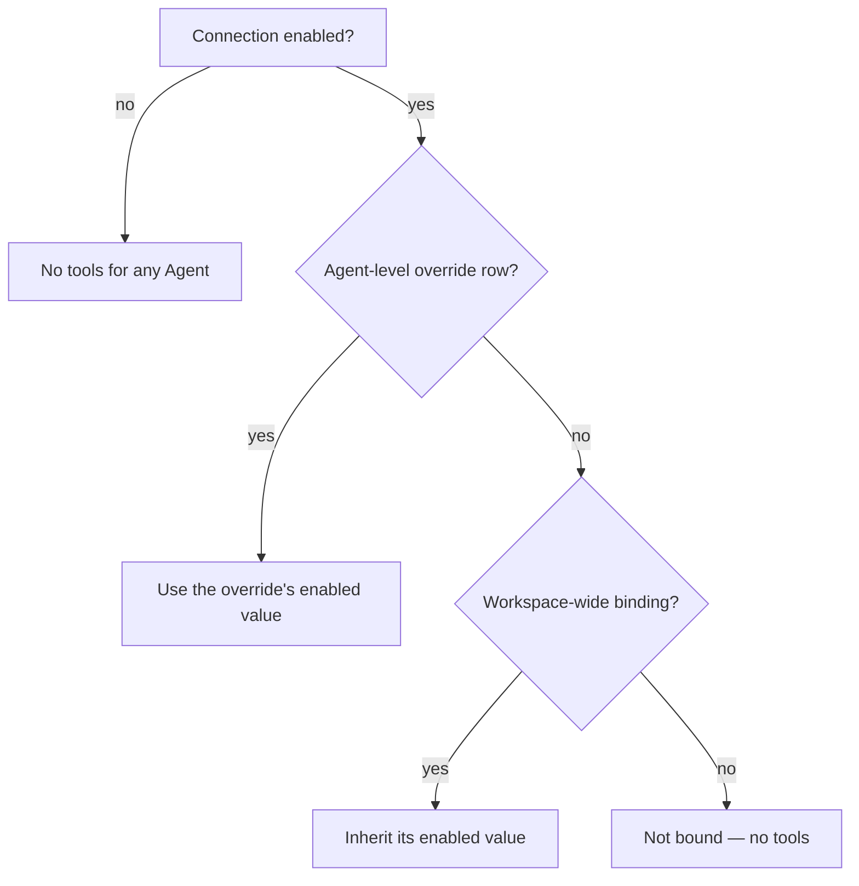

# MCP Connections

An **MCP Connection** points Ever Works at an _external_ [Model Context Protocol](https://modelcontextprotocol.io/specification) server. You register the server once for your workspace, decide which [Agents](./agents.md) may use it, and from their next run those Agents see the server's tools alongside their built-in ones — named `mcp__<server>__<tool>`, filtered by the same grant matrix, and bounded by the same permission flags.

This is how an Agent reaches a capability Ever Works does not ship itself: an internal ticketing MCP server, a vendor's hosted MCP endpoint, your own MCP wrapper around a private API.

## Direction check: two different MCP pages

MCP is a two-sided protocol and Ever Works sits on both sides. Make sure you are on the right page.

| You want to…                                                                                   | Ever Works is the… | Read                          |
| ---------------------------------------------------------------------------------------------- | ------------------ | ----------------------------- |
| Give your Agents tools from an MCP server that someone else runs                               | **client**         | This page                     |
| Let an MCP client you run — Claude Desktop, Claude Code, a script — drive your Works and Items | **server**         | [MCP Server](./mcp-server.md) |

The two are independent. Adding a connection here does not change what the Ever Works MCP server exposes, and configuring that server does not give your Agents any new tools.

:::note Where to find it
The registry lives at **Settings → Connections** (`/settings/connections`). The per-Agent switches live on an Agent's **MCP Servers** tab (`/agents/:id/mcp-servers`) and are mirrored in the **MCP Connections** section of its [**Capabilities**](./agent-capabilities.md) tab (`/agents/:id/capabilities`).
:::

## What a connection holds

| Field             | Notes                                                                                                                            |
| ----------------- | -------------------------------------------------------------------------------------------------------------------------------- |
| `name`            | Slug-safe and unique per account: lowercase letters, digits and hyphens, 1–80 chars. It becomes the `mcp__<name>__` prefix.      |
| `url`             | The server endpoint, up to 2048 chars. `http(s)` to a **public** host only.                                                      |
| `transport`       | `streamable-http` (**Streamable HTTP**, the default) or `sse` (**SSE (legacy)**).                                                |
| `authHeaders`     | Up to 10 `{header: value}` pairs, encrypted at rest, injected at connect time. **Write-only** — see below.                       |
| `enabled`         | The workspace-wide master switch. Disabled contributes no tools to any Agent, whatever the bindings say.                         |
| `source`          | `manual` for everything you add here. (`package` is reserved — see [the standard](#relationship-to-the-agent-plugins-standard).) |
| `lastConnectedAt` | Stamped on every successful connect, from a **Test** or from a run.                                                              |
| `lastError`       | The classified message from the last failure, shown on the row.                                                                  |

Two constraints are worth knowing before you type:

- **The name is not cosmetic.** It is the namespace segment models see. A connection named `github` produces `mcp__github__create_issue`; renaming it renames every tool the model has learned. `mcp__<server>__<tool>` is also capped at 128 characters — a tool whose full name would exceed that is dropped with a warning, so keep long server names short.
- **Auth header values are write-only.** They are stored in the same encrypted column envelope as notification-channel secrets, and the API returns only `authHeaderNames`. The Settings screen shows the header _names_ on the row and never the values — including to you. To rotate a credential, save the header again with a new value.

### Transports, and what is not here

`streamable-http` and `sse` are network clients, and both are available wherever your outbound network policy allows. **`stdio` is deliberately not offered**: a stdio server means spawning a subprocess, which is gated behind an execution decision the platform has not shipped. Manual connections are network-only.

## How to add a connection

1. Go to **Settings → Connections** (`/settings/connections`) and click **Add Connection**.
2. Fill **Name** — lowercase letters, digits and hyphens. The helper text under the field repeats the rule because the value becomes the `mcp__<name>__<tool>` prefix.
3. Pick a **Transport**: **Streamable HTTP** or **SSE (legacy)**.
4. Paste the **Server URL**, e.g. `https://mcp.example.com/mcp`.
5. If the server needs credentials, fill **Auth header name** (e.g. `Authorization`) and **Auth header value** (e.g. `Bearer …`). The value field is masked, is stored encrypted, and is never shown again. Leave both blank for an open server.
6. Click **Save**. The connection is created **enabled**, together with a workspace-wide binding — so every Agent you own inherits it immediately.
7. Click **Test** on the new row. A success reads `OK — <n> tools (<first five names>)`; a failure shows the classified reason and stamps it on the row.

Names collide loudly rather than silently: saving a name you already used returns `A connection named "…" already exists.` The URL is checked against the same SSRF guard the model-facing URL tools use, so a private, loopback, link-local or cloud-metadata address is rejected with `URL must be http(s) to a public host…` before anything is stored.

### Editing, disabling, deleting

Each row carries a switch, **Test**, and a delete button:

- **The switch** flips `enabled` workspace-wide. Turning it off is the fastest way to cut every Agent off from a server without touching a single binding — the per-Agent switches lock and the row is badged **Connection disabled**.
- **Test** re-connects and re-lists the tools, bypassing the cached tool list. Use it after a credential rotation.
- **Delete** removes the connection **and cascades to its bindings**. There is no per-Agent leftover to clean up afterwards.

Any edit or delete also invalidates that connection's cached tool list, so the next run re-discovers the server's tools rather than reusing a stale set.

## Binding a connection to an Agent

A connection existing is not the same as an Agent being allowed to use it. Bindings decide that, and they follow the same **narrow-only** semantics as tool grants.



| State on the tab              | What it means                                                                                                                  |
| ----------------------------- | ------------------------------------------------------------------------------------------------------------------------------ |
| **Inherited** badge           | No Agent-level row exists; the workspace-wide binding decides, and the switch reflects it.                                     |
| **Override** badge            | An Agent-level row exists and wins over inheritance. **Revert** deletes it.                                                    |
| **Connection disabled** badge | The connection's master switch is off. The per-Agent switch is locked until you re-enable it under **Settings → Connections**. |

Because creating a connection also creates the enabled workspace-wide row, the common shape is: add once, then switch it **off** on the Agents that should not have it. Switching it on for a single Agent when nothing is inherited works too — that writes an Agent-level row with `enabled: true`.

### How to bind or unbind

1. Open **Sidebar → Teams → Agents**, pick the Agent, and open its **MCP Servers** tab (`/agents/:id/mcp-servers`). The header counts how many connections are active for this Agent.
2. Toggle the switch on the connection's row. Toggling always writes an **Agent-level override** — off narrows an inherited connection, on binds one that is not inherited.
3. To drop back to the workspace default, click **Revert** on that row (it appears only while an **Override** badge is showing).
4. If the list is empty, you have no connections yet — the empty state says so: _"No MCP connections configured. Add one under Settings → Connections."_
5. The same rows and switches are available in the **MCP Connections** section of the Agent's **Capabilities** tab, over the same endpoints — with slightly different labels there: **Inherited from tenant** and **Reset to inherited** instead of **Inherited** and **Revert**. **Manage MCP servers** there links back to this tab.

## What happens during a run

Bound servers are contacted while the Agent's tool list is assembled, before the model sees anything:

1. **The permission gate first.** MCP tools are outbound network calls, so they ride the Agent's `canCallExternalTools` permission — the same flag that gates web search, screenshots, content extraction and email. With the flag off, **zero** MCP tools are built, no matter how many servers are bound. Flip it on the Agent's **Settings** tab.
2. **Discovery.** For each effective connection, Ever Works connects and lists tools, with a 10-second bound on connect-and-list and a 60-second cache per connection so a busy Agent does not re-list on every run.
3. **Naming and sanitizing.** Each tool becomes `mcp__<server>__<tool>`; the description is prefixed with `[<server>]`, stripped of control characters, and capped at 1024 characters. Server-supplied names are sanitized to a safe charset, and the server's JSON input schema is passed through as the tool's parameters.
4. **The grant matrix.** MCP descriptors are appended **before** the grant partition, so they flow through the tenant → organization → Work → Agent allow/deny lattice exactly like built-in tools. A `deny` of `mcp__*` high in the lattice switches off every MCP tool beneath it. See [Agent Capabilities](./agent-capabilities.md) for how those grants resolve.
5. **Collisions lose.** A server-supplied tool whose name collides with an existing tool — a built-in, or another server's — is dropped with a warning rather than shadowing it. Distinct connection names are what keep two servers from ever competing for the same name.
6. **Credentials interpolate.** MCP tools get the same `{{cred.key}}` argument interpolation as built-in tools, so stored credentials reach the third-party server as values rather than as literal placeholder text.

When the model calls one of these tools, the call is bounded at 30 seconds and the serialized result is capped at 100,000 bytes; an oversized result comes back explicitly marked `truncated` so the model knows content is missing instead of parsing a mangled payload. A failed call returns an actionable `MCP server "<name>": <reason>` message to the model rather than throwing.

:::tip A dead server never fails a run
Failure is isolated at every level. A server that will not connect contributes **zero** tools plus a warning in the logs; a broken resolution contributes zero tools. The Agent's run continues with the tools it does have. That is also why a missing MCP tool is usually a silent symptom — check the row's `lastError` under **Settings → Connections** rather than the run.
:::

## Security posture

| Control                   | Behavior                                                                                                                                                                                                                |
| ------------------------- | ----------------------------------------------------------------------------------------------------------------------------------------------------------------------------------------------------------------------- |
| **Secret masking**        | Auth header values never leave the service layer. Every API response carries `authHeaderNames` only.                                                                                                                    |
| **Error redaction**       | Header values are stripped from failure messages **before** classification, so a token can never land in `lastError`, in the Settings screen, or in the model's conversation history.                                   |
| **Error classification**  | Failures are reduced to short, header-free strings — `Authentication failed (401). Check the auth header.`, `Endpoint not found (404). Check the URL.`, `Server unreachable (connection failed).`, `Request timed out.` |
| **SSRF guard on the URL** | Non-HTTP(S) schemes and private, loopback, link-local and cloud-metadata addresses are refused at save time.                                                                                                            |
| **Header hygiene**        | Header names must match `[A-Za-z0-9-]{1,128}`; values are 1–4096 chars and may not contain control characters. A rejected value is named by header, never quoted back.                                                  |
| **No existence leak**     | Another account's connection or Agent resolves to `404`, never `403`.                                                                                                                                                   |
| **Rate limits**           | Per minute: 30 creates, 60 updates, 30 deletes, 20 tests, 60 binding writes.                                                                                                                                            |
| **Connect per operation** | Clients are opened per operation and closed in a `finally`; a late-arriving connection after a timeout is closed rather than leaked.                                                                                    |

Every connection change is written to your [Activity](./activity.md) feed as `mcp_connection_created`, `mcp_connection_updated`, `mcp_connection_deleted`, `mcp_connection_tested`, or `mcp_binding_updated`, with the connection id and name in the details.

## API reference

All endpoints take a bearer token ([API Keys](./api-keys.md)) and are scoped to the caller: another account's connection or Agent is a `404`. Responses are always the masked view — header names, never values.

### The registry

| Method   | Endpoint                        | What it does                                                                                                   |
| -------- | ------------------------------- | -------------------------------------------------------------------------------------------------------------- |
| `GET`    | `/api/mcp-connections`          | List your connections, masked (header names only).                                                             |
| `GET`    | `/api/mcp-connections/:id`      | Read one, masked.                                                                                              |
| `POST`   | `/api/mcp-connections`          | Create one — `{ name, url, transport, authHeaders? }`. Also creates the workspace-wide inherit binding.        |
| `PATCH`  | `/api/mcp-connections/:id`      | Update `name`, `url`, `transport`, `authHeaders` (`null` clears them) or `enabled`.                            |
| `DELETE` | `/api/mcp-connections/:id`      | Delete it; bindings cascade.                                                                                   |
| `POST`   | `/api/mcp-connections/:id/test` | Connect and list tools; returns `{ ok, toolCount, tools, error? }` and stamps `lastConnectedAt` / `lastError`. |

```bash
curl -X POST https://api.ever.works/api/mcp-connections \
  -H "Authorization: Bearer $EVERWORKS_API_KEY" \
  -H "Content-Type: application/json" \
  -d '{
    "name": "tickets",
    "url": "https://mcp.example.com/mcp",
    "transport": "streamable-http",
    "authHeaders": { "Authorization": "Bearer …" }
  }'
```

### Per-Agent bindings

| Method   | Endpoint                                         | What it does                                                                                                                    |
| -------- | ------------------------------------------------ | ------------------------------------------------------------------------------------------------------------------------------- |
| `GET`    | `/api/agents/:agentId/mcp-servers`               | Every connection with this Agent's `effectiveEnabled`, `bindingSource` (`agent` / `tenant` / `none`) and `inheritedFromTenant`. |
| `PUT`    | `/api/agents/:agentId/mcp-servers/:connectionId` | Upsert the Agent-level override — `{ "enabled": false }` narrows inheritance.                                                   |
| `DELETE` | `/api/agents/:agentId/mcp-servers/:connectionId` | Remove the override; revert to workspace inheritance.                                                                           |

## Relationship to the Agent Plugins standard

Ever Works is building toward the **Agent Plugins v1.0.0** interop standard, where a package can ship both Skills and MCP server definitions. What is on this page is the **MCP slice of that work, shipped ahead of the package format** — and the boundary matters, so here it is plainly:

| Capability                                                             | Status                                                                                                                |
| ---------------------------------------------------------------------- | --------------------------------------------------------------------------------------------------------------------- |
| Manually registered MCP servers (`source: manual`)                     | **Shipped** — this page.                                                                                              |
| `streamable-http` and `sse` transports                                 | **Shipped**.                                                                                                          |
| Per-Agent bindings with workspace inheritance                          | **Shipped** — the `tenant` and `agent` binding targets.                                                               |
| Credentials as client-generated headers, encrypted, never in a package | **Shipped** — the standard's rule that packages must not embed credentials is why the header lives on the connection. |
| MCP servers arriving from an installed package (`source: package`)     | **Not shipped.** The column reserves the value so the package work lands without a schema change.                     |
| `stdio` transport                                                      | **Not shipped here** — manual connections are network-only, because a stdio server means spawning a subprocess.       |
| Work-scoped bindings                                                   | **Not shipped.** The binding table's shape already allows a `work` target, so it can arrive without a migration.      |

The wider interop specification — package loading from local directories, git and npm, and exporting Ever Works Skills and our own MCP server as conformant packages — is specified but not yet shipped. Treat anything on this page that is not in the **Shipped** rows above as a direction, not a promise.

## Troubleshooting

| Symptom                                                                   | Cause                                                                                                                      | Fix                                                                                                  |
| ------------------------------------------------------------------------- | -------------------------------------------------------------------------------------------------------------------------- | ---------------------------------------------------------------------------------------------------- |
| **Test** fails with `Authentication failed (401). Check the auth header.` | Wrong header name, wrong scheme, or an expired token.                                                                      | Re-save the auth header pair. Values are write-only, so retype the whole value.                      |
| **Test** fails with `Endpoint not found (404). Check the URL.`            | The URL points at the site, not the MCP endpoint (often a missing `/mcp` path).                                            | Correct the **Server URL** and test again.                                                           |
| Saving fails with `URL must be http(s) to a public host…`                 | The SSRF guard rejected a private, loopback, link-local or metadata address.                                               | Expose the server on a public hostname, or run it where the platform can reach it.                   |
| Saving fails with `A connection named "…" already exists.`                | Names are unique per account.                                                                                              | Pick another name — remember it is the tool prefix models will see.                                  |
| No MCP tools appear in any run, on any Agent                              | The Agent's `canCallExternalTools` permission is off — the gate runs before discovery.                                     | Enable it on the Agent's **Settings** tab.                                                           |
| One Agent sees the tools, another does not                                | An Agent-level override is set to off, or nothing is bound for that Agent.                                                 | Open `/agents/:id/mcp-servers`, toggle the row on, or **Revert** to inheritance.                     |
| The per-Agent switch is locked                                            | The connection is disabled workspace-wide.                                                                                 | Re-enable it under **Settings → Connections**.                                                       |
| Tools were there yesterday and are gone today                             | The server went unreachable. A dead server is skipped silently so the run still completes.                                 | Check the row's error under **Settings → Connections**, then **Test**.                               |
| A specific tool is missing while others from the same server work         | Its full `mcp__<server>__<tool>` name exceeded 128 chars, it collided with an existing tool, or a grant pattern denies it. | Shorten the connection name, or check the grants on the [Capabilities](./agent-capabilities.md) tab. |
| A tool result comes back marked `truncated`                               | The serialized result exceeded the 100,000-byte cap.                                                                       | Ask the server for a narrower result (filters, pagination) in the tool arguments.                    |

## Related

- [Agent Capabilities](./agent-capabilities.md) — the tool-grant matrix these tools flow through, and the second view of the same bindings.
- [Agents (Your AI Employees)](./agents.md) — permissions, scopes, and where `canCallExternalTools` lives.
- [MCP Server](./mcp-server.md) — the other direction: Ever Works exposed as MCP tools to your own client.
- [Plugins](./plugins.md) — the native plugin system, a separate mechanism from external MCP servers.
- [Integrations](./integrations.md) — connectors that bring outside activity in as events.
- [API Keys](./api-keys.md) — authenticating the endpoints above.
- [Activity](./activity.md) · [Settings Map](./settings-map.md) — where connection changes are logged, and where every other setting lives.
