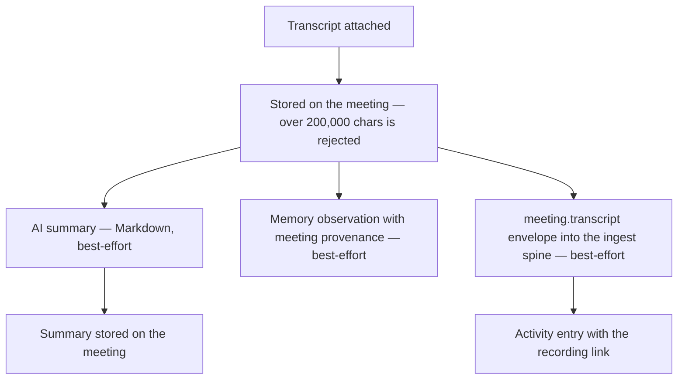

# Meetings (Transcripts, Summaries & Recordings)

Most of what a team decides is decided out loud, in a call, and then lost. A **Meeting** in Ever Works is the record that keeps it: a title, a start and end, who was there, a link back to the recording, and — the part that matters — the **transcript**.

Attach a transcript and the platform does three things with it without being asked: it writes an AI summary, it saves the meeting to [Memory](./memory.md) so your Agents recall it later, and it posts an entry to your [Activity](./activity.md) feed with the recording link. Zoom cloud recordings and Google Meet transcripts arrive on their own once their connector is enabled; anything else you can paste in by hand.

Meetings are deliberately **not** a separate silo. A meeting is a memory source, so the catalog lives on the Memory page and everything an agent learns from a call flows through the same Memory and Activity paths as every other event.

## What a Meeting record holds

| Field                     | What it holds                                                                                                            |
| ------------------------- | ------------------------------------------------------------------------------------------------------------------------ |
| **Title**                 | Up to 500 characters. Required.                                                                                          |
| **Started at / Ended at** | ISO 8601 timestamps. `startedAt` is required; a meeting with no end reads **Still open**.                                |
| **Source**                | One of `zoom`, `google-meet`, `manual`, `import`. A closed set — anything else is rejected.                              |
| **Participants**          | A roster of `{ name, email? }` entries. Names up to 200 characters, addresses up to 320.                                 |
| **Work**                  | The [Work](./creating-a-work.md) the meeting is routed to. Optional — a meeting with no Work is **org-wide**.            |
| **Recording link**        | `sourceUrl`, a deep link back to the recording or provider page (up to 2,048 characters).                                |
| **Provider meeting ID**   | `externalId`, the meeting's stable id in the source system (up to 200 characters). Used to de-duplicate connector syncs. |
| **Transcript**            | Plain text, stored up to **200,000 characters**. List rows never carry the body — they carry a `hasTranscript` flag.     |
| **Summary**               | The AI recap, stored as Markdown. Best-effort: it may legitimately be absent.                                            |
| **Captured**              | When the row was created, as distinct from when the meeting happened.                                                    |

Every meeting is **owner-scoped**. A meeting that belongs to someone else and a meeting that does not exist return exactly the same `404`, so nothing leaks the existence of another account's records.

## Where meetings live

| Surface                 | Route              | What it is                                                                                       |
| ----------------------- | ------------------ | ------------------------------------------------------------------------------------------------ |
| **The catalog**         | `/memory#meetings` | The Meetings block on the Memory page, below the agent-memory panel. Cards, filters, pagination. |
| **The old catalog URL** | `/meetings`        | A redirect to the block above. It carries your `source`, `workId` and `offset` filters across.   |
| **Capture form**        | `/meetings/new`    | Create a meeting by hand, optionally pasting the transcript in the same step.                    |
| **Meeting page**        | `/meetings/:id`    | Summary, transcript, roster, provenance — plus edit, re-route, attach transcript and delete.     |

:::note Why the catalog is on the Memory page
Meetings have no sidebar entry of their own. A meeting is a _memory source_ — every transcript and summary is ingested straight into Memory — so the catalog renders as the **Meetings** block on **Sidebar → Memory**. `/meetings/new` and `/meetings/:id` are unaffected, and the old `/meetings` link still works.
:::

The catalog shows **12 meetings per page**, newest first, as cards carrying the start time, the source badge, a **Transcript** / **No transcript** chip, the participant count, the duration (or **Still open**), and the first line of the summary when one exists. Two filters sit above the grid — **Source** and **Work** — and they are a plain GET form, so a filtered view is a real URL you can bookmark or share (`/memory?source=zoom#meetings`).

## Capture a meeting by hand

Use this for anything the platform did not sync: a call on a provider you have no connector for, an in-person conversation, or a recording whose transcript you already have.

1. Go to **Sidebar → Memory**, scroll to the **Meetings** block, and press **New meeting** (or go straight to `/meetings/new`).
2. Fill in **Title**. It is the only strictly required field.
3. Set **Started at**. Leave it empty to use the current time — the honest default for a meeting you are capturing as it happens. Add **Ended at** when you know it; the form refuses an end before the start.
4. Under **Where it came from**, pick a **Source**. `Manual` and `Import` describe records you are entering yourself; `Zoom` and `Google Meet` stay selectable for a recording you already hold.
5. Choose a **Work**, or leave it on **Org-wide (no Work)**.
6. Paste the **Recording link** and, if you have it, the **Provider meeting ID**. The provider id is what later de-duplicates this record against a connector sync of the same meeting — fill it in whenever you know it.
7. Add **Participants** one row at a time (name, plus an optional email). A malformed address is caught here rather than by the API.
8. Paste the transcript into **Transcript**. This is optional, but supplying it here runs the full pipeline in one round trip.
9. Press **Capture meeting**. You land on the new meeting's page.

## What attaching a transcript triggers

Attaching a transcript — at creation, or later from the meeting page — stores it first and then runs a **best-effort fan-out**. Only the transcript write can fail the call; every enrichment leg degrades quietly.



| Leg                    | What it does                                                                                                                                                                                     | When it is skipped                                                         |
| ---------------------- | ------------------------------------------------------------------------------------------------------------------------------------------------------------------------------------------------ | -------------------------------------------------------------------------- |
| **Store**              | Writes the transcript to the meeting (requests over 200,000 characters are rejected before this step).                                                                                           | Never — this is the only leg that can fail the request.                    |
| **AI summary**         | Sends the first 24,000 characters of the transcript to your AI provider and stores the reply (capped at 4,000 characters).                                                                       | No AI provider is enabled for you or the Work. The transcript still lands. |
| **Memory observation** | Saves the summary (or the transcript's first 500 characters) to Memory, tagged `meeting`, `source:<source>` and `work:<id>`, with meeting provenance in the metadata.                            | No memory provider is configured.                                          |
| **Activity envelope**  | Emits a `meeting.transcript` event from source `meetings` into the [ingest spine](./integrations.md); its drain writes the Activity row (`EXTERNAL_EVENT_INGESTED`) carrying the recording link. | The spine is unavailable. The transcript still lands.                      |

The API response says exactly what happened: `{ meeting, summary?, memorySaved, envelopeEmitted }`. The UI reports it the same way — the toast reads **Transcript attached and summarized** only when a summary really came back, and **Transcript attached** otherwise.

Re-attaching an identical transcript is free: the envelope's id is content-hashed (`<meetingId>:transcript:<hash>`), so a re-run dedupes while a genuinely revised transcript lands as a new event.

### What the summary looks like

The summarizer is asked for plain Markdown: one short opening paragraph about what the meeting was about and what came out of it, then only the sections the transcript actually supports — **Discussion**, **Decisions**, **Action items**, **Open questions** — each a `###` heading with bullets, under 400 words in total. Action items name an owner when the transcript does and read **Unassigned** when it does not. Empty sections are omitted rather than filled with "none", and the model is instructed never to invent a decision, owner or date that is not in the transcript.

## The meeting page

`/meetings/:id` is the record. The content column holds what the meeting _says_; the rail beside it holds what it _is_.

| Area             | What you get                                                                                                                             |
| ---------------- | ---------------------------------------------------------------------------------------------------------------------------------------- |
| **Summary**      | The stored recap rendered as Markdown. While one is being generated you see **Generating summary…**; with none, the empty copy says why. |
| **Transcript**   | The stored transcript, or the composer when none has landed yet. **Edit transcript** re-opens the composer on the stored text.           |
| **Details**      | Source, Started, Ended (or **Still open**), Duration, Work (or **Org-wide**), Provider ID, Captured.                                     |
| **Participants** | The roster, with a quick-add box for the person everyone forgot.                                                                         |
| **Top bar**      | **Open recording** (when a recording link exists), **Edit**, and **Delete** behind a confirmation dialog.                                |

To attach a transcript to a meeting that arrived without one:

1. Open the meeting from `/memory#meetings`.
2. Paste the text into **Transcript text** under the Transcript section.
3. Press **Attach transcript**. The page scrolls the Summary card into view while the pipeline runs.

**Edit** opens a dialog for the title, the times, the recording link, the roster and the Work — that last one is how you re-route a meeting that landed org-wide, or move one from the wrong Work. **Delete** removes the meeting together with its transcript and summary, and cannot be undone.

Links inside a summary are defused unless they are `http(s)`: the summary is model-written from text somebody pasted, so it is treated as untrusted content.

## Synced recordings

Provider-synced meetings do not go through the meetings API at all. Their connector sweeps the provider, emits an **event envelope** into the ingest spine, and a kind processor turns that envelope into a Meeting row — then runs the exact same transcript pipeline described above.

| Envelope kind           | Produced by                    | Becomes source | What is swept                                                                                                          |
| ----------------------- | ------------------------------ | -------------- | ---------------------------------------------------------------------------------------------------------------------- |
| `zoom.recording`        | **zoom-connector**             | `zoom`         | Completed cloud recordings since the last watermark; the completed VTT transcript is downloaded and converted to text. |
| `google.meet-recording` | **google-workspace-connector** | `google-meet`  | Meet transcript documents in Drive, exported to plain text.                                                            |

An envelope kind the processor does not recognize falls back to source `import` rather than guessing, and an envelope with no meeting id is skipped.

### Zoom

The Zoom connector authenticates with a **Server-to-Server OAuth** app (`accountId`, `clientId`, `clientSecret`) and sweeps completed cloud recordings through Zoom's official SDK. When a completed transcript file exists it is downloaded, converted to readable text and truncated to 24,000 characters for the envelope — the full recording stays reachable through the recording link. `backfillDays` (0–90, default 0) opts the first pull into history, and the connector also implements the event-source `backfill()` capability method, which an operator can call for a one-off historical window. `backfillDays` is the setting you will find on the connector's settings form; `backfill()` is a capability method invoked by an operator, not a button on the Plugins page.

Outbound messaging is not part of this connector: Zoom is inbound only.

### Google Meet

Meet needs no connector of its own — it rides the **Google Workspace** connector, which authenticates with an OAuth refresh token scoped to `drive.readonly` and `calendar.readonly`. Meet drops a transcript Google Doc into Drive; the connector's Drive sweep recognizes those documents (a Google Doc whose name ends in `- Transcript` or `(Transcript)`), exports the text and emits it as a `google.meet-recording` envelope. The `meetTranscripts` setting controls this and defaults to **on**; `driveFolderIds` narrows the sweep to specific folders.

If the export fails, the file still lands as an ordinary Drive-change event and the transcript re-arrives on a later sweep — transcript availability is part of the event identity, so a document that appears before its text is exportable is not lost.

Calendar events are swept too, as their own event kind. Those are calendar entries in your Activity feed, not Meeting records: a Meeting row is created from a **transcript**, not from an invitation.

### Enabling a meetings connector

1. Go to **Sidebar → Plugins** (`/plugins`) — the same **Manage connectors** link the Meetings block offers.
2. Open **Zoom** or **Google Workspace** and enable it.
3. Fill in its settings (Zoom: account id, client id, client secret; Google Workspace: client id, client secret, refresh token — plus the optional surface, folder and calendar filters).
4. Optionally set `backfillDays` to pull history on the first sweep.
5. Save. Recordings arrive on the next `event-ingest-tick` pull; re-delivery is safe, because ingest dedupes on `(source, sourceEventId)`.

Meetings de-duplicate per owner on `(source, externalId)`, so two people syncing the same Zoom account each keep their own row and neither swallows the other's. Manual meetings without a provider id never de-duplicate — capture the same call twice by hand and you get two records.

### Routing synced meetings to a Work

Connectors attach a **work hint** to each meeting envelope (the Zoom meeting id, or the Meet transcript's Drive file id). The spine resolves that hint against the Works you own:

1. Open the Work, go to **Settings** (`/works/:id/settings`) and find **Ingest routing claims**.
2. Under **Meetings**, add the recurring meeting id whose transcripts belong to this Work, then press **Save claims**.
3. Ids are at most 200 characters, up to 50 per kind, and two Works you own cannot claim the same id.

An unmatched hint is a normal outcome, not an error: the meeting simply stays org-wide, and you can re-route it by hand from the meeting page at any time.

## Asking your Agents about meetings

Meetings are in the chat tool surface, so "what did we decide in Tuesday's standup?" is answerable without leaving the conversation.

| Tool                  | What it does                                                                                                                                     |
| --------------------- | ------------------------------------------------------------------------------------------------------------------------------------------------ |
| `list_meetings`       | Lists your captured meetings, newest first — synced, imported and manual alike. Filters: `workId`, `source`, `limit` (default 20, capped at 50). |
| `get_meeting_summary` | Returns one meeting's AI summary plus its metadata: participants, timing and the recording link. Use it after `list_meetings`.                   |

Both tools are owner-scoped — another account's meeting is indistinguishable from a missing one — and results carry the recording link so an answer can cite the call it came from. They are part of [platform chat](./platform-chat.md)'s tool set, where they read the same `/api/meetings` endpoints, and part of the domain tool set your [Agents](./agents.md) get on a run.

Because every transcript also writes a Memory observation, meetings surface in ordinary memory recall too, even when no meeting tool is called.

## API

| Endpoint                            | What it does                                                 |
| ----------------------------------- | ------------------------------------------------------------ |
| `GET /api/meetings`                 | Your meetings, newest first. Filter by `workId` or `source`. |
| `POST /api/meetings`                | Create one manually or by import.                            |
| `GET /api/meetings/:id`             | One meeting, including the transcript body.                  |
| `PATCH /api/meetings/:id`           | Partial update.                                              |
| `DELETE /api/meetings/:id`          | Remove it.                                                   |
| `POST /api/meetings/:id/transcript` | Attach a transcript (size-capped at 200,000 characters).     |

Sources are `zoom`, `google-meet`, `manual` and `import`. Zoom recordings arrive through the ingest spine rather than this API.

That size cap is a bound, not a trim: a `transcriptText` longer than 200,000 characters is rejected with a `400` by both `POST /api/meetings` and `POST /api/meetings/:id/transcript`, so an over-long transcript comes back as a validation error instead of landing silently truncated.

Attaching a transcript stores it and then runs a **best-effort** fan-out: an AI summary, a memory observation, and a `meeting.transcript` envelope that lands on your Activity feed with the recording link. Only the transcript write can fail the call — every enrichment degrades gracefully, so a missing AI key costs you the summary, not the transcript.

List rows omit the transcript body; the detail endpoint includes it.

```bash
# Capture a meeting and its transcript in one call
curl -X POST http://localhost:3100/api/meetings \
  -H "Authorization: Bearer <token>" \
  -H "Content-Type: application/json" \
  -d '{
    "title": "Weekly roadmap review",
    "startedAt": "2026-09-02T09:00:00.000Z",
    "endedAt": "2026-09-02T09:45:00.000Z",
    "source": "manual",
    "workId": "<work-uuid>",
    "sourceUrl": "https://example.com/recordings/123",
    "participants": [{ "name": "Ada Lovelace", "email": "ada@example.com" }],
    "transcriptText": "Ada: shipping the gate. Grace: reviewing the branch."
  }'

# Everything Zoom synced for me, newest first
curl "http://localhost:3100/api/meetings?source=zoom&limit=20" \
  -H "Authorization: Bearer <token>"

# Attach a transcript to a meeting that arrived without one
curl -X POST http://localhost:3100/api/meetings/<meeting-id>/transcript \
  -H "Authorization: Bearer <token>" \
  -H "Content-Type: application/json" \
  -d '{ "transcriptText": "Full transcript text here." }'
```

Write endpoints are rate-limited: create, update and delete allow 30 requests a minute each, while transcript ingest allows **10 a minute** — that one is stricter because it fans out to a model. The internal de-duplication key is never returned by the API.

## Limits and honest edges

| Limit                                      | Value                                                                    |
| ------------------------------------------ | ------------------------------------------------------------------------ |
| Stored transcript                          | 200,000 characters — the API rejects longer text instead of trimming it. |
| Transcript text sent to the summarizer     | The first 24,000 characters.                                             |
| Stored summary                             | 4,000 characters (the prompt targets under 400 words).                   |
| Transcript carried on a connector envelope | 24,000 characters — the full recording stays reachable through its link. |
| Roster                                     | Names ≤ 200 characters, emails ≤ 320.                                    |
| Catalog page size                          | 12 meetings per page.                                                    |
| Chat tool listing                          | 20 meetings by default, 50 maximum.                                      |

The 200,000-character transcript bound behaves differently depending on how the text arrives. Over the API it is a hard limit: `POST /api/meetings` and `POST /api/meetings/:id/transcript` reject a longer `transcriptText` with a `400` rather than storing a trimmed copy. Through the UI you never meet it — the capture form and the transcript composer cap the textarea at 200,000 characters and trim the draft before they call. Connector-synced transcripts arrive already capped at 24,000 characters, far under the bound, and the internal ingest path trims defensively on top of that, so a connector change can never overflow the stored column.

Two things Meetings deliberately does **not** do yet:

- **No live bot-join.** Nothing joins a call to capture audio in real time. Meetings are built from recordings and pasted text; live capture is a documented follow-up, and when it arrives it will feed this same transcript pipeline.
- **No outbound meeting actions.** The connectors here are inbound only — no scheduling, no posting into a meeting.

## Troubleshooting

| Symptom                                  | Likely cause                                                                                                                                                                          |
| ---------------------------------------- | ------------------------------------------------------------------------------------------------------------------------------------------------------------------------------------- |
| Transcript attached, no summary          | No AI provider is enabled for you or for the Work. Enable one and re-attach the transcript — the empty state on the page says so.                                                     |
| Zoom meeting synced without a transcript | Zoom had no completed transcript file at sweep time. It lands on a later sweep; transcript availability is part of the event id.                                                      |
| Meet call never appears                  | The transcript doc must be a Google Doc whose name ends in `- Transcript` or `(Transcript)`, `meetTranscripts` must be on, and a `driveFolderIds` filter must not exclude its folder. |
| The same meeting appears twice           | One of the copies was captured by hand with no **Provider meeting ID** — records without one never de-duplicate.                                                                      |
| A synced meeting stays org-wide          | No Work claims its meeting id. Add the id under **Ingest routing claims**, or re-route the meeting from its page.                                                                     |
| Someone else's meeting link 404s         | Working as intended — meetings are owner-scoped, and missing and not-yours are the same answer.                                                                                       |
| Filters vanish after using `/meetings`   | They should not: the redirect re-parses and carries `source`, `workId` and `offset`. A dropped filter means it failed validation (for example a `workId` that is not a UUID).         |

## Related

- [Memory](./memory.md) · [Knowledge Base & Memory](./knowledge-base.md) · [Memory Decisions](./memory-decisions.md)
- [Integrations](./integrations.md) · [Connectors](./connectors.md) · [Plugins](./plugins.md)
- [Activity](./activity.md) · [Platform Chat](./platform-chat.md) · [Agents](./agents.md)
- [Creating a Work](./creating-a-work.md) — Works, and the ingest routing claims that send a meeting to one
