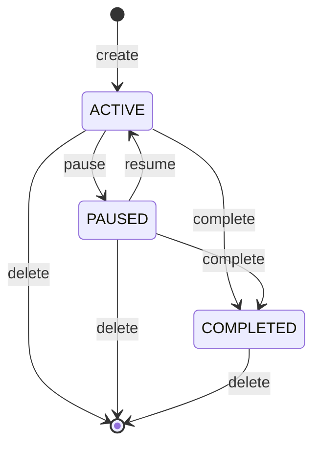

# Missions

A **Mission** is a long-running goal you give the platform. Where a single Work is a finished website, a Mission is the thing that decides _which_ Works are worth building. It spawns Ideas, optionally builds them into Works on a schedule, and stays open until you mark it complete.

Use a Mission when you want the platform to keep working on a topic over time — not just generate one site and stop.

## When to use a Mission vs a Work

| You want to…                                                           | Use a…                                      |
| ---------------------------------------------------------------------- | ------------------------------------------- |
| Publish a single directory / blog / landing page from a prompt         | **Work**                                    |
| Have the platform keep finding new angles on a topic and propose Ideas | **Mission**                                 |
| Run a weekly research → build → publish loop                           | **Mission** (scheduled)                     |
| Treat one prompt as "kick this off once, then leave it alone"          | **Mission** (one-shot)                      |
| Fork someone else's Mission setup so you don't start from scratch      | **Use this Template** on a Mission template |

A Mission can spawn zero, one, or many Works over its lifetime. The Mission itself is the unit you pause, resume, and budget.

## Creating a Mission

From `/new`:

1. Type what you want the platform to keep working on (the description).
2. Pick the **Mission** chip.
3. Submit.

The Mission is created as **one-shot** by default — it runs once and stops. To make it recurring, open the Mission detail page and flip it to **scheduled**, then set a cron expression (e.g. `0 9 * * *` = every day at 09:00 UTC).

You can also land on `/new` pre-filled by clicking **Use this Template** on any [Mission Template](./mission-templates) — the template's name + description seed the prompt and the spawned Mission carries a back-link to the source template.

## Mission lifecycle

A Mission moves through a small state machine:

| Status        | What it means                                                                                                       |
| ------------- | ------------------------------------------------------------------------------------------------------------------- |
| **ACTIVE**    | The tick worker considers this Mission on every cron match.                                                         |
| **PAUSED**    | The tick worker skips it. Existing Ideas + Works stay untouched.                                                    |
| **COMPLETED** | Terminal. Existing Ideas + Works stay; the Mission itself stops spawning. Not reversible without delete + recreate. |

Every transition is gated by the source status — you can't `resume` an already-ACTIVE Mission or `pause` a COMPLETED one.

### Run-now

The **Run now** button on a Mission's detail page triggers a tick immediately, bypassing the cron schedule. For one-shot Missions this is the primary way to spawn Ideas; for scheduled Missions it does an out-of-band run while still honoring the [outstanding-Ideas cap](#outstanding-ideas-cap).

## Auto-build Works

A Mission can be configured to **auto-build Works** from every Idea it spawns. Toggle on the detail page or set at create time.

- **Off** (default): The Mission spawns Ideas. You decide which Ideas to build (each becomes a Work) via the [Ideas pipeline](./ideas).
- **On**: Each spawned Idea is immediately queued for build into its own Work. Use sparingly — it cuts the human-in-the-loop step.

Auto-build still respects your per-Mission and account-wide [budget caps](./budgets-and-usage). When a cap is hit, the build is skipped (not retried automatically).

## Outstanding-Ideas cap

To keep a runaway Mission from filling your queue, each tick checks the count of un-built Ideas (PENDING + QUEUED + BUILDING) attached to the Mission. If that count is at or above the cap, the tick skips generation.

Cap resolution priority:

1. **Per-Mission cap** if set (value `-1` means unlimited).
2. **Your account default** (`missionDefaultOutstandingCap` setting).
3. **Platform default** of 20.

Set the cap on the Mission detail page under **Settings**. The current count vs cap shows live on the page so you can see why a tick was a no-op.

## Cloning a Mission

The **Clone** button does a **Full Fork**: it copies the Mission row plus every non-DISMISSED Idea (each reset to PENDING for the new owner) and writes a `sourceMissionId` back-reference so you can trace the lineage. Works are **not** cloned — they're per-Work artifacts, not the Mission's responsibility.

Cloning is useful when you want a similar Mission setup but with a different scope, schedule, or owner.

## Deleting a Mission

Delete is allowed from any status. It removes the Mission row but **detaches** the child Ideas rather than deleting them — they stay in your Ideas catalog as standalone Ideas. Already-built Works are unaffected.

## Where to go next

- [Ideas](./ideas) — the queue your Mission feeds into.
- [Mission Templates](./mission-templates) — pre-built Mission setups you can fork.
- [Budgets & Usage](./budgets-and-usage) — caps that gate every spawn and build.
