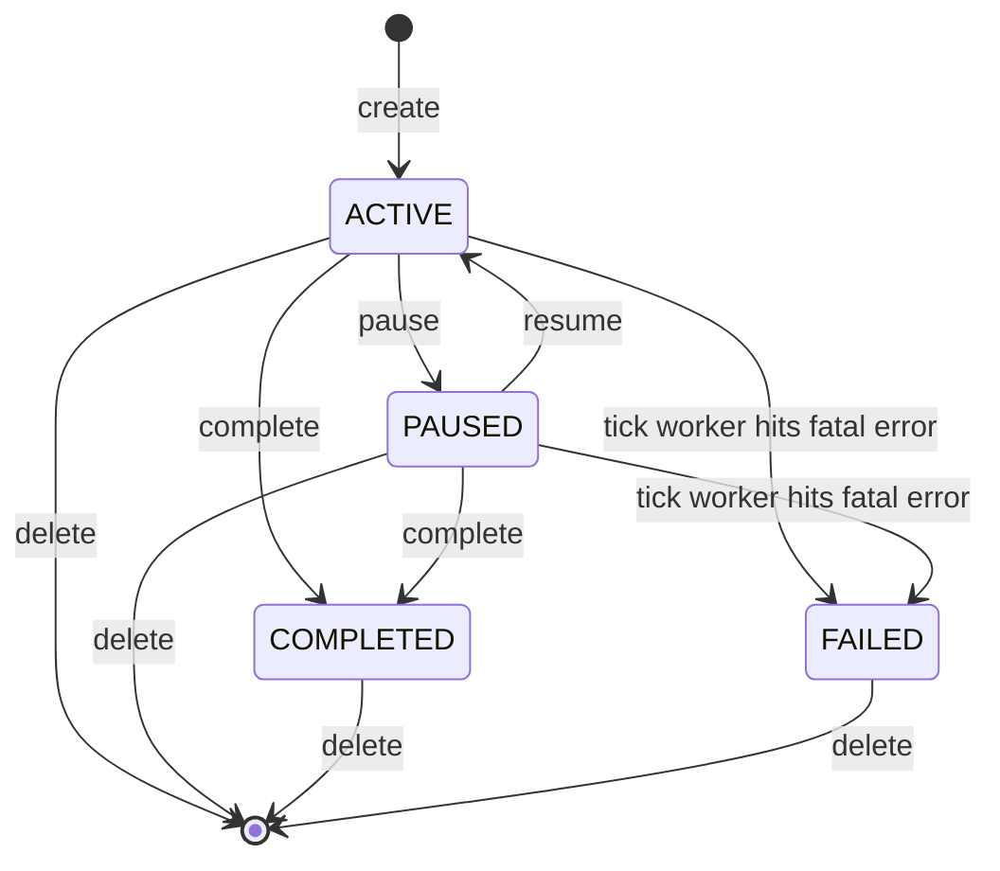

# Missions

A **Mission** is a long-running goal you give the platform. Where a single Work is a finished website, a Mission is the thing that decides _which_ Works are worth building. It spawns Ideas, optionally builds them into Works on a schedule, and stays open until you mark it complete.

Use a Mission when you want the platform to keep working on a topic over time — not just generate one site and stop.

## When to use a Mission vs a Work

| You want to…                                                           | Use a…                                      |
| ---------------------------------------------------------------------- | ------------------------------------------- |
| Publish a single directory / blog / landing page from a prompt         | **Work**                                    |
| Have the platform keep finding new angles on a topic and propose Ideas | **Mission**                                 |
| Run a weekly research → build → publish loop                           | **Mission** (scheduled)                     |
| Treat one prompt as "kick this off once, then leave it alone"          | **Mission** (one-shot)                      |
| Fork someone else's Mission setup so you don't start from scratch      | **Use this Template** on a Mission template |

A Mission can spawn zero, one, or many Works over its lifetime. The Mission itself is the unit you pause, resume, and budget.

## Creating a Mission

From `/new`:

1. Type what you want the platform to keep working on (the description).
2. Pick the **Mission** chip.
3. Submit.

The Mission is created as **one-shot** by default — it runs once and stops. To make it recurring, open the Mission detail page and flip it to **scheduled**, then set a cron expression (e.g. `0 9 * * *` = every day at 09:00 UTC).

You can also land on `/new` pre-filled by clicking **Use this Template** on any [Mission Template](./mission-templates) — the template's name + description seed the prompt and the spawned Mission carries a back-link to the source template.

## Mission lifecycle

A Mission moves through a small state machine:

```mermaid
stateDiagram-v2
    [*] --> ACTIVE: create
    ACTIVE --> PAUSED: pause
    PAUSED --> ACTIVE: resume
    ACTIVE --> COMPLETED: complete
    PAUSED --> COMPLETED: complete
    ACTIVE --> FAILED: tick worker hits fatal error
    PAUSED --> FAILED: tick worker hits fatal error
    ACTIVE --> [*]: delete
    PAUSED --> [*]: delete
    COMPLETED --> [*]: delete
    FAILED --> [*]: delete
```

| Status        | What it means                                                                                                                                                        |
| ------------- | -------------------------------------------------------------------------------------------------------------------------------------------------------------------- |
| **ACTIVE**    | The tick worker considers this Mission on every cron match.                                                                                                          |
| **PAUSED**    | The tick worker skips it. Existing Ideas + Works stay untouched.                                                                                                     |
| **COMPLETED** | Terminal. Existing Ideas + Works stay; the Mission itself stops spawning. Not reversible without delete + recreate.                                                  |
| **FAILED**    | Terminal. Set by the tick worker (not the user) when the generation loop hits a fatal, non-transient error. Existing Ideas + Works stay; tick worker stops spawning. |

Every transition is gated by the source status — you can't `resume` an already-ACTIVE Mission or `pause` a COMPLETED one.

### Run-now

The **Run now** button on a Mission's detail page triggers a tick immediately, bypassing the cron schedule. For one-shot Missions this is the primary way to spawn Ideas; for scheduled Missions it does an out-of-band run while still honoring the [outstanding-Ideas cap](#outstanding-ideas-cap).

## Auto-build Works

A Mission can be configured to **auto-build Works** from every Idea it spawns. Toggle on the detail page or set at create time.

- **Off** (default): The Mission spawns Ideas. You decide which Ideas to build (each becomes a Work) via the [Ideas pipeline](./ideas).
- **On**: Each spawned Idea is immediately queued for build into its own Work. Use sparingly — it cuts the human-in-the-loop step.

Auto-build still respects your per-Mission and account-wide [budget caps](./budgets-and-usage). When a cap is hit, the build is skipped (not retried automatically).

## Outstanding-Ideas cap

To keep a runaway Mission from filling your queue, each tick checks the count of un-built Ideas (PENDING + QUEUED + BUILDING) attached to the Mission. If that count is at or above the cap, the tick skips generation.

Cap resolution priority:

1. **Per-Mission cap** if set (value `-1` means unlimited).
2. **Your account default** (`missionDefaultOutstandingCap` setting).
3. **Platform default** of 20.

Set the cap on the Mission detail page under **Settings**. The current count vs cap shows live on the page so you can see why a tick was a no-op.

## Attached Works and relations

The **Related Works** panel on a Mission's detail page is _derived_ — it lists the Works that were built from that Mission's accepted Ideas. Sitting beside it is **Attached Works**, an explicit, typed reference list that lets you say _how_ a Mission relates to any Work you own, whether or not that Mission produced it.

Attaching is a reference, never a transfer of ownership. A Mission never owns a Work.

### The six relation kinds

| Relation     | Panel label | What it says                                                                   |
| ------------ | ----------- | ------------------------------------------------------------------------------ |
| `created`    | Created     | The Mission's Idea pipeline produced this Work.                                |
| `improves`   | Improves    | The Mission works on an existing Work — features, conversion, hardening.       |
| `operates`   | Operates    | The Mission runs and maintains the Work.                                       |
| `markets`    | Markets     | The Mission promotes the Work — for example a [Campaign](./campaigns.md) Work. |
| `researches` | Researches  | The Mission studies the Work or its market.                                    |
| `retires`    | Retires     | The Mission winds the Work down.                                               |

Anything outside that vocabulary is refused: the picker only ever offers these six, and the API answers `400` with the allowed list.

### The rules that make it safe

- **Many-to-many.** One Mission can relate to any number of Works, and one Work can relate to many Missions over its lifetime — a launch Mission that `created` it, a growth Mission that `markets` it.
- **Several kinds per pair.** The same Mission/Work pair can carry `improves` _and_ `operates` at once. Uniqueness is on the **(Mission, Work, relation) triple**, so re-attaching a triple you already have is a no-op that keeps the original row rather than replacing it.
- **Same owner on both ends.** You can only attach a Work you own. A Work belonging to someone else is invisible rather than forbidden — the API answers `404` instead of confirming it exists.
- **Detaching touches nothing but the reference.** Removing a relation leaves the Work exactly as it was. So does deleting the Mission: only the relation rows go.

### How to attach a Work

1. Open the Mission at `/missions/:id` and scroll to the **Attached Works** panel.
2. Under **Attach a Work**, open the **Work** select and pick one. It holds your 100 most recent Works and says so when that list is truncated — open `/works` if the one you want isn't offered.
3. Open the **Relation** select and choose a kind. It starts on **Improves**.
4. Click **Attach**. The row appears immediately — Work name, slug, relation chip and attach date, newest first — and a "Work attached" toast confirms it.

### How to detach

1. On the row you want to remove, click the trash icon (**Detach**).
2. The **Detach this Work?** dialog names the Work and restates that the Work itself is never touched.
3. Click **Detach Work**. The row disappears; the Work stays exactly where it was.

### Seeing it from the Work side

Open any `/works/:id` and the **Overview** tab shows a **Missions** panel: every Mission of yours related to that Work, with its relation chip and the Mission's status pill. It is read-only context — attaching and detaching always happen on the Mission detail page. The panel is hidden entirely when a Work has no relations.

### The REST surface

All four routes are owner-scoped under `/api/me/missions`:

| Request                                                  | Answer                                                                                                                |
| -------------------------------------------------------- | --------------------------------------------------------------------------------------------------------------------- |
| `GET /api/me/missions/:id/works`                         | `{ relations: [...] }`, newest first, each row hydrated with `workName` + `workSlug` so the UI needs no second fetch. |
| `POST /api/me/missions/:id/works` `{ workId, relation }` | `201` with the **full updated list**. Idempotent on the triple.                                                       |
| `DELETE /api/me/missions/:id/works/:workId/:relation`    | `{ deleted: true }`. A relation that isn't there → `404`; a relation outside the vocabulary → `400`.                  |
| `GET /api/me/missions/related-to-work/:workId`           | The reverse lookup, rows carrying `missionTitle` + `missionStatus`. This is what the Work-side panel reads.           |

:::note `created` relations were seeded once, then it's manual
When the Mission↔Work relation table shipped, a one-time backfill walked the historical Mission → Idea → Work chain and wrote a `created` relation for every Work a Mission had already built. New Works built from a Mission's Ideas keep appearing in the derived **Related Works** panel automatically, but they are **not** auto-stamped into **Attached Works** — attach a `created` relation yourself if you want the explicit edge.
:::

## Attachments

A Mission can carry uploaded files — a brief, a spreadsheet of competitors, a brand PDF, a CSV of seed data. They live in the **Attachments** section at the bottom of the Mission detail page, rendered as the same tile grid used by Ideas, Agents and Tasks.

**To attach a file:**

1. Open `/missions/:id` and scroll to **Attachments**.
2. Drop a file onto the drop zone, or click it to open the file picker.
3. The bytes go to `POST /api/uploads/file`, and the returned upload is then associated with the Mission via `POST /api/me/missions/:id/attachments`. The tile appears with its filename and size as soon as the upload lands; images render an inline thumbnail.

**To remove one:** click the trash icon on the tile. That removes the Mission → upload reference only.

What to know about the limits and the storage model:

| Aspect           | Behaviour                                                                                                         |
| ---------------- | ----------------------------------------------------------------------------------------------------------------- |
| Size cap         | 25 MiB per file by default, tunable with `UPLOADS_FILE_MAX_BYTES` on a self-hosted deployment.                    |
| Accepted types   | Images, PDFs, ZIP and Office documents, gzip, and text-like files (Markdown, CSV, JSON, code).                    |
| Validation       | The server sniffs magic bytes for binary formats and checks UTF-8 shape for text — a mismatch is a `400`.         |
| Identity         | An upload is addressed by its SHA-256 content hash, so re-attaching the same file to the same Mission is a no-op. |
| Ownership        | The upload must be one of yours; an unknown or foreign upload id answers `404`, not `403`.                        |
| Mission deletion | Deleting the Mission removes its attachment rows. The stored upload itself is not deleted underneath you.         |

The same affordance exists earlier in the flow: the prompt composer on `/missions`, `/ideas`, `/new` and `/works/new` can attach files while you are still writing the prompt, so a Mission can arrive with its brief already on it.

| Request                                                 | Answer                                                 |
| ------------------------------------------------------- | ------------------------------------------------------ |
| `GET /api/me/missions/:id/attachments`                  | The Mission's attachment rows.                         |
| `POST /api/me/missions/:id/attachments` `{ uploadId }`  | `201` with the row. Idempotent per (Mission, upload).  |
| `DELETE /api/me/missions/:id/attachments/:attachmentId` | `{ deleted: true }`; an unknown attachment id → `404`. |

## Cloning a Mission

The **Clone** button does a **Full Fork**: it copies the Mission row plus every non-DISMISSED Idea (each reset to PENDING for the new owner) and writes a `sourceMissionId` back-reference so you can trace the lineage. Works are **not** cloned — they're per-Work artifacts, not the Mission's responsibility.

Cloning is useful when you want a similar Mission setup but with a different scope, schedule, or owner.

## Deleting a Mission

Delete is allowed from any status. It removes the Mission row but **detaches** the child Ideas rather than deleting them — they stay in your Ideas catalog as standalone Ideas. Already-built Works are unaffected.

The same holds for the two reference tables above: deleting a Mission drops its [Work relations](#attached-works-and-relations) and its [attachment](#attachments) rows, and never touches the Works or the stored uploads they point at.

## Where to go next

- [Ideas](./ideas) — the queue your Mission feeds into.
- [Mission Templates](./mission-templates) — pre-built Mission setups you can fork.
- [Budgets & Usage](./budgets-and-usage) — caps that gate every spawn and build.
- [Goals](./goals.md) — the metric a Mission can be measured against; attach one to a Mission from its **Goals** panel.
- [Campaigns](./campaigns.md) — go-to-market Works, the usual target of a `markets` relation.
- [Creating a Work](./creating-a-work.md) — what a Mission's Ideas turn into.
