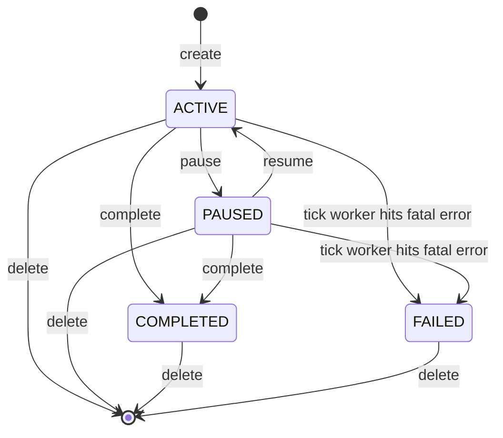

# Missions

A **Mission** is a long-running goal you give the platform. Where a single Work is a finished website, a Mission is the thing that decides _which_ Works are worth building. It spawns Ideas, optionally builds them into Works on a schedule, and stays open until you mark it complete.

Use a Mission when you want the platform to keep working on a topic over time — not just generate one site and stop.

## When to use a Mission vs a Work

| You want to…                                                           | Use a…                                      |
| ---------------------------------------------------------------------- | ------------------------------------------- |
| Publish a single directory / blog / landing page from a prompt         | **Work**                                    |
| Have the platform keep finding new angles on a topic and propose Ideas | **Mission**                                 |
| Run a weekly research → build → publish loop                           | **Mission** (scheduled)                     |
| Treat one prompt as "kick this off once, then leave it alone"          | **Mission** (one-shot)                      |
| Fork someone else's Mission setup so you don't start from scratch      | **Use this Template** on a Mission template |

A Mission can spawn zero, one, or many Works over its lifetime. The Mission itself is the unit you pause, resume, and budget.

## Creating a Mission

There are two ways in. The `/new` composer hands your prompt to the chat AI and relies on it creating
the Mission for you; **`/missions/new`** is the direct form that always creates one.

### From the composer

From `/new`:

1. Type what you want the platform to keep working on (the description).
2. Pick the **Mission** chip.
3. Submit.

The Mission is created as **one-shot** by default — it runs once and stops. To make it recurring, open the Mission detail page and flip it to **scheduled**, then set a cron expression (e.g. `0 9 * * *` = every day at 09:00 UTC).

You can also land on `/new` pre-filled by clicking **Use this Template** on any [Mission Template](./mission-templates) — the template's name + description seed the prompt and the spawned Mission carries a back-link to the source template.

### From the Mission form

Go to **`/missions/new`** (the **Create manually** link next to the composer). Four fields:

| Field           | Notes                                                                                                       |
| --------------- | ----------------------------------------------------------------------------------------------------------- |
| **Title**       | Optional — _"leave blank to derive one from the description"_. Up to 200 characters.                        |
| **Description** | Required, at least 10 characters. What the Mission should keep working on.                                  |
| **Type**        | **One-shot — run once** (the default) or **Scheduled — run repeatedly**.                                    |
| **Schedule**    | Shown only for a scheduled Mission. A five-field cron expression — e.g. `0 9 * * *` for every day at 09:00. |

A scheduled Mission without a cron expression is refused (_"A scheduled Mission needs a cron
expression."_), and a one-shot Mission never carries one. **Create Mission** takes you to the new
Mission's detail page.

The description is the single field worth spending time on. It is what the platform reads when it
decides what to propose, so a specific description — what topic, what angle, what you already have —
produces better Ideas than a one-liner. See [Run-now](#run-now) for what happens when there is too
little to go on.

## Mission lifecycle

A Mission moves through a small state machine:


```mermaid
stateDiagram-v2
    [*] --> ACTIVE: create
    ACTIVE --> PAUSED: pause
    PAUSED --> ACTIVE: resume
    ACTIVE --> COMPLETED: complete
    PAUSED --> COMPLETED: complete
    ACTIVE --> FAILED: tick worker hits fatal error
    PAUSED --> FAILED: tick worker hits fatal error
    ACTIVE --> [*]: delete
    PAUSED --> [*]: delete
    COMPLETED --> [*]: delete
    FAILED --> [*]: delete
```

| Status        | What it means                                                                                                                                                        |
| ------------- | -------------------------------------------------------------------------------------------------------------------------------------------------------------------- |
| **ACTIVE**    | The tick worker considers this Mission on every cron match.                                                                                                          |
| **PAUSED**    | The tick worker skips it. Existing Ideas + Works stay untouched.                                                                                                     |
| **COMPLETED** | Terminal. Existing Ideas + Works stay; the Mission itself stops spawning. Not reversible without delete + recreate.                                                  |
| **FAILED**    | Terminal. Set by the tick worker (not the user) when the generation loop hits a fatal, non-transient error. Existing Ideas + Works stay; tick worker stops spawning. |

Every transition is gated by the source status — you can't `resume` an already-ACTIVE Mission or `pause` a COMPLETED one.

## The Mission detail page

A Mission's page carries three tabs — **Overview**, **Tasks** and **Agents** — and a row of actions
across the top: **Run now**, **Clone**, **Pause** (or **Resume**), **Complete** and **Delete**. Which
actions are offered depends on the Mission's status: you cannot pause a COMPLETED Mission, and
Complete only appears on an ACTIVE or PAUSED one.

| Tab          | What is there                                                                |
| ------------ | ---------------------------------------------------------------------------- |
| **Overview** | The Mission itself — its Goals, Ideas, related Works, settings and activity. |
| **Tasks**    | The [Tasks](./tasks) scoped to this Mission.                                 |
| **Agents**   | The [Agents](./agents) that can act on this Mission, and a way to add one.   |

### Goals

The Overview tab has a **Goals** panel. [Goals](./goals) are authored separately on `/goals`; this
panel only attaches and detaches them, and marks one as **primary** (only one Goal can be primary on
a Mission at a time). **Detach** removes the link — the Goal itself is untouched and stays on the
Goals page and on any other Mission it is attached to.

:::note Attaching a Goal never changes the Mission's status
The panel says so in place, and it is worth repeating: a Mission does not become complete because a
Goal attached to it was met. **Completing a Mission stays an explicit action** — the **Complete**
button. Goals measure the Mission; they do not drive its state machine.
:::

### Run-now

The **Run now** button on a Mission's detail page triggers a tick immediately, bypassing the cron schedule. For one-shot Missions this is the primary way to spawn Ideas; for scheduled Missions it does an out-of-band run while still honoring the [outstanding-Ideas cap](#outstanding-ideas-cap).

A tick reports back which of several outcomes it reached, and a toast tells you which:

| Outcome           | What it means                                                                             |
| ----------------- | ----------------------------------------------------------------------------------------- |
| **spawned**       | New Ideas were created.                                                                   |
| **queued**        | The tick was queued for execution.                                                        |
| **no-ideas**      | The tick ran and generated no Ideas.                                                      |
| **cap-hit**       | The [outstanding-Ideas cap](#outstanding-ideas-cap) was already reached; nothing spawned. |
| **cron-no-match** | The tick ran but the schedule did not match.                                              |
| **failed**        | The tick could not complete.                                                              |

#### "No Ideas" is a normal outcome, not an error

**A Run now that produces nothing is a legitimate result.** The platform declines to invent proposals
it is not confident in, and when it declines it says so rather than generating filler. A real
response looks like this:

```json
{ "status": "no-ideas", "message": "skipped-low-confidence" }
```

The `message` names the reason:

| `message`                | Why the tick produced nothing                                                                    |
| ------------------------ | ------------------------------------------------------------------------------------------------ |
| `skipped-low-confidence` | The platform's picture of what you are working on is not confident enough to propose Works from. |
| `skipped-no-profile`     | There is no interest profile for your account yet.                                               |
| `skipped-at-limit`       | You already have as many pending Ideas as the limit allows.                                      |
| `empty-batch`            | Generation ran and returned no proposals.                                                        |

The fix for the first two is to give the platform more to go on. A thin or vague Mission description
is the usual cause: rewrite it so it names the topic, the angle and what you already have, then run
it again. Nothing is broken and the Mission is untouched — a skipped tick changes no Ideas, no Works
and no status.

## Auto-build Works

A Mission can be configured to **auto-build Works** from every Idea it spawns. Toggle on the detail page or set at create time.

- **Off** (default): The Mission spawns Ideas. You decide which Ideas to build (each becomes a Work) via the [Ideas pipeline](./ideas).
- **On**: Each spawned Idea is immediately queued for build into its own Work. Use sparingly — it cuts the human-in-the-loop step.

Auto-build still respects your per-Mission and account-wide [budget caps](./budgets-and-usage). When a cap is hit, the build is skipped (not retried automatically).

## Outstanding-Ideas cap

To keep a runaway Mission from filling your queue, each tick checks the count of un-built Ideas (PENDING + QUEUED + BUILDING) attached to the Mission. If that count is at or above the cap, the tick skips generation.

Cap resolution priority:

1. **Per-Mission cap** if set (value `-1` means unlimited).
2. **Your account default** (`missionDefaultOutstandingCap` setting).
3. **Platform default** of 20.

Set the cap on the Mission detail page under **Settings**. The current count vs cap shows live on the page so you can see why a tick was a no-op.

## Cloning a Mission

The **Clone** button does a **Full Fork**: it copies the Mission row plus every non-DISMISSED Idea (each reset to PENDING for the new owner) and writes a `sourceMissionId` back-reference so you can trace the lineage. Works are **not** cloned — they're per-Work artifacts, not the Mission's responsibility.

Cloning is useful when you want a similar Mission setup but with a different scope, schedule, or owner.

## Deleting a Mission

Delete is allowed from any status. It removes the Mission row but **detaches** the child Ideas rather than deleting them — they stay in your Ideas catalog as standalone Ideas. Already-built Works are unaffected.

## Where to go next

- [Ideas](./ideas) — the queue your Mission feeds into.
- [Goals](./goals) — the measurable targets you attach to a Mission.
- [Tasks](./tasks) — the unit of work under a Mission's Tasks tab.
- [Creating an Agent](./creating-an-agent) — staffing a Mission from its Agents tab.
- [Mission Templates](./mission-templates) — pre-built Mission setups you can fork.
- [Budgets & Usage](./budgets-and-usage) — caps that gate every spawn and build.
