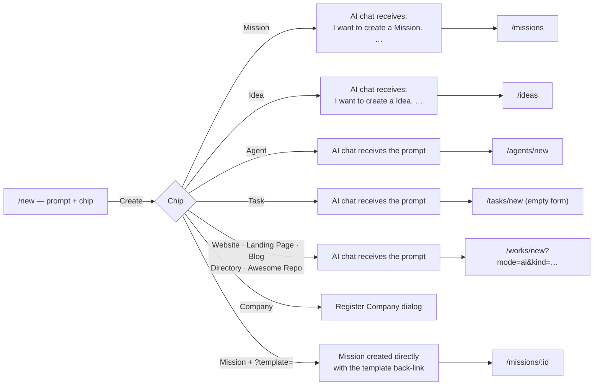

# The + New page

`/new` is the one place in the dashboard where things get created. Click **+ New** at the top of the sidebar and you land on a page with exactly two controls: a **prompt box** ("What do you want to build?") and a row of **chips** that say what kind of thing your prompt should become — a [Mission](./missions.md), an [Idea](./ideas.md), an [Agent](./agents.md), a [Task](./tasks.md), a Work of a given kind, or a Company.

The page deliberately has nothing else on it. The "Create Work Manually" and "Import Existing Work" cards live on `/works/new` (see [Creating a Work](./creating-a-work.md)); `/new` is the conversational entry point, and every other create button in the dashboard funnels into it.

## What is on the page

| Element              | What it does                                                                                                                                                                                                                                                                     |
| -------------------- | -------------------------------------------------------------------------------------------------------------------------------------------------------------------------------------------------------------------------------------------------------------------------------- |
| **Prompt box**       | A growing text area with a typewriter placeholder that cycles through example briefs for the selected chip. **Enter** submits, **Shift+Enter** inserts a newline, **Cmd/Ctrl+Enter** submits from anywhere in the text. The description must be at least 10 characters.          |
| **`+` attach menu**  | **Upload files** (PDF, docs, data, code), **Upload a folder**, or **Import GitHub repo** (public repository URL). You can also drag files onto the card or paste a screenshot straight into the text area. Attachments are handed to the AI chat together with your prompt.      |
| **Chip row**         | Rendered below the box: **Mission · Idea · Agent · Task · Website · Landing Page · Blog · Directory · Awesome Repo · Company**, then an inert **Store** chip marked **Soon**. Picking a chip writes that chip's first example prompt into the box so you have real text to edit. |
| **Chip description** | A one-line explanation under the row for the selected chip (for example, _"A one-shot brief the agent turns into a Work plan you can build."_).                                                                                                                                  |
| **Create button**    | The arrow inside the prompt card (title **Create**). Disabled while a submit is in flight.                                                                                                                                                                                       |
| **AI chat panel**    | Collapses automatically when you land on `/new` so the composer gets the full column. Reopen it from the robot icon on the sidebar — after a submit it reopens on its own.                                                                                                       |

## The chips

| Chip             | What it creates                                                                            | Where **Create** takes you                                                      |
| ---------------- | ------------------------------------------------------------------------------------------ | ------------------------------------------------------------------------------- |
| **Mission**      | An ongoing goal the platform keeps working on — generates Ideas on a schedule or one-shot. | The AI chat creates it; you land on `/missions`.                                |
| **Idea**         | A one-shot brief the agent turns into a Work plan you can build.                           | The AI chat creates it; you land on `/ideas`.                                   |
| **Agent**        | An AI teammate that acts across Missions, Works, or your whole workspace.                  | `/agents/new` (the **New Agent** dialog) with the AI chat open beside it.       |
| **Task**         | A trackable item assigned to a person or an Agent.                                         | `/tasks/new` — an **empty** form; the prompt goes to the AI chat, not the form. |
| **Website**      | A multi-page site for a business, service, or brand — generated content + code.            | `/works/new?mode=ai&kind=website`                                               |
| **Landing Page** | A focused one-pager — waitlists, product launches, webinar signups, lead capture.          | `/works/new?mode=ai&kind=landing-page`                                          |
| **Blog**         | A blog with categories, RSS, code highlighting, and SEO-ready content.                     | `/works/new?mode=ai&kind=blog`                                                  |
| **Directory**    | A curated directory site with search, filters, and structured item data.                   | `/works/new?mode=ai&kind=directory`                                             |
| **Awesome Repo** | An awesome-list repo — markdown index, categorized links, and refreshable metadata.        | `/works/new?mode=ai&kind=awesome-repo`                                          |
| **Company**      | Registers a new legal entity, which becomes an Organization in your account.               | The **Register Company** dialog opens in place; the prompt box is ignored.      |
| **Store**        | _Coming soon._ Renders as an inert chip with a **Soon** badge; it cannot be selected.      | Nowhere yet — see [Store Builder](./store-builder.md) for what is planned.      |

The five Work chips are exactly the user-selectable Work kinds the platform defines (`website`, `landing-page`, `blog`, `directory`, `awesome-repo`). Two further kinds exist on persisted Works but are never offered as chips: `company` Works are minted only through the Register Company flow, and `campaign` Works only through template activation.

### Which chip is selected when you arrive

- With a `?type=` in the URL (see [Deep links](#deep-links)) that chip is pre-selected.
- Without one, the page picks **Mission** if you have not created any Missions yet, otherwise **Idea** — first-time users land on the persistent-goal kind, returning users on the lighter one-shot path.
- An unknown `?type=` value is ignored and the default rule applies. A kind that has been switched off for your environment (below) is never pre-selected; the page drops back to **Mission**.

## What happens when you press Create

For every chip except **Company**, submit does two things at once:

1. **Opens the AI chat panel and sends your prompt as the first message**, prefixed with the chip's intent (for example, `I want to create a website. <your prompt>`), followed by a bullet list of any attachments (`name — url`) so the chat can fetch and cite them.
2. **Navigates to the canvas for that kind** — a list page or a creator form where you can edit the entity manually in parallel.

The prompt is never put into the URL. The chat conversation is the live channel from here on; the canvas page starts empty (or with only the kind pre-selected) so you are not asked the same question twice.

### Mission

The chat's `createMission` tool creates the Mission with your description. It defaults to **one-shot** and only becomes **scheduled** (with a 5-field cron expression) if you ask for recurring runs in the prompt or the conversation. You land on `/missions`; open the new card to **Run now**, pause, or change the schedule — see [Missions](./missions.md).

### Idea

The chat's `createIdea` tool creates a **user-manual** Idea from your description (the title is auto-derived when you do not give one). You land on `/ideas`, where the new card carries the **Build** button — see [Ideas](./ideas.md).

### Agent

You land on `/agents/new`, which opens the **New Agent** dialog with your Missions, Works, and Ideas loaded as scope options and the Agent template catalog available. The dialog's fields are **not** pre-filled from your prompt; either let the chat conversation create the Agent for you, or fill the form by hand. See [Agents](./agents.md).

### Task

You land on `/tasks/new` with an **empty** form.

:::warning The Task chip does not pre-fill the Task form
Typing a prompt on `/new` and picking the **Task** chip sends your prompt to the AI chat and drops you on an empty `/tasks/new`. Nothing is carried into the fields. Type the title there, or continue in the chat conversation it just started. This matches the note in [Tasks](./tasks.md).
:::

### Website, Landing Page, Blog, Directory, Awesome Repo

You land on `/works/new?mode=ai&kind=<kind>`. `mode=ai` skips the entry view of that page (its own prompt box and the Manual / Import cards) and opens the **Create Work with AI** form directly; `kind` pre-selects the Work kind so the generator produces the right shape. The form's prompt field starts empty — the chat already has your text. Fill in the Work name and any **Advanced Settings** (pipeline, AI, search, screenshot and content-extractor providers), then create it and watch generation on `/works/:id/generator`. See [Creating a Work](./creating-a-work.md).

### Company

The **Register Company** dialog opens on top of the page (it also opens immediately when you arrive on `/new?type=company`). The prompt box is ignored for this chip.

1. Enter the **Company name** (required, up to 200 characters).
2. Optionally enter a **Country** as a 2-letter ISO 3166-1 code (for example `US`, `DE`).
3. Click **Register**. The dialog calls `POST /api/organizations/register-company`, which creates an Organization with `registrationProvider = 'manual'` and `registrationStatus = 'registered'`.

If this is your **first** Organization you are offered the **Upgrade or Create** choice (move your account's existing resources under the new Organization, or start it empty). Otherwise the new Organization becomes your active workspace and you are taken to `/org/<slug>/dashboard`.

:::note Manual registration for v1
The dialog says so itself: registration is manual for v1. A formation-provider integration (Stripe Atlas) is coming — once it ships, the Organization will be linked to the real registration automatically. The rest of the [Company Builder](./company-builder.md) story builds on this Organization; the register-company flow and the Organization model are described in [Teams & Organizations](../advanced/teams-and-organizations.md#the-register-company-flow).
:::

## Deep links

`/new` reads two query parameters. Everything else in the dashboard that says "New", "Add" or "Create" is a link to one of these URLs.

| URL                                     | Effect                                                                                                                                       | Who links here                                                                                         |
| --------------------------------------- | -------------------------------------------------------------------------------------------------------------------------------------------- | ------------------------------------------------------------------------------------------------------ |
| `/new`                                  | Default chip rule (Mission if you have none, else Idea).                                                                                     | Sidebar **+ New**; **New Work** on `/works` and its empty state; onboarding **Create your first Work** |
| `/new?type=mission`                     | Mission chip pre-selected.                                                                                                                   | **Add** on the Missions block of the home dashboard, and that block's empty-state link                 |
| `/new?type=website`                     | Website chip pre-selected.                                                                                                                   | **Add** on the Recent Works block of the home dashboard; **Create Your First Work** empty state        |
| `/new?type=company`                     | Company chip pre-selected and the **Register Company** dialog opened immediately.                                                            | Deep links you build yourself (the chip on `/new` is the usual route)                                  |
| `/new?type=mission&template=<id>`       | Mission chip pre-selected and the prompt pre-filled with the template's name and description; the Mission keeps a back-link to the template. | **Use this Template** on a Mission template card at `/templates?kind=mission`                          |
| `/new?type=idea` … `?type=awesome-repo` | Any other live chip value pre-selects that chip.                                                                                             | Deep links you build yourself                                                                          |

`?template=` is only honoured when the resolved chip is **Mission** and the id matches a template in the Mission template catalog; otherwise it is ignored. The reverse also holds: opening `/works/new` without a `?mode=` or `?proposal=` parameter redirects you to `/new`.

:::info The template path creates the Mission directly
When you submit `/new?type=mission&template=<id>`, the page creates the Mission itself (one-shot, with `missionTemplateRepo` set to the template) and attaches any files you uploaded, shows the **Mission created** toast, opens the chat panel, and takes you to the new Mission's page at `/missions/:id`. Your prompt is **not** sent into the chat as a message on this path — the chat has its own `createMission` tool, and re-sending the prompt would create a second Mission without the template link. See [Mission Templates](./mission-templates.md).
:::

## Switching kinds off per environment

Every chip — the ten live ones plus Store — is gated by a feature flag named `works-<chip>` (`works-website`, `works-landing-page`, `works-blog`, `works-directory`, `works-awesome-repo`, `works-store`, `works-company`, and so on). Flags are evaluated **server-side** through PostHog, so no analytics token ever reaches the browser; only the resulting set of disabled kinds is sent to the page.

The rule is **fail-open**:

| Situation                                                            | Result                                        |
| -------------------------------------------------------------------- | --------------------------------------------- |
| No `POSTHOG_API_KEY` configured (self-hosted forks, local dev)       | Every kind enabled                            |
| PostHog unreachable, an error, or evaluation slower than 1.5 seconds | Every kind that did not resolve stays enabled |
| Flag missing or `undefined`                                          | Kind enabled                                  |
| Flag resolves to an explicit `false`                                 | Kind disabled                                 |

A disabled kind renders exactly like Store today — greyed out with a **Soon** badge — and can be neither selected nor deep-linked via `?type=` (the page falls back to **Mission**). The same flags gate the kind chips on `/works/new`. In the hosted product the `works-store` flag exists and is off, which is why Store shows as **Soon**; it can be flipped from PostHog without a code change. Store is not yet a creatable kind in any environment, though: even where no flag is set, picking the Store chip does nothing.

## How to use

1. Click **+ New** at the top of the sidebar (or go to `/new`).
2. Describe what you want in the prompt box — at least 10 characters — and add any reference files with the **`+`** menu. Pick the chip that matches what you want to end up with; the chip seeds the box with an example you can overwrite.
3. Press **Enter** or click the **Create** arrow.

What you see next depends on the chip:

| Chip                                                         | After Create                                                                                                                                                                                                                               |
| ------------------------------------------------------------ | ------------------------------------------------------------------------------------------------------------------------------------------------------------------------------------------------------------------------------------------ |
| **Mission**                                                  | The chat panel opens with your prompt and creates the Mission; `/missions` shows the new card. Open it, then **Run now** to spawn the first Ideas, or switch it to **scheduled** for a recurring loop.                                     |
| **Idea**                                                     | The chat panel opens and creates the Idea; `/ideas` shows the new card with **Build**.                                                                                                                                                     |
| **Agent**                                                    | The chat panel opens with your prompt and `/agents/new` shows the **New Agent** dialog. Continue in chat ("create it with a daily heartbeat") or fill in name, title, capabilities, scope and provider yourself.                           |
| **Task**                                                     | The chat panel opens with your prompt and `/tasks/new` shows an empty form. Ask the chat to create the Task, or type the title, priority, labels and Work in the form.                                                                     |
| **Website / Landing Page / Blog / Directory / Awesome Repo** | The chat panel opens with your prompt and the **Create Work with AI** form appears with the kind pre-selected. Enter a Work name, adjust **Advanced Settings** if needed, and create; generation progress lives on `/works/:id/generator`. |
| **Company**                                                  | The **Register Company** dialog opens. Enter a name (and optional country code) and click **Register**; you arrive in the new Organization's dashboard.                                                                                    |

:::tip The chat is the fast path
For Missions, Ideas, Agents and Tasks the chat conversation that `/new` starts can finish the job on its own — it has `createMission`, `createIdea`, `create_agent` and `create_task` registered as tools, and it asks for confirmation before anything destructive. The canvas page is there for manual edits, not a second form you must fill in.
:::

:::caution Prompts shorter than 10 characters are rejected
Submitting with fewer than 10 characters shows _"Add a description (at least 10 characters) to start."_ and nothing is sent. The Company chip is the only one that ignores the prompt box.
:::

## Related

- [Missions](./missions.md) — the persistent-goal kind the Mission chip creates.
- [Ideas](./ideas.md) — the one-shot brief the Idea chip creates, and the **Build** step that follows.
- [Creating a Work](./creating-a-work.md) — the `/works/new` form the five Work chips hand off to, including provider selection and the Manual / Import paths.
- [Tasks](./tasks.md) — the `/tasks/new` form and why the Task chip does not pre-fill it.
- [Agents](./agents.md) — what the `/agents/new` dialog asks for.
- [Mission Templates](./mission-templates.md) — the **Use this Template** button that pre-fills `/new`.
- [Company Builder](./company-builder.md) and [Teams & Organizations](../advanced/teams-and-organizations.md) — where the Company chip leads.
- [Store Builder](./store-builder.md) — the kind behind the **Soon** chip.
- [Onboarding](./onboarding.md) — the setup wizard that ends on **Create your first Work**.
