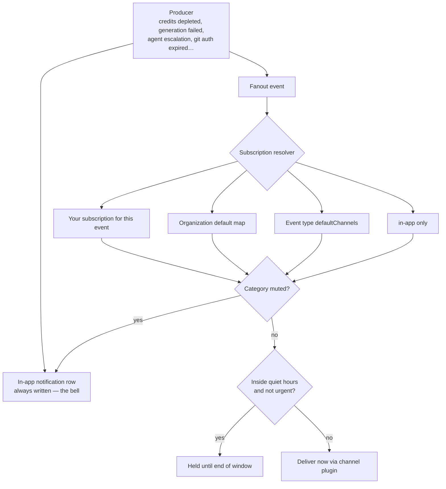

# Notifications, Channels & Preferences

Ever Works runs work while you are not watching, so it needs a way to tell you what happened. That
happens in three layers, and they are deliberately independent: the **bell** always records
everything in-app, **channels** push the same events out to Slack, Discord, Telegram, WhatsApp or
Novu, and **event subscriptions** decide which event reaches which channel.

| Layer                    | Where it lives                                          | Status in this version                                                                         |
| ------------------------ | ------------------------------------------------------- | ---------------------------------------------------------------------------------------------- |
| **In-app notifications** | The bell in the dashboard header                        | Shipped — unread count, read/read-all, dismiss, persistent alerts.                             |
| **Novu inbox embed**     | Settings → Notifications                                | Shipped, opt-in — renders only when Novu is configured (see below).                            |
| **Channels**             | Settings → Channels (`/settings/integrations/channels`) | Shipped — add, test-send, remove; five providers.                                              |
| **Event subscriptions**  | `/api/notifications/preferences/*`                      | API shipped. The Settings grid renders the matrix **read-only** in this version — use the API. |
| **Digests**              | Settings → Digest (`/settings/digest`)                  | Separate feature — see [Digests](./digests.md).                                                |

The in-app layer is never bypassed. Whatever else you configure, a notification is always written to
the bell first, so nothing you muted is actually lost — you can go back and read it.

## How a notification travels



A mute means "don't tell me", so muted categories are **dropped** from external channels. Quiet
hours mean "not right now", so non-urgent events are **deferred** to the end of the window rather
than dropped. Events flagged `urgent` bypass quiet hours entirely.

## In-app: the bell

The bell sits in the dashboard header on every page.

- **Unread badge.** A red counter on the bell, capped at `99+`. The dashboard polls the unread count
  every **30 seconds**, so a new alert appears without a page reload.
- **Opening the dropdown** loads your **20 most recent** notifications. Each row shows a type icon,
  the title, a two-line message, a relative timestamp, and an action link when the producer set one.
- **Clicking a row** marks it read and follows its action link. Navigation is restricted to
  same-origin paths, so a notification can never bounce you to an external site.
- **Mark all as read** appears in the dropdown header while anything is unread.
- **Dismiss** is the `×` on each row, which hides it from the list. **Persistent** notifications —
  the critical ones, such as an exhausted credit balance — deliberately have no dismiss button and
  stay until the underlying condition is fixed.
- **Empty state** reads _"No new notifications"_.
- **Credit alerts also toast.** When a new `ai_credits` notification arrives between polls, it
  surfaces as a toast even if you never open the dropdown, so a depleted provider is hard to miss.

### Types and categories

Every notification carries one **type** (which drives the icon and colour) and one **category**
(which is what mutes and filters operate on).

| Type      | Meaning                                     |
| --------- | ------------------------------------------- |
| `info`    | Informational, no action needed.            |
| `success` | Something finished cleanly.                 |
| `warning` | Attention needed but nothing is broken yet. |
| `error`   | Something failed.                           |

| Category       | What it covers                                                          |
| -------------- | ----------------------------------------------------------------------- |
| `ai_credits`   | Provider credit depletion, provider errors, budget thresholds.          |
| `subscription` | Plan and billing events.                                                |
| `generation`   | Work generation runs and schedules.                                     |
| `system`       | Platform-level notices.                                                 |
| `security`     | Authentication and access alerts.                                       |
| `agent`        | Agent runs, escalations, questions and approvals waiting in your Inbox. |
| `task`         | Task lifecycle.                                                         |
| `digest`       | Scheduled activity briefings — see [Digests](./digests.md).             |

### The in-app API

Every route is under `/api/notifications` and authenticates with a session token or an
[API key](./api-keys.md).

| Method | Route                             | What it does                                                                          |
| ------ | --------------------------------- | ------------------------------------------------------------------------------------- |
| `GET`  | `/api/notifications`              | List. Query: `unreadOnly`, `limit` (default 50, capped at 100), `offset`, `category`. |
| `GET`  | `/api/notifications/unread-count` | The number behind the badge.                                                          |
| `GET`  | `/api/notifications/persistent`   | Only the critical, non-dismissible ones.                                              |
| `POST` | `/api/notifications/:id/read`     | Mark one as read.                                                                     |
| `POST` | `/api/notifications/read-all`     | Mark everything as read.                                                              |
| `POST` | `/api/notifications/:id/dismiss`  | Hide one. Persistent notifications cannot be dismissed.                               |

```bash
# The five newest unread generation notifications
curl "http://localhost:3100/api/notifications?unreadOnly=true&limit=5&category=generation" \
  -H "x-api-key: ew_live_your_key_here"
```

Full request and response shapes live in the [Notifications API reference](../api/notifications.md).

### The Novu inbox embed

**Settings → Notifications** can render Novu's own inbox widget above the preferences grid — useful
if you already run Novu as your notification hub and want its stream inside the dashboard.

It is strictly opt-in and **fails closed**: the widget renders nothing unless both halves are
configured, because without the server-side subscriber hash Novu would run in unsecured mode where a
browser could subscribe as another user.

| Variable                       | Side   | Purpose                                                                                    |
| ------------------------------ | ------ | ------------------------------------------------------------------------------------------ |
| `NEXT_PUBLIC_NOVU_APP_ID`      | Client | Novu application identifier. Without it the widget is a no-op.                             |
| `NOVU_SECRET_KEY`              | Server | Used to compute the HMAC subscriber hash (secured mode). Without it the widget is a no-op. |
| `NEXT_PUBLIC_NOVU_BACKEND_URL` | Client | Point at a self-hosted Novu API instead of the default.                                    |
| `NEXT_PUBLIC_NOVU_SOCKET_URL`  | Client | Point at a self-hosted Novu websocket instead of the default.                              |

The embed is independent of the **Novu channel** described below: the embed _displays_ a Novu
inbox, the channel _delivers_ Ever Works events into a Novu workflow.

## Channels: delivery beyond the dashboard

**Settings → Channels** (`/settings/integrations/channels`) is the registry of places Ever Works can
push a notification. The page lists your channels with **Name**, **Provider**, **Verified**, and a
per-row **Test** and **Remove**; **Add channel** opens the wizard.

### The five providers

Each provider maps to a plugin under `packages/plugins/<provider>-channel`. The wizard asks for
exactly the fields that plugin validates.

| Provider     | Plugin id          | Shape     | Fields the wizard asks for                                | Notes                                                                                                                                                  |
| ------------ | ------------------ | --------- | --------------------------------------------------------- | ------------------------------------------------------------------------------------------------------------------------------------------------------ |
| **Discord**  | `discord-channel`  | broadcast | **Webhook URL**                                           | Must be a Discord webhook host (`discord.com`, `discordapp.com`, and the `ptb`/`canary` variants).                                                     |
| **Slack**    | `slack-channel`    | broadcast | **Incoming Webhook URL**                                  | Must start with `https://hooks.slack.com/`.                                                                                                            |
| **Telegram** | `telegram-channel` | direct    | **Bot Token**, **Chat ID**                                | Chat ID may be `@channelname` or the numeric id. Sends through the Telegram Bot API.                                                                   |
| **WhatsApp** | `whatsapp-channel` | direct    | **Access Token**, **Phone Number ID**, **Recipient (to)** | Uses the WhatsApp Cloud API. Phone Number ID must be numeric. Free-form messages are only deliverable within 24 hours of the recipient's last message. |
| **Novu**     | `novu-channel`     | workflow  | **API Key**, **Workflow ID**, **Subscriber ID**           | A meta-router: Ever Works triggers the workflow and Novu fans it out to email, SMS, push or chat.                                                      |

The host allow-lists are not cosmetic — they are what stops a pasted URL from turning the platform
into an outbound request proxy.

### Adding, testing and removing

The **Add channel** dialog is one screen: pick **Provider**, type a **Name**, fill the provider
fields, then **Create channel**. Every field is required; the dialog refuses to submit with a blank
one.

A newly created channel shows **Verified** as `—`. Press **Test** on its row: Ever Works sends
_"Ever Works notification channel test message ✓"_ through the plugin and prints the outcome inline —
`✓ Sent` with the delivery status, or `✗` with the provider's error message. That is the fastest way
to prove a webhook URL or bot token before you subscribe any real event to it.

**Remove** deletes the channel. Subscriptions that referenced it stop resolving to it.

### Limits and delivery mechanics

| Limit                                 | Value            |
| ------------------------------------- | ---------------- |
| Channels per user                     | 50               |
| Size of one channel's provider config | 16 KB serialized |
| Channel creation rate                 | 20 per minute    |
| Channel update rate                   | 30 per minute    |
| Channel ids per event subscription    | 20               |

Delivery details worth knowing:

- **Every attempt is logged.** Each send writes a `notification_channel_delivery_log` row, keyed on
  an idempotency reference so a retried delivery cannot double-post. **There is no delivery-log
  screen in this version** — the per-row `Test` result is the user-facing feedback, and the log is
  queryable in the database.
- **Retries are asynchronous.** Fanout hands each channel to the Trigger.dev
  `notification-channel-delivery` task, which retries with exponential backoff; a terminal failure
  marks the log row `failed`. When Trigger.dev is not configured (local development), the platform
  falls back to a synchronous in-process send.
- **One failing channel never blocks the others.** Fanout runs channels in parallel and failures do
  not propagate back to whatever produced the notification.
- **Errors are truncated.** Provider error bodies are capped before they are stored or returned.

### The channels API

| Method   | Route                                 | What it does                                     |
| -------- | ------------------------------------- | ------------------------------------------------ |
| `GET`    | `/api/notification-channels`          | List your channels.                              |
| `POST`   | `/api/notification-channels`          | Create one — `pluginId`, `name`, `targetConfig`. |
| `PATCH`  | `/api/notification-channels/:id`      | Rename, re-target, or set `disabled`.            |
| `DELETE` | `/api/notification-channels/:id`      | Remove it.                                       |
| `POST`   | `/api/notification-channels/:id/test` | Send the test message.                           |

```bash
# Add a Slack channel and immediately test it
CHANNEL=$(curl -s -X POST http://localhost:3100/api/notification-channels \
  -H "x-api-key: ew_live_your_key_here" \
  -H "Content-Type: application/json" \
  -d '{
    "pluginId": "slack-channel",
    "name": "Ops alerts",
    "targetConfig": { "webhookUrl": "https://hooks.slack.com/services/T000/B000/XXXX" }
  }' | jq -r '.channel.id')

curl -X POST "http://localhost:3100/api/notification-channels/$CHANNEL/test" \
  -H "x-api-key: ew_live_your_key_here"
```

Channel plugins are ordinary plugins: they are enabled and configured through the plugin system like
any other. See [Plugins](./plugins.md) and the [Plugin System](../plugin-system/index.md) for how
plugin settings, secrets and enablement work.

:::note Provider delivery-event webhook
Each channel plugin has a public callback at `POST /api/notification-channels/events/:pluginId` for
providers that report delivery events. In this version it only acknowledges the request so the
provider stops retrying — signature verification, and therefore acting on the payload, is still to
come. Nothing you configure depends on it.
:::

## Agents can post to a channel

An [Agent](./agents.md) can ping you directly through a channel with the **`notifyChannel`** tool:

| Parameter   | Type   | Meaning                                              |
| ----------- | ------ | ---------------------------------------------------- |
| `channelId` | string | The id of one of your enabled notification channels. |
| `text`      | string | Plain-text message body.                             |

The tool is only offered to an Agent whose permission set has **`canCallExternalTools`** enabled, and
only when the channel facade is wired. At invoke time the platform rejects an unknown, disabled, or
someone else's channel id, so an Agent cannot reach a channel you do not own.

Use it for ad-hoc, proactive status pings — _"the deploy is green, here is the URL"_. For anything
that is a recurring, structured event, prefer letting the subscription fanout handle delivery so the
user's own preferences, mutes and quiet hours still apply.

## Event subscriptions: which event goes where

:::info The preferences grid is read-only in this version
**Settings → Notifications** (`/settings/notifications`) renders the full event × channel matrix —
every registered event type as a row, `In-app` plus each of your channels as a column, and the
current selection as checked boxes — but the checkboxes do not yet save. The write path is the REST
API documented below; the interactive grid lands in a follow-up. The read-only grid is still useful:
it is the fastest way to see the exact event keys and channel ids you need for the API calls.
:::

### How the platform resolves channels for an event

For a given `(user, event type)` the resolver takes the **first** of these that yields channels:

1. Your **subscription row** for that event type.
2. Your organization's **default channel map** — applied only when your tenant owns exactly one
   organization, since a background fanout has no "active organization" signal.
3. The event type's own **`defaultChannels`** (`["in-app"]` for every core event today).
4. **`["in-app"]`** as the final fallback.

Then two filters run:

- **Category mute** — an active mute on the event's category drops every non-in-app channel. The
  in-app row is still written so you can review it later.
- **Quiet hours** — for a **non-urgent** event fired inside your window, non-in-app channels move to
  a deferred set with a `deferUntil` of the end of the window, and are enqueued with that delay.
  Urgent events ignore quiet hours.

Organization defaults are read by the resolver but have **no UI and no REST endpoint** in this
version — the map exists in the database for operators who seed it directly.

### The preferences API

| Method   | Route                                            | What it does                                                                               |
| -------- | ------------------------------------------------ | ------------------------------------------------------------------------------------------ |
| `GET`    | `/api/notifications/event-types`                 | The whole event registry — key, category, title, description, `urgent`, `defaultChannels`. |
| `GET`    | `/api/notifications/preferences`                 | Your subscriptions, quiet-hours row, and **active** mutes.                                 |
| `PUT`    | `/api/notifications/preferences/event/:eventKey` | Set the channel list for one event type.                                                   |
| `PUT`    | `/api/notifications/preferences/quiet-hours`     | Set or clear the window and timezone.                                                      |
| `POST`   | `/api/notifications/preferences/mute`            | Mute a category, optionally until a timestamp.                                             |
| `DELETE` | `/api/notifications/preferences/mute/:category`  | Unmute a category (returns `204`).                                                         |

```bash
# 1. See what you can subscribe to
curl http://localhost:3100/api/notifications/event-types \
  -H "x-api-key: ew_live_your_key_here"

# 2. Route "generation failed" to in-app plus one channel
curl -X PUT http://localhost:3100/api/notifications/preferences/event/generation_error \
  -H "x-api-key: ew_live_your_key_here" \
  -H "Content-Type: application/json" \
  -d '{ "channelIds": ["in-app", "3f7c…-your-channel-uuid"] }'

# 3. Nothing external between 22:00 and 07:00 Kyiv time
curl -X PUT http://localhost:3100/api/notifications/preferences/quiet-hours \
  -H "x-api-key: ew_live_your_key_here" \
  -H "Content-Type: application/json" \
  -d '{ "quietHoursStart": "22:00", "quietHoursEnd": "07:00", "timezone": "Europe/Kyiv" }'

# 4. Silence billing chatter for a week
curl -X POST http://localhost:3100/api/notifications/preferences/mute \
  -H "x-api-key: ew_live_your_key_here" \
  -H "Content-Type: application/json" \
  -d '{ "category": "subscription", "mutedUntil": "2026-09-10T00:00:00Z" }'
```

### Validation rules that will bite you

| Rule                                                                            | What happens otherwise                                  |
| ------------------------------------------------------------------------------- | ------------------------------------------------------- |
| `eventKey` must already exist in the registry                                   | `400 Unknown notification event type: …`                |
| Every `channelIds` entry must be `in-app` or a channel **you own**              | `400 Unknown or unauthorized notification channel: …`   |
| At most 20 channel ids per subscription (duplicates are collapsed first)        | `400 Too many notification channels`                    |
| Quiet-hours times must be `HH:mm` or `HH:mm:ss`                                 | `400 … must be in HH:mm format`                         |
| The timezone must be a real IANA zone (`UTC` and `GMT` are explicitly accepted) | `400 timezone must be a valid IANA timezone identifier` |
| `category` must be one of the categories listed above                           | `400 category must be one of: …`                        |

Two behaviours are easy to misread:

- A **`PUT`** to `quiet-hours` with an empty body `{}` **clears** the window — absent fields are
  written as `null`, the row itself is kept.
- `GET /preferences` returns only **active** mutes. A mute whose `mutedUntil` is in the past is still
  a row in the database but is filtered out of the view (and out of resolution).

A window where `start` is later than `end` is read as crossing midnight — `22:00 → 07:00` is the
night, not an empty range. A window where start equals end never matches.

## What triggers a notification

These are the core event types seeded into the registry. `Urgent` events bypass quiet hours;
`Default` is where they go when you have expressed no preference.

| Event key                      | Category     | Title                        | Urgent | Default  |
| ------------------------------ | ------------ | ---------------------------- | ------ | -------- |
| `ai_credits_depleted`          | `ai_credits` | AI credits depleted          | Yes    | `in-app` |
| `ai_provider_error`            | `ai_credits` | AI provider error            | No     | `in-app` |
| `generation_error`             | `generation` | Generation failed            | No     | `in-app` |
| `schedule_paused`              | `generation` | Schedule paused              | No     | `in-app` |
| `git_auth_expired`             | `security`   | Git authentication expired   | Yes    | `in-app` |
| `work_generation_finished`     | `generation` | Work generation finished     | No     | `in-app` |
| `work_published`               | `generation` | Work published               | No     | `in-app` |
| `agent_task_completed`         | `system`     | Agent task completed         | No     | `in-app` |
| `agent_task_failed`            | `system`     | Agent task failed            | No     | `in-app` |
| `agent_inbound_email_received` | `system`     | Agent received inbound email | No     | `in-app` |
| `mission_completed`            | `system`     | Mission completed            | No     | `in-app` |
| `mission_blocked`              | `system`     | Mission blocked              | No     | `in-app` |

The registry is not frozen at those twelve. Two more sources top it up, which is why
`GET /api/notifications/event-types` is the authoritative list for your installation:

- **Boot-time registration.** The platform re-registers the core set at startup — that path also
  carries the attention-surface and Inbox events: `agent_run_finished`,
  `agent_run_queued_too_long`, `agent_run_escalated` ("Agent needs a decision"), `inbox_question`
  (urgent), `inbox_approval_requested`, `inbox_escalation`, `inbox_notice`, and
  `fleet_runner_fallback`. See [Inbox](./inbox.md) for the surface those land on.
- **Plugins.** A plugin can declare its own notification events in its manifest; they are registered
  at plugin load under a namespaced `<pluginId>:<key>` so they can never collide with a core key.

Producers also emit events beyond the seeded set — `credits_balance_exhausted`, the pay-as-you-go cap
thresholds, `payg_past_due`, `digest_ready`, and `memory_consolidation_ready` among them. An event
key with no registry row still produces an in-app notification and simply resolves to in-app only.

## Other ways things reach you

Notifications are not the only outbound path, and picking the right one saves noise:

| You want…                                          | Use…                                                                        |
| -------------------------------------------------- | --------------------------------------------------------------------------- |
| A ping the moment something happens                | A **notification channel** subscribed to that event.                        |
| One scheduled summary instead of a stream of pings | **[Digests](./digests.md)** — Settings → Digest, personal and organization. |
| A machine-readable POST into your own system       | **[Outbound webhooks](../advanced/webhook-system.md)**.                     |
| An agent to reply in an email thread               | **[Agent Email & Inboxes](./agent-email.md)**.                              |
| A place to answer an agent's blocking question     | **[Inbox](./inbox.md)**.                                                    |

## How to: from zero to a Slack ping

1. **Create the destination in the provider.** For Slack or Discord, create an incoming webhook and
   copy its URL. For Telegram, create a bot with BotFather and note the token plus the chat id. For
   WhatsApp, get the Cloud API access token, phone number id, and the recipient number.
2. **Add the channel.** Dashboard → **Settings** → **Channels** → **Add channel**. Pick the
   provider, name it something you will recognise in a subscription (`Ops alerts`), paste the
   fields, then **Create channel**.
3. **Test it.** Press **Test** on the new row and confirm the message arrives in the destination.
   Fix the URL or token before going further — a channel that fails the test will fail every real
   delivery too.
4. **Find the channel id.** `GET /api/notification-channels` returns it, or read it off the column
   header in the read-only matrix at **Settings → Notifications**.
5. **Find the event key.** `GET /api/notifications/event-types`, or read the row titles in the same
   matrix.
6. **Subscribe the event.** `PUT /api/notifications/preferences/event/<eventKey>` with
   `{"channelIds": ["in-app", "<channel-id>"]}`. Keep `in-app` in the list unless you genuinely want
   that event to skip the bell's fanout — the bell records it either way.
7. **Set quiet hours** (optional). `PUT /api/notifications/preferences/quiet-hours`. Non-urgent
   events fired inside the window will arrive when it closes.
8. **Verify end to end.** Trigger the real event — for `generation_error`, for instance, run a
   generation you expect to fail — and confirm both the bell entry and the channel message.

## Troubleshooting

| Symptom                                                | Likely cause                                                                                       |
| ------------------------------------------------------ | -------------------------------------------------------------------------------------------------- |
| **Test** succeeds but real events never arrive         | The event is not subscribed to that channel — subscriptions default to `in-app` only.              |
| Nothing external arrives at night, everything at 07:00 | Quiet hours are deferring non-urgent events, which is what they are for.                           |
| Nothing external arrives at all, bell still fills      | An active category mute. Check `GET /api/notifications/preferences` and unmute the category.       |
| `400` when subscribing a channel id                    | The id is not one of yours, or the channel was removed. Re-list `GET /api/notification-channels`.  |
| Checkboxes at Settings → Notifications do not stick    | Expected — the grid is read-only in this version. Use the preferences API.                         |
| The Novu widget never appears                          | Both `NEXT_PUBLIC_NOVU_APP_ID` and the server-side `NOVU_SECRET_KEY` must be set; it fails closed. |
| The bell badge lags behind                             | It polls every 30 seconds. Reopen the dropdown to force a fresh load.                              |

## See also

- [Inbox](./inbox.md) · [Digests](./digests.md) · [Agent Email & Inboxes](./agent-email.md)
- [Agents (Your AI Employees)](./agents.md) · [Plugins](./plugins.md) · [Settings Map](./settings-map.md)
- [Budgets & Usage](./budgets-and-usage.md) — the source of most `ai_credits` alerts
- [Outbound Webhooks](../advanced/webhook-system.md) · [Plugin System](../plugin-system/index.md)
- API reference: [Notifications](../api/notifications.md)
