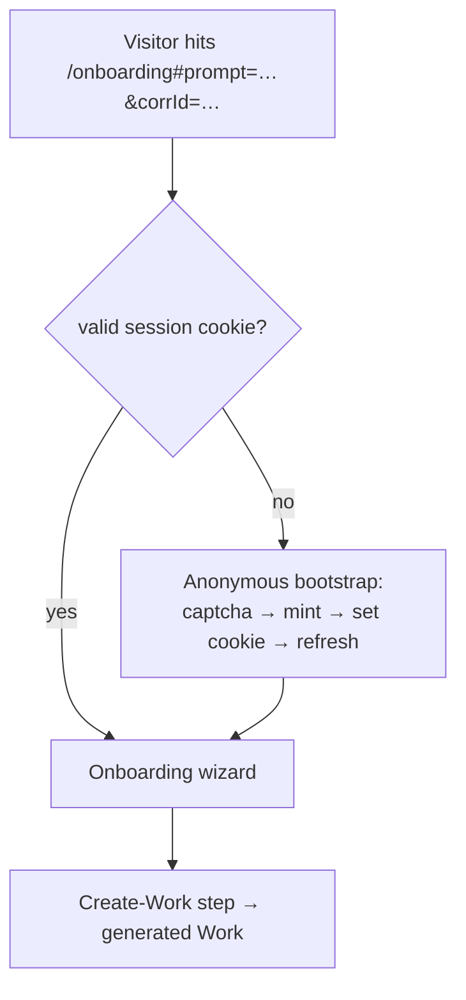

# Onboarding & Setup Wizard

Ever Works is built for a **zero-friction** first run: a brand-new visitor
can land on `/onboarding`, type a prompt, and get a generated
[Work](./creating-a-work.md) — without first creating an account or
touching any settings. Users who want more control get a short **guided
setup wizard** to pick their AI, storage, deployment, and plugins before
the first Work is generated.

This page covers the human-facing `/onboarding` page and the wizard. For
the **agent-facing** single-call registration API (no UI, no human),
see [Zero-Friction Onboarding for Agents](/agent-services/zero-friction-onboarding).

**Key sources:**

- `apps/web/src/app/[locale]/onboarding/page.tsx` — the `/onboarding` route
- `apps/web/src/app/[locale]/onboarding/anonymous-bootstrap.tsx` — anonymous session mint
- `apps/web/src/app/actions/onboarding/anonymous.ts` — the mint server action
- `apps/web/src/components/onboarding/EverWorksOnboardingWizard.tsx` — the wizard UI
- `apps/web/src/components/onboarding/useOnboardingFlow.ts` — the step model
- `apps/api/src/onboarding/onboarding-catalog.controller.ts` / `onboarding-state.controller.ts` — the wizard's catalog + state API

## The `/onboarding` page

`/onboarding` is a **public**, never-indexed, always-dynamic route (it
depends on the auth cookie). It handles two audiences with the same page:

- **No session (a fresh marketing-site visitor)** — the page renders the
  anonymous bootstrap, which mints a temporary guest session client-side
  and then re-renders down the authenticated branch.
- **Signed-in or already-anonymous** — the page mounts the same wizard the
  dashboard mounts as a dialog, here forced open on a standalone page.

### Anonymous guest bootstrap

When there's no session, `AnonymousOnboardingBootstrap` mints a guest
session so every downstream request is authenticated. The
`startAnonymousOnboarding` server action calls `POST /api/auth/anonymous`
and persists the returned token as the **same encrypted, httpOnly cookie
the login flow sets** — so no separate "guest mode" plumbing is needed
downstream. Details verified in `anonymous.ts`:

- A `correlationId` is forwarded only when it's a valid **UUID v4** (the
  API's DTO is `@IsUUID('4')` with `forbidNonWhitelisted`, so a non-UUID
  would 400 the whole mint). This threads the marketing-funnel
  correlation through to the generated Work.
- A captcha token (Turnstile) can be supplied; a `400` from the API is
  surfaced as "couldn't verify your browser — please sign up to
  continue", and a `429` as a throttle message.

The prompt itself arrives in the URL fragment
(`/onboarding#prompt=…&corrId=…`) so the visitor's typed idea survives the
hop from the marketing site into the guest session.

## The guided setup wizard

The wizard is a linear, resumable walkthrough. Its step list is computed
from the current state (`computeStepList` in `useOnboardingFlow.ts`), so
**config steps are shown only when they're needed** — if you keep the
Ever Works default for a bucket (which needs no per-user config), that
bucket's config step is skipped entirely.

| # | Step               | Purpose                                                        |
| - | ------------------ | -------------------------------------------------------------- |
| 1 | `welcome`          | Intro + preview of the upcoming steps                          |
| 2 | `ai-choice`        | Pick the AI provider bucket (Ever Works default, or your own)  |
| 3 | `ai-config`*       | Configure the chosen AI provider (skipped for the default)     |
| 4 | `storage-choice`   | Pick storage (Ever Works default, or your own GitHub)          |
| 5 | `storage-config`*  | Connect GitHub (shown only for `user-github`)                  |
| 6 | `deploy-choice`    | Pick a deploy target (Ever Works default, Vercel, or k8s)      |
| 7 | `deploy-config`*   | Configure the target (shown only for `vercel` / `k8s`)         |
| 8 | `plugins-catalog`  | Review and enable optional plugins                             |
| 9 | `create-work`      | Enter/confirm the prompt and **Generate** the first Work       |

_\* Config steps are conditional. `ai-config` is dropped when the AI
choice is the Ever Works default; `storage-config` appears only for the
`user-github` choice; `deploy-config` appears only for `vercel` or
`k8s`._

The four configurable buckets — **AI, Storage, Deployment, Plugins** —
each default to a zero-config Ever Works option so a user can click
straight through to "Generate now". Every choice can also be changed later
from **Settings**.

### Wizard data

- **Catalog** — `GET /api/onboarding/catalog` returns
  `{ ai, storage, deploy, plugins }`, the options rendered on the choice
  steps. Each call degrades to a safe empty fallback, so even an empty or
  anonymous catalog still lands the user on the create-work step.
- **State** — `GET /api/onboarding/state`, `POST /api/onboarding/complete`,
  `POST /api/onboarding/dismiss` persist wizard progress so it's resumable
  across sessions.
- **Plugins** — only plugins flagged `uiHints.includeInOnboarding` appear,
  ordered by `onboardingPriority`.

## Related pages

- [Zero-Friction Onboarding for Agents](/agent-services/zero-friction-onboarding) —
  the single-call `POST /api/register-work` registration for AI agents.
- [Creating a Work](./creating-a-work.md) — what the final step generates.
- [Teams & Organizations](../advanced/teams-and-organizations.md) — how a
  guest/user's data is scoped once they create an Organization.
