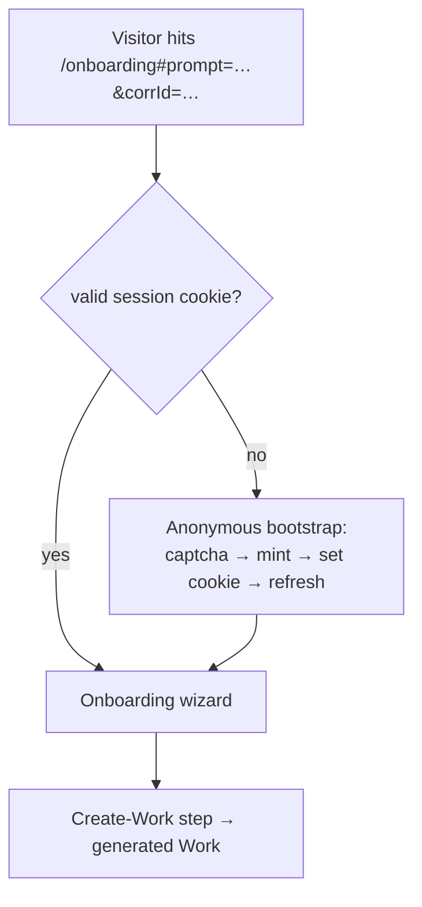

# Onboarding & Setup Wizard

Ever Works is built for a **zero-friction** first run: a brand-new visitor
can land on `/onboarding`, type a prompt, and get a generated
[Work](./creating-a-work.md) — without first creating an account or
touching any settings. Users who want more control get a short **guided
setup wizard** to pick their AI, storage, database, deployment and plugins
before the first Work is generated.

This page covers the human-facing `/onboarding` page and the wizard. For
the **agent-facing** single-call registration API (no UI, no human),
see [Zero-Friction Onboarding for Agents](/agent-services/zero-friction-onboarding).

**Key sources:**

- `apps/web/src/app/[locale]/onboarding/page.tsx` — the `/onboarding` route
- `apps/web/src/app/[locale]/onboarding/anonymous-bootstrap.tsx` — anonymous session mint
- `apps/web/src/app/actions/onboarding/anonymous.ts` — the mint server action
- `apps/web/src/components/onboarding/EverWorksOnboardingWizard.tsx` — the wizard UI
- `apps/web/src/components/onboarding/useOnboardingFlow.ts` — the step model
- `apps/api/src/onboarding/onboarding-catalog.controller.ts` / `onboarding-state.controller.ts` — the wizard's catalog + state API

## The `/onboarding` page

`/onboarding` is a **public**, never-indexed, always-dynamic route (it
depends on the auth cookie). It handles two audiences with the same page:

- **No session (a fresh marketing-site visitor)** — the page renders the
  anonymous bootstrap, which mints a temporary guest session client-side
  and then re-renders down the authenticated branch.
- **Signed-in or already-anonymous** — the page mounts the same wizard the
  dashboard mounts as a dialog, here forced open on a standalone page.

```mermaid
graph TD
    V["Visitor hits /onboarding#prompt=…&corrId=…"] --> S{"valid session cookie?"}
    S -->|no| AB["Anonymous bootstrap:<br/>captcha → mint → set cookie → refresh"]
    S -->|yes| W["Onboarding wizard"]
    AB --> W
    W --> CW["Create-Work step → generated Work"]
```

### Anonymous guest bootstrap

When there's no session, `AnonymousOnboardingBootstrap` mints a guest
session so every downstream request is authenticated. The
`startAnonymousOnboarding` server action calls `POST /api/auth/anonymous`
and persists the returned token as the **same encrypted, httpOnly cookie
the login flow sets** — so no separate "guest mode" plumbing is needed
downstream. Details verified in `anonymous.ts`:

- A `correlationId` is forwarded only when it's a valid **UUID v4** (the
  API's DTO is `@IsUUID('4')` with `forbidNonWhitelisted`, so a non-UUID
  would 400 the whole mint). This threads the marketing-funnel
  correlation through to the generated Work.
- A captcha token (Turnstile) can be supplied; a `400` from the API is
  surfaced as "couldn't verify your browser — please sign up to
  continue", and a `429` as a throttle message.

The prompt itself arrives in the URL fragment
(`/onboarding#prompt=…&corrId=…`) so the visitor's typed idea survives the
hop from the marketing site into the guest session.

## The guided setup wizard

The wizard opens by itself the first time you reach the dashboard with no
Works yet, and stays out of your way afterwards: once you complete it — or
close it — it does not reopen on its own.

It is a dialog with a **stepper down the left-hand side**. The stepper is
not just a progress bar: every entry is clickable, so you can jump
straight to the step you care about and back again. A progress bar across
the top tracks how far through you are, and the footer carries **Back**,
**Skip step** and **Next**.

Three things are worth knowing before you start:

- **Every step that asks you something can be skipped.** The footer
  carries a skip action all the way to the final step — labelled
  *Skip — set up later* on the plugins step — and skipping is recorded,
  not punished. You can also leave the whole thing with **Close wizard**
  at the bottom of the stepper.
- **Your choices are saved as you make them.** Each transition is written
  to the server, so progress survives a reload, a new device or a wiped
  cookie. If a save fails you are told, rather than clicking through a
  wizard that persists nothing.
- **Nothing here is permanent.** As the wizard's own sidebar says, you can
  change any choice later from Settings. See
  [The Settings Map](./settings-map.md) for where each one lives.

If you close the wizard before finishing, a **Setup** badge appears in the
dashboard header showing which step you are on, so you can pick it up
again. Dismissing that badge does not mark setup as complete.

### The ten steps

With the Ever Works defaults kept, the wizard is ten steps:

| #   | Step                        | What you choose                                                  |
| --- | --------------------------- | ---------------------------------------------------------------- |
| 1   | **Welcome**                 | Nothing — an intro plus a preview of the steps ahead.            |
| 2   | **Your AI choice**          | Which AI provider powers content generation.                     |
| 3   | **Your Git Storage**        | Where your Work repositories live.                               |
| 4   | **Your DB Storage**         | Where your Works store their data.                               |
| 5   | **Your deployment**         | Where your Works get deployed.                                   |
| 6   | **Where it runs**           | Whether Ever Works itself runs hosted, on your machine, or on your machines. |
| 7   | **What do you do**          | Your roles and team size — used to suggest starting points.      |
| 8   | **Communication**           | The chat workspace your team lives in.                           |
| 9   | **Plugins & Integrations**  | Optional power-user integrations.                                |
| 10  | **Create your first Work**  | The prompt, and the button that generates it.                    |

Picking a bring-your-own option adds a configuration step immediately
after the choice it belongs to, so the wizard gets **longer** as you move
away from the defaults:

| Choosing…                                    | Adds                     |
| -------------------------------------------- | ------------------------ |
| Any AI provider other than **Ever Works AI** | **Configure AI**         |
| **Your GitHub**                              | **Configure storage**    |
| **Vercel** or **Kubernetes**                 | **Configure deployment** |

Configuration steps are where you paste credentials or complete an OAuth
or device-authorisation flow. They also get a **Refresh** button in the
footer, so after connecting in another tab you can re-check the connection
without leaving the wizard. Keeping the Ever Works default for a bucket
skips that bucket's configuration step entirely — there would be nothing
to fill in.

:::note Options marked "Coming soon"
Some cards render with a **Coming soon** badge, greyed out and not
selectable. **Which ones do depends on your installation's
configuration** — the managed Ever Works options in particular are
switched on or off per install, so a card that is selectable on the hosted
platform may appear as coming soon on a self-hosted one, and the other way
round. Trust the badge in front of you over any list, including this page.
:::

### Step 1 — Welcome

An introduction to what Ever Works is, and a list of the steps that
follow. There is nothing to choose; **Next** moves on.

### Step 2 — Your AI choice

Pick the AI provider that powers content generation. Six options:

| Option              | Notes                                                                   |
| ------------------- | ----------------------------------------------------------------------- |
| **Ever Works AI**   | The default. Uses the provider Ever Works has configured. No setup.     |
| **OpenRouter**      | Route AI calls through OpenRouter with your own API key.                |
| **Claude Code**     | Anthropic Claude via the Claude Code CLI.                               |
| **Codex**           | OpenAI Codex CLI, connected through a device-authorisation flow.        |
| **Gemini**          | Google Gemini via your AI Studio API key.                               |
| **Grok (xAI)**      | xAI Grok via your xAI API key.                                          |

Every option except **Ever Works AI** is marked **BYOK** — bring your own
key — and adds the **Configure AI** step where you supply the credential.

### Step 3 — Your Git Storage

Where your Work repositories live. Four options:

| Option              | Notes                                                     |
| ------------------- | --------------------------------------------------------- |
| **Ever Works Git**  | The default — a managed Ever Works GitHub org.            |
| **Your GitHub**     | Your own GitHub account or organization.                  |
| **Your GitLab**     | Bring your own GitLab.                                    |
| **Your Git**        | A self-hosted Git server.                                 |

**Your GitHub** adds the **Configure storage** step, where you sign in with
GitHub so the platform can create repositories for you.

### Step 4 — Your DB Storage

Where your Works keep their data. Two options:

- **Ever Works DB** — the managed default. **A database is provisioned per
  Work**, automatically; there is nothing to set up.
- **Custom DB** — your own PostgreSQL server. You supply a connection
  string, which is used for all of your Works, with a database created per
  Work.

### Step 5 — Your deployment

Where your Works get deployed. Three options:

| Option           | Notes                                                                                     |
| ---------------- | ----------------------------------------------------------------------------------------- |
| **Ever Works**   | The default — deploy to the Ever Works tenant cluster. The card states the per-account cap on active Works. |
| **Vercel**       | Your own Vercel team, using your API token.                                               |
| **Kubernetes**   | Your own cluster — you paste a kubeconfig.                                                |

**Vercel** and **Kubernetes** both add the **Configure deployment** step.

### Step 6 — Where it runs

Unlike the four steps before it, this one names no provider. It records
where Ever Works *itself* runs, which decides the guidance you get at the
end of the wizard. Three options, all always available:

| Option                    | Meaning                                                                        |
| ------------------------- | ------------------------------------------------------------------------------ |
| **The hosted platform**   | The default. Everything runs on Ever Works; nothing to install.                |
| **On my machine**         | [Ever Works Desktop](./desktop-app.md) runs the API and web app locally and supervises them. |
| **On my own machines**    | The platform runs wherever you like, but your machines execute the work — enrolled as [Fleet](./fleet.md) nodes. |

The choice decides the closing advice on the last step. Picking
**On my machine** adds a *Finish your desktop setup* block pointing at
**Settings → Job Runtime**; picking **On my own machines** adds an *Add
your first node* block pointing at **Settings → Fleet**. The hosted
default adds nothing — there is nothing left to install.

### Step 7 — What do you do

Two questions, both optional, used only to suggest better starting points.
Nothing is hidden or gated based on your answers.

**Your roles** is a multi-select — pick as many as apply. There are
fourteen:

| Role              | As the card describes it                        |
| ----------------- | ----------------------------------------------- |
| Founder / CEO     | I run the company and wear many hats            |
| Engineering       | I build and ship software                       |
| Product           | I define what we build and why                  |
| Marketing         | I grow awareness, content, and campaigns        |
| Sales             | I find, pitch, and close customers              |
| Consultant        | I deliver projects and advice for clients       |
| Research          | I investigate, analyze, and synthesize          |
| Operations        | I keep the business running smoothly            |
| Support           | I help customers succeed and resolve issues     |
| Finance           | I manage budgets, billing, and reporting        |
| HR                | I hire, onboard, and support our people         |
| Legal             | I handle contracts, compliance, and policy      |
| Education         | I teach, train, or create learning content      |
| Other             | Something else — tell us more later             |

**Team size** is a single-select: **Solo**, **Small (2–10)**,
**Mid (11–50)**, **Large (51–200)** or **Enterprise (200+)**.

Once you have picked at least one role, a **Suggested agents for you**
block may appear with prebuilt [Agent](./agents.md) templates matched to
those roles. You can create one at a time with **Create agent**, or take
the lot with **Set up my starter agents**. Both are optional, and the
block hides itself if the suggestions cannot be loaded.

### Step 8 — Communication

Connect the chat workspace your team lives in, so you can talk to the
platform without leaving the conversation.

- **Slack** — expand the card to enter the connector's settings and enable
  it in place, without leaving the wizard. A link to the full plugin
  settings page is offered as well.
- **Discord** — shown with a **Coming soon** chip.

If your installation ships without the Slack connector, the card links out
to **Settings → Plugins** instead of connecting inline.

### Step 9 — Plugins & Integrations

A short catalogue of power-user integrations, presented for discovery
rather than configuration — the step's own copy says most people skip it.
Clicking a card expands its settings inline if you do want to set one up
now. The integrations offered here are:

- **Composio**
- **Make.com**
- **SIM AI**
- **Zapier**
- **Activepieces**

The list is built from the plugins your installation has, minus anything
already used by an earlier step, so it can be shorter — or empty, in which
case the step says there are no additional integrations available.

### Step 10 — Create your first Work

The last step. If you arrived with a prompt — typed on the marketing site,
or carried in from earlier — the step reads *Ready to generate* and shows
the prompt in an editable box with a **Generate now** button that creates
the Work and starts generation in one click, using the choices you just
made. Without a prompt it reads *Create your first Work* and links into the
full [Create a Work](./creating-a-work.md) form instead.

Below the primary action sits the follow-on guidance chosen by
[step 6](#step-6--where-it-runs), when there is any. The footer's
**Finish** completes the wizard.

## Changing any of it later

Nothing chosen in the wizard is locked in. The provider buckets map onto
the plugin categories in Settings:

| Wizard step        | Where to change it afterwards         |
| ------------------ | ------------------------------------- |
| Your AI choice     | **Settings → AI Providers**           |
| Your Git Storage   | **Settings → Git Providers**          |
| Your DB Storage    | **Settings → Database**               |
| Your deployment    | **Settings → Deployment**             |
| Where it runs      | **Settings → Fleet** / **Job Runtime** |
| Communication      | **Settings → Plugins**                |
| Plugins & Integrations | **Settings → Plugins**            |

See [The Settings Map](./settings-map.md) for the full layout.

## Wizard data

- **Catalog** — `GET /api/onboarding/catalog` returns
  `{ ai, storage, db, deploy, desktop, plugins }`, the options rendered on
  the choice steps. Each card carries an `available` flag that drives the
  **Coming soon** state, so the UI is never hard-wired to backend
  configuration. Each call degrades to a safe empty fallback, so even an
  empty or anonymous catalog still lands the user on the create-work step.
- **State** — `GET /api/onboarding/state`, `PATCH /api/onboarding/state`,
  `POST /api/onboarding/complete` and `POST /api/onboarding/dismiss`
  persist wizard progress so it's resumable across sessions. Skipped steps
  are recorded in the same blob.
- **Plugins** — only plugins flagged `uiHints.includeInOnboarding` appear,
  ordered by `onboardingPriority`, minus the ids already claimed by the
  AI / storage / database / deployment / communication steps.

## Related pages

- [Creating an Account](./creating-an-account.md) — the signup that leads here.
- [The Settings Map](./settings-map.md) — where every choice above lives afterwards.
- [Zero-Friction Onboarding for Agents](/agent-services/zero-friction-onboarding) —
  the single-call `POST /api/register-work` registration for AI agents.
- [Creating a Work](./creating-a-work.md) — what the final step generates.
- [Teams & Organizations](../advanced/teams-and-organizations.md) — how a
  guest/user's data is scoped once they create an Organization.
