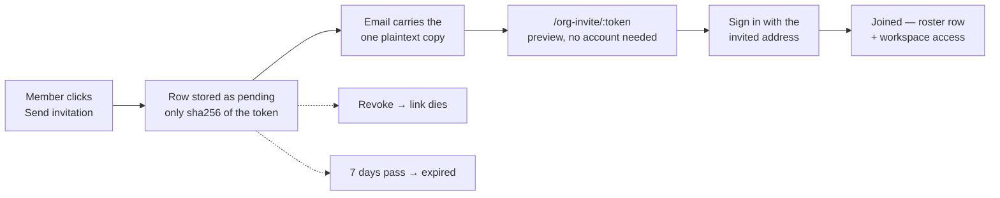

# Organizations, Invitations & Company Registration

An **Organization** is your workspace. Everything you build — [Missions](./missions.md), [Ideas](./ideas.md), [Works](./creating-a-work.md), [Agents](./agents.md), [Teams](./teams.md), Memory — belongs to one, and the Organization is what you share with other people when you stop working alone.

You do not need an Organization to start: a brand-new account works fine on its own, and the platform creates the underlying container for you the moment you make your first one. This page covers what an Organization gives you, how invitations work, how to register a Company, and how to import a whole prebuilt one.

## The workspace switcher

The switcher is the top row of the dashboard sidebar — the chip showing your logo or the current Organization's name, `aria-label` **"Switch Organization"**. When the sidebar is collapsed it is just the icon at the top; clicking it opens the same menu either way.

The menu lists every Organization on your account, ticks the active one, and ends with **+ Create Organization**.

Picking an Organization does two things: it persists your choice as the workspace you land in on your next login (`POST /api/users/me/scope`), then crosses into it with a fresh page load at **`/org/<slug>/dashboard`**. That `/org/<slug>` prefix is the canonical shape for every page inside an Organization — `/org/acme/missions`, `/org/acme/works`, `/org/acme/settings/organization`. Paths without the prefix are your **personal** scope: the same dashboard, scoped to you rather than to an Organization.

:::note Rows created in a workspace stay in that workspace
A Mission created while `acme` is active is stamped with that Organization. Switching the switcher does not move anything that already exists — see the upgrade flow below for the one exception, which runs once, for your first Organization.
:::

## How to create an Organization

1. Click the workspace switcher at the top of the dashboard sidebar, then **+ Create Organization**. (With zero Organizations you can also use the **Create your first Organization** banner at the top of **Settings → Profile**, `/settings`.)
2. Optionally pick a starting point under **Start from** — **Blank organization**, or one of the prebuilt companies from the catalog. The list only renders when the catalog is reachable; see [Prebuilt companies](#prebuilt-companies-import-a-whole-company) below.
3. Type a **Name** (1–200 characters). A slug preview appears underneath and is checked live against `GET /api/organizations/check-slug` — **Available**, **Taken, try: …**, or a soft "Couldn't check availability — you can still submit".
4. Optionally expand **Add company vision (optional)** and write the Vision (up to 5000 characters). You can add or change it later.
5. Submit — **Create**, or **Create from template** when a template is selected.

The slug is allocated for you if you did not supply one, and it is globally unique across users, tenants and Organizations, so two accounts can never claim the same one.

### The first Organization asks about your existing work

If this is your **first** Organization, a second dialog appears immediately: **"Move your existing items?"**

| Choice                  | What happens                                                                                                      |
| ----------------------- | ----------------------------------------------------------------------------------------------------------------- |
| **Move existing items** | Your existing Missions, Ideas and Works are re-stamped into the new Organization (`POST …/upgrade-from-account`). |
| **Start empty**         | Your existing items stay in your personal account; the Organization starts fresh.                                 |

:::caution The move is a one-time offer, and only for your first Organization
`POST /api/organizations/:id/upgrade-from-account` is gated by a **first-Org guard**: it is callable only while you have exactly one Organization and `:id` is that Organization. Once a second Organization exists the endpoint returns `409 Conflict` with the code `UPGRADE_NOT_AVAILABLE_AFTER_MULTIPLE_ORGS`, and the dialog reports "Move isn't available for this Organization". Calling it twice on the same first Organization is safe — the second call simply updates nothing.
:::

## Settings → Organization

The Organization's own settings live at **`/settings/organization`** (inside an Organization workspace, the same page is `/org/<slug>/settings/organization`). If you have several Organizations, a select at the top picks which one you are editing.

The page holds three blocks:

| Block            | What it does                                                                                                        |
| ---------------- | ------------------------------------------------------------------------------------------------------------------- |
| **Vision**       | The Organization's long-term direction, in plain text. Up to 5000 characters.                                       |
| **Merge policy** | Whether Agents may land their own pull requests here — see [Merge Policy](./merge-policy.md).                       |
| **Members**      | The roster, the invite form, and the pending invitations — see [Members and invitations](#members-and-invitations). |

### The Vision field

The Vision is not decoration. When it is set, it is injected as a fenced segment of context into **Idea generation**, **agent-run prompt assembly** and **Mission tick context**, so every agent working in this Organization is told what the company is trying to become. The field's own helper text says exactly that: _"Shared with every AI agent working in this Organization."_

1. Open **Settings → Organization**.
2. Pick the Organization in the select, if you have more than one.
3. Write the Vision — one or two sentences beat a page of prose, because prompt consumers apply their own tighter injection cap of roughly 2000 characters.
4. Press **Save**. A **Saved** flash appears and **Vision last updated** is stamped underneath.

Clearing the textarea and saving is an explicit "no vision context for agents" — it stores `null`, it does not leave the old text behind.

The same field is writable over the API:

```bash
curl -X PATCH http://localhost:3100/api/organizations/<org-id> \
  -H "Authorization: Bearer <token>" \
  -H "Content-Type: application/json" \
  -d '{"vision":"Become the place small teams launch and grow AI-run businesses."}'
```

## Members and invitations

An Organization's roster lives in the **Members** block of **Settings → Organization**. It shows who is in, who has been invited but has not accepted, and — for everyone except the owner and yourself — a **Remove** button.

### How to invite someone

1. Open **Settings → Organization** and scroll to **Members**.
2. Type the person's **Email address**.
3. Click **Send invitation**.

What happens next depends on who that address belongs to:

| Situation                                                | Result                                                                                                                         |
| -------------------------------------------------------- | ------------------------------------------------------------------------------------------------------------------------------ |
| A stranger, or someone with an account elsewhere         | An email goes out carrying a single-use link. The row appears under **Pending invitations**.                                   |
| Someone already in this workspace but not on this roster | They are added straight away, with no email — the UI says _"… already had an account here, so they were added straight away."_ |
| Someone already on this roster                           | Refused: **"That person is already a member of this organization."**                                                           |
| An address that already has a pending invitation         | Refused: **"That address already has a pending invitation. Revoke it first to send a new one."**                               |

Invitations are throttled to **10 per minute** per caller, because each one sends mail to an arbitrary address.

:::danger Membership is workspace-wide, not per-Organization
The invite form says so directly: _"People you invite can see every organization in this workspace, not just this one."_ Access is granted at the account container (the Tenant), so someone you invite into one Organization can see every Organization you own. This was an explicit v1 decision. If you need a genuinely separate boundary for a collaborator, give them a [Work Member](./work-members.md) role on the single Work instead — that is the layer with real per-object roles.
:::

### What the invited person sees

The link lands on **`/org-invite/<token>`**, a public page that works with no account at all:

- It names the Organization and shows the invited address **masked**, so a forwarded link never leaks the full address.
- It prints the expiry date.
- Failures are explained rather than generalized — _this invitation has expired_, _this invitation was cancelled_, _this invitation has already been used_, _we could not find this invitation_ — because a visitor with no account cannot debug anything.

To accept, they sign in (or register) **with the invited address** and confirm. The token is bound to that address: possession of the link alone is deliberately not enough.



### Invitation rules worth knowing

| Rule                                             | Detail                                                                                                                                                                                  |
| ------------------------------------------------ | --------------------------------------------------------------------------------------------------------------------------------------------------------------------------------------- |
| **Expiry**                                       | 7 days by default; the API clamps any override to between 1 and 30 days.                                                                                                                |
| **One live invite per address per Organization** | Enforced in the database. Revoke the pending one before issuing a new one.                                                                                                              |
| **The token is never returned by the API**       | Not even to the person who issued it. It exists in the email and nowhere else; the row stores only its SHA-256 hash.                                                                    |
| **Email-bound**                                  | Accepting while signed in as a different address fails with `invitation_email_mismatch` (403).                                                                                          |
| **One workspace per person**                     | Someone who already belongs to another workspace cannot accept; the API answers `409 user_already_in_another_tenant`.                                                                   |
| **A failed send self-revokes**                   | If the email cannot be delivered, the invitation is revoked automatically — otherwise it would block re-inviting that address for a token nobody holds. Just send it again.             |
| **Seats**                                        | When a seat allowance applies, it is checked both when inviting and when accepting, so an invitation cannot smuggle in a seat later. See [Credits & Billing](./credits-and-billing.md). |

:::caution Expiry is evaluated, never swept
Nothing moves rows to `expired` on a timer, so a **Pending invitations** row can still read _pending_ after its expiry date. The accept path always re-evaluates the real expiry, so an over-age link fails cleanly — but do not read the list as proof a link still works.
:::

### Roles: exactly one, today

Both the roster and the invitation carry a `role` column, and the only value it can hold is **`member`**. That column is **display-only — it is not an authorization input.** Authorization for an Organization is a single check: your account's workspace container must be the Organization's. The write-side seam (`ensureAdmin`) exists and is already wired into org-level writes, but it currently resolves to the same check as reading, deliberately: shipping an "admin" option that grants nothing would be worse than having no option at all.

So, concretely, today:

- Every member of an Organization can invite, revoke, remove other members, and edit Organization settings.
- The workspace owner cannot be removed by anyone.
- You cannot remove yourself from the members list (the button is not offered).
- Removing someone deletes their roster row. If it was their last membership in the workspace, their account is released so they can own an Organization of their own again. **No content is deleted.**

The role enum that _does_ grant and restrict things is `WorkMemberRole` — Owner / Manager / Editor / Viewer, scoped to a single Work. See [Work Members](./work-members.md).

:::info Wrong Organization IDs answer "not found", not "forbidden"
Every `/api/organizations/:orgId/…` route answers `404` on any failure — unknown ID, or an ID that exists in someone else's workspace. That is deliberate: a probe cannot tell the two apart, so other people's Organization IDs stay opaque.
:::

## Tenant vs. Organization

Underneath the Organization there is a second, internal primitive: the **Tenant**. The Tenant is the account container — one per user, created lazily the first time you make an Organization — and it is what every business row is ultimately scoped by; the Organization is the user-facing workspace you name, share and switch between, and one Tenant can hold several. You will never see the word "Tenant" in the product, and there is nothing to configure: it exists so that access, billing seats and data isolation have a single stable boundary while your Organizations come and go. The full model — scope tiers, the ownership guard, the backfill that runs when you create your first Organization — is documented in [Teams & Organizations](../advanced/teams-and-organizations.md) and [Multi-Tenancy & Isolation](../advanced/multi-tenancy.md).

## Register a Company

"Company" and "Organization" are the same row wearing two labels. **Organization** is the word used in Settings and the switcher; **Company** is the word used on the create surface, because it reads more naturally to a founder. Registering a Company is a second door into the same object, with one extra thing attached: a backing [Work](./creating-a-work.md) of kind `company` that stands for the registration itself.

### How to register one

1. Open **`/new`** (the **+ New** button under the workspace switcher).
2. Pick the **Company** chip. The **Register Company** dialog opens immediately — the prompt box above it is ignored for this chip. (Landing on `/new?type=company` opens the dialog for you.)
3. Fill in **Company name** (1–200 characters) and, optionally, **Country (ISO 3166-1)** — a two-letter code such as `US` or `DE`.
4. Click **Register**.

The API then, in order: creates a draft Work of kind `company` to carry the registration, creates the Organization linked to that Work with `registrationProvider = "manual"` and `registrationStatus = "registered"`, and transitions the Work to `registered`. If this was your first Organization you get the same **"Move your existing items?"** dialog as above; otherwise you are taken straight to `/org/<slug>/dashboard`.

:::note What "v1" means here — no incorporation provider is wired up yet
This is the **manual** path, and the dialog says so under the form: _"Manual registration for v1."_ Nothing is filed with any registrar: no paperwork is submitted, no jurisdiction workflow runs, and the country code is recorded rather than acted on. The Company Work is a lightweight registration record — it provisions no website or data repository of its own. What you get is a real, usable Organization with the registration metadata preserved, so an incorporation provider can be attached later without re-keying anything. The lifecycle states `draft → pending → registered` already exist for that day; manual registrations land directly in `registered`.
:::

For where this is heading — the organization-as-a-business surface, staffed by Agents — see [Company Builder](./company-builder.md).

## Prebuilt companies: import a whole company

Instead of an empty Organization, you can materialize one that already has its teams, its Agents, their skills, and some starting Works and Tasks. These packages live in the public [`ever-works/orgs`](https://github.com/ever-works/orgs) catalog.

### How to import one

1. Open the workspace switcher and click **+ Create Organization**.
2. Under **Start from**, pick a company from the list. Each card shows its agent and team counts.
3. Optionally change the **Name** — the override drives both the display name and the derived slug.
4. Click **Create from template**.

Over the API that is two calls:

```bash
# 1. What is in the catalog?
curl http://localhost:3100/api/org-templates \
  -H "Authorization: Bearer <token>"

# 2. Materialize one (5 requests per minute, per user)
curl -X POST http://localhost:3100/api/organizations/import-company \
  -H "Authorization: Bearer <token>" \
  -H "Content-Type: application/json" \
  -d '{"templateSlug":"<slug-from-the-catalog>","name":"Acme Inc."}'
```

### What you get

The import creates the Organization first — that is the pivot — and then materializes everything else independently:

| From the package | Becomes                                                     | Cap |
| ---------------- | ----------------------------------------------------------- | --- |
| `COMPANY.md`     | The Organization                                            | —   |
| `TEAM.md`        | A [Team](./teams.md), with its roster and its manager Agent | 20  |
| `AGENTS.md`      | An [Agent](./agents.md), **paused**, with no heartbeat      | 50  |
| `SKILL.md`       | A Skill, bound to the Agents that declare it                | 60  |
| `PROJECT.md`     | A **draft** Work                                            | 20  |
| `TASK.md`        | A [Task](./tasks.md)                                        | 200 |

The response is a report: `created` counts for teams, agents, members, skills, works and tasks, plus a `skipped[]` array. Per-entity failures — an unreadable file, one over the 128 KB file cap, something above a cap — are **reported, not thrown**: the Organization and everything that did import survive.

:::caution Imported Agents arrive paused, on purpose
Nothing starts running by itself. Imported Agents have no heartbeat cadence and stay inactive until a human enables them, so you can read what a template actually staffed you with — and what it is permitted to do — before any of it wakes up. Imported Works arrive as drafts for the same reason.
:::

An imported Organization is a **plain** Organization: `registrationStatus` is `draft`, there is no registration provider, and no linked Company Work. Importing is not registering.

### When the template step is missing

The catalog is fetched from the `ever-works/orgs` repository's `manifest.json` and cached for an hour. Access is resolved in this order: a GitHub App installation on `ever-works`, then `EVER_WORKS_ORGS_TOKEN`, then `GITHUB_TOKEN` — and if none of those resolve, the repository is public, so it is read anonymously. **A token is an optimization for rate limits, never a requirement.**

Every failure path returns an empty list, and an empty list means the **Start from** step simply does not render. Organization creation itself never breaks because the catalog is unreachable.

| Environment variable    | Purpose                                                                                                                                                 |
| ----------------------- | ------------------------------------------------------------------------------------------------------------------------------------------------------- |
| `EVER_WORKS_ORGS_TOKEN` | GitHub token for reading the catalog, when no App installation is available.                                                                            |
| `GITHUB_TOKEN`          | Fallback token, used when the one above is unset.                                                                                                       |
| `EVER_WORKS_ORGS_REF`   | Catalog ref. Defaults to `main`; **pin it to a commit SHA or a `vX.Y.Z` tag in production** — a mutable ref logs a supply-chain warning on every fetch. |

## What else is scoped to an Organization

Beyond Missions, Ideas and Works, several features have an explicitly organization-level layer:

| Feature                     | Organization-level behaviour                                                                                                                                                      | Where                                                       |
| --------------------------- | --------------------------------------------------------------------------------------------------------------------------------------------------------------------------------- | ----------------------------------------------------------- |
| **Vision**                  | Injected into Idea generation, agent-run prompts and Mission ticks for every agent in the Organization.                                                                           | Settings → Organization                                     |
| **Knowledge Base / Memory** | Documents published once at the Organization level. The `legal`, `style` and `seo` classes are inherited by every Work, with per-Work override.                                   | `/memory`, or `POST /api/organizations/:orgId/kb/documents` |
| **Memory consolidation**    | A per-Organization opt-in cadence for the daily consolidation pass. Off for every Organization until switched on.                                                                 | See [Memory](./memory.md)                                   |
| **Digest**                  | A briefing composed across the whole Organization, separate from your personal digest. Turning the org digest on changes nothing about what a member already receives personally. | Settings → Digest, `GET /api/digest?scope=organization`     |
| **Merge policy**            | The organization scope of the policy chain — `platform default < tenant < organization < Work < Agent`, resolved field by field.                                                  | Settings → Organization, or `PATCH /api/organizations/:id`  |
| **Teams**                   | Teams exist only inside an Organization; with no Organization, `/teams` stays gated.                                                                                              | See [Teams](./teams.md)                                     |

:::caution Organization notification defaults are not settable yet
The platform can resolve a per-Organization default channel list for a notification event, and it does so only when your workspace has **exactly one** Organization (a multi-Organization workspace has no unambiguous answer, so it falls through to the event-type defaults). There is no UI or API to write those defaults today — configure notifications per person under **Settings → Notifications** instead. See [Notifications](./notifications.md).
:::

### Platform admin is a different thing entirely

Self-hosted installs have a platform-admin flag for cross-user operations such as admin usage reporting. It is an operator capability, not an Organization role: it grants nothing inside your Organization and does not bypass the workspace check on any Organization route. It is documented under [Teams & Organizations](../advanced/teams-and-organizations.md#platform-admin).

## API reference

Everything is JWT-authenticated unless marked public.

| Method   | Path                                          | What it does                                                              |
| -------- | --------------------------------------------- | ------------------------------------------------------------------------- |
| `POST`   | `/api/organizations`                          | Create an Organization (`name`, optional `slug`, optional `vision`)       |
| `GET`    | `/api/organizations`                          | List your Organizations, newest first                                     |
| `GET`    | `/api/organizations/check-slug?value=`        | **Public**, 30/min — slug availability                                    |
| `GET`    | `/api/organizations/:slug`                    | Fetch one by slug                                                         |
| `PATCH`  | `/api/organizations/:id`                      | Update `displayName`, `legalName`, `countryCode`, `vision`, `mergePolicy` |
| `POST`   | `/api/organizations/:id/upgrade-from-account` | Move your existing rows in — first-Organization only, else `409`          |
| `POST`   | `/api/organizations/register-company`         | Register a Company (`name`, optional `legalName`, `countryCode`, `slug`)  |
| `POST`   | `/api/organizations/import-company`           | Import a prebuilt company, 5/min (`templateSlug`, optional `name`)        |
| `GET`    | `/api/org-templates`                          | The prebuilt-company catalog; `[]` when unreachable                       |
| `GET`    | `/api/organizations/:orgId/members`           | The roster                                                                |
| `DELETE` | `/api/organizations/:orgId/members/:userId`   | Remove a member (never the owner, never yourself)                         |
| `GET`    | `/api/organizations/:orgId/invitations`       | Invitations issued for this Organization                                  |
| `POST`   | `/api/organizations/:orgId/invitations`       | Invite by email, 10/min — the token is never returned                     |
| `DELETE` | `/api/organizations/:orgId/invitations/:id`   | Revoke a pending invitation                                               |
| `POST`   | `/api/org-invite/preview`                     | **Public**, 10/min — read an invitation without consuming it              |
| `POST`   | `/api/org-invite/accept`                      | Redeem it as the signed-in user                                           |
| `GET`    | `/api/users/me/scope`                         | The workspace you land in on login                                        |
| `POST`   | `/api/users/me/scope`                         | Set it (`organizationSlug`)                                               |

Two of these are `POST` for what is really a read — the invitation preview and accept — so the token stays out of URLs, request logs and error-tracking payloads.

## Related

- [Teams](./teams.md) — grouping Agents and people inside an Organization, and the Org Chart.
- [Work Members](./work-members.md) — the layer that actually grants and restricts per-Work access, with real roles.
- [Company Builder](./company-builder.md) — where the Company shape is heading.
- [Memory](./memory.md) · [Knowledge Base](./knowledge-base.md) — organization-level documents and per-Work inheritance.
- [Merge Policy](./merge-policy.md) — the organization scope of the merge-policy chain.
- [Digests](./digests.md) — personal and organization briefings.
- [Notifications](./notifications.md) — per-person channels, preferences and quiet hours.
- [Credits & Billing](./credits-and-billing.md) — seats and spend, charged to the workspace owner.
- [Teams & Organizations](../advanced/teams-and-organizations.md) — the Tenant/Organization model, the ownership guard, the backfill.
- [Multi-Tenancy & Isolation](../advanced/multi-tenancy.md) — per-Work RBAC and settings isolation.
