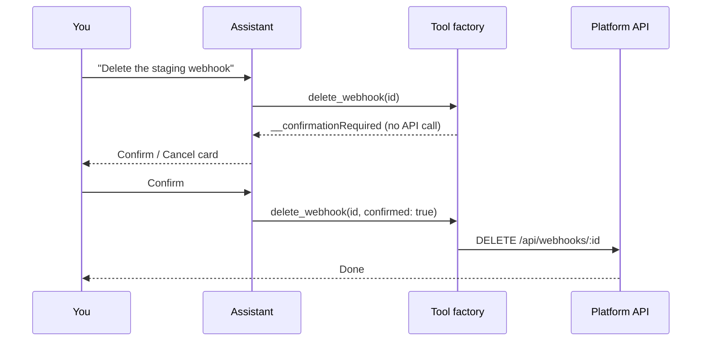

# Platform Chat & Canvas

Every dashboard page in Ever Works carries a **chat rail** — an AI assistant that can do what the buttons on that page do. Ask it to create a [Mission](./missions.md), pause an [Agent](./agents.md), add a Work member, enable a plugin, or chart last month's spend, and it calls the same platform API the dashboard uses, as you, one entity at a time, asking before anything irreversible. Rich answers — charts, tables, stat tiles, boards — open in a side **Canvas** instead of a wall of markdown.

The design goal is literally "chat does everything": one registry entry per platform operation, generated into a chat tool, with three product rules baked in — **act as the logged-in user**, **confirm before destructive**, and **no bulk**.

## The chat rail

The rail is mounted once in the dashboard layout, so it follows you across pages and keeps its conversation.

| Control                  | Where                                | What it does                                                                                                                                                                                                                       |
| ------------------------ | ------------------------------------ | ---------------------------------------------------------------------------------------------------------------------------------------------------------------------------------------------------------------------------------- |
| Chat toggle (robot icon) | Right edge of the navigation sidebar | Opens the panel. Open/closed state is stored in the `chat-panel-open` cookie, so the rail is already open on your next page load.                                                                                                  |
| Resize handle            | Right border of the open panel       | Drag between 350px and half the viewport; the width is remembered. **Expand chat** fills the main column; **Collapse chat** hides it.                                                                                              |
| **New chat**             | Toolbar, left                        | Starts a fresh conversation. The model you pinned carries over.                                                                                                                                                                    |
| **History**              | Toolbar, left                        | Lists your saved conversations newest-first with relative dates (Today, Yesterday, `3d ago`); click a row to reopen it with its messages intact; hover a row for the delete icon.                                                  |
| **Provider** selector    | Toolbar, right                       | Picks which AI-provider plugin answers this conversation. Providers you enabled but never configured show a **Not configured** badge and stay disabled until you add credentials under **Settings → Plugins → AI Providers**.      |
| **Model** picker         | Beside the composer                  | **Provider default**, the provider's **Configured** tier models (simple / medium / complex), or search **All models** in the provider's catalog. The pin is stored on the conversation row, so it survives a reload on any device. |
| Composer                 | Bottom                               | Placeholder _Ask me anything…_ — **Enter** sends, **Shift+Enter** adds a line, **Stop generating** aborts a streaming reply.                                                                                                       |
| **Attach files**         | Composer                             | Upload files (25 MB per file) as context; chips show upload progress and a message may consist of attachments alone.                                                                                                               |
| **Dictate**              | Composer                             | Push-to-talk. Live speech recognition where the browser supports it, otherwise the clip is recorded and transcribed by your AI-provider plugin. Dictated text is appended to the draft — it is never sent on its own.              |
| Welcome suggestions      | Empty conversation                   | One-click prompts: _Show my works_, _Build a Work for AI tools_, _Check my git connection_, _Show my stats_, and _Suggest a Work to build_.                                                                                        |

:::note On small screens
Below 768px the rail stops being a side panel and opens as a full-screen overlay titled **Chat**, with a **Close chat** button in its header.
:::

## What it can do

The tool set is assembled by `buildChatTools()` from three sources. At the time of writing that is roughly **400 tools**: about 330 generated single-entity tools, 58 hand-written tools, and 8 canvas / report tools.

| Family                        | What is in it                                                                                                                                                                                                                                                                                                                                                                                                                                                                                                                                                                                                           |
| ----------------------------- | ----------------------------------------------------------------------------------------------------------------------------------------------------------------------------------------------------------------------------------------------------------------------------------------------------------------------------------------------------------------------------------------------------------------------------------------------------------------------------------------------------------------------------------------------------------------------------------------------------------------------- |
| Hand-written tools            | The original works lifecycle with bespoke UX: list / create / import / update / delete / sync Works, add / remove / update / generate items, check item health, regenerate markdown, deploy and check deployment status, domains, schedules, git and deploy connection checks, pipelines, web search, navigation, the _suggest a Work_ sub-agent, and the full Mission and Idea lifecycle (create, pause, resume, complete, clone, run now, build, dismiss, accept, attach a Work).                                                                                                                                     |
| Generated single-entity tools | One registry row per platform API operation, turned into a tool whose call routes through the authenticated API client. Domains: Agents (incl. runs, files, attachments, memory, export / import), Tasks (assignees, reviewers, approvers, relations, blocks, recurrence, chat, spend), Skills and skill bindings, Work members and invitations, Plugins and integrations, Knowledge Base documents and tags, Notifications and channels, API keys, Budgets and usage, Webhooks, Organizations, Templates, Deployments and domains, Meetings, Fleet nodes, Merge policy, event ingest, digests and pull-request review. |
| Canvas and report tools       | `renderChart`, `renderTable`, `renderStatCards`, `renderDetail`, `showComponent`, `runReport`, `listReports`, `buildReport` — see [Canvas](#canvas) and [Reports](#reports).                                                                                                                                                                                                                                                                                                                                                                                                                                            |

Some things you can say, and the tool that answers:

| You say                                                    | Tool that runs                                             |
| ---------------------------------------------------------- | ---------------------------------------------------------- |
| "Create a mission that publishes a weekly AI-tools digest" | `createMission` (after asking for anything that's missing) |
| "Pause the researcher agent"                               | `pause_agent`                                              |
| "Assign task T-12 to the CTO agent"                        | `assign_task_to_agent`                                     |
| "Invite jane@example.com to this work as an editor"        | `invite_work_member`                                       |
| "Enable the Slack connector"                               | `enable_plugin`                                            |
| "What's the merge policy for this work?"                   | `resolve_merge_policy`                                     |
| "Show my tasks as a board"                                 | `runReport` → `tasks_board`                                |
| "Delete the webhook for staging"                           | `delete_webhook` — behind the confirmation card            |

The rules the assistant works under:

- **It acts as you.** Every call carries your session; the API enforces ownership exactly as it does for the dashboard.
- **One entity at a time.** No bulk endpoints are registered, and the tool factory rejects any call that smuggles an array of ids, members or emails through a single tool (you see a bulk-rejection notice instead). Ask for "delete all my works" and it will ask which one to start with.
- **Confirm before destructive.** See [the confirmation gate](#the-confirmation-gate).
- **It uses where you are.** The current page URL is passed with every message, so on `/works/:id/…` you never have to paste the Work id. After creating a Work it navigates to it; after other mutations it reloads the page so the dashboard reflects the change.
- **It asks before guessing.** Missing name, cadence, URL — it asks rather than inventing values.

### Per-turn tool gating

Sending 400 tool schemas on every turn would blow past provider function-count limits, so each turn surfaces a bounded set: an always-on core (works, navigation, canvas, reports, web search) plus every domain whose keywords appear in your last three messages or in the current page URL, capped at 128 tools. Coverage is never lost — if the assistant seems not to know a tool, name the domain ("…the **agent** called Researcher", "…this **webhook**") and its tools are pulled into the next turn.

## The confirmation gate

Any operation that deletes, removes, revokes, disconnects, cancels, rotates a secret, or spends money or credit on your behalf is marked `requiresConfirmation` — `delete_task`, `revoke_api_key`, `remove_work_member`, `rotate_webhook_secret`, `disconnect_oauth`, `cancel_generation`, `run_agent_now`, `send_email_message`, `update_subscription_plan`, `leave_work`, `archive_template` and their siblings. At the time of writing 54 generated tools carry the flag; the spec targets 56.



The card is titled **Confirm this action** and names the tool and its target. Nothing happens until you click **Confirm** — the model is instructed never to set `confirmed: true` on its own, and the factory returns the marker instead of touching the API when the flag is missing. **Cancel** tells the assistant to stand down.

Canvas and report tools never need confirmation; they only render data you already fetched.

## Canvas

When a tool produces something better seen than read, the assistant renders it into the **Canvas**, a slide-over panel on the right (560px wide, or 92% of the viewport on narrow screens). The chat shows a compact chip ending in _· in canvas_; click it to focus that artifact. Several artifacts in one conversation get a tab strip. Artifacts are saved with the conversation, so reopening a thread from **History** brings its charts back.

| Artifact kind | Tool              | Renders                                                                                            |
| ------------- | ----------------- | -------------------------------------------------------------------------------------------------- |
| `chart`       | `renderChart`     | Line, bar, area or pie chart from row data with one or more series.                                |
| `table`       | `renderTable`     | A scannable grid for lists of works, items, agents, tasks, runs.                                   |
| `stat`        | `renderStatCards` | A row of metric tiles with optional hints — totals, counts, spend.                                 |
| `detail`      | `renderDetail`    | One entity's label / value fields plus status badges (default / success / warning / danger).       |
| `kanban`      | `runReport`       | Columns of cards, e.g. tasks or missions grouped by status.                                        |
| `component`   | `showComponent`   | One of the bespoke components below, with props the assistant fills from data it already gathered. |

Bespoke components (`CANVAS_COMPONENT_KEYS`): `progress`, `timeline`, `gauge`, `comparison`, `markdown`, `gallery`, `funnel`, `metric_delta`, `donut`, `sparkline`, `bars`, `kpi`, `steps`, `badges`, `json`, `code`, `heatmap`, `rating`, `calendar`, plus two typed human-in-the-loop payloads — `hitl_question` (a confirm / choice / multi-choice / text / approval question an Agent needs a person to answer) and `hitl_answer` (the matching reply). A malformed payload degrades to a visible error, never a crash.

## Reports

Analytics questions have a turnkey path. `runReport` fetches the data as you, aggregates it, and renders the result into the Canvas in one call; `listReports` lists the catalog; `buildReport` covers the long tail.

| Report id                      | Renders                               | Needs a Work |
| ------------------------------ | ------------------------------------- | :----------: |
| `tasks_by_status`              | Bar chart of your tasks by status     |              |
| `tasks_by_priority`            | Pie chart of your tasks by priority   |              |
| `tasks_board`                  | Kanban board of your tasks            |              |
| `agents_by_status`             | Bar chart of your agents by status    |              |
| `agents_board`                 | Board of your agents by status        |              |
| `missions_by_status`           | Bar chart of your missions by status  |              |
| `missions_board`               | Board of your missions by status      |              |
| `works_by_status`              | Bar chart of your works by status     |              |
| `ideas_by_status`              | Bar chart of your ideas by status     |              |
| `notifications_by_type`        | Notifications grouped by type         |              |
| `webhook_deliveries_by_status` | Webhook deliveries grouped by status  |              |
| `skills_count`                 | Skill totals                          |              |
| `api_keys_count`               | API key totals                        |              |
| `account_spend_overview`       | Account-wide spend tiles              |              |
| `activity_per_day`             | Activity events per day               |              |
| `work_spend_trend`             | Daily spend for one Work (area chart) |     yes      |
| `work_spend_by_plugin`         | Spend per plugin for one Work         |     yes      |
| `work_usage_overview`          | Usage tiles for one Work              |     yes      |
| `work_members_by_role`         | Members of one Work grouped by role   |     yes      |
| `work_items_per_day`           | Items generated per day for one Work  |     yes      |
| `work_overview`                | One Work's headline numbers           |     yes      |

`buildReport` groups any of 19 list sources — tasks, agents, missions, ideas, works, skills, notifications, webhooks and their deliveries, plugins, organizations, notification channels, API keys, templates, and the Work-scoped work items, work members, KB documents, comparisons and deployments — by any field (`status`, `priority`, `role`, `category`, …) into a bar or pie chart. "How are my ideas split by status?" or "Chart this work's items by category" need no named report.

## Where prompts route

The chat is the single front door for "I want to create something". The prompt composers on the dashboard hand your text to the chat as its first message, prefixed with the intent, and then open the matching canvas page so you can edit by hand in parallel.

| Composer                                           | Intent prefix                                                                         | Where you land                                                        |
| -------------------------------------------------- | ------------------------------------------------------------------------------------- | --------------------------------------------------------------------- |
| `/new` — chips                                     | Mission, Idea, Agent, Task, website, landing page, blog, directory, awesome list repo | The list or creator page for that chip                                |
| `/works/new` — kind selector                       | The chosen Work kind                                                                  | Work creation                                                         |
| `/missions` — quick-add (**Start in chat**)        | "I want to create a Mission. …"                                                       | Stays on `/missions`; the Mission appears once chat confirms creation |
| `/ideas` — quick-add                               | "I want to create an Idea. …"                                                         | Stays on `/ideas`                                                     |
| **Teams → Agents** tab — composer + template chips | "I want to create an Agent. …"                                                        | `/agents/new`                                                         |
| Dashboard Ideas section                            | Idea                                                                                  | Dashboard                                                             |

Attachments added through a composer's **+** button travel with the prompt as references the assistant can open. If the chat is unavailable, the composer keeps your draft and points you at the deterministic form instead (for example **or create manually** → `/missions/new`). The one exception is the **Company** chip on `/new`, which opens the Register-Company dialog directly rather than starting a chat.

### Work-scoped chat

On any Work page (`/works/:id/…`) the assistant knows which Work you mean and can cite that Work's [Knowledge Base](./knowledge-base.md). A reply that references a document as `kb:{class}/{slug}` (for example `kb:brand/voice`) gets a **Cited:** footer under the message, one hover chip per document, resolved through the same KB endpoints the workbench uses.

### Task chat

Each Task at `/tasks/:id` has its own chat thread, separate from the rail. Mention an Agent by slug (`@ceo can you review this?`) and the platform dispatches a run for that Agent unless it already has one live; `[[kb-doc]]` tokens link Knowledge Base documents into the Task's Related panel. Messages are capped at 16,384 characters, can be edited afterwards, and anything that looks like an API secret is rejected before it is stored. See [Tasks](./tasks.md).

## Beyond the dashboard

### Slack

With the Slack app connected (see [Integrations](./integrations.md#slack)), mentioning `@works` in a channel routes the text into the same chat completion engine as the bound user and posts the reply into the thread; `/works <question>` takes the same path and answers at the channel root after an instant private acknowledgement. Both paths use your configured AI provider and model and honour Work-scoped Knowledge Base grounding. They return answers — the Slack bridge does not execute the dashboard's confirmation-gated tools, so "delete the staging webhook" from Slack is a question, not an action.

### OpenAI-compatible API

The engine behind the rail is exposed as `POST /api/v1/chat/completions`, so any OpenAI-style client can talk to your platform with your provider plugins and your Work context.

| Detail                       | Value                                                                                                                                                                                                         |
| ---------------------------- | ------------------------------------------------------------------------------------------------------------------------------------------------------------------------------------------------------------- |
| Auth                         | `Authorization: Bearer <token>`                                                                                                                                                                               |
| `x-work-id` header           | Scopes the completion to one Work — per-Work AI plugin settings and `@kb:{class}/{slug}` mentions in the latest user message are resolved against it. Omit it and the platform falls back to your first Work. |
| `x-provider-override` header | Route this request to a specific AI-provider plugin id (`openrouter`, `anthropic`, …).                                                                                                                        |
| Body                         | `model` (`auto` = the provider's configured default), `messages`, optional `temperature`, `max_tokens`, `stream`, and OpenAI-shaped `tools` / `tool_choice`.                                                  |
| Streaming                    | `stream: true` returns `text/event-stream` with `chat.completion.chunk` frames and a final `data: [DONE]`.                                                                                                    |
| No provider configured       | `422 { "error": { "type": "provider_unavailable" } }` — never a 5xx.                                                                                                                                          |

```bash
curl -X POST http://localhost:3100/api/v1/chat/completions \
  -H "Authorization: Bearer <token>" \
  -H "x-work-id: <work-id>" \
  -H "Content-Type: application/json" \
  -d '{
    "model": "auto",
    "messages": [
      { "role": "user", "content": "Summarize @kb:brand/voice in three bullets." }
    ]
  }'
```

Tools passed in the body are handed to the model and returned as `tool_calls`; executing them is the caller's job. The dashboard rail is one such caller — its tool loop runs in the web app on top of this endpoint.

### Persisted conversations

Everything the rail's **History** view shows lives behind `/api/conversations`, which you can drive directly.

| Method   | Endpoint                          | What it does                                                                                                               |
| -------- | --------------------------------- | -------------------------------------------------------------------------------------------------------------------------- |
| `GET`    | `/api/conversations`              | `{ conversations: [...], total }`, newest activity first; `limit` (default 50, max 200) and `offset` paginate.             |
| `POST`   | `/api/conversations`              | Create with optional `title`, `providerId` and `model`. The provider is stamped at creation and cannot be changed later.   |
| `GET`    | `/api/conversations/:id`          | The conversation plus its `messages` (oldest first, each with its own `model` and token `usage`).                          |
| `PATCH`  | `/api/conversations/:id`          | Update `title` and / or the pinned `model` (empty string clears the pin). Returns `204`.                                   |
| `POST`   | `/api/conversations/:id/messages` | Append `{ messages: [{ role, content, model?, usage?, parts? }] }`. The first user message auto-titles an untitled thread. |
| `DELETE` | `/api/conversations/:id`          | Delete one conversation (`204`).                                                                                           |
| `DELETE` | `/api/conversations`              | Delete all of your conversations — `{ deleted: n }`.                                                                       |

Conversations are private to the user who created them; another user's id returns `404`.

### MCP server

The [MCP server](./mcp-server.md) is a different, deliberately smaller surface: a curated whitelist of API operations for external AI clients, authenticated with an API key. Use it when the conversation is happening outside Ever Works; use the rail when you are in the dashboard and want the confirmation cards and the Canvas.

## How to use

1. Sign in and click the robot icon on the right edge of the sidebar. The panel opens on any dashboard page (for example `/works`) and stays open on the pages you visit next.
2. In the toolbar pick a **Provider**. If the one you want is greyed out as **Not configured**, open **Settings → Plugins → AI Providers**, add its credentials, and come back. Optionally pin a model with the **Model** picker next to the composer.
3. Type what you want — "Create an agent called Researcher, scoped to this mission, running every morning" — and press **Enter**. Attach a brief with **Attach files** or use **Dictate** if you would rather talk.
4. Answer the follow-up questions. The assistant asks for anything it will not guess (name, cadence, URL) and calls the tool when it has enough.
5. When a **Confirm this action** card appears, read the tool and target it names, then click **Confirm** to run it or **Cancel** to stop. Nothing irreversible runs before that click.
6. For analytics, ask the question ("show spend over time for this work", "how are my tasks distributed?"). The result opens in the **Canvas**; click the _· in canvas_ chip in the chat to focus it, and use the tab strip when several artifacts have been rendered.
7. Watch the page: after creating a Work the assistant navigates to it, after other changes it reloads so the dashboard reflects what it did.
8. Find the conversation later under **History**, reopen it with its messages and canvas artifacts, or hover a row to delete it. **New chat** starts a fresh thread on the same model.

## Limits

- **Coverage vs. the spec.** The chat-everything spec inventories 419 single-entity operations; roughly 400 tools are registered at build time today and the remaining bespoke canvas components and named reports from the spec are covered by the generalized `showComponent` and `buildReport` mechanisms rather than hand-built. Some generated mutations take a generic `body` object with a hint rather than a field-level schema, so the assistant may ask you for the exact fields.
- **No bulk operations, by design.** One entity per call; bulk item delete / update / publish and batch deploy endpoints are excluded from the registry and guarded at runtime.
- **A configured AI provider is required.** Without one the composer shows _This provider is not configured. Set it up in Plugins._ and the API answers `422 provider_unavailable`. See [Plugins](./plugins.md).
- **Work scope is contextual, not stored.** A conversation row has no Work column; scoping comes from the page you are on (dashboard) or the `x-work-id` header (API).
- **Per-turn gating.** At most 128 tools are active on a turn. Naming the domain in your message brings its tools in.
- **Slack answers, it does not operate.** The `@works` / `/works` bridge runs a plain completion without the dashboard's tool loop.
- **The MCP server is a smaller, separate tool set** — see [MCP Server](./mcp-server.md).

## Related

- [Integrations (Slack, GitHub, connectors, meetings)](./integrations.md) · [Knowledge Base & Memory](./knowledge-base.md)
- [Missions](./missions.md) · [Ideas](./ideas.md) · [Tasks](./tasks.md) · [Agents (Your AI Employees)](./agents.md)
- [Plugins](./plugins.md) · [Budgets & Usage](./budgets-and-usage.md) · [MCP Server](./mcp-server.md)
- API reference: [AI Conversation](../api/ai-conversation.md) · [Agents](../api/agents.md) · [Tasks](../api/tasks.md)
