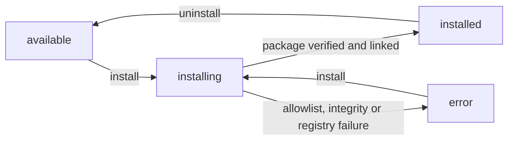

# Plugins

A **plugin** is a capability the platform does not have on its own — a model to write with, a search engine to research with, a Git host to push to, somewhere to deploy. The platform ships the sockets; plugins fill them.

Open **Plugins** in the dashboard sidebar (`/plugins`) to see every plugin your install carries.

## Plugins vs. the pages that look like plugins

| You want to…                                                     | Go to…                                                                              |
| ---------------------------------------------------------------- | ----------------------------------------------------------------------------------- |
| Turn an AI provider, search engine, Git host or deploy target on | **Plugins** (`/plugins`)                                                            |
| Give a plugin its API key, token or model                        | The plugin's own page — **Settings** on its card                                    |
| Walk plugin settings one category at a time                      | **Settings → Plugins** (`/settings/plugins`)                                        |
| Change which plugin serves a capability inside one Work          | That Work's **Plugins** tab → **Capability Providers**                              |
| Connect Slack / GitHub / meetings so their activity streams in   | [Integrations](./integrations.md) — connector plugins plus the pipeline around them |

`/settings/plugins` has no page of its own: it redirects to the **AI Providers** category, and each category page lists only the plugins in that category you have already enabled. Every category except **Pipeline** answers with a _page not found_ when that list comes back empty — so until you have enabled an AI provider, following the redirect lands on a 404 rather than an empty page.

## What the page shows

The list is grouped under category headings. Searching, or picking a category chip, flattens it into a single grid.

| Control          | What it does                                                                                          |
| ---------------- | ----------------------------------------------------------------------------------------------------- |
| Search box       | Matches the plugin **name**, **description**, **category** and **capabilities**. Not settings values. |
| Category chips   | **All**, plus one chip per category that has at least one plugin registered on this install.          |
| **Enabled only** | Hides everything not currently enabled.                                                               |

Each card carries the icon, name, version, description, a category tag, up to two capability tags (any beyond two collapse into a `+N` count), a **Settings** link, a **Docs** link when the plugin declares an `http:` or `https:` homepage, and the **Enable** / **Disable** button. Capabilities that merely repeat the plugin's category, and a handful of internal ones, are never shown as tags.

One of two badges can sit next to the version — never both, since a plugin that is registered as both system and built-in shows only **System**:

| Badge        | Meaning                                                                                                                         |
| ------------ | ------------------------------------------------------------------------------------------------------------------------------- |
| **System**   | Always on. There is no Enable/Disable button, and the API rejects a disable with _"is a system plugin and cannot be disabled"_. |
| **Built-in** | Registered as built-in rather than as an externally installed package. Changes nothing about enabling or disabling.             |

Cards are sorted enabled first, then installed, then alphabetically — but that order is captured **once, when the page loads**, so a card you just toggled stays put instead of jumping. Reload to re-sort.

## Categories

Twenty-four categories exist. Twenty of them have a fixed display order:

**Pipeline · AI Providers · Search · Content Processors · Screenshots · Git Providers · Deployment · Data Sources · Storage · Databases · Vector Stores · DNS Providers · Email Providers · Notification Channels · Job Runtimes · Secret Stores · Forms · Integrations · Utilities · Themes**

Four are not in that list — **Connectors**, **Metrics**, **Memory Frameworks** and **RAG Pipelines** — so they all sort to the bottom, after the twenty above. Use the search box or a category chip to jump to one.

A few whose scope is easy to guess wrong:

| Category                  | What plugs in here                                                                                                                                                                          |
| ------------------------- | ------------------------------------------------------------------------------------------------------------------------------------------------------------------------------------------- |
| **Storage**               | Object-storage backends — local filesystem, S3, MinIO, GitHub blob.                                                                                                                         |
| **Databases**             | The relational backend for deployed Works: the tenant-level connection, plus a per-Work database derived from it. Distinct from **Storage**.                                                |
| **Notification Channels** | Outbound-only delivery targets.                                                                                                                                                             |
| **Connectors**            | Channel plugins built on the same outbound send contract as Notification Channels, plus an inbound leg. Each connector declares which directions it implements; most declare outbound only. |
| **Secret Stores**         | Backends that resolve an opaque credential reference (Vault, Kubernetes, Infisical, Doppler) into a real credential.                                                                        |
| **Metrics**               | Read-only metric collectors. This is where [Goals](./goals.md) get their numbers.                                                                                                           |

:::note Memory Frameworks and RAG Pipelines are contracts, not products yet
Both categories exist in the manifest schema, but **no plugin ships under either one**. Since a chip only appears for a category that has a registered plugin, you will not see them on the page. The per-Work Knowledge Base is unaffected — it does not go through them.
:::

### Where each category is documented in full

Six categories have a page of their own, because choosing a provider in them is a decision with consequences well beyond the plugin card:

| Category                            | Page                                                        | What that page adds                                                                                                                        |
| ----------------------------------- | ----------------------------------------------------------- | ------------------------------------------------------------------------------------------------------------------------------------------ |
| **Storage**                         | [Upload Storage Backends](./storage-backends.md)            | The four backends — local disk, AWS S3, MinIO, GitHub with Git LFS — what actually flows through them, and why vector stores are separate. |
| **Secret Stores**                   | [Secret Stores](./secret-stores.md)                         | The seven resolver plugins, the `vault:` / `k8s:` / `aws-sm:` pointer schemes, and how far the consumer path currently reaches.            |
| **Job Runtimes**                    | [Job Runtimes](./job-runtimes.md)                           | The six bundled runtimes, the instance selector, the tenant overlay, and the operator allow-lists.                                         |
| **Connectors**                      | [Connectors](./connectors.md)                               | The eleven connectors one by one — credentials, inbound leg, outbound leg, and what each one does _not_ do.                                |
| **Notification Channels**           | [Notifications, Channels & Preferences](./notifications.md) | Adding and test-sending a channel, and the event subscriptions that decide which event reaches which channel.                              |
| **Databases** and **DNS Providers** | [Managed Hosting](./managed-hosting.md)                     | `postgres-db` (one database per Work) and `cloudflare-dns` on the managed `*.ever.works` path.                                             |

Three more categories are documented inside the feature they power: **Git Providers** in [Git operations](./git-operations.md), **Deployment** in [Kubernetes deployment](./k8s-deployment.md), and **Metrics** in [Goals](./goals.md).

## Enabling a plugin

Press **Enable** on the card. A dialog opens — titled **Enable**, described as _"Configure how this plugin is enabled across your works."_ — carrying one checkbox, **Also enable for all works**. Press **Enable** again in the dialog to commit.

:::caution
The first click only opens the dialog. Nothing is enabled until you confirm inside it. Plugins that cannot apply to a Work at all — those declaring `user-only` visibility, which never appear in a Work's plugin list — skip the dialog and enable on the first click, so the two flows genuinely differ from card to card.
:::

If the enable fails, the switch rolls back **and** an error toast appears carrying the server's reason, falling back to _"Failed to enable plugin"_. Disable behaves the same way, with _"Failed to disable plugin"_. A switch that silently snaps back with no message is no longer a state you should see.

### "Also enable for all works"

This checkbox is the difference between a plugin your account can use and a plugin your Works actually run.

- **Ticked** (the default) — the plugin is active in every Work you own, present and future. You can still switch it off in an individual Work afterwards.
- **Unticked** — the plugin is enabled for your account only. Your Works will **not** use it until you enable it on each Work's Plugins tab.

Cancelling the dialog declines _that_ enable and nothing more: the checkbox is restored to ticked, so re-opening that plugin's dialog starts from the default again.

### There is no install step

Enabling is the whole lifecycle. On installs running in **dynamic** plugin-distribution mode, enabling a plugin that is not yet on the server downloads and verifies the package first, then registers it. On bundled installs that step is a no-op — everything is already present. Which mode you are on, and what an operator has to configure before the dynamic one can fetch anything, is in [Dynamic plugin distribution](#dynamic-plugin-distribution) below.

:::warning
Neither `/plugins` nor a plugin's own page has an **Install** or **Uninstall** button. If you are following a guide that tells you to install a plugin before enabling it, that guide is describing the developer-facing plugin system, not this screen. Enable is the action you want.
:::

## Account level vs. Work level

Two switches decide whether a plugin runs inside a given Work — yours and the Work's — and they do not combine the way you might expect. The first row that matches wins:

| Situation                                              | Result inside a Work                                       |
| ------------------------------------------------------ | ---------------------------------------------------------- |
| The plugin is marked **System**                        | On. Always, everywhere.                                    |
| You **disabled** it on `/plugins`                      | Off — the account-level off switch cascades to every Work. |
| The Work has its own on/off record for the plugin      | The Work's setting wins.                                   |
| You ticked **Also enable for all works**               | On.                                                        |
| You enabled it on `/plugins` and nothing above applies | **Off.** Account-level _on_ does not cascade.              |
| You have never touched it                              | Off, unless the plugin's manifest sets `autoEnable`.       |

:::caution
Read that fifth row twice. **Enabling a plugin on `/plugins` does not switch it on inside your Works** unless you ticked "Also enable for all works" or enabled it on the Work itself. Disabling, by contrast, _does_ cascade. This asymmetry is the single most common reason a freshly configured plugin appears to do nothing.
:::

Per-Work control lives on the Work's **Plugins** tab, which requires the **Manager** or **Owner** role on that Work — see [Work members](./work-members.md). The tab's **Show installed only** toggle starts on, so plugins you have not enabled at the account level are hidden until you turn it off.

## Disabling a plugin

**Disable** always opens a confirmation first, warning that _"Disabling this plugin will also disable it in all your works"_. Press **Confirm Disable** to commit.

Your settings and saved credentials survive a disable — re-enabling brings them back. System plugins have no Disable button at all.

## Settings and credentials

Open a plugin's page from **Settings** on its card. What you see depends on what the plugin declares: a settings form, an **Account Connection** panel for OAuth plugins, a **Device Authentication** panel, a link out to where you generate the token, a "bring your own key" prompt that reveals the form, or — for a plugin that declares one — a step-by-step onboarding wizard that replaces the ordinary Save row.

:::caution
**Save is blocked until the plugin is enabled.** With the plugin off, the Save button is greyed out and the page prints _"Enable this plugin first, then save its settings."_ Enable, then paste your key — not the other way round.
:::

Secret fields — API keys and tokens — behave differently from the rest:

| Behaviour                         | Detail                                                                                                                                                                                                                                                                                         |
| --------------------------------- | ---------------------------------------------------------------------------------------------------------------------------------------------------------------------------------------------------------------------------------------------------------------------------------------------- |
| Stored encrypted                  | Secrets are encrypted at rest and never returned to the page in full.                                                                                                                                                                                                                          |
| **Partially revealed** after save | A saved secret comes back as its first four characters, a `••••` mask, then its last four — `sk-1••••9f2a`. Values of eight characters or fewer reveal two on each side, and values of four or fewer come back fully masked. It renders read-only beside a key icon, not as an editable input. |
| Replace via **Modify**            | Press **Modify** to clear the field and type a new value; **Cancel** next to the input puts the masked placeholder back. There is no way to read the old secret in full — if you have lost it, generate a fresh one at the provider.                                                           |
| Only changes are sent             | Fields you did not touch are left out of the save entirely, so a partial edit cannot blank the rest.                                                                                                                                                                                           |

Required fields are checked in the browser before anything is sent, and the missing ones are listed by name: _"Missing required fields: …"_.

:::note "Save & verify" is on the Settings page, not the plugin's page
A plugin's own page always labels its button **Save Settings**. The **Save & verify** label — and the panel that reports what the connection found, such as a Kubernetes cluster's name, version and IngressClass list — appears in **Settings → Plugins**, and only for plugins that declare `verifiesOnSave`. Saving on the plugin's own page still runs the same validation; it just reports the result as a plain message instead of that panel.
:::

A Work can override its own copy of these settings from the Work's Plugins tab: _"Override settings for this Work. Unset fields inherit from your user settings."_ **Reset to Defaults** clears the Work's overrides and falls back to your user-level values.

## Which plugin serves a capability

A capability call resolves its provider **at the moment of the call**, not once at startup. For AI providers the order is:

1. The **Agent's** pinned provider, when an Agent is making the call.
2. An explicit per-call override.
3. The Work's **Capability Providers** choice — the panel at the top of the Work's Plugins tab, _"Select which plugin provides each capability for this Work"_.
4. Among the plugins enabled for that user and Work, one that declares itself the default for the capability.
5. Otherwise, simply the first enabled one.

**Steps 1 and 2 do not fall through.** If either override is set but does not name a registered, loaded plugin that carries the capability and is enabled for the scope, the call fails on the spot with `ProviderNotFoundError` — `"<capability> provider not found: <id>"` — and never reaches the Work's choice or the enabled plugins. Steps 3-5 are reached only when no override was given, and only that path ends in `NoProviderError`.

**Deployment** does not use this chain at all. Publishing reads the provider recorded on the Work itself.

## What breaks without a provider

| Capability       | What you get                                                                                                                                                                                                                                                                          |
| ---------------- | ------------------------------------------------------------------------------------------------------------------------------------------------------------------------------------------------------------------------------------------------------------------------------------- |
| **AI provider**  | Depends entirely on the caller — there is no single behaviour. The digest, for one, degrades rather than failing: it keeps every deterministic number and says why, _"No AI provider is configured, so the digest below is the deterministic activity report without an AI summary."_ |
| **Search**       | The availability check reports _"No search provider is enabled. Enable a search plugin (e.g. Tavily, Linkup, Brave, Exa) in settings."_                                                                                                                                               |
| **Deployment**   | Publishing resolves the provider recorded on the Work. With none recorded it fails with _"No deployment provider configured or available"_; with an id that is not a loaded deployment plugin, _"Deployment provider not found: …"_.                                                  |
| **Git provider** | Repository work fails — importing a source repo, for example, reports _"No git provider configured. Please connect your git provider account."_                                                                                                                                       |
| **Metrics**      | A [Goal](./goals.md) names its provider plugin explicitly, and that name acts as an override: if it is not a loaded, enabled `metrics-provider` plugin, every evaluation fails.                                                                                                       |

:::caution
**Enabled is not the same as configured.** A plugin with no API key is enabled and still useless, and the two failures read differently. Search distinguishes them explicitly: _"Search plugins are enabled but none have all required settings configured (e.g. API key)."_ means you turned the plugin on but never finished its settings page.
:::

## Dynamic plugin distribution

Everything above assumes the plugin's code already sits on the server. Whether that is true is an **operator** decision, made once per install with the `PLUGIN_DISTRIBUTION_MODE` environment variable on the API:

| Mode                    | What the image carries                                                            | When code is fetched                                                                                                                                                                                                                             |
| ----------------------- | --------------------------------------------------------------------------------- | ------------------------------------------------------------------------------------------------------------------------------------------------------------------------------------------------------------------------------------------------ |
| `bundled` **(default)** | Every plugin, discovered at boot.                                                 | Never. No registry calls, no network dependency, nothing to install.                                                                                                                                                                             |
| `dynamic`               | Only plugins whose manifest declares `distribution: "core"`, plus system plugins. | On demand and per replica, from the configured registry — every other plugin is treated as `distribution: "registry"`. The field is optional and derived when omitted: `systemPlugin: true` implies `core`, everything else falls to `registry`. |

Anything other than the exact string `dynamic` — empty, unset, `BUNDLED`, a typo — coerces to `bundled`. The fail-safe is always the offline one.

### What an operator sets

| Variable                     | Default                      | What it controls                                                                                                                                                                                                                                   |
| ---------------------------- | ---------------------------- | -------------------------------------------------------------------------------------------------------------------------------------------------------------------------------------------------------------------------------------------------- |
| `PLUGIN_DISTRIBUTION_MODE`   | `bundled`                    | The mode above.                                                                                                                                                                                                                                    |
| `FEATURE_DYNAMIC_PLUGINS`    | `false`                      | The independent master switch for the dynamic surface — the catalog, the install / uninstall API and the admin allowlist. Set it to `true` together with the mode; what it does on today's build is spelled out below.                             |
| `PLUGIN_REGISTRY_URL`        | `https://registry.npmjs.org` | The primary registry the installer resolves packages from. Point it at your own mirror to install without reaching public npm. **The default applies to resolution only** — the boot guard below reads the raw variable, so unset counts as empty. |
| `PLUGIN_REGISTRY_GITHUB_URL` | `https://npm.pkg.github.com` | The GitHub Packages fallback — used when an allowlist row's source is `github-packages`, or when the primary registry answers 404 for a first-party package. Its default is resolution-only too, on the same terms as the row above.               |
| `PLUGIN_REGISTRY_TOKEN`      | unset                        | Bearer token for the registry. Read lazily, so a missing token surfaces on the first install rather than at boot. Never logged.                                                                                                                    |
| `PLUGIN_INSTALL_DIR`         | `/app/plugins`               | Where installed packages are placed so Node can import them. In dynamic mode it **must** be writable — the boot reconciler refuses to start on a read-only directory.                                                                              |

:::caution Set a registry URL explicitly — the defaults do not satisfy the boot guard
In dynamic mode **at least one of `PLUGIN_REGISTRY_URL` or `PLUGIN_REGISTRY_GITHUB_URL` must be set explicitly.** The guard runs on the raw environment rather than on the resolved value, so leaving both unset — relying on the defaults in the table above — fails at boot exactly as clearing them does: _"PLUGIN_DISTRIBUTION_MODE=dynamic requires at least one of PLUGIN_REGISTRY_URL or PLUGIN_REGISTRY_GITHUB_URL to be set. Set PLUGIN_REGISTRY_URL=https://registry.npmjs.org (or your mirror) and re-deploy. Bundled-mode deployments are unaffected."_

Setting `PLUGIN_REGISTRY_URL=https://registry.npmjs.org` explicitly is the whole fix. Failing loudly at boot is deliberate: the alternative is a confusing `502` on the first install.
:::

:::note What `FEATURE_DYNAMIC_PLUGINS` does today
The flag is defined in the API configuration with a default of `false`, and [Self-host with Docker or Kubernetes](../guides/self-host-docker-kubernetes.md) lists it as the gate on the catalog, the install/uninstall API and the admin allowlist. On the current build nothing outside that configuration module reads it: the catalog and allowlist controllers are mounted regardless, and install / uninstall are refused on `PLUGIN_DISTRIBUTION_MODE` alone. So the flag turns nothing on or off by itself yet — set it to `true` alongside the mode anyway, so nothing changes underneath you when the gate is wired up.
:::

Building the image is a separate switch, covered in [Self-host with Docker or Kubernetes](../guides/self-host-docker-kubernetes.md).

### The admin allowlist

In dynamic mode the installer will not fetch an arbitrary package. First-party `@ever-works/*` is implicitly permitted and never appears in the list; **everything else needs an enabled allowlist row first**, or the install is refused with `409`.

Platform admins manage that list on the **Plugin allowlist** page at `/admin/plugins/allowlist`:

1. Fill the **Add package** form — **Package name** (for example `@some-vendor/cool-plugin`), **Version range** (`^2.0.0`) and **Source** (`npm` or `GitHub Packages`).
2. Press **Add to allowlist**. The row joins the table below it, under the columns Package, Version range, Source, Enabled and Actions.
3. Click a row's **Enabled** / **Disabled** pill to toggle it without deleting it — a disabled row registers the package but permits no installs.
4. **Remove** deletes the row — a browser confirmation appears first, asking _"Remove “…” from the allowlist?"_. Already-installed plugins keep running; uninstalling one is a separate action.

The route is invisible to everyone else: a non-admin gets the ordinary **404** page rather than a 403, so the page never advertises its own existence. The same list is available over REST at `/api/admin/plugins/allowlist` — `GET`, `POST`, `PATCH /:id` and `DELETE /:id`, all platform-admin only.

### Installing, and what refuses

| Action                   | Endpoint                                    | CLI                                      |
| ------------------------ | ------------------------------------------- | ---------------------------------------- |
| List what is installable | `GET /api/plugins/catalog`                  | `ever-works plugins catalog`             |
| Install                  | `POST /api/plugins/:pluginId/install`       | `ever-works plugins install <id>`        |
| Poll progress            | `GET /api/plugins/:pluginId/install-status` | `ever-works plugins install-status <id>` |
| Uninstall                | `DELETE /api/plugins/:pluginId/install`     | `ever-works plugins uninstall <id>`      |

The install body accepts `version` (pin an exact release instead of taking the latest), `integrity` (a `sha512-…` hash enforced before the package is trusted) and `source` (`npm`, the default, or `github-packages`). The CLI mirrors the three as `--version`, `--integrity` and `--source`.

Install is idempotent — repeating it after a success is a no-op — and rate-limited to **5 installs per minute per user**. Uninstall unlinks the package and returns the state to `available` while keeping the downloaded files on disk, so a later install re-links without re-downloading.

| Status        | When you get it                                                                                                                                          |
| ------------- | -------------------------------------------------------------------------------------------------------------------------------------------------------- |
| `404`         | The deployment is not in dynamic mode — _"Plugin install unavailable — PLUGIN_DISTRIBUTION_MODE=dynamic not configured."_ — or the plugin id is unknown. |
| `409`         | On install: the package is not on the allowlist. On uninstall: it is a core or system plugin, which cannot be removed.                                   |
| `424`         | Integrity mismatch — the downloaded package does not match the expected hash.                                                                            |
| `502` / `504` | The registry was unreachable or failed.                                                                                                                  |

On a bundled install the catalog is not an error either: with no catalog service wired it answers an empty list flagged `degraded: true`, so the same scripts and screens run everywhere.

:::caution The four CLI subcommands do not work yet
`plugins catalog`, `plugins install`, `plugins uninstall` and `plugins install-status` are registered and appear in `ever-works plugins --help`, but their handlers call raw `get` / `post` / `delete` verbs that the CLI's API service does not expose — each one fails before a request leaves your machine and exits non-zero. Until that wiring lands, call the REST endpoints above directly, or manage plugins from `/plugins` and `/settings/plugins`. See [CLI commands](../cli/commands.md#dynamic-distribution-subcommands).
:::

### How to install a distributable plugin

1. Configure the API for dynamic distribution and restart it: `PLUGIN_DISTRIBUTION_MODE=dynamic`, `FEATURE_DYNAMIC_PLUGINS=true`, and `PLUGIN_REGISTRY_URL` set **explicitly** — `https://registry.npmjs.org`, or your own mirror. Leaving the registry URLs to their defaults is what the boot guard rejects. In bundled mode there is nothing to install: every plugin is already in the image.
2. As a platform admin, add the package at `/admin/plugins/allowlist` and leave the row **Enabled**. Skip this step for first-party `@ever-works/*` packages.
3. List what is installable: `GET /api/plugins/catalog`.
4. Install it: `POST /api/plugins/notion-extractor/install`, optionally with a body of `{"version": "1.2.0", "integrity": "sha512-…", "source": "npm"}`.
5. Poll `GET /api/plugins/notion-extractor/install-status` until `installState` reads `installed`; on `error`, read `installError` for the reason.
6. Open **Plugins** (`/plugins`), press **Enable** on the card, and decide about **Also enable for all works** exactly as you would for any bundled plugin.

## On small screens

:::caution On a narrow window, the AI chat panel can sit over the buttons
On a narrow window — below 768px, so phones and split-screen — the AI chat drawer opens as a full-screen overlay and covers the page underneath, including the **Enable** button on a plugin card and the **Save** button on a plugin's settings page. Close the drawer or widen the window before assuming a button is missing or unresponsive.
:::

## Related

- [Integrations](./integrations.md) — connectors and the event stream they feed.
- [Connectors](./connectors.md) — the eleven connector plugins, one by one.
- [Notifications, Channels & Preferences](./notifications.md) — where the Notification Channels category is put to work.
- [Upload Storage Backends](./storage-backends.md) — the Storage category end to end.
- [Secret Stores](./secret-stores.md) — resolving a credential reference instead of storing a secret.
- [Job Runtimes](./job-runtimes.md) — which engine runs the background work.
- [Managed Hosting](./managed-hosting.md) — the Databases and DNS Providers categories on the managed path.
- [Goals](./goals.md) — what the Metrics category is for.
- [Git operations](./git-operations.md) — what a Git provider plugin unlocks.
- [Kubernetes deployment](./k8s-deployment.md) — a deployment plugin end to end.
- [Knowledge Base](./knowledge-base.md) — retrieval that leans on AI provider and vector-store plugins.
- [Settings map](./settings-map.md) — where every other setting lives.
- [Onboarding](./onboarding.md) — the wizard that enables your first plugins.
- [CLI commands](../cli/commands.md) — the `plugins` command group, including the dynamic-distribution subcommands.
- [Self-host with Docker or Kubernetes](../guides/self-host-docker-kubernetes.md) — choosing a distribution mode when you build the image.
