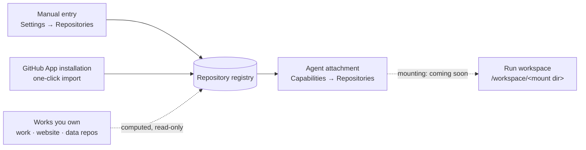

# Repositories Registry

Most repositories in Ever Works arrive attached to a [Work](./creating-a-work.md): the data repo, the markdown repo, the website repo. The **Repositories registry** is for everything else — the API service your Agent needs to read to write a release note, the design-system repo it copies tokens from, the private tooling repo it runs a script out of.

A registry entry is an **account-level record of a repository**, independent of Works: a URL, a display name, a mount directory, a credential _pointer_, and up to eight seed `.env` files. Once a repository is in the registry you can grant a specific [Agent](./agents.md) access to it — the same way you grant Skills or MCP connections.

:::note Where to find it
**Settings → Repositories** (`/settings/repositories`), directly below **GitHub App** in the settings sidebar.

The list is a single table of **every** repository connection on your account, including the ones derived from your Works.
:::

## What the registry holds



Three kinds of row share one table, told apart by the **Source** badge:

| Source badge   | Where it comes from                                                                      | Editable                                     |
| -------------- | ---------------------------------------------------------------------------------------- | -------------------------------------------- |
| **Manual**     | You filled in the **Add Repo** form.                                                     | Yes — **Edit** and **Delete** actions.       |
| **GitHub App** | Imported in one click from a repository your Ever Works GitHub App installation can see. | Yes — a real row, same as a manual one.      |
| **Work**       | Computed from the repositories a Work already declares.                                  | No — read-only, with no row actions offered. |

Only the first two are stored rows. Work-derived entries are computed on every read and never copied into the registry table, so renaming or re-importing a Work can never leave a stale duplicate behind.

### Fields on an entry

| Field                    | Form label                     | Rules                                                                                                            |
| ------------------------ | ------------------------------ | ---------------------------------------------------------------------------------------------------------------- |
| `name`                   | **Name**                       | Required, ≤ 120 characters, **unique across your registry**. Also the default mount directory.                   |
| `url`                    | **Repository URL**             | Required, ≤ 512 characters. An `https://` URL or an SSH remote (`git@host:owner/repo` or `ssh://host/path`).     |
| `provider`               | —                              | `github` (default) or plain `git`.                                                                               |
| `defaultBranch`          | **Default Branch**             | Optional, ≤ 120 characters — for example `main`.                                                                 |
| `mountPath`              | **Mount Path**                 | Optional. One directory segment matching `^[A-Za-z0-9._-]{1,200}$`; the form shows the resulting `/workspace/…`. |
| `description`            | **Description**                | Optional, ≤ 2000 characters.                                                                                     |
| `credentialMode`         | **Credential Key**             | `inherit`, `github-app` or `secret-ref` — see **Credential keys** below.                                         |
| `credentialRef`          | (second field under the above) | A **pointer**, ≤ 200 characters. Never a raw token.                                                              |
| `envFiles`               | **Environment** tab            | ≤ 8 files, each ≤ 32 KB. Encrypted at rest, masked in API responses.                                             |
| `availableInAllProjects` | **Available in all projects**  | On by default — a declaration that the repository is offered everywhere without an explicit attachment.          |
| `sourceType`             | **Source** column              | `manual`, `github-app` or `work`.                                                                                |
| `enabled`                | —                              | Row-level kill switch, on by default; settable through the API. A disabled row resolves for nobody.              |

The **Mount Path** rule is deliberately strict: the effective mount directory is always a single traversal-free segment, so an entry can never escape `/workspace/<dir>`. If you leave it empty, the display name is sanitized into a segment instead (spaces and separators collapse to `-`).

### Repositories derived from your Works

Every Work can declare three repositories, and each one that exists shows up in the registry listing as a read-only entry named `<Work name> (<role>)`:

| Role      | What it holds                                                          |
| --------- | ---------------------------------------------------------------------- |
| `work`    | The Work's main repository (`{slug}`, the generated markdown content). |
| `website` | The generated site.                                                    |
| `data`    | The content repository — items, categories, tags, YAML.                |

These rows carry synthetic ids of the form `work:<workId>:<role>`, which is why they can never collide with a real row's UUID. They exist so the Repositories page answers "which repositories does my account touch at all?" in one place — the Work itself remains the place to manage them. See [Git Operations](./git-operations.md) for the three-repo model and [Creating a Work](./creating-a-work.md) for how they get created.

The listing endpoint only appends them when asked (`?includeDerived=true`); the Settings page always asks.

## Credential keys — pointers, never tokens

A registry row records **where a credential lives**, not the credential itself.

| Mode         | Shown as             | `credentialRef` holds                                                | Meaning                                                                                     |
| ------------ | -------------------- | -------------------------------------------------------------------- | ------------------------------------------------------------------------------------------- |
| `inherit`    | **Inherited**        | nothing — the field is cleared                                       | No per-repository credential; the platform's normal Git credential chain applies.           |
| `github-app` | **GitHub App**       | the id of one of your GitHub App installations, picked from a select | An installation access token is minted on demand for that installation.                     |
| `secret-ref` | **Secret reference** | a pointer such as `env:MY_REPO_TOKEN` or `plugin:github`             | Resolved through the secret-store resolver, so the value never lives in the repository row. |

Switching **Credential Key** back to **Inherited** clears the stored pointer rather than leaving a stale one behind — the form sends an explicit `null`, which the API reads as "clear this", as opposed to omitting the field, which means "leave it alone".

The inherited chain is the same one every Git operation uses: an explicitly supplied token, then the platform token for Ever Works Git-hosted Works, then a GitHub App installation token linked to the Work, then your connected provider account, then a plugin-level PAT — failing with a "no credentials" error if none of those answer. [Git Operations](./git-operations.md) documents it in full.

## Environment files (masked by default)

Each entry can carry up to **eight seed `.env` files** — the environment a repository needs before anything can run inside it.

The masking rule is enforced in the API, not just in the UI:

- `GET /api/repo-connections` and `GET /api/repo-connections/:id` return each env file as **path plus byte size only**. Contents are never in a list or get response.
- Contents leave the API through exactly one endpoint: `GET /api/repo-connections/:id/env-files`, which is owner-gated and returns the full set.
- `PUT /api/repo-connections/:id/env-files` **replaces the whole set** — "Save All" semantics. A file you removed from the editor is deleted, not merged away.
- At rest the whole map is stored in an envelope-encrypted column.

In the **Environment** tab of the repository form this shows up as `N env file(s) stored. Contents are hidden until revealed.` next to a **Reveal** button; nothing is fetched until you click it. On a brand-new repository the editor is open immediately, and the files are saved together with the row.

Validation happens in both the DTO and the service:

| Rule                    | Limit                                                                                      |
| ----------------------- | ------------------------------------------------------------------------------------------ |
| Files per repository    | 8 (the **Add .env file** button disables at eight)                                         |
| Content size per file   | 32 KB of UTF-8                                                                             |
| Path shape              | Relative, may nest (`apps/api/.env`); each segment `[A-Za-z0-9._-]`, no `/` prefix, no `\` |
| Forbidden path segments | `.` and `..` — traversal is rejected outright                                              |
| Duplicates              | Rejected with the offending path named in the error                                        |

:::caution Secrets belong in a store, not in a repository row
Seed env files are convenient for non-secret configuration and for values you would otherwise paste by hand every run. For anything genuinely sensitive, prefer a `secret-ref` credential pointer or plugin settings — see [API Keys](./api-keys.md) and [Plugins](./plugins.md).
:::

## Binding repositories to Agents

A registry entry does nothing on its own. Access is granted per [Agent](./agents.md), on either of two surfaces over the same endpoints:

- **Agent → Capabilities → Repositories** (`/agents/:id/capabilities`) — the consolidated "what can this Agent do" view, alongside tools, Skills, MCP connections, Environment and the init script. See [Agent Capabilities](./agent-capabilities.md).
- **Agent → Settings → Repositories card** (`/agents/:id/settings`) — the same list with an attach switch per row and a **Manage repositories** link back to the registry.

| Endpoint                                              | What it does                                                       |
| ----------------------------------------------------- | ------------------------------------------------------------------ |
| `GET /api/agents/:agentId/repos`                      | Every registry row plus this Agent's `attached` / `enabled` state. |
| `PUT /api/agents/:agentId/repos/:repoConnectionId`    | Attach the repository, or flip the attachment's `enabled` flag.    |
| `DELETE /api/agents/:agentId/repos/:repoConnectionId` | Detach it.                                                         |

Two rules are worth knowing:

- **Both flags must be on.** A repository resolves for an Agent only when the attachment is enabled _and_ the registry row itself is enabled. Disabling the row switches it off for every Agent at once without losing a single attachment.
- **Deleting a registry row detaches every Agent.** The edge rows cascade with it, so there is never a dangling grant.

Ownership is checked on both sides: the Agent and the repository must belong to you, and anything else reads as a `404` rather than a `403` — the API never confirms that someone else's row exists.

:::info Status: attachments are recorded; mounting is coming soon
Be precise about what an attachment does **today**:

- **Attaching records a durable grant.** The edge row between Agent and repository is stored, audited in [Activity](./activity.md), and returned by `GET /api/agents/:agentId/repos`. That part is fully live.
- **A Task's provision spec carries the grant as advice.** When a Task provisions an isolated workspace, the run Agent's enabled attachments ride the provision spec as an **advisory** `attachedRepos` list — and the v1 sandbox and local workspace providers ignore it. It rides the spec so that future multi-mount executors need no contract change.
- **The managed-session runtime already has the mounting code.** It knows how to turn an `attachedRepos` entry into a mounted `github_repository` resource and to place that repository's env files under `/workspace/<mount dir>`. What is missing is the wiring in between: no orchestrator passes the resolved list into a pipeline run, so that code never sees an attached repository.

The honest summary: **no executor checks out an attached repository yet.** Multi-repo mounting is coming soon; until it lands, treat an attachment as a durable, auditable grant that mounting will honor once it ships — not as a guarantee that the repository is on disk during a run. [Task Isolation](./task-isolation.md) covers what a Task workspace does provision today.
:::

## GitHub App: Import and Onboard are different actions

Both start from a repository your Ever Works GitHub App installation can see, and they do genuinely different things.

| Action      | Where                                                                     | Result                                                                                |
| ----------- | ------------------------------------------------------------------------- | ------------------------------------------------------------------------------------- |
| **Import**  | **Settings → Repositories** → _Import from GitHub App_ panel → **Import** | A new registry row your Agents can be attached to. No Work is created.                |
| **Onboard** | **Settings → GitHub App** → the repository's row → **Onboard**            | The repository is analyzed and, if it is a data repository, linked as a new **Work**. |

**Import** calls `POST /api/repo-connections/import/github-app/:installationRepoId` and creates a real row with:

- `name` = the repository's short name, `url` = `https://github.com/<owner>/<repo>`, `defaultBranch` copied from the installation snapshot,
- `credentialMode: github-app` and `credentialRef` set to the installation's id, so tokens can be minted through the App,
- `sourceType: github-app` and `sourceInstallationRepoId` recorded — which is how the import panel hides repositories you have already imported.

Conflicts are loud rather than silently renamed:

- already imported → `409` naming the row it landed in,
- a different row already uses that name → `409` asking you to rename the existing row and import again.

**Onboard** is the Work path: it analyzes the repository through the installation token and refuses anything that is not a data repository ("Only existing data repositories can be onboarded from GitHub App installations right now"). What it produces is a linked Work, exactly like the **link existing** import mode. See [Work Import](./work-import.md) and [`.works/works.yml` Configuration](./works-config.md) — a repository that carries `.works/works.yml` arrives with its name and generation settings already filled in.

Once a data repository is onboarded as a Work, edits pushed to it can flow to the Work's main repository through **data-repo instant sync**, driven by the same GitHub App's push webhook (with a polling fallback when the App is not installed). That path is documented in [Data Management](./data-management.md#data-repository-instant-sync-ew-628).

## How to: register a repository manually

1. Go to **Settings → Repositories** (`/settings/repositories`) and click **Add Repo**.
2. On the **General** tab, fill in **Repository URL** — `https://github.com/acme/my-service`, or an SSH remote if that is how you clone it.
3. Give it a **Name**. It must be unique in your registry, and it becomes the mount directory unless you override it.
4. Optionally set **Mount Path** (the hint under the field shows exactly where it lands, e.g. `Mounted at /workspace/my-service`) and **Default Branch**.
5. Pick a **Credential Key**: leave **Inherited** to use your normal Git credentials, choose **GitHub App** and select an installation, or choose **Secret reference** and enter a pointer such as `env:MY_REPO_TOKEN`.
6. Switch to the **Environment** tab if the repository needs seed `.env` files, click **Add .env file**, enter a path (`.env`) and its contents, and repeat for up to eight files.
7. Click **Save**. The row appears in the table with a **Manual** badge; env files created alongside a new repository are saved with it.

The same thing over the API:

```bash
curl -X POST https://api.ever.works/api/repo-connections \
  -H "Authorization: Bearer $EVERWORKS_API_KEY" \
  -H "Content-Type: application/json" \
  -d '{
    "name": "my-service",
    "url": "https://github.com/acme/my-service",
    "defaultBranch": "main",
    "mountPath": "my-service",
    "credentialMode": "secret-ref",
    "credentialRef": "env:MY_REPO_TOKEN",
    "envFiles": [{ "path": ".env", "content": "LOG_LEVEL=debug\n" }]
  }'
```

## How to: import a repository from a GitHub App installation

1. Install the Ever Works GitHub App on the account or organization that owns the repository and complete the setup redirect. **Settings → GitHub App** then lists the installation.
2. If the repository is missing from the installation's list, click **Sync** on that installation to refresh the stored snapshot from GitHub.
3. Go to **Settings → Repositories**. The **Import from GitHub App** panel lists every installation repository that is not already in your registry.
4. Click **Import** next to the repository. It appears in the table with a **GitHub App** badge and its **Credential** column reading **GitHub App**.
5. Open **Edit** on the new row if you want to set a **Mount Path**, a description, or seed env files — imports land with sensible defaults, not with your preferences.

```bash
curl -X POST \
  https://api.ever.works/api/repo-connections/import/github-app/<installationRepoId> \
  -H "Authorization: Bearer $EVERWORKS_API_KEY"
```

## How to: give one Agent access to one repository

1. Register or import the repository as above.
2. Open **Sidebar → Teams → Agents**, pick the Agent, and open its **Capabilities** tab (`/agents/:id/capabilities`).
3. Scroll to **Repositories** and switch the row on. (The **Repositories** card on the Agent's **Settings** tab does the same thing.)
4. Confirm the Agent may actually act there: `canCommitToRepo` and `canOpenPullRequests` live on the Agent's **Settings** tab, and what lands where is still governed by the [Merge Policy](./merge-policy.md).
5. To pause access without losing the configuration, switch the row off again — or disable the registry row itself to cut every Agent off at once.

```bash
curl -X PUT \
  https://api.ever.works/api/agents/<agent-uuid>/repos/<repo-connection-uuid> \
  -H "Authorization: Bearer $EVERWORKS_API_KEY" \
  -H "Content-Type: application/json" \
  -d '{ "enabled": true }'
```

## API reference

| Method   | Path                                                          | Purpose                                                        | Rate limit |
| -------- | ------------------------------------------------------------- | -------------------------------------------------------------- | ---------- |
| `GET`    | `/api/repo-connections?includeDerived=true`                   | List the registry; `includeDerived` appends Work-derived rows. | —          |
| `POST`   | `/api/repo-connections`                                       | Create an entry.                                               | 60 / min   |
| `GET`    | `/api/repo-connections/:id`                                   | Read one entry (env files masked).                             | —          |
| `PATCH`  | `/api/repo-connections/:id`                                   | Partial update; `null` clears a field, omission keeps it.      | 120 / min  |
| `DELETE` | `/api/repo-connections/:id`                                   | Delete the entry and detach every Agent.                       | 60 / min   |
| `GET`    | `/api/repo-connections/:id/env-files`                         | Reveal full env-file contents (owner only).                    | 60 / min   |
| `PUT`    | `/api/repo-connections/:id/env-files`                         | Replace the env-file set ("Save All").                         | 60 / min   |
| `POST`   | `/api/repo-connections/import/github-app/:installationRepoId` | One-click import from a GitHub App installation.               | 60 / min   |
| `GET`    | `/api/agents/:agentId/repos`                                  | Registry rows with an Agent's attachment state.                | —          |
| `PUT`    | `/api/agents/:agentId/repos/:repoConnectionId`                | Attach, or set the attachment's `enabled` flag.                | 120 / min  |
| `DELETE` | `/api/agents/:agentId/repos/:repoConnectionId`                | Detach.                                                        | 120 / min  |

Every endpoint is scoped to the calling account. A row owned by someone else reads as `404`, never `403`.

## What lands in Activity

Registry changes are recorded in the [Activity](./activity.md) log, so a repository appearing in a run is always traceable:

`repo_connection_created` · `repo_connection_updated` · `repo_connection_deleted` · `repo_connection_imported` · `repo_attached_to_agent` · `repo_detached_from_agent`

Activity writes are best-effort by design — a feed hiccup never fails a registry change that already happened, and the rows carry display names and ids, never credential material.

## Troubleshooting

| Symptom                                                                       | Cause                                                                               | Fix                                                                                                                                                |
| ----------------------------------------------------------------------------- | ----------------------------------------------------------------------------------- | -------------------------------------------------------------------------------------------------------------------------------------------------- |
| `409` — "already in your registry as …" on import                             | That installation repository has been imported before.                              | Use the existing row; the import panel hides it once you reload.                                                                                   |
| `409` — "A repository named … already exists"                                 | Registry names are unique per account, and the import uses the repository's name.   | Rename the existing row (**Edit → Name**), then import again.                                                                                      |
| `400` — "Mount path must be a single directory name"                          | You entered a path with `/`, spaces or `..`.                                        | Use one segment: `my-service`.                                                                                                                     |
| `400` — "Invalid env file path"                                               | Absolute path, a backslash, or a `.` / `..` segment.                                | Use a relative path such as `.env` or `apps/api/.env`.                                                                                             |
| Env-file boxes are empty when you open **Environment**                        | Correct — contents are masked until you ask for them.                               | Click **Reveal**.                                                                                                                                  |
| An env file you deleted in the editor is gone after **Save All**              | `PUT …/env-files` replaces the whole set.                                           | Re-add it; there is no partial patch for env files.                                                                                                |
| A row has no **Edit** or **Delete** action                                    | It is a Work-derived entry, computed rather than stored.                            | Manage it on the Work itself — see [Creating a Work](./creating-a-work.md).                                                                        |
| The **Import from GitHub App** panel is empty                                 | No installations, or every repository is already imported.                          | Install the App, or click **Sync** under **Settings → GitHub App** to refresh.                                                                     |
| **Onboard** fails with "Only existing data repositories can be onboarded"     | Onboarding creates a Work, and only data repositories can be linked that way today. | Import it into the registry instead, or see [Work Import](./work-import.md).                                                                       |
| The repository is attached but the Agent does not seem to have it checked out | Multi-repo mounting is advisory on the v1 sandbox / local workspace providers.      | Expected today — mounting attached repositories is not wired end-to-end yet; the grant is kept and will be honored when multi-repo mounting ships. |

## Related

- [Agent Capabilities](./agent-capabilities.md) — where an Agent's repository attachments live, next to tools, Skills, MCP connections and Environment.
- [Agents (Your AI Employees)](./agents.md) — the Agent model, permissions and scopes.
- [Git Operations](./git-operations.md) — the credential chain, the three-repo model, clone/push behavior.
- [Integrations](./integrations.md) · [Plugins](./plugins.md) — where provider connections and their credentials are configured.
- [Work Import](./work-import.md) · [`.works/works.yml` Configuration](./works-config.md) — bringing an existing repository in as a Work.
- [Data Management](./data-management.md) — account export/import, GitHub sync, and data-repo instant sync.
- [Task Isolation](./task-isolation.md) · [Merge Policy](./merge-policy.md) — what a run's workspace does, and what it is allowed to land.
- [Settings Map](./settings-map.md) · [Activity](./activity.md) · [API Keys](./api-keys.md)
