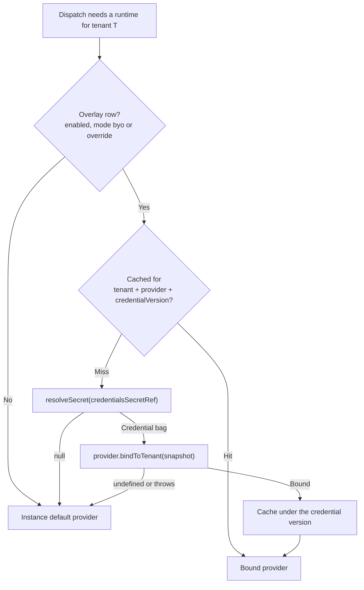

# Secret Stores (Credential References)

A **credential reference** is a short, opaque pointer — `vault:secret/tenants/acme/trigger`, `k8s:tenant-acme-credentials`, `env:TENANT_ACME_TRIGGER` — that says _where_ a credential lives instead of carrying the credential itself. Ever Works stores the pointer; a **secret-store resolver** turns it into the actual credential bag at the moment a background job needs it.

Seven resolver plugins ship in every image — HashiCorp Vault, Kubernetes Secrets, AWS Secrets Manager, GCP Secret Manager, Azure Key Vault, Doppler and Infisical — plus two zero-dependency schemes (`inline:` and `env:`) built into the platform itself.

:::info Status: partial — the resolvers are real, the consumer path is narrow
The seven plugins are complete and core-bundled: each one parses its scheme, calls the vendor's real API, and returns a credential bag. What is narrow is where the platform _uses_ one. Today a credential reference is entered in exactly one place — the **Secret pointer** field on **Settings → Job Runtime** — and the **enqueue side** of per-tenant binding is not wired yet. The provider hook is done: every shipped job-runtime provider implements `bindToTenant` (Trigger.dev, Temporal, BullMQ, pg-boss, Inngest and the in-process Node runtime), and the worker side already re-resolves a run's stamped credential version. The gap sits in the middle — `TenantAwareRuntimeResolver.resolve()`, the service that reads the overlay row, resolves the pointer and calls `bindToTenant`, is registered and tested but has no dispatch call site invoking it, and `CredentialVersionService.captureSnapshot()` has no production caller, so the snapshot rows a bound run would read back are never written. The platform therefore records, versions and audits your pointer today, and runs still execute on the instance default. There is no general "Secrets" screen, and nothing else in the product resolves a pointer yet.

Two more limits worth knowing up front: choosing a non-default resolver is a **build-level dependency-injection override in a self-hosted deployment**, not an environment-variable flip (see [Choosing which resolver is active](#choosing-which-resolver-is-active)), and every resolver **fails open** — an unreachable secret store never blocks work, it silently falls back to the instance default and logs a warning.
:::

:::note Where to find it
**Sidebar → Settings → Job Runtime** (`/settings/job-runtime`). The **Credentials** block — with the **Secret pointer** field — appears only when **Mode** is _Bring your own credentials_ or _Override provider and credentials_.
:::

## What a credential reference looks like

Every pointer is `<scheme>:<scheme-specific payload>`. The scheme decides which resolver handles it; everything after the colon is that resolver's business.

| Scheme       | Resolves through                          | Pointer shape                                  | Example                                       |
| ------------ | ----------------------------------------- | ---------------------------------------------- | --------------------------------------------- |
| `inline:`    | Built-in (in-process) — **dev/test only** | `inline:<base64 of a UTF-8 JSON object>`       | `inline:eyJhY2Nlc3NUb2tlbiI6InRyX2Rldl94In0=` |
| `env:`       | Built-in (in-process)                     | `env:<VAR_NAME>` whose value is a JSON object  | `env:TENANT_ACME_TRIGGER`                     |
| `vault:`     | `secret-store-vault`                      | `vault:<path after /v1/>`                      | `vault:secret/data/tenants/acme/trigger`      |
| `k8s:`       | `secret-store-k8s`                        | `k8s:<name>` or `k8s:<namespace>/<name>`       | `k8s:tenant-acme/trigger-credentials`         |
| `aws-sm:`    | `secret-store-aws-sm`                     | `aws-sm:<region>/<secretName>`                 | `aws-sm:us-east-1/prod/tenants/acme`          |
| `gcp-sm:`    | `secret-store-gcp-sm`                     | `gcp-sm:<projectId>/<secretName>`              | `gcp-sm:ever-works-prod/tenant-acme`          |
| `azure-kv:`  | `secret-store-azure-kv`                   | `azure-kv:<vaultName>/<secretName>`            | `azure-kv:my-vault/prod-tenant-acme`          |
| `doppler:`   | `secret-store-doppler`                    | `doppler:<project>/<config>`                   | `doppler:ever-works/prd_tenants_acme`         |
| `infisical:` | `secret-store-infisical`                  | `infisical:<workspaceId>/<environment>/<path>` | `infisical:ws-abc/prod/tenants/acme`          |

Three rules hold for every scheme:

- **The pointer is capped at 128 characters** by the Secret pointer field and the API.
- **The pointer is all the database keeps.** `GET /api/account/job-runtime/config` returns a redacted view — `credentialsSecretRefRedacted` plus a `hasCredentials` boolean — never the underlying secret.
- **`inline:` puts the credential in the pointer.** The base64 payload _is_ the plaintext bag, sitting in an operator-readable table. Use it for local development and integration tests; use `env:` or a real store everywhere else.

### What a resolver returns

Every resolver returns the same thing: a flat credential bag (a JSON object) or `null`. What it reads on the way there differs.

| Resolver   | Reads                                                                          | Bag it returns                                                             |
| ---------- | ------------------------------------------------------------------------------ | -------------------------------------------------------------------------- |
| Vault      | `GET {VAULT_ADDR}/v1/<path>`, KV v2 first then KV v1                           | `data.data` (KV v2) or `data` (KV v1)                                      |
| Kubernetes | In-cluster API `GET /api/v1/namespaces/<ns>/secrets/<name>`                    | Every `.data` entry base64-decoded to UTF-8                                |
| AWS SM     | `secretsmanager.<region>.amazonaws.com` `GetSecretValue`, signed with SigV4    | `SecretString` parsed as JSON — must be a JSON **object**                  |
| GCP SM     | `secretmanager.googleapis.com` `…/versions/latest:access`                      | `payload.data` base64-decoded, then parsed as a JSON object                |
| Azure KV   | `https://<vault>.vault.azure.net/secrets/<name>?api-version=7.4`               | `value` parsed as JSON, or `{ "value": "<raw string>" }` if it is not JSON |
| Doppler    | `api.doppler.com/v3/configs/config/secrets?project=…&config=…`                 | Every secret in the config; prefers `.raw`, falls back to `.computed`      |
| Infisical  | `{INFISICAL_HOST}/api/v3/secrets/raw?workspaceId=…&environment=…&secretPath=…` | The folder's secrets as a flat bag                                         |

So the credential you store should be a **JSON object whose keys are the fields the job-runtime provider expects** — for example `{"accessToken":"tr_pat_…","secretKey":"tr_prod_…","projectRef":"proj_…"}` for Trigger.dev. The Kubernetes, Doppler and Infisical resolvers assemble that object from the individual keys in the Secret / config / folder; the others expect one JSON object stored as a single secret value.

## How resolution works



The rules the resolver applies, in order:

| Situation                                            | What happens                                           |
| ---------------------------------------------------- | ------------------------------------------------------ |
| No tenant in context                                 | Instance default — no database read at all             |
| No overlay row, or **Mode** is _Inherit_             | Instance default                                       |
| **Enabled** switched off                             | Instance default (the soft kill switch)                |
| Pointer resolves to a bag, provider binds it         | The tenant's own runtime, cached by credential version |
| Resolver returns `null` (any failure whatsoever)     | Instance default, with a warning naming the pointer    |
| Provider's `bindToTenant` declines the bag or throws | Instance default, with a warning                       |

That flowchart is `TenantAwareRuntimeResolver`'s contract, and the resolver implements all of it — but **nothing in the dispatch path calls the resolver yet**. Read it as the shape per-tenant binding takes once the enqueue call sites adopt it, not as a trace of what a run does on the current release. What _is_ live at enqueue time is the lighter-weight stamp described under [Credential versions and snapshots](#credential-versions-and-snapshots).

**Fail-open is a deliberate contract, not an accident.** A resolver must never throw: a briefly unreachable Vault should not stop work generation for a tenant. The cost is that a misconfigured pointer looks like "everything is fine" from the outside — the only signal is a warning line in the API logs naming the plugin, the pointer and the reason. Read those logs before assuming a pointer is working.

## The seven resolver plugins

All seven are classified **core** on their manifest, so they are bundled in every image in both `bundled` and `dynamic` plugin-distribution modes. All seven are also `autoEnable: false` with `visibility: operator` — they are operator infrastructure and deliberately never appear in a tenant's plugin screens.

| Plugin id                | Name                             | Required environment variables               | Optional                                                   |
| ------------------------ | -------------------------------- | -------------------------------------------- | ---------------------------------------------------------- |
| `secret-store-vault`     | HashiCorp Vault Secret Store     | `VAULT_ADDR`, `VAULT_TOKEN`                  | —                                                          |
| `secret-store-k8s`       | Kubernetes Secret Store          | `KUBERNETES_SERVICE_HOST` (set by kubelet)   | `KUBERNETES_SERVICE_PORT` (defaults to `443`)              |
| `secret-store-aws-sm`    | AWS Secrets Manager Secret Store | `AWS_ACCESS_KEY_ID`, `AWS_SECRET_ACCESS_KEY` | `AWS_SESSION_TOKEN` (STS / IRSA)                           |
| `secret-store-gcp-sm`    | GCP Secret Manager Secret Store  | `GCP_ACCESS_TOKEN`                           | —                                                          |
| `secret-store-azure-kv`  | Azure Key Vault Secret Store     | `AZURE_KV_TOKEN`                             | —                                                          |
| `secret-store-doppler`   | Doppler Secret Store             | `DOPPLER_TOKEN`                              | —                                                          |
| `secret-store-infisical` | Infisical Secret Store           | `INFISICAL_TOKEN`                            | `INFISICAL_HOST` (defaults to `https://app.infisical.com`) |

Per-resolver notes that will save you a debugging session:

- **Vault** reads `VAULT_ADDR` and `VAULT_TOKEN` on _every_ resolve, so a token rotated into the pod (rolling restart, sidecar re-injection) takes effect without a code change. KV version is auto-detected — write `vault:secret/data/…` for KV v2 and `vault:secret/…` for KV v1.
- **Kubernetes** works **in-cluster only**. It reads the token, `ca.crt` and default namespace from `/var/run/secrets/kubernetes.io/serviceaccount/`, and the pod's service account needs `get` on the Secret. Running outside a cluster (no `KUBERNETES_SERVICE_HOST`) returns `null` with a warning telling you to use `inline:` locally. Values are base64-decoded to UTF-8, so binary secrets must be double-encoded.
- **AWS Secrets Manager** signs its own requests with Signature v4 — no AWS SDK in the image. Static keys work; so does anything that writes the standard variables for you (IRSA, `aws sts assume-role`, EC2 IMDS tooling), including `AWS_SESSION_TOKEN`.
- **GCP Secret Manager** and **Azure Key Vault** both take a **pre-fetched bearer token**. Minting one (service-account JWT signing for GCP; the client-credentials flow for Azure) is deliberately pushed to your tooling layer — Workload Identity, Managed Identity/IMDS, or a sidecar that refreshes `gcloud auth print-access-token` / `az account get-access-token --resource https://vault.azure.net` into the variable. Give the GCP identity the `secretmanager.secretAccessor` role; scope the Azure token to `https://vault.azure.net/.default`. GCP always reads the `latest` version.
- **Doppler** fetches the whole config in one call and prefers each secret's `.raw` value over `.computed`. A Service Token or Service Account token with read access is enough.
- **Infisical** works against the hosted service or your own instance — set `INFISICAL_HOST` for self-hosted. A pointer ending in `/` (`infisical:ws-abc/prod/`) reads the workspace root.

## How to point a tenant at a secret store

The first three steps are operator work on the deployment; the last three happen in the dashboard.

1. **Allow-list the runtime provider.** Only providers named in `EVER_WORKS_TENANT_RUNTIME_ALLOWED_PROVIDERS` appear in the tenant's picker; an empty or unset value means the platform default only. This is what `GET /api/account/job-runtime/available-providers` returns.
2. **Set the resolver's environment variables** from the table above on the API (and any worker host that resolves credentials), and make the chosen resolver the active one — see [Choosing which resolver is active](#choosing-which-resolver-is-active).
3. **Write the credential bag into the store** as a JSON object keyed exactly as the runtime provider expects, and note the path you will point at.
4. **Open `/settings/job-runtime`.** The four badges at the top read out **Active mode**, **Active provider**, **Credential version** and **Last updated**.
5. **Set Mode to _Bring your own credentials_** (same provider as the platform, your credentials) **or _Override provider and credentials_** (different provider too), pick the **Provider**, then paste the pointer into **Secret pointer** and fill the per-provider fields the form renders — each field shows the environment variable it corresponds to, and secret fields are masked with a reveal toggle.
6. **Click Save.** With the pointer empty in a non-inherit mode, Save shows the error _"Secret pointer is required when mode is not inherit"_ and does not submit — the button itself is never disabled, so the feedback is a toast, not a greyed-out control. The API validates the provider against the static enum and the operator allow-list, upserts the overlay row, bumps **Credential version** by one if the pointer changed, and writes an audit row that captures the allow-list as it stood at write time (`PUT /api/account/job-runtime/config`).

Leave **Mode** on _Inherit_ and you never touch any of this — the platform default runtime is used, and no pointer is stored.

### Rotating and revoking

| Button                | What it does                                                                                                                                                                                                                                         | When to use it                                                                           |
| --------------------- | ---------------------------------------------------------------------------------------------------------------------------------------------------------------------------------------------------------------------------------------------------- | ---------------------------------------------------------------------------------------- |
| **Rotate**            | Bumps **Credential version** only (`POST /api/account/job-runtime/rotate`). In-flight runs keep the version they were stamped with                                                                                                                   | Routine rotation — after you changed the secret in the store                             |
| **Force-invalidate**  | Bumps the version and writes a `force_invalidate` audit row (`POST /api/account/job-runtime/force-invalidate`). A worker that re-resolves its snapshot afterwards gets `null` for the drained version and can fail the run with `CREDENTIAL_DRAINED` | Break-glass only — a suspected leak. Rate-limited to one call per minute (per client IP) |
| **Revert to inherit** | Sets mode back to `inherit`, clears the pointer, bumps the version, keeps the audit trail (`DELETE /api/account/job-runtime/config`)                                                                                                                 | The safe rollback — behaves exactly as if no overlay row existed                         |

Rotate, do not force-invalidate, for routine work. Force-invalidate is the harder of the two — it is meant to strand every run still pinned to the old version — but be precise about what it does on the current release: it bumps the version and writes the break-glass audit row, and nothing more. **A hard kill of in-flight runs is not implemented** (the API service marks it explicitly as deferred). A run stops only if its worker re-resolves the drained snapshot and chooses to fail; a worker that never re-resolves keeps going on the credentials it already holds. Rotate the secret in the store itself if you need the old value dead immediately.

The rate limit is worth reading literally too: the throttle is one call per 60 seconds keyed by **client IP**, not by tenant. Combined with the auth and tenant gates that is effectively per-tenant for a single session, but two operators on different networks are not throttled against each other.

## Without an external store: the `env:` path

Self-hosters who already inject credentials the twelve-factor way do not need any of the seven plugins. The built-in in-process resolver ships enabled and handles `env:` out of the box.

1. Put the credential bag in an environment variable on the API, as JSON:

    ```bash
    export TENANT_ACME_TRIGGER='{"accessToken":"tr_pat_xxx","secretKey":"tr_prod_xxx","projectRef":"proj_xxx"}'
    ```

2. On `/settings/job-runtime`, set **Secret pointer** to `env:TENANT_ACME_TRIGGER` and save.

Only the variable _name_ reaches the database; the value stays in your `.env`, Docker `--env`, or Kubernetes `env:` pipeline. The variable is read on every resolve, so re-injecting it (a rolling restart) rotates the credential — though the platform's own **Credential version** still only moves when you press **Rotate**.

## Credential versions and snapshots

**Credential version** is a per-tenant counter that bumps every time the pointer changes and on every rotate or force-invalidate. It exists so that rotation drains gracefully instead of yanking credentials out from under running work.

The designed carrier for that drain is the `tenant_credential_snapshot` table, unique on `(tenantId, providerId, credentialVersion)`. The intent: a run enqueued at version _N_ keeps binding to the version-_N_ snapshot for its whole lifetime, even after you rotate to _N+1_, while new enqueues resolve against _N+1_. Rows are immutable history, and the credentials column is a **passthrough for a value that is already encrypted** under the platform's secrets envelope (`PLUGIN_SECRET_ENCRYPTION_KEY`) — the table never stores plaintext and never decrypts.

Two thirds of that mechanism run today; one does not.

- **Live — the stamp.** `RuntimeBindingStamperService` answers "what `(providerId, credentialVersion)` was active for this tenant?" as a single row read, fail-open (a database hiccup returns `{ null, null }` and the enqueue still succeeds). The webhook event dispatcher already calls it; the remaining dispatchers adopt it one at a time.
- **Live — the read-back.** On the worker side `CredentialVersionService.resolveSnapshot(tenantId, version)` returns the current overlay row when the version still matches and falls back to the history table when it does not. The Trigger.dev worker's `TenantRuntimeBindingResolverService` uses exactly that to decide whether a run's binding is still valid or has drained.
- **Not live — the write.** `captureSnapshot()` is implemented and idempotent on the natural key, but **no production code calls it**. `bumpVersion()` captures a snapshot for you when a caller hands it a credentials bag; rotate and force-invalidate call it without one, and the save and revert paths increment the counter on the row directly. So no row is ever inserted into the history table today.

The practical consequence: rotating past version _N_ currently leaves nothing in the history table for a version-_N_ run to resolve, so that run reads as **drained** rather than continuing on its old credentials. The graceful-drain guarantee is the design, not yet the behaviour.

That is also why the resolver caches per `(tenant, provider, credentialVersion)` rather than per tenant: a rotation invalidates the cache by construction, with no cache-busting call anywhere.

## Choosing which resolver is active

Be precise about this one, because it is easy to assume more configurability than exists today:

- The platform resolves through a single `SECRET_STORE_RESOLVER` dependency-injection token. Out of the box that token is bound to the in-process resolver, which handles `inline:` and `env:` and returns `null` (with a warning) for every other scheme.
- Swapping in one of the seven vendor resolvers means **overriding that binding in your own build** of the API — the plugins are shipped as classes to bind, and there is no dashboard switch for it.
- The capability contract documents an `EVER_WORKS_SECRET_STORE_RESOLVER` selector variable, but **nothing reads it yet**. Setting it today has no effect; treat the DI override as the real mechanism until a reader ships.

If you point at `vault:…` while the in-process resolver is still bound, nothing breaks loudly — the resolve returns `null`, the tenant falls back to the instance default, and a warning line records the unhandled scheme. That log line is the confirmation you have to look for.

## What is not built yet

- **No general secrets UI.** Credential references exist only on **Settings → Job Runtime**. Nothing else in the product — plugins, agents, connections — takes a pointer today.
- **No settings screen for the resolvers.** Each plugin declares a settings schema, but the values are read from environment variables; the schema is not yet surfaced as a form.
- **The enqueue side of per-tenant binding is not wired.** The provider hook is finished — all six bundled job-runtime plugins (`job-runtime-trigger`, `-temporal`, `-bullmq`, `-pgboss`, `-inngest`, `-node`) and the platform's own Trigger.dev provider implement `bindToTenant` — and so is the worker side, which reads a run's stamped `(providerId, credentialVersion)` and re-resolves the snapshot. The two missing call sites are both on the enqueue path: no dispatcher calls `TenantAwareRuntimeResolver.resolve()` (it is registered in the tenant job-runtime module and covered by tests, but nothing in dispatch asks it for a provider), and nothing in production calls `CredentialVersionService.captureSnapshot()` to write the snapshot a bound run would read. Until both land, your pointer is recorded, versioned and audited, and the run still executes on the instance default.
- **Trigger.dev binds only on a complete bag.** Its `bindToTenant` swaps in a per-tenant client only when the snapshot carries `accessToken`, `secretKey` **and** `projectRef`. A partial bag logs a warning naming the missing keys and falls back; an empty bag is treated as _inherit_ and warns about nothing.
- **No hard kill on force-invalidate.** Force-invalidate bumps the version and audits it; enumerating and cancelling in-flight runs by `(tenantId, credentialVersion)` is explicitly deferred in the API service.
- **`EVER_WORKS_SECRET_STORE_RESOLVER` has no reader**, as above.

## Troubleshooting

| Symptom                                                                     | Cause                                                                                                                        | Fix                                                                                                                                                                      |
| --------------------------------------------------------------------------- | ---------------------------------------------------------------------------------------------------------------------------- | ------------------------------------------------------------------------------------------------------------------------------------------------------------------------ |
| Saved a pointer, but jobs still run on the platform default                 | Expected on the current release — no dispatcher calls the tenant resolver yet. A fail-open fallback is the other possibility | Read the API warning lines: a fallback names the plugin, the pointer and the reason. Silence means the resolver was simply never asked                                   |
| Log says `pointer scheme "vault:" is not supported by the default resolver` | The in-process resolver is still bound, and it only handles `inline:` and `env:`                                             | Bind the matching resolver (see above), or switch the pointer to `env:`                                                                                                  |
| Log says `VAULT_ADDR env var not set` (or the equivalent for a vendor)      | The resolver is bound but its environment variables are missing on that process                                              | Set the variables from the plugin table on every process that resolves credentials                                                                                       |
| Kubernetes resolver warns "running OUT-of-cluster"                          | `KUBERNETES_SERVICE_HOST` is absent — you are not in a pod                                                                   | Use `inline:` or `env:` for local development                                                                                                                            |
| GCP or Azure resolver returns `null` after working for an hour              | The pre-fetched bearer token expired                                                                                         | Refresh `GCP_ACCESS_TOKEN` / `AZURE_KV_TOKEN` from your sidecar or Workload/Managed Identity                                                                             |
| AWS resolver warns "SecretString is not a JSON object"                      | The secret holds a bare string, not an object                                                                                | Store a JSON object whose keys are the provider's credential fields                                                                                                      |
| **Save** shows a "Secret pointer is required" error                         | **Secret pointer** is empty while **Mode** is not _Inherit_                                                                  | Enter a pointer, or set **Mode** back to _Inherit_                                                                                                                       |
| Provider missing from the picker                                            | It is not in `EVER_WORKS_TENANT_RUNTIME_ALLOWED_PROVIDERS`                                                                   | Ask the instance operator to allow-list it                                                                                                                               |
| Rotated the secret in the store, runs still use the old value               | In-flight runs are pinned to the version they were stamped with                                                              | Press **Rotate** to move new enqueues forward; **Force-invalidate** to bump the version so a re-resolving worker sees the run as drained. Neither cancels a run outright |

## Related

- [Job Runtimes](./job-runtimes.md) — the engines a credential reference binds, the instance selector, the tenant overlay and the operator allow-lists.
- [Workers (Background Execution)](./workers.md) — the background work those runtimes execute, and the **Settings → Job Runtime** screen the pointer is entered on.
- [Environments](./environments.md) — the other reusable runtime recipe: packages and egress rules per Agent.
- [Environment Variables](../environment-variables.md) — the platform's full variable reference, including the secrets envelope key.
- [Built-in Plugins](../plugin-system/built-in-plugins.md) — the core/distributable split that keeps all seven resolvers in every image.
- [Plugins](./plugins.md) · [Plugin Categories](../plugin-system/plugin-categories.md) — how the `secret-store-resolver` category sits among the rest.
- [Kubernetes Deployment](./k8s-deployment.md) · [Settings Map](./settings-map.md) — where to run this, and the rest of the Settings screens.
