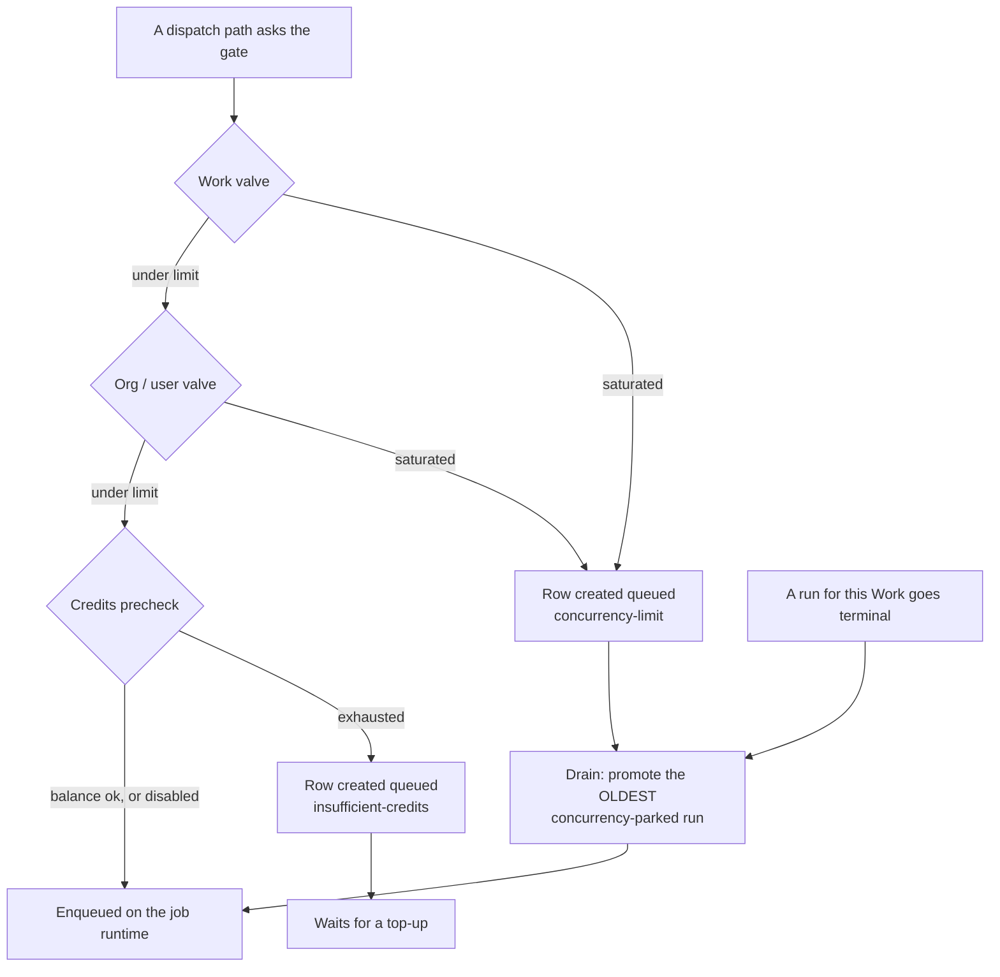

# Sessions & Run Steering

Every time an Agent runs — on a schedule, from a Task, from chat, from an inbound event — the platform records a **session** (an agent run). The Sessions view is where you watch them, and **steering** is how you talk to one that is already in flight instead of waiting for it to finish and starting another.

## The Sessions list

```
GET /api/agents/runs
```

returns _your_ runs across every Agent and every Work, newest first, with `{ data, meta: { total, limit, offset } }`.

Filters (each one only ever narrows your own set — you cannot widen it to somebody else's runs):

| Filter      | Values                                                                                                                          |
| ----------- | ------------------------------------------------------------------------------------------------------------------------------- |
| `status`    | `queued` · `running` · `completed` · `failed` · `cancelled`                                                                     |
| `kind`      | `heartbeat` · `manual` · `task` · `chat` · `event`                                                                              |
| `workId`    | uuid                                                                                                                            |
| `agentId`   | uuid                                                                                                                            |
| `taskId`    | uuid                                                                                                                            |
| `attention` | `1` · `true` — the union of "the Agent asked a question" (`awaitingInput`) and "the platform raised a flag" (`attentionReason`) |
| `limit`     | 1–200 (default 50)                                                                                                              |
| `offset`    | ≥ 0                                                                                                                             |

Each row carries what the run cost and changed — duration, tokens, changed files, spend — plus its gate status and attempt count, whether it is `awaitingInput`, and why it is queued if it is.

A Work's header polls a cheaper summary of the same data:

```
GET /api/works/:id/runs-summary
→ { running, queued, awaiting, failedLast24h }
```

### Where to find it

**Sidebar → Teams → Sessions** (`/agents/sessions`) is the Sessions tab of the Teams hub, beside **Teams**, **Agents** and **Archived**. The page server-renders your most recent 100 runs and resolves the Agent and Work id → name maps once, so every row reads as names rather than uuids. All three fetches are defensive: a flaky API renders the empty state, never a 500.

- **Filters** — a status select (`All statuses`, then the five statuses), a Work select (`All Works`), and a **Group by Work** toggle that is on by default (named Works alphabetically, the **No Work** bucket last). Changing either select re-runs the same `GET /api/agents/runs` query.
- **Live follow** — the list re-polls every **10 seconds** while anything is `queued` or `running`, and not at all when nothing is. An idle fleet costs zero requests.
- **Empty state** — _"No sessions yet"_, with a line explaining what queued, running and awaiting-input rows mean.

### What a row tells you

| Element                          | Reads                                                                                                                                                                                              |
| -------------------------------- | -------------------------------------------------------------------------------------------------------------------------------------------------------------------------------------------------- |
| Status pill                      | `Queued` · `Running` · `Completed` · `Failed` · `Cancelled`, with a pulsing dot while the run is open.                                                                                             |
| **Awaiting input** badge (amber) | The Agent asked a question and parked. Answer it in the [Inbox](./inbox.md) — see _Awaiting input_ below.                                                                                          |
| Attention badge (rose)           | The **platform** flagged this run: `queued-too-long` or `stale-parked`. Printed as the raw machine token on purpose, so a token added server-side surfaces immediately instead of rendering blank. |
| Agent · Work                     | Which Agent ran, and the Work it ran on (the Work chip moves into the group header when **Group by Work** is on).                                                                                  |
| Current activity                 | The run's own live status line — **plain text by contract**, never rendered as markup.                                                                                                             |
| Gate chip                        | The [quality gate](./quality-gates.md) verdict, with the number of failed required checks.                                                                                                         |
| Tokens · cost                    | Compact token total and the run's spend in dollars.                                                                                                                                                |
| Started · duration               | Start time, and elapsed time that keeps counting while the run is open.                                                                                                                            |
| **Attach**                       | Opens this run's live terminal — see below.                                                                                                                                                        |
| Queued reason                    | A second line under a `queued` row saying why it is waiting.                                                                                                                                       |

Clicking the row body opens the **session detail** at `/agents/sessions/:runId`: the same header plus a **runner** chip naming the pipeline plugin hosting the run, message / tool-call / file counts, the touched-file list, and the captured **Timeline** — message bubbles and expandable tool-call rows with redacted argument and result previews, paged by **Load more**. While the run is live, or awaiting input, the page follows it every **5 seconds** and appends only entries it does not already have; the steering box described below sits at the foot of the page, and the footer prints the run id (plus the chat-message and memory-session ids when the run has them) for support.

### Attach a terminal to a live run

A session is not only a transcript — you can get **on the box**. Joinable rows carry an **Attach** link, and the session-detail header carries **Open terminal**; both go to `/agents/:id/terminal?run=<runId>`, the Agent's Terminal tab with that run preselected.

The link appears on a **server-computed verdict**, not on the stored terminal columns: the run must still be `queued` or `running` **and** its terminal state must be `starting` or `attached`. A dead run's columns can keep claiming `attached` for minutes until the terminal sweeper corrects them, and a link into a session nobody can join is worse than no link at all.

Steering and a terminal answer different questions. Steering hands the Agent a message it reads at the next tool boundary; a terminal puts you at a prompt in the run's own working directory, with the driver/viewer roles, the live byte stream and — after the run ends — transcript replay. See **[Live Agent Terminals](./agent-terminals.md)**.

## Why a run sits queued — the dispatch gate

`queued` does not mean "about to start". Every path that enqueues an Agent run — the Task fan-out, a board or batch run, `POST /api/agents/:id/assign-task`, resume, agent-mention chat replies, the heartbeat cron and **Run heartbeat now** — first asks the **dispatch gate** whether a run may be handed to the [job runtime](./workers.md) right now. When the answer is no, the run row is created anyway with `status='queued'` and a `queuedReason`, and only the enqueue is skipped. Nothing is lost: the work waits in the Sessions list and is promoted later.

`POST /api/agents/:id/assign-task` says so out loud:

```
202 { "runId": "…", "queued": true, "queuedReason": "concurrency-limit" }
```

### The queued reasons

| `queuedReason`         | Written when                                                                                       | What clears it                                                                                                                                                                                                      |
| ---------------------- | -------------------------------------------------------------------------------------------------- | ------------------------------------------------------------------------------------------------------------------------------------------------------------------------------------------------------------------- |
| `concurrency-limit`    | A concurrency valve is saturated for this Work, organization or user.                              | The gate promotes the oldest parked run for that Work as soon as a slot frees. The Sessions list renders this one as **Waiting for a concurrency slot**.                                                            |
| `insufficient-credits` | The owner's plan is credit-limited and the balance is exhausted, with credits enforcement enabled. | A top-up. This reason is deliberately **not** promoted by the capacity drain — a credits-parked run waits for money, not for a slot, so it stays visibly queued. See [Credits & Billing](./credits-and-billing.md). |

Any reason the dashboard has no phrase for is printed verbatim, so a token added server-side is legible the day it ships.

### The valves

Two concurrency valves, both **operator safety knobs rather than product limits**:

| Setting                              | Default | Counts                                                                                       |
| ------------------------------------ | ------- | -------------------------------------------------------------------------------------------- |
| `AGENT_MAX_CONCURRENT_RUNS_PER_WORK` | `10`    | In-flight runs (`running` plus already-dispatched `queued`) on one Work.                     |
| `AGENT_MAX_CONCURRENT_RUNS_PER_ORG`  | `25`    | In-flight runs for the organization — or for the user, when the run carries no organization. |

Setting either to `0` or a negative number disables that valve entirely, count query included.

Two further policies sit in the same chain, and both ship **dark**:

- **Plan concurrency** (`PLAN_CONCURRENCY_ENFORCEMENT=on`) folds a plan's `max-concurrent-runs` entitlement into the org valve as a **raise-only** adjustment, measured against the buying user's own in-flight count. It can exempt a run the env valve was about to park; it can never park a run that would otherwise have started.
- **The credits precheck** (`CREDITS_ENFORCEMENT=on|off`) parks a credit-limited owner whose balance is exhausted. Left unset it resolves to **on when a billing provider is configured** (`STRIPE_SECRET_KEY` present) and **off otherwise** — which is what self-hosted, dev and CI installs get.

Every check in the chain **fails open**: a counting query or a billing lookup that throws admits the run and logs a warning, because a broken safety valve must never stop legitimate work.

### How a parked run gets promoted



The drain fires on every terminal transition for the Work — a worker finishing, a failure, your **Cancel** — and promotes exactly **one** run per call, because each terminal frees exactly one slot. The stuck-run sweeper runs it again as a safety net. A chat-triggered run is put back on the chat path rather than the task path, so the message it was meant to answer is never dropped, and the whole drain is best-effort by contract: a hiccup is logged and reported, never allowed to fail the transition that hosted it.

On PostgreSQL the count and the row insert happen inside one critical section — an advisory lock keyed narrowest-wins, on the Work, else the organization, else the user — so a parallel burst cannot walk past a valve.

### When a queue is not moving

A run still `queued` after **60 minutes** (`AGENT_RUN_QUEUED_TOO_LONG_MINUTES`; `0` disables it) is flagged `attentionReason='queued-too-long'` and notifies you once. It is **surfaced, never reaped** — the platform will not fail work just because it waited.

**How to read a stalled queue**

1. Open **Sidebar → Teams → Sessions** (`/agents/sessions`) and set the status filter to **Queued**.
2. Read the second line under each row. **Waiting for a concurrency slot** means a valve is saturated — look at what is `Running` above it. `insufficient-credits` means the balance, not the queue, is the blocker.
3. A rose `queued-too-long` badge means the platform already noticed. Check that a [job runtime](./workers.md) is configured and healthy: a parked run needs a terminal transition (or the sweeper) to promote it, and neither happens on an install with no worker.
4. To free capacity by hand, open a running session and press **Cancel**. The cancel is itself a terminal transition, so it drains the next parked run for that Work.
5. To list every run that wants a human — parked questions and platform flags together — call `GET /api/agents/runs?attention=1`.

## Steering a live run

```
POST /api/agents/:id/runs/:runId/steer   { "message": "…" }
```

The message is appended to the run's pending-input queue and drained **between tool round-trips**, so the Agent picks it up at the next clean boundary rather than mid-call.

The response tells you which of two things happened:

| `dispatched` | Meaning                                                                            |
| ------------ | ---------------------------------------------------------------------------------- |
| `injected`   | The run is live; your message is queued into it. `queuedCount` is the queue depth. |
| `new-run`    | The run already finished while you were typing — start a fresh run instead.        |

`new-run` is deliberately **not** an error: "the run ended while a human was typing" is a normal race with a defined next step.

In Task chat, posting a message while a run is live steers that run rather than dispatching a second one.

On the session detail the message box appears whenever the run is live **or** awaiting input, with **Interrupt** beside it while the run is `running` and **Cancel** while it is open at all. The two outcomes read back as _"Message queued — it will be injected into the live run."_ and _"This run already finished — start a new run to continue."_ Every steer, interrupt and resume is stamped into the run's own log under the `steering` step, carrying the acting user — best-effort, so an audit-row failure never fails the control action it describes.

## Interrupting

```
POST /api/agents/:id/runs/:runId/interrupt
```

asks for a **cooperative stop**. The tool loop honours it at its next per-iteration checkpoint, so the run halts _between_ iterations and completes with a summary instead of being killed mid-call. If the run is already terminal you get a `409` — unlike steering, there is no meaningful fallback.

To kill a run outright, use the existing `POST /api/agents/:id/runs/:runId/cancel`.

## Awaiting input — the amber badge, and where you answer it

`awaitingInput` is a **lifecycle flag**, never agent prose. The executing pipeline raises it when the Agent has asked its human a blocking question — in practice when the Agent calls the `ask_human` tool, which writes the question to your [Inbox](./inbox.md) and parks the run in the same breath.

What the flag changes:

- The Sessions row and the session-detail header both show the amber **Awaiting input** badge.
- The run is **exempt from every sweeper TTL** — never reaped, never flagged as stuck. It is waiting, not stuck, and that exemption is enforced in the sweeper and in SQL.
- The Work's `runs-summary` counts it under `awaiting`, and `attention=1` includes it.
- The session detail keeps its steering box and its 5-second live-follow, even though the run is producing no output.

**The question itself lives in the Inbox, and that is where the answer belongs** — the Inbox routes your reply correctly whichever state the run has reached by the time you send it:

1. Open **Sidebar → Inbox** (`/inbox`); the sidebar badge carries your unread count.
2. Select the question. An open one shows the banner _"The agent is waiting for your reply. Its run is paused until you answer."_
3. Answer — pick one of the Agent's structured options, or type free text.
4. The platform **steers** the run if it is still live, or **resumes** it as a new run seeded with your answer if it has parked. Either way `awaitingInput` clears in the same statement that queues your message, so the badge disappears and the run leaves the needs-attention set.
5. Watch it land in **Sidebar → Teams → Sessions** — the resumed run appears as its own row, linked back to the one it came from.

Answering from the session detail's message box works too, and is quicker when you are already watching the run — but it is a raw steer: if the run parked while you were typing you get `new-run` back and have to start one yourself. The Inbox makes that choice for you. Approvals and escalations park work the same way and are answered the same place; see [Approvals, Escalations & Guardrail Modes](./approvals-and-escalations.md).

## Resuming a parked run

A run that asked you a question sets `awaitingInput` and parks. It is **never reaped** by the idle sweeper while it is waiting — that guarantee is enforced both in the sweeper and in SQL.

```
POST /api/agents/:id/runs/:runId/resume   { "message": "…" }   (message optional)
```

dispatches a **new** run that carries the original's pipeline session id, so the Agent keeps its conversation and its context rather than starting cold. Runs are immutable: the source row stays terminal and the answer is recorded as a new run linked back to it. `409` when the run is not resumable (still live, or ended for a non-parkable reason).

A resume is a dispatch like any other, so it passes the same dispatch gate described above: when a valve is saturated the new run is created `queued` with its `queuedReason` and promoted by the drain, rather than being refused.

## Ownership

All four surfaces are owner-scoped twice over — the Agent lookup and the run lookup are both user-filtered — so somebody else's run id is indistinguishable from one that does not exist (`404`, never `403`).

## Related

- [Agents](./agents.md) · [Autonomous Operation](./autonomous-operation.md) · [Quality Gates](./quality-gates.md)
- [Live Agent Terminals](./agent-terminals.md) — attach a real shell to the run you are watching, and replay its transcript afterwards
- [Inbox](./inbox.md) — where a parked run's question waits, and where your answer unparks it
- [Approvals, Escalations & Guardrail Modes](./approvals-and-escalations.md) — the other two things that stop a run and wait for you
- [Tasks](./tasks.md) — the Task run controls, and the fan-out that creates most sessions
- [Workers](./workers.md) — the job runtime an admitted run is handed to
- [Credits & Billing](./credits-and-billing.md) — the balance the credits precheck reads
- [Activity](./activity.md) — the per-Agent lifecycle and run-event feed
