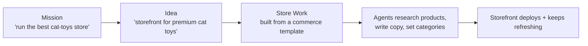

# Store Builder (eCommerce)

> **Status: coming soon.** Stores are a planned [Work](./creating-a-work.md) type, telegraphed today by the **Store** chip on the create surface. The Mission → Idea → Work → Agents model below is live; the storefront generator and commerce integrations are on the roadmap. This page describes where it's going.

A **Store** is a Work whose output is a working storefront — products, copy, categories, checkout — built from a commerce [template](./website-templates.md) and then *kept running* by your [Agents](./agents.md). The point isn't to hand you an empty shop. It's to research the catalog, write the product copy, populate the storefront, and keep optimizing it on a schedule. An AI workforce that's built to **act on your business, not just advise it**.

## How a Store fits the model

A Store is the same lifecycle as any other Work, pointed at commerce:

You can start a Store directly when you know exactly what you want, or let a [Mission](./missions.md) propose it as one of several Works needed for a bigger commerce goal.

## What the Store builder is planned to do

- **Research the catalog** — find products, suppliers, and pricing signals relevant to the store's niche, with sources recorded in the [Knowledge Base](./knowledge-base.md).
- **Write the storefront** — product titles, descriptions, category pages, collection copy, and SEO metadata, on-brand via your KB.
- **Populate and maintain inventory** — add new products as they're found, refresh descriptions, retire dead listings, keep stock data current.
- **Run experiments** — propose and track A/B tests on copy, layout, and merchandising in an experiment notebook, so the storefront keeps improving on evidence, not guesses.
- **Connect commerce + payments** — integrate storefront and checkout through provider plugins (planned: Stripe and other payment/commerce providers).
- **Operate 24/7** — once live, the Store keeps refreshing content and acting on its own under your [budgets and guardrails](./budgets-and-usage.md). See [Autonomous Operation](./autonomous-operation.md).

## Agents for a Store

A Store can be staffed like a small commerce team: a **Merchandiser** Agent that curates the catalog, a **Copywriter** Agent that keeps product pages sharp, an **Analyst** Agent that reads experiment results and proposes the next test. They coordinate through tasks, all scoped to the Store Work. See [Agents](./agents.md).

## You own the store

As with every Work, the storefront's code and content live in **your Git repository** and deploy to **your target**. Nothing about your catalog, copy, or configuration is locked into the platform.

## See also

- [Creating a Work](./creating-a-work.md) · [Website Templates](./website-templates.md)
- [Company Builder](./company-builder.md) · [Autonomous Operation](./autonomous-operation.md)
- [Agents](./agents.md) · [Budgets & Usage](./budgets-and-usage.md)
