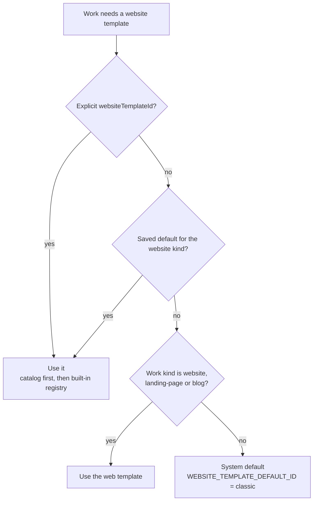

# Website Templates

Every Work generated by Ever® Works™ gets a dedicated **website repository** —
a deployable site that displays the Work's content. The shape of that site is
chosen at Work creation time from a set of **base templates**, each tuned for
a different combination of stack (Next.js vs Astro), feature surface
(directory-style vs general-purpose), and richness (full-featured vs minimal).

## Template selection in the UI

When you create a new Work, the Website Template selector picks the base for
the website repository that gets cloned into your account. If you skip it,
the platform resolves one for you from your saved default and the Work's
kind (see [Kind-aware defaults](#kind-aware-defaults)); the system-wide
fallback is `classic`.

You can change a Work's template later from the Work's **Deploy** tab
(`/works/:id/deploy` → **Automatic Template Updates** → **Work template**),
and — while the Work has no website repository yet — from the **Generator**
tab (`/works/:id/generator`). See
[Switching a Work's template](#switching-a-works-template).

The chosen template's branch (configurable per template — `main` by default,
`stage`/`develop` for testing) is force-pushed into the new website repo,
then content placeholders are filled from your Work's data.

## Kind-aware defaults

You rarely have to choose a template by hand. A Work that carries no explicit
selection resolves one from your saved default and the Work's
[kind](./work-kinds.md), so a **Blog** or **Landing Page** Work starts from
the general-purpose `web` template while a **Directory** Work starts from
`classic`.

| Work kind                                          | Resolved template | Where it comes from                                 |
| -------------------------------------------------- | ----------------- | --------------------------------------------------- |
| `website`                                          | `web`             | Kind default map                                    |
| `landing-page` (and the `landing` alias)           | `web`             | Kind default map                                    |
| `blog`                                             | `web`             | Kind default map                                    |
| `directory`                                        | `classic`         | No kind entry — falls through to the system default |
| `awesome-repo`                                     | `classic`         | Same                                                |
| `company`, `campaign`, `default`, anything unknown | `classic`         | Same                                                |

The Astro variants (`minimal`, `web-minimal`) are never auto-selected. They
stay opt-in — pick one per Work, or make one your account default.

Full resolution order, in order of precedence:

1. **The Work's explicit template** (`websiteTemplateId`). A catalog entry
   wins over the code-shipped registry; an id that resolves to nothing raises
   an error instead of silently falling back, so a broken pin is loud.
2. **Your saved default** for the `website` kind, if you set one. Only
   catalog templates count here, and the lookup is scoped to templates you
   are allowed to see, so a stale preference is skipped rather than failing.
3. **The kind default** from the table above.
4. **The system default** — `WEBSITE_TEMPLATE_DEFAULT_ID`, which ships as
   `classic`.



Because the saved default is consulted _before_ the kind map, setting an
account default overrides the per-kind behaviour for every new Work.

## Template lookup, internally

The active template registry lives at
[`packages/agent/src/generators/website-generator/config/website-template.config.ts`](https://github.com/ever-works/ever-works/blob/main/packages/agent/src/generators/website-generator/config/website-template.config.ts).
Each entry is a `WebsiteTemplateConfig`:

```ts
interface WebsiteTemplateConfig {
	id: WebsiteTemplateId; // e.g. 'classic', 'minimal', 'web', 'web-minimal'
	name: string; // display name
	description: string;
	owner: string; // GitHub org/user
	repo: string; // Concrete repo name
	branch: string; // Branch to clone from
	syncBranches: string[]; // Branches kept in sync upstream
	betaBranch?: string | null; // Optional beta branch
	customizable?: boolean; // May a fork of it be agent-customized?
}
```

Templates the Works platform supports:

## Available templates

### 1. `classic` — directory-web-template (Next.js, full-featured)

- **Repo:** [ever-works/directory-web-template](https://github.com/ever-works/directory-web-template)
- **Stack:** Next.js (App Router, React 19, Tailwind CSS)
- **For:** AI-generated **directory-style websites** with rich features —
  search, faceted filters, item detail pages, categories, tags, comparisons,
  community-PR submissions, etc.
- **Status:** ✅ Production-ready, default for new Works.

### 2. `minimal` — directory-web-minimal-template (Astro, minimal)

- **Repo:** [ever-works/directory-web-minimal-template](https://github.com/ever-works/directory-web-minimal-template)
- **Stack:** Astro 6 (static output, optional ISR via `@astrojs/vercel`),
  Preact islands for interactivity, Tailwind CSS, TypeScript strict mode.
- **For:** AI-generated **directory-style websites** with extreme performance
  and minimum JavaScript — lightweight static-rendered alternative to the
  Next.js `classic` template.
- **Philosophy:** Intentionally blank canvas with headless, composable
  building blocks. Plugin architecture — almost every feature is a plugin
  (SEO, pagination, filters, search, sort, sitemap, breadcrumbs, RSS,
  analytics, related items). No auth, no database, no payments by default —
  add as plugins when needed.
- **Status:** ✅ Available; opt-in by setting the `minimal` template id when
  creating a Work, or via the website-template selector in Work settings.
- **Enable in API:** set the `WEBSITE_TEMPLATE_MINIMAL_REPO` env var to
  `directory-web-minimal-template` to register it in
  [`website-template.config.ts`](https://github.com/ever-works/ever-works/blob/main/packages/agent/src/generators/website-generator/config/website-template.config.ts).

### 3. `web` — web-template (Next.js, general-purpose)

- **Repo:** [ever-works/web-template](https://github.com/ever-works/web-template)
- **Stack:** Next.js (App Router, React 19, Tailwind CSS v4) — same monorepo /
  `@ever-works/web` build contract as `classic`.
- **For:** AI-generated **general-purpose websites** that aren't directories —
  landing pages, marketing sites, content-heavy sites. Ships a full landing
  page (hero, features, how-it-works, testimonials, pricing, FAQ, CTA) plus
  About / Pricing / Contact pages and a Markdown blog — no item lists, no
  faceted filters, no directory data model.
- **Rebrand from one file:** all copy lives in `apps/web/lib/site.config.ts`.
- **Status:** ✅ Available; registered as `WebsiteTemplateId = 'web'`. Select it
  for a **Landing Page**, **Blog**, or general **Website** Work. Agent-customizable
  via a plain-CSS `apps/web/src/styles/theme.css` surface (design-token overrides +
  `[data-component]` hooks).

### 4. `web-minimal` — web-minimal-template (Astro, general-purpose minimal)

- **Repo:** [ever-works/web-minimal-template](https://github.com/ever-works/web-minimal-template)
- **Stack:** Astro 6 (static output) + Tailwind CSS v4, TypeScript — same
  static / nginx-on-:3000 build contract as `directory-web-minimal-template`.
- **For:** AI-generated **general-purpose websites** with the same
  performance / static-output philosophy as the minimal directory template —
  minus the directory-specific affordances (no item/category routes). Zero JS
  by default; the same marketing section set as `web`, built statically.
- **Rebrand from one file:** all copy lives in `apps/web/src/config/site.ts`.
- **Status:** ✅ Available; registered as `WebsiteTemplateId = 'web-minimal'`.
  Agent-customizable via a plain-CSS `apps/web/src/styles/theme.css` surface.

## Your default template

The Templates hub keeps one default per template kind. The `website` default
decides what every new Work starts from when you do not pick a template
yourself, and it wins over the [kind-aware defaults](#kind-aware-defaults).

### How to set it

1. Open **Templates** in the dashboard sidebar and select the **Website
   Templates** pill (`/templates?kind=website`).
2. The **Active default** stat at the top of the page names the current one
   — "New works start from this template unless you override it per work."
3. Find the template you want. Every card carries a **Built-in** or
   **Custom** badge, an origin badge (**Standard**, **Forked**, **Custom
   URL**), and the branch, sync-branch count, and beta branch it is wired to.
4. Open the card's ⋮ **More actions** menu and choose **Make default**. The
   card switches to the **Default** badge.
5. Or click **Fork** instead: forking copies the template into your GitHub
   account or organization _and_ sets the fork as your default in the same
   call.

From the API:

```bash
curl -X PUT http://localhost:3100/api/templates/default \
  -H "Authorization: Bearer <token>" \
  -H "Content-Type: application/json" \
  -d '{"kind": "website", "templateId": "web"}'
```

`GET /api/templates?kind=website` returns the same catalog along with the
`defaultTemplateId` currently in force, and `GET /api/works/website-templates`
returns the shorter list the Work selectors render. See the
[Template Catalog API](../api/template-catalog.md).

## Switching a Work's template

A Work can override your default at any time — before its website exists, or
long after it has been deployed.

### How to switch

1. Open the Work and go to its **Deploy** tab (`/works/:id/deploy`).
2. Find the **Automatic Template Updates** card. The **Current template** row
   names the template in force and says whether this Work "is inheriting your
   current default template" or "is pinned to an explicit template
   selection".
3. Choose a different template in the **Work template** select. Leaving it on
   the inherited option un-pins the Work so it follows your account default
   again.
4. Click **Apply template to Work repository**. The button reads **Template
   is up to date** and stays disabled while nothing has changed.
5. Confirm in the **Switch Work template?** dialog.

Before the website repository has been created, the same selector also
appears on the Work's **Generator** tab (`/works/:id/generator`) and in the
Create-Work form, where switching costs nothing because there is no
repository to rewrite yet.

:::warning Switching rewrites the website repository

If the website repository already exists, its contents are replaced from the
selected template and any custom code you committed to _that_ repository is
lost. Your content is safe — items, taxonomy, and configuration live in the
separate `<slug>-data` repository (see
[What a Generated Site Includes](./generated-site.md)).

:::

### What the switch actually does

`POST /api/works/:id/switch-website-template` reports one of four modes:

| `switchMode`               | When you get it                                             | What happened                                                                                                                   |
| -------------------------- | ----------------------------------------------------------- | ------------------------------------------------------------------------------------------------------------------------------- |
| `no_change`                | The new selection resolves to the template already in force | Only the pin is recorded (explicit vs inherited). Nothing is rebuilt.                                                           |
| `saved_for_initialization` | The website repository does not exist yet                   | The choice is stored and applied the first time the website is created.                                                         |
| `repository_reset`         | The website repository exists                               | Its contents are replaced from the new template — the duplicate method first, falling back to the create-using-template method. |
| `repository_recreated`     | The repository record exists but the repo is gone           | The website repository is recreated from the new template.                                                                      |

Switching also clears the Work's template bookkeeping — last commit, last
update, last check, last error — so the next update check starts clean
against the new template.

```bash
curl -X POST http://localhost:3100/api/works/<work-id>/switch-website-template \
  -H "Authorization: Bearer <token>" \
  -H "Content-Type: application/json" \
  -d '{"websiteTemplateId": "web-minimal"}'
```

Send `{"websiteTemplateId": null}` to un-pin the Work and inherit your
default again. Every switch is written to the [activity log](./activity.md)
as `work.website_template_switched`.

## Automatic updates, branch sync, and the beta channel

Template code keeps improving after your site ships. The same **Automatic
Template Updates** card on `/works/:id/deploy` decides whether those
improvements reach your website repository on their own.

| Control                                              | What it does                                                                                          | Stored on the Work as                                                                        |
| ---------------------------------------------------- | ----------------------------------------------------------------------------------------------------- | -------------------------------------------------------------------------------------------- |
| **Work template**                                    | Selects the template for this Work; the inherited option hands the Work back to your account default. | `websiteTemplateId`                                                                          |
| **Update automatically**                             | "Check for template updates every hour and apply automatically."                                      | `websiteTemplateAutoUpdate`                                                                  |
| **Use beta version of template**                     | "Use the stage branch instead of the stable main branch."                                             | `websiteTemplateUseBeta`                                                                     |
| **Last updated** / **Last checked** / **Last error** | Read-only outcome of the most recent check, shown as relative times.                                  | `websiteTemplateLastUpdatedAt` / `websiteTemplateLastCheckedAt` / `websiteTemplateLastError` |

### How to turn automatic updates on

1. Go to `/works/:id/deploy` → **Automatic Template Updates**.
2. Switch **Update automatically** on. A connected Git provider is required
   — without one the toggle reverts with "GitHub connection required. Please
   connect your GitHub account in Settings to enable automatic updates."
3. Optionally switch **Use beta version of template** on to track the
   template's beta branch instead of its stable branch.
4. Watch **Last checked** and **Last updated** on the same card. A failed run
   leaves its message in **Last error**.

### What the hourly run does

The platform runs a scheduled pass every hour:

1. One instance takes the `works:website-template-scheduler` lock, so a
   multi-replica deployment performs the pass once rather than once per pod.
2. It loads every Work with **Update automatically** on, stamps **Last
   checked**, and asks whether the template branch has moved ahead of the
   commit the Work last took.
3. When it has, the website repository is updated and **Last updated** plus
   the new commit are stamped. Update failures and token problems are stored
   and surfaced in **Last error** rather than retried blindly.

You never have to wait for it: **Update Repository** on the same tab,
`POST /api/works/:id/update-website`, and the CLI's
`ever-works work update-website` all run the same update immediately.

### Branch sync

Each template declares the branches it keeps in sync — `main`, `stage` and
`develop` for all four built-ins. The website generator mirrors those
branches into your website repository when it creates it and on every
template update, so you can test a template change on `stage` before it
reaches `main` on your own copy. The pipeline is described in
[Website Generation](../ai-agents/website-generation.md).

### The beta channel

Only templates that declare a `betaBranch` have a beta channel:

- `classic` — `stage` by default, overridable with
  `WEBSITE_TEMPLATE_BETA_BRANCH`.
- `minimal` — whatever `WEBSITE_TEMPLATE_MINIMAL_BETA_BRANCH` names; unset
  out of the box.
- `web` and `web-minimal` — ship `betaBranch: null`, so the beta toggle has
  nothing to switch to for Works built on them.

### Operator settings

| Environment variable                   | Default                          | Effect                                                                                               |
| -------------------------------------- | -------------------------------- | ---------------------------------------------------------------------------------------------------- |
| `WEBSITE_TEMPLATE_AUTO_UPDATE_ENABLED` | enabled                          | Set to `false` to stop the hourly pass for the whole deployment. Per-Work toggles keep their values. |
| `WEBSITE_TEMPLATE_DEFAULT_ID`          | `classic`                        | The system-wide fallback template id (step 4 of the resolution order).                               |
| `WEBSITE_TEMPLATE_BETA_BRANCH`         | `stage`                          | The `classic` template's beta branch.                                                                |
| `WEBSITE_TEMPLATE_CATALOG_ORG`         | `ever-works`                     | GitHub organization the catalog treats as the source of built-in templates.                          |
| `WEBSITE_TEMPLATE_MINIMAL_OWNER`       | `ever-works`                     | Owner behind the `minimal` entry.                                                                    |
| `WEBSITE_TEMPLATE_MINIMAL_REPO`        | `directory-web-minimal-template` | Repository behind the `minimal` entry.                                                               |
| `WEBSITE_TEMPLATE_MINIMAL_BRANCH`      | `main`                           | Branch cloned for `minimal`.                                                                         |
| `WEBSITE_TEMPLATE_MINIMAL_BETA_BRANCH` | _(none)_                         | Beta branch for `minimal`; unset means the beta toggle has nothing to point at.                      |

## Roadmap

The four base templates above are all published and cover the matrix of
(directory vs general) × (full-featured Next.js vs minimal Astro). Beyond
that, the platform is designed to host **many more** templates — each new template is a
single-row addition to `WEBSITE_TEMPLATES` plus a published GitHub repo.
Anyone can author and contribute one; the only contract is that the repo's
branch layout matches `WebsiteTemplateConfig` (i.e. `main` and a sensible
default branch).

## Related

- [Website Generation](../ai-agents/website-generation.md) — runtime
  pipeline that clones a template into a new website repo and keeps it in
  sync.
- [Website Generator spec](../specs/features/website-generator/spec.md) —
  detailed architectural spec.
- [Custom domains](custom-domains.md) — wiring a generated website to a
  user-owned domain.
- [What a Generated Site Includes](./generated-site.md) — the three
  repositories per Work and the full feature set each template ships.
- [Work Blueprints](./work-blueprints.md) — the separate catalog of
  ready-made Work definitions offered next to your templates in the
  Create-Work picker.
- [Work Templates](./work-templates.md) — fork-first starter repositories
  for the Work content repository, and the other half of the Templates hub.
- [Work Kinds](./work-kinds.md) — what `website`, `landing-page`, `blog`,
  `directory` and `awesome-repo` change about a Work.
- [Template Catalog API](../api/template-catalog.md) — the REST surface
  behind the catalog, defaults, forks, and custom templates.
