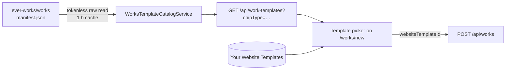

# Work Blueprints

A **Work Blueprint** is a ready-made definition of a [Work](./creating-a-work.md): a pointer to a fork-ready template repository under the `ever-works` GitHub organization, plus the defaults a Work built from it should start with (its kind, whether it is an organization-owned Work, its preferred Git / storage / deploy providers). Blueprints live outside the platform, in the public [`ever-works/works`](https://github.com/ever-works/works) repository, so the list of things you can build can grow without a platform release.

Blueprints surface in the **Template** picker of the Create-Work form, grouped under a **Blueprints** heading and filtered by the Work kind you selected.

## Three catalogs, one picker

Ever Works has three template catalogs that are easy to confuse. In one sentence each:

| Catalog                                     | What one entry is                                                                                                            | Where it lives                                                                   | Where you use it                                                                    |
| ------------------------------------------- | ---------------------------------------------------------------------------------------------------------------------------- | -------------------------------------------------------------------------------- | ----------------------------------------------------------------------------------- |
| [Website Templates](./website-templates.md) | The site code (`classic`, `minimal`, `web`, `web-minimal`) cloned into a Work's website repository.                          | `website-template.config.ts` seed + the `templates` table (built-in and custom). | Create-Work **Template** picker ("Your templates") and `/works/:id/settings`.       |
| [Work Templates](./work-templates.md)       | A starter repository you **fork** into your own GitHub account or organization and then launch a Work from.                  | `work-template.config.ts` seed + the `templates` table (`kind: 'work'`).         | `/templates?kind=work` → **Fork** / **Add Custom Template**.                        |
| **Work Blueprints** (this page)             | A ready-made Work definition — template repo coordinates + Work defaults — read from the public `ever-works/works` manifest. | `manifest.json` in `ever-works/works`, fetched and cached by the API.            | Create-Work **Template** picker ("Blueprints"), filtered by the selected kind chip. |

The picker merges the first and third catalogs: your own Website Templates always come **first** ("Your templates"), and the manifest blueprints for the selected kind follow ("Blueprints"). Work Templates are a separate fork-first flow on the Templates page and are not shown in the Create-Work picker.

## Where blueprints come from



The **source of truth** is the `blueprints[]` array in `manifest.json` at the root of the public `ever-works/works` repository. The API reads it through `WorksTemplateCatalogService` (`apps/api/src/works/works-template-catalog.service.ts`):

1. **Primary read — tokenless.** A plain `GET` of `https://raw.githubusercontent.com/ever-works/works/<ref>/manifest.json` with a real `User-Agent` and an 8-second timeout. No credentials are sent.
2. **Fallback read — authenticated.** If the tokenless read is non-2xx or times out (for example, a rate limit), the service reads the same file through the Git facade using the platform GitHub App's installation token for the `ever-works` org, or `EVER_WORKS_WORKS_TOKEN` / `GITHUB_TOKEN` if set.
3. **Cache.** A successful catalog is cached for **1 hour** in the shared `cache_entries` store under the key `work-templates:<ref>`. `chipType` filtering happens in memory on that single entry. A failed or empty read is cached for only **30 seconds**, so a transient outage never pins an empty catalog for the full hour, while a slow upstream cannot stall every request either.
4. **Sanitize.** Every row is validated before it is served (see [What the API enforces](#what-the-api-enforces)).

### Configuration

| Environment variable     | Default            | Purpose                                                                                                                                                                                                                                               |
| ------------------------ | ------------------ | ----------------------------------------------------------------------------------------------------------------------------------------------------------------------------------------------------------------------------------------------------- |
| `EVER_WORKS_WORKS_REPO`  | `ever-works/works` | The `owner/repo` the manifest is read from.                                                                                                                                                                                                           |
| `EVER_WORKS_WORKS_REF`   | `main`             | The branch, tag, or commit SHA to read. The service logs a warning on every uncached fetch when the ref is mutable; in production pin it to a 40-character commit SHA or a `vX.Y.Z` tag to prevent supply-chain substitution after the cache expires. |
| `EVER_WORKS_WORKS_TOKEN` | _(unset)_          | Optional token for the authenticated fallback read. Falls back to `GITHUB_TOKEN`; the platform GitHub App installation token is tried first when the app is installed on the `ever-works` org.                                                        |

:::tip Pinning the ref
Because the cache key includes the ref, changing `EVER_WORKS_WORKS_REF` invalidates the cached catalog immediately — you do not have to wait an hour after bumping a pinned tag.
:::

## What happens when the manifest is unreachable

Nothing breaks. Every failure path is designed to degrade to what shipped before the catalog existed:

- The API returns an **empty array** (HTTP 200, never an error) when the manifest is unreachable, rate-limited without a fallback token, or malformed JSON.
- The web app's server-side fetch (`fetchWorkTemplateCatalog()` in `apps/web/src/lib/api/work-templates.server.ts`) treats an error **or an empty array** as "no catalog" and substitutes the **built-in fallback list**: the `classic` and `minimal` directory templates typed as blueprints (`listBuiltinWorkBlueprints()` in `work-templates.ts`), both under the `website` chip. Those two ids are real rows in your Website Templates catalog, so a Work created from the fallback resolves normally.
- The same-origin proxy at `/api/work-templates` (a Next.js route in `apps/web/src/app/api/work-templates/route.ts`) always answers with a JSON array and a 200, so client code never has to handle a catalog error.

The practical result is that the **Template** picker never renders empty: with the catalog down you still see your own Website Templates plus `classic` / `minimal`.

## The API: `GET /api/work-templates`

The catalog is served by `WorkTemplatesController` (`apps/api/src/works/work-templates.controller.ts`). The endpoint is **public** (no auth), read-only, and returns a bare array.

| Request                                      | Returns                                                                                                                                                                                            |
| -------------------------------------------- | -------------------------------------------------------------------------------------------------------------------------------------------------------------------------------------------------- |
| `GET /api/work-templates`                    | Every blueprint in the catalog, including `placeholder` rows.                                                                                                                                      |
| `GET /api/work-templates?chipType=directory` | Only the blueprints whose `chipType` equals the value. The match is an **exact lowercase slug** match — `Directory`, unknown values, and anything failing `^[a-z0-9][a-z0-9-]{0,63}$` return `[]`. |

```bash
curl -s "https://api.ever.works/api/work-templates?chipType=directory" \
  -H "Accept: application/json" -H "User-Agent: my-script/1.0"
```

Each entry is a `WorkBlueprintEntry`:

| Field                                              | Type                                    | Meaning                                                                                                                                       |
| -------------------------------------------------- | --------------------------------------- | --------------------------------------------------------------------------------------------------------------------------------------------- |
| `slug`                                             | `string`                                | Stable id. This is the value the picker submits as `websiteTemplateId`.                                                                       |
| `name` / `title`                                   | `string`                                | Short selector label / full card title (each capped at 120 characters).                                                                       |
| `description`                                      | `string`                                | The manifest `summary`, HTML stripped, capped at 500 characters.                                                                              |
| `chipType`                                         | `string`                                | The kind chip the blueprint belongs under: `website`, `landing`, `blog`, `directory`, `store`, `company`, `awesome`.                          |
| `kind`                                             | `string`                                | The Work intent (for example `landing-page`, `awesome-repo`). Falls back to `chipType` when the manifest value is not a valid lowercase slug. |
| `category`, `tags`, `iconName`                     | optional                                | Search facets and a PascalCase Lucide icon id (`folder-tree` → `FolderTree`). At most 8 tags of 60 characters each.                           |
| `isDefault`, `featured`                            | `boolean`                               | Manifest `default: true` / `featured: true`. The default entry is highlighted; featured entries are pinned to the top.                        |
| `status`                                           | `production` \| `beta` \| `placeholder` | Placeholders are served (so coming-soon kinds can render) but are never selectable. Any other value maps to `production`.                     |
| `templateRepoOwner`, `templateRepoName`            | `string \| null`                        | Parsed from `template.repo`; `null` only for placeholders.                                                                                    |
| `templateRef`                                      | `string \| null`                        | `template.sha` if set, else `template.ref`.                                                                                                   |
| `isOrganization`                                   | `boolean`                               | Whether a Work built from it is organization-owned.                                                                                           |
| `gitProvider`, `storageProvider`, `deployProvider` | optional `string`                       | Provider defaults from the manifest `defaults` block, when present.                                                                           |

An abridged example of the flagship entry, as served from the seed manifest:

```json
{
	"slug": "directory",
	"name": "Directory",
	"title": "Directory Website",
	"description": "Standard Next.js directory site with categories, search, submissions, and SEO defaults — the flagship Work shape.",
	"chipType": "directory",
	"kind": "directory",
	"category": "web",
	"iconName": "FolderTree",
	"tags": ["nextjs", "directory", "seo"],
	"isDefault": true,
	"featured": true,
	"status": "production",
	"templateRepoOwner": "ever-works",
	"templateRepoName": "directory-web-template",
	"templateRef": "develop",
	"isOrganization": false
}
```

The CLI does not expose the blueprint catalog at the time of writing; use the REST endpoint above.

## The catalog at the time of writing

The seed manifest for `ever-works/works` contains eight entries. Three are production blueprints; five are placeholders that mark kinds whose template repositories are not public yet.

| Slug                | Name                | Kind chip    | Status        | Template repository (`ever-works/…`)         | Notes                                                                                                                                                                                                                                                                                                   |
| ------------------- | ------------------- | ------------ | ------------- | -------------------------------------------- | ------------------------------------------------------------------------------------------------------------------------------------------------------------------------------------------------------------------------------------------------------------------------------------------------------- |
| `directory`         | Directory           | Directory    | `production`  | `directory-web-template` @ `develop`         | Default and featured for the Directory chip. Next.js directory with categories, search, submissions, SEO.                                                                                                                                                                                               |
| `directory-minimal` | Directory (Minimal) | Directory    | `production`  | `directory-web-minimal-template` @ `develop` | Lightweight Astro directory for content-first listings.                                                                                                                                                                                                                                                 |
| `marketing-site`    | Marketing Site      | _(see note)_ | `production`  | `ever-works-website-template` @ `develop`    | Next.js marketing site with a landing page, feature sections, and content pages. Declared under `chipType: "marketing"` in the seed manifest, which is not one of the seven chips the picker knows — the API serves it, but the picker does not show it until it is filed under `website` or `landing`. |
| `company`           | Company             | Company      | `placeholder` | —                                            | Organization-owned Company site; non-selectable until the [Company builder](./company-builder.md) ships.                                                                                                                                                                                                |
| `store`             | Store               | Store        | `placeholder` | —                                            | eCommerce store; non-selectable until the [Store builder](./store-builder.md) ships.                                                                                                                                                                                                                    |
| `blog`              | Blog                | Blog         | `placeholder` | —                                            | Non-selectable. Blog Works use the `web` Website Template today.                                                                                                                                                                                                                                        |
| `landing-page`      | Landing Page        | Landing      | `placeholder` | —                                            | Non-selectable. Landing Page Works use the `web` Website Template today.                                                                                                                                                                                                                                |
| `awesome`           | Awesome List        | Awesome      | `placeholder` | —                                            | Non-selectable. Awesome Repo Works use the `classic` Website Template today.                                                                                                                                                                                                                            |

:::note The catalog changes without a platform release
Because the manifest is read from GitHub at runtime, the live catalog can differ from this table. `GET /api/work-templates` is always the authoritative list. The API end-to-end suite (`apps/web/e2e/flow-templates-catalog-pagination.spec.ts`) asserts that the public catalog contains the `directory` slug and that every `production` entry carries a fork source.
:::

## How to use a blueprint

The **Template** picker (`WorkTemplatePicker`) is part of the Create-Work form rendered on `/works/new`. It appears for both the AI and the manual creation paths.

1. Open **+ New** (`/new`), select a Work kind chip — **Website**, **Landing Page**, **Blog**, **Directory**, or **Awesome Repo** — and describe what you want, then submit with **Create with AI**. You land on `/works/new?mode=ai&kind=<kind>` with the form open. To fill the form yourself instead, use **Create Work Manually** (`/works/new?mode=manual`). Opening `/works/new` without a `mode` or `proposal` parameter redirects you back to `/new`.
2. Confirm the Work kind with the kind chips at the top of the form. The picker follows the selected kind: `website` → **Website**, `landing-page` → **Landing**, `blog` → **Blog**, `directory` → **Directory**, `awesome-repo` → **Awesome**.
3. Scroll to the **Template** section. If more than one kind currently has selectable blueprints, a row of type chips appears (your kind first) so you can browse blueprints filed under other kinds; otherwise the list is already filtered for you.
4. Pick an entry. The list shows **Your templates** first (every Website Template visible to you, including forked and custom ones) and **Blueprints** second, with **Featured** entries pinned to the top and the **Default** entry highlighted when nothing is chosen. Use the search box to filter by name, description, category, or tag — the count line under the list tells you how many entries match.
5. Finish the rest of the form (name, prompt, providers under **Advanced Settings**) and press **Create**. The chosen id is submitted as `websiteTemplateId` on `POST /api/works`; leaving the picker on its highlighted default submits no id, and the platform resolves your default template for the kind instead.

The picker is hidden altogether when the selected kind has no selectable entry, and placeholder blueprints are never listed — a coming-soon kind renders its chip without an empty dropdown.

### What works today

This feature shipped in stages, and the spec checklist (`docs/specs/features/works-templates/tasks.md`) is still open. At the time of writing:

| Piece                                                                                                                     | Status      |
| ------------------------------------------------------------------------------------------------------------------------- | ----------- |
| Catalog service, 1-hour cache, sanitization, `GET /api/work-templates?chipType=` (unit and API e2e tested)                | Shipped     |
| Server-side fetch with built-in fallback; same-origin `/api/work-templates` proxy                                         | Shipped     |
| Template picker on `/works/new`: kind-filtered chips, search, "Your templates" first, featured pinning, default highlight | Shipped     |
| Creating a Work **from a manifest blueprint** (forking `template.repo` at create time)                                    | In progress |
| Pre-filling the Git / deploy provider selectors from a blueprint's `defaults`                                             | Planned     |
| A second template-chip line on `/new` with a `?template=<slug>` handoff to `/works/new`                                   | Planned     |

:::caution Creating from a manifest-only blueprint
`POST /api/works` validates `websiteTemplateId` against the Website Templates visible to you (`getVisibleTemplateForUser('website', …)` in `work-lifecycle.service.ts`). Manifest slugs such as `directory` or `directory-minimal` are not rows in that catalog yet, so submitting one is rejected with `400 Unsupported website template: <slug>`. Until the create-time wiring lands, pick an entry under **Your templates** — the built-in `classic` / `minimal` fallback blueprints are real catalog rows and work end to end — or leave the picker on its default.
:::

## Contributing a blueprint

Blueprints are contributed by pull request to [`ever-works/works`](https://github.com/ever-works/works): add one object to the `blueprints[]` array in `manifest.json`. The spec also calls for a `schema/works-manifest.schema.json`, a `scripts/build-manifest.mjs` generator, and a `.github/workflows/validate.yml` gate that checks the schema and that each `chipType` has exactly one `default: true` entry.

```jsonc
{
	"slug": "directory", // ^[a-z0-9][a-z0-9-]{0,63}$, globally unique
	"name": "Directory", // selector label
	"title": "Directory Website", // full card title
	"summary": "Next.js directory with categories, search, submissions.",
	"kind": "directory", // Work intent; lowercase slug, falls back to chipType
	"chipType": "directory", // website | landing | blog | directory | store | company | awesome
	"category": "web", // coarse search facet
	"tags": ["nextjs", "directory", "seo"], // max 8
	"isOrganization": false, // organization-owned Work
	"default": true, // exactly one per chipType
	"featured": true,
	"status": "production", // production | beta | placeholder
	"avatarIcon": "folder-tree", // Lucide id, kebab-case
	"template": {
		"repo": "ever-works/directory-web-template", // must be inside the ever-works org
		"ref": "develop", // branch, or
		"sha": null, //   pinned commit — sha wins when set
		"isGitHubTemplate": true
	},
	"defaults": {
		"gitProvider": "github",
		"storageProvider": "s3",
		"deployProvider": "ever-works"
	}
}
```

`required` fields per the spec: `slug`, `name`, `title`, `summary`, `kind`, `chipType`, `status`, `template`.

### What the API enforces

The catalog service treats the manifest as untrusted input. Rows that break these rules are dropped silently, and string fields are trimmed before they are served:

| Rule                                                         | Effect                                                                                                                                                                                                |
| ------------------------------------------------------------ | ----------------------------------------------------------------------------------------------------------------------------------------------------------------------------------------------------- |
| `slug` and `chipType` must match `^[a-z0-9][a-z0-9-]{0,63}$` | Row dropped otherwise.                                                                                                                                                                                |
| `template.repo` must match `^ever-works/[a-z0-9-]+$`         | The platform only ever forks repositories inside the `ever-works` org (SSRF containment). A non-placeholder row without a valid repo is dropped.                                                      |
| `status` other than `beta` / `placeholder`                   | Served as `production`.                                                                                                                                                                               |
| HTML in `name`, `title`, `summary`, `tags`                   | Tags stripped; `name`/`title` capped at 120 characters, `summary` at 500, tags at 8 × 60.                                                                                                             |
| `kind` not a valid lowercase slug                            | Falls back to `chipType`.                                                                                                                                                                             |
| `avatarIcon`                                                 | Converted to PascalCase. The picker resolves `Globe`, `Files`, `BookOpen`, `FolderOpen`, `Store`, `Building2`, `Star`, `LayoutTemplate`, and `Minimize2`; any other id falls back to the chip's icon. |
| `chipType` outside the seven picker chips                    | Served by the API but never shown in the picker.                                                                                                                                                      |

After your PR merges, the platform picks the change up on its next uncached read — at most one hour later with the default `main` ref. If the operator has pinned `EVER_WORKS_WORKS_REF` to a tag or commit, ask them to bump the pin.

## Related

- [Creating a Work](./creating-a-work.md) — the AI, manual, and import creation paths that host the Template picker.
- [Work Kinds](./work-kinds.md) — the kind chips (`website`, `landing-page`, `blog`, `directory`, `awesome-repo`) that the blueprint `chipType` facet maps onto.
- [Website Templates](./website-templates.md) — the site code (`classic`, `minimal`, `web`, `web-minimal`) that "Your templates" is drawn from.
- [Work Templates](./work-templates.md) — starter repositories you fork from the Templates page.
- [Mission Templates](./mission-templates.md) — the sibling catalog for Missions.
- [Store Builder](./store-builder.md) and [Company Builder](./company-builder.md) — the kinds whose blueprints are placeholders today.
- [Work Template Catalog spec](../specs/features/works-templates/spec.md) — the full product spec, including the planned create-time wiring and the `/new` handoff.
