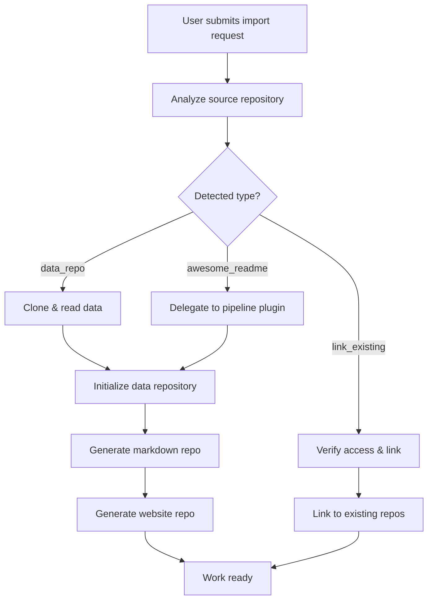
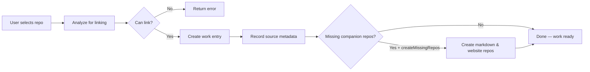

# Work Import

Work Import lets you bootstrap a new work from an existing source rather than starting from scratch. Instead of manually creating items one by one or running a generation from a blank prompt, you point the platform at a repository and it does the rest — cloning data, analyzing structure, enriching content with AI, and setting up the full work ecosystem.

## Import Types at a Glance

The platform supports three import types, each suited to a different starting point:

| Type                | Source                                                   | What Happens                                                                | AI Required | Async     |
| ------------------- | -------------------------------------------------------- | --------------------------------------------------------------------------- | ----------- | --------- |
| **Data Repository** | An Ever Works-format repo (`.works/works.yml` + `data/`) | Clones and copies all items, categories, tags verbatim                      | No          | Yes       |
| **Awesome README**  | Any curated list repo (e.g., `awesome-react`)            | Uses source as research seeds, then AI discovers and enriches far beyond it | Yes         | Yes       |
| **Link Existing**   | A data repo you already own                              | Links without copying — the platform manages your existing repo             | No          | No (sync) |

## How It Works — The Full Lifecycle

Every import follows the same high-level lifecycle, regardless of type:



### Phase 1 — Analysis

Before any import begins, the platform analyzes the source repository to understand what it's dealing with.

**URL parsing.** The system extracts the owner and repository name from the URL. It supports GitHub, GitLab, and Bitbucket URL formats, and handles variations like trailing slashes and `.git` suffixes.

**Type detection.** The analyzer inspects the root work contents of the repository:

- If the repo contains a root `.works/works.yml` **and** a `data/` work, it's classified as a **data repository** — an existing Ever Works-format repo with structured items.
- If the repo contains a `README.md` that has section headers and multiple categorized links (at least 5 list-style links, or 3+ internal work links for multi-file awesome lists), it's classified as an **Awesome README**.
- If neither pattern matches, the type is `null` and the import cannot proceed.

**Structure inspection.** For data repos, the analyzer counts items (subworks inside `data/`) and categories (entries in `categories.yml`). For Awesome READMEs, it estimates item count from list links and category count from section headers. This gives the user a preview of what the import will contain.

**Ecosystem detection.** The analyzer checks whether companion repositories exist using the naming convention: `{slug}-data`, `{slug}`, `{slug}-website`. This is particularly useful for linking workflows where a user already has a partial ecosystem.

**Slug conflict checking.** Before creating new repositories, the system checks whether repos with the target slug already exist on the user's git account. If conflicts are found, it suggests alternatives by appending numeric suffixes (`my-dir-2` through `my-dir-10`), or a timestamp suffix as a last resort.

### Phase 2 — Work Creation

Once analysis is complete, the platform creates a new `Work` entity in the database. This records the work name, slug, owner, git provider, and deployment provider. The work's generation status is set to "generating" and a generation history entry is created to track progress.

For Awesome README imports, the platform also stores the source repository metadata (URL, owner, repo name, import type) on the work entity. This metadata is used later for sync operations.

### Phase 3 — Import Execution

This is where the three import types diverge significantly.

#### Data Repository Import

The data repository import is the most straightforward path. It performs a direct data transfer:

1. **Clone the source.** The platform clones the source repository using the git provider plugin (via the Git Facade). The user's git token is used for authentication.

2. **Read the data.** A `DataRepository` abstraction reads the cloned filesystem. It extracts:
    - **Items** — each subwork inside `data/` represents one item, with a YAML metadata file and an optional markdown description.
    - **Categories** — from `categories.yml` at the root.
    - **Tags** — from `tags.yml` at the root.
    - **Config** — from `.works/works.yml`, including work-level settings and metadata.

3. **Initialize the target.** All extracted data is passed to the data generator, which writes it into the new work's own data repository. Import metadata (source owner/repo, timestamp, import type) is embedded in the config.

4. **Generate companion repos.** The markdown generator and website generator are initialized, creating the markdown repo (for rendered item pages) and website repo (for the deployed site).

The result is an exact copy of the source work with its own independent repositories.

#### Awesome README Import

The Awesome README import is the most powerful and complex path. Rather than simply copying data, it uses the source as a **starting point for AI-powered research and enrichment**.

:::info
The Awesome README import delegates entirely to the pipeline plugin — it does not parse the README directly. The pipeline treats the source URL as research input and builds a significantly larger work from it.
:::

Here's what happens under the hood:

1. **Build the generation prompt.** The system constructs a detailed, multi-step prompt for the pipeline plugin. This prompt instructs the AI to:
    - **Process source links** — Fetch the awesome list and visit each item's own URL. Workers independently research each item and write original descriptions. The AI does not copy descriptions from the source — it uses the source only as a list of URLs to research.
    - **Discover more items** — After processing the source, search for additional items in the same domain: alternatives, competitors, newer projects, and related tools not in the source.
    - **Enrich descriptions** — Ensure every item has a detailed, original description with key features, use cases, and comparisons.
    - **Build original taxonomy** — Create new categories and tags rather than replicating the source structure.

2. **Configure the pipeline.** The import sets pipeline parameters:
    - **Pipeline plugin**: Agent Pipeline by default (can be overridden via the `providers` parameter).
    - **Target items**: 500 by default — a generous ceiling. The pipeline stops when content is exhausted, not when it hits this number.
    - **Max pages to process**: Up to 1,000 URLs.
    - **Screenshot capture**: Enabled by default.
    - **Expansion factor**: 2.5x by default — meaning the source items should represent at most 40% of the final collection. The AI is expected to discover significantly more.

3. **Run the pipeline.** The configured generation DTO is passed to the data generator, which delegates to the active pipeline plugin. The pipeline runs autonomously — fetching the source, researching items, discovering new ones, and building the full work.

4. **Generate companion repos.** On success, the markdown and website generators are initialized, just like the data repo import.

The result is a work that goes far beyond the original awesome list — with original descriptions, broader coverage, and an independent taxonomy.

**Expansion factor.** The expansion factor controls how aggressively the AI should discover items beyond the source. At the default of 2.5x, the source represents at most 40% of the final work. This means a source with 100 items should produce a work with roughly 250 items.

#### Link Existing Import

The link existing import works fundamentally differently from the other two types. Rather than cloning data or generating new content, it **references an existing data repository** that the user already owns and manages. The platform creates a work entry that points to it, with no data copied or moved.



**How it works step by step:**

1. **Analyze for linking.** Before anything is created, the platform runs an analysis to verify that the target repository can be linked. This checks:
    - **Repository existence** — the repo must exist and be accessible via the git provider API.
    - **Write access** — the user must have write permission to the repository. Read-only access is not enough, because the platform needs to commit updates when syncing. If the user lacks write access, the import fails with a clear error message.
    - **Data repo structure** — the repository is temporarily cloned and inspected to count items, categories, and tags. This data is **not** copied — the clone is used only for validation and counting, then discarded.

2. **Detect the repository ecosystem.** The analyzer looks for companion repositories that may already exist alongside the data repo:
    - If the source repo is `my-dir-data`, it looks for `my-dir` (markdown repo) and `my-dir-website` (website repo).
    - If the source repo is `my-dir` (no suffix), it looks for `my-dir-data` and `my-dir-website`.
    - For each companion, it checks whether it exists and whether the user has write access.
    - This ecosystem detection also works in reverse: if the user points at a markdown or website repo, the analyzer tries to find the associated data repo automatically.

3. **Create the work entry.** A new work is created in the database. Unlike other import types, the work's **owner is set to the source repository's owner**, not the user's default git account. For example, if linking to `acme-org/awesome-tools-data`, the work owner becomes `acme-org`. This ensures that companion repos are created under the same owner/organization as the data repo.

4. **Record source metadata.** The work is immediately marked as `GENERATED` (not `GENERATING` — there's no background work to do). The source repository metadata is stored on the work entity: the URL, owner, repo name, and import type (`link_existing`). A generation history entry is created with a duration of 0 seconds.

5. **Create missing companion repos (optional).** If the `createMissingRepos` flag is set to `true`, the platform checks the ecosystem detection results:
    - If the **markdown repository** doesn't exist, it creates a fresh one using the markdown generator. This repo will hold rendered markdown pages for each item.
    - If the **website repository** doesn't exist, it creates a fresh one using the website generator. This repo will hold the deployable static site.
    - The **data repository is never created** — it must already exist (that's the entire point of linking).
    - These companion repos are brand-new repositories, not clones. They are initialized empty and will be populated when the platform processes the linked data.

6. **Emit completion event.** A `WorkGenerationCompletedEvent` is emitted, triggering any downstream actions (notifications, etc.).

:::info
The entire link existing operation completes **synchronously**. The API returns `200 OK` immediately — no background task is dispatched via Trigger.dev. This makes it the fastest import path, completing in under a second.
:::

**Key differences from other import types:**

| Aspect          | Link Existing                           | Data Repo / Awesome README                     |
| --------------- | --------------------------------------- | ---------------------------------------------- |
| Data movement   | None — references the existing repo     | Clones or generates data into new repos        |
| Processing      | Synchronous, instant                    | Asynchronous via Trigger.dev                   |
| Work owner      | Source repo's owner                     | User's configured git account                  |
| Sync support    | No automatic sync schedule              | Yes (weekly for Awesome README)                |
| Slug conflicts  | Not resolved (no new data repo created) | Auto-resolved with numeric suffixes            |
| Generate status | Set to `GENERATED` immediately          | Transitions through `GENERATING` → `GENERATED` |

**When to use Link Existing:** This mode is ideal when you already have an Ever Works data repository (perhaps created manually or by another instance) and want to manage it through the platform's UI without duplicating data. It's also the right choice when you want to bring an existing work ecosystem (data + markdown + website repos) under platform management.

### Phase 4 — Background Processing

For data repository and Awesome README imports, the actual work runs in the background:

1. **Trigger.dev dispatch.** The platform dispatches the import as a background task via Trigger.dev, with a maximum duration of 2 hours. This keeps the API responsive — the import request returns immediately with a `202 Accepted` status and a `historyId` for tracking.

2. **Fallback to in-process.** If Trigger.dev is unavailable, the import falls back to running in-process on a fire-and-forget basis. The API still returns immediately.

3. **Status tracking.** The work's generation status progresses through states: `generating` while the import runs, then `generated` on success or `error` on failure. The generation history entry records start time, finish time, duration, and item counts.

4. **Completion event.** When the import finishes (success or failure), the platform emits a `WorkGenerationCompletedEvent` that triggers downstream actions like notifications.

### Phase 5 — Post-Import

After a successful import, the work is fully operational:

- **Data repository** — Contains all items, categories, tags, and config as YAML files in the standard Ever Works structure.
- **Markdown repository** — Contains rendered markdown pages for each item.
- **Website repository** — Contains the generated static site, ready for deployment.

For Awesome README imports, a **weekly sync schedule** is automatically created. This schedule re-runs the import process periodically to pick up new items added to the source. The sync always creates a pull request rather than committing directly, so the user can review changes before merging.

:::info
To skip creating the automatic sync schedule, pass `"sync": false` in the import request.
:::

## Source Repository Structure

### Data Repository Format

A valid data repository must have this structure at the root:

```
.works/works.yml              # Work configuration (name, description, settings)
categories.yml          # Category definitions (id, name, description, icon)
tags.yml                # Tag definitions (optional)
data/
  item-slug-1/          # One work per item
    item-slug-1.yml     # Item metadata (name, description, source_url, categories, tags)
    item-slug-1.md      # Item long description (optional)
  item-slug-2/
    item-slug-2.yml
    ...
```

The minimum requirement is a root `.works/works.yml` and a `data/` work with at least one item.

### Awesome README Format

An Awesome README is detected by heuristics — it must be a `README.md` file that contains:

- **Section headers** — H1, H2, or H3 markdown headers that organize content.
- **Categorized links** — At least 5 list-style links (`- [Name](url) - Description`) across sections.

Alternatively, a **multi-file awesome list** is detected when the README contains 3 or more links to internal works (`[Category](./subfolder/)`).

The detection algorithm ignores meta sections like "Contributing", "License", "Table of Contents", and "Authors" when counting category headers.

## Error Handling

The import system uses typed error codes to communicate failures:

| Error Code           | Meaning                                                          |
| -------------------- | ---------------------------------------------------------------- |
| `INVALID_URL`        | The source URL could not be parsed as a valid git repository URL |
| `REPO_NOT_FOUND`     | The repository does not exist or is not accessible               |
| `REPO_ACCESS_DENIED` | The user lacks permission to access the repository               |
| `UNSUPPORTED_FORMAT` | The repository doesn't match any supported import format         |
| `PARSE_FAILED`       | No items could be extracted from the source                      |
| `CLONE_FAILED`       | The git clone operation failed                                   |
| `CREATE_REPO_FAILED` | Failed to initialize the new data repository                     |
| `ENRICHMENT_FAILED`  | The AI pipeline encountered an error during enrichment           |
| `GENERATION_FAILED`  | The data generation step failed                                  |

Each error is returned with a human-readable message explaining what went wrong and, where possible, how to fix it (e.g., "Repository not found. It may be private — please connect your git provider account.").

## Prerequisites

- **Git provider plugin configured** — A connected GitHub account with a valid access token. Required for all import types except public Awesome README repos.
- **AI provider active** — Required for Awesome README imports. The pipeline plugin uses the configured AI provider for research and content generation.
- **Pipeline plugin enabled** — For Awesome README imports, the Agent Pipeline plugin (or another pipeline plugin) must be active.

## Supported Platforms

The import system supports repositories from:

- **GitHub** — `https://github.com/owner/repo`
- **GitLab** — `https://gitlab.com/owner/repo`
- **Bitbucket** — `https://bitbucket.org/owner/repo`

## API Reference

All endpoints require JWT authentication.

### Analyze a Repository

Detect what import type a repository URL supports before importing.

| Method | Endpoint                    |
| ------ | --------------------------- |
| `POST` | `/api/works/import/analyze` |

**Request body:**

| Field         | Type   | Required | Description                                  |
| ------------- | ------ | -------- | -------------------------------------------- |
| `sourceUrl`   | string | Yes      | Full URL to the repository                   |
| `gitProvider` | string | No       | e.g., `github`. Inferred from URL if omitted |

The response includes `detectedType` (`data_repo`, `awesome_readme`, or `null`), visibility (`isPublic`), estimated `itemCount` and `categoryCount`, and any `slugConflict` information.

### Analyze for Linking

Check whether a repository can be linked (verifies write access and detects companion repos).

| Method | Endpoint                                |
| ------ | --------------------------------------- |
| `POST` | `/api/works/import/analyze-for-linking` |

The response includes `canLink`, `hasWriteAccess`, and `relatedRepos` showing which companion repos (data, markdown, website) already exist.

### Start Import

| Method | Endpoint            |
| ------ | ------------------- |
| `POST` | `/api/works/import` |

**Request body:**

| Field                | Type    | Required | Description                                                                      |
| -------------------- | ------- | -------- | -------------------------------------------------------------------------------- |
| `sourceUrl`          | string  | Yes      | Full URL to the source repository                                                |
| `sourceType`         | string  | Yes      | `data_repo`, `awesome_readme`, or `link_existing`                                |
| `name`               | string  | Yes      | Work name (max 100 characters)                                                   |
| `gitProvider`        | string  | Yes      | Git provider ID, e.g., `github`                                                  |
| `owner`              | string  | No       | Git account/org to create repos under (defaults to your username)                |
| `organization`       | boolean | No       | Whether `owner` is an organization                                               |
| `createMissingRepos` | boolean | No       | For `link_existing`: create missing markdown/website repos                       |
| `sync`               | boolean | No       | For `awesome_readme`: `false` to skip weekly sync schedule                       |
| `deployProvider`     | string  | No       | Deployment provider, e.g., `vercel`                                              |
| `providers`          | object  | No       | Override AI/pipeline provider: `{ ai: "openai", pipeline: "standard-pipeline" }` |

Returns `202 Accepted` for `data_repo`/`awesome_readme` (async), `200 OK` for `link_existing` (sync). The response includes `workId` and `historyId` for tracking progress.

### List Repositories

Browse your git repositories to find one to import.

| Method | Endpoint                         |
| ------ | -------------------------------- |
| `GET`  | `/api/works/import/repositories` |

**Query parameters:**

| Parameter     | Type   | Required | Description                   |
| ------------- | ------ | -------- | ----------------------------- |
| `gitProvider` | string | Yes      | e.g., `github`                |
| `page`        | number | No       | Page number (default 1)       |
| `perPage`     | number | No       | Results per page (default 30) |
| `search`      | string | No       | Filter by name or description |
| `owner`       | string | No       | Filter by repo owner          |

## Related

- [Scheduled Updates](./scheduled-updates) — Awesome README imports auto-create a weekly sync schedule
- [Pipeline Plugins](/plugin-system/pipeline-plugins) — How the Agent Pipeline processes awesome list imports
- [GitHub Plugin](/plugin-system/github-plugin) — GitHub plugin configuration for git operations
- [Import System Deep Dive](/agent-services/import-system) — Technical internals of the import module
