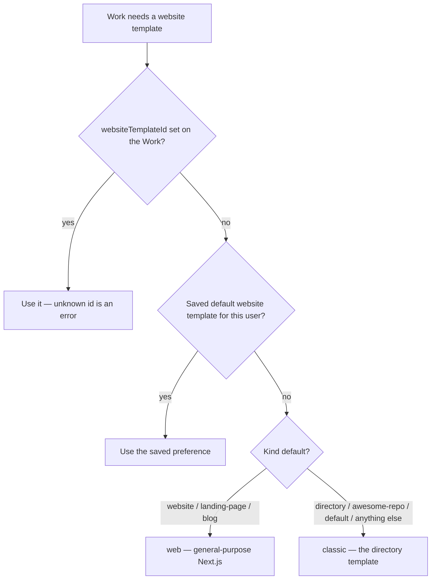

# Work Kinds & Capabilities

Every [Work](./creating-a-work.md) carries a **kind** — `website`, `landing-page`, `blog`, `directory`, `awesome-repo`, plus a few the platform mints for you. You pick it once, at creation, and it decides what the Work _has_: which tabs appear in its workspace, which metric tiles the Overview shows, which repositories are provisioned, and which [website template](./website-templates.md) the generator reaches for when you have not chosen one yourself.

The vocabulary and the per-kind capability registry live in one shared package (`@ever-works/contracts`: `work-kind.ts` and `work-capabilities.ts`), so the API, the agent runtime and the dashboard all give the same answer to "what does this Work support?". A Landing Page never shows an Items tab or a "Total Items: 0" tile, and a Directory keeps everything it always had.

## The vocabulary

| Kind           | Label on screen | How it is created                                                                                                                      | What it is                                                                                                                                            |
| -------------- | --------------- | -------------------------------------------------------------------------------------------------------------------------------------- | ----------------------------------------------------------------------------------------------------------------------------------------------------- |
| `website`      | Website         | **Website** chip on `/new` or `/works/new`                                                                                             | A multi-page site for a business, service, or brand — generated content + code.                                                                       |
| `landing-page` | Landing Page    | **Landing Page** chip on `/new` or `/works/new`                                                                                        | A focused one-pager — waitlists, product launches, webinar signups, lead capture. `landing` is accepted as an alias and normalized to `landing-page`. |
| `blog`         | Blog            | **Blog** chip on `/new` or `/works/new`                                                                                                | A blog with categories, RSS, code highlighting, and SEO-ready content.                                                                                |
| `directory`    | Directory       | **Directory** chip on `/new` or `/works/new`                                                                                           | A curated directory site with search, filters, and structured item data.                                                                              |
| `awesome-repo` | Awesome Repo    | **Awesome Repo** chip on `/new` or `/works/new`                                                                                        | An awesome-list repo — markdown index, categorized links, and refreshable metadata.                                                                   |
| `company`      | Company         | The live **Company** chip is on `/new` only → opens the Register-Company dialog (on `/works/new` it renders as an inert **Soon** chip) | An organizational shell that backs an Organization. It is never produced by the general create path — see [Company Builder](./company-builder.md).    |
| `campaign`     | Campaign        | **Start a campaign** button on `/works/new` → `/works/new/campaign`                                                                    | The artifact home for a go-to-market pipeline: lead lists, drafts waiting at the review gate, period reports. Minted only by campaign activation.     |
| `default`      | Work            | Any Work created before kinds shipped, or created without a `kind` (the CLI's `work create`, the REST API with `kind` omitted)         | The column default. Behaves **exactly like `directory`** — every existing Work keeps the full directory feature set.                                  |

Three rules apply everywhere a kind is read or written:

- **Unknown values never crash anything.** `work.kind` is stored as an open string, so a newer server can ship a kind an older dashboard has not heard of. Every consumer routes the value through `normalizeWorkKind()`, which trims, lower-cases, maps `landing` → `landing-page`, and falls back to `default` for anything it does not recognize.
- **The create path cannot mint `company` or `campaign`.** Sending `kind: "company"` to `POST /api/works` is coerced to `default`; a Company Work only comes out of the Register-Company flow (`WorkLifecycleService.createCompanyWork`) and a Campaign Work only out of campaign activation (`createCampaignWork`).
- **Kind is create-only.** `UpdateWorkDto` has no `kind` field, so a `PUT /api/works/:id` carrying one is rejected with `400`. A rename or any other update leaves the persisted kind untouched.

The **Store** chip you see next to the kinds is not a kind. On the hosted platform the `works-store` flag resolves to `false`, so the chip renders as an inert **Soon** chip on both `/new` and `/works/new`; on installs without PostHog the chip is not marked **Soon**, but selecting it still does nothing, because there is no `store` entry in the vocabulary yet — see [Store Builder](./store-builder.md).

:::tip Feature flags
Each chip is gated by a `works-<kind>` PostHog flag evaluated server-side (`apps/web/src/lib/feature-flags/work-kinds.ts`). The gate fails **open**: no PostHog key, a missing flag, a timeout or an error all leave the chip enabled, so self-hosted installs get every kind. Only a flag that resolves strictly to `false` turns a chip into "Soon", and a flag-disabled kind cannot be deep-linked through `?kind=` either.
:::

## Capability matrix

The registry (`WORK_KIND_CAPABILITIES`) is a **hide-list for the new kinds, never an allow-list for the old ones**: `default` and `directory` share one capability object, and it carries everything.

| Capability                                              | `directory` / `default` | `awesome-repo`  | `blog`          | `website`       | `landing-page` | `company` | `campaign` |
| ------------------------------------------------------- | ----------------------- | --------------- | --------------- | --------------- | -------------- | --------- | ---------- |
| Items surface (tab, `/items` routes, submissions)       | Yes — **Items**         | Yes — **Items** | Yes — **Posts** | Yes — **Pages** | No             | No        | No         |
| Taxonomy (categories, tags, collections + tiles)        | Yes                     | Yes             | Yes             | No              | No             | No        | No         |
| Comparisons (generator sub-tab + endpoints)             | Yes                     | No              | No              | No              | No             | No        | No         |
| Community pull-request intake                           | Yes                     | Yes             | No              | No              | No             | No        | No         |
| CSV / Excel item import & export                        | Yes                     | Yes             | No              | No              | No             | No        | No         |
| Source-URL validation for items                         | Yes                     | Yes             | No              | No              | No             | No        | No         |
| Deploy (tab + deployment endpoints)                     | Yes                     | Yes             | Yes             | Yes             | Yes            | No        | No         |
| Knowledge base (the **Memory** tab)                     | Yes                     | Yes             | Yes             | Yes             | Yes            | Yes       | Yes        |
| Data repository (`{slug}-data`)                         | Yes                     | Yes             | Yes             | Yes             | Yes            | Yes       | Yes        |
| Provider repository (`{slug}`, the browsable markdown)  | Yes                     | Yes             | Yes             | Yes             | Yes            | Yes       | Yes        |
| Work repository (`{slug}-website`, the template output) | Yes                     | Yes             | Yes             | Yes             | Yes            | No        | No         |

The three repository rows use the persisted `RepositoryRole` names. On screen they are labelled **Data Repository**, **{provider} Repository** (for example "GitHub Repository") and **Work Repository**; the last one is the template checkout and is not always a website.

### Metric tiles on the Overview tab

The Overview tile set is also per kind (`metrics` in the registry, rendered by `WorkStats`). Tiles marked with an asterisk are provider-backed: they read **"Connect analytics to see this"** until an analytics provider is connected to the Work, because a site that has never had analytics has _unknown_ page views, not zero.

| Kind                    | Tiles, in order                                                                  |
| ----------------------- | -------------------------------------------------------------------------------- |
| `directory` / `default` | Total Items · Categories · Comparisons · Generation Status · Days Active         |
| `awesome-repo`          | Total Items · Categories · Tags · Generation Status · Days Active                |
| `blog`                  | Posts · Page Views\* · Registered Users · Deploy Status · Days Active            |
| `website`               | Page Views\* · Registered Users · Sessions\* · Deploy Status · Generation Status |
| `landing-page`          | Page Views\* · Conversions\* · Deploy Status · Days Active                       |
| `company`               | Works · Team Members · Agents · Open Tasks · Days Active                         |
| `campaign`              | Agents · Open Tasks · Conversions\* · Days Active                                |

## What that means on screen

The Work workspace (`/works/:id`) draws its tab strip from the registry (`WorkTabs.tsx` calls `getWorkCapabilities(work.kind)`):

- **Directory, Awesome Repo and older `default` Works** show the familiar strip: Overview · Activity · **Items** · Tasks · Pull requests · Memory · Worker · Plugins · Deploy · Settings.
- **Blog Works** show the same strip, but the third tab reads **Posts**.
- **Website Works** show **Pages** instead of Items.
- **Landing Page Works have no Items tab at all.** The tab disappears rather than showing an empty list that can never be filled. The `/works/:id/items` route stays mounted, so a bookmarked URL still opens.
- **Company and Campaign Works** have `deploy` switched off. They are created without a website repository and with `deployProvider: null` (they also do not count against the Ever Works Deploy quota), so there is nothing to deploy and no Deploy tab; the Memory tab stays, because the company manifest or the campaign brief belongs in the knowledge base.
- The **{provider} Repository** opt-out card in **Settings** only renders when the kind provisions that repository (`repos.work`), which today is every kind.

## Kind-aware default website template

The kind also picks a sensible default [website template](./website-templates.md) — but only when nothing more specific is set. `WebsiteTemplateResolverService.resolveForWork` walks this order at **website-generation time**:



| Kind                                                        | Default template                                                                        |
| ----------------------------------------------------------- | --------------------------------------------------------------------------------------- |
| `website`, `landing-page` (and the alias `landing`), `blog` | `web` — the general-purpose Next.js template (marketing pages, no directory data model) |
| `directory`, `awesome-repo`, `default`, unknown             | `classic` — the original directory template (or the admin-configured system default)    |

Two details worth knowing:

- **The default is resolved late.** Creating a Work with `kind: "blog"` leaves `websiteTemplateId` `null` in the create response and on every later `GET`; the `web` default is applied only when the website repository is first generated. This is deliberate so that a saved user preference set _after_ creation still wins.
- **An explicit choice beats the kind.** Pick **Classic** in the template selector for a Website Work and the Work stays on `classic`; pick **Website** (`web`) for a Directory and it stays on `web`. The `web-minimal` (Astro) variant is always opt-in, the same way `minimal` is for directories. `GET /api/templates?kind=website` lists every website template you can pick, with `classic` reported as `defaultTemplateId`.

## Per-kind `.works/works.yml` sections

The [`.works/works.yml`](./works-config.md) file in a Work's data repository is versioned (schema v2), and v2 adds exactly three optional root keys: `version`, `kind` and `spec`. `spec` is discriminated on the kind, so per-kind settings nest under it instead of crowding the flat root namespace:

```yaml
version: 2
kind: blog
name: Indie Game Dev Journal
initial_prompt: Personal blog about indie game development with postmortems and tooling tags
spec:
    authors:
        - name: Ada
          bio: Solo developer, shipping one prototype a month.
    taxonomies:
        categories: [Postmortems, Tooling, Business]
        tags: [godot, pixel-art, steam]
    feed:
        enabled: true
    pagination:
        per_page: 10
    generation:
        cadence: weekly
        topics_prompt: Lessons from shipping small games; keep each post under 1200 words.
        posts_per_run: 2
```

`spec.kind` may be omitted when the root already says `kind:`. Every field is optional — the file is a partial override of platform defaults, never a complete description — and every object preserves keys it does not recognize, so a key written by a newer server or by hand round-trips back to your repository intact. A **known** kind is validated strictly (`posts_per_run: "three"` is an error); a genuinely unknown kind passes through with a warning.

| Kind           | `spec` fields                                                                                                                                                                                                                 |
| -------------- | ----------------------------------------------------------------------------------------------------------------------------------------------------------------------------------------------------------------------------- |
| `website`      | `template`, `pages[]` (`path`, `title`, `prompt`), `nav.header[]` / `nav.footer[]` (`label`, `href`), `branding`, `seo`, `analytics.provider`                                                                                 |
| `landing-page` | `template`, `hero` (`headline`, `subheadline`, `cta.label`, `cta.href`), `sections[]` (`type`, `title`), `capture` (`enabled`, `destination`), `branding`, `seo`, `analytics.provider`                                        |
| `blog`         | `template`, `content_dir`, `authors[]` (`name`, `bio`), `taxonomies.categories[]` / `taxonomies.tags[]`, `feed.enabled`, `pagination.per_page`, `generation` (`cadence`, `topics_prompt`, `posts_per_run`), `branding`, `seo` |
| `directory`    | `template`, `categories[]`, `tags[]`, `item_fields[]` (`name`, `type`), `sources[]` (`url`), `submissions` (`enabled`, `moderation: auto \| manual`), `comparisons.enabled`, `branding`, `seo`                                |
| `awesome-repo` | `template`, `source` (`repo`, `branch`, `file`), `sync.cadence`, `readme` (`header`, `footer`, `overwriteDefaultHeader`, `overwriteDefaultFooter`, `toc`, `badges[]`), `enrich.enabled`                                       |
| `company`      | `organization`, `company_manifest` (path to the `agentcompanies/v1` sidecar), `departments[]` (`name`), `staffing[]` (`role`, `agent`), `branding`                                                                            |

`cadence` values are `hourly`, `daily`, `weekly` or `monthly`. There is no `campaign` spec: a Campaign Work has no data-repository generator, so its configuration lives in the campaign brief and its Goal instead. A `default` Work's file stays byte-identical to what was written before v2 existed.

## Where you pick a kind

### How to: create a Work of a given kind from the dashboard

1. Click **+ New** in the sidebar (`/new`). The chip row reads Mission · Idea · Agent · Task · **Website** · **Landing Page** · **Blog** · **Directory** · **Awesome Repo** · Company · Store (Soon).
2. Pick a kind chip. The chip drops that kind's example prompt into the composer (for example _"Personal blog about indie game development with postmortems and tooling tags"_) and a one-line description of the kind appears under the row — edit the prompt to describe your own site.
3. Submit. Work kinds are forwarded to `/works/new?mode=ai&kind=<kind>` with your prompt preserved; the Company chip opens the **Register-Company** dialog instead.
4. On `/works/new` the same five kind chips sit under the composer — followed by an inert **Store** chip and an inert **Company** (Soon) chip, since the live Company flow lives on `/new` — so you can also start there directly. **Create with AI** hands the prompt to the chat and opens the AI creator form; **Create Work Manually** and **Import Existing Work** are the non-AI paths described in [Creating a Work](./creating-a-work.md), and **Start a campaign** leaves the website flow for `/works/new/campaign`.
5. In the AI creator, the **Work Templates** picker filters its blueprints by the kind you chose: `website` → `website`, `landing-page` → `landing`, `blog` → `blog`, `directory` → `directory`, `awesome-repo` → `awesome`. Your kind's chip is listed first, other types with at least one selectable blueprint follow, placeholder blueprints are hidden, and switching kind resets the picker.
6. Optionally pick a website template in the sidebar selector. Leave it on the default and the kind decides (`web` for Website / Landing Page / Blog, `classic` for Directory / Awesome Repo).
7. Create. The kind is persisted on the Work and shown as a kind badge in the Work header and on the Works list cards, and as **Type** in the Overview's Work info card.

Deep links work the same way: `/works/new?kind=directory&prompt=...` pre-selects the chip and seeds the prompt. `/new?type=company` opens the Register-Company dialog on load.

### How to: set a kind through the REST API

`POST /api/works` accepts an optional `kind` alongside the usual fields:

```bash
curl -X POST "https://api.ever.works/api/works" \
  -H "Authorization: Bearer $EVER_WORKS_TOKEN" \
  -H "Content-Type: application/json" \
  -d '{
    "name": "Indie Game Dev Journal",
    "slug": "indie-game-dev-journal",
    "description": "Postmortems and tooling notes from a solo studio",
    "organization": false,
    "kind": "blog"
  }'
```

The response is the usual envelope — `{ "status": "success", "work": { ..., "kind": "blog", "websiteTemplateId": null } }` — and the kind is echoed by `GET /api/works/:id` and in the `GET /api/works` listing. Input is normalized at the boundary (`normalizeCreateWorkKind`, enforced by `@IsIn` on `CreateWorkDto`):

| You send                                         | Persisted                      |
| ------------------------------------------------ | ------------------------------ |
| `"blog"`, `" WEBSITE "`                          | `blog`, `website`              |
| `"landing"`                                      | `landing-page`                 |
| `"company"`, `"campaign"`                        | `default`                      |
| unknown string, number, `null`, `""`, or omitted | `default`                      |
| any unknown extra property                       | `400` (`forbidNonWhitelisted`) |

To pin a template at the same time, add `"websiteTemplateId": "classic"` (or `"web"`, `"minimal"`, `"web-minimal"`); an unknown id is a `400`.

The CLI's interactive `work create` command does not ask for a kind today, so Works created there carry `default` and behave as directories — use the dashboard or the API when you need a different kind.

## What is early, and what is not a kind

:::caution Blog, Website and Landing Page Works are early
These three kinds are fully wired at the platform level — the chip, the persisted `kind`, the capability registry, the `web` website template default and the per-kind `works.yml` spec all ship. What is still catching up is the **content**: the generation pipeline that runs for them is the same items pipeline every Work gets, and its writer (`DataRepository`) produces items, categories, tags, collections, references and comparisons. There is no dedicated blog-post generator or landing-copy generator yet, so a Blog Work's **Posts** tab and a Website Work's **Pages** tab are fed by that items pipeline, and the `web` template's landing sections come from the template itself rather than from your prompt. In the blueprint catalog the `blog`, `landing` and `awesome` facets are still placeholders in the `ever-works/works` blueprint manifest the platform fetches (and the picker hides placeholder blueprints), while `website` already has a selectable marketing-site blueprint. Scheduled updates re-run the same pipeline on the cadence you set.
:::

- **Store is not a kind.** The chip is a roadmap marker; see [Store Builder](./store-builder.md) for where it is going.
- **Company and Campaign are real kinds, minted by dedicated flows.** Register a company from the **Company** chip on `/new` (or by opening `/new?type=company` directly) — the platform creates a `company` Work and, once registration completes, the Organization it backs; the flow is described in [Company Builder](./company-builder.md) and [Tenants & Organizations](../advanced/teams-and-organizations.md#the-register-company-flow). Start a campaign from `/works/new/campaign`: one brief (name, objective, optional target value and unit, channels) provisions the `campaign` Work, a Goal for the objective, the prebuilt go-to-market Agents and the first pipeline Tasks in a single call.
- **Older Works are not second-class.** Every Work created before kinds existed is `default`, which is the full directory feature set — nothing was taken away.

## Related

- [Creating a Work](./creating-a-work.md) — the AI / Manual / Import paths the kind chips feed into
- [Website Templates](./website-templates.md) — `classic`, `minimal`, `web` and `web-minimal`, and how to switch
- [Work Templates](./work-templates.md) — the Templates catalog and blueprint forks the picker draws from
- [`.works/works.yml` Configuration](./works-config.md) — the root keys the per-kind `spec` sits beside
- [Taxonomy System](./taxonomy-system.md) · [Collections](./collections.md) · [Comparisons](./comparisons.md) — the item-side capabilities in the matrix
- [Community PR Processing](./community-pr-processing.md) · [Item Source Validation](./item-source-validation.md) · [Work Import](./work-import.md) — directory- and awesome-only capabilities
- [Knowledge Base](./knowledge-base.md) — the one capability every kind keeps
- [Company Builder](./company-builder.md) · [Store Builder](./store-builder.md) — the kinds minted elsewhere and the one still to come
