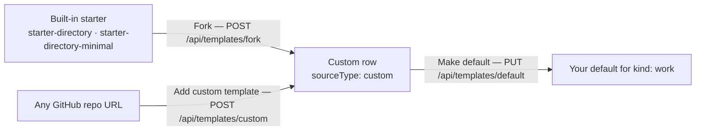

# Work Templates

A **Work Template** is a pre-baked starter for a new [Work](./creating-a-work.md):
a pointer to a real GitHub boilerplate repository you can fork into your
own Work. Work Templates power the **"Work Templates"** tab on the
Templates page, alongside [Website Templates](./website-templates.md) and
[Mission Templates](./mission-templates.md).

This page covers the Work Template **catalog kind**, the **built-in
starters**, and how a Work Template is **used**. For the full REST surface
(list / add / fork / customize), see the
[Template Catalog API](/api/template-catalog).

**Key sources:**

- `packages/agent/src/works/work-template.config.ts` — the built-in Work Template catalog
- `packages/agent/src/template-catalog/template-catalog.service.ts` — seeding + fork flow
- `apps/api/src/template-catalog/template-catalog.controller.ts` — `/api/templates*` endpoints

## Template kinds

The catalog is a single system that serves several **kinds**, filtered so
each surface shows only its own. The `TemplateKind` union is
`'website' | 'work' | 'mission' | 'company'`, and the catalog reader
filters by kind so the tabs never cross-pollute:

| Kind      | Tab                | Backing config                                                                                                  |
| --------- | ------------------ | --------------------------------------------------------------------------------------------------------------- |
| `website` | Website Templates  | `website-template.config.ts`                                                                                    |
| `work`    | **Work Templates** | `work-template.config.ts`                                                                                       |
| `mission` | Mission Templates  | `mission-template.config.ts`                                                                                    |
| `company` | _(no seed in v1)_  | the `+ New` Company chip → [register-company](../advanced/teams-and-organizations.md#the-register-company-flow) |

A Work Template config mirrors the website/mission shape (owner / repo /
branch + id / name / description) so the seed path treats every kind
uniformly. Unlike the website kind — which _infers_ its framework label
from the repo name — a Work Template states its `framework` **explicitly**
in config, so e.g. an Astro starter is never mislabelled by a repo-name
heuristic.

## Built-in starters

`listWorkTemplates()` returns the two built-in Work Templates that
`TemplateCatalogService` seeds on boot as `kind: 'work'` catalog rows
(verified in `work-template.config.ts`):

| Id                          | Name                        | Repo (`ever-works/…`)            | Framework |
| --------------------------- | --------------------------- | -------------------------------- | --------- |
| `starter-directory`         | Starter Directory           | `directory-web-template`         | Next.js   |
| `starter-directory-minimal` | Starter Directory (Minimal) | `directory-web-minimal-template` | Astro     |

- **Starter Directory** — a Next.js directory boilerplate; a
  batteries-included starting point for a new directory Work.
- **Starter Directory (Minimal)** — a minimal Astro directory boilerplate;
  a lightweight, content-first starting point.

Seeding is idempotent (upsert), and the service deactivates any older
built-in row that points at the same `(owner, repo)` under a different id,
so a curated entry never renders as a duplicate card.

## Using a Work Template

The Templates catalog is a gallery in the dashboard's **Templates**
section. For a built-in Work Template, the **Fork** action
(`TemplateCatalogService.forkTemplateForUser`) forks the boilerplate
repository into a GitHub account or organization you select, then:

1. Creates a `custom` template row that points at your new fork (recording
   `forkedFromTemplateId` so the UI can re-run a customization later).
2. Sets that fork as your **default** template for the `work` kind.

The forked repository is now yours to launch a Work from. You can also add
your own Work Template by repository URL via **Add Custom Template**
(`POST /api/templates/custom` with `kind: 'work'`), the same flow used for
website and mission templates.

:::note Only standard templates can be forked
Forking is restricted to `built_in` templates — a custom template is
already your own repo, so it doesn't need forking again
(`forkTemplateForUser` rejects non-built-in sources).
:::

## Custom templates

The two built-in starters are curated, read-only catalog entries. Everything
else on the **Work Templates** tab is a **custom** row: a template you own,
pointing at a repository you own. There are two ways to create one, and the
catalog records which was used in the row's `originType`:

| `originType` | Created by                                     | Points at                              |
| ------------ | ---------------------------------------------- | -------------------------------------- |
| `standard`   | Seeding on boot from `work-template.config.ts` | An `ever-works` boilerplate repository |
| `forked`     | **Fork** on a built-in card                    | Your GitHub fork of that boilerplate   |
| `custom_url` | **Add custom template** with a repository URL  | Any GitHub repository you name         |

Custom rows are per user and per kind: a Work Template you add is visible to
you on the Work Templates tab only, and never leaks into the Website or
Mission tabs. In the UI, the **All / Built-in / Custom** filter above the
grid separates the two source types and shows live counts.



### How to: add a Work Template from a repository URL

1. Open `/templates?kind=work` — Sidebar → **Templates**, then the **Work
   Templates** pill in the segmented control under the page title.
2. Click **Add custom template**.
3. Paste the **GitHub repository URL**
   (`https://github.com/owner/repository`). This is the only required field,
   and it is locked once the row is saved.
4. Optionally set **Template name**, **Framework** (**Next.js** or
   **Astro**), **Preview image URL**, **Short description**, **Default
   branch**, and **Beta branch**.
5. Click **Save template**. The card appears under the **Custom** filter.

The button calls `POST /api/templates/custom` with `kind: "work"`:

```bash
curl -X POST http://localhost:3100/api/templates/custom \
  -H "Authorization: Bearer <jwt-token>" \
  -H "Content-Type: application/json" \
  -d '{
    "kind": "work",
    "repositoryUrl": "https://github.com/acme/acme-directory-starter",
    "name": "Acme Directory Starter",
    "framework": "Next.js",
    "branch": "main"
  }'
```

What the server fills in when you leave a field empty:

- **Name** — a humanized repository name (`acme-directory-starter` becomes
  "Acme Directory Starter").
- **Framework** — inferred from the repository name when the select is left
  on **Not specified**.
- **Default branch** — `main`; the row's sync branches default to that single
  branch.

Two failures are worth knowing about: a URL that is not a GitHub repository
is rejected with _"Only valid GitHub repository URLs are supported for custom
templates."_ (`400`), and adding the same repository twice for the same kind
returns _"You already added this template repository."_ (`409`).

### How to: fork a built-in Work Template into your GitHub

1. On `/templates?kind=work`, find **Starter Directory** or **Starter
   Directory (Minimal)** and click **Fork**.
2. In the **Fork standard template** dialog, pick a **Fork destination** —
   your **Personal account** or an **Organization** you belong to. If the
   list is empty, connect GitHub first; the dialog tells you so.
3. Click **Fork and make default**.

The platform forks the boilerplate into the destination you chose, creates a
`custom` row that points at the new fork (recording `forkedFromTemplateId`,
the source repository, and whether the target was personal or an
organization), and sets that row as your default for the `work` kind —
`POST /api/templates/fork`.

Fork is idempotent by repository coordinates: if you already have a row for
`<destination>/<repository>`, no second fork is created — the existing row
simply becomes your default, and the response carries `created: false` with
the toast _"… was already in your catalog and is now your default forked
template."_

### How to: edit or archive a custom row

- **Edit** (pencil) reopens the dialog for display details only — name,
  framework, preview image, description, default branch, beta branch. The
  repository URL field is disabled, with the helper text _"The source
  repository URL cannot be changed after the template is added."_ This is
  `PUT /api/templates/custom/:templateId`.
- **Archive** (trash) deactivates the row —
  `POST /api/templates/custom/:templateId/archive`. Work Template rows carry
  no Work binding, so they archive immediately; the usage guard that refuses
  to archive a template still assigned to a Work applies to the `website`
  kind.
- **More actions** (the ⋮ button) → **Make default** points new Works at this
  row for the `work` kind (`PUT /api/templates/default`).

## AI customization

Ever Works can hand a template repository to a **code-edit agent** and have
it restyle the UI for you. The flow is real and shipped, and it is
deliberately narrow.

:::note Where the AI controls appear today

**Create with AI**, **Customize again** and **Sync from base** only render
for templates whose base is registered as AI-customizable, and that registry
is the Website Template config
(`packages/agent/src/generators/website-generator/config/website-template.config.ts`).
The two built-in Work Templates are not in it, and
`POST /api/templates/custom-from-base` creates its new row with
`kind: 'website'`. So today those three controls live on the **Website
Templates** tab, while the Work Templates tab offers **Add custom template**,
**Fork**, **Edit**, **Archive**, **Make default** and **Refresh**. The
sections below describe the customization system as it exists, so you know
what it does — and what it does not yet do to a Work Template.

:::

### Which bases can be customized

| Base id       | Name              | AI-customizable | Why                                                                                   |
| ------------- | ----------------- | --------------- | ------------------------------------------------------------------------------------- |
| `classic`     | Classic           | No              | Marked `customizable: false` in config — too large to restyle safely end to end today |
| `minimal`     | Minimal           | Yes             | Flagged customizable and has a registered customization prompt                        |
| `web`         | Website           | Yes             | Flagged customizable and has a registered customization prompt                        |
| `web-minimal` | Website (Minimal) | Yes             | Flagged customizable and has a registered customization prompt                        |

A base needs **both** `customizable: true` and a prompt registered in
`packages/agent/src/template-catalog/customization-prompts/`. Missing either
one, the API answers _"Template … is not available for agent
customization."_

### What a customization run may change

The commit surface is a single file: `apps/web/src/styles/theme.css`. Any
other path the agent touches is discarded before the commit, so the
repository keeps compiling no matter which provider ran or how it behaved. If
the agent changed nothing inside that surface, the run fails rather than
pushing an empty commit. Your prompt is wrapped in an explicit
`<user-request>` boundary and passed to the agent as design data, not as
instructions.

:::caution `theme.css` is plain CSS, not the Tailwind entry file

Tailwind directives (`@apply`, `@tailwind`, `@theme`, `@source`,
`@reference`, `@plugin`, `@config`, `@utility`, `@custom-variant`,
`@variant`) are rejected. Standard CSS at-rules — `@media`, `@supports`,
`@font-face`, `@import` — are fine.

:::

Provisioning creates a **brand-new repository** cloned from the base, not a
GitHub fork: GitHub allows one fork per account per repository, and you will
want several custom templates from the same base. The clone is stripped of
`apps/sample-*`, `apps/docs` and `apps/web-e2e` (they never ship in a
deployed Work) before it is pushed to the new repository, and only then does
the agent run.

### What a run needs

| Requirement           | Where it comes from                                                                         |
| --------------------- | ------------------------------------------------------------------------------------------- |
| A code-edit plugin    | `/settings/plugins` — for example `claude-code`, `codex`, `gemini`, `opencode`              |
| An AI provider plugin | Only when the code-edit plugin declares `ai-provider` in its `selectableProviderCategories` |
| A GitHub connection   | The new repository is created under your account or an organization you belong to           |

With no code-edit plugin installed, `POST /api/templates/custom-from-base`
answers `400` with _"Code-edit provider … is not installed"_ — the API never
pretends a run started.

### Run status and endpoints

The card's status chip walks **Queued → Forking → Customizing → Pushing →
Customized**, or shows **Last run failed** with the error message and a
**Retry**. Click the chip to open the live status of the latest run.

| Method | Endpoint                                      | What it does                                                |
| ------ | --------------------------------------------- | ----------------------------------------------------------- |
| `GET`  | `/api/templates/customization-providers`      | Installed code-edit plugins available to you                |
| `GET`  | `/api/templates/customization-ai-providers`   | Installed AI providers, for plugins that need one           |
| `POST` | `/api/templates/custom-from-base`             | Provision a new repository from a base and start the run    |
| `POST` | `/api/templates/custom/:templateId/customize` | Re-run the agent on the same repository with a fresh prompt |
| `GET`  | `/api/templates/customizations/:id`           | Status of one run                                           |
| `GET`  | `/api/templates/:templateId/customizations`   | Full run history for a template                             |

## Sync from base, and Refresh

These two controls look alike — both are circular arrows — and do very
different things.

### Sync from base

**Sync from base** rewrites a custom template's repository with the latest
code from the base it was created from.

1. On a custom card created from an AI-customizable base, click **Sync from
   base** (the circular-arrow button on the card).
2. Read the amber warning in the **Sync from base** dialog and confirm.

`POST /api/templates/custom/:templateId/sync-base` replaces the repository
contents using the same duplicate-update model the platform uses for website
repositories (`method: "duplicate"`), stamps `lastBaseSyncedAt`,
`lastBaseSyncMethod` and `lastBaseSyncBase` on the row, then re-reads the
catalog and returns the refreshed template.

:::warning Sync overwrites your customizations

The base's code replaces what is in the repository, so styling commits from
earlier customization runs are gone. Run **Customize again** afterwards to
put your styling back on top of the newer base.

:::

A row that is not linked to a customizable base — anything you added by URL —
is refused with _"Template is not linked to a customizable base."_

### Refresh

**Refresh templates**, the circular-arrow button next to **Add custom
template** in the toolbar, calls `POST /api/templates/refresh` with the kind
you are looking at and re-reads the catalog:

```bash
curl -X POST http://localhost:3100/api/templates/refresh \
  -H "Authorization: Bearer <jwt-token>" \
  -H "Content-Type: application/json" \
  -d '{ "kind": "work" }'
```

On the **Website Templates** tab, refresh additionally re-scans the
configured template-catalog GitHub organization through your GitHub
connection before listing. On the **Work Templates** tab it re-lists the
seeded built-ins plus your custom rows — use it after forking or adding a
template from another tab, from the API, or from a second session.

## Related pages

- [Creating a Work](./creating-a-work.md) — the Work concept.
- [Website Templates](./website-templates.md) and
  [Mission Templates](./mission-templates.md) — the sibling kinds.
- [Template Catalog API](/api/template-catalog) — list / add / fork /
  customize endpoints.
- [Work Blueprints](./work-blueprints.md) — the third catalog: ready-made
  Work definitions read from the public `ever-works/works` manifest and
  offered in the Create-Work Template picker.
- [Templates & Catalogs guide](../guides/templates-catalogs.md) — every
  template system side by side, with the full fork / add-by-URL / customize
  / sync walkthroughs.
